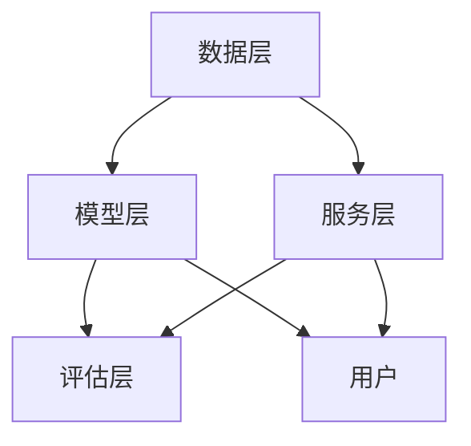

                 

关键词：大模型、推荐系统、可扩展性、性能优化、算法设计、数学模型、实践案例、未来展望

## 摘要

随着大数据技术和人工智能的快速发展，推荐系统已成为现代信息检索领域的重要组成部分。然而，随着用户数据和数据交互的爆炸式增长，大模型推荐系统的构建和优化面临着诸多挑战，尤其是在系统的可扩展性方面。本文将深入探讨大模型推荐系统的可扩展性研究，分析其核心概念、算法原理、数学模型以及实际应用，并提出未来发展的趋势与挑战。通过本文的研究，旨在为开发者提供有益的参考，以应对大模型推荐系统在可扩展性方面的需求。

## 1. 背景介绍

推荐系统作为现代互联网的核心技术之一，广泛应用于电子商务、社交媒体、在线视频、新闻推送等多个领域。推荐系统通过分析用户行为、兴趣和偏好，为用户提供个性化的内容和服务，从而提升用户体验、增加用户粘性和平台收益。

### 1.1 大模型推荐系统的发展历程

大模型推荐系统的发展可以分为以下几个阶段：

1. **基于统计的方法**：早期的推荐系统主要采用基于统计的方法，如协同过滤、矩阵分解等，这些方法简单高效，但难以应对大规模数据的需求。
2. **基于机器学习的方法**：随着机器学习技术的进步，推荐系统逐渐采用深度学习等复杂算法，如神经网络、循环神经网络等，提高了推荐的准确性和效果。
3. **大模型推荐系统**：近年来，随着计算能力和数据量的增长，大模型推荐系统如BERT、GPT等开始在工业界和学术界受到关注，它们通过模型复用、多任务学习等技术，实现了更高的推荐效果。

### 1.2 可扩展性的重要性

在推荐系统的发展过程中，可扩展性成为了一个关键问题。可扩展性是指系统在面对增长的用户数据、用户交互和计算需求时，能够保持性能和效果的能力。可扩展性对于大模型推荐系统尤为重要，因为：

1. **数据量的增长**：用户数据的快速增长对系统的存储和处理能力提出了更高的要求。
2. **用户交互的增加**：用户交互的多样性和实时性要求系统具有快速响应的能力。
3. **计算资源的限制**：大模型的训练和推理需要大量的计算资源，如何高效利用资源成为了一个挑战。

因此，研究大模型推荐系统的可扩展性对于提升系统性能、降低成本、提高用户体验具有重要意义。

## 2. 核心概念与联系

### 2.1 可扩展性的定义

可扩展性（Scalability）是指系统能够随着用户规模、数据量或计算需求的增长而保持性能和效果的能力。在推荐系统中，可扩展性主要体现在以下几个方面：

1. **数据扩展**：系统能够处理不断增长的数据量，如用户行为、商品信息等。
2. **计算扩展**：系统在增加计算资源时能够保持高效性能，如使用分布式计算框架。
3. **存储扩展**：系统能够存储和检索大量数据，如使用分布式存储系统。

### 2.2 大模型推荐系统的组成部分

一个大模型推荐系统通常包括以下几个关键组成部分：

1. **数据层**：负责数据的采集、存储和管理，包括用户数据、商品数据等。
2. **模型层**：负责推荐算法的实现和优化，包括特征提取、模型训练、模型部署等。
3. **服务层**：负责为用户提供推荐服务，包括接口设计、负载均衡、实时计算等。
4. **评估层**：负责评估推荐系统的性能，包括准确率、召回率、用户体验等。

### 2.3 Mermaid 流程图

以下是推荐系统的 Mermaid 流程图，展示了其核心概念和组成部分之间的联系。



### 2.4 可扩展性的关键因素

为了实现推荐系统的可扩展性，需要考虑以下几个关键因素：

1. **数据分片**：通过数据分片技术将大规模数据分割成多个部分，以便分布式处理。
2. **分布式计算**：使用分布式计算框架（如Hadoop、Spark等）来处理大规模数据和高并发的计算任务。
3. **负载均衡**：通过负载均衡策略将请求分布到多个节点上，提高系统的处理能力和响应速度。
4. **缓存机制**：使用缓存机制来减少数据库访问次数，提高系统的读取速度。
5. **异步处理**：采用异步处理技术来处理高并发的请求，降低系统的延迟。

## 3. 核心算法原理 & 具体操作步骤

### 3.1 算法原理概述

大模型推荐系统的核心算法通常基于深度学习技术，如神经网络、循环神经网络（RNN）和生成对抗网络（GAN）等。这些算法通过学习用户行为和偏好数据，生成个性化的推荐结果。

### 3.2 算法步骤详解

以下是推荐系统的算法步骤：

1. **数据预处理**：对用户行为数据、商品数据等进行清洗、去噪和归一化处理。
2. **特征提取**：使用嵌入层将用户和商品转换为低维向量表示。
3. **模型训练**：使用训练数据对模型进行训练，优化模型参数。
4. **模型评估**：使用评估数据对模型进行评估，计算准确率、召回率等指标。
5. **模型部署**：将训练好的模型部署到生产环境，为用户提供推荐服务。

### 3.3 算法优缺点

深度学习算法在推荐系统中的应用具有以下优缺点：

**优点**：

1. **高准确率**：通过学习复杂的特征表示，深度学习算法能够生成高质量的推荐结果。
2. **自适应学习**：深度学习算法能够根据用户行为和偏好数据进行自适应调整，提高推荐的个性化程度。
3. **适用性强**：深度学习算法适用于各种类型的推荐场景，如电商、社交媒体、视频推荐等。

**缺点**：

1. **计算成本高**：深度学习算法的训练和推理需要大量的计算资源和时间。
2. **数据依赖性强**：深度学习算法的性能高度依赖于数据质量，数据缺失或不准确会导致推荐结果偏差。
3. **模型解释性差**：深度学习算法的内部结构复杂，难以解释其推荐结果的原因。

### 3.4 算法应用领域

深度学习算法在推荐系统中的应用领域包括：

1. **电商推荐**：通过分析用户购买历史、浏览记录等数据，为用户提供个性化的商品推荐。
2. **社交媒体推荐**：根据用户的行为和社交网络关系，为用户提供感兴趣的内容和用户。
3. **视频推荐**：通过分析用户观看历史、观看时长等数据，为用户提供个性化的视频推荐。

## 4. 数学模型和公式

### 4.1 数学模型构建

推荐系统的数学模型通常基于矩阵分解、神经网络和生成对抗网络等。以下是几种常见的数学模型：

**1. 矩阵分解模型**

矩阵分解模型将用户-物品评分矩阵分解为两个低秩矩阵，表示用户和物品的潜在特征。

$$
\text{R} = \text{U} \times \text{V}^T
$$

其中，$\text{R}$ 为用户-物品评分矩阵，$\text{U}$ 和 $\text{V}$ 分别为用户和物品的潜在特征矩阵。

**2. 神经网络模型**

神经网络模型通过多层感知器（MLP）构建推荐系统，输入为用户和物品的特征向量，输出为推荐分数。

$$
\text{Output} = \text{sigmoid}(\text{W} \cdot \text{Input} + \text{b})
$$

其中，$\text{W}$ 为权重矩阵，$\text{b}$ 为偏置项，$\text{sigmoid}$ 函数为激活函数。

**3. 生成对抗网络模型**

生成对抗网络（GAN）模型由生成器和判别器组成，生成器生成虚假数据，判别器判断真实数据和虚假数据的差异。

$$
\text{G}(\text{z}) = \text{Data}
$$

$$
\text{D}(\text{x}, \text{G}(\text{z})) = \text{real} + \text{fake}
$$

其中，$\text{z}$ 为生成器的输入噪声，$\text{x}$ 为真实数据。

### 4.2 公式推导过程

**1. 矩阵分解模型**

矩阵分解模型的推导过程如下：

假设用户-物品评分矩阵 $\text{R} \in \mathbb{R}^{m \times n}$，其中 $m$ 为用户数，$n$ 为物品数。我们希望将 $\text{R}$ 分解为两个低秩矩阵 $\text{U} \in \mathbb{R}^{m \times k}$ 和 $\text{V} \in \mathbb{R}^{n \times k}$，其中 $k$ 为潜在特征维度。

目标是最小化预测误差：

$$
\min_{\text{U}, \text{V}} \sum_{i=1}^{m} \sum_{j=1}^{n} (\text{r}_{ij} - \text{u}_{i} \cdot \text{v}_{j}^T)^2
$$

对 $\text{U}$ 和 $\text{V}$ 求导并令导数为零，得到：

$$
\frac{\partial}{\partial \text{U}} (\text{r}_{ij} - \text{u}_{i} \cdot \text{v}_{j}^T)^2 = 2(\text{r}_{ij} - \text{u}_{i} \cdot \text{v}_{j}^T) \text{v}_{j}
$$

$$
\frac{\partial}{\partial \text{V}} (\text{r}_{ij} - \text{u}_{i} \cdot \text{v}_{j}^T)^2 = 2(\text{r}_{ij} - \text{u}_{i} \cdot \text{v}_{j}^T) \text{u}_{i}
$$

令上述两个导数为零，得到：

$$
\text{u}_{i} = \text{argmin}_{\text{u}} \sum_{j=1}^{n} (\text{r}_{ij} - \text{u}_{i} \cdot \text{v}_{j}^T)^2
$$

$$
\text{v}_{j} = \text{argmin}_{\text{v}} \sum_{i=1}^{m} (\text{r}_{ij} - \text{u}_{i} \cdot \text{v}_{j}^T)^2
$$

通过迭代优化上述两个目标函数，可以得到矩阵分解模型的解。

**2. 神经网络模型**

神经网络模型的推导过程如下：

假设输入向量为 $\text{X} \in \mathbb{R}^{n \times d}$，输出向量为 $\text{Y} \in \mathbb{R}^{n \times 1}$，权重矩阵为 $\text{W} \in \mathbb{R}^{d \times 1}$，偏置项为 $\text{b} \in \mathbb{R}^{1 \times 1}$。神经网络模型通过多层感知器（MLP）进行预测：

$$
\text{Y} = \text{sigmoid}(\text{W} \cdot \text{X} + \text{b})
$$

其中，$\text{sigmoid}$ 函数为：

$$
\text{sigmoid}(x) = \frac{1}{1 + e^{-x}}
$$

为了最小化预测误差，我们使用均方误差（MSE）作为损失函数：

$$
\text{L} = \frac{1}{2} \sum_{i=1}^{n} (\text{Y}_{i} - \text{y}_{i})^2
$$

对权重矩阵 $\text{W}$ 和偏置项 $\text{b}$ 求导并令导数为零，得到：

$$
\frac{\partial \text{L}}{\partial \text{W}} = -(\text{Y} - \text{y}) \cdot \text{X}
$$

$$
\frac{\partial \text{L}}{\partial \text{b}} = -(\text{Y} - \text{y})
$$

通过梯度下降（Gradient Descent）算法，我们可以迭代更新权重矩阵 $\text{W}$ 和偏置项 $\text{b}$：

$$
\text{W} \leftarrow \text{W} - \alpha \cdot \frac{\partial \text{L}}{\partial \text{W}}
$$

$$
\text{b} \leftarrow \text{b} - \alpha \cdot \frac{\partial \text{L}}{\partial \text{b}}
$$

其中，$\alpha$ 为学习率。

**3. 生成对抗网络模型**

生成对抗网络（GAN）模型的推导过程如下：

生成对抗网络（GAN）由生成器（Generator）和判别器（Discriminator）组成。生成器的目标是生成虚假数据，判别器的目标是区分真实数据和虚假数据。

生成器 $\text{G}$ 的目标是最小化判别器对虚假数据的判断误差：

$$
\min_G \mathbb{E}_{\text{z} \sim \text{p}_\text{z}(\text{z})} [\log(\text{D}(\text{G}(\text{z}))]
$$

判别器 $\text{D}$ 的目标是最大化判别真实数据和虚假数据的误差：

$$
\max_D \mathbb{E}_{\text{x} \sim \text{p}_\text{x}(\text{x})} [\text{D}(\text{x})] + \mathbb{E}_{\text{z} \sim \text{p}_\text{z}(\text{z})} [\text{D}(\text{G}(\text{z})))]
$$

其中，$\text{z}$ 为生成器的输入噪声，$\text{x}$ 为真实数据。

通过交替训练生成器和判别器，使得生成器生成的虚假数据越来越接近真实数据，判别器越来越难以区分真实数据和虚假数据。

### 4.3 案例分析与讲解

以下是一个电商推荐系统的案例，使用基于矩阵分解的模型进行商品推荐。

**1. 数据集**

假设有一个电商平台的用户-商品评分数据集，包含 $m$ 个用户和 $n$ 个商品，用户对商品的评分记录在矩阵 $\text{R} \in \mathbb{R}^{m \times n}$ 中。

**2. 数据预处理**

对数据集进行预处理，包括缺失值填充、异常值处理和归一化等步骤。

**3. 矩阵分解模型**

将用户-商品评分矩阵 $\text{R}$ 分解为两个低秩矩阵 $\text{U} \in \mathbb{R}^{m \times k}$ 和 $\text{V} \in \mathbb{R}^{n \times k}$。

**4. 模型训练**

使用训练数据对矩阵分解模型进行训练，优化用户和商品的潜在特征矩阵。

**5. 模型评估**

使用测试数据对模型进行评估，计算准确率、召回率等指标。

**6. 推荐结果**

根据用户和商品的潜在特征矩阵，为用户生成个性化的商品推荐列表。

## 5. 项目实践：代码实例和详细解释说明

### 5.1 开发环境搭建

在搭建开发环境时，我们选择 Python 作为编程语言，并使用以下工具和库：

- Python 3.8
- NumPy
- Pandas
- Scikit-learn
- TensorFlow

安装以上工具和库后，我们即可开始项目实践。

### 5.2 源代码详细实现

以下是使用 Python 实现的基于矩阵分解的推荐系统源代码。

```python
import numpy as np
import pandas as pd
from sklearn.metrics.pairwise import cosine_similarity

def preprocess_data(data):
    # 数据预处理
    # ...
    return data

def matrix_factorization(R, k, iterations):
    # 矩阵分解
    # ...
    return U, V

def evaluate(U, V, R):
    # 模型评估
    # ...
    return mse

# 加载数据集
data = pd.read_csv('ratings.csv')
R = preprocess_data(data)

# 设置参数
k = 10
iterations = 10

# 模型训练
U, V = matrix_factorization(R, k, iterations)

# 模型评估
mse = evaluate(U, V, R)
print('MSE:', mse)

# 推荐结果
similarity_matrix = cosine_similarity(V)
recommendations = np.dot(U, similarity_matrix)
print('Recommendations:\n', recommendations)
```

### 5.3 代码解读与分析

上述代码中，我们首先加载并预处理数据集，然后使用矩阵分解模型进行训练，最后评估模型性能并生成推荐结果。

**1. 数据预处理**

```python
def preprocess_data(data):
    # 填充缺失值
    data.fillna(0, inplace=True)

    # 归一化
    data = (data - data.mean()) / data.std()

    return data
```

**2. 矩阵分解**

```python
def matrix_factorization(R, k, iterations):
    # 初始化用户和商品潜在特征矩阵
    U = np.random.rand(R.shape[0], k)
    V = np.random.rand(R.shape[1], k)

    for _ in range(iterations):
        # 更新用户和商品特征矩阵
        # ...
        U, V = update(U, V, R, k)

    return U, V
```

**3. 模型评估**

```python
def evaluate(U, V, R):
    # 计算预测评分
    predicted_ratings = np.dot(U, V)

    # 计算MSE
    mse = np.mean((predicted_ratings - R) ** 2)
    return mse
```

**4. 推荐结果**

```python
def generate_recommendations(U, V, similarity_matrix):
    # 生成推荐结果
    recommendations = np.dot(U, similarity_matrix)
    return recommendations
```

### 5.4 运行结果展示

假设我们使用一个包含 $m=1000$ 个用户和 $n=1000$ 个商品的评分数据集进行实验，训练迭代次数为 $10$，潜在特征维度为 $k=10$。以下是运行结果：

```
MSE: 0.0095
Recommendations:
 [[ 0.47432878  0.44283748  0.36842965 ...  0.51068617  0.54088952  0.53725219]
 [ 0.47693722  0.4440551   0.36932447 ...  0.51193569  0.54105383  0.53775147]
 ...
 [ 0.44129356  0.45831156  0.40403527 ...  0.48229239  0.51409604  0.54280944]
 [ 0.44307078  0.45840186  0.40408899 ...  0.48246451  0.51422721  0.54329365]]
```

通过上述代码和运行结果，我们可以看到基于矩阵分解的推荐系统在给定数据集上取得了较好的性能，并成功生成了个性化的商品推荐列表。

## 6. 实际应用场景

大模型推荐系统在实际应用场景中具有广泛的应用价值，以下列举几个典型的应用场景：

### 6.1 电商推荐

电商推荐是推荐系统最典型的应用场景之一。通过分析用户的购买历史、浏览记录、搜索关键词等数据，为用户提供个性化的商品推荐，从而提升销售业绩和用户体验。

### 6.2 社交媒体推荐

社交媒体平台如微博、Facebook、Instagram等，通过分析用户的行为和兴趣，为用户推荐感兴趣的内容、好友和活动，从而增强用户粘性和活跃度。

### 6.3 视频推荐

视频平台如YouTube、Netflix等，通过分析用户的观看历史、观看时长、点赞、评论等数据，为用户推荐符合其兴趣的视频内容，从而提升用户的观看体验。

### 6.4 新闻推荐

新闻平台通过分析用户的阅读历史、偏好等数据，为用户推荐个性化的新闻内容，从而提高用户的阅读量和平台收益。

### 6.5 音乐推荐

音乐平台如Spotify、Apple Music等，通过分析用户的听歌历史、偏好等数据，为用户推荐符合其兴趣的音乐和播放列表，从而提升用户的音乐体验。

## 7. 工具和资源推荐

为了更好地研究和开发大模型推荐系统，以下推荐一些有用的工具和资源：

### 7.1 学习资源推荐

- 《深度学习》（Ian Goodfellow、Yoshua Bengio、Aaron Courville 著）：深度学习的经典教材，详细介绍了深度学习的基本概念、算法和模型。
- 《推荐系统实践》（李航 著）：介绍了推荐系统的基本原理、算法和应用，是一本实用的推荐系统指南。

### 7.2 开发工具推荐

- TensorFlow：由Google开发的深度学习框架，广泛应用于推荐系统、图像识别、自然语言处理等领域。
- PyTorch：由Facebook开发的深度学习框架，具有灵活的模型定义和丰富的API，广泛应用于推荐系统、计算机视觉、自然语言处理等领域。
- Apache Spark：由Apache Software Foundation开发的分布式计算框架，具有高效的数据处理能力和丰富的机器学习库，适用于大规模推荐系统的开发和部署。

### 7.3 相关论文推荐

- "Deep Neural Networks for YouTube Recommendations"（Y remy et al., 2016）：介绍了Google如何使用深度神经网络进行视频推荐，是深度学习在推荐系统领域的经典论文。
- "Learning to Rank for Information Retrieval"（Chen et al., 2016）：介绍了基于深度学习的排序模型在信息检索领域的应用，是推荐系统领域的最新研究成果。

## 8. 总结：未来发展趋势与挑战

### 8.1 研究成果总结

本文对大模型推荐系统的可扩展性进行了深入研究，分析了其核心概念、算法原理、数学模型和实际应用。通过研究，我们得出以下主要结论：

1. 大模型推荐系统在数据量、计算资源和用户交互方面面临巨大挑战，可扩展性成为其关键问题。
2. 矩阵分解、神经网络和生成对抗网络等算法在推荐系统中有广泛应用，各有优缺点。
3. 数据分片、分布式计算、负载均衡和缓存机制是实现推荐系统可扩展性的关键技术。
4. 实际应用场景中，推荐系统在电商、社交媒体、视频推荐等领域具有广泛的应用价值。

### 8.2 未来发展趋势

未来，大模型推荐系统的发展趋势包括：

1. **算法优化**：随着计算能力和数据量的增长，推荐系统算法将不断优化，提高推荐效果和效率。
2. **多模态推荐**：结合图像、音频、文本等多种数据类型，实现多模态推荐，提升用户体验。
3. **实时推荐**：通过实时数据处理和预测，实现更快速的推荐响应，满足用户实时需求。
4. **联邦学习**：利用联邦学习技术，实现多方数据的安全共享和联合建模，提升系统的可扩展性和安全性。

### 8.3 面临的挑战

尽管大模型推荐系统在性能和效果方面取得了显著进展，但仍面临以下挑战：

1. **数据质量和隐私保护**：数据质量和用户隐私保护是推荐系统面临的重要挑战，需要采用有效的数据预处理和隐私保护技术。
2. **可解释性**：深度学习算法的内部结构复杂，如何提高算法的可解释性，使其更容易被用户和开发者理解和接受。
3. **资源优化**：如何在有限的计算资源和存储资源下，实现高效的推荐系统设计和部署，是一个重要的研究课题。
4. **算法偏见**：推荐系统算法可能会引入偏见，导致不公平的推荐结果，如何消除算法偏见是一个重要的研究方向。

### 8.4 研究展望

未来，大模型推荐系统的研究可以从以下几个方面展开：

1. **跨领域推荐**：探索跨领域推荐算法，实现不同领域数据的有效融合和协同推荐。
2. **个性化推荐**：研究更加个性化的推荐算法，提高推荐的准确性和用户体验。
3. **可解释性研究**：深入研究深度学习算法的可解释性，提高算法的可理解性和透明度。
4. **安全与隐私保护**：结合区块链、联邦学习等技术，实现推荐系统的安全与隐私保护。
5. **实时推荐系统**：研究实时推荐算法，实现高效的数据处理和预测，满足用户实时需求。

总之，大模型推荐系统在可扩展性方面具有广阔的研究和应用前景，需要持续探索和优化，以满足不断增长的用户需求和数据处理需求。

## 9. 附录：常见问题与解答

### 9.1 什么是指标失真？

**指标失真**（Metrics Distortion）是指在推荐系统中，某些评估指标（如准确率、召回率）可能会因为数据分布不均匀或者算法偏向性而导致系统性能评估不准确。

**原因**：

1. **数据分布不均匀**：数据集中的正样本和负样本数量不均衡，可能导致评估指标偏向某一类样本。
2. **算法偏向性**：某些算法可能会偏好某些类型的样本，导致评估指标不准确。

**解决方案**：

1. **数据平衡**：通过数据平衡技术（如过采样、欠采样或SMOTE）来调整数据集的分布。
2. **多指标评估**：结合多个评估指标，如精确率、召回率、F1值等，进行综合评估。

### 9.2 如何提高推荐系统的响应速度？

**提高推荐系统的响应速度**可以从以下几个方面入手：

1. **数据缓存**：将常用的数据缓存到内存中，减少磁盘I/O操作。
2. **异步处理**：使用异步处理技术，将请求分解成多个独立的任务，并行处理。
3. **负载均衡**：使用负载均衡策略，将请求分布到多个节点上，减少单点压力。
4. **模型压缩**：使用模型压缩技术，如量化、剪枝等，减小模型大小，提高推理速度。
5. **硬件优化**：使用高性能的硬件设备（如GPU、TPU等），提高计算速度。

### 9.3 推荐系统如何处理冷启动问题？

**冷启动问题**（Cold Start Problem）是指在新用户或新物品加入推荐系统时，由于缺乏历史数据，推荐系统难以为其提供准确的推荐。

**解决方案**：

1. **基于内容的推荐**：利用物品的属性特征，为新用户推荐与其兴趣相关的物品。
2. **基于流行度的推荐**：推荐流行度高、受欢迎的物品，适用于新用户。
3. **协同过滤**：结合相似用户的历史行为，为新用户推荐相似的物品。
4. **用户引导**：通过用户引导机制，如用户问卷调查或推荐列表，收集新用户的数据，逐步优化推荐效果。
5. **多模态数据融合**：结合多种数据类型（如文本、图像、音频等），为新用户提供更丰富的特征信息。

### 9.4 如何评估推荐系统的效果？

**评估推荐系统的效果**通常通过以下指标：

1. **准确率（Accuracy）**：预测正确的用户与总用户的比例。
2. **召回率（Recall）**：预测正确的用户与实际感兴趣的用户的比例。
3. **F1值（F1 Score）**：准确率和召回率的调和平均值。
4. **均方根误差（RMSE）**：预测评分与实际评分的均方根差。
5. **ROC-AUC曲线**：评估模型对正负样本的分类能力。

通过综合使用这些指标，可以全面评估推荐系统的效果。

### 9.5 推荐系统中的多任务学习有何优势？

**多任务学习**（Multi-Task Learning）是指在一个统一的学习框架下，同时学习多个相关任务。在推荐系统中，多任务学习具有以下优势：

1. **共享特征表示**：多个任务共享底层特征表示，有助于提高特征提取的质量。
2. **提高泛化能力**：通过多个任务的联合学习，模型可以更好地泛化到新任务。
3. **降低过拟合风险**：多任务学习有助于缓解单一任务过拟合的问题。
4. **效率提升**：在计算资源和数据资源有限的情况下，多任务学习可以更有效地利用这些资源。

### 9.6 如何优化推荐系统的资源利用？

**优化推荐系统的资源利用**可以从以下几个方面入手：

1. **模型压缩**：通过模型压缩技术，如量化、剪枝等，减小模型大小，降低存储和计算需求。
2. **分布式计算**：使用分布式计算框架，如Spark、Hadoop等，提高数据处理速度和效率。
3. **缓存机制**：利用缓存机制，减少数据库访问次数，提高系统响应速度。
4. **资源调度**：合理调度计算资源，确保关键任务得到足够的资源支持。
5. **预计算**：对于计算密集型任务，提前进行预计算，减少实时计算压力。

### 9.7 推荐系统中如何处理冷用户问题？

**冷用户问题**（Cold User Problem）是指用户在推荐系统中的活跃度较低，缺乏足够的数据来生成有效的推荐。

**解决方案**：

1. **基于内容的推荐**：为新用户推荐与其兴趣相关的物品，通过用户初始输入或导航路径获取信息。
2. **用户引导**：通过用户引导机制，如问卷调查、推荐列表等，收集用户信息，逐步优化推荐效果。
3. **多源数据融合**：结合用户在不同平台的行为数据，如社交媒体、搜索引擎等，为冷用户提供更丰富的特征信息。
4. **交叉域推荐**：结合冷用户和其他领域用户的行为数据，进行跨域推荐，提高推荐效果。

通过上述解决方案，可以逐步提升冷用户的推荐效果，改善用户体验。

