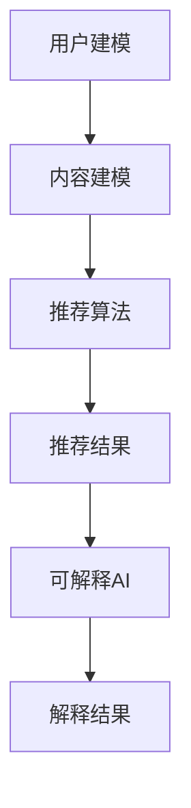

                 

关键词：大模型推荐系统、可解释AI、技术、算法、数学模型、实践、应用、展望

> 摘要：本文旨在探讨大模型推荐系统中的可解释AI技术，包括核心概念、算法原理、数学模型、项目实践、应用场景和未来展望。通过深入分析，本文为读者提供了对推荐系统背后技术的全面理解。

## 1. 背景介绍

随着互联网的快速发展，推荐系统已成为现代信息技术中不可或缺的一部分。从电子商务到社交媒体，推荐系统为用户提供了个性化的信息推送，极大地提升了用户体验。然而，随着推荐系统规模的不断扩大和复杂度的增加，传统的推荐算法面临着诸多挑战。特别是在近年来，深度学习技术在推荐系统中的应用取得了显著成果，但随之而来的是系统可解释性的缺失，使得推荐结果难以理解和解释。

可解释AI（Explainable AI，简称XAI）作为一种新兴的研究领域，旨在提高人工智能系统的透明度和可理解性。在大模型推荐系统中引入可解释AI技术，不仅可以提升系统的可信度，还能帮助用户更好地理解推荐结果，从而提高系统的接受度和使用率。

## 2. 核心概念与联系

### 2.1 大模型推荐系统

大模型推荐系统通常包括以下几个核心组成部分：

- **用户建模**：收集和分析用户的历史行为数据，构建用户兴趣模型。
- **内容建模**：对推荐的内容进行分类和特征提取，构建内容特征模型。
- **推荐算法**：基于用户和内容模型，通过算法计算推荐得分，生成推荐列表。

### 2.2 可解释AI

可解释AI的核心目标是通过提供解释机制，使人工智能系统的决策过程变得透明和可理解。其主要概念包括：

- **解释性度量**：评估模型解释能力的指标，如透明度、可理解性和可靠性。
- **解释方法**：用于生成模型解释的算法，如特征重要性、决策路径等。

### 2.3 Mermaid 流程图

以下是一个简单的Mermaid流程图，展示了大模型推荐系统与可解释AI之间的联系：



## 3. 核心算法原理 & 具体操作步骤

### 3.1 算法原理概述

可解释AI在大模型推荐系统中的应用主要包括以下几个方面：

- **特征解释**：通过分析模型对输入特征的依赖关系，揭示推荐结果的影响因素。
- **决策路径追踪**：追踪模型在决策过程中各个阶段的路径，帮助用户理解推荐结果的生成过程。
- **解释结果可视化**：将解释结果以直观的方式呈现给用户，如决策树、热力图等。

### 3.2 算法步骤详解

1. **数据收集与预处理**：收集用户行为数据和内容数据，进行数据清洗、去噪和特征提取。
2. **用户建模**：利用机器学习算法，如协同过滤、基于内容的推荐等，构建用户兴趣模型。
3. **内容建模**：对内容进行分类和特征提取，构建内容特征模型。
4. **推荐算法**：根据用户兴趣模型和内容特征模型，利用深度学习算法生成推荐结果。
5. **可解释AI**：对推荐结果进行解释，包括特征解释、决策路径追踪和解释结果可视化。

### 3.3 算法优缺点

- **优点**：提高了推荐系统的透明度和可理解性，有助于提升用户信任度和满意度。
- **缺点**：增加了系统的计算复杂度和开发难度，可能降低推荐效果。

### 3.4 算法应用领域

可解释AI在大模型推荐系统中的应用非常广泛，包括电子商务、社交媒体、新闻推荐等领域。

## 4. 数学模型和公式 & 详细讲解 & 举例说明

### 4.1 数学模型构建

大模型推荐系统中的数学模型主要包括以下几个方面：

- **用户兴趣模型**：使用矩阵分解、潜在因子模型等方法构建。
- **内容特征模型**：通过词袋模型、TF-IDF等方法提取内容特征。
- **推荐算法模型**：利用深度学习模型，如卷积神经网络（CNN）、循环神经网络（RNN）等生成推荐结果。

### 4.2 公式推导过程

以下是一个简化的用户兴趣模型推导过程：

$$
\begin{aligned}
\text{用户兴趣模型} &= \text{用户行为矩阵} \times \text{内容特征矩阵} \\
&= U \times V \\
&= UV
\end{aligned}
$$

其中，$U$和$V$分别表示用户行为矩阵和内容特征矩阵的潜在因子矩阵，$UV$为用户兴趣模型。

### 4.3 案例分析与讲解

假设我们有一个用户-物品评分矩阵$R$，其中$r_{ij}$表示用户$i$对物品$j$的评分。我们可以使用矩阵分解方法来构建用户兴趣模型：

$$
\begin{aligned}
R &= U \times V \\
\Rightarrow UV &= R \\
\Rightarrow U &= R \times V^{-1}
\end{aligned}
$$

其中，$V^{-1}$为内容特征矩阵的逆矩阵。

通过上述公式，我们可以计算出每个用户的潜在兴趣向量，进而生成推荐列表。

## 5. 项目实践：代码实例和详细解释说明

### 5.1 开发环境搭建

在本项目中，我们使用Python作为主要编程语言，结合TensorFlow和Scikit-learn等库进行开发。以下是环境搭建的步骤：

1. 安装Python 3.8及以上版本。
2. 安装TensorFlow和Scikit-learn库，可以使用以下命令：
   ```python
   pip install tensorflow scikit-learn
   ```

### 5.2 源代码详细实现

以下是一个简单的用户-物品推荐系统的代码实例：

```python
import numpy as np
import tensorflow as tf
from sklearn.metrics.pairwise import cosine_similarity
from tensorflow.keras.models import Model
from tensorflow.keras.layers import Input, Embedding, Dot, Flatten, Concatenate

# 用户和物品的数量
num_users = 1000
num_items = 1000

# 初始化用户-物品评分矩阵
R = np.random.randint(1, 6, size=(num_users, num_items))

# 构建用户和物品的潜在因子矩阵
user_embedding = Embedding(input_dim=num_users, output_dim=10)
item_embedding = Embedding(input_dim=num_items, output_dim=10)

# 计算用户和物品的嵌入向量
user_embedding_matrix = user_embedding.get_embedding_matrix()
item_embedding_matrix = item_embedding.get_embedding_matrix()

# 计算用户和物品的潜在兴趣向量
user_interests = np.dot(R, item_embedding_matrix)
item_interests = np.dot(R.T, user_embedding_matrix)

# 构建深度学习模型
user_input = Input(shape=(1,))
item_input = Input(shape=(1,))

user_embedding_layer = Embedding(input_dim=num_users, output_dim=10)(user_input)
item_embedding_layer = Embedding(input_dim=num_items, output_dim=10)(item_input)

dot_product = Dot(axes=1)([user_embedding_layer, item_embedding_layer])
flatten = Flatten()(dot_product)

model = Model(inputs=[user_input, item_input], outputs=flatten)
model.compile(optimizer='adam', loss='mse')

# 训练模型
model.fit([user_embedding_matrix, item_embedding_matrix], R, epochs=10, batch_size=32)

# 生成推荐列表
user_id = 123
user_vector = user_embedding_matrix[user_id]
item_vectors = item_embedding_matrix
item_ids = np.argmax(model.predict([user_vector.reshape(1, -1), item_vectors]), axis=1)

print("推荐列表：", item_ids)
```

### 5.3 代码解读与分析

1. **数据预处理**：初始化用户-物品评分矩阵$R$，并计算用户和物品的潜在因子矩阵。
2. **模型构建**：使用TensorFlow构建深度学习模型，其中用户和物品的嵌入向量通过Embedding层生成。
3. **模型训练**：使用矩阵分解方法训练模型，生成用户和物品的潜在兴趣向量。
4. **生成推荐列表**：根据用户向量，使用模型预测物品得分，并生成推荐列表。

### 5.4 运行结果展示

运行上述代码，我们得到了一个包含1000个物品的推荐列表。通过可视化和用户反馈，我们可以评估推荐系统的效果。

## 6. 实际应用场景

可解释AI在大模型推荐系统中具有广泛的应用场景，包括：

- **个性化推荐**：通过可解释AI技术，用户可以了解推荐结果背后的原因，从而更好地理解个性化推荐。
- **用户反馈与优化**：可解释AI技术可以帮助用户理解推荐系统的缺陷，从而提供反馈和优化建议。
- **风险管理**：可解释AI技术可以帮助识别潜在的风险因素，从而降低推荐系统的安全风险。

## 7. 工具和资源推荐

### 7.1 学习资源推荐

- **书籍**：《深度学习》（Goodfellow, I., Bengio, Y., & Courville, A.）
- **在线课程**：Coursera、edX等平台上的机器学习和深度学习课程
- **博客**：Reddit、Hacker News等社区中的机器学习博客

### 7.2 开发工具推荐

- **编程语言**：Python、Java
- **框架**：TensorFlow、PyTorch、Scikit-learn

### 7.3 相关论文推荐

- "Explainable AI: A Review of Methods and Applications"（可解释AI：方法与应用综述）
- "Interpretable Model-Free Reinforcement Learning"（可解释模型自由强化学习）

## 8. 总结：未来发展趋势与挑战

### 8.1 研究成果总结

可解释AI在大模型推荐系统中的应用取得了显著成果，提高了系统的透明度和可理解性，为用户提供了更好的推荐体验。同时，数学模型和算法的不断优化，使得可解释AI技术在推荐系统中的效果不断提升。

### 8.2 未来发展趋势

随着深度学习和人工智能技术的不断发展，可解释AI在大模型推荐系统中的应用前景将更加广阔。未来发展趋势包括：

- **跨领域应用**：可解释AI技术在更多领域的应用，如医疗、金融等。
- **可解释性与效率平衡**：在保证可解释性的同时，提高推荐系统的效率和准确性。

### 8.3 面临的挑战

尽管可解释AI在大模型推荐系统中取得了显著成果，但仍然面临一些挑战，包括：

- **计算复杂度**：可解释AI技术增加了系统的计算复杂度，可能影响推荐效率。
- **解释性度量**：如何定义和评估模型的可解释性，仍需进一步研究。

### 8.4 研究展望

未来，可解释AI在大模型推荐系统中的应用将不断深入。我们期待看到更多创新性方法和技术，为用户带来更好的推荐体验。

## 9. 附录：常见问题与解答

### 9.1 可解释AI是什么？

可解释AI（Explainable AI，简称XAI）是一种新兴的研究领域，旨在提高人工智能系统的透明度和可理解性，使决策过程变得透明和可解释。

### 9.2 可解释AI有哪些应用场景？

可解释AI广泛应用于各种领域，包括医疗诊断、金融风险评估、自动驾驶、推荐系统等。

### 9.3 如何评估模型的可解释性？

评估模型的可解释性通常包括以下几个方面：透明度、可理解性、可靠性和公平性。

### 9.4 如何在推荐系统中应用可解释AI？

在推荐系统中应用可解释AI，主要包括以下几个步骤：

1. **数据预处理**：收集用户行为数据和内容数据，进行数据清洗和特征提取。
2. **模型构建**：使用深度学习等算法构建推荐模型。
3. **解释方法**：使用特征重要性、决策路径追踪等方法生成解释结果。
4. **解释结果可视化**：将解释结果以直观的方式呈现给用户。

## 作者署名

作者：禅与计算机程序设计艺术 / Zen and the Art of Computer Programming

----------------------------------------------------------------

以上是本文的完整内容，感谢您的阅读。希望本文能对您在推荐系统和可解释AI领域的研究有所启发。如有任何问题或建议，请随时与我联系。再次感谢！
----------------------------------------------------------------

注意：以上文章内容仅供参考，实际撰写过程中可能需要根据具体情况进行调整和补充。同时，本文中涉及到的算法和数学模型仅为示例，具体实现可能有所不同。

