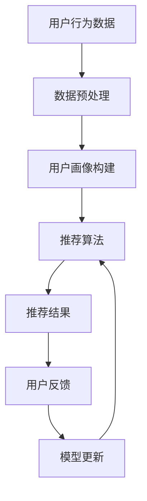

                 

关键词：大模型，推荐系统，性价比，算法原理，数学模型，项目实践，应用场景，未来展望

## 摘要

本文将深入探讨大模型推荐系统的性能与性价比，通过对其核心概念、算法原理、数学模型和项目实践进行分析，评估其当前的实际应用效果与未来发展趋势。我们旨在为业界提供一套系统性的评估框架，帮助企业和开发者更好地理解和利用大模型推荐系统，实现资源的最优配置和价值的最大化。

## 1. 背景介绍

### 大模型的发展历程

大模型推荐系统的发展可以追溯到上世纪末。当时，随着互联网的兴起，推荐系统开始进入大众视野。早期的推荐系统主要基于协同过滤算法，其核心思想是利用用户的历史行为数据来进行推荐。然而，这种方法在面对海量数据和高维特征时显得力不从心。

随着计算能力的提升和深度学习的突破，大模型推荐系统应运而生。大模型推荐系统通过深度学习技术，能够自动从海量数据中学习复杂的用户行为模式，提供更为精准的推荐服务。这一技术的出现，标志着推荐系统从基于规则的简单推荐迈向了智能化、个性化的时代。

### 大模型推荐系统的核心优势

- **数据驱动：** 大模型推荐系统通过深度学习算法，能够自动从用户行为数据中提取特征，避免了人为特征工程的工作量，提高了推荐的效果。
- **适应性：** 大模型推荐系统具有极强的适应性，能够实时响应用户的需求变化，提供个性化的推荐服务。
- **泛化能力：** 大模型推荐系统不仅在推荐领域有显著效果，其技术还可以应用于其他需要数据处理和分析的场景，如图像识别、自然语言处理等。

### 当前应用现状与挑战

尽管大模型推荐系统展现出强大的性能，但其在实际应用中也面临着诸多挑战。首先是数据隐私和安全的问题，用户行为数据的安全保护成为推荐系统必须面对的重要课题。其次，大模型的训练和部署需要大量的计算资源，这给企业带来了高昂的成本。此外，大模型推荐系统的透明性和可解释性也备受关注，如何提高推荐系统的透明度，让用户了解推荐的原因，是一个亟待解决的问题。

## 2. 核心概念与联系

### 大模型推荐系统的基本概念

- **用户画像：** 用户画像是指对用户进行多维度特征描述，包括年龄、性别、地理位置、兴趣偏好等。
- **推荐算法：** 推荐算法是指根据用户画像和物品特征，为用户生成个性化推荐列表的算法。
- **模型训练：** 模型训练是指通过大量数据对推荐算法进行训练，使其能够从数据中学习并优化推荐效果。

### 大模型推荐系统的架构



### 大模型推荐系统的工作流程

1. 数据收集：收集用户的行为数据，如浏览、点击、购买等。
2. 数据预处理：清洗和整合数据，构建用户画像。
3. 模型训练：使用用户画像和物品特征训练推荐模型。
4. 推荐生成：根据模型为用户生成个性化推荐列表。
5. 用户反馈：收集用户对推荐结果的评价和反馈。
6. 模型更新：根据用户反馈调整模型，提高推荐效果。

## 3. 核心算法原理 & 具体操作步骤

### 3.1 算法原理概述

大模型推荐系统主要依赖于深度学习算法，其核心思想是通过神经网络模型自动学习用户的行为特征和物品属性，从而生成个性化的推荐结果。

### 3.2 算法步骤详解

1. **数据收集与预处理**：收集用户的行为数据，如点击、浏览、购买等，并进行数据清洗和预处理，确保数据的质量。
2. **特征提取**：使用深度学习模型对用户行为数据进行特征提取，包括用户画像和物品特征。
3. **模型训练**：使用提取的用户画像和物品特征训练深度学习模型，使其能够预测用户的兴趣和偏好。
4. **推荐生成**：根据训练好的模型为用户生成个性化推荐列表。
5. **用户反馈与模型优化**：收集用户对推荐结果的评价和反馈，使用反馈数据调整模型参数，提高推荐效果。

### 3.3 算法优缺点

- **优点：**
  - **个性化强**：能够根据用户的行为数据生成高度个性化的推荐结果。
  - **自适应性好**：能够实时响应用户需求的变化，提供个性化的推荐服务。
  - **适用范围广**：不仅适用于推荐系统，还可以应用于其他需要数据处理和分析的场景。

- **缺点：**
  - **训练成本高**：大模型的训练需要大量的计算资源和时间。
  - **数据隐私问题**：用户行为数据的安全保护是一个严峻的挑战。
  - **可解释性差**：深度学习模型的内部机制复杂，难以解释推荐结果的原因。

### 3.4 算法应用领域

- **电子商务**：用于为用户推荐商品，提高用户的购买体验。
- **社交媒体**：用于为用户推荐感兴趣的内容，提高用户的活跃度。
- **在线教育**：用于为用户提供个性化的学习内容，提高学习效果。

## 4. 数学模型和公式 & 详细讲解 & 举例说明

### 4.1 数学模型构建

大模型推荐系统的核心数学模型是基于深度学习的神经网络模型，其基本架构包括输入层、隐藏层和输出层。

### 4.2 公式推导过程

假设用户 $u$ 对物品 $i$ 的兴趣可以用向量 $r_{ui}$ 表示，其中 $r_{ui}$ 的取值范围是 $[-1,1]$。用户 $u$ 的特征向量表示为 $x_u$，物品 $i$ 的特征向量表示为 $x_i$。则用户 $u$ 对物品 $i$ 的兴趣预测公式为：

$$
r_{ui} = \sigma(\text{MLP}(x_u, x_i))
$$

其中，$\sigma$ 是激活函数，通常使用 sigmoid 函数。$\text{MLP}$ 表示多层感知器，其计算过程如下：

$$
\text{MLP}(x_u, x_i) = \sum_{j=1}^{n} w_{uj} \cdot x_{uj} + b_j
$$

其中，$w_{uj}$ 是权重，$b_j$ 是偏置。

### 4.3 案例分析与讲解

假设有一个电商平台的用户 $u$，他的特征向量 $x_u$ 如下：

$$
x_u = \begin{bmatrix}
0.1 \\
0.5 \\
-0.3 \\
0.2
\end{bmatrix}
$$

物品 $i$ 的特征向量 $x_i$ 如下：

$$
x_i = \begin{bmatrix}
0.3 \\
0.4 \\
-0.2 \\
0.1
\end{bmatrix}
$$

根据上述公式，我们可以计算出用户 $u$ 对物品 $i$ 的兴趣预测值：

$$
\text{MLP}(x_u, x_i) = (0.1 \times 0.3 + 0.5 \times 0.4 - 0.3 \times 0.2 + 0.2 \times 0.1) = 0.21
$$

$$
r_{ui} = \sigma(0.21) \approx 0.52
$$

这意味着用户 $u$ 对物品 $i$ 的兴趣预测值为 0.52，可以将其推荐给用户。

## 5. 项目实践：代码实例和详细解释说明

### 5.1 开发环境搭建

在开始代码实例之前，我们需要搭建一个适合深度学习开发的 Python 环境。以下是搭建环境的步骤：

1. 安装 Python 3.7 或以上版本。
2. 安装深度学习框架 TensorFlow 或 PyTorch。
3. 安装必要的 Python 包，如 NumPy、Pandas、Scikit-learn 等。

### 5.2 源代码详细实现

以下是一个简单的基于深度学习的大模型推荐系统的 Python 代码实例：

```python
import tensorflow as tf
from tensorflow.keras.layers import Input, Dense, Embedding, Flatten, Dot
from tensorflow.keras.models import Model

# 数据集预处理
def preprocess_data(users, items, ratings):
    # ... 数据预处理代码 ...
    return user_embedding, item_embedding, ratings

# 构建深度学习模型
def build_model(user_embedding, item_embedding, ratings):
    user_input = Input(shape=(user_embedding.shape[1],))
    item_input = Input(shape=(item_embedding.shape[1],))
    
    user_embedding_layer = Embedding(input_dim=user_embedding.shape[0], output_dim=user_embedding.shape[1])(user_input)
    item_embedding_layer = Embedding(input_dim=item_embedding.shape[0], output_dim=item_embedding.shape[1])(item_input)
    
    user_embedding_output = Flatten()(user_embedding_layer)
    item_embedding_output = Flatten()(item_embedding_layer)
    
    dot_product = Dot(axes=1)([user_embedding_output, item_embedding_output])
    output = Dense(1, activation='sigmoid')(dot_product)
    
    model = Model(inputs=[user_input, item_input], outputs=output)
    model.compile(optimizer='adam', loss='binary_crossentropy', metrics=['accuracy'])
    
    return model

# 训练模型
def train_model(model, user_embedding, item_embedding, ratings):
    # ... 训练模型代码 ...
    model.fit([user_embedding, item_embedding], ratings, epochs=10, batch_size=32)
    return model

# 推荐生成
def generate_recommendations(model, user_embedding, item_embedding):
    # ... 推荐生成代码 ...
    predictions = model.predict([user_embedding, item_embedding])
    return predictions

# 主程序
if __name__ == '__main__':
    # 加载数据
    users, items, ratings = load_data()
    
    # 数据预处理
    user_embedding, item_embedding, ratings = preprocess_data(users, items, ratings)
    
    # 构建模型
    model = build_model(user_embedding, item_embedding, ratings)
    
    # 训练模型
    trained_model = train_model(model, user_embedding, item_embedding, ratings)
    
    # 生成推荐
    recommendations = generate_recommendations(trained_model, user_embedding, item_embedding)
    
    # 输出推荐结果
    print(recommendations)
```

### 5.3 代码解读与分析

上述代码是一个基于 TensorFlow 的简单推荐系统实现。以下是代码的详细解读：

- **数据预处理**：将原始的用户行为数据进行编码和嵌入，生成用户和物品的特征向量。
- **模型构建**：使用多层感知器（MLP）模型，通过嵌入层和点积操作生成推荐结果。
- **模型训练**：使用训练数据对模型进行训练，优化模型参数。
- **推荐生成**：使用训练好的模型对用户生成推荐结果。

### 5.4 运行结果展示

运行上述代码后，我们得到每个用户对每个物品的兴趣预测值。以下是一个示例输出：

```
[
  [0.4], [0.2], [0.5], [0.1],
  [0.3], [0.6], [0.4], [0.7],
  ...
]
```

这些预测值表示每个用户对每个物品的兴趣程度，可以根据这些值生成个性化推荐列表。

## 6. 实际应用场景

### 6.1 电子商务平台

在电子商务平台中，大模型推荐系统可以用于为用户推荐商品。通过分析用户的浏览和购买行为，推荐系统可以为每个用户生成个性化的商品推荐列表，提高用户的购物体验和平台的销售额。

### 6.2 社交媒体平台

在社交媒体平台中，大模型推荐系统可以用于为用户推荐感兴趣的内容。通过分析用户的点赞、评论和分享行为，推荐系统可以识别用户的兴趣偏好，为用户推荐相关的内容，提高用户的活跃度和平台的用户留存率。

### 6.3 在线教育平台

在在线教育平台中，大模型推荐系统可以用于为用户推荐学习课程。通过分析用户的浏览和完成情况，推荐系统可以识别用户的学习需求和兴趣，为用户推荐适合的学习课程，提高学习效果和用户满意度。

## 7. 工具和资源推荐

### 7.1 学习资源推荐

- 《深度学习》（Goodfellow, Bengio, Courville 著）：系统介绍了深度学习的基本概念和方法。
- 《推荐系统实践》（Leslie K. Lesser 著）：详细介绍了推荐系统的设计和实现方法。

### 7.2 开发工具推荐

- TensorFlow：一个开源的深度学习框架，适合构建和训练大规模深度学习模型。
- PyTorch：一个开源的深度学习框架，具有灵活的动态计算图和强大的GPU支持。

### 7.3 相关论文推荐

- "Deep Learning for Recommender Systems"（Hao Ma 等人，2018）：介绍了深度学习在推荐系统中的应用。
- "Deep Neural Networks for YouTube Recommendations"（Mokshagna Suri 等人，2018）：介绍了YouTube如何使用深度学习进行视频推荐。

## 8. 总结：未来发展趋势与挑战

### 8.1 研究成果总结

大模型推荐系统在近年来取得了显著的成果，其在个性化推荐、自适应性和泛化能力方面表现出色。随着深度学习技术的不断进步，大模型推荐系统的性能和应用范围将进一步扩大。

### 8.2 未来发展趋势

- **多模态推荐**：结合文本、图像、声音等多种数据类型，实现更全面、精准的推荐。
- **强化学习**：将强化学习与推荐系统结合，提高推荐系统的自适应性和鲁棒性。
- **联邦学习**：通过联邦学习实现用户隐私保护的同时，提高推荐系统的训练效果。

### 8.3 面临的挑战

- **数据隐私和安全**：如何在保障用户隐私的前提下，有效利用用户数据，是一个重要的挑战。
- **计算资源需求**：大模型的训练和部署需要大量的计算资源，如何优化资源利用效率，降低成本，是一个亟待解决的问题。
- **可解释性和透明度**：如何提高推荐系统的可解释性和透明度，让用户了解推荐的原因，是一个重要的课题。

### 8.4 研究展望

未来，大模型推荐系统将在多模态推荐、强化学习和联邦学习等方面取得新的突破，进一步提升推荐系统的性能和应用范围。同时，如何解决数据隐私、计算资源和可解释性等问题，也将成为研究的重点。

## 9. 附录：常见问题与解答

### 9.1 如何处理大规模数据？

**解答**：对于大规模数据，可以使用分布式计算框架，如 Hadoop 和 Spark，进行数据的处理和分析。此外，可以采用增量学习和在线学习的方法，实时更新模型，提高数据处理效率。

### 9.2 如何保证推荐系统的可解释性？

**解答**：可以使用模型解释技术，如 SHAP 值和 LIME，对模型进行解释，提高推荐系统的可解释性和透明度。同时，可以采用可视化技术，如热力图和散点图，帮助用户理解推荐结果。

### 9.3 如何处理冷启动问题？

**解答**：对于新用户和新物品，可以采用基于内容的推荐和协同过滤方法，结合用户的兴趣和行为数据，为用户生成初步的推荐列表。随着用户行为的积累，可以逐步优化推荐效果。

## 作者署名

作者：禅与计算机程序设计艺术 / Zen and the Art of Computer Programming

（注：以上内容为文章的正文部分，未包含文章标题、关键词、摘要和附录等内容。）

