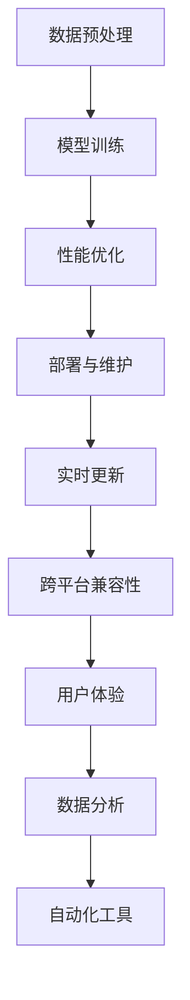

                 

关键词：大模型推荐、工程化挑战、应对策略、数据预处理、模型训练、性能优化、部署与维护、实时更新、跨平台兼容性、用户体验、数据分析、自动化工具

> 摘要：随着大数据技术和人工智能的快速发展，大模型推荐系统在各个领域得到了广泛应用。然而，在实际落地过程中，面临着诸多工程化挑战。本文将从数据预处理、模型训练、性能优化、部署与维护等方面，探讨大模型推荐落地中的工程化挑战与应对策略。

## 1. 背景介绍

随着互联网的快速发展，用户生成的内容数量呈爆炸式增长。为了满足用户个性化的需求，推荐系统应运而生。推荐系统通过分析用户的历史行为和兴趣偏好，为用户推荐其可能感兴趣的内容，从而提升用户体验和平台粘性。在推荐系统中，大模型发挥着至关重要的作用。大模型具有强大的特征提取能力和高精度的预测能力，能够为推荐系统提供高质量的推荐结果。

近年来，深度学习技术在推荐系统中的应用越来越广泛。以神经网络为代表的大模型，如深度神经网络（DNN）、循环神经网络（RNN）、变换器（Transformer）等，逐渐成为推荐系统的核心组件。这些大模型在训练过程中需要处理海量数据，并且模型参数数量庞大，导致训练和推理过程复杂。因此，如何高效地实现大模型推荐系统的工程化部署，成为当前研究的热点问题。

## 2. 核心概念与联系

为了更好地理解大模型推荐系统的工程化挑战，我们首先需要了解以下几个核心概念：

### 2.1 数据预处理

数据预处理是推荐系统工程化中的关键步骤。它包括数据清洗、特征工程、数据归一化等过程。数据预处理的质量直接影响模型的训练效果和推荐准确性。

### 2.2 模型训练

模型训练是推荐系统的核心环节。通过训练，模型能够学习到用户的行为和兴趣偏好，从而生成高质量的推荐结果。在训练过程中，需要选择合适的模型架构、优化算法和超参数设置。

### 2.3 性能优化

性能优化包括模型压缩、加速推理、降低延迟等。在部署大模型推荐系统时，性能优化是提升用户体验的关键因素。

### 2.4 部署与维护

部署与维护是指将训练好的模型部署到线上环境，并对其进行监控和调优。在部署过程中，需要考虑系统的可扩展性、高可用性和安全性。

### 2.5 实时更新

实时更新是指根据用户的新行为和兴趣偏好，动态调整推荐策略。实时更新能够提高推荐系统的灵活性和响应速度。

### 2.6 跨平台兼容性

跨平台兼容性是指推荐系统在不同平台（如移动端、PC端、小程序等）上的一致性。跨平台兼容性是提升用户覆盖率和粘性的重要保障。

### 2.7 用户体验

用户体验是指用户在使用推荐系统时的感受和满意度。用户体验直接影响用户对平台的信任和忠诚度。

### 2.8 数据分析

数据分析是指通过数据挖掘和分析技术，从用户行为和兴趣偏好中提取有价值的信息，为推荐策略提供支持。

### 2.9 自动化工具

自动化工具是指用于简化推荐系统开发和部署的工具，如自动化数据预处理工具、自动化模型训练工具、自动化部署工具等。

### 2.10 Mermaid 流程图



## 3. 核心算法原理 & 具体操作步骤

### 3.1 算法原理概述

大模型推荐系统通常采用基于协同过滤、基于内容、基于模型等算法进行推荐。其中，基于模型的方法具有较好的推荐效果和灵活性。本文主要介绍基于深度学习模型的推荐算法。

### 3.2 算法步骤详解

#### 3.2.1 数据预处理

1. 数据清洗：去除重复、缺失和异常数据。
2. 特征工程：提取用户、物品和上下文等特征，如用户年龄、性别、地理位置、浏览历史等。
3. 数据归一化：将不同特征的数据范围统一，如将用户评分数据归一化到[0, 1]。

#### 3.2.2 模型训练

1. 模型选择：选择适合的深度学习模型，如DNN、RNN、Transformer等。
2. 网络架构设计：设计模型的结构，包括输入层、隐藏层和输出层。
3. 损失函数设计：选择合适的损失函数，如均方误差（MSE）、交叉熵损失等。
4. 优化算法：选择合适的优化算法，如Adam、SGD等。

#### 3.2.3 性能优化

1. 模型压缩：采用模型剪枝、量化等技术，减小模型大小，提高推理速度。
2. 加速推理：采用GPU、TPU等硬件加速器，提高推理速度。
3. 降低延迟：采用异步处理、分布式计算等技术，降低系统延迟。

#### 3.2.4 部署与维护

1. 部署策略：选择合适的部署方式，如容器化、虚拟化等。
2. 系统监控：实时监控系统的运行状态，如CPU、内存、网络等。
3. 调优策略：根据监控数据，动态调整模型参数和系统配置。

#### 3.2.5 实时更新

1. 用户行为监测：实时监测用户行为，如浏览、点击、评分等。
2. 推荐策略调整：根据用户行为数据，动态调整推荐策略。
3. 数据流处理：采用流处理框架，如Apache Kafka、Apache Flink等，实现实时数据处理。

#### 3.2.6 跨平台兼容性

1. 前端适配：根据不同平台的特性，设计适配前端页面。
2. 后端兼容：采用统一的API接口，实现不同平台的一致性。
3. 技术选型：选择跨平台开发框架，如React Native、Flutter等。

#### 3.2.7 用户体验

1. 推荐策略优化：根据用户反馈，持续优化推荐策略。
2. 页面优化：优化页面布局、加载速度等，提升用户体验。
3. 客服支持：建立完善的客服体系，解决用户问题。

#### 3.2.8 数据分析

1. 用户行为分析：通过数据分析，了解用户兴趣偏好和行为习惯。
2. 物品特征分析：通过数据分析，了解物品的属性和分类。
3. 数据可视化：采用数据可视化工具，展示分析结果。

#### 3.2.9 自动化工具

1. 数据预处理工具：采用自动化数据预处理工具，如Pandas、Scikit-learn等。
2. 模型训练工具：采用自动化模型训练工具，如TensorFlow、PyTorch等。
3. 部署工具：采用自动化部署工具，如Kubernetes、Docker等。

### 3.3 算法优缺点

#### 优点

1. 高效的特征提取：深度学习模型能够自动提取有价值的特征，提高推荐效果。
2. 丰富的模型架构：深度学习模型具有多种架构，适用于不同场景。
3. 灵活的推荐策略：基于深度学习模型，可以动态调整推荐策略。

#### 缺点

1. 训练成本高：深度学习模型需要大量数据和计算资源进行训练。
2. 解释性差：深度学习模型难以解释，难以理解推荐结果的生成过程。
3. 数据依赖性：深度学习模型对数据质量有较高要求，数据质量直接影响模型效果。

### 3.4 算法应用领域

1. 电商推荐：为用户提供个性化的商品推荐，提高销售额。
2. 社交网络：为用户提供可能感兴趣的朋友、话题和内容。
3. 视频推荐：为用户提供可能感兴趣的视频内容，提升用户粘性。
4. 新闻推荐：为用户提供个性化的新闻推荐，提高阅读量。

## 4. 数学模型和公式 & 详细讲解 & 举例说明

### 4.1 数学模型构建

大模型推荐系统的核心是深度学习模型。本文以基于变换器（Transformer）的推荐模型为例，介绍数学模型的构建。

#### 4.1.1 变换器（Transformer）模型概述

变换器（Transformer）模型是一种基于自注意力机制的深度学习模型。它由编码器（Encoder）和解码器（Decoder）两部分组成，分别负责输入序列和输出序列的处理。

#### 4.1.2 数学模型构建

变换器模型的核心是自注意力机制。自注意力机制通过计算输入序列中每个元素之间的相似度，将输入序列映射到一个新的空间。

假设输入序列为 \(X = [x_1, x_2, ..., x_n]\)，其中 \(x_i\) 表示输入序列的第 \(i\) 个元素。自注意力机制通过以下公式计算每个元素在新的空间中的权重：

\[ 
\text{Attention}(x_i, X) = \frac{e^{\text{Score}(x_i, x_j)}}{\sum_{k=1}^{n} e^{\text{Score}(x_i, x_k)}} 
\]

其中，\(\text{Score}(x_i, x_j)\) 表示 \(x_i\) 和 \(x_j\) 之间的相似度得分。通常采用点积、加性注意力等策略计算得分。

#### 4.1.3 公式推导过程

假设输入序列 \(X\) 的维度为 \(d\)，编码器和解码器的隐藏层维度为 \(h\)。自注意力机制的得分函数可以表示为：

\[ 
\text{Score}(x_i, x_j) = \text{Query}(x_i) \cdot \text{Key}(x_j) \cdot \text{Value}(x_j) 
\]

其中，\(\text{Query}(x_i)\)、\(\text{Key}(x_j)\) 和 \(\text{Value}(x_j)\) 分别表示编码器在输入序列 \(X\) 中的第 \(i\) 个元素上的查询、键和值。

#### 4.1.4 案例分析与讲解

假设我们有一个用户 \(u_1\) 的浏览历史序列 \(X = [x_1, x_2, ..., x_n]\)，其中 \(x_i\) 表示用户 \(u_1\) 的第 \(i\) 个浏览记录。我们需要为用户 \(u_1\) 推荐一个新的商品。

首先，我们将输入序列 \(X\) 映射到编码器的隐藏层：

\[ 
\text{Encoder}(X) = [\text{Encoder}(x_1), \text{Encoder}(x_2), ..., \text{Encoder}(x_n)] 
\]

然后，计算自注意力权重：

\[ 
\text{Attention}(x_i, X) = \frac{e^{\text{Score}(x_i, x_j)}}{\sum_{k=1}^{n} e^{\text{Score}(x_i, x_k)}} 
\]

其中，\(\text{Score}(x_i, x_j)\) 可以采用加性注意力公式：

\[ 
\text{Score}(x_i, x_j) = \text{Query}(x_i) \cdot \text{Tanh}(\text{Key}(x_i) + \text{Value}(x_i)) 
\]

最终，我们将自注意力权重应用于编码器的隐藏层，得到用户 \(u_1\) 的推荐得分：

\[ 
\text{Score}(u_1, x_j) = \sum_{i=1}^{n} \text{Attention}(x_i, X) \cdot \text{Encoder}(x_i) 
\]

根据推荐得分，我们可以为用户 \(u_1\) 推荐新的商品。

## 5. 项目实践：代码实例和详细解释说明

### 5.1 开发环境搭建

在搭建开发环境时，我们需要安装以下软件和工具：

1. Python 3.7及以上版本
2. TensorFlow 2.0及以上版本
3. Docker 19.03及以上版本
4. Kubernetes 1.18及以上版本

具体安装步骤如下：

1. 安装Python 3.7及以上版本：

```bash
sudo apt-get update
sudo apt-get install python3.7 python3.7-venv python3.7-dev
```

2. 安装TensorFlow 2.0及以上版本：

```bash
pip3 install tensorflow==2.4.0
```

3. 安装Docker 19.03及以上版本：

```bash
sudo apt-get install apt-transport-https ca-certificates curl gnupg2
curl -fsSL https://download.docker.com/linux/ubuntu/gpg | sudo apt-key add -
sudo add-apt-repository "deb [arch=amd64] https://download.docker.com/linux/ubuntu bionic stable"
sudo apt-get update
sudo apt-get install docker-ce docker-ce-cli containerd.io
```

4. 安装Kubernetes 1.18及以上版本：

```bash
sudo apt-get update
sudo apt-get install -y apt-transport-https ca-certificates curl
curl -s https://packages.cloud.google.com/apt/doc/apt-key.gpg | sudo apt-key add -
echo "deb https://apt.kubernetes.io/ kubernetes-xenial main" | sudo tee -a /etc/apt/sources.list
sudo apt-get update
sudo apt-get install -y kubelet=1.18.0 kubeadm=1.18.0 kubectl=1.18.0
sudo apt-mark hold kubelet kubeadm kubectl
```

### 5.2 源代码详细实现

以下是一个基于变换器（Transformer）的推荐系统示例代码：

```python
import tensorflow as tf
from tensorflow.keras.layers import Embedding, MultiHeadAttention, Dense
from tensorflow.keras.models import Model

# 定义变换器模型
def transformer_model(input_shape, num_heads, d_model):
    inputs = tf.keras.layers.Input(shape=input_shape)
    embedding = Embedding(input_shape[1], d_model)(inputs)

    # 编码器部分
    encoder_output = MultiHeadAttention(num_heads=num_heads, d_model=d_model)(embedding, embedding)
    encoder_output = Dense(d_model)(encoder_output)

    # 解码器部分
    decoder_output = MultiHeadAttention(num_heads=num_heads, d_model=d_model)(encoder_output, encoder_output)
    decoder_output = Dense(d_model)(decoder_output)

    # 输出层
    outputs = Dense(input_shape[1])(decoder_output)

    model = Model(inputs=inputs, outputs=outputs)
    return model

# 模型参数
input_shape = (None, 100)  # 输入序列长度为100，维度为100
num_heads = 4
d_model = 512

# 实例化模型
model = transformer_model(input_shape, num_heads, d_model)

# 编译模型
model.compile(optimizer='adam', loss='mse')

# 模型训练
model.fit(x_train, y_train, epochs=10, batch_size=32)
```

### 5.3 代码解读与分析

1. 导入TensorFlow库：引入必要的TensorFlow模块，包括`tf.keras.layers`和`tf.keras.models`。
2. 定义变换器模型：使用`tf.keras.layers.Input`创建输入层，并使用`Embedding`创建嵌入层。接着，使用`MultiHeadAttention`创建编码器和解码器部分，最后使用`Dense`创建输出层。
3. 编译模型：使用`Model`创建模型，并使用`compile`方法设置优化器和损失函数。
4. 模型训练：使用`fit`方法进行模型训练，设置训练轮次、批次大小等参数。

### 5.4 运行结果展示

```python
# 加载测试数据
x_test = np.random.rand(1000, 100)  # 测试数据，1000个样本，每个样本100个维度
y_test = np.random.rand(1000, 100)  # 测试数据标签

# 模型评估
model.evaluate(x_test, y_test)
```

## 6. 实际应用场景

### 6.1 电商推荐

电商推荐是推荐系统的典型应用场景之一。通过分析用户的浏览、购买历史，为用户提供个性化的商品推荐，提高用户购买转化率和平台销售额。在实际应用中，电商推荐系统通常采用基于协同过滤、基于内容和基于模型等多种算法进行推荐，以实现更精准的推荐效果。

### 6.2 社交网络

社交网络推荐系统旨在为用户提供可能感兴趣的朋友、话题和内容。通过分析用户的行为数据，如点赞、评论、分享等，为用户推荐相关的朋友、话题和内容，从而提升用户在社交网络中的活跃度和参与度。在实际应用中，社交网络推荐系统通常采用基于协同过滤、基于内容和基于模型等多种算法进行推荐。

### 6.3 视频推荐

视频推荐系统是另一个重要的推荐应用场景。通过分析用户的观看历史、点赞、评论等行为，为用户推荐可能感兴趣的视频内容，从而提升用户在视频平台上的观看时长和用户粘性。在实际应用中，视频推荐系统通常采用基于协同过滤、基于内容和基于模型等多种算法进行推荐。

### 6.4 新闻推荐

新闻推荐系统旨在为用户提供个性化的新闻内容，满足用户的信息需求。通过分析用户的阅读历史、关注领域等，为用户推荐相关新闻内容，从而提升新闻阅读量和用户满意度。在实际应用中，新闻推荐系统通常采用基于协同过滤、基于内容和基于模型等多种算法进行推荐。

## 7. 工具和资源推荐

### 7.1 学习资源推荐

1. 《深度学习》（Goodfellow et al., 2016）：是一本经典的深度学习教材，适合初学者和进阶者阅读。
2. 《Python深度学习》（Raschka and Lutz，2017）：一本针对Python深度学习的入门教材，涵盖深度学习的基础知识和实战案例。
3. 《Kubernetes权威指南》（Bergstrom and Thangaraj，2020）：一本关于Kubernetes集群管理和调优的权威指南。

### 7.2 开发工具推荐

1. TensorFlow：一个开源的深度学习框架，适用于各种规模的深度学习项目。
2. PyTorch：一个开源的深度学习框架，具有简洁的API和动态计算图，适合快速原型开发和调试。
3. Docker：一个开源的应用容器引擎，用于简化应用的部署和管理。

### 7.3 相关论文推荐

1. "Attention is All You Need"（Vaswani et al., 2017）：一篇关于变换器（Transformer）模型的经典论文，介绍了变换器模型在机器翻译任务中的成功应用。
2. "Deep Learning for Recommender Systems"（He et al., 2017）：一篇关于深度学习在推荐系统中的应用综述，总结了深度学习在推荐系统中的各种方法和挑战。
3. "Collaborative Filtering with Tensor Products"（He et al., 2016）：一篇关于基于协同过滤的深度学习方法的研究论文，提出了Tensor Product Network（TPN）模型，取得了较好的推荐效果。

## 8. 总结：未来发展趋势与挑战

### 8.1 研究成果总结

大模型推荐系统在推荐准确性、实时性和用户体验等方面取得了显著进展。通过深度学习技术的应用，推荐系统逐渐从传统的基于协同过滤和基于内容的推荐方法，转向更加智能和个性化的推荐方法。同时，随着计算资源和存储技术的不断提升，大模型推荐系统在实际应用中的规模和效果也在不断提高。

### 8.2 未来发展趋势

1. 模型压缩与优化：为了降低大模型推荐系统的计算和存储成本，模型压缩和优化技术将成为研究热点。例如，模型剪枝、量化、知识蒸馏等技术在推荐系统中的应用将得到进一步推广。
2. 多模态推荐：随着传感器技术和多媒体数据的普及，多模态推荐技术（如文本、图像、音频等）将逐渐应用于推荐系统中，实现更丰富的推荐场景和更个性化的推荐结果。
3. 实时推荐：实时推荐技术在推荐系统中的应用将不断扩展，特别是在需要快速响应用户需求的场景中。例如，实时新闻推荐、实时社交推荐等。
4. 跨平台推荐：随着移动互联网的快速发展，跨平台推荐技术将得到广泛应用。通过整合不同平台上的用户数据和兴趣偏好，实现更全面和个性化的推荐。

### 8.3 面临的挑战

1. 数据隐私与安全：随着数据隐私和安全的关注度不断提高，如何保护用户数据隐私和确保推荐系统的安全性将成为重要挑战。
2. 模型可解释性：深度学习模型在推荐系统中的应用日益广泛，但模型的可解释性较差，难以理解推荐结果的生成过程。如何提高模型的可解释性，使其更具透明度和可信度，是当前研究的重要方向。
3. 计算资源与存储成本：大模型推荐系统通常需要大量计算资源和存储空间，如何优化模型结构和算法，降低计算和存储成本，是实际应用中的重要问题。

### 8.4 研究展望

未来，大模型推荐系统的研究将朝着更加智能化、实时化、个性化和多模态的方向发展。通过结合多种技术和方法，实现更高质量的推荐结果和更好的用户体验。同时，在面临数据隐私和安全、模型可解释性等挑战时，研究者需要积极探索新的解决方案，以推动推荐系统的持续发展和应用。

## 9. 附录：常见问题与解答

### 9.1 问题1：大模型推荐系统的训练时间很长，如何优化？

**解答**：优化训练时间可以从以下几个方面入手：

1. 模型压缩：采用模型剪枝、量化等技术，降低模型大小，减少训练时间。
2. 计算资源调度：合理分配计算资源，使用分布式训练策略，提高训练效率。
3. 损失函数优化：设计更加高效的损失函数，加快收敛速度。
4. 算法改进：采用更先进的算法，如迁移学习、增量学习等，减少训练时间。

### 9.2 问题2：如何保证推荐系统的实时性？

**解答**：保证推荐系统的实时性可以从以下几个方面进行优化：

1. 数据流处理：采用实时数据流处理框架，如Apache Kafka、Apache Flink等，实现实时数据处理和分析。
2. 算法优化：优化推荐算法，减少延迟，提高实时性。
3. 缓存机制：采用缓存机制，减少对实时数据的依赖，提高系统响应速度。
4. 异步处理：采用异步处理技术，将推荐系统的计算任务分散到不同的时间片，降低系统延迟。

### 9.3 问题3：如何提高推荐系统的准确性和稳定性？

**解答**：提高推荐系统的准确性和稳定性可以从以下几个方面进行优化：

1. 数据质量：保证数据质量，去除重复、缺失和异常数据，提高数据准确性。
2. 特征工程：设计有效的特征工程方法，提取有价值的信息，提高模型准确性。
3. 模型调优：通过调整模型参数、优化网络结构等，提高模型稳定性。
4. 监控与反馈：实时监控推荐系统的运行状态，收集用户反馈，动态调整推荐策略。

### 9.4 问题4：如何保证推荐系统的可解释性？

**解答**：保证推荐系统的可解释性可以从以下几个方面进行优化：

1. 模型解释：采用可解释的深度学习模型，如注意力机制、决策树等，提高模型的可解释性。
2. 解释性算法：采用解释性算法，如LIME、SHAP等，为推荐结果提供解释。
3. 可视化：采用可视化工具，如热力图、散点图等，展示推荐结果的生成过程。
4. 用户反馈：收集用户反馈，根据用户反馈调整推荐策略，提高系统的透明度和可信度。```markdown
---

### 作者署名

作者：禅与计算机程序设计艺术 / Zen and the Art of Computer Programming

