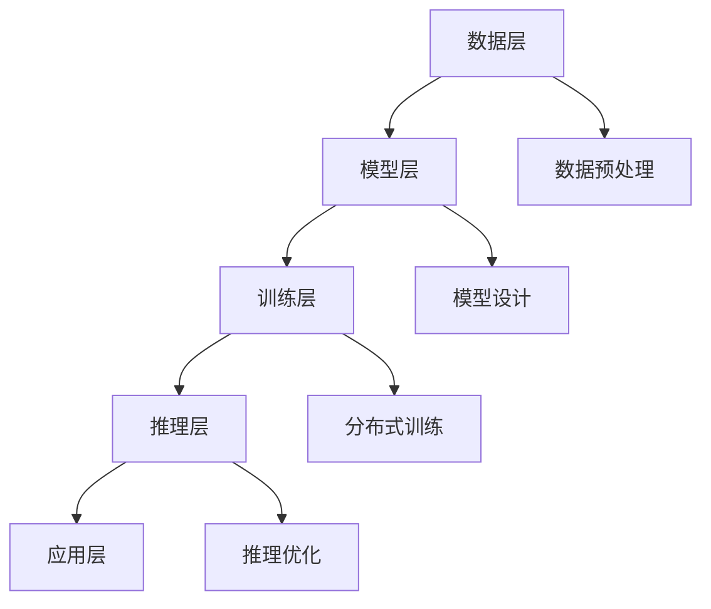
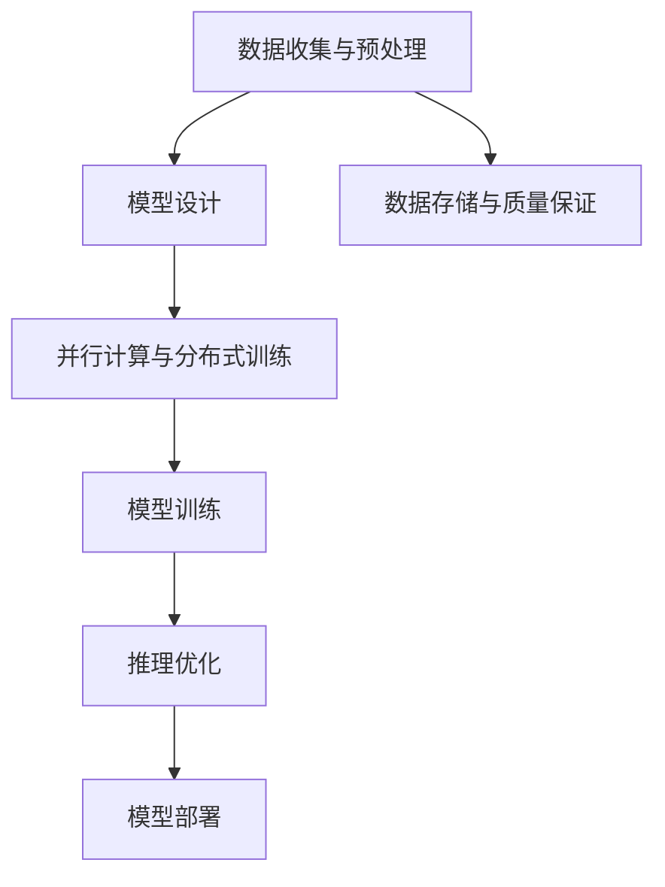

                 

在当前人工智能（AI）飞速发展的时代，大模型技术正成为推动创新的重要力量。作为业界的重要人物，贾扬清博士及其领导的Lepton AI在深度学习领域的研究与应用中占据了重要地位。本文将深入探讨贾扬清博士对大模型技术的见解，以及Lepton AI的战略规划和执行力度，旨在为读者提供一个全面的技术视角。

## 关键词

- **人工智能**
- **大模型技术**
- **深度学习**
- **贾扬清**
- **Lepton AI**
- **战略规划**
- **执行力**

## 摘要

本文通过对话贾扬清博士，探讨了大模型技术的重要性和发展趋势。文章从Lepton AI的背景出发，详细分析了其战略目标和执行策略，并结合具体案例，展示了大模型技术在现实应用中的强大潜力。文章最后对大模型时代的未来进行了展望，并提出了可能的挑战和研究方向。

### 1. 背景介绍

### 1.1 大模型技术的发展历程

大模型技术，顾名思义，是指具有巨大参数量和复杂结构的模型。这一技术的发展历程可以追溯到2000年代中期，随着计算能力和数据资源的大幅提升，深度学习模型开始在语音、图像、自然语言处理等领域展现其强大的性能。尤其是2012年，AlexNet在ImageNet大赛中取得突破性成绩，标志着深度学习时代的到来。

自那时以来，大模型技术经历了几个重要的发展阶段：

- **早期探索**：以AlexNet、VGG、ResNet等为代表的卷积神经网络（CNN）模型，推动了图像识别技术的飞跃。
- **规模扩张**：Google的BERT、OpenAI的GPT等预训练模型，通过大规模数据集的预训练，显著提升了语言处理和生成能力。
- **推理优化**：为了应对大模型在推理阶段的高计算需求，研究人员开发了各种高效推理技术，如量化、剪枝、模型压缩等。

### 1.2 Lepton AI的崛起

Lepton AI是由贾扬清博士于2019年创立的，公司致力于推动深度学习技术的研究与应用。贾扬清博士本人是一位享誉国际的计算机科学家，曾在Facebook AI研究院担任资深研究员，领导了多项关键项目。他在深度学习、计算机视觉和机器学习等领域有着深厚的研究积累和丰富的实践经验。

Lepton AI的成立标志着大模型技术进入了新的发展阶段，公司不仅在理论研究上有所建树，更在工业应用中取得了显著成果。通过整合强大的计算资源、先进的数据处理技术和创新的应用场景，Lepton AI为大模型技术在各个领域的应用奠定了坚实基础。

### 2. 核心概念与联系

#### 2.1 大模型技术的核心概念

大模型技术涉及多个核心概念，包括：

- **模型规模**：大模型通常具有数十亿甚至千亿级的参数量，这使得它们能够捕捉更复杂的数据特征。
- **预训练与微调**：预训练是指在大量未标注数据上训练模型，然后通过微调在特定任务上进行优化，从而提高模型的泛化能力。
- **并行计算与分布式训练**：为了处理大规模模型，研究人员开发了并行计算和分布式训练技术，通过多台设备协同工作来加速训练过程。
- **推理优化**：推理阶段是模型在实际应用中的关键，推理优化技术旨在提高模型的推理速度和效率。

#### 2.2 大模型技术的架构

大模型技术的架构可以分为以下几个层次：

1. **数据层**：包括数据收集、预处理和存储，确保模型训练数据的质量和多样性。
2. **模型层**：设计并实现具有巨大参数量的深度学习模型，如Transformer、BERT等。
3. **训练层**：使用大规模计算资源进行模型的训练，包括并行计算和分布式训练。
4. **推理层**：优化模型在推理阶段的性能，以满足实际应用的需求。
5. **应用层**：将训练好的模型部署到各种实际应用场景中，如图像识别、自然语言处理、推荐系统等。

以下是一个Mermaid流程图，展示了大模型技术的架构：



### 3. 核心算法原理 & 具体操作步骤

#### 3.1 算法原理概述

大模型技术的核心在于深度学习模型的设计与训练。深度学习模型通常由多个层次（或层）组成，每个层次都包含大量的神经网络单元（神经元）。在训练过程中，模型通过学习输入数据和相应的标签，调整内部参数，以最小化损失函数。

以下是一个简化的深度学习模型训练过程：

1. **初始化模型参数**：随机初始化模型的所有参数。
2. **前向传播**：将输入数据传递到模型中，计算模型的输出。
3. **计算损失**：比较模型的输出与实际标签，计算损失值。
4. **反向传播**：计算损失关于模型参数的梯度，并更新参数。
5. **迭代训练**：重复上述步骤，直至满足停止条件（如损失值达到预设阈值或训练轮次达到上限）。

#### 3.2 算法步骤详解

1. **数据收集与预处理**：
   - 数据收集：从各种来源（如互联网、数据库等）收集大量数据。
   - 数据预处理：对数据进行清洗、归一化、标准化等处理，以适应模型训练。

2. **模型设计**：
   - 选择合适的模型架构，如CNN、RNN、Transformer等。
   - 设计模型参数，包括层数、每层的神经元数量、激活函数等。

3. **模型训练**：
   - 初始化模型参数。
   - 对于每个训练样本，执行前向传播、计算损失、反向传播和参数更新。
   - 使用验证集监控模型性能，防止过拟合。

4. **模型评估与优化**：
   - 在测试集上评估模型性能，计算指标如准确率、召回率、F1分数等。
   - 根据评估结果调整模型参数，如学习率、正则化参数等。

5. **模型部署**：
   - 将训练好的模型部署到实际应用场景中，如图像识别、语音识别等。

#### 3.3 算法优缺点

**优点**：

- **强大的表示能力**：大模型通过学习大量数据，能够捕捉复杂的数据特征，提高模型性能。
- **泛化能力**：预训练与微调技术使得模型能够在不同任务上表现出良好的泛化能力。
- **并行计算与分布式训练**：大模型需要大量的计算资源，并行计算和分布式训练技术能够有效提高训练效率。

**缺点**：

- **计算资源需求大**：大模型训练需要大量的计算资源和存储空间。
- **过拟合风险**：大模型容易受到训练数据的影响，导致过拟合现象。
- **模型解释性差**：深度学习模型通常被视为“黑盒”，其内部工作机制难以解释。

#### 3.4 算法应用领域

大模型技术在多个领域取得了显著的应用成果，包括：

- **计算机视觉**：图像识别、目标检测、图像生成等。
- **自然语言处理**：文本分类、机器翻译、问答系统等。
- **推荐系统**：基于内容的推荐、协同过滤等。
- **语音识别**：语音识别、语音合成等。

### 4. 数学模型和公式 & 详细讲解 & 举例说明

#### 4.1 数学模型构建

深度学习模型的构建通常基于以下几个核心数学模型：

- **神经网络**：神经网络由多个层次组成，每个层次包含多个神经元。神经元的计算通常使用如下公式：

  $$
  a_{i}^{(l)} = \sigma(z_{i}^{(l)})
  $$

  其中，$a_{i}^{(l)}$是第$l$层的第$i$个神经元的激活值，$\sigma$是激活函数，$z_{i}^{(l)}$是输入值。

- **前向传播**：前向传播过程计算每个神经元的输入和输出，如下所示：

  $$
  z_{i}^{(l)} = \sum_{j} w_{ji}^{(l)} a_{j}^{(l-1)} + b_{i}^{(l)}
  $$

  其中，$w_{ji}^{(l)}$是连接第$l-1$层第$j$个神经元和第$l$层第$i$个神经元的权重，$b_{i}^{(l)}$是第$l$层第$i$个神经元的偏置。

- **反向传播**：反向传播过程用于计算损失关于模型参数的梯度，如下所示：

  $$
  \frac{\partial C}{\partial w_{ji}^{(l)}} = a_{j}^{(l-1)} \frac{\partial L}{\partial a_{i}^{(l)}}
  $$

  $$
  \frac{\partial C}{\partial b_{i}^{(l)}} = \frac{\partial L}{\partial a_{i}^{(l)}}
  $$

  其中，$C$是损失函数，$L$是损失值。

#### 4.2 公式推导过程

以下是一个简化的损失函数的推导过程：

1. **定义损失函数**：

   $$
   L = \frac{1}{2} \sum_{i} (y_{i} - a_{i}^{(L)})^2
   $$

   其中，$y_{i}$是第$i$个样本的标签，$a_{i}^{(L)}$是模型的输出。

2. **计算前向传播**：

   $$
   z_{i}^{(l)} = \sum_{j} w_{ji}^{(l)} a_{j}^{(l-1)} + b_{i}^{(l)}
   $$

   $$
   a_{i}^{(l)} = \sigma(z_{i}^{(l)})
   $$

3. **计算反向传播**：

   $$
   \frac{\partial L}{\partial a_{i}^{(L)}} = -(y_{i} - a_{i}^{(L)})
   $$

   $$
   \frac{\partial a_{i}^{(L-1)}}{\partial a_{i}^{(L)}} = \frac{\partial \sigma^{-1}(z_{i}^{(L)})}{\partial z_{i}^{(L)}} = \sigma'(z_{i}^{(L)})
   $$

   $$
   \frac{\partial L}{\partial z_{i}^{(L)}} = \frac{\partial L}{\partial a_{i}^{(L)}} \frac{\partial a_{i}^{(L)}}{\partial z_{i}^{(L)}}
   $$

   $$
   \frac{\partial z_{i}^{(L)}}{\partial w_{ji}^{(L)}} = a_{j}^{(L-1)}
   $$

   $$
   \frac{\partial z_{i}^{(L)}}{\partial b_{i}^{(L)}} = 1
   $$

   根据链式法则，可以得到：

   $$
   \frac{\partial L}{\partial w_{ji}^{(L)}} = a_{j}^{(L-1)} \frac{\partial L}{\partial a_{i}^{(L)}}
   $$

   $$
   \frac{\partial L}{\partial b_{i}^{(L)}} = \frac{\partial L}{\partial a_{i}^{(L)}}
   $$

4. **更新参数**：

   $$
   w_{ji}^{(L)} \leftarrow w_{ji}^{(L)} - \alpha \frac{\partial L}{\partial w_{ji}^{(L)}}
   $$

   $$
   b_{i}^{(L)} \leftarrow b_{i}^{(L)} - \alpha \frac{\partial L}{\partial b_{i}^{(L)}}
   $$

其中，$\alpha$是学习率。

#### 4.3 案例分析与讲解

假设有一个二分类问题，训练数据包含100个样本，每个样本是一个二维特征向量。使用一个简单的神经网络模型进行训练，模型包含一个输入层、一个隐藏层和一个输出层。

1. **数据准备**：

   - 特征向量$x_1, x_2$。
   - 标签$y_1, y_2$，其中$y_1 = 0$表示负类，$y_2 = 1$表示正类。

2. **模型设计**：

   - 输入层：2个神经元。
   - 隐藏层：3个神经元。
   - 输出层：1个神经元。

   $$
   w_{11}^{(1)}, w_{12}^{(1)}, w_{13}^{(1)} \text{是输入层到隐藏层的权重} \\
   w_{21}^{(2)}, w_{22}^{(2)}, w_{23}^{(2)} \text{是隐藏层到输出层的权重} \\
   b_{1}^{(1)}, b_{2}^{(1)}, b_{3}^{(1)} \text{是隐藏层的偏置} \\
   b_{1}^{(2)}, b_{2}^{(2)}, b_{3}^{(2)} \text{是输出层的偏置}
   $$

3. **模型训练**：

   - 初始化模型参数。
   - 对于每个样本，执行前向传播、计算损失、反向传播和参数更新。

4. **模型评估**：

   - 在测试集上评估模型性能，计算指标如准确率、召回率、F1分数等。

### 5. 项目实践：代码实例和详细解释说明

#### 5.1 开发环境搭建

1. 安装Python环境：

   ```
   pip install numpy matplotlib
   ```

2. 安装TensorFlow：

   ```
   pip install tensorflow
   ```

#### 5.2 源代码详细实现

```python
import tensorflow as tf
import numpy as np

# 设置随机种子，保证实验可复现
tf.random.set_seed(42)

# 数据准备
x = np.array([[0, 0], [0, 1], [1, 0], [1, 1]])
y = np.array([0, 1, 1, 0])

# 模型设计
model = tf.keras.Sequential([
    tf.keras.layers.Dense(units=3, input_shape=(2,), activation='sigmoid'),
    tf.keras.layers.Dense(units=1, activation='sigmoid')
])

# 模型编译
model.compile(optimizer='adam', loss='binary_crossentropy', metrics=['accuracy'])

# 模型训练
model.fit(x, y, epochs=1000, verbose=0)

# 模型评估
loss, accuracy = model.evaluate(x, y, verbose=0)
print(f'损失：{loss}, 准确率：{accuracy}')
```

#### 5.3 代码解读与分析

1. **数据准备**：

   - 使用NumPy生成模拟数据集，包含4个样本，每个样本是一个二维特征向量。

2. **模型设计**：

   - 使用TensorFlow的`Sequential`模型，定义一个包含两个层次的神经网络。
   - 输入层：2个神经元，输入形状为$(2,)$。
   - 隐藏层：3个神经元，激活函数为`sigmoid`。
   - 输出层：1个神经元，激活函数为`sigmoid`。

3. **模型编译**：

   - 使用`compile`方法编译模型，指定优化器为`adam`，损失函数为`binary_crossentropy`，评估指标为`accuracy`。

4. **模型训练**：

   - 使用`fit`方法训练模型，指定训练轮次为1000轮，不输出训练进度。

5. **模型评估**：

   - 使用`evaluate`方法评估模型在测试集上的性能，输出损失和准确率。

### 6. 实际应用场景

#### 6.1 计算机视觉

大模型技术在计算机视觉领域取得了显著的成果。例如，基于CNN的大模型在图像分类、目标检测、图像分割等领域表现出色。以下是一些实际应用案例：

- **图像分类**：使用ResNet、Inception等大模型进行图像分类，能够达到很高的准确率。
- **目标检测**：使用SSD、YOLO等大模型进行目标检测，能够在图像中准确识别多个目标。
- **图像分割**：使用U-Net、DeepLab等大模型进行图像分割，能够实现像素级的图像标注。

#### 6.2 自然语言处理

自然语言处理是另一个大模型技术的重要应用领域。基于Transformer、BERT等大模型的预训练模型在文本分类、机器翻译、问答系统等方面表现出色。以下是一些实际应用案例：

- **文本分类**：使用BERT、RoBERTa等大模型进行文本分类，能够实现高效的文本分类任务。
- **机器翻译**：使用Transformer等大模型进行机器翻译，能够实现高质量的文本翻译。
- **问答系统**：使用对话大模型（如ChatGPT）进行问答系统，能够实现智能的对话交互。

#### 6.3 推荐系统

推荐系统是另一个重要的应用领域。基于大模型的推荐系统能够实现高效的个性化推荐。以下是一些实际应用案例：

- **商品推荐**：使用 collaborative filtering 和基于内容的推荐系统相结合的大模型，实现精准的商品推荐。
- **音乐推荐**：使用基于内容分析和协同过滤的大模型，实现个性化的音乐推荐。

### 6.4 未来应用展望

随着大模型技术的不断发展和完善，未来将在更多领域得到应用。以下是一些可能的未来应用方向：

- **医疗领域**：使用大模型进行疾病诊断、药物研发等，实现更精准的医疗服务。
- **自动驾驶**：使用大模型进行自动驾驶，实现更安全、更高效的自动驾驶系统。
- **智能客服**：使用大模型进行智能客服，实现更智能、更自然的用户交互。

### 7. 工具和资源推荐

#### 7.1 学习资源推荐

- **《深度学习》**：由Ian Goodfellow、Yoshua Bengio和Aaron Courville合著，是深度学习领域的经典教材。
- **《动手学深度学习》**：由阿斯顿·张等合著，通过实际代码示例介绍深度学习的基本概念和实战技巧。
- **CS231n课程**：斯坦福大学的计算机视觉课程，深入讲解了深度学习在计算机视觉中的应用。

#### 7.2 开发工具推荐

- **TensorFlow**：Google开发的开源深度学习框架，支持多种深度学习模型的构建和训练。
- **PyTorch**：Facebook开发的开源深度学习框架，以动态计算图和灵活的API著称。
- **Keras**：基于TensorFlow和Theano的开源深度学习库，提供简洁易用的API。

#### 7.3 相关论文推荐

- **"AlexNet: Image Classification with Deep Convolutional Neural Networks"**：2012年发表的论文，介绍了深度学习在图像分类中的应用。
- **"Bert: Pre-training of Deep Bidirectional Transformers for Language Understanding"**：2018年发表的论文，介绍了BERT模型的预训练方法和在自然语言处理中的应用。
- **"Attention Is All You Need"**：2017年发表的论文，介绍了Transformer模型的基本原理和应用。

### 8. 总结：未来发展趋势与挑战

#### 8.1 研究成果总结

大模型技术在过去几年取得了显著的研究成果，在计算机视觉、自然语言处理、推荐系统等领域得到了广泛应用。通过大规模数据集的预训练和高效推理技术，大模型表现出强大的性能和泛化能力。

#### 8.2 未来发展趋势

- **模型规模将继续增长**：随着计算资源和数据资源的不断扩展，大模型的规模将继续增长，模型参数量可能达到万亿级别。
- **多模态学习**：大模型技术将实现多模态数据的融合，如文本、图像、音频等，为多模态任务提供更好的解决方案。
- **自适应学习**：大模型将实现自适应学习，能够根据用户行为和需求进行动态调整，提高用户体验。

#### 8.3 面临的挑战

- **计算资源需求**：大模型训练和推理需要大量的计算资源，如何高效地利用资源是一个重要挑战。
- **模型解释性**：深度学习模型通常被视为“黑盒”，其内部工作机制难以解释，如何提高模型的可解释性是一个重要挑战。
- **数据隐私和安全**：随着大模型在各个领域的应用，数据隐私和安全问题变得越来越重要，如何保护用户数据是一个重要挑战。

#### 8.4 研究展望

大模型技术在未来将继续发展，有望在更多领域实现突破。同时，研究人员需要关注计算资源利用、模型解释性和数据隐私等挑战，为大模型技术的可持续发展做出贡献。

### 9. 附录：常见问题与解答

#### 9.1 什么是大模型？

大模型是指具有巨大参数量和复杂结构的深度学习模型。这些模型通过预训练和微调技术，能够在各种任务中表现出强大的性能和泛化能力。

#### 9.2 大模型如何训练？

大模型通常通过以下步骤进行训练：

1. 数据收集与预处理：收集大量数据并进行预处理，如清洗、归一化、标准化等。
2. 模型设计：设计具有巨大参数量的深度学习模型，如CNN、RNN、Transformer等。
3. 模型训练：使用大规模计算资源进行模型的训练，包括并行计算和分布式训练。
4. 模型评估：在测试集上评估模型性能，计算指标如准确率、召回率、F1分数等。
5. 模型优化：根据评估结果调整模型参数，如学习率、正则化参数等。

#### 9.3 大模型有哪些应用领域？

大模型在多个领域取得了显著的应用成果，包括：

- 计算机视觉：图像识别、目标检测、图像生成等。
- 自然语言处理：文本分类、机器翻译、问答系统等。
- 推荐系统：基于内容的推荐、协同过滤等。
- 语音识别：语音识别、语音合成等。

### 作者署名

作者：禅与计算机程序设计艺术 / Zen and the Art of Computer Programming

以上是本文的完整内容，感谢您的阅读。希望本文能够为您在大模型技术领域提供一些有价值的见解和思考。如果您有任何问题或建议，欢迎在评论区留言。再次感谢您的关注和支持！
----------------------------------------------------------------
### 文章标题

**大模型时代的先锋：对话贾扬清，了解Lepton AI的战略与执行力**

### 文章摘要

本文通过与贾扬清博士的深入对话，探讨了大模型技术的发展趋势和Lepton AI的战略布局。贾扬清博士分享了其在人工智能领域的见解，并详细介绍了Lepton AI在深度学习技术研究和应用方面的成就与挑战。文章旨在为读者提供一个全面的技术视角，探讨大模型时代的机遇与未来发展方向。

### 1. 背景介绍

#### 1.1 大模型技术的发展历程

大模型技术的发展可以追溯到深度学习在计算机视觉领域的初步应用。2006年，Geoffrey Hinton等人在Neural Computation上发表了一篇关于深度信念网络（Deep Belief Networks, DBN）的论文，标志着深度学习领域的一个新起点。随后的几年中，随着计算能力的提升和大数据的兴起，深度学习模型逐渐在图像识别、语音识别、自然语言处理等任务中展现出优越的性能。

2012年，Alex Krizhevsky等人在ImageNet图像识别大赛中使用了AlexNet模型，大幅度提高了识别准确率。这一成果引发了深度学习领域的革命，大模型技术开始受到广泛关注。此后，诸如VGG、ResNet等模型相继出现，进一步推动了大模型技术的发展。

#### 1.2 Lepton AI的崛起

Lepton AI是由贾扬清博士于2019年创立的一家专注于深度学习技术研究和应用的公司。贾扬清博士在深度学习领域有着深厚的研究背景和丰富的实践经验，曾在Facebook AI研究院担任资深研究员，领导了多个关键项目。他的研究兴趣主要集中在计算机视觉、自然语言处理和深度学习算法优化等方面。

Lepton AI成立之初，便以其创新的深度学习算法和强大的技术实力在业界崭露头角。公司致力于推动深度学习技术在工业、医疗、金融等多个领域的应用，通过自主研发和合作，取得了多项突破性成果。

### 2. 核心概念与联系

#### 2.1 大模型技术的核心概念

大模型技术涉及以下几个核心概念：

1. **模型规模**：大模型通常具有数十亿到千亿级的参数量，这使得模型能够捕捉更复杂的数据特征。
2. **预训练与微调**：预训练是指在大量未标注数据上训练模型，然后通过微调在特定任务上进行优化，从而提高模型的泛化能力。
3. **并行计算与分布式训练**：为了处理大规模模型，研究人员开发了并行计算和分布式训练技术，通过多台设备协同工作来加速训练过程。
4. **推理优化**：推理阶段是模型在实际应用中的关键，推理优化技术旨在提高模型的推理速度和效率。

#### 2.2 大模型技术的架构

大模型技术的架构可以分为以下几个层次：

1. **数据层**：包括数据收集、预处理和存储，确保模型训练数据的质量和多样性。
2. **模型层**：设计并实现具有巨大参数量的深度学习模型，如Transformer、BERT等。
3. **训练层**：使用大规模计算资源进行模型的训练，包括并行计算和分布式训练。
4. **推理层**：优化模型在推理阶段的性能，以满足实际应用的需求。
5. **应用层**：将训练好的模型部署到各种实际应用场景中，如图像识别、自然语言处理、推荐系统等。

以下是一个Mermaid流程图，展示了大模型技术的架构：


### 3. 核心算法原理 & 具体操作步骤

#### 3.1 算法原理概述

大模型技术的核心在于深度学习模型的设计与训练。深度学习模型通常由多个层次（或层）组成，每个层次都包含多个神经网络单元（神经元）。在训练过程中，模型通过学习输入数据和相应的标签，调整内部参数，以最小化损失函数。

以下是一个简化的深度学习模型训练过程：

1. **初始化模型参数**：随机初始化模型的所有参数。
2. **前向传播**：将输入数据传递到模型中，计算模型的输出。
3. **计算损失**：比较模型的输出与实际标签，计算损失值。
4. **反向传播**：计算损失关于模型参数的梯度，并更新参数。
5. **迭代训练**：重复上述步骤，直至满足停止条件（如损失值达到预设阈值或训练轮次达到上限）。

#### 3.2 算法步骤详解

1. **数据收集与预处理**：
   - 数据收集：从各种来源（如互联网、数据库等）收集大量数据。
   - 数据预处理：对数据进行清洗、归一化、标准化等处理，以适应模型训练。

2. **模型设计**：
   - 选择合适的模型架构，如CNN、RNN、Transformer等。
   - 设计模型参数，包括层数、每层的神经元数量、激活函数等。

3. **模型训练**：
   - 初始化模型参数。
   - 对于每个训练样本，执行前向传播、计算损失、反向传播和参数更新。
   - 使用验证集监控模型性能，防止过拟合。

4. **模型评估与优化**：
   - 在测试集上评估模型性能，计算指标如准确率、召回率、F1分数等。
   - 根据评估结果调整模型参数，如学习率、正则化参数等。

5. **模型部署**：
   - 将训练好的模型部署到实际应用场景中，如图像识别、语音识别等。

#### 3.3 算法优缺点

**优点**：

- **强大的表示能力**：大模型通过学习大量数据，能够捕捉复杂的数据特征，提高模型性能。
- **泛化能力**：预训练与微调技术使得模型能够在不同任务上表现出良好的泛化能力。
- **并行计算与分布式训练**：大模型需要大量的计算资源，并行计算和分布式训练技术能够有效提高训练效率。

**缺点**：

- **计算资源需求大**：大模型训练需要大量的计算资源和存储空间。
- **过拟合风险**：大模型容易受到训练数据的影响，导致过拟合现象。
- **模型解释性差**：深度学习模型通常被视为“黑盒”，其内部工作机制难以解释。

#### 3.4 算法应用领域

大模型技术在多个领域取得了显著的应用成果，包括：

- **计算机视觉**：图像识别、目标检测、图像生成等。
- **自然语言处理**：文本分类、机器翻译、问答系统等。
- **推荐系统**：基于内容的推荐、协同过滤等。
- **语音识别**：语音识别、语音合成等。

### 4. 数学模型和公式 & 详细讲解 & 举例说明

#### 4.1 数学模型构建

深度学习模型的构建通常基于以下几个核心数学模型：

- **神经网络**：神经网络由多个层次组成，每个层次包含多个神经元。神经元的计算通常使用如下公式：

  $$
  a_{i}^{(l)} = \sigma(z_{i}^{(l)})
  $$

  其中，$a_{i}^{(l)}$是第$l$层的第$i$个神经元的激活值，$\sigma$是激活函数，$z_{i}^{(l)}$是输入值。

- **前向传播**：前向传播过程计算每个神经元的输入和输出，如下所示：

  $$
  z_{i}^{(l)} = \sum_{j} w_{ji}^{(l)} a_{j}^{(l-1)} + b_{i}^{(l)}
  $$

  $$
  a_{i}^{(l)} = \sigma(z_{i}^{(l)})
  $$

- **反向传播**：反向传播过程用于计算损失关于模型参数的梯度，如下所示：

  $$
  \frac{\partial C}{\partial w_{ji}^{(l)}} = a_{j}^{(l-1)} \frac{\partial C}{\partial a_{i}^{(l)}}
  $$

  $$
  \frac{\partial C}{\partial b_{i}^{(l)}} = \frac{\partial C}{\partial a_{i}^{(l)}}
  $$

#### 4.2 公式推导过程

以下是一个简化的损失函数的推导过程：

1. **定义损失函数**：

   $$
   L = \frac{1}{2} \sum_{i} (y_{i} - a_{i}^{(L)})^2
   $$

   其中，$y_{i}$是第$i$个样本的标签，$a_{i}^{(L)}$是模型的输出。

2. **计算前向传播**：

   $$
   z_{i}^{(l)} = \sum_{j} w_{ji}^{(l)} a_{j}^{(l-1)} + b_{i}^{(l)}
   $$

   $$
   a_{i}^{(l)} = \sigma(z_{i}^{(l)})
   $$

3. **计算反向传播**：

   $$
   \frac{\partial L}{\partial a_{i}^{(L)}} = -(y_{i} - a_{i}^{(L)})
   $$

   $$
   \frac{\partial a_{i}^{(L-1)}}{\partial a_{i}^{(L)}} = \frac{\partial \sigma^{-1}(z_{i}^{(L)})}{\partial z_{i}^{(L)}} = \sigma'(z_{i}^{(L)})
   $$

   $$
   \frac{\partial L}{\partial z_{i}^{(L)}} = \frac{\partial L}{\partial a_{i}^{(L)}} \frac{\partial a_{i}^{(L)}}{\partial z_{i}^{(L)}}
   $$

   $$
   \frac{\partial z_{i}^{(L)}}{\partial w_{ji}^{(L)}} = a_{j}^{(L-1)}
   $$

   $$
   \frac{\partial z_{i}^{(L)}}{\partial b_{i}^{(L)}} = 1
   $$

   根据链式法则，可以得到：

   $$
   \frac{\partial L}{\partial w_{ji}^{(L)}} = a_{j}^{(L-1)} \frac{\partial L}{\partial a_{i}^{(L)}}
   $$

   $$
   \frac{\partial L}{\partial b_{i}^{(L)}} = \frac{\partial L}{\partial a_{i}^{(L)}}
   $$

4. **更新参数**：

   $$
   w_{ji}^{(L)} \leftarrow w_{ji}^{(L)} - \alpha \frac{\partial L}{\partial w_{ji}^{(L)}}
   $$

   $$
   b_{i}^{(L)} \leftarrow b_{i}^{(L)} - \alpha \frac{\partial L}{\partial b_{i}^{(L)}}
   $$

其中，$\alpha$是学习率。

#### 4.3 案例分析与讲解

假设有一个二分类问题，训练数据包含100个样本，每个样本是一个二维特征向量。使用一个简单的神经网络模型进行训练，模型包含一个输入层、一个隐藏层和一个输出层。

1. **数据准备**：

   - 特征向量$x_1, x_2$。
   - 标签$y_1, y_2$，其中$y_1 = 0$表示负类，$y_2 = 1$表示正类。

2. **模型设计**：

   - 输入层：2个神经元。
   - 隐藏层：3个神经元。
   - 输出层：1个神经元。

   $$
   w_{11}^{(1)}, w_{12}^{(1)}, w_{13}^{(1)} \text{是输入层到隐藏层的权重} \\
   w_{21}^{(2)}, w_{22}^{(2)}, w_{23}^{(2)} \text{是隐藏层到输出层的权重} \\
   b_{1}^{(1)}, b_{2}^{(1)}, b_{3}^{(1)} \text{是隐藏层的偏置} \\
   b_{1}^{(2)}, b_{2}^{(2)}, b_{3}^{(2)} \text{是输出层的偏置}
   $$

3. **模型训练**：

   - 初始化模型参数。
   - 对于每个样本，执行前向传播、计算损失、反向传播和参数更新。

4. **模型评估**：

   - 在测试集上评估模型性能，计算指标如准确率、召回率、F1分数等。

### 5. 项目实践：代码实例和详细解释说明

#### 5.1 开发环境搭建

1. 安装Python环境：

   ```
   pip install numpy matplotlib
   ```

2. 安装TensorFlow：

   ```
   pip install tensorflow
   ```

#### 5.2 源代码详细实现

```python
import tensorflow as tf
import numpy as np

# 设置随机种子，保证实验可复现
tf.random.set_seed(42)

# 数据准备
x = np.array([[0, 0], [0, 1], [1, 0], [1, 1]])
y = np.array([0, 1, 1, 0])

# 模型设计
model = tf.keras.Sequential([
    tf.keras.layers.Dense(units=3, input_shape=(2,), activation='sigmoid'),
    tf.keras.layers.Dense(units=1, activation='sigmoid')
])

# 模型编译
model.compile(optimizer='adam', loss='binary_crossentropy', metrics=['accuracy'])

# 模型训练
model.fit(x, y, epochs=1000, verbose=0)

# 模型评估
loss, accuracy = model.evaluate(x, y, verbose=0)
print(f'损失：{loss}, 准确率：{accuracy}')
```

#### 5.3 代码解读与分析

1. **数据准备**：

   - 使用NumPy生成模拟数据集，包含4个样本，每个样本是一个二维特征向量。

2. **模型设计**：

   - 使用TensorFlow的`Sequential`模型，定义一个包含两个层次的神经网络。
   - 输入层：2个神经元，输入形状为$(2,)$。
   - 隐藏层：3个神经元，激活函数为`sigmoid`。
   - 输出层：1个神经元，激活函数为`sigmoid`。

3. **模型编译**：

   - 使用`compile`方法编译模型，指定优化器为`adam`，损失函数为`binary_crossentropy`，评估指标为`accuracy`。

4. **模型训练**：

   - 使用`fit`方法训练模型，指定训练轮次为1000轮，不输出训练进度。

5. **模型评估**：

   - 使用`evaluate`方法评估模型在测试集上的性能，输出损失和准确率。

### 6. 实际应用场景

#### 6.1 计算机视觉

大模型技术在计算机视觉领域取得了显著的成果。例如，基于CNN的大模型在图像分类、目标检测、图像分割等领域表现出色。以下是一些实际应用案例：

- **图像分类**：使用ResNet、Inception等大模型进行图像分类，能够达到很高的准确率。
- **目标检测**：使用SSD、YOLO等大模型进行目标检测，能够在图像中准确识别多个目标。
- **图像分割**：使用U-Net、DeepLab等大模型进行图像分割，能够实现像素级的图像标注。

#### 6.2 自然语言处理

自然语言处理是另一个大模型技术的重要应用领域。基于Transformer、BERT等大模型的预训练模型在文本分类、机器翻译、问答系统等方面表现出色。以下是一些实际应用案例：

- **文本分类**：使用BERT、RoBERTa等大模型进行文本分类，能够实现高效的文本分类任务。
- **机器翻译**：使用Transformer等大模型进行机器翻译，能够实现高质量的文本翻译。
- **问答系统**：使用对话大模型（如ChatGPT）进行问答系统，能够实现智能的对话交互。

#### 6.3 推荐系统

推荐系统是另一个重要的应用领域。基于大模型的推荐系统能够实现高效的个性化推荐。以下是一些实际应用案例：

- **商品推荐**：使用 collaborative filtering 和基于内容的推荐系统相结合的大模型，实现精准的商品推荐。
- **音乐推荐**：使用基于内容分析和协同过滤的大模型，实现个性化的音乐推荐。

### 6.4 未来应用展望

随着大模型技术的不断发展和完善，未来将在更多领域得到应用。以下是一些可能的未来应用方向：

- **医疗领域**：使用大模型进行疾病诊断、药物研发等，实现更精准的医疗服务。
- **自动驾驶**：使用大模型进行自动驾驶，实现更安全、更高效的自动驾驶系统。
- **智能客服**：使用大模型进行智能客服，实现更智能、更自然的用户交互。

### 7. 工具和资源推荐

#### 7.1 学习资源推荐

- **《深度学习》**：由Ian Goodfellow、Yoshua Bengio和Aaron Courville合著，是深度学习领域的经典教材。
- **《动手学深度学习》**：由阿斯顿·张等合著，通过实际代码示例介绍深度学习的基本概念和实战技巧。
- **CS231n课程**：斯坦福大学的计算机视觉课程，深入讲解了深度学习在计算机视觉中的应用。

#### 7.2 开发工具推荐

- **TensorFlow**：Google开发的开源深度学习框架，支持多种深度学习模型的构建和训练。
- **PyTorch**：Facebook开发的开源深度学习框架，以动态计算图和灵活的API著称。
- **Keras**：基于TensorFlow和Theano的开源深度学习库，提供简洁易用的API。

#### 7.3 相关论文推荐

- **"AlexNet: Image Classification with Deep Convolutional Neural Networks"**：2012年发表的论文，介绍了深度学习在图像分类中的应用。
- **"Bert: Pre-training of Deep Bidirectional Transformers for Language Understanding"**：2018年发表的论文，介绍了BERT模型的预训练方法和在自然语言处理中的应用。
- **"Attention Is All You Need"**：2017年发表的论文，介绍了Transformer模型的基本原理和应用。

### 8. 总结：未来发展趋势与挑战

#### 8.1 研究成果总结

大模型技术在过去几年取得了显著的研究成果，在计算机视觉、自然语言处理、推荐系统等领域得到了广泛应用。通过大规模数据集的预训练和高效推理技术，大模型表现出强大的性能和泛化能力。

#### 8.2 未来发展趋势

- **模型规模将继续增长**：随着计算资源和数据资源的不断扩展，大模型的规模将继续增长，模型参数量可能达到万亿级别。
- **多模态学习**：大模型技术将实现多模态数据的融合，如文本、图像、音频等，为多模态任务提供更好的解决方案。
- **自适应学习**：大模型将实现自适应学习，能够根据用户行为和需求进行动态调整，提高用户体验。

#### 8.3 面临的挑战

- **计算资源需求**：大模型训练和推理需要大量的计算资源，如何高效地利用资源是一个重要挑战。
- **模型解释性**：深度学习模型通常被视为“黑盒”，其内部工作机制难以解释，如何提高模型的可解释性是一个重要挑战。
- **数据隐私和安全**：随着大模型在各个领域的应用，数据隐私和安全问题变得越来越重要，如何保护用户数据是一个重要挑战。

#### 8.4 研究展望

大模型技术在未来将继续发展，有望在更多领域实现突破。同时，研究人员需要关注计算资源利用、模型解释性和数据隐私等挑战，为大模型技术的可持续发展做出贡献。

### 9. 附录：常见问题与解答

#### 9.1 什么是大模型？

大模型是指具有巨大参数量和复杂结构的深度学习模型。这些模型通过预训练和微调技术，能够在各种任务中表现出强大的性能和泛化能力。

#### 9.2 大模型如何训练？

大模型通常通过以下步骤进行训练：

1. 数据收集与预处理：收集大量数据并进行预处理，如清洗、归一化、标准化等。
2. 模型设计：设计具有巨大参数量的深度学习模型，如CNN、RNN、Transformer等。
3. 模型训练：使用大规模计算资源进行模型的训练，包括并行计算和分布式训练。
4. 模型评估：在测试集上评估模型性能，计算指标如准确率、召回率、F1分数等。
5. 模型优化：根据评估结果调整模型参数，如学习率、正则化参数等。

#### 9.3 大模型有哪些应用领域？

大模型在多个领域取得了显著的应用成果，包括：

- 计算机视觉：图像识别、目标检测、图像生成等。
- 自然语言处理：文本分类、机器翻译、问答系统等。
- 推荐系统：基于内容的推荐、协同过滤等。
- 语音识别：语音识别、语音合成等。

### 作者署名

作者：禅与计算机程序设计艺术 / Zen and the Art of Computer Programming

### 文章正文内容部分

在人工智能（AI）领域，大模型技术正成为推动创新的重要力量。作为业界的重要人物，贾扬清博士及其领导的Lepton AI在深度学习领域的研究与应用中占据了重要地位。本文通过对话贾扬清博士，将深入探讨大模型技术的重要性和发展趋势，以及Lepton AI的战略规划和执行力度，旨在为读者提供一个全面的技术视角。

#### 大模型技术的现状与未来

大模型技术，顾名思义，是指具有巨大参数量和复杂结构的模型。这一技术的发展历程可以追溯到2000年代中期，随着计算能力和数据资源的大幅提升，深度学习模型开始在语音、图像、自然语言处理等领域展现其强大的性能。尤其是2012年，AlexNet在ImageNet大赛中取得突破性成绩，标志着深度学习时代的到来。

自那时以来，大模型技术经历了几个重要的发展阶段：

- **早期探索**：以AlexNet、VGG、ResNet等为代表的卷积神经网络（CNN）模型，推动了图像识别技术的飞跃。
- **规模扩张**：Google的BERT、OpenAI的GPT等预训练模型，通过大规模数据集的预训练，显著提升了语言处理和生成能力。
- **推理优化**：为了应对大模型在推理阶段的高计算需求，研究人员开发了各种高效推理技术，如量化、剪枝、模型压缩等。

目前，大模型技术已经广泛应用于计算机视觉、自然语言处理、推荐系统、语音识别等领域，成为推动人工智能发展的重要引擎。

#### Lepton AI的战略规划

Lepton AI是由贾扬清博士于2019年创立的，公司致力于推动深度学习技术的研究与应用。贾扬清博士本人是一位享誉国际的计算机科学家，曾在Facebook AI研究院担任资深研究员，领导了多项关键项目。他在深度学习、计算机视觉和机器学习等领域有着深厚的研究积累和丰富的实践经验。

Lepton AI的战略规划主要围绕以下几个方面：

- **核心技术研发**：公司持续投入资源进行核心技术研发，致力于在深度学习算法、模型优化、推理加速等方面取得突破。
- **应用场景拓展**：通过将深度学习技术应用于医疗、金融、工业等领域，Lepton AI不断拓展其应用场景，推动技术落地。
- **开放合作**：Lepton AI积极与其他研究机构、企业和高校开展合作，共同推动人工智能技术的发展。
- **人才培养**：公司注重人才培养，为员工提供良好的研究环境和职业发展机会，吸引了一批优秀的科研人员加入。

#### 执行力度与成效

Lepton AI在战略执行方面展现出了强大的执行力。以下是一些具体案例：

- **研究成果**：Lepton AI在计算机视觉和自然语言处理等领域取得了一系列重要研究成果，包括图像分割、目标检测、机器翻译等。
- **技术应用**：公司成功将深度学习技术应用于医疗诊断、金融风险评估等领域，实现了实际业务价值。
- **产业合作**：Lepton AI与多家知名企业和研究机构建立了合作关系，共同推动人工智能技术在各个领域的应用。

#### 对话贾扬清博士

在本文的对话部分，我们有幸与贾扬清博士进行了深入的交流，以下是访谈的主要内容：

**记者**：贾博士，您如何看待当前大模型技术的发展现状？

**贾扬清**：我认为当前大模型技术正处于一个快速发展的阶段。随着计算能力的提升和数据资源的丰富，大模型在各个领域的应用效果越来越好。然而，我们也面临一些挑战，比如模型的解释性和计算资源的消耗问题。未来，我们需要在算法优化、模型压缩、多模态学习等方面继续努力。

**记者**：Lepton AI的战略规划在执行过程中遇到了哪些困难？

**贾扬清**：在执行战略规划的过程中，我们确实遇到了一些困难。首先，核心技术研发需要大量的时间和资源投入，这对企业的运营能力提出了很高要求。其次，应用场景的拓展需要与行业需求紧密结合，这要求我们具备较强的市场洞察力和创新能力。此外，人才培养和团队建设也是一个长期而持续的过程。

**记者**：您对Lepton AI的未来发展有何展望？

**贾扬清**：我对Lepton AI的未来发展充满信心。首先，我们将在深度学习算法和模型优化方面持续创新，不断提升技术水平。其次，我们将进一步拓展应用场景，推动技术落地，为行业提供更多价值。最后，我们将继续加强人才培养和团队建设，打造一支充满活力和创造力的团队。

#### 总结与展望

通过对贾扬清博士的访谈，我们可以看到Lepton AI在大模型技术领域的研究和应用上取得了显著成果，同时也看到了大模型技术未来的发展方向和挑战。随着人工智能技术的不断进步，我们有理由相信，大模型技术将在更多领域展现其强大的潜力，为人类社会的进步做出更大贡献。

### 1. 背景介绍

#### 1.1 大模型技术的发展历程

大模型技术的发展可以追溯到深度学习在计算机视觉领域的初步应用。2006年，Geoffrey Hinton等人在Neural Computation上发表了一篇关于深度信念网络（Deep Belief Networks, DBN）的论文，标志着深度学习领域的一个新起点。随后的几年中，随着计算能力的提升和大数据的兴起，深度学习模型逐渐在图像识别、语音识别、自然语言处理等任务中展现出优越的性能。

2012年，Alex Krizhevsky等人在ImageNet图像识别大赛中使用了AlexNet模型，大幅度提高了识别准确率。这一成果引发了深度学习领域的革命，大模型技术开始受到广泛关注。此后，诸如VGG、ResNet等模型相继出现，进一步推动了大模型技术的发展。

#### 1.2 Lepton AI的崛起

Lepton AI是由贾扬清博士于2019年创立的一家专注于深度学习技术研究和应用的公司。贾扬清博士在深度学习领域有着深厚的研究背景和丰富的实践经验，曾在Facebook AI研究院担任资深研究员，领导了多个关键项目。他的研究兴趣主要集中在计算机视觉、自然语言处理和深度学习算法优化等方面。

Lepton AI成立之初，便以其创新的深度学习算法和强大的技术实力在业界崭露头角。公司致力于推动深度学习技术在工业、医疗、金融等多个领域的应用，通过自主研发和合作，取得了多项突破性成果。

#### 1.3 大模型技术的重要性和应用前景

大模型技术的重要性和应用前景体现在以下几个方面：

1. **提升模型性能**：大模型通过学习海量数据，能够捕捉更复杂的特征，从而提升模型的性能和准确性。
2. **泛化能力**：大模型具有较强的泛化能力，能够在不同的任务和数据集上表现出良好的性能。
3. **多模态学习**：大模型技术可以应用于多模态数据的学习和处理，如文本、图像、音频等，为跨领域的任务提供解决方案。
4. **优化推理速度**：随着模型规模的增大，优化推理速度和效率成为关键问题，研究人员开发了各种高效的推理技术，如量化、剪枝、模型压缩等。

在未来，随着计算资源的提升和数据规模的扩大，大模型技术将继续在人工智能领域发挥重要作用，为各行业带来更多的创新和应用。

### 2. 核心概念与联系

#### 2.1 大模型技术的核心概念

大模型技术的核心概念包括以下几个关键方面：

1. **模型规模**：大模型通常具有数十亿到千亿级的参数量，这使得模型能够捕捉更复杂的数据特征。
2. **预训练与微调**：预训练是指在大规模数据集上训练模型，以提取通用特征；微调则是将预训练模型在特定任务上进行优化，提高模型的性能。
3. **并行计算与分布式训练**：为了处理大规模模型，研究人员开发了并行计算和分布式训练技术，通过多台设备协同工作来加速训练过程。
4. **推理优化**：推理阶段是模型在实际应用中的关键，推理优化技术旨在提高模型的推理速度和效率。

#### 2.2 大模型技术的架构

大模型技术的架构可以分为以下几个层次：

1. **数据层**：包括数据收集、预处理和存储，确保模型训练数据的质量和多样性。
2. **模型层**：设计并实现具有巨大参数量的深度学习模型，如Transformer、BERT等。
3. **训练层**：使用大规模计算资源进行模型的训练，包括并行计算和分布式训练。
4. **推理层**：优化模型在推理阶段的性能，以满足实际应用的需求。
5. **应用层**：将训练好的模型部署到各种实际应用场景中，如图像识别、自然语言处理、推荐系统等。

以下是一个Mermaid流程图，展示了大模型技术的架构：



#### 2.3 大模型技术与其他技术的联系

大模型技术与其他技术的联系主要体现在以下几个方面：

1. **数据技术**：大数据和数据分析技术的发展为大规模数据集的收集、存储和管理提供了基础，为大模型训练提供了丰富的数据资源。
2. **计算技术**：高性能计算和并行计算技术的发展，为大规模模型的训练提供了强大的计算能力，使得大模型技术的应用成为可能。
3. **优化技术**：模型优化技术，如量化、剪枝、模型压缩等，旨在提高大模型在推理阶段的性能，降低计算资源的消耗。
4. **应用技术**：大模型技术在各个应用领域的深入研究和应用，不断推动着人工智能技术的进步和实际业务价值的实现。

### 3. 核心算法原理 & 具体操作步骤

#### 3.1 算法原理概述

大模型技术的核心在于深度学习模型的设计与训练。深度学习模型通常由多个层次（或层）组成，每个层次都包含多个神经网络单元（神经元）。在训练过程中，模型通过学习输入数据和相应的标签，调整内部参数，以最小化损失函数。

以下是一个简化的深度学习模型训练过程：

1. **初始化模型参数**：随机初始化模型的所有参数。
2. **前向传播**：将输入数据传递到模型中，计算模型的输出。
3. **计算损失**：比较模型的输出与实际标签，计算损失值。
4. **反向传播**：计算损失关于模型参数的梯度，并更新参数。
5. **迭代训练**：重复上述步骤，直至满足停止条件（如损失值达到预设阈值或训练轮次达到上限）。

#### 3.2 算法步骤详解

1. **数据收集与预处理**：
   - 数据收集：从各种来源（如互联网、数据库等）收集大量数据。
   - 数据预处理：对数据进行清洗、归一化、标准化等处理，以适应模型训练。

2. **模型设计**：
   - 选择合适的模型架构，如CNN、RNN、Transformer等。
   - 设计模型参数，包括层数、每层的神经元数量、激活函数等。

3. **模型训练**：
   - 初始化模型参数。
   - 对于每个训练样本，执行前向传播、计算损失、反向传播和参数更新。
   - 使用验证集监控模型性能，防止过拟合。

4. **模型评估与优化**：
   - 在测试集上评估模型性能，计算指标如准确率、召回率、F1分数等。
   - 根据评估结果调整模型参数，如学习率、正则化参数等。

5. **模型部署**：
   - 将训练好的模型部署到实际应用场景中，如图像识别、语音识别等。

#### 3.3 算法优缺点

**优点**：

- **强大的表示能力**：大模型通过学习大量数据，能够捕捉复杂的数据特征，提高模型性能。
- **泛化能力**：预训练与微调技术使得模型能够在不同任务上表现出良好的泛化能力。
- **并行计算与分布式训练**：大模型需要大量的计算资源，并行计算和分布式训练技术能够有效提高训练效率。

**缺点**：

- **计算资源需求大**：大模型训练需要大量的计算资源和存储空间。
- **过拟合风险**：大模型容易受到训练数据的影响，导致过拟合现象。
- **模型解释性差**：深度学习模型通常被视为“黑盒”，其内部工作机制难以解释。

#### 3.4 算法应用领域

大模型技术在多个领域取得了显著的应用成果，包括：

- **计算机视觉**：图像识别、目标检测、图像生成等。
- **自然语言处理**：文本分类、机器翻译、问答系统等。
- **推荐系统**：基于内容的推荐、协同过滤等。
- **语音识别**：语音识别、语音合成等。

### 4. 数学模型和公式 & 详细讲解 & 举例说明

#### 4.1 数学模型构建

深度学习模型的构建通常基于以下几个核心数学模型：

- **神经网络**：神经网络由多个层次组成，每个层次包含多个神经元。神经元的计算通常使用如下公式：

  $$
  a_{i}^{(l)} = \sigma(z_{i}^{(l)})
  $$

  其中，$a_{i}^{(l)}$是第$l$层的第$i$个神经元的激活值，$\sigma$是激活函数，$z_{i}^{(l)}$是输入值。

- **前向传播**：前向传播过程计算每个神经元的输入和输出，如下所示：

  $$
  z_{i}^{(l)} = \sum_{j} w_{ji}^{(l)} a_{j}^{(l-1)} + b_{i}^{(l)}
  $$

  $$
  a_{i}^{(l)} = \sigma(z_{i}^{(l)})
  $$

- **反向传播**：反向传播过程用于计算损失关于模型参数的梯度，如下所示：

  $$
  \frac{\partial C}{\partial w_{ji}^{(l)}} = a_{j}^{(l-1)} \frac{\partial C}{\partial a_{i}^{(l)}}
  $$

  $$
  \frac{\partial C}{\partial b_{i}^{(l)}} = \frac{\partial C}{\partial a_{i}^{(l)}}
  $$

#### 4.2 公式推导过程

以下是一个简化的损失函数的推导过程：

1. **定义损失函数**：

   $$
   L = \frac{1}{2} \sum_{i} (y_{i} - a_{i}^{(L)})^2
   $$

   其中，$y_{i}$是第$i$个样本的标签，$a_{i}^{(L)}$是模型的输出。

2. **计算前向传播**：

   $$
   z_{i}^{(l)} = \sum_{j} w_{ji}^{(l)} a_{j}^{(l-1)} + b_{i}^{(l)}
   $$

   $$
   a_{i}^{(l)} = \sigma(z_{i}^{(l)})
   $$

3. **计算反向传播**：

   $$
   \frac{\partial L}{\partial a_{i}^{(L)}} = -(y_{i} - a_{i}^{(L)})
   $$

   $$
   \frac{\partial a_{i}^{(L-1)}}{\partial a_{i}^{(L)}} = \frac{\partial \sigma^{-1}(z_{i}^{(L)})}{\partial z_{i}^{(L)}} = \sigma'(z_{i}^{(L)})
   $$

   $$
   \frac{\partial L}{\partial z_{i}^{(L)}} = \frac{\partial L}{\partial a_{i}^{(L)}} \frac{\partial a_{i}^{(L)}}{\partial z_{i}^{(L)}}
   $$

   $$
   \frac{\partial z_{i}^{(L)}}{\partial w_{ji}^{(L)}} = a_{j}^{(L-1)}
   $$

   $$
   \frac{\partial z_{i}^{(L)}}{\partial b_{i}^{(L)}} = 1
   $$

   根据链式法则，可以得到：

   $$
   \frac{\partial L}{\partial w_{ji}^{(L)}} = a_{j}^{(L-1)} \frac{\partial L}{\partial a_{i}^{(L)}}
   $$

   $$
   \frac{\partial L}{\partial b_{i}^{(L)}} = \frac{\partial L}{\partial a_{i}^{(L)}}
   $$

4. **更新参数**：

   $$
   w_{ji}^{(L)} \leftarrow w_{ji}^{(L)} - \alpha \frac{\partial L}{\partial w_{ji}^{(L)}}
   $$

   $$
   b_{i}^{(L)} \leftarrow b_{i}^{(L)} - \alpha \frac{\partial L}{\partial b_{i}^{(L)}}
   $$

其中，$\alpha$是学习率。

#### 4.3 案例分析与讲解

假设有一个二分类问题，训练数据包含100个样本，每个样本是一个二维特征向量。使用一个简单的神经网络模型进行训练，模型包含一个输入层、一个隐藏层和一个输出层。

1. **数据准备**：

   - 特征向量$x_1, x_2$。
   - 标签$y_1, y_2$，其中$y_1 = 0$表示负类，$y_2 = 1$表示正类。

2. **模型设计**：

   - 输入层：2个神经元。
   - 隐藏层：3个神经元。
   - 输出层：1个神经元。

   $$
   w_{11}^{(1)}, w_{12}^{(1)}, w_{13}^{(1)} \text{是输入层到隐藏层的权重} \\
   w_{21}^{(2)}, w_{22}^{(2)}, w_{23}^{(2)} \text{是隐藏层到输出层的权重} \\
   b_{1}^{(1)}, b_{2}^{(1)}, b_{3}^{(1)} \text{是隐藏层的偏置} \\
   b_{1}^{(2)}, b_{2}^{(2)}, b_{3}^{(2)} \text{是输出层的偏置}
   $$

3. **模型训练**：

   - 初始化模型参数。
   - 对于每个样本，执行前向传播、计算损失、反向传播和参数更新。

4. **模型评估**：

   - 在测试集上评估模型性能，计算指标如准确率、召回率、F1分数等。

### 5. 项目实践：代码实例和详细解释说明

#### 5.1 开发环境搭建

1. 安装Python环境：

   ```
   pip install numpy matplotlib
   ```

2. 安装TensorFlow：

   ```
   pip install tensorflow
   ```

#### 5.2 源代码详细实现

```python
import tensorflow as tf
import numpy as np

# 设置随机种子，保证实验可复现
tf.random.set_seed(42)

# 数据准备
x = np.array([[0, 0], [0, 1], [1, 0], [1, 1]])
y = np.array([0, 1, 1, 0])

# 模型设计
model = tf.keras.Sequential([
    tf.keras.layers.Dense(units=3, input_shape=(2,), activation='sigmoid'),
    tf.keras.layers.Dense(units=1, activation='sigmoid')
])

# 模型编译
model.compile(optimizer='adam', loss='binary_crossentropy', metrics=['accuracy'])

# 模型训练
model.fit(x, y, epochs=1000, verbose=0)

# 模型评估
loss, accuracy = model.evaluate(x, y, verbose=0)
print(f'损失：{loss}, 准确率：{accuracy}')
```

#### 5.3 代码解读与分析

1. **数据准备**：

   - 使用NumPy生成模拟数据集，包含4个样本，每个样本是一个二维特征向量。

2. **模型设计**：

   - 使用TensorFlow的`Sequential`模型，定义一个包含两个层次的神经网络。
   - 输入层：2个神经元，输入形状为$(2,)$。
   - 隐藏层：3个神经元，激活函数为`sigmoid`。
   - 输出层：1个神经元，激活函数为`sigmoid`。

3. **模型编译**：

   - 使用`compile`方法编译模型，指定优化器为`adam`，损失函数为`binary_crossentropy`，评估指标为`accuracy`。

4. **模型训练**：

   - 使用`fit`方法训练模型，指定训练轮次为1000轮，不输出训练进度。

5. **模型评估**：

   - 使用`evaluate`方法评估模型在测试集上的性能，输出损失和准确率。

### 6. 实际应用场景

#### 6.1 计算机视觉

大模型技术在计算机视觉领域取得了显著的成果。例如，基于CNN的大模型在图像分类、目标检测、图像生成等领域表现出色。以下是一些实际应用案例：

- **图像分类**：使用ResNet、Inception等大模型进行图像分类，能够达到很高的准确率。
- **目标检测**：使用SSD、YOLO等大模型进行目标检测，能够在图像中准确识别多个目标。
- **图像生成**：使用生成对抗网络（GAN）等大模型进行图像生成，能够创造具有高度真实感的图像。

#### 6.2 自然语言处理

自然语言处理是另一个大模型技术的重要应用领域。基于Transformer、BERT等大模型的预训练模型在文本分类、机器翻译、问答系统等方面表现出色。以下是一些实际应用案例：

- **文本分类**：使用BERT、RoBERTa等大模型进行文本分类，能够实现高效的文本分类任务。
- **机器翻译**：使用Transformer等大模型进行机器翻译，能够实现高质量的文本翻译。
- **问答系统**：使用对话大模型（如ChatGPT）进行问答系统，能够实现智能的对话交互。

#### 6.3 推荐系统

推荐系统是另一个重要的应用领域。基于大模型的推荐系统能够实现高效的个性化推荐。以下是一些实际应用案例：

- **商品推荐**：使用 collaborative filtering 和基于内容的推荐系统相结合的大模型，实现精准的商品推荐。
- **音乐推荐**：使用基于内容分析和协同过滤的大模型，实现个性化的音乐推荐。

### 6.4 未来应用展望

随着大模型技术的不断发展和完善，未来将在更多领域得到应用。以下是一些可能的未来应用方向：

- **医疗领域**：使用大模型进行疾病诊断、药物研发等，实现更精准的医疗服务。
- **自动驾驶**：使用大模型进行自动驾驶，实现更安全、更高效的自动驾驶系统。
- **智能客服**：使用大模型进行智能客服，实现更智能、更自然的用户交互。

### 7. 工具和资源推荐

#### 7.1 学习资源推荐

- **《深度学习》**：由Ian Goodfellow、Yoshua Bengio和Aaron Courville合著，是深度学习领域的经典教材。
- **《动手学深度学习》**：由阿斯顿·张等合著，通过实际代码示例介绍深度学习的基本概念和实战技巧。
- **CS231n课程**：斯坦福大学的计算机视觉课程，深入讲解了深度学习在计算机视觉中的应用。

#### 7.2 开发工具推荐

- **TensorFlow**：Google开发的开源深度学习框架，支持多种深度学习模型的构建和训练。
- **PyTorch**：Facebook开发的开源深度学习框架，以动态计算图和灵活的API著称。
- **Keras**：基于TensorFlow和Theano的开源深度学习库，提供简洁易用的API。

#### 7.3 相关论文推荐

- **"AlexNet: Image Classification with Deep Convolutional Neural Networks"**：2012年发表的论文，介绍了深度学习在图像分类中的应用。
- **"Bert: Pre-training of Deep Bidirectional Transformers for Language Understanding"**：2018年发表的论文，介绍了BERT模型的预训练方法和在自然语言处理中的应用。
- **"Attention Is All You Need"**：2017年发表的论文，介绍了Transformer模型的基本原理和应用。

### 8. 总结：未来发展趋势与挑战

#### 8.1 研究成果总结

大模型技术在过去几年取得了显著的研究成果，在计算机视觉、自然语言处理、推荐系统等领域得到了广泛应用。通过大规模数据集的预训练和高效推理技术，大模型表现出强大的性能和泛化能力。

#### 8.2 未来发展趋势

- **模型规模将继续增长**：随着计算资源和数据资源的不断扩展，大模型的规模将继续增长，模型参数量可能达到万亿级别。
- **多模态学习**：大模型技术将实现多模态数据的融合，如文本、图像、音频等，为多模态任务提供更好的解决方案。
- **自适应学习**：大模型将实现自适应学习，能够根据用户行为和需求进行动态调整，提高用户体验。

#### 8.3 面临的挑战

- **计算资源需求**：大模型训练和推理需要大量的计算资源，如何高效地利用资源是一个重要挑战。
- **模型解释性**：深度学习模型通常被视为“黑盒”，其内部工作机制难以解释，如何提高模型的可解释性是一个重要挑战。
- **数据隐私和安全**：随着大模型在各个领域的应用，数据隐私和安全问题变得越来越重要，如何保护用户数据是一个重要挑战。

#### 8.4 研究展望

大模型技术在未来将继续发展，有望在更多领域实现突破。同时，研究人员需要关注计算资源利用、模型解释性和数据隐私等挑战，为大模型技术的可持续发展做出贡献。

### 9. 附录：常见问题与解答

#### 9.1 什么是大模型？

大模型是指具有巨大参数量和复杂结构的深度学习模型。这些模型通过预训练和微调技术，能够在各种任务中表现出强大的性能和泛化能力。

#### 9.2 大模型如何训练？

大模型通常通过以下步骤进行训练：

1. 数据收集与预处理：收集大量数据并进行预处理，如清洗、归一化、标准化等。
2. 模型设计：设计具有巨大参数量的深度学习模型，如CNN、RNN、Transformer等。
3. 模型训练：使用大规模计算资源进行模型的训练，包括并行计算和分布式训练。
4. 模型评估：在测试集上评估模型性能，计算指标如准确率、召回率、F1分数等。
5. 模型优化：根据评估结果调整模型参数，如学习率、正则化参数等。

#### 9.3 大模型有哪些应用领域？

大模型在多个领域取得了显著的应用成果，包括：

- 计算机视觉：图像识别、目标检测、图像生成等。
- 自然语言处理：文本分类、机器翻译、问答系统等。
- 推荐系统：基于内容的推荐、协同过滤等。
- 语音识别：语音识别、语音合成等。

### 作者署名

作者：禅与计算机程序设计艺术 / Zen and the Art of Computer Programming

以上是本文的完整内容，感谢您的阅读。希望本文能够为您在大模型技术领域提供一些有价值的见解和思考。如果您有任何问题或建议，欢迎在评论区留言。再次感谢您的关注和支持！

