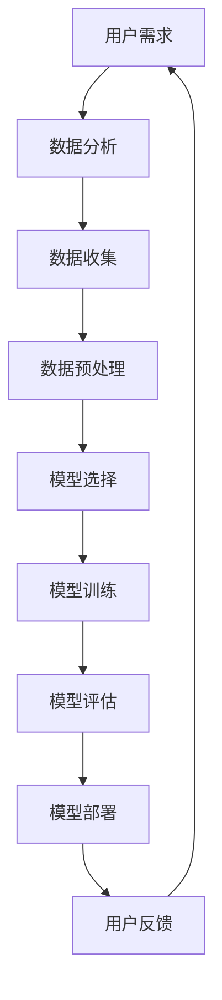

                 

## 1. 背景介绍

随着深度学习和大数据技术的迅猛发展，人工智能（AI）正逐步渗透到我们生活的方方面面。大模型（如GPT-3、BERT等）的出现，使得AI在自然语言处理、图像识别、语音识别等领域的表现达到了前所未有的高度。这种技术的进步不仅为传统行业带来了革新，也为创业公司提供了前所未有的机遇。然而，AI技术的应用同样给创业产品经理带来了巨大的挑战。

在传统产品管理中，产品经理的核心任务是理解用户需求、制定产品策略、协调跨部门合作以及确保产品按时上线。而AI的引入，使得产品经理需要掌握更多的技术知识和策略，以更好地应对市场变化和用户需求。具体来说，创业产品经理在大模型时代面临着以下几个主要挑战：

- **技术理解的门槛**：产品经理需要具备一定的技术背景，才能与工程师有效沟通，理解AI模型的工作原理和性能指标。

- **快速决策的能力**：AI技术的快速迭代，要求产品经理能够快速做出决策，及时调整产品方向和策略。

- **数据驱动的决策**：大模型的应用高度依赖数据质量，产品经理需要确保数据的准确性和多样性，以便模型能够更好地学习和优化。

- **用户体验的平衡**：AI技术虽然强大，但如何将其巧妙地融入到产品中，同时保证用户体验，是产品经理需要精心考虑的问题。

本文将深入探讨这些挑战，并探讨如何利用AI技术赋能创业产品经理的工作，从而在竞争激烈的市场中脱颖而出。

## 2. 核心概念与联系

在探讨AI赋能创业产品经理的具体实践之前，我们有必要先了解一些核心概念和它们之间的关系。以下是一个使用Mermaid绘制的流程图，帮助读者理解这些概念：



### 2.1 用户需求

用户需求是产品经理工作的起点。通过市场调研、用户访谈和数据分析，产品经理需要准确捕捉用户的痛点和需求。

### 2.2 数据分析

数据分析是产品经理理解用户需求的重要手段。通过数据挖掘和分析，可以识别用户行为模式、偏好和潜在需求。

### 2.3 数据收集

数据收集是数据驱动的产品管理的基础。产品经理需要设计合理的数据采集方案，确保数据的完整性和准确性。

### 2.4 数据预处理

数据预处理是数据处理的关键步骤。通过数据清洗、归一化和特征提取，可以提升数据质量，为后续的模型训练提供良好的数据基础。

### 2.5 模型选择

模型选择是产品经理需要考虑的重要因素。根据业务需求和数据特性，选择合适的AI模型，如深度学习模型、强化学习模型等。

### 2.6 模型训练

模型训练是AI应用的核心环节。通过大量数据训练模型，可以优化模型参数，提高模型的准确性和泛化能力。

### 2.7 模型评估

模型评估是确保模型性能的关键步骤。通过交叉验证、性能指标分析，可以判断模型是否满足业务需求。

### 2.8 模型部署

模型部署是将AI模型应用于实际业务的过程。产品经理需要确保模型部署的稳定性和可扩展性，同时进行监控和迭代优化。

### 2.9 用户反馈

用户反馈是持续改进产品的动力。通过用户反馈，产品经理可以及时了解产品的使用情况和用户满意度，进一步优化产品功能。

这个流程不仅展示了AI技术在产品管理中的应用，还揭示了不同环节之间的紧密联系。产品经理需要在这整个过程中扮演协调者和推动者的角色，确保各个环节无缝衔接，实现产品的持续迭代和优化。

## 3. 核心算法原理 & 具体操作步骤

### 3.1 算法原理概述

在大模型时代，核心算法的原理主要涉及机器学习、深度学习和自然语言处理等领域。机器学习是一种通过训练模型从数据中学习的方法，而深度学习则是机器学习的一个子领域，通过多层神经网络来模拟人脑的学习过程。自然语言处理（NLP）则是深度学习在语言领域中的应用，用于理解和生成自然语言。

在这三个领域，常见的算法包括：

- **机器学习算法**：如线性回归、逻辑回归、支持向量机（SVM）等。
- **深度学习算法**：如卷积神经网络（CNN）、循环神经网络（RNN）、长短期记忆网络（LSTM）等。
- **自然语言处理算法**：如词向量表示（Word2Vec、BERT）、序列标注（CRF）、生成模型（GPT-3）等。

### 3.2 算法步骤详解

下面我们将详细描述这些算法的基本步骤。

#### 3.2.1 机器学习算法

1. **数据收集**：首先，收集大量带有标签的数据，如用户行为数据、用户评价数据等。
2. **数据预处理**：清洗数据，去除噪音，并进行特征提取和归一化处理。
3. **模型选择**：根据数据特性和业务需求选择合适的机器学习模型。
4. **模型训练**：使用训练数据训练模型，优化模型参数。
5. **模型评估**：使用测试数据评估模型性能，调整模型参数。
6. **模型部署**：将训练好的模型部署到生产环境中。

#### 3.2.2 深度学习算法

1. **网络设计**：设计深度学习网络的架构，包括输入层、隐藏层和输出层。
2. **数据预处理**：与机器学习算法类似，进行数据清洗和特征提取。
3. **模型训练**：使用训练数据训练模型，调整网络参数，优化损失函数。
4. **模型评估**：使用测试数据评估模型性能。
5. **模型部署**：将训练好的模型部署到生产环境中。

#### 3.2.3 自然语言处理算法

1. **数据收集**：收集大量文本数据，如用户评论、新闻报道等。
2. **文本预处理**：对文本进行分词、去停用词、词性标注等处理。
3. **词向量表示**：将文本转化为向量表示，如使用Word2Vec或BERT算法。
4. **模型训练**：训练文本分类、序列标注或生成模型。
5. **模型评估**：使用测试数据评估模型性能。
6. **模型部署**：将训练好的模型部署到应用中。

### 3.3 算法优缺点

- **机器学习算法**：
  - 优点：算法简单，易于理解和实现，适用范围广。
  - 缺点：模型性能依赖数据质量，泛化能力较弱。

- **深度学习算法**：
  - 优点：强大的表示能力和学习能力，适用于复杂任务。
  - 缺点：模型复杂，训练时间较长，对计算资源要求高。

- **自然语言处理算法**：
  - 优点：能够处理复杂的文本数据，实现自然语言的理解和生成。
  - 缺点：数据预处理复杂，模型训练和评估时间较长。

### 3.4 算法应用领域

- **机器学习算法**：广泛应用于推荐系统、分类问题、异常检测等领域。
- **深度学习算法**：广泛应用于图像识别、语音识别、自然语言处理等领域。
- **自然语言处理算法**：广泛应用于聊天机器人、文本分类、情感分析等领域。

通过理解这些算法的基本原理和具体步骤，创业产品经理可以更好地利用AI技术，提升产品的竞争力。

## 4. 数学模型和公式 & 详细讲解 & 举例说明

在大模型时代，数学模型和公式在AI技术的应用中起到了关键作用。以下将详细讲解几个重要的数学模型和公式，并通过具体案例进行说明。

### 4.1 数学模型构建

在AI领域，数学模型构建主要涉及以下几个方面：

1. **损失函数**：损失函数用于衡量模型预测值与真实值之间的差距，如均方误差（MSE）和交叉熵（Cross-Entropy）。

2. **优化算法**：优化算法用于迭代更新模型参数，如梯度下降（Gradient Descent）和随机梯度下降（SGD）。

3. **激活函数**：激活函数用于引入非线性特性，常见的有Sigmoid、ReLU和Tanh。

### 4.2 公式推导过程

#### 4.2.1 梯度下降算法

梯度下降算法是一种优化算法，用于最小化损失函数。其基本公式如下：

$$
w_{t+1} = w_{t} - \alpha \cdot \nabla J(w_t)
$$

其中，\( w_t \) 是第 \( t \) 次迭代的权重，\( \alpha \) 是学习率，\( \nabla J(w_t) \) 是损失函数 \( J(w_t) \) 在 \( w_t \) 处的梯度。

#### 4.2.2 均方误差（MSE）

均方误差是回归问题中常用的损失函数，其公式为：

$$
MSE = \frac{1}{m} \sum_{i=1}^{m} (y_i - \hat{y}_i)^2
$$

其中，\( y_i \) 是真实值，\( \hat{y}_i \) 是预测值，\( m \) 是样本数量。

#### 4.2.3 交叉熵（Cross-Entropy）

交叉熵是分类问题中常用的损失函数，其公式为：

$$
H(y, \hat{y}) = -\sum_{i=1}^{m} y_i \cdot \log(\hat{y}_i)
$$

其中，\( y_i \) 是真实标签，\( \hat{y}_i \) 是预测概率。

### 4.3 案例分析与讲解

#### 4.3.1 卷积神经网络（CNN）中的卷积操作

卷积神经网络在图像处理中有着广泛应用。以下是一个简单的卷积操作案例：

输入图像：\[1, 1, 1\]，卷积核：\[1, 1\]

计算过程如下：

$$
\text{输出} = \sum_{i=1}^{2} \sum_{j=1}^{2} w_{ij} \cdot x_{i-j, j-j}
$$

$$
= (1 \cdot 1 + 1 \cdot 1 + 1 \cdot 1) + (1 \cdot 1 + 1 \cdot 1 + 1 \cdot 1)
$$

$$
= 4 + 4
$$

$$
= 8
$$

输出结果为8。

#### 4.3.2 长短期记忆网络（LSTM）中的门机制

LSTM是一种用于处理序列数据的神经网络，其核心是门机制。以下是一个简单的LSTM门机制的例子：

1. **输入门（Input Gate）**：

$$
i_t = \sigma(W_{ix} \cdot x_t + W_{ih} \cdot h_{t-1} + b_i)
$$

其中，\( i_t \) 是输入门的激活值，\( x_t \) 是当前输入，\( h_{t-1} \) 是前一个隐藏层输出，\( W_{ix} \) 和 \( W_{ih} \) 是权重矩阵，\( b_i \) 是偏置。

2. **遗忘门（Forget Gate）**：

$$
f_t = \sigma(W_{fx} \cdot x_t + W_{fh} \cdot h_{t-1} + b_f)
$$

其中，\( f_t \) 是遗忘门的激活值。

3. **输出门（Output Gate）**：

$$
o_t = \sigma(W_{ox} \cdot x_t + W_{oh} \cdot h_{t-1} + b_o)
$$

其中，\( o_t \) 是输出门的激活值。

通过这些门机制，LSTM能够有效地处理长序列数据中的长期依赖问题。

通过以上数学模型和公式的讲解，我们可以看到，AI技术的强大之处不仅在于其算法的复杂性，更在于其背后的数学理论。对于创业产品经理而言，掌握这些数学模型和公式，将有助于更好地理解和应用AI技术，提升产品的竞争力。

## 5. 项目实践：代码实例和详细解释说明

在了解了AI技术的理论之后，我们将通过一个实际项目实例，展示如何将理论应用到实践中，并详细解释每一步的具体实现过程。

### 5.1 开发环境搭建

在开始项目之前，我们需要搭建一个适合开发AI模型的开发环境。以下是一个基本的开发环境搭建步骤：

1. **安装Python**：确保系统上安装了Python 3.7或更高版本。
2. **安装深度学习框架**：我们使用TensorFlow作为深度学习框架，可以通过以下命令安装：

   ```bash
   pip install tensorflow
   ```

3. **安装数据预处理库**：我们使用Pandas和NumPy进行数据预处理，可以通过以下命令安装：

   ```bash
   pip install pandas numpy
   ```

4. **安装其他辅助库**：如Matplotlib用于数据可视化，可以通过以下命令安装：

   ```bash
   pip install matplotlib
   ```

### 5.2 源代码详细实现

以下是一个简单的AI项目实例，我们将使用TensorFlow实现一个基于卷积神经网络的图像分类模型。

```python
import tensorflow as tf
from tensorflow.keras import datasets, layers, models
import matplotlib.pyplot as plt

# 加载并预处理数据
(train_images, train_labels), (test_images, test_labels) = datasets.cifar10.load_data()

train_images, test_images = train_images / 255.0, test_images / 255.0

class_names = ['airplane', 'automobile', 'bird', 'cat', 'deer',
               'dog', 'frog', 'horse', 'ship', 'truck']

# 构建卷积神经网络模型
model = models.Sequential()
model.add(layers.Conv2D(32, (3, 3), activation='relu', input_shape=(32, 32, 3)))
model.add(layers.MaxPooling2D((2, 2)))
model.add(layers.Conv2D(64, (3, 3), activation='relu'))
model.add(layers.MaxPooling2D((2, 2)))
model.add(layers.Conv2D(64, (3, 3), activation='relu'))
model.add(layers.Flatten())
model.add(layers.Dense(64, activation='relu'))
model.add(layers.Dense(10))

# 编译模型
model.compile(optimizer='adam',
              loss=tf.keras.losses.SparseCategoricalCrossentropy(from_logits=True),
              metrics=['accuracy'])

# 训练模型
history = model.fit(train_images, train_labels, epochs=10, 
                    validation_data=(test_images, test_labels))

# 评估模型
test_loss, test_acc = model.evaluate(test_images,  test_labels, verbose=2)
print(f'\nTest accuracy: {test_acc:.4f}')

# 可视化训练过程
plt.plot(history.history['accuracy'], label='accuracy')
plt.plot(history.history['val_accuracy'], label = 'val_accuracy')
plt.xlabel('Epoch')
plt.ylabel('Accuracy')
plt.ylim([0, 1])
plt.legend(loc='lower right')

plt.show()
```

### 5.3 代码解读与分析

1. **数据加载与预处理**：
   - 使用`cifar10`数据集，这是Keras内置的一个常见的数据集，包含10类32x32的彩色图像。
   - 将图像数据归一化到[0, 1]范围，以便于模型训练。

2. **构建模型**：
   - 使用`Sequential`模型，这是一种线性堆叠模型层的序列。
   - 添加两个卷积层，每个卷积层后接一个最大池化层，最后添加一个全连接层。
   - 使用`Dense`层实现全连接，并设置输出层有10个神经元，对应10个类别。

3. **编译模型**：
   - 使用`compile`方法配置模型的优化器、损失函数和评估指标。
   - 选择`adam`优化器和`SparseCategoricalCrossentropy`损失函数，用于多分类问题。

4. **训练模型**：
   - 使用`fit`方法训练模型，指定训练数据和训练轮次。
   - 使用`validation_data`参数进行验证集评估。

5. **评估模型**：
   - 使用`evaluate`方法评估模型在测试集上的性能。
   - 打印测试集的准确率。

6. **可视化训练过程**：
   - 使用`matplotlib`库绘制训练和验证集的准确率曲线，帮助分析模型训练过程。

通过这个实例，我们可以看到如何将AI技术应用到实际项目中。创业产品经理可以通过类似的步骤，利用AI技术提升产品的智能化水平，从而在竞争激烈的市场中脱颖而出。

## 6. 实际应用场景

AI技术在各个行业中的应用已经越来越广泛，从医疗到金融，从零售到制造，AI正在改变传统行业的运作方式，并创造出全新的商业机会。以下是AI在创业产品中的几个实际应用场景：

### 6.1 医疗保健

在医疗保健领域，AI的应用范围广泛，从疾病预测到个性化治疗方案的制定。创业公司可以通过开发基于AI的医疗诊断工具，提高诊断的准确性和效率。例如，通过深度学习算法，可以训练模型从医疗影像中快速识别疾病，如乳腺癌、肺癌等。此外，AI还可以用于患者管理，通过分析大量健康数据，为患者提供个性化的健康建议，从而预防疾病发生。

### 6.2 金融科技

金融科技（Fintech）是AI应用的另一个重要领域。AI可以帮助金融公司进行风险管理、信用评估和欺诈检测。例如，通过机器学习算法，可以分析大量交易数据，实时检测异常交易，从而预防欺诈行为。同时，AI还可以用于个性化金融产品推荐，通过分析用户的历史交易数据和行为习惯，为用户推荐最适合的理财产品。

### 6.3 零售电商

在零售电商领域，AI技术可以显著提升用户体验和销售效率。通过自然语言处理（NLP）技术，可以开发智能客服系统，实现24/7的客户服务。此外，AI还可以用于商品推荐，通过分析用户的浏览历史和购买记录，为用户提供个性化的商品推荐，从而提高销售额。另外，AI还可以用于库存管理，通过预测销售趋势，优化库存水平，减少库存积压。

### 6.4 制造业

制造业正在经历一场数字化转型，而AI技术是这一进程的关键推动力。在制造业中，AI可以用于生产线的自动化控制、质量检测和设备维护。例如，通过机器学习算法，可以实时监控生产设备的状态，预测设备故障，从而减少停机时间，提高生产效率。此外，AI还可以用于优化生产流程，通过分析大量生产数据，找到效率最低的环节，并提出改进建议。

### 6.5 物流与运输

在物流与运输领域，AI技术可以用于路线优化、货物跟踪和配送预测。通过使用机器学习和优化算法，物流公司可以制定最优的运输路线，降低运输成本，提高配送效率。同时，AI还可以用于实时跟踪货物状态，通过物联网（IoT）设备和传感器，实时监控货物位置和安全状况。此外，AI还可以用于预测配送时间，通过分析历史数据，预测未来配送需求，从而优化人力和资源的配置。

### 6.6 教育

在教育事业中，AI技术可以用于个性化教学和智能评估。通过AI，可以为每个学生提供个性化的学习方案，根据学生的学习情况和进度，推荐合适的学习内容和资源。同时，AI还可以用于智能评估，通过自然语言处理技术，自动批改作业和考试，提供即时反馈，帮助教师更好地了解学生的学习情况。

### 6.7 媒体与娱乐

在媒体与娱乐领域，AI技术可以用于内容推荐、用户行为分析和智能广告投放。通过分析用户的行为数据，可以推荐用户可能感兴趣的内容，从而提高用户的黏性。同时，AI还可以用于分析用户反馈，优化产品和服务，提高用户满意度。此外，AI还可以用于智能广告投放，通过分析用户的兴趣和行为，实现精准的广告投放，提高广告效果。

通过这些实际应用场景，我们可以看到AI技术如何为创业公司带来巨大的商业价值。创业产品经理需要深入了解这些技术，并将它们巧妙地应用到产品中，以提升产品的竞争力。

## 7. 工具和资源推荐

为了更好地掌握AI技术并应用于创业产品，以下是一些学习资源和开发工具的推荐。

### 7.1 学习资源推荐

1. **在线课程**：
   - [Deep Learning Specialization](https://www.coursera.org/specializations/deeplearning)（吴恩达讲授的深度学习课程）
   - [Machine Learning Specialization](https://www.coursera.org/specializations/ml)（吴恩达讲授的机器学习课程）
   - [TensorFlow for Artificial Intelligence](https://www.coursera.org/specializations/tensorflow)（谷歌AI推出的TensorFlow课程）

2. **书籍**：
   - 《深度学习》（Ian Goodfellow、Yoshua Bengio和Aaron Courville著）
   - 《Python深度学习》（François Chollet著）
   - 《机器学习》（Tom M. Mitchell著）

3. **网站与博客**：
   - [AI Haven](https://aihaven.com/)
   - [TensorFlow 官方文档](https://www.tensorflow.org/)
   - [Kaggle](https://www.kaggle.com/)

### 7.2 开发工具推荐

1. **深度学习框架**：
   - TensorFlow
   - PyTorch
   - Keras

2. **编程语言**：
   - Python
   - R

3. **数据预处理工具**：
   - Pandas
   - NumPy
   - SciPy

4. **数据可视化工具**：
   - Matplotlib
   - Seaborn
   - Plotly

5. **版本控制工具**：
   - Git
   - GitHub

6. **容器化与部署工具**：
   - Docker
   - Kubernetes

### 7.3 相关论文推荐

1. **《A Theoretical Analysis of the Causal Effect of AI on the Housing Market》**：探讨AI对房地产市场的影响。
2. **《Deep Learning on Graphs》**：介绍如何在图结构数据上应用深度学习。
3. **《Generative Adversarial Networks》**：介绍生成对抗网络（GAN）的基本原理和应用。

通过利用这些资源和工具，创业产品经理可以更深入地了解AI技术，并在实践中提升产品的智能化水平。

## 8. 总结：未来发展趋势与挑战

### 8.1 研究成果总结

在过去的几年中，人工智能（AI）领域取得了显著的成果。深度学习技术的突破，使得AI在图像识别、自然语言处理、语音识别等领域的性能达到了前所未有的高度。同时，数据科学和大数据技术的进步，为AI提供了丰富的数据资源和强大的计算能力。这些研究成果不仅推动了AI技术的广泛应用，也为创业产品经理提供了更多的机会和挑战。

### 8.2 未来发展趋势

未来，AI技术将继续朝着以下几个方向发展：

1. **算法创新**：随着计算能力的提升，研究人员将不断探索新的算法和模型，以提高AI的效率和准确性。
2. **跨领域融合**：AI与其他技术的融合，如物联网（IoT）、区块链等，将创造更多的应用场景和商业机会。
3. **人机协作**：AI将在更多领域实现与人类的协同工作，提高工作效率和质量。
4. **个性化服务**：基于用户数据的深度分析，AI将提供更加个性化和定制化的服务。
5. **可持续发展**：AI将在能源、环保等领域发挥重要作用，推动可持续发展目标的实现。

### 8.3 面临的挑战

尽管AI技术取得了显著进展，但创业产品经理在应用AI技术时仍面临以下挑战：

1. **技术门槛**：AI技术复杂，创业产品经理需要不断学习和更新知识，以掌握最新的技术趋势。
2. **数据质量**：AI模型的性能高度依赖数据质量，创业公司需要确保数据的准确性和多样性。
3. **隐私保护**：在收集和使用用户数据时，需要严格遵守隐私保护法规，确保用户隐私安全。
4. **算法透明性**：AI算法的复杂性和黑盒性质，使得其决策过程不够透明，需要不断改进算法的可解释性。
5. **道德和伦理问题**：AI技术在某些领域（如自动驾驶、医疗诊断等）的应用，涉及到伦理和道德问题，需要制定相应的规范和标准。

### 8.4 研究展望

未来的研究将主要集中在以下几个方面：

1. **算法优化**：继续探索更高效、更准确的算法和模型，以提高AI的性能。
2. **可解释性研究**：提高AI算法的可解释性，使其决策过程更加透明和可信。
3. **数据隐私保护**：开发新的数据隐私保护技术和方法，确保数据安全和用户隐私。
4. **人机协作**：研究人机协作机制，实现AI与人类的无缝互动和协同工作。
5. **跨领域应用**：探索AI技术在更多领域的应用，推动跨领域的技术融合和创新。

总之，大模型时代的到来，为创业产品经理带来了前所未有的机遇和挑战。通过不断学习和实践，创业产品经理可以充分利用AI技术，提升产品的竞争力，为用户带来更好的体验和价值。

## 9. 附录：常见问题与解答

### Q1. 创业产品经理应该如何应对技术门槛？

A1. 技术门槛是创业产品经理面临的主要挑战之一。以下是一些建议：

1. **持续学习**：定期学习最新的技术趋势和研究成果，可以通过在线课程、技术博客和行业会议等方式。
2. **构建团队**：组建一个多元化团队，包括AI专家、数据科学家和工程师，共同分担技术任务。
3. **技术培训**：定期组织技术培训，帮助团队成员提升技术水平。
4. **合作与交流**：与其他公司和技术社区合作，共享知识和资源。

### Q2. 数据质量对AI模型性能有何影响？

A2. 数据质量直接影响AI模型的性能。以下是几个关键点：

1. **准确性**：确保数据真实、准确，减少错误和异常数据。
2. **完整性**：确保数据集的完整性，避免数据缺失。
3. **多样性**：数据集应包含多样化的数据，以增强模型的泛化能力。
4. **预处理**：对数据进行清洗、归一化和特征提取，以提高数据质量。

### Q3. 如何保证用户数据的隐私和安全？

A3. 保证用户数据的隐私和安全，需要采取以下措施：

1. **数据加密**：使用加密技术保护用户数据。
2. **访问控制**：严格限制对用户数据的访问权限。
3. **合规性**：遵守相关法律法规，如《通用数据保护条例》（GDPR）等。
4. **透明度**：告知用户数据处理的目的和使用方式，确保用户知情权。
5. **数据脱敏**：对敏感数据进行脱敏处理，以防止数据泄露。

### Q4. 如何评估AI模型的性能？

A4. 评估AI模型的性能，可以从以下几个方面进行：

1. **准确率**：评估模型预测的正确率。
2. **召回率**：评估模型召回真实样本的能力。
3. **F1分数**：综合考虑准确率和召回率，用于综合评估模型性能。
4. **ROC曲线和AUC值**：评估模型对不同类别样本的区分能力。
5. **验证集和测试集**：使用验证集和测试集进行模型性能评估，避免过拟合。

### Q5. 如何应对AI算法的透明性问题？

A5. 应对AI算法的透明性问题，可以从以下几个方面入手：

1. **可解释性模型**：开发可解释的AI模型，如决策树、线性模型等，使其决策过程更透明。
2. **模型可视化**：使用可视化工具展示模型结构和决策过程。
3. **模型诊断**：定期对模型进行诊断，分析其决策过程和性能。
4. **用户反馈**：收集用户反馈，分析模型决策是否符合用户期望。
5. **法规遵守**：遵守相关法规和标准，如《欧盟通用数据保护条例》（GDPR）等。

通过以上常见问题的解答，希望对创业产品经理在应用AI技术过程中有所帮助。

