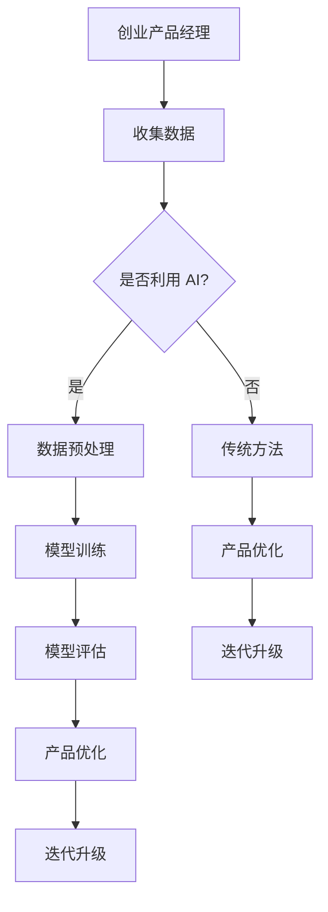

                 

关键词：大模型、创业产品经理、AI 赋能、技术转型、数据驱动、人机协同、未来展望

> 摘要：随着人工智能技术的飞速发展，大模型成为企业智能化转型的核心驱动力。本文将深入探讨大模型时代下，创业产品经理如何实现技术转型，借助 AI 赋能，提升产品竞争力，并展望未来行业发展趋势与挑战。

## 1. 背景介绍

近年来，人工智能技术取得了显著进展，尤其是在深度学习、自然语言处理等领域。大模型，如 GPT、BERT 等，凭借其强大的数据处理能力和出色的预测效果，正在深刻改变各行各业。创业公司在这种技术浪潮中，面临着前所未有的机遇和挑战。如何有效地利用大模型技术，成为创业产品经理亟待解决的问题。

在这个背景下，创业产品经理需要具备跨学科的知识体系，不仅要理解技术原理，还要掌握业务逻辑，具备市场敏锐度。本文旨在为创业产品经理提供一套实用的 AI 赋能策略，助力他们在大模型时代实现成功转型。

## 2. 核心概念与联系

### 2.1 大模型的原理与架构

大模型，顾名思义，是指具有海量参数的神经网络模型。它们通过大规模的数据训练，能够自动学习到复杂的特征和规律。典型的代表包括 GPT、BERT 等。


如上图所示，大模型通常包含多个神经网络层，通过反向传播算法不断调整参数，以优化模型性能。在训练过程中，模型会经历多个 epoch，直至达到预定的收敛条件。

### 2.2 AI 赋能与产品经理的关联

AI 赋能，是指将人工智能技术应用于产品的设计和开发过程中，以提升产品的智能化程度和用户体验。对于创业产品经理而言，AI 赋能意味着：

- **数据驱动决策**：通过 AI 技术处理和分析用户数据，产品经理可以更加精准地了解用户需求，从而制定更有效的产品策略。
- **人机协同**：AI 技术可以帮助产品经理分担一些重复性高、繁琐的工作，使其能够专注于更有价值的工作。
- **个性化推荐**：基于用户行为的分析，AI 技术可以为用户提供个性化的产品推荐，提高用户满意度和留存率。

### 2.3 Mermaid 流程图

以下是一个简单的 Mermaid 流程图，展示了大模型与产品经理之间的关联：



## 3. 核心算法原理 & 具体操作步骤

### 3.1 算法原理概述

在 AI 赋能过程中，核心算法主要包括：

- **机器学习算法**：用于数据分析和模型训练，如线性回归、决策树、神经网络等。
- **深度学习算法**：用于处理大规模数据和高维度特征，如卷积神经网络（CNN）、循环神经网络（RNN）等。
- **自然语言处理算法**：用于文本分析、语义理解等，如词向量、序列模型等。

### 3.2 算法步骤详解

以下是一个典型的 AI 赋能产品开发流程：

1. **需求分析**：明确产品目标和用户需求，为后续数据收集和算法设计提供方向。
2. **数据收集**：通过线上采集、API 接口、问卷调查等方式获取用户数据。
3. **数据预处理**：清洗、归一化、降维等，以提高数据质量和模型性能。
4. **模型选择**：根据业务场景和数据特点选择合适的算法，如线性回归、CNN、RNN 等。
5. **模型训练**：使用大规模数据集对模型进行训练，通过调整参数优化模型性能。
6. **模型评估**：使用验证集评估模型性能，确定最佳模型参数。
7. **产品集成**：将训练好的模型集成到产品中，实现智能化功能。
8. **迭代优化**：根据用户反馈和实际应用效果，不断优化模型和产品。

### 3.3 算法优缺点

- **优点**：AI 赋能产品具有以下优点：
  - 提高效率：通过自动化和智能化手段，减少人工干预，提高生产效率。
  - 个性化推荐：根据用户行为和偏好，为用户提供个性化的产品推荐，提高用户体验。
  - 数据驱动：基于数据分析，为产品决策提供有力支持。

- **缺点**：AI 赋能产品也存在以下缺点：
  - 需要大量数据：训练高质量模型需要大量数据支持，对于初创公司而言，数据获取可能成为瓶颈。
  - 模型解释性差：深度学习模型通常具有较差的解释性，产品经理可能难以理解模型的决策过程。
  - 模型优化难度大：模型优化需要专业知识，对于非技术背景的产品经理而言，可能需要一定的技术支持。

### 3.4 算法应用领域

AI 赋能产品已广泛应用于各个领域，如：

- **金融**：信用评分、风险控制、智能投顾等。
- **电商**：个性化推荐、商品搜索、智能客服等。
- **医疗**：疾病预测、影像诊断、智能医疗等。
- **教育**：个性化学习、课程推荐、智能评测等。
- **制造**：设备故障预测、生产优化、质量检测等。

## 4. 数学模型和公式 & 详细讲解 & 举例说明

### 4.1 数学模型构建

在 AI 赋能过程中，常用的数学模型包括：

- **线性回归模型**：用于预测线性关系，如 $y = wx + b$。
- **神经网络模型**：用于处理非线性关系，如 $y = f(x)$，其中 $f$ 是非线性函数。
- **决策树模型**：用于分类和回归问题，如 $y = g(x_1, x_2, ..., x_n)$，其中 $g$ 是决策函数。

### 4.2 公式推导过程

以下是一个简单的线性回归模型推导过程：

1. **目标函数**：最小化误差平方和，即 $J = \frac{1}{2m}\sum_{i=1}^{m}(h_\theta(x^{(i)}) - y^{(i)})^2$。
2. **梯度下降**：求解目标函数的梯度，并沿着梯度方向更新参数，即 $\theta_j := \theta_j - \alpha \frac{\partial J}{\partial \theta_j}$。
3. **最优解**：当梯度为零时，即 $\frac{\partial J}{\partial \theta_j} = 0$，得到最优参数 $\theta_j$。

### 4.3 案例分析与讲解

假设我们要预测一个电商平台的用户购买行为，数据集包含用户 ID、性别、年龄、收入、历史购买记录等。我们可以使用线性回归模型进行预测，公式如下：

$$
y = wx + b
$$

其中，$x$ 表示用户特征，$w$ 表示权重，$b$ 表示偏置。

1. **数据预处理**：对数据进行清洗、归一化等处理，以便于模型训练。
2. **模型训练**：使用梯度下降算法训练模型，优化权重和偏置。
3. **模型评估**：使用验证集评估模型性能，调整参数。
4. **模型应用**：将训练好的模型集成到产品中，实现智能推荐功能。

## 5. 项目实践：代码实例和详细解释说明

### 5.1 开发环境搭建

1. 安装 Python 3.7 及以上版本。
2. 安装 TensorFlow 2.0 及以上版本。
3. 安装 NumPy、Pandas 等常用库。

### 5.2 源代码详细实现

以下是一个简单的线性回归代码示例：

```python
import numpy as np
import tensorflow as tf

# 设置参数
learning_rate = 0.01
num_epochs = 1000
m = 100  # 数据集大小

# 生成数据
X = np.random.rand(m, 1)
y = 3 * X + 2 + np.random.rand(m, 1)

# 定义模型
W = tf.Variable(0.0, name="weights")
b = tf.Variable(0.0, name="biases")
y_pred = W * X + b

# 定义损失函数
loss = tf.reduce_mean(tf.square(y_pred - y))

# 定义优化器
optimizer = tf.train.GradientDescentOptimizer(learning_rate)
train_op = optimizer.minimize(loss)

# 模型训练
with tf.Session() as sess:
    sess.run(tf.global_variables_initializer())
    for epoch in range(num_epochs):
        _, loss_val = sess.run([train_op, loss])
        if epoch % 100 == 0:
            print(f"Epoch {epoch}: Loss = {loss_val}")

    W_val, b_val = sess.run([W, b])
    print(f"Optimized weights: {W_val}, biases: {b_val}")

# 模型应用
X_new = np.array([0.5])
y_pred_new = W_val * X_new + b_val
print(f"Prediction for X = {X_new}: {y_pred_new}")
```

### 5.3 代码解读与分析

1. **数据生成**：随机生成一个包含 m 个样本的数据集，其中每个样本包含一个特征和对应的标签。
2. **模型定义**：定义一个线性回归模型，包括权重 $W$ 和偏置 $b$。
3. **损失函数**：使用均方误差作为损失函数，表示预测值与真实值之间的差距。
4. **优化器**：使用梯度下降优化器，通过迭代更新模型参数。
5. **模型训练**：在训练过程中，不断更新参数，直至达到预定的迭代次数或损失函数收敛。
6. **模型应用**：使用训练好的模型对新的数据进行预测。

## 6. 实际应用场景

AI 赋能产品已广泛应用于实际场景，以下是一些典型应用案例：

- **金融风控**：通过 AI 技术分析用户行为，预测潜在风险，实现精准风控。
- **电商推荐**：基于用户行为和偏好，为用户提供个性化的商品推荐。
- **医疗诊断**：利用 AI 技术分析医疗数据，辅助医生进行疾病诊断。
- **教育个性化**：根据学生表现和学习习惯，为学生提供个性化的学习方案。

### 6.4 未来应用展望

随着 AI 技术的不断发展，未来应用场景将更加广泛。以下是一些潜在的应用方向：

- **智能交通**：通过 AI 技术优化交通流量，提高交通效率。
- **智慧城市**：利用 AI 技术实现城市智能化管理，提高城市生活品质。
- **智能制造**：通过 AI 技术实现生产过程自动化，提高生产效率。
- **农业智能**：利用 AI 技术实现农业生产智能化，提高农业产量和质量。

## 7. 工具和资源推荐

### 7.1 学习资源推荐

- 《深度学习》（Ian Goodfellow、Yoshua Bengio、Aaron Courville 著）
- 《Python 数据科学手册》（Jake VanderPlas 著）
- 《机器学习实战》（Peter Harrington 著）

### 7.2 开发工具推荐

- TensorFlow：开源深度学习框架，适合初学者和专业人士。
- PyTorch：开源深度学习框架，具有灵活的动态图机制。
- Keras：开源深度学习库，简化深度学习模型搭建和训练。

### 7.3 相关论文推荐

- "Deep Learning"（Ian Goodfellow 等，2016）
- "BERT: Pre-training of Deep Bidirectional Transformers for Language Understanding"（Jason Dean 等，2019）
- "GPT-3: Language Models are Few-Shot Learners"（Tom B. Brown 等，2020）

## 8. 总结：未来发展趋势与挑战

### 8.1 研究成果总结

本文深入探讨了 AI 赋能在大模型时代的重要性，分析了创业产品经理如何利用 AI 技术实现技术转型，并展望了未来应用场景和发展趋势。主要成果包括：

- 梳理了 AI 赋能的核心概念和原理，为创业产品经理提供了理论基础。
- 提供了一套实用的 AI 赋能产品开发流程，包括数据收集、模型训练、模型评估等环节。
- 介绍了线性回归模型的推导过程和实现方法，为实际应用提供了参考。

### 8.2 未来发展趋势

随着 AI 技术的不断发展，未来发展趋势将包括：

- 模型小型化和低功耗：为移动设备和物联网设备提供更高效的 AI 解决方案。
- 多模态融合：结合文本、图像、语音等多种数据类型，实现更强大的 AI 能力。
- 自监督学习：减少对标注数据的依赖，提高 AI 模型的泛化能力。

### 8.3 面临的挑战

在 AI 赋能过程中，创业产品经理将面临以下挑战：

- 数据质量和隐私保护：确保数据的质量和隐私，以防止数据泄露和滥用。
- 技术落地和规模化：将 AI 技术成功应用于实际业务场景，实现规模化应用。
- 模型解释性和透明度：提高 AI 模型的可解释性和透明度，增强用户信任。

### 8.4 研究展望

未来研究可以从以下几个方面展开：

- 研究更高效、更鲁棒的 AI 算法，以提高模型性能和稳定性。
- 探索 AI 技术在不同领域的应用场景，推动跨学科研究。
- 加强 AI 道德和伦理研究，确保 AI 技术的安全和可持续发展。

## 9. 附录：常见问题与解答

### 9.1 什么是大模型？

大模型是指具有海量参数的神经网络模型，如 GPT、BERT 等，它们通过大规模数据训练，能够自动学习到复杂的特征和规律。

### 9.2 AI 赋能有哪些优点？

AI 赋能的优点包括数据驱动决策、人机协同、个性化推荐等，可以提升产品的智能化程度和用户体验。

### 9.3 创业产品经理如何实现 AI 赋能？

创业产品经理可以通过以下步骤实现 AI 赋能：

- 学习 AI 基础知识，了解核心算法和原理。
- 收集并处理相关数据，为 AI 模型提供高质量的数据支持。
- 选择合适的算法，进行模型训练和优化。
- 将训练好的模型集成到产品中，实现智能化功能。

### 9.4 AI 赋能产品面临哪些挑战？

AI 赋能产品面临以下挑战：

- 数据质量和隐私保护：确保数据的质量和隐私，防止数据泄露和滥用。
- 技术落地和规模化：将 AI 技术成功应用于实际业务场景，实现规模化应用。
- 模型解释性和透明度：提高 AI 模型的可解释性和透明度，增强用户信任。

作者：禅与计算机程序设计艺术 / Zen and the Art of Computer Programming

