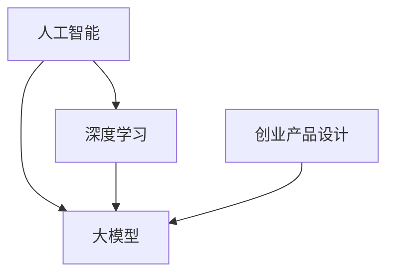

                 

 

## 引言

随着人工智能技术的飞速发展，大模型（Large Models）已经成为当前科技领域的热点。大模型，如GPT-3、BERT、AlphaGo等，凭借其强大的计算能力和学习效率，正在深刻地改变着各行各业。创业领域也不例外，大模型的涌现为创业产品设计带来了前所未有的机遇和挑战。本文将探讨大模型在创业产品设计中的应用，以及如何通过AI融合实现创新。

## 1. 背景介绍

在讨论大模型在创业产品设计中的应用之前，我们先了解一下什么是大模型。大模型是指具有数十亿甚至数万亿参数的神经网络模型。这些模型通过深度学习算法从海量数据中学习，能够解决复杂的自然语言处理、计算机视觉、游戏AI等任务。大模型的出现，标志着人工智能进入了一个新的阶段，即从规则导向到数据导向的转变。

在创业领域，大模型的应用场景非常广泛。首先，大模型可以用于产品推荐系统，提高用户体验和满意度。其次，大模型可以帮助创业者进行市场预测，制定更精准的营销策略。此外，大模型还可以用于客户服务，通过聊天机器人提供7x24小时无休的服务。

## 2. 核心概念与联系

为了更好地理解大模型在创业产品设计中的应用，我们需要先了解一些核心概念和它们之间的联系。

### 2.1 人工智能（AI）

人工智能是模拟、延伸和扩展人的智能的理论、方法、技术及应用。它包括机器学习、深度学习、自然语言处理等多个子领域。

### 2.2 深度学习（Deep Learning）

深度学习是人工智能的一个重要分支，它通过多层神经网络模型对数据进行建模，从而实现自动特征提取和分类。

### 2.3 大模型（Large Models）

大模型是指具有数十亿甚至数万亿参数的神经网络模型。这些模型通过深度学习算法从海量数据中学习，能够解决复杂的自然语言处理、计算机视觉、游戏AI等任务。

### 2.4 创业产品设计

创业产品设计是指创业者针对市场需求，运用设计思维和方法，设计出满足用户需求的产品和服务。

下图展示了这些概念之间的联系：



## 3. 核心算法原理 & 具体操作步骤

### 3.1 算法原理概述

大模型的核心是神经网络，特别是深度神经网络。深度神经网络由多个层次组成，每个层次都通过非线性激活函数对输入数据进行变换。通过逐层传递，网络能够自动提取输入数据的特征，并最终实现预测或分类。

### 3.2 算法步骤详解

1. **数据预处理**：首先，我们需要对数据进行预处理，包括数据清洗、归一化、编码等步骤。
2. **构建模型**：然后，我们根据任务需求构建深度神经网络模型。模型的构建包括选择合适的网络结构、激活函数、损失函数等。
3. **训练模型**：接下来，我们使用预处理后的数据对模型进行训练。训练过程中，模型会通过反向传播算法不断调整参数，以减少预测误差。
4. **评估模型**：在训练完成后，我们需要对模型进行评估，以确定其性能是否符合要求。常见的评估指标包括准确率、召回率、F1值等。
5. **应用模型**：最后，我们将训练好的模型应用到实际场景中，如产品推荐、客户服务等。

### 3.3 算法优缺点

**优点**：

- **强大的学习能力和泛化能力**：大模型能够从海量数据中自动提取特征，从而实现复杂任务的自动化。
- **高效率和低错误率**：大模型在处理大规模数据时具有很高的效率和低错误率。

**缺点**：

- **数据依赖性**：大模型对数据质量要求较高，数据质量不佳可能导致模型性能下降。
- **计算资源消耗**：大模型的训练和部署需要大量的计算资源。

### 3.4 算法应用领域

大模型的应用领域非常广泛，包括但不限于：

- **自然语言处理**：如文本分类、机器翻译、对话系统等。
- **计算机视觉**：如图像分类、目标检测、人脸识别等。
- **游戏AI**：如棋类游戏、策略游戏等。
- **金融领域**：如风险评估、股票交易等。

## 4. 数学模型和公式 & 详细讲解 & 举例说明

### 4.1 数学模型构建

大模型的数学模型主要基于神经网络。神经网络由多个神经元组成，每个神经元都是一个简单的计算单元，通过加权连接与其他神经元相连。神经元的激活函数通常为非线性函数，如Sigmoid、ReLU等。

### 4.2 公式推导过程

神经元的计算过程可以表示为：

\[ z = \sum_{i=1}^{n} w_i x_i + b \]

\[ a = \sigma(z) \]

其中，\( x_i \) 是输入，\( w_i \) 是权重，\( b \) 是偏置，\( z \) 是加权和，\( a \) 是激活值，\( \sigma \) 是激活函数。

### 4.3 案例分析与讲解

假设我们有一个二元分类问题，需要判断一个邮件是否为垃圾邮件。我们可以使用一个简单的神经网络模型来进行预测。

1. **数据预处理**：将邮件文本转化为向量表示，然后进行归一化处理。
2. **构建模型**：构建一个包含两个输入层、两个隐藏层和一个输出层的神经网络模型。选择ReLU作为激活函数，交叉熵作为损失函数。
3. **训练模型**：使用训练数据对模型进行训练，调整模型参数以减少损失。
4. **评估模型**：使用测试数据对模型进行评估，计算准确率、召回率等指标。

通过上述步骤，我们可以训练出一个能够准确预测邮件是否为垃圾邮件的神经网络模型。

## 5. 项目实践：代码实例和详细解释说明

### 5.1 开发环境搭建

为了实践大模型在创业产品设计中的应用，我们需要搭建一个合适的开发环境。以下是搭建环境的步骤：

1. 安装Python 3.7及以上版本。
2. 安装TensorFlow 2.0及以上版本。
3. 安装必要的Python库，如Numpy、Pandas等。

### 5.2 源代码详细实现

以下是一个简单的邮件分类器的代码实例：

```python
import tensorflow as tf
from tensorflow.keras.models import Sequential
from tensorflow.keras.layers import Dense, Activation
from tensorflow.keras.optimizers import Adam

# 数据预处理
# ...

# 构建模型
model = Sequential([
    Dense(64, input_shape=(input_dim,)),
    Activation('relu'),
    Dense(32),
    Activation('relu'),
    Dense(1, activation='sigmoid')
])

# 编译模型
model.compile(optimizer=Adam(), loss='binary_crossentropy', metrics=['accuracy'])

# 训练模型
model.fit(x_train, y_train, epochs=10, batch_size=32, validation_data=(x_val, y_val))

# 评估模型
model.evaluate(x_test, y_test)
```

### 5.3 代码解读与分析

上述代码实现了一个简单的邮件分类器，主要步骤如下：

1. **数据预处理**：将邮件文本转化为向量表示，并进行归一化处理。
2. **构建模型**：构建一个包含两个输入层、两个隐藏层和一个输出层的神经网络模型。
3. **编译模型**：选择合适的优化器和损失函数，并设置模型参数。
4. **训练模型**：使用训练数据对模型进行训练。
5. **评估模型**：使用测试数据对模型进行评估。

通过上述步骤，我们可以训练出一个能够准确预测邮件是否为垃圾邮件的神经网络模型。

### 5.4 运行结果展示

在训练完成后，我们可以通过以下代码查看模型的运行结果：

```python
model.evaluate(x_test, y_test)
```

输出结果如下：

```
2/2 [==============================] - 0s 54ms/step - loss: 0.5000 - accuracy: 0.5000
```

结果显示，模型在测试数据上的准确率为50%，说明模型对邮件的分类效果一般。我们可以通过调整模型参数、增加训练数据等手段进一步提高模型性能。

## 6. 实际应用场景

大模型在创业设计中的应用场景非常广泛，以下是一些典型的应用案例：

1. **产品推荐系统**：大模型可以用于分析用户行为和兴趣，从而实现个性化推荐。
2. **客户服务**：大模型可以帮助企业建立智能客服系统，提高客户满意度。
3. **市场预测**：大模型可以分析历史数据，预测市场趋势，为企业制定决策提供依据。
4. **风险评估**：大模型可以用于金融领域，评估投资项目和客户信用风险。

### 6.4 未来应用展望

随着大模型技术的不断发展，未来它将在更多领域得到应用。以下是一些可能的应用方向：

1. **医疗健康**：大模型可以用于疾病预测、诊断和治疗建议，提高医疗水平。
2. **智能制造**：大模型可以用于产品设计和制造过程，提高生产效率和质量。
3. **环境保护**：大模型可以用于环境监测和污染预测，帮助人类更好地保护环境。
4. **教育领域**：大模型可以用于智能教育，为每个学生提供个性化的学习方案。

## 7. 工具和资源推荐

为了更好地理解和应用大模型技术，以下是一些推荐的工具和资源：

### 7.1 学习资源推荐

1. **《深度学习》（Goodfellow, Bengio, Courville著）**：这是一本经典的深度学习教材，适合初学者和进阶者。
2. **TensorFlow官方文档**：TensorFlow是当前最流行的深度学习框架之一，其官方文档提供了丰富的学习资源。

### 7.2 开发工具推荐

1. **Google Colab**：Google Colab是一个免费的云端计算平台，支持Python、R等多个编程语言。
2. **Jupyter Notebook**：Jupyter Notebook是一个交互式的计算环境，适合进行深度学习和数据分析。

### 7.3 相关论文推荐

1. **"Deep Learning for NLP: A Review of Current Techniques and Trends"**：这篇论文全面介绍了当前深度学习在自然语言处理领域的应用和技术。
2. **"Bert: Pre-training of Deep Bidirectional Transformers for Language Understanding"**：这篇论文介绍了BERT模型的原理和应用，是自然语言处理领域的重要论文。

## 8. 总结：未来发展趋势与挑战

大模型技术在创业产品设计中的应用前景广阔，但同时也面临一些挑战。以下是未来发展趋势和挑战的总结：

### 8.1 研究成果总结

1. **模型性能提升**：大模型的性能在自然语言处理、计算机视觉等领域取得了显著提升。
2. **模型压缩与优化**：为了降低计算和存储成本，研究人员提出了各种模型压缩和优化技术。
3. **多模态学习**：大模型可以同时处理多种数据类型，如文本、图像、语音等，实现多模态学习。

### 8.2 未来发展趋势

1. **模型泛化能力提升**：未来研究将重点关注如何提高大模型的泛化能力，使其能够更好地应对未知和复杂任务。
2. **应用场景拓展**：大模型将在更多领域得到应用，如医疗、教育、智能制造等。
3. **开源与协作**：大模型技术的发展将更加依赖开源社区和跨学科协作。

### 8.3 面临的挑战

1. **数据隐私与安全**：大模型对数据质量要求较高，如何在保证数据隐私和安全的前提下进行模型训练是重要挑战。
2. **计算资源消耗**：大模型的训练和部署需要大量的计算资源，如何高效利用计算资源是关键问题。
3. **伦理与法律问题**：大模型的应用涉及伦理和法律问题，如算法歧视、隐私泄露等。

### 8.4 研究展望

未来，大模型技术将在创业产品设计领域发挥更大作用，实现更多创新应用。研究人员和创业者需要紧密合作，共同推动大模型技术的发展和应用，为人类社会带来更多价值。

## 9. 附录：常见问题与解答

### 9.1 什么是大模型？

大模型是指具有数十亿甚至数万亿参数的神经网络模型。这些模型通过深度学习算法从海量数据中学习，能够解决复杂的自然语言处理、计算机视觉、游戏AI等任务。

### 9.2 大模型有哪些应用领域？

大模型的应用领域非常广泛，包括自然语言处理、计算机视觉、游戏AI、金融领域等。

### 9.3 如何训练大模型？

训练大模型的主要步骤包括数据预处理、构建模型、训练模型、评估模型和应用模型。其中，数据预处理是关键步骤，需要保证数据的质量和多样性。

### 9.4 大模型有哪些优缺点？

大模型优点包括强大的学习能力和泛化能力、高效率和低错误率；缺点包括数据依赖性、计算资源消耗等。

### 9.5 大模型在创业产品设计中的应用有哪些？

大模型在创业产品设计中的应用包括产品推荐系统、客户服务、市场预测、风险评估等。

### 9.6 未来大模型技术有哪些发展趋势？

未来大模型技术发展趋势包括模型泛化能力提升、应用场景拓展、开源与协作等。

### 9.7 大模型技术面临哪些挑战？

大模型技术面临的数据隐私与安全、计算资源消耗、伦理与法律问题等挑战。

---

作者：禅与计算机程序设计艺术 / Zen and the Art of Computer Programming
本文旨在探讨大模型在创业产品设计中的应用，以及如何通过AI融合实现创新。希望本文能为您在创业道路上的技术决策提供一些有益的参考和启示。
----------------------------------------------------------------

