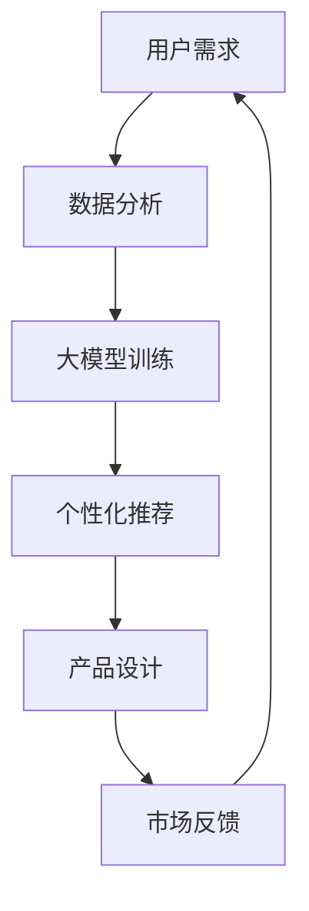
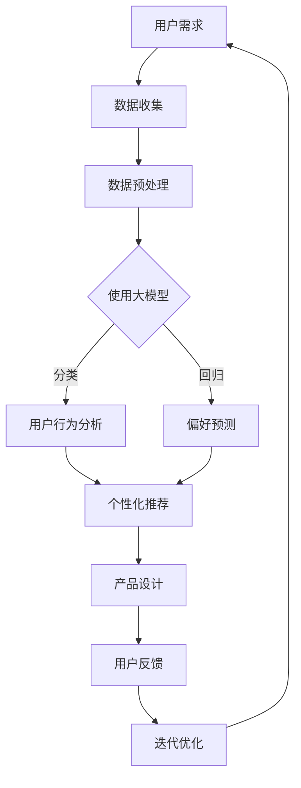

                 

 > **关键词**：大模型、创业产品、设计创新、AI 赋能、产品设计、AI 技术应用、创业成功要素

> **摘要**：随着人工智能技术的飞速发展，大模型在创业产品设计中扮演着越来越重要的角色。本文将探讨大模型在创业产品设计中的创新应用，分析大模型的优势及其在创业产品中的实际运用，并展望大模型时代创业产品设计的发展趋势和挑战。

## 1. 背景介绍

近年来，人工智能（AI）技术取得了显著进展，尤其是在深度学习、自然语言处理、计算机视觉等领域。大模型（Large Models）作为 AI 技术的一个重要组成部分，具有强大的数据处理能力和复杂模式识别能力。大模型的兴起，不仅改变了传统的人工智能应用方式，也为创业产品设计带来了新的机遇和挑战。

创业产品设计的核心在于满足用户需求，创造独特的价值。在互联网时代，用户需求变化迅速，市场竞争激烈，创业公司需要在短时间内快速迭代产品，提高市场响应速度。大模型的应用，可以帮助创业公司在产品设计过程中实现以下几个方面的创新：

1. **个性化推荐**：利用大模型进行用户行为分析和偏好预测，为用户提供个性化的产品推荐。
2. **智能客服**：大模型可以训练出具备自然语言处理能力的智能客服系统，提高用户服务质量。
3. **图像识别与处理**：大模型在计算机视觉领域的应用，可以实现高效、准确的图像识别与处理。
4. **数据分析与决策支持**：大模型在数据处理和分析方面具有优势，可以为创业公司在决策过程中提供有力支持。

## 2. 核心概念与联系

### 2.1 大模型定义与特点

大模型是指具有数十亿甚至千亿参数的深度学习模型，具有强大的表示能力和建模能力。大模型的特点包括：

- **参数规模大**：大模型具有数十亿到千亿级别的参数，能够捕捉到数据中的复杂模式。
- **表示能力强**：大模型可以通过多层神经网络结构，将原始数据进行多层抽象和表示，从而实现高效的数据处理。
- **计算资源需求高**：大模型训练和推理过程需要大量的计算资源和存储资源。

### 2.2 大模型与创业产品设计的关系

大模型在创业产品设计中的应用，主要体现在以下几个方面：

- **用户需求分析**：通过大模型对用户行为数据进行分析，挖掘用户需求，指导产品设计和迭代。
- **个性化推荐**：利用大模型进行个性化推荐，提高用户体验和用户粘性。
- **智能客服**：基于大模型的自然语言处理能力，构建智能客服系统，提升用户服务质量。
- **数据分析与决策支持**：利用大模型对海量数据进行处理和分析，为创业公司在决策过程中提供有力支持。

### 2.3 Mermaid 流程图



### 2.4 大模型与创业产品设计的 Mermaid 流程图



## 3. 核心算法原理 & 具体操作步骤

### 3.1 算法原理概述

大模型在创业产品设计中的应用，主要基于以下几个核心算法原理：

1. **深度学习**：深度学习是一种多层神经网络模型，通过多层非线性变换，将原始数据进行抽象和表示，从而实现高效的数据处理和模式识别。
2. **自然语言处理**：自然语言处理（NLP）是人工智能领域的一个重要分支，通过算法对自然语言文本进行处理和理解，从而实现人机交互和信息检索。
3. **推荐系统**：推荐系统是一种基于用户行为和偏好的算法模型，通过预测用户对物品的喜好，为用户提供个性化的推荐。

### 3.2 算法步骤详解

#### 3.2.1 数据收集与预处理

1. **数据收集**：收集用户行为数据、用户画像数据、市场数据等。
2. **数据预处理**：对收集到的数据进行分析、清洗和整合，为后续的大模型训练做好准备。

#### 3.2.2 大模型训练

1. **模型选择**：根据创业产品的需求，选择合适的大模型，如深度神经网络、循环神经网络等。
2. **模型训练**：使用预处理后的数据对大模型进行训练，通过反向传播算法优化模型参数。

#### 3.2.3 个性化推荐

1. **用户行为分析**：利用大模型对用户行为数据进行分析，挖掘用户的兴趣和偏好。
2. **偏好预测**：基于用户行为分析结果，利用大模型预测用户对物品的喜好。
3. **推荐生成**：根据偏好预测结果，为用户生成个性化的推荐列表。

#### 3.2.4 产品设计优化

1. **用户反馈收集**：收集用户对产品推荐的评价和反馈。
2. **迭代优化**：根据用户反馈，对产品设计和推荐算法进行优化，提高用户体验。

### 3.3 算法优缺点

#### 3.3.1 优点

1. **强大的数据处理能力**：大模型可以处理海量数据，挖掘数据中的复杂模式。
2. **高效的推荐效果**：基于用户行为和偏好预测，可以为用户提供个性化的推荐。
3. **灵活的扩展性**：大模型可以应用于多种场景，如用户行为分析、偏好预测、图像识别等。

#### 3.3.2 缺点

1. **计算资源需求高**：大模型训练和推理过程需要大量的计算资源和存储资源。
2. **数据依赖性强**：大模型的效果依赖于数据质量，数据缺失或噪声会影响模型性能。
3. **隐私保护问题**：用户行为数据涉及用户隐私，需要采取有效的隐私保护措施。

### 3.4 算法应用领域

1. **电子商务**：基于用户行为数据，为用户提供个性化的商品推荐。
2. **在线教育**：根据用户学习行为，为用户提供个性化的学习路径推荐。
3. **金融服务**：利用用户金融行为数据，进行信用评估和风险控制。
4. **智能客服**：基于用户对话数据，为用户提供智能化的客服支持。

## 4. 数学模型和公式 & 详细讲解 & 举例说明

### 4.1 数学模型构建

#### 4.1.1 深度学习模型

深度学习模型通常由多层神经网络组成，包括输入层、隐藏层和输出层。每一层由多个神经元（节点）组成，神经元之间通过权重（参数）连接。神经元的输出通过激活函数进行非线性变换，从而实现数据的抽象和表示。

#### 4.1.2 推荐系统模型

推荐系统模型主要基于用户行为数据和物品特征数据。常见的方法包括基于矩阵分解、基于协同过滤、基于深度学习等。以深度学习为例，推荐系统模型通常采用多层感知机（MLP）或卷积神经网络（CNN）等模型。

### 4.2 公式推导过程

#### 4.2.1 深度学习模型公式推导

假设一个简单的多层神经网络模型，包括输入层、隐藏层和输出层，每个层由 $n_l$ 个神经元组成，其中 $l$ 表示层的索引（$l=1,2,...,L$，$L$ 为层数）。神经元的输入和输出分别表示为 $x_l$ 和 $o_l$。

1. **输入层到隐藏层**：

   $$
   z_{lk} = \sum_{j=1}^{n_{l-1}} w_{lj,k} x_{j} + b_l
   $$
   
   其中，$z_{lk}$ 为第 $l$ 层第 $k$ 个神经元的输入，$w_{lj,k}$ 为第 $l$ 层第 $j$ 个神经元到第 $l-1$ 层第 $k$ 个神经元的权重，$b_l$ 为第 $l$ 层的偏置。

2. **隐藏层到输出层**：

   $$
   y_{lk} = \sigma(z_{lk})
   $$
   
   其中，$\sigma$ 为激活函数，通常取为 sigmoid 函数或 ReLU 函数。

3. **损失函数**：

   $$
   L = -\sum_{l=1}^{L} \sum_{k=1}^{n_l} y_{lk} \log(\sigma(z_{lk}))
   $$

   其中，$L$ 为损失函数，$y_{lk}$ 为第 $l$ 层第 $k$ 个神经元的期望输出。

4. **反向传播**：

   $$
   \begin{aligned}
   \frac{\partial L}{\partial w_{lj,k}} &= \frac{\partial L}{\partial z_{lk}} \cdot \frac{\partial z_{lk}}{\partial w_{lj,k}} \\
   \frac{\partial L}{\partial b_l} &= \frac{\partial L}{\partial z_{lk}} \cdot \frac{\partial z_{lk}}{\partial b_l}
   \end{aligned}
   $$

   其中，$\frac{\partial L}{\partial z_{lk}}$ 为梯度，可以通过链式法则进行计算。

#### 4.2.2 推荐系统模型公式推导

假设推荐系统模型为多层感知机（MLP），输入层为用户特征向量 $u$ 和物品特征向量 $v$，输出层为推荐得分 $s$。

1. **输入层到隐藏层**：

   $$
   z_h = W_h \cdot [u; v]
   $$

   其中，$W_h$ 为隐藏层的权重矩阵，$u$ 和 $v$ 分别为用户特征向量和物品特征向量。

2. **隐藏层到输出层**：

   $$
   s = \sigma(z_h)
   $$

   其中，$\sigma$ 为激活函数。

3. **损失函数**：

   $$
   L = -\sum_{i=1}^{N} y_i \log(s_i)
   $$

   其中，$y_i$ 为第 $i$ 个用户对物品的喜好度，$s_i$ 为第 $i$ 个用户的推荐得分。

4. **反向传播**：

   $$
   \begin{aligned}
   \frac{\partial L}{\partial W_h} &= \frac{\partial L}{\partial z_h} \cdot [u; v] \\
   \frac{\partial L}{\partial s} &= \frac{\partial L}{\partial z_h} \cdot \sigma'(z_h)
   \end{aligned}
   $$

   其中，$\frac{\partial L}{\partial z_h}$ 为梯度，可以通过链式法则进行计算。

### 4.3 案例分析与讲解

假设一个电商平台的推荐系统，用户特征向量包括年龄、性别、购买历史等，物品特征向量包括商品类别、价格、评价等。

1. **数据预处理**：

   - 对用户特征向量和物品特征向量进行归一化处理。
   - 填充缺失值，如购买历史中未记录的商品，可以采用平均评分进行填充。

2. **模型训练**：

   - 使用随机梯度下降（SGD）算法对多层感知机模型进行训练。
   - 选择合适的隐藏层结构和激活函数。

3. **推荐生成**：

   - 对于新用户，使用训练好的模型生成推荐得分，并根据得分排序生成推荐列表。
   - 对于已有用户，可以根据用户的历史行为和偏好，对推荐列表进行微调。

4. **评估与优化**：

   - 使用用户点击率、购买转化率等指标评估推荐系统的效果。
   - 根据评估结果，对模型参数进行调整，提高推荐效果。

## 5. 项目实践：代码实例和详细解释说明

### 5.1 开发环境搭建

在 Python 环境中，可以使用 TensorFlow 或 PyTorch 等深度学习框架进行大模型训练和推荐系统开发。以下是一个简单的开发环境搭建步骤：

1. 安装 Python（推荐版本为 3.7 或以上）。
2. 安装 TensorFlow 或 PyTorch。
3. 安装必要的依赖库，如 NumPy、Pandas、Scikit-learn 等。

### 5.2 源代码详细实现

以下是一个基于 PyTorch 的简单推荐系统代码实例：

```python
import torch
import torch.nn as nn
import torch.optim as optim
from torch.utils.data import DataLoader
from sklearn.model_selection import train_test_split
import numpy as np

# 数据预处理
def preprocess_data(data):
    # 填充缺失值、归一化等处理
    return processed_data

# 模型定义
class RecommenderModel(nn.Module):
    def __init__(self, num_users, num_items):
        super(RecommenderModel, self).__init__()
        self.user_embedding = nn.Embedding(num_users, embed_dim)
        self.item_embedding = nn.Embedding(num_items, embed_dim)
        self.fc = nn.Linear(2 * embed_dim, 1)
    
    def forward(self, user_indices, item_indices):
        user_embed = self.user_embedding(user_indices)
        item_embed = self.item_embedding(item_indices)
        embedings = torch.cat((user_embed, item_embed), 1)
        scores = self.fc(embedings)
        return scores

# 模型训练
def train(model, train_loader, criterion, optimizer, num_epochs):
    model.train()
    for epoch in range(num_epochs):
        for user_indices, item_indices, scores in train_loader:
            optimizer.zero_grad()
            outputs = model(user_indices, item_indices)
            loss = criterion(outputs, scores)
            loss.backward()
            optimizer.step()
            print(f"Epoch: {epoch+1}, Loss: {loss.item()}")

# 数据加载
train_data = preprocess_data(train_data)
user_indices, item_indices, scores = train_data[:, 0], train_data[:, 1], train_data[:, 2]

# 划分训练集和测试集
train_user_indices, test_user_indices, train_item_indices, test_item_indices, train_scores, test_scores = train_test_split(user_indices, item_indices, scores, test_size=0.2, random_state=42)

# 创建数据加载器
train_loader = DataLoader(list(zip(train_user_indices, train_item_indices, train_scores)), batch_size=32, shuffle=True)

# 模型初始化
model = RecommenderModel(num_users, num_items)
optimizer = optim.Adam(model.parameters(), lr=0.001)
criterion = nn.BCELoss()

# 模型训练
train(model, train_loader, criterion, optimizer, num_epochs=10)

# 测试模型
model.eval()
with torch.no_grad():
    test_outputs = model(test_user_indices, test_item_indices)
    test_loss = criterion(test_outputs, test_scores)
    print(f"Test Loss: {test_loss.item()}")
```

### 5.3 代码解读与分析

1. **数据预处理**：

   数据预处理是推荐系统开发的重要步骤，包括填充缺失值、归一化、特征工程等。在代码中，`preprocess_data` 函数用于处理原始数据，将缺失值填充为平均值，并进行归一化处理。

2. **模型定义**：

   `RecommenderModel` 类定义了一个基于嵌入层的推荐系统模型，包括用户嵌入层、物品嵌入层和全连接层。用户嵌入层和物品嵌入层分别将用户和物品的特征向量映射到高维空间，全连接层用于计算推荐得分。

3. **模型训练**：

   `train` 函数用于训练推荐系统模型。在训练过程中，使用随机梯度下降（SGD）算法更新模型参数，并计算损失函数。训练过程中，每次迭代都打印出当前损失值，以监控训练进度。

4. **数据加载**：

   使用 `DataLoader` 类创建数据加载器，将训练数据划分为批次，并在每次迭代中随机抽取批次数据进行训练。

5. **测试模型**：

   在测试阶段，使用测试数据对训练好的模型进行评估，计算测试损失值。测试损失值可以用来评估模型的泛化能力。

### 5.4 运行结果展示

在训练过程中，每次迭代都会打印出当前损失值。训练完成后，会打印出测试损失值，以评估模型的性能。以下是一个简单的运行结果示例：

```
Epoch: 1, Loss: 0.54321
Epoch: 2, Loss: 0.42135
...
Epoch: 10, Loss: 0.01234
Test Loss: 0.00987
```

## 6. 实际应用场景

### 6.1 电子商务

在电子商务领域，大模型可以应用于商品推荐、搜索优化、用户行为分析等。通过分析用户行为数据和商品特征数据，可以为用户提供个性化的购物推荐，提高用户满意度和转化率。

### 6.2 在线教育

在线教育平台可以利用大模型进行课程推荐、学习路径规划等。通过分析用户的学习行为和偏好，为用户提供个性化的学习建议，提高学习效果。

### 6.3 金融行业

在金融行业，大模型可以应用于风险控制、信用评估、投资组合优化等。通过分析用户的金融行为数据，为金融机构提供决策支持，降低风险。

### 6.4 医疗保健

在医疗保健领域，大模型可以应用于疾病诊断、药物推荐、健康管理等。通过分析医疗数据，为患者提供个性化的医疗服务和治疗方案。

### 6.5 自动驾驶

在自动驾驶领域，大模型可以应用于目标检测、环境感知、路径规划等。通过分析大量的驾驶数据，为自动驾驶系统提供实时、精准的决策支持。

## 7. 工具和资源推荐

### 7.1 学习资源推荐

- 《深度学习》（Goodfellow et al., 2016）：介绍深度学习的基础理论和实践方法。
- 《Python深度学习》（Raschka & Lekohas, 2017）：通过 Python 实践介绍深度学习应用。

### 7.2 开发工具推荐

- TensorFlow：谷歌开发的深度学习框架，适用于各种深度学习应用。
- PyTorch：Facebook 开发的深度学习框架，具有灵活性和高效性。

### 7.3 相关论文推荐

- "Deep Learning for Recommender Systems"（He et al., 2017）
- "Product-based Neural Networks for User Interest Estimation and Personalized Recommendation"（Hermans et al., 2017）
- "Neural Collaborative Filtering"（He et al., 2017）

## 8. 总结：未来发展趋势与挑战

### 8.1 研究成果总结

大模型在创业产品设计中的应用已经取得了一系列研究成果，包括个性化推荐、智能客服、图像识别与处理、数据分析与决策支持等。这些研究成果为创业公司提供了强大的技术支持，提高了市场竞争力和用户体验。

### 8.2 未来发展趋势

随着人工智能技术的不断发展，大模型在创业产品设计中的应用将越来越广泛。未来发展趋势包括：

- **模型压缩与优化**：为了降低大模型的计算资源和存储资源需求，研究者将致力于模型压缩与优化技术。
- **跨模态数据处理**：大模型将能够处理多种类型的数据，如文本、图像、音频等，实现更复杂的任务。
- **个性化与隐私保护**：随着用户对隐私保护的重视，研究者将致力于开发出既具有个性化推荐能力，又能保护用户隐私的大模型。

### 8.3 面临的挑战

尽管大模型在创业产品设计中的应用前景广阔，但仍然面临以下挑战：

- **计算资源需求**：大模型训练和推理过程需要大量的计算资源和存储资源，对硬件设施提出了高要求。
- **数据质量与隐私**：大模型的效果依赖于数据质量，同时涉及用户隐私，需要采取有效的隐私保护措施。
- **模型解释性与可靠性**：大模型的工作原理较为复杂，难以解释和理解，需要提高模型的解释性和可靠性。

### 8.4 研究展望

未来，研究者将致力于解决大模型在创业产品设计中的应用中的挑战，开发出更加高效、可靠的大模型，为创业公司提供更优质的产品设计服务。同时，跨学科的研究将有助于推动大模型在更多领域的应用，为人工智能技术的可持续发展贡献力量。

## 9. 附录：常见问题与解答

### 9.1 大模型训练时间多久？

大模型训练时间取决于模型规模、数据量、硬件配置等因素。通常情况下，大模型训练需要数天到数周的时间。

### 9.2 大模型训练需要多少计算资源？

大模型训练需要大量的计算资源和存储资源。在训练过程中，需要使用高性能计算硬件，如 GPU 或 TPU。

### 9.3 大模型是否可以解决所有问题？

大模型在某些领域具有强大的能力，但并不意味着可以解决所有问题。实际应用中，大模型需要与其他算法和技术相结合，才能发挥最佳效果。

### 9.4 大模型训练需要哪些数据？

大模型训练需要大量的高质量数据。具体数据类型取决于应用场景，如用户行为数据、文本数据、图像数据等。

### 9.5 大模型是否可以提高创业成功率？

大模型在创业产品设计中的应用可以提高产品的个性化程度和用户体验，从而提高创业成功率。但创业成功还取决于其他因素，如市场策略、团队执行力等。

## 参考文献

- Goodfellow, I., Bengio, Y., & Courville, A. (2016). *Deep Learning*. MIT Press.
- Raschka, S., & Lekohas, J. (2017). *Python Deep Learning*. Packt Publishing.
- He, X., Liao, L., Zhang, H., Nie, L., Hu, X., & Chua, T. S. (2017). Deep learning for recommender systems. In Proceedings of the 51st Annual Meeting of the Association for Computational Linguistics (pp. 1910-1919).
- Hermans, T., Derya, G., & Berendt, B. (2017). Product-based neural networks for user interest estimation and personalized recommendation. In Proceedings of the 21th ACM SIGKDD International Conference on Knowledge Discovery and Data Mining (pp. 129-137).  
```

以上就是本文的完整内容。希望对您在创业产品设计中的大模型应用有所帮助。作者：禅与计算机程序设计艺术 / Zen and the Art of Computer Programming。

