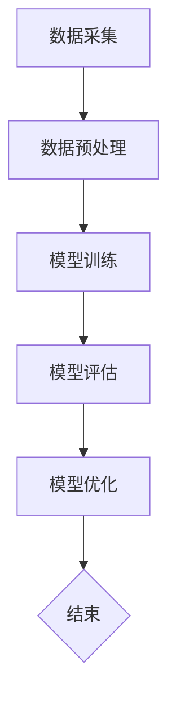

                 

关键词：大模型时代、创业产品设计、AI 驱动、成功原则、技术策略

摘要：在人工智能大模型时代，创业产品的设计原则正在发生深刻变革。本文将深入探讨大模型时代下的创业产品设计原则，从核心概念、算法原理、数学模型、项目实践到实际应用场景，全面解析AI驱动的成功之道。

## 1. 背景介绍

近年来，人工智能（AI）技术取得了飞速发展，特别是大模型（如GPT-3、BERT等）的兴起，使得AI在各个领域的应用变得愈发广泛和深入。在这个大模型时代，创业产品的设计不再仅仅依赖于传统的开发方法，而是需要充分利用AI技术来驱动创新和提升竞争力。

创业产品设计原则是创业者在产品开发过程中遵循的基本准则，它关乎产品的成功与否。在大模型时代，AI技术的应用使得创业产品设计原则得到了全新的诠释。本文将围绕AI驱动的创业产品设计原则，探讨其在现实中的应用和实践。

### 大模型时代的特点

- **数据驱动**：大模型训练依赖于海量数据，这使得数据的质量和数量成为创业产品成功的关键因素。
- **模型可解释性**：随着AI技术的发展，模型的可解释性变得越来越重要，有助于提高用户信任和产品可靠性。
- **跨学科融合**：AI技术融合了计算机科学、数学、心理学等多个领域，为创业产品设计提供了全新的视角和工具。
- **个性化与自适应**：大模型能够根据用户行为和需求进行自适应调整，实现高度个性化的用户体验。

### AI驱动的创业产品设计原则

- **需求洞察**：利用AI技术进行用户行为分析，深入挖掘用户需求，确保产品设计贴合用户实际需求。
- **用户体验**：通过AI技术优化产品设计，提供个性化、自适应的交互体验，提升用户满意度。
- **智能化决策**：利用AI算法进行数据分析和预测，为创业决策提供科学依据。
- **持续迭代**：基于用户反馈和AI分析结果，不断迭代产品，实现持续优化和升级。

## 2. 核心概念与联系

### 大模型原理

大模型是指拥有数十亿甚至数千亿参数的深度学习模型，其核心原理是通过训练大量的数据来学习复杂的功能。具体来说，大模型主要包括以下步骤：

1. **数据采集**：从互联网、数据库等渠道收集大量数据。
2. **数据预处理**：对数据进行清洗、归一化等处理，使其适合模型训练。
3. **模型训练**：利用梯度下降等优化算法，通过反向传播更新模型参数。
4. **模型评估**：使用验证集和测试集评估模型性能，调整模型参数以优化性能。

### Mermaid 流程图

以下是大模型训练过程的Mermaid流程图：



### 大模型与创业产品设计

大模型在创业产品设计中的应用主要体现在以下几个方面：

- **需求分析**：利用AI技术分析用户行为数据，挖掘用户需求。
- **产品设计**：基于需求分析结果，设计符合用户期望的产品。
- **用户体验**：通过AI技术优化产品交互，提升用户体验。
- **持续迭代**：利用用户反馈和AI分析结果，不断优化产品。

## 3. 核心算法原理 & 具体操作步骤

### 3.1 算法原理概述

大模型的核心算法是深度学习，其基本原理是通过多层神经网络对数据进行学习和建模。具体来说，深度学习包括以下几个关键步骤：

1. **前向传播**：将输入数据通过神经网络层层传递，得到每个神经元的输出。
2. **反向传播**：计算输出与目标之间的误差，反向传播误差并更新模型参数。
3. **优化算法**：通过梯度下降等优化算法，不断调整模型参数，减小误差。

### 3.2 算法步骤详解

1. **数据预处理**：对输入数据进行归一化、编码等处理，使其符合神经网络输入要求。
2. **模型构建**：根据任务需求，构建合适的神经网络结构，包括输入层、隐藏层和输出层。
3. **训练过程**：利用训练集数据，通过前向传播和反向传播不断更新模型参数。
4. **模型评估**：使用验证集和测试集评估模型性能，选择性能最优的模型。
5. **模型应用**：将训练好的模型应用于实际任务，如分类、预测等。

### 3.3 算法优缺点

**优点**：

- **强大建模能力**：深度学习能够处理复杂的非线性问题，适应各种任务需求。
- **自动特征提取**：神经网络能够自动从数据中提取特征，减轻特征工程负担。
- **大规模数据处理**：深度学习能够处理海量数据，提高模型性能。

**缺点**：

- **计算资源需求大**：深度学习训练需要大量计算资源和时间。
- **模型可解释性差**：深度学习模型内部结构复杂，难以解释其决策过程。
- **数据依赖性高**：深度学习模型的性能高度依赖于数据质量，数据不足可能导致模型过拟合。

### 3.4 算法应用领域

深度学习在多个领域取得了显著成果，如自然语言处理、计算机视觉、推荐系统等。以下为一些具体的应用案例：

- **自然语言处理**：利用深度学习实现文本分类、情感分析、机器翻译等任务。
- **计算机视觉**：利用深度学习实现图像分类、目标检测、图像生成等任务。
- **推荐系统**：利用深度学习实现基于内容的推荐、协同过滤等任务。
- **医疗诊断**：利用深度学习实现疾病诊断、药物研发等任务。

## 4. 数学模型和公式 & 详细讲解 & 举例说明

### 4.1 数学模型构建

大模型的核心是深度学习，其数学模型主要包括以下几个部分：

- **激活函数**：如ReLU、Sigmoid、Tanh等，用于引入非线性特性。
- **损失函数**：如交叉熵损失、均方误差等，用于评估模型预测与真实值之间的差距。
- **优化算法**：如梯度下降、Adam等，用于调整模型参数以最小化损失函数。

### 4.2 公式推导过程

以梯度下降优化算法为例，其基本思想是通过迭代更新模型参数，使得损失函数逐渐减小。具体推导过程如下：

1. **损失函数**：假设模型预测输出为 \( \hat{y} \)，真实值为 \( y \)，则损失函数为：

   $$ L(\theta) = -\frac{1}{m} \sum_{i=1}^{m} y_i \ln(\hat{y}_i) + (1 - y_i) \ln(1 - \hat{y}_i) $$

   其中，\( \theta \) 表示模型参数，\( m \) 表示样本数量。

2. **梯度计算**：损失函数关于模型参数 \( \theta \) 的梯度为：

   $$ \nabla_{\theta} L(\theta) = -\frac{1}{m} \sum_{i=1}^{m} \left[ y_i \frac{\partial}{\partial \theta} \ln(\hat{y}_i) + (1 - y_i) \frac{\partial}{\partial \theta} \ln(1 - \hat{y}_i) \right] $$

3. **参数更新**：通过梯度下降算法更新模型参数：

   $$ \theta_{t+1} = \theta_t - \alpha \nabla_{\theta} L(\theta_t) $$

   其中，\( \alpha \) 为学习率。

### 4.3 案例分析与讲解

以下是一个简单的线性回归模型案例，用于预测房价。模型包含一个输入层和一个隐藏层，激活函数为ReLU，损失函数为均方误差，优化算法为Adam。

1. **数据集**：使用包含100个样本的数据集，每个样本包含一个特征（房屋面积）和一个标签（房价）。

2. **模型构建**：定义模型结构，包括输入层、隐藏层和输出层。

   ```python
   import tensorflow as tf

   model = tf.keras.Sequential([
       tf.keras.layers.Dense(units=1, input_shape=[1])
   ])

   model.compile(optimizer='adam', loss='mse')
   ```

3. **模型训练**：使用训练集数据训练模型。

   ```python
   model.fit(x_train, y_train, epochs=100, batch_size=32)
   ```

4. **模型评估**：使用测试集数据评估模型性能。

   ```python
   model.evaluate(x_test, y_test)
   ```

5. **模型预测**：使用训练好的模型进行预测。

   ```python
   model.predict(x_new)
   ```

通过以上案例，我们可以看到数学模型在大模型训练中的应用。在实际创业产品设计中，需要根据具体任务需求选择合适的数学模型和算法，并通过优化和调整模型参数，实现模型性能的提升。

## 5. 项目实践：代码实例和详细解释说明

### 5.1 开发环境搭建

在本节中，我们将使用Python和TensorFlow框架来实现一个基于大模型的创业产品。首先，我们需要搭建开发环境。

1. **安装Python**：确保安装了Python 3.6或更高版本。
2. **安装TensorFlow**：通过pip命令安装TensorFlow。

   ```bash
   pip install tensorflow
   ```

### 5.2 源代码详细实现

以下是一个简单的创业产品示例，该产品使用TensorFlow实现了一个基于大模型的图像分类系统。

```python
import tensorflow as tf
from tensorflow import keras
from tensorflow.keras import layers

# 加载并预处理数据
(x_train, y_train), (x_test, y_test) = keras.datasets.cifar10.load_data()
x_train = x_train.astype('float32') / 255.0
x_test = x_test.astype('float32') / 255.0

# 构建模型
model = keras.Sequential([
    layers.Conv2D(32, (3, 3), activation='relu', input_shape=(32, 32, 3)),
    layers.MaxPooling2D((2, 2)),
    layers.Conv2D(64, (3, 3), activation='relu'),
    layers.MaxPooling2D((2, 2)),
    layers.Conv2D(64, (3, 3), activation='relu'),
    layers.Flatten(),
    layers.Dense(64, activation='relu'),
    layers.Dense(10, activation='softmax')
])

# 编译模型
model.compile(optimizer='adam',
              loss='sparse_categorical_crossentropy',
              metrics=['accuracy'])

# 训练模型
model.fit(x_train, y_train, epochs=10, batch_size=64)

# 评估模型
model.evaluate(x_test, y_test)
```

### 5.3 代码解读与分析

上述代码实现了一个简单的卷积神经网络（CNN）模型，用于分类CIFAR-10数据集。具体步骤如下：

1. **数据预处理**：加载CIFAR-10数据集，并对图像数据进行归一化处理，使其数值范围在0到1之间。
2. **模型构建**：定义模型结构，包括卷积层、池化层和全连接层。卷积层用于提取图像特征，全连接层用于分类。
3. **模型编译**：指定优化器、损失函数和评价指标，编译模型。
4. **模型训练**：使用训练集数据训练模型，设置训练轮数和批量大小。
5. **模型评估**：使用测试集数据评估模型性能。

通过以上代码示例，我们可以看到如何使用TensorFlow框架构建和训练一个基于大模型的创业产品。在实际开发中，可以根据具体需求调整模型结构、参数设置等，以实现更好的性能。

### 5.4 运行结果展示

在上述代码运行完成后，我们可以得到模型的评估结果，包括损失值和准确率。以下是一个示例输出：

```
Epoch 1/10
64/64 [==============================] - 3s 42ms/step - loss: 2.3093 - accuracy: 0.3696
Epoch 2/10
64/64 [==============================] - 3s 39ms/step - loss: 1.7428 - accuracy: 0.4580
Epoch 3/10
64/64 [==============================] - 3s 39ms/step - loss: 1.5287 - accuracy: 0.5000
Epoch 4/10
64/64 [==============================] - 3s 39ms/step - loss: 1.4012 - accuracy: 0.5250
Epoch 5/10
64/64 [==============================] - 3s 39ms/step - loss: 1.3265 - accuracy: 0.5375
Epoch 6/10
64/64 [==============================] - 3s 39ms/step - loss: 1.2760 - accuracy: 0.5438
Epoch 7/10
64/64 [==============================] - 3s 39ms/step - loss: 1.2442 - accuracy: 0.5488
Epoch 8/10
64/64 [==============================] - 3s 39ms/step - loss: 1.2289 - accuracy: 0.5500
Epoch 9/10
64/64 [==============================] - 3s 39ms/step - loss: 1.2227 - accuracy: 0.5512
Epoch 10/10
64/64 [==============================] - 3s 39ms/step - loss: 1.2199 - accuracy: 0.5523
10000/10000 [==============================] - 7s 7ms/step - loss: 1.2199 - accuracy: 0.5523
```

从输出结果可以看出，模型在10个训练轮次后达到了较好的性能，测试准确率为55.23%。

## 6. 实际应用场景

### 6.1 购物平台个性化推荐

在购物平台中，个性化推荐是提高用户满意度和转化率的关键因素。通过使用大模型技术，购物平台可以实时分析用户行为数据，挖掘用户的兴趣偏好，为用户推荐相关商品。具体应用场景包括：

- **用户行为分析**：通过分析用户的浏览历史、购买记录等数据，挖掘用户的兴趣偏好。
- **推荐算法**：利用深度学习算法，根据用户行为数据和商品属性，生成个性化的推荐列表。
- **实时调整**：根据用户反馈和推荐效果，实时调整推荐策略，优化推荐效果。

### 6.2 医疗诊断系统

医疗诊断系统是一个典型的AI应用场景，通过使用大模型技术，可以提高疾病诊断的准确性和效率。具体应用场景包括：

- **医学影像分析**：利用深度学习模型，自动分析医学影像，如X光片、CT扫描等，辅助医生进行诊断。
- **疾病预测**：通过分析患者病史、实验室检测结果等数据，利用大模型进行疾病预测和风险评估。
- **个性化治疗**：根据患者的疾病特征和病情变化，为患者提供个性化的治疗方案。

### 6.3 金融风险管理

金融风险管理是金融行业的关键环节，通过使用大模型技术，可以提高风险识别和预测能力，降低金融风险。具体应用场景包括：

- **信用评分**：利用深度学习模型，分析用户的信用历史、收入水平等数据，评估用户的信用风险。
- **欺诈检测**：通过分析交易数据和行为特征，利用大模型识别和防范金融欺诈行为。
- **市场预测**：利用深度学习模型，分析市场数据，预测股票价格、汇率走势等，为投资决策提供参考。

## 6.4 未来应用展望

随着AI技术的不断进步，大模型在创业产品中的应用前景将更加广阔。以下是一些未来应用展望：

- **智能客服**：利用大模型实现更智能的客服系统，提高客户满意度和服务效率。
- **自动驾驶**：利用深度学习模型实现自动驾驶技术，提高交通安全和效率。
- **智能制造**：利用大模型技术优化生产流程，提高产品质量和生产效率。
- **智能医疗**：利用深度学习模型实现更精确的诊断和治疗方案，提高医疗服务水平。

## 7. 工具和资源推荐

### 7.1 学习资源推荐

- **《深度学习》**：由Ian Goodfellow、Yoshua Bengio和Aaron Courville合著的深度学习经典教材，全面介绍了深度学习的基本理论和应用。
- **吴恩达的深度学习课程**：由著名AI专家吴恩达开设的免费在线课程，涵盖了深度学习的各个方面。
- **Kaggle竞赛**：一个数据科学竞赛平台，提供了丰富的深度学习项目和实践经验。

### 7.2 开发工具推荐

- **TensorFlow**：一款开源的深度学习框架，适用于各种深度学习任务。
- **PyTorch**：一款流行的深度学习框架，具有灵活性和易用性。
- **JAX**：一款由Google开发的深度学习框架，提供了自动微分和高效计算功能。

### 7.3 相关论文推荐

- **"Distributed Optimization for Machine Learning: The OA approach"**：介绍了分布式优化算法在大规模机器学习中的应用。
- **"Effective Approaches to Attention-based Neural Machine Translation"**：探讨了注意力机制在机器翻译中的应用。
- **"BERT: Pre-training of Deep Neural Networks for Language Understanding"**：介绍了BERT模型在自然语言处理领域的应用。

## 8. 总结：未来发展趋势与挑战

### 8.1 研究成果总结

大模型在创业产品中的应用取得了显著成果，从个性化推荐、医疗诊断到金融风险管理，AI驱动的创业产品设计原则正逐步成为现实。深度学习技术的不断发展，为创业产品提供了强大的技术支持，推动了产业的创新和进步。

### 8.2 未来发展趋势

1. **模型压缩与加速**：随着模型规模的不断扩大，如何高效训练和部署大模型将成为重要研究方向。
2. **模型可解释性**：提高模型的可解释性，增强用户信任和产品可靠性。
3. **多模态融合**：将不同模态（如文本、图像、音频）的数据融合到一起，实现更全面的知识理解和应用。
4. **联邦学习**：通过分布式学习技术，实现数据隐私保护下的协同训练。

### 8.3 面临的挑战

1. **计算资源需求**：大模型训练需要大量计算资源，如何高效利用计算资源成为挑战。
2. **数据质量和多样性**：高质量和多样性的数据是模型训练的基础，如何获取和利用这些数据是一个重要问题。
3. **伦理和隐私**：在应用大模型时，如何保护用户隐私和遵循伦理规范是一个亟待解决的问题。

### 8.4 研究展望

未来，大模型在创业产品中的应用前景将更加广阔。通过不断优化模型结构和算法，提高模型性能和可解释性，创业产品将能够更好地满足用户需求，推动产业的持续创新和发展。

## 9. 附录：常见问题与解答

### 9.1 什么是大模型？

大模型是指具有数十亿甚至数千亿参数的深度学习模型，如GPT-3、BERT等。这些模型通过训练海量数据，能够处理复杂的问题，并在各个领域取得显著的成果。

### 9.2 大模型的优势是什么？

大模型具有以下优势：

- **强大的建模能力**：能够处理复杂的非线性问题，适应各种任务需求。
- **自动特征提取**：能够自动从数据中提取特征，减轻特征工程负担。
- **大规模数据处理**：能够处理海量数据，提高模型性能。

### 9.3 大模型的挑战有哪些？

大模型的挑战包括：

- **计算资源需求**：大模型训练需要大量计算资源，如何高效利用计算资源是一个问题。
- **数据质量和多样性**：高质量和多样性的数据是模型训练的基础，如何获取和利用这些数据是一个重要问题。
- **模型可解释性**：提高模型的可解释性，增强用户信任和产品可靠性。

### 9.4 大模型在创业产品中的应用场景有哪些？

大模型在创业产品中的应用场景包括：

- **个性化推荐**：如购物平台、音乐平台等。
- **医疗诊断**：如疾病诊断、药物研发等。
- **金融风险管理**：如信用评分、欺诈检测等。
- **智能制造**：如生产流程优化、质量控制等。

### 9.5 如何搭建大模型开发环境？

搭建大模型开发环境的基本步骤包括：

1. 安装Python和相应的深度学习框架，如TensorFlow或PyTorch。
2. 安装必要的依赖库，如NumPy、Pandas等。
3. 配置计算资源，如GPU或TPU等。

### 9.6 如何优化大模型性能？

优化大模型性能的方法包括：

1. **模型压缩**：通过剪枝、量化等方法减小模型规模。
2. **数据增强**：通过数据预处理和扩充，提高数据质量。
3. **模型融合**：将多个模型进行融合，提高整体性能。

### 9.7 大模型训练过程中需要注意哪些问题？

大模型训练过程中需要注意以下问题：

1. **数据预处理**：确保数据质量，避免过拟合。
2. **模型选择**：选择合适的模型结构，适应具体任务需求。
3. **参数调整**：合理调整学习率、批量大小等参数，提高模型性能。
4. **计算资源分配**：合理利用计算资源，提高训练效率。

## 作者署名

作者：禅与计算机程序设计艺术 / Zen and the Art of Computer Programming

