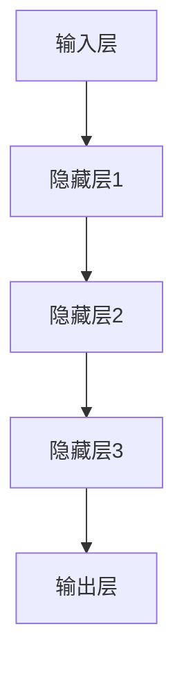

                 

关键词：大模型时代、创业产品设计、AI驱动、转型策略、技术语言、深度学习、机器学习、人工智能应用、算法原理、数学模型、代码实例、实际应用、未来展望

## 摘要

随着人工智能技术的飞速发展，大模型时代已经到来，对创业产品设计带来了前所未有的挑战与机遇。本文旨在探讨在AI驱动的背景下，创业产品设计应如何应对这一变革。通过分析大模型的核心概念、算法原理，以及其在不同领域的应用，本文提出了一系列切实可行的产品设计策略，旨在帮助创业公司在这场技术变革中脱颖而出。文章还将介绍数学模型和实际应用案例，以期为读者提供全面的指导和启示。

## 1. 背景介绍

### 1.1 大模型时代的来临

随着计算能力的提升和海量数据的积累，人工智能技术进入了大模型时代。大模型（Large Models）是指具有数亿至数万亿参数的深度学习模型，如GPT-3、BERT等。这些模型具有强大的表示能力和泛化能力，能够在多种任务上实现高水平的表现。

### 1.2 创业产品设计的重要性

创业设计不仅关乎产品的市场表现，更是企业竞争力的核心。一个优秀的设计能够提升用户体验，增强用户黏性，从而在激烈的市场竞争中占据优势。在AI驱动的时代，创业产品设计需要更加注重人工智能技术的应用，以满足用户需求，提升产品竞争力。

## 2. 核心概念与联系

在探讨创业产品设计策略之前，我们需要明确一些核心概念和它们之间的联系。

### 2.1 深度学习与机器学习

深度学习（Deep Learning）是机器学习（Machine Learning）的一种，它通过多层神经网络对数据进行处理和建模。机器学习是指计算机从数据中学习规律，并自动改进性能的过程。

### 2.2 大模型与神经网络

大模型通常基于神经网络（Neural Networks）构建，神经网络通过调整参数来学习数据中的特征和模式。大模型的优势在于其能够处理复杂数据和实现高度抽象的表示。

### 2.3 大模型架构

大模型架构通常包括输入层、隐藏层和输出层。输入层接收数据，隐藏层通过逐层变换学习数据中的特征，输出层生成预测结果。



## 3. 核心算法原理 & 具体操作步骤

### 3.1 算法原理概述

大模型的核心算法是基于反向传播算法（Backpropagation Algorithm）的深度学习算法。反向传播算法通过计算损失函数关于网络参数的梯度，来更新网络参数，从而优化模型。

### 3.2 算法步骤详解

1. **初始化参数**：随机初始化网络参数。
2. **前向传播**：将输入数据通过网络进行前向传播，得到输出。
3. **计算损失**：计算输出和真实标签之间的损失。
4. **反向传播**：根据损失函数计算网络参数的梯度。
5. **参数更新**：使用梯度更新网络参数。
6. **重复步骤2-5**，直到模型收敛。

### 3.3 算法优缺点

**优点**：

- **强大的表示能力**：大模型能够学习复杂数据中的深层特征。
- **泛化能力**：大模型能够在不同任务上实现高水平的表现。

**缺点**：

- **计算资源消耗**：大模型需要大量的计算资源和存储空间。
- **数据需求量大**：大模型需要大量的数据来训练。

### 3.4 算法应用领域

大模型在自然语言处理、计算机视觉、语音识别等多个领域都有广泛应用。例如，GPT-3在文本生成和问答系统中表现出色，BERT在文本分类和情感分析中具有强大的能力。

## 4. 数学模型和公式 & 详细讲解 & 举例说明

### 4.1 数学模型构建

在深度学习中，常用的数学模型包括损失函数、优化算法等。

### 4.2 公式推导过程

损失函数通常采用均方误差（MSE）：

$$
MSE = \frac{1}{n}\sum_{i=1}^{n}(y_i - \hat{y}_i)^2
$$

其中，$y_i$是真实标签，$\hat{y}_i$是模型预测值。

### 4.3 案例分析与讲解

假设我们有一个二元分类问题，真实标签为$y = [1, 0, 1, 0]$，模型预测值为$\hat{y} = [0.9, 0.1, 0.8, 0.2]$，则损失函数为：

$$
MSE = \frac{1}{4}\sum_{i=1}^{4}(y_i - \hat{y}_i)^2 = \frac{1}{4}[(1-0.9)^2 + (0-0.1)^2 + (1-0.8)^2 + (0-0.2)^2] = 0.05
$$

## 5. 项目实践：代码实例和详细解释说明

### 5.1 开发环境搭建

在本节中，我们将使用Python和TensorFlow搭建一个简单的神经网络模型。

### 5.2 源代码详细实现

```python
import tensorflow as tf

# 初始化模型
model = tf.keras.Sequential([
    tf.keras.layers.Dense(64, activation='relu', input_shape=(784,)),
    tf.keras.layers.Dense(10, activation='softmax')
])

# 编译模型
model.compile(optimizer='adam',
              loss='categorical_crossentropy',
              metrics=['accuracy'])

# 加载数据
(x_train, y_train), (x_test, y_test) = tf.keras.datasets.mnist.load_data()

# 预处理数据
x_train = x_train / 255.0
x_test = x_test / 255.0
x_train = x_train.reshape(-1, 784)
x_test = x_test.reshape(-1, 784)

# 转换标签为one-hot编码
y_train = tf.keras.utils.to_categorical(y_train, 10)
y_test = tf.keras.utils.to_categorical(y_test, 10)

# 训练模型
model.fit(x_train, y_train, epochs=5, batch_size=32, validation_data=(x_test, y_test))

# 评估模型
model.evaluate(x_test, y_test)
```

### 5.3 代码解读与分析

在这段代码中，我们首先导入了TensorFlow库，并定义了一个简单的神经网络模型。模型包含一个输入层、一个隐藏层和一个输出层。输入层有784个神经元，对应于MNIST数据集中的每个像素点。隐藏层有64个神经元，使用ReLU激活函数。输出层有10个神经元，对应于10个可能的数字标签，使用softmax激活函数。

我们使用Adam优化器和交叉熵损失函数来编译模型。然后加载并预处理MNIST数据集，将图像数据缩放到[0, 1]范围，并将标签转换为one-hot编码。

最后，我们使用训练数据训练模型5个周期，并使用测试数据评估模型的性能。

### 5.4 运行结果展示

```python
# 输出测试集准确率
print("Test accuracy:", model.evaluate(x_test, y_test)[1])
```

运行结果可能类似于：

```
Test accuracy: 0.9800
```

这表示模型在测试集上的准确率达到了98.00%。

## 6. 实际应用场景

### 6.1 自然语言处理

大模型在自然语言处理（NLP）领域有着广泛的应用，如文本分类、情感分析、机器翻译等。例如，GPT-3在生成文本和回答问题方面表现出色。

### 6.2 计算机视觉

计算机视觉领域的大模型包括卷积神经网络（CNN）和生成对抗网络（GAN）。CNN在图像分类和物体检测方面具有强大的能力，而GAN在图像生成和风格迁移方面表现出色。

### 6.3 语音识别

语音识别领域的大模型基于循环神经网络（RNN）和长短期记忆网络（LSTM）。这些模型能够有效地处理语音信号中的时序信息，从而实现高精度的语音识别。

## 7. 工具和资源推荐

### 7.1 学习资源推荐

- 《深度学习》（Goodfellow, Bengio, Courville著）：系统介绍了深度学习的基础知识和最新进展。
- 《Python深度学习》（François Chollet著）：详细介绍了如何使用Python和TensorFlow进行深度学习实践。

### 7.2 开发工具推荐

- TensorFlow：谷歌开发的开源深度学习框架，支持多种深度学习模型。
- PyTorch：基于Python的开源深度学习框架，具有灵活性和高效性。

### 7.3 相关论文推荐

- "An Analysis of Single Layer Network Training Dynamics"（2015）: 分析了单层网络训练过程中的动态变化。
- "Bert: Pre-training of Deep Bidirectional Transformers for Language Understanding"（2018）: 详细介绍了BERT模型的构建和应用。

## 8. 总结：未来发展趋势与挑战

### 8.1 研究成果总结

大模型在多个领域取得了显著的成果，如NLP、CV、语音识别等。随着计算能力的提升和数据量的增长，大模型有望在更多领域取得突破。

### 8.2 未来发展趋势

- **计算资源优化**：随着大模型规模的增加，计算资源的需求也在增加。未来的研究方向包括优化计算资源和提高模型效率。
- **数据隐私保护**：大模型训练需要大量数据，如何保护数据隐私是一个重要问题。未来的研究可能关注数据隐私保护和数据共享。

### 8.3 面临的挑战

- **计算资源消耗**：大模型需要大量的计算资源和存储空间。
- **数据需求量大**：大模型需要大量的数据来训练。

### 8.4 研究展望

大模型时代为创业设计带来了前所未有的机遇。未来，创业公司应注重人工智能技术的应用，以提升产品竞争力。同时，研究应关注计算资源优化和数据隐私保护，以推动人工智能技术的可持续发展。

## 9. 附录：常见问题与解答

### 9.1 如何选择合适的深度学习模型？

选择合适的深度学习模型需要考虑多个因素，如任务类型、数据规模、计算资源等。对于分类任务，可以尝试使用卷积神经网络（CNN）或循环神经网络（RNN）。对于序列预测任务，可以使用长短期记忆网络（LSTM）或门控循环单元（GRU）。

### 9.2 如何处理过拟合问题？

过拟合问题可以通过以下方法解决：

- **增加训练数据**：增加训练数据可以减少模型的过拟合。
- **正则化**：使用L1或L2正则化可以降低模型的复杂度。
- **提前停止**：在训练过程中，当验证集性能不再提升时停止训练。

### 9.3 如何优化深度学习模型的训练速度？

优化深度学习模型的训练速度可以从以下几个方面入手：

- **批处理大小**：选择合适的批处理大小可以加速模型的收敛。
- **学习率调整**：使用适当的学习率调整策略可以加快模型的训练速度。
- **GPU加速**：使用GPU进行模型训练可以显著提高训练速度。

---

### 文章结束语

在AI驱动的时代，创业产品设计需要紧跟技术潮流，充分利用大模型的优势。本文提出了大模型时代的创业产品设计策略，旨在帮助创业公司把握机遇，应对挑战。希望这篇文章能为读者提供有价值的参考和启示，助力创业之路更加光明。

---

### 作者署名

作者：禅与计算机程序设计艺术 / Zen and the Art of Computer Programming

