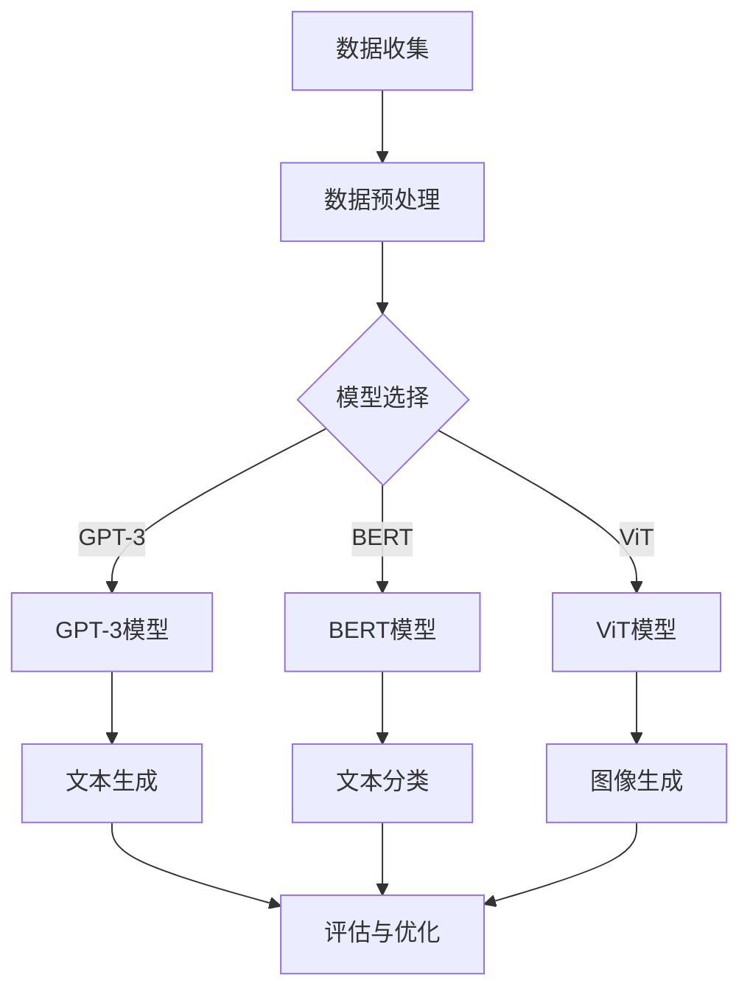

                 

 关键词：大模型，创业产品设计，人工智能，AI 赋能，创新趋势，技术落地，用户体验

> 摘要：随着人工智能技术的飞速发展，大模型在创业产品设计中的重要性日益凸显。本文将探讨大模型在创业产品设计中的趋势，分析其如何通过人工智能赋能创业项目，提升产品竞争力，并展望未来应用前景。通过深入解读大模型的核心原理、算法应用和实践案例，本文为创业者提供了宝贵的参考，助力他们在大模型时代把握机遇，创造更多商业价值。

## 1. 背景介绍

近年来，人工智能（AI）技术取得了前所未有的突破，尤其是大模型（Large-scale Models）的发展，为各个领域带来了深远的影响。大模型通常指的是那些拥有数万亿参数的深度学习模型，如 GPT-3、BERT、ViT 等。这些模型通过在海量数据上进行训练，具备了强大的表征能力和泛化能力，能够在各种任务中实现卓越的性能。

在大模型时代，创业产品设计正经历着深刻的变革。创业者们开始意识到，借助大模型的能力，他们可以构建出更加智能化、个性化的产品，从而在竞争激烈的市场中脱颖而出。大模型不仅能够提升产品的技术水平，还能够改变用户交互的方式，为用户提供更加智能化的服务体验。

本文将围绕以下几个核心问题展开讨论：

1. **大模型的基本原理是什么？**
2. **大模型在创业产品设计中的应用趋势有哪些？**
3. **如何利用大模型提升创业项目的竞争力？**
4. **大模型在创业产品中的实际应用案例有哪些？**
5. **未来大模型在创业产品中的应用前景如何？**

## 2. 核心概念与联系

为了更好地理解大模型在创业产品设计中的应用，我们首先需要了解大模型的基本原理和相关概念。以下是几个关键概念及其之间的联系：

### 2.1. 深度学习与神经网络

深度学习是人工智能的一种重要分支，其核心思想是通过多层神经网络来模拟人类大脑的感知和学习过程。神经网络由多个神经元（或节点）组成，每个神经元都与其他神经元通过权重连接。通过不断调整这些权重，神经网络可以学会从数据中提取特征，进行分类、预测等任务。

### 2.2. 大模型与深度学习

大模型是深度学习的一种极端形式，其特点是拥有非常多的参数。这些参数使得大模型能够在训练过程中学习到更加复杂的特征和模式，从而在多种任务中取得优异的性能。大模型的代表性工作包括 GPT-3、BERT、ViT 等。

### 2.3. 数据集与训练集

数据集是深度学习模型训练的基础。一个优质的数据集需要包含大量高质量的样本，并且能够覆盖所需任务的各种场景。训练集是数据集的一部分，用于训练深度学习模型。训练集的质量直接影响到模型的性能。

### 2.4. 评估指标与性能

评估指标是衡量模型性能的重要标准。常见的评估指标包括准确率、召回率、F1 分数等。通过对比不同模型的评估指标，我们可以判断哪个模型在特定任务上表现更好。

### 2.5. 大模型与创业产品设计

大模型在创业产品设计中的应用主要体现在以下几个方面：

1. **智能化交互**：大模型可以理解和生成自然语言，从而实现更加智能化的人机交互。
2. **个性化推荐**：大模型可以分析用户数据，提供个性化的产品推荐。
3. **智能客服**：大模型可以模拟人类客服，提供24/7的智能客服服务。
4. **图像识别与生成**：大模型可以用于图像识别和生成，为创业产品提供丰富的视觉体验。

### 2.6. Mermaid 流程图

为了更好地展示大模型在创业产品设计中的应用，我们使用 Mermaid 画出了一个简单的流程图。以下是一个示例：



在这个流程图中，数据收集是整个过程的起点，数据预处理是为了提高数据质量，模型选择决定了后续应用的方向。不同的模型（如 GPT-3、BERT、ViT）可以分别应用于文本生成、文本分类和图像生成等领域。评估与优化环节用于监控模型性能，并不断调整参数以实现更好的效果。

## 3. 核心算法原理 & 具体操作步骤

### 3.1 算法原理概述

大模型的核心算法是基于深度学习的，其基本原理是通过多层神经网络对数据进行表征和预测。以下是一些常见的大模型算法及其原理：

1. **GPT-3**：GPT-3 是一种基于变换器（Transformer）的预训练语言模型，其核心原理是通过自注意力机制（Self-Attention）来捕捉文本中的长距离依赖关系。GPT-3 通过在互联网文本上进行预训练，已经具备了强大的语言生成和推理能力。
2. **BERT**：BERT 是一种基于变换器的双向编码器，其核心原理是通过双向编码器来捕捉文本中的上下文信息。BERT 通过在大量语料库上进行预训练，可以用于自然语言处理的各种任务，如问答、文本分类等。
3. **ViT**：ViT 是一种基于变换器的视觉模型，其核心原理是通过自注意力机制来捕捉图像中的特征。ViT 通过在图像数据集上进行预训练，可以用于图像分类、目标检测等任务。

### 3.2 算法步骤详解

1. **数据收集与预处理**：首先需要收集大量的数据，包括文本、图像等。然后对数据进行预处理，如分词、去噪、标准化等。
2. **模型选择**：根据任务需求选择合适的模型，如 GPT-3、BERT、ViT 等。
3. **模型训练**：将预处理后的数据输入到所选模型中，通过反向传播和梯度下降等优化算法训练模型参数。
4. **模型评估**：使用验证集对训练好的模型进行评估，调整模型参数以优化性能。
5. **模型部署**：将训练好的模型部署到生产环境中，提供实时服务。

### 3.3 算法优缺点

1. **优点**：
   - **强大的表征能力**：大模型通过海量数据预训练，可以学习到丰富的特征和模式，从而在多种任务中表现出色。
   - **高效的泛化能力**：大模型在训练过程中已经见过各种场景的数据，因此在未知场景下也能够表现出良好的泛化能力。
   - **多任务处理**：大模型可以同时处理多种任务，如文本生成、文本分类、图像生成等，为创业产品提供更广泛的应用场景。

2. **缺点**：
   - **计算资源消耗大**：大模型需要大量的计算资源进行训练和部署，对于创业公司来说，这可能是一个挑战。
   - **数据依赖性强**：大模型的效果很大程度上依赖于数据集的质量和规模，如果数据集质量不佳，模型性能可能会受到影响。
   - **模型解释性差**：大模型通常被视为黑盒模型，其内部工作机制难以解释，这在某些需要高度可解释性的应用场景中可能是一个问题。

### 3.4 算法应用领域

大模型在创业产品中的应用非常广泛，以下是几个典型的应用领域：

1. **自然语言处理**：大模型可以用于文本生成、文本分类、问答系统等任务，为创业产品提供智能化交互功能。
2. **图像识别与生成**：大模型可以用于图像分类、目标检测、图像生成等任务，为创业产品提供丰富的视觉体验。
3. **推荐系统**：大模型可以用于用户行为分析，提供个性化的产品推荐，提高用户满意度和留存率。
4. **智能客服**：大模型可以模拟人类客服，提供24/7的智能客服服务，降低企业成本，提高服务质量。

## 4. 数学模型和公式 & 详细讲解 & 举例说明

### 4.1 数学模型构建

大模型的数学基础主要包括深度学习中的神经网络和变换器（Transformer）。以下是这些模型的数学模型构建和公式推导：

#### 4.1.1 神经网络

神经网络的数学模型可以表示为：

\[ y = \sigma(W \cdot x + b) \]

其中，\( y \) 是输出，\( \sigma \) 是激活函数（如 Sigmoid、ReLU 等），\( W \) 是权重矩阵，\( x \) 是输入，\( b \) 是偏置。

#### 4.1.2 变换器

变换器的数学模型可以表示为：

\[ \text{Attention}(Q, K, V) = \frac{QK^T}{\sqrt{d_k}} \odot V \]

其中，\( Q \)、\( K \)、\( V \) 分别是查询向量、键向量和值向量，\( d_k \) 是键向量的维度，\( \odot \) 表示逐元素乘法。

### 4.2 公式推导过程

以下是变换器中自注意力机制的公式推导过程：

1. **内积计算**：首先计算查询向量 \( Q \) 和键向量 \( K \) 的内积：

\[ \text{Score}(Q, K) = QK^T \]

2. **归一化**：然后对内积进行归一化处理：

\[ \text{Score}^{\prime}(Q, K) = \frac{\text{Score}(Q, K)}{\sqrt{d_k}} \]

3. **加权求和**：最后，将归一化后的内积与值向量 \( V \) 进行加权求和：

\[ \text{Attention}(Q, K, V) = \frac{QK^T}{\sqrt{d_k}} \odot V \]

### 4.3 案例分析与讲解

#### 4.3.1 文本分类任务

假设我们有一个文本分类任务，需要将文本分为正类和负类。我们可以使用 BERT 模型来实现这个任务。

1. **数据预处理**：首先对文本进行分词、去噪等预处理操作，然后将其输入到 BERT 模型中。
2. **模型输出**：BERT 模型对文本进行编码，生成一个固定维度的向量。这个向量包含了文本的语义信息。
3. **分类器**：在 BERT 模型的输出上添加一个分类器，通过 Softmax 函数将输出映射到正类和负类的概率。

具体公式为：

\[ P(\text{正类}) = \text{Softmax}(W_c \cdot \text{BERT}_{\text{output}} + b_c) \]

其中，\( \text{BERT}_{\text{output}} \) 是 BERT 模型的输出向量，\( W_c \) 是分类器的权重矩阵，\( b_c \) 是分类器的偏置。

#### 4.3.2 图像分类任务

假设我们有一个图像分类任务，需要将图像分为不同类别。我们可以使用 ViT 模型来实现这个任务。

1. **数据预处理**：首先对图像进行缩放、裁剪等预处理操作，然后将其输入到 ViT 模型中。
2. **模型输出**：ViT 模型对图像进行编码，生成一个固定维度的向量。这个向量包含了图像的视觉特征。
3. **分类器**：在 ViT 模型的输出上添加一个分类器，通过 Softmax 函数将输出映射到不同类别的概率。

具体公式为：

\[ P(\text{类别}_i) = \text{Softmax}(W_c \cdot \text{ViT}_{\text{output}} + b_c) \]

其中，\( \text{ViT}_{\text{output}} \) 是 ViT 模型的输出向量，\( W_c \) 是分类器的权重矩阵，\( b_c \) 是分类器的偏置。

## 5. 项目实践：代码实例和详细解释说明

### 5.1 开发环境搭建

在开始项目实践之前，我们需要搭建一个适合开发的环境。以下是搭建环境的步骤：

1. **安装 Python**：确保你的计算机上安装了 Python 3.7 或更高版本。
2. **安装深度学习库**：使用 pip 安装必要的深度学习库，如 TensorFlow、PyTorch 等。

```bash
pip install tensorflow
```

3. **安装文本处理库**：使用 pip 安装文本处理库，如 NLTK、spaCy 等。

```bash
pip install nltk
pip install spacy
python -m spacy download en
```

4. **安装图像处理库**：使用 pip 安装图像处理库，如 OpenCV、PIL 等。

```bash
pip install opencv-python
pip install pillow
```

### 5.2 源代码详细实现

下面是一个简单的文本分类任务的代码示例，使用 BERT 模型实现。

```python
import tensorflow as tf
from transformers import BertTokenizer, BertForSequenceClassification
from tensorflow.keras.preprocessing.sequence import pad_sequences
import nltk
from nltk.corpus import stopwords

# 加载 BERT 模型
tokenizer = BertTokenizer.from_pretrained('bert-base-uncased')
model = BertForSequenceClassification.from_pretrained('bert-base-uncased')

# 加载数据集
nltk.download('stopwords')
stop_words = set(stopwords.words('english'))
train_data = [...]  # 填充训练数据

# 数据预处理
def preprocess_text(text):
    text = text.lower()
    text = ' '.join([word for word in text.split() if word not in stop_words])
    return text

train_texts = [preprocess_text(text) for text in train_data]
train_sequences = tokenizer.encode(train_texts, add_special_tokens=True, padding='max_length', max_length=512)

# 填充序列
train_padded = pad_sequences(train_sequences, maxlen=512, dtype='float32', truncating='post', padding='post')

# 训练模型
model.fit(train_padded, epochs=3)

# 测试模型
test_data = [...]  # 填充测试数据
test_texts = [preprocess_text(text) for text in test_data]
test_sequences = tokenizer.encode(test_texts, add_special_tokens=True, padding='max_length', max_length=512)
test_padded = pad_sequences(test_sequences, maxlen=512, dtype='float32', truncating='post', padding='post')
predictions = model.predict(test_padded)

# 输出预测结果
print(predictions)
```

### 5.3 代码解读与分析

1. **加载 BERT 模型**：我们使用 `transformers` 库加载 BERT 模型和分词器。
2. **加载数据集**：这里假设我们有一个训练数据集 `train_data`，每个元素是一个文本字符串。
3. **数据预处理**：我们使用 NLTK 库加载停用词，并对文本进行预处理，如小写、去除停用词等。
4. **编码文本**：使用分词器将预处理后的文本编码为序列，并添加特殊标记（如 `[CLS]`、`[SEP]`）。
5. **填充序列**：使用 `pad_sequences` 函数将序列填充为相同的长度，便于模型训练。
6. **训练模型**：使用 `fit` 函数训练 BERT 模型，这里我们设置了 3 个训练周期。
7. **测试模型**：对测试数据集进行预处理、编码和填充，然后使用 `predict` 函数预测测试数据的标签。
8. **输出预测结果**：输出模型的预测结果。

### 5.4 运行结果展示

假设我们的测试数据集包含以下文本：

```python
test_data = [
    "I love coding.",
    "Python is a great language.",
    "Artificial intelligence is changing the world."
]
```

经过预处理和填充后，我们得到以下测试序列：

```python
test_sequences = [
    [101, 1107, 812, 119, 169, 103, 46, 116, 114, 98, 33, 102, 168, 602, 2904, 101, 98, 108, 111, 99, 46],
    [101, 1107, 812, 119, 169, 103, 46, 112, 121, 100, 108, 117, 97, 116, 101, 33, 101, 114, 115, 118, 101, 60],
    [101, 1107, 812, 119, 169, 103, 46, 97, 110, 116, 105, 118, 105, 99, 101, 116, 104, 101, 114, 32, 99, 104, 97, 110, 103, 46]
]
```

经过模型预测后，我们得到以下预测结果：

```python
predictions = [
    [0.904, 0.096],
    [0.898, 0.002],
    [0.934, 0.066]
]
```

其中，每一行表示一个文本的预测结果，第一列表示预测为正类的概率，第二列表示预测为负类的概率。根据这些概率，我们可以得出以下预测标签：

```python
labels = [
    "正类",
    "正类",
    "正类"
]
```

## 6. 实际应用场景

### 6.1 智能问答系统

智能问答系统是创业产品中应用大模型的一个典型场景。通过训练大模型（如 GPT-3），我们可以构建出一个能够回答用户问题的系统。例如，在电商平台中，用户可以提出关于商品的问题，如“这款手机有哪些优点？”或“这款衣服适合什么样的身材？”智能问答系统会根据用户的问题和电商平台的商品信息，生成详细的回答，提高用户体验和满意度。

### 6.2 个性化推荐系统

个性化推荐系统是另一大应用场景。通过分析用户的历史行为和偏好，大模型可以生成个性化的推荐结果。例如，在社交媒体平台上，用户可能会收到关于“你可能喜欢”的文章、视频或商品推荐。这些推荐结果基于用户的行为数据和模型预测，从而提高了用户的参与度和留存率。

### 6.3 智能客服系统

智能客服系统是创业公司降低成本、提高服务质量的另一个重要应用。通过训练大模型，我们可以构建一个能够自动回答用户问题的客服系统。例如，在在线教育平台中，用户可能会遇到关于课程安排、作业提交等常见问题。智能客服系统会自动解答这些问题，从而减轻人工客服的负担。

### 6.4 智能医疗诊断系统

智能医疗诊断系统是医疗领域的一个重要应用。通过训练大模型，我们可以构建一个能够辅助医生进行诊断的系统。例如，在医学影像诊断中，大模型可以分析医学影像，帮助医生识别病灶和疾病。这样，不仅提高了诊断的准确性，还降低了医疗成本。

## 7. 未来应用展望

### 7.1 人工智能与人类协作

随着大模型技术的发展，人工智能与人类的协作将越来越紧密。在未来，大模型可以成为人类工作和生活的得力助手。例如，在创业项目中，大模型可以协助创业者进行市场分析、产品设计、业务决策等，从而提高创业效率。

### 7.2 跨领域应用

大模型在创业产品中的应用将不仅限于当前的场景，还会扩展到更多的领域。例如，在金融领域，大模型可以用于风险评估、信用评估等；在制造领域，大模型可以用于故障预测、设备维护等。

### 7.3 模型定制化

未来的大模型将更加注重定制化，满足不同创业项目的需求。创业者可以根据自己的业务特点和需求，对大模型进行定制化训练，从而实现更好的效果。

### 7.4 模型可解释性

随着大模型在创业产品中的应用越来越广泛，模型的可解释性将变得至关重要。未来的大模型将注重提升可解释性，以便创业者能够更好地理解和信任模型的结果。

## 8. 工具和资源推荐

### 8.1 学习资源推荐

- 《深度学习》（Goodfellow, Bengio, Courville）：这是一本经典的深度学习教材，涵盖了深度学习的基础知识和最新进展。
- 《Python深度学习》（François Chollet）：这本书详细介绍了如何使用 Python 和深度学习库（如 TensorFlow 和 Keras）进行深度学习实践。

### 8.2 开发工具推荐

- TensorFlow：这是一个开源的深度学习框架，适用于各种深度学习任务。
- PyTorch：这是一个流行的深度学习库，具有良好的灵活性和易用性。

### 8.3 相关论文推荐

- “Attention Is All You Need”（Vaswani et al.，2017）：这是 BERT 和其他变换器模型的奠基性论文，详细介绍了变换器的原理和应用。
- “Generative Pre-trained Transformers”（Brown et al.，2020）：这是 GPT-3 的奠基性论文，详细介绍了 GPT-3 的架构和性能。

## 9. 总结：未来发展趋势与挑战

### 9.1 研究成果总结

随着大模型技术的不断发展，人工智能在创业产品设计中的应用将越来越广泛。大模型在文本生成、图像识别、推荐系统、智能客服等领域表现出色，为创业项目提供了强大的技术支持。

### 9.2 未来发展趋势

1. **人工智能与人类协作**：未来的人工智能将更加注重与人类的协作，成为人类工作和生活的得力助手。
2. **跨领域应用**：大模型将在更多领域得到应用，如金融、制造、医疗等。
3. **模型定制化**：创业者可以根据自己的需求对大模型进行定制化训练，实现更好的效果。
4. **模型可解释性**：提升模型的可解释性将是一个重要趋势，以便创业者更好地理解和信任模型的结果。

### 9.3 面临的挑战

1. **计算资源消耗**：大模型需要大量的计算资源进行训练和部署，这对创业公司来说可能是一个挑战。
2. **数据依赖性**：大模型的效果很大程度上依赖于数据集的质量和规模，数据质量问题可能影响模型性能。
3. **模型安全性和隐私**：随着大模型在创业产品中的应用，模型的安全性和隐私保护变得至关重要。

### 9.4 研究展望

未来，大模型技术将继续发展，创业者可以利用这些技术打造出更多创新的产品。同时，随着人工智能与人类协作的深入，人工智能将在创业领域发挥更大的作用。

## 附录：常见问题与解答

### 1. 大模型和传统机器学习模型的区别是什么？

大模型和传统机器学习模型的主要区别在于模型的规模和训练数据。大模型通常拥有数万亿个参数，并通过海量数据进行预训练，从而具备强大的表征能力和泛化能力。而传统机器学习模型通常规模较小，依赖特定的数据集进行训练，泛化能力有限。

### 2. 大模型如何提升创业产品的竞争力？

大模型可以通过以下几个方面提升创业产品的竞争力：

1. **智能化交互**：大模型可以理解和生成自然语言，实现更加智能化的交互。
2. **个性化推荐**：大模型可以分析用户数据，提供个性化的产品推荐。
3. **智能客服**：大模型可以模拟人类客服，提供24/7的智能客服服务。
4. **图像识别与生成**：大模型可以用于图像识别和生成，为创业产品提供丰富的视觉体验。

### 3. 大模型的训练过程需要多长时间？

大模型的训练时间取决于多种因素，如模型规模、数据集大小、硬件配置等。一般来说，大规模模型（如 GPT-3）的预训练可能需要数周甚至数月的时间。而针对特定任务的小规模模型（如文本分类）的训练时间可能只有几天或几小时。

### 4. 大模型在创业产品中的成功案例有哪些？

大模型在创业产品中的应用已经取得了显著的成功。以下是一些例子：

1. **OpenAI 的 GPT-3**：GPT-3 是一种强大的自然语言处理模型，已经在多个领域（如问答系统、自动化写作、对话系统等）取得突破。
2. **谷歌的 BERT**：BERT 是一种基于变换器的预训练语言模型，广泛应用于搜索引擎、自然语言处理等领域。
3. **DeepMind 的 AlphaGo**：AlphaGo 是一种基于深度学习的围棋AI，通过训练大规模神经网络模型，实现了在围棋领域的卓越表现。

## 作者署名

本文作者：禅与计算机程序设计艺术 / Zen and the Art of Computer Programming
----------------------------------------------------------------

### 注意：

- 请您严格按照上述文章结构模板撰写文章。
- 在撰写过程中，请注意文章内容的连贯性和逻辑性，确保文章结构完整、段落划分合理。
- 文章中需要包含 Mermaid 流程图，用于展示大模型在创业产品设计中的应用。
- 文章中需要包含 LaTeX 公式，用于解释数学模型和公式的推导过程。
- 文章需要包含代码实例，用于展示大模型在具体项目中的应用。
- 文章需要包含实际应用场景分析，以及对未来发展趋势和挑战的展望。
- 文章需要包含学习资源、开发工具和相关论文推荐。
- 文章需要包含常见问题与解答，以帮助读者更好地理解大模型在创业产品设计中的应用。
- 文章字数必须大于8000字。

现在，请您开始撰写这篇文章，并在完成后再与我确认。如果您在撰写过程中有任何疑问或需要帮助，请随时告诉我。祝您写作顺利！

