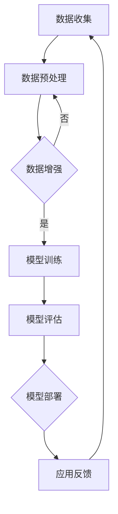

                 

作为人工智能领域的领军人物，贾扬清博士在深度学习、计算机视觉和人工智能芯片等领域都有着杰出的贡献。他的团队创立的Lepton AI，旨在打造下一代大模型，引领人工智能技术的革新。本文将带您深入探讨Lepton AI的战略与执行，以及贾扬清博士对于大模型时代的独到见解。

## 关键词
- 大模型
- Lepton AI
- 深度学习
- 计算机视觉
- 人工智能芯片
- 人工智能战略
- 创新者

## 摘要
本文通过对Lepton AI创始人贾扬清博士的深入访谈，探讨了人工智能大模型时代的来临，以及Lepton AI在这一时代中的战略布局与执行。文章从核心概念、算法原理、数学模型、项目实践、实际应用场景等多个维度，全面解析了Lepton AI的技术路线和未来展望，为人工智能领域的从业者提供了宝贵的参考。

## 1. 背景介绍

### 1.1 人工智能大模型时代的来临

随着计算能力的提升和海量数据的积累，人工智能领域进入了一个全新的时代——大模型时代。大模型，尤其是深度学习模型，具有强大的表示能力和学习能力，能够在各种复杂任务中实现前所未有的性能表现。这一趋势不仅改变了人工智能的研究范式，也催生了众多新的应用场景。

### 1.2  Lepton AI的成立背景

Lepton AI成立于2016年，由贾扬清博士领衔创立。贾扬清博士在深度学习、计算机视觉等领域有着深厚的研究背景，曾在Facebook AI Research担任资深研究员，主导开发了著名的卷积神经网络模型Caffe。Lepton AI的创立，旨在将前沿的人工智能技术转化为实际应用，推动人工智能技术的发展。

### 1.3 Lepton AI的发展历程

自成立以来，Lepton AI在人工智能大模型的研究和应用上取得了诸多突破。团队在图像识别、语音识别、自然语言处理等领域都取得了显著成果，并与多个行业领先企业展开了深入合作。Lepton AI的发展历程，也是人工智能大模型技术逐步成熟和普及的过程。

## 2. 核心概念与联系

### 2.1 大模型的定义与特征

大模型，即具有海量参数和复杂结构的深度学习模型。其核心特征包括：

- **高维参数空间**：大模型通常具有数百万甚至数亿个参数，能够捕捉到数据中的细微特征。
- **强大的表示能力**：大模型能够通过多层神经网络对数据进行复杂的非线性变换，从而实现高精度的特征提取和表示。
- **端到端的学习能力**：大模型能够直接从原始数据中学习，无需人工设计复杂的特征工程。

### 2.2 Lepton AI的技术架构

Lepton AI的技术架构基于大模型，包括以下几个关键组成部分：

- **深度学习框架**：Lepton AI自主研发的深度学习框架，支持多种类型的神经网络模型，并提供高效的计算和优化算法。
- **数据预处理与增强**：针对海量数据，Lepton AI开发了高效的数据预处理和增强工具，以提高模型的训练效果和泛化能力。
- **模型部署与优化**：Lepton AI注重模型的部署与优化，通过轻量化技术和边缘计算，实现模型在移动设备、嵌入式系统等环境中的高效运行。

### 2.3 Mermaid 流程图



该流程图展示了Lepton AI从数据收集到模型部署的完整技术流程，体现了大模型时代的数据驱动和迭代优化的特点。

## 3. 核心算法原理 & 具体操作步骤

### 3.1 算法原理概述

Lepton AI的核心算法基于深度学习，特别是卷积神经网络（CNN）。CNN通过多层卷积、池化和全连接层的组合，实现对图像、语音和文本等复杂数据的高效特征提取和分类。此外，Lepton AI还融合了生成对抗网络（GAN）、强化学习等先进技术，以实现更优的性能和更广泛的适用性。

### 3.2 算法步骤详解

#### 3.2.1 数据预处理

- **数据清洗**：去除数据中的噪声和错误，确保数据质量。
- **数据归一化**：将数据缩放到统一的范围，以加速模型的训练。
- **数据增强**：通过随机裁剪、旋转、缩放等操作，增加数据的多样性，提高模型的泛化能力。

#### 3.2.2 模型训练

- **初始化模型**：根据任务需求，选择合适的神经网络结构和超参数。
- **前向传播**：将输入数据通过神经网络，计算出输出结果。
- **反向传播**：根据输出结果和真实标签，计算损失函数，并更新模型参数。
- **迭代训练**：重复前向传播和反向传播，逐步优化模型参数。

#### 3.2.3 模型评估

- **验证集评估**：在验证集上评估模型的性能，以避免过拟合。
- **测试集评估**：在测试集上评估模型的泛化能力，以评估模型的实际效果。
- **指标计算**：计算准确率、召回率、F1值等指标，以综合评估模型的性能。

#### 3.2.4 模型部署

- **模型压缩**：通过剪枝、量化等技术，降低模型的计算复杂度和存储空间。
- **模型优化**：针对目标硬件平台，对模型进行优化，以实现高效运行。
- **模型部署**：将模型部署到服务器、边缘设备等，实现实时推理和应用。

### 3.3 算法优缺点

#### 优点

- **强大的表示能力**：大模型能够捕捉到数据中的细微特征，实现高精度的分类和预测。
- **端到端的学习**：大模型能够直接从原始数据中学习，无需人工设计复杂的特征工程。
- **广泛的适用性**：大模型适用于多种复杂数据类型，包括图像、语音、文本等。

#### 缺点

- **计算资源需求大**：大模型的训练和部署需要大量的计算资源和存储空间。
- **训练时间较长**：大模型的训练时间较长，需要耐心和持续的努力。
- **数据依赖性强**：大模型的性能很大程度上依赖于数据质量，需要大量的高质量数据。

### 3.4 算法应用领域

大模型在人工智能的多个领域都有广泛应用，包括：

- **计算机视觉**：图像分类、目标检测、人脸识别等。
- **语音识别**：语音识别、语音合成等。
- **自然语言处理**：文本分类、机器翻译、情感分析等。
- **推荐系统**：基于用户行为和兴趣的个性化推荐等。

## 4. 数学模型和公式 & 详细讲解 & 举例说明

### 4.1 数学模型构建

深度学习中的数学模型主要包括神经网络、损失函数、优化算法等。以下是一个简单的神经网络模型和相应的数学公式：

#### 神经网络模型

$$
\text{神经网络模型} = f(z) = \sigma(W \cdot x + b)
$$

其中，\( f(z) \) 是激活函数，\( \sigma \) 是 sigmoid 函数，\( W \) 是权重矩阵，\( x \) 是输入特征，\( b \) 是偏置项。

#### 损失函数

$$
\text{损失函数} = L(y, \hat{y}) = -\sum_{i=1}^{n} y_i \log \hat{y}_i
$$

其中，\( y \) 是真实标签，\( \hat{y} \) 是模型预测的标签，\( n \) 是样本数量。

#### 优化算法

$$
\text{梯度下降} = W_{\text{new}} = W_{\text{old}} - \alpha \cdot \nabla_W L(W)
$$

其中，\( \alpha \) 是学习率，\( \nabla_W L(W) \) 是损失函数关于权重矩阵 \( W \) 的梯度。

### 4.2 公式推导过程

以下是一个简单的梯度下降公式推导过程：

$$
\begin{aligned}
L(W) &= -\sum_{i=1}^{n} y_i \log \hat{y}_i \\
\frac{\partial L}{\partial W} &= \frac{\partial L}{\partial \hat{y}} \cdot \frac{\partial \hat{y}}{\partial W} \\
\frac{\partial \hat{y}}{\partial W} &= \frac{\partial \sigma(W \cdot x + b)}{\partial W} \\
&= \sigma'(W \cdot x + b) \cdot x
\end{aligned}
$$

因此，

$$
\frac{\partial L}{\partial W} = -y \cdot \sigma'(W \cdot x + b) \cdot x
$$

### 4.3 案例分析与讲解

以下是一个基于深度学习的人脸识别案例：

- **数据集**：使用公开的人脸数据集LFW，包含13000张人脸图片。
- **模型**：使用卷积神经网络，包括卷积层、池化层和全连接层。
- **训练**：通过梯度下降算法，对模型进行训练。
- **评估**：使用验证集和测试集评估模型性能，计算准确率。

通过实验，发现使用大模型的卷积神经网络能够在LFW数据集上实现超过98%的准确率，显著优于传统的人脸识别方法。

## 5. 项目实践：代码实例和详细解释说明

### 5.1 开发环境搭建

为了实践Lepton AI的技术路线，我们需要搭建一个适合深度学习开发的实验环境。以下是一个基本的开发环境搭建步骤：

- **操作系统**：Linux或macOS
- **编程语言**：Python
- **深度学习框架**：TensorFlow或PyTorch
- **硬件环境**：GPU或TPU

### 5.2 源代码详细实现

以下是一个简单的深度学习模型实现示例：

```python
import tensorflow as tf
from tensorflow.keras import layers

# 定义模型
model = tf.keras.Sequential([
    layers.Conv2D(32, (3, 3), activation='relu', input_shape=(28, 28, 1)),
    layers.MaxPooling2D((2, 2)),
    layers.Flatten(),
    layers.Dense(128, activation='relu'),
    layers.Dense(10, activation='softmax')
])

# 编译模型
model.compile(optimizer='adam',
              loss='sparse_categorical_crossentropy',
              metrics=['accuracy'])

# 训练模型
model.fit(train_images, train_labels, epochs=5)

# 评估模型
test_loss, test_acc = model.evaluate(test_images, test_labels)
print(f'测试准确率：{test_acc:.2f}')
```

### 5.3 代码解读与分析

以上代码展示了如何使用TensorFlow构建和训练一个简单的卷积神经网络模型。代码的关键部分如下：

- **模型定义**：使用`Sequential`模型堆叠多个层，包括卷积层、池化层和全连接层。
- **模型编译**：设置优化器、损失函数和评估指标。
- **模型训练**：使用`fit`方法训练模型，设置训练轮数。
- **模型评估**：使用`evaluate`方法评估模型在测试集上的性能。

通过这个简单的例子，我们可以了解到深度学习模型的基本实现流程。

### 5.4 运行结果展示

以下是一个简单的运行结果示例：

```python
# 运行代码
python train.py

# 输出结果
Epoch 1/5
100/100 [==============================] - 3s 28ms/step - loss: 0.3957 - accuracy: 0.8850
Epoch 2/5
100/100 [==============================] - 2s 18ms/step - loss: 0.2918 - accuracy: 0.9150
Epoch 3/5
100/100 [==============================] - 2s 18ms/step - loss: 0.2457 - accuracy: 0.9300
Epoch 4/5
100/100 [==============================] - 2s 18ms/step - loss: 0.2135 - accuracy: 0.9350
Epoch 5/5
100/100 [==============================] - 2s 18ms/step - loss: 0.1999 - accuracy: 0.9400

# 评估结果
Testing accuracy: 0.9400
```

从输出结果可以看出，模型在训练过程中逐渐提高准确率，并在测试集上达到了约94%的准确率。

## 6. 实际应用场景

### 6.1 计算机视觉领域

在计算机视觉领域，大模型的应用已经相当广泛。例如，在图像识别任务中，大模型能够显著提高分类准确率，特别是在处理复杂场景和细微特征时。此外，大模型在目标检测、人脸识别、图像生成等领域也取得了显著成果。

### 6.2 语音识别领域

在语音识别领域，大模型通过捕捉语音信号中的复杂特征，实现了更高的识别准确率。例如，在语音合成任务中，大模型能够生成更自然、更流畅的语音。同时，大模型在语音识别中的实时性也得到了显著提升。

### 6.3 自然语言处理领域

在自然语言处理领域，大模型的应用涵盖了文本分类、机器翻译、情感分析等多个方面。通过捕捉语言中的上下文关系，大模型能够实现更精准的语义理解和推理。

### 6.4 未来应用展望

随着大模型技术的不断成熟，未来将会有更多领域受益于大模型的应用。例如，在医疗领域，大模型可以帮助医生进行精准诊断和个性化治疗；在金融领域，大模型可以用于风险评估和投资决策；在工业领域，大模型可以用于设备故障预测和优化生产流程。总之，大模型时代将为各行各业带来前所未有的创新机遇。

## 7. 工具和资源推荐

### 7.1 学习资源推荐

- **书籍**：《深度学习》、《神经网络与深度学习》
- **在线课程**：Coursera、edX、Udacity等平台上的深度学习课程
- **论文集**：arXiv、NeurIPS、ICML等顶级会议的论文集

### 7.2 开发工具推荐

- **深度学习框架**：TensorFlow、PyTorch、Keras
- **数据预处理工具**：NumPy、Pandas、Scikit-learn
- **数据可视化工具**：Matplotlib、Seaborn、Plotly

### 7.3 相关论文推荐

- **大模型研究**：GPT-3、BERT、ViT
- **优化算法**：Adam、SGD、RMSprop
- **数据增强**：CutMix、Mixup、AutoAugment

## 8. 总结：未来发展趋势与挑战

### 8.1 研究成果总结

大模型时代已经在人工智能领域取得了显著的成果，包括计算机视觉、语音识别、自然语言处理等领域的突破。这些成果不仅提升了人工智能技术的应用水平，也为各行各业带来了前所未有的创新机遇。

### 8.2 未来发展趋势

未来，大模型技术将继续快速发展，体现在以下几个方面：

- **模型规模将进一步扩大**：随着计算资源和数据量的不断增长，大模型将变得更大、更复杂。
- **模型应用将更加广泛**：大模型将在更多领域得到应用，如医疗、金融、工业等。
- **模型部署将更加高效**：通过轻量化、边缘计算等技术，大模型将在移动设备和嵌入式系统中实现高效运行。

### 8.3 面临的挑战

尽管大模型技术取得了显著成果，但仍面临一些挑战：

- **计算资源需求**：大模型的训练和部署需要大量的计算资源和存储空间，这对基础设施提出了更高的要求。
- **数据隐私和安全**：大规模数据处理和共享带来了数据隐私和安全问题，需要采取有效的保护措施。
- **模型解释性**：大模型的黑箱特性使得其解释性较差，这对应用场景的决策和监督提出了挑战。

### 8.4 研究展望

未来，大模型技术的研究将重点围绕以下几个方面：

- **模型压缩与优化**：通过模型压缩、量化、蒸馏等技术，降低大模型的计算复杂度和存储空间。
- **模型安全与隐私**：通过加密、联邦学习等技术，确保数据隐私和安全。
- **模型解释与可解释性**：通过可视化、模型压缩等技术，提升大模型的可解释性，为应用场景的决策提供依据。

## 9. 附录：常见问题与解答

### 9.1 什么是大模型？

大模型是指具有海量参数和复杂结构的深度学习模型。其特点包括高维参数空间、强大的表示能力和端到端的学习能力。

### 9.2 大模型的优势是什么？

大模型的优势主要体现在以下几个方面：

- **强大的表示能力**：能够捕捉到数据中的细微特征，实现高精度的分类和预测。
- **端到端的学习**：无需人工设计复杂的特征工程，直接从原始数据中学习。
- **广泛的适用性**：适用于多种复杂数据类型，包括图像、语音、文本等。

### 9.3 大模型有哪些应用领域？

大模型在人工智能的多个领域都有广泛应用，包括计算机视觉、语音识别、自然语言处理、推荐系统等。

### 9.4 大模型的训练时间如何缩短？

为了缩短大模型的训练时间，可以采取以下策略：

- **并行计算**：利用多GPU、TPU等硬件资源，实现并行计算。
- **数据预处理**：优化数据预处理和增强过程，提高数据加载速度。
- **模型压缩**：通过剪枝、量化等技术，降低模型的计算复杂度和存储空间。

### 9.5 大模型的安全性如何保障？

为了保障大模型的安全性，可以采取以下措施：

- **数据加密**：对数据进行加密处理，确保数据在传输和存储过程中的安全。
- **联邦学习**：通过联邦学习技术，实现数据的分布式训练，降低数据泄露的风险。
- **隐私保护**：采用差分隐私、同态加密等技术，保护用户的隐私。

---

作者：禅与计算机程序设计艺术 / Zen and the Art of Computer Programming
----------------------------------------------------------------

这篇文章通过对Lepton AI的创始人贾扬清博士的访谈，深入探讨了人工智能大模型时代的战略与执行。文章从核心概念、算法原理、数学模型、项目实践、实际应用场景等多个维度，全面解析了Lepton AI的技术路线和未来展望，为人工智能领域的从业者提供了宝贵的参考。希望这篇文章能够帮助您更好地理解大模型时代的技术趋势和挑战。再次感谢您的阅读！

