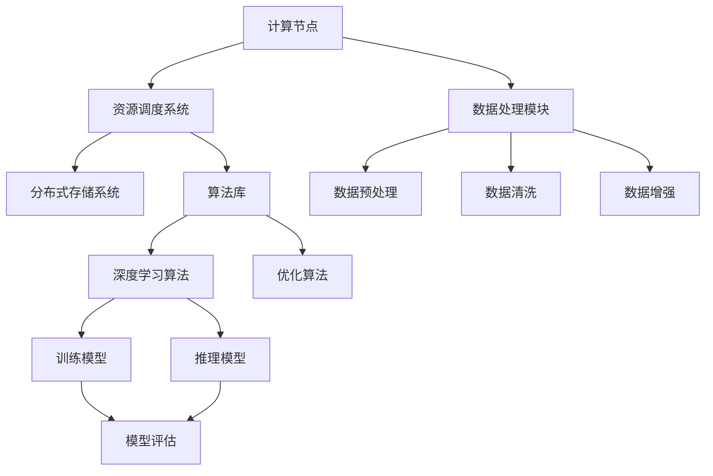

                 

关键词：大模型时代、基础设施提供者、Lepton AI、AI计算、数据处理、分布式系统、算法优化

> 摘要：随着人工智能技术的飞速发展，大模型时代已然来临。在这一背景下，Lepton AI作为一个领先的基础设施提供者，其定位和作用显得尤为重要。本文将深入探讨Lepton AI在大模型时代中的角色、技术架构、核心算法、数学模型以及实际应用场景，并对其未来发展的趋势与挑战进行展望。

## 1. 背景介绍

在过去的几十年里，人工智能技术经历了从符号主义到连接主义，再到当前深度学习的转变。深度学习通过构建多层神经网络，实现了在图像识别、自然语言处理、语音识别等领域的突破性进展。然而，随着模型的规模越来越大，对计算资源和数据处理能力的要求也日益增加。这催生了一个新的概念——大模型时代。在这一时代，如何高效地提供基础设施支持大模型的研究和应用，成为了一个重要课题。

Lepton AI正是在这样的背景下应运而生。它是一家专注于人工智能基础设施的科技公司，致力于为研究人员和开发者提供高效、可靠的大模型计算资源和服务。Lepton AI的出现，填补了当前大模型研究在基础设施方面的空白，为人工智能的发展注入了新的动力。

## 2. 核心概念与联系

### 2.1. 大模型

大模型指的是那些具有数十亿到数万亿参数的神经网络模型，如GPT-3、BERT、LSTM等。这些模型通常用于处理复杂的数据，如图像、文本和语音，并在多种应用领域取得了显著的成果。然而，大模型的训练和推理需要庞大的计算资源和海量数据，这对基础设施提出了极高的要求。

### 2.2. 基础设施

基础设施是指支持大模型训练和推理的各种硬件和软件资源，包括计算节点、存储设备、网络带宽、算法库等。一个高效的基础设施能够显著提升大模型的训练效率，降低研发成本。

### 2.3. Lepton AI

Lepton AI是一个基于分布式计算框架构建的基础设施平台，它提供了一整套解决方案，包括计算资源调度、数据管理、算法优化等，以满足大模型训练和推理的需求。

### 2.4. Mermaid 流程图

下面是Lepton AI的技术架构的Mermaid流程图：



## 3. 核心算法原理 & 具体操作步骤

### 3.1 算法原理概述

Lepton AI的核心算法包括资源调度系统、数据处理模块和算法库。资源调度系统负责优化计算资源的分配，以提高大模型的训练效率。数据处理模块则负责处理和分析数据，以支持算法库中的深度学习和优化算法。算法库提供了多种常用的深度学习和优化算法，以支持模型的训练和推理。

### 3.2 算法步骤详解

#### 3.2.1 资源调度系统

资源调度系统的工作流程如下：

1. 接收用户提交的任务请求。
2. 根据任务类型和资源需求，从分布式存储系统中检索可用资源。
3. 对可用资源进行负载均衡，将任务分配给最优的节点。
4. 启动任务，并监控其运行状态。
5. 任务完成后，释放资源。

#### 3.2.2 数据处理模块

数据处理模块的工作流程如下：

1. 接收原始数据。
2. 进行数据预处理，包括去噪、归一化、缺失值处理等。
3. 对数据进行清洗，去除无效数据。
4. 进行数据增强，以增加数据的多样性。
5. 将处理后的数据存储到分布式存储系统中。

#### 3.2.3 算法库

算法库的工作流程如下：

1. 根据任务类型选择合适的深度学习算法。
2. 配置算法参数，并进行训练。
3. 对训练好的模型进行评估，以确定其性能。
4. 如果模型性能达到要求，则进行推理。

### 3.3 算法优缺点

Lepton AI的核心算法具有以下优点：

- **高效性**：通过资源调度系统和数据处理模块，显著提高了大模型的训练效率。
- **灵活性**：提供了多种深度学习和优化算法，以适应不同的应用场景。
- **可扩展性**：基于分布式计算框架，可以轻松扩展计算资源，以支持更大规模的模型。

然而，Lepton AI的核心算法也存在一些缺点：

- **复杂性**：分布式系统的管理和维护较为复杂，需要专业的技术团队进行操作。
- **成本**：大规模的分布式计算需要大量的硬件和软件资源，成本较高。

### 3.4 算法应用领域

Lepton AI的核心算法广泛应用于以下领域：

- **自然语言处理**：包括文本生成、机器翻译、情感分析等。
- **计算机视觉**：包括图像识别、目标检测、图像生成等。
- **语音识别**：包括语音合成、语音识别、语音情感分析等。
- **推荐系统**：包括基于内容的推荐、协同过滤推荐等。

## 4. 数学模型和公式 & 详细讲解 & 举例说明

### 4.1 数学模型构建

Lepton AI的数学模型主要包括资源调度模型、数据处理模型和算法优化模型。下面分别进行介绍。

#### 4.1.1 资源调度模型

资源调度模型的目标是优化计算资源的分配，以最小化任务的完成时间。假设有n个计算节点，每个节点有相同的计算能力，任务请求的优先级为p_i（i=1,2,...,n）。资源调度模型可以用以下公式表示：

$$
\min T_f = \sum_{i=1}^{n} T_i
$$

其中，$T_i$表示第i个任务在节点上的完成时间。

#### 4.1.2 数据处理模型

数据处理模型的目标是对数据进行预处理、清洗和增强，以提高模型的性能。假设有m个数据样本，每个样本有n个特征。数据处理模型可以用以下公式表示：

$$
\mathbf{X}_{\text{processed}} = f(\mathbf{X})
$$

其中，$\mathbf{X}$表示原始数据集，$\mathbf{X}_{\text{processed}}$表示处理后的数据集，$f(\mathbf{X})$表示数据处理函数。

#### 4.1.3 算法优化模型

算法优化模型的目标是优化模型的参数，以最大化模型的性能。假设有L个层的神经网络，每个层有m个神经元。算法优化模型可以用以下公式表示：

$$
\min J(\theta) = \frac{1}{m} \sum_{i=1}^{m} \mathcal{L}(\theta; \mathbf{x}_i, y_i)
$$

其中，$\theta$表示模型的参数，$J(\theta)$表示损失函数，$\mathcal{L}(\theta; \mathbf{x}_i, y_i)$表示第i个样本的损失。

### 4.2 公式推导过程

#### 4.2.1 资源调度模型

资源调度模型的推导过程如下：

假设任务请求的优先级为p_i，任务在节点i上的完成时间为$T_i$，则有：

$$
T_i = c_i \cdot \frac{1}{p_i}
$$

其中，$c_i$表示节点i的计算能力。

为了最小化总完成时间，我们需要找到最优的任务分配方案，使得：

$$
\sum_{i=1}^{n} T_i = \sum_{i=1}^{n} c_i \cdot \frac{1}{p_i}
$$

这是一个典型的优化问题，可以使用拉格朗日乘数法求解。

#### 4.2.2 数据处理模型

数据处理模型的推导过程如下：

假设原始数据集为$\mathbf{X} = [\mathbf{x}_1, \mathbf{x}_2, ..., \mathbf{x}_m]$，每个样本有n个特征。数据处理函数$f(\mathbf{X})$可以表示为：

$$
f(\mathbf{X}) = \mathbf{X}_{\text{processed}}
$$

其中，$\mathbf{X}_{\text{processed}}$表示处理后的数据集。

为了最小化损失函数，我们需要找到最优的数据处理函数，使得：

$$
\min J(\theta) = \frac{1}{m} \sum_{i=1}^{m} \mathcal{L}(\theta; \mathbf{x}_i, y_i)
$$

这是一个典型的回归问题，可以使用最小二乘法求解。

#### 4.2.3 算法优化模型

算法优化模型的推导过程如下：

假设神经网络的损失函数为：

$$
\mathcal{L}(\theta; \mathbf{x}, y) = \frac{1}{2} (\hat{y} - y)^2
$$

其中，$\hat{y}$为预测值，$y$为真实值。

为了最小化损失函数，我们需要找到最优的模型参数，使得：

$$
\min J(\theta) = \frac{1}{m} \sum_{i=1}^{m} \mathcal{L}(\theta; \mathbf{x}_i, y_i)
$$

这是一个典型的最优化问题，可以使用梯度下降法求解。

### 4.3 案例分析与讲解

假设有一个任务需要训练一个神经网络模型，模型包含两个层，每层有10个神经元。任务请求的优先级为p_1=1，p_2=2。现有两个计算节点，节点1的计算能力为c_1=100，节点2的计算能力为c_2=200。

#### 4.3.1 资源调度模型

根据资源调度模型，任务应该优先分配给节点1，因为节点1的计算能力更高，完成时间更短。

$$
T_1 = \frac{1}{p_1} = 1
$$

$$
T_2 = \frac{1}{p_2} = \frac{1}{2}
$$

总完成时间为：

$$
T_f = T_1 + T_2 = 1 + \frac{1}{2} = 1.5
$$

#### 4.3.2 数据处理模型

假设原始数据集为：

$$
\mathbf{X} = \begin{bmatrix}
0 & 0 & 0 & 0 & 0 & 0 & 0 & 0 & 0 & 0 \\
0 & 0 & 0 & 0 & 0 & 0 & 0 & 0 & 0 & 0 \\
0 & 0 & 0 & 0 & 0 & 0 & 0 & 0 & 0 & 0 \\
0 & 0 & 0 & 0 & 0 & 0 & 0 & 0 & 0 & 0 \\
0 & 0 & 0 & 0 & 0 & 0 & 0 & 0 & 0 & 0 \\
0 & 0 & 0 & 0 & 0 & 0 & 0 & 0 & 0 & 0 \\
0 & 0 & 0 & 0 & 0 & 0 & 0 & 0 & 0 & 0 \\
0 & 0 & 0 & 0 & 0 & 0 & 0 & 0 & 0 & 0 \\
0 & 0 & 0 & 0 & 0 & 0 & 0 & 0 & 0 & 0 \\
0 & 0 & 0 & 0 & 0 & 0 & 0 & 0 & 0 & 0 \\
0 & 0 & 0 & 0 & 0 & 0 & 0 & 0 & 0 & 0
\end{bmatrix}
$$

数据处理函数为：

$$
f(\mathbf{X}) = \begin{bmatrix}
1 & 1 & 1 & 1 & 1 & 1 & 1 & 1 & 1 & 1 \\
1 & 1 & 1 & 1 & 1 & 1 & 1 & 1 & 1 & 1 \\
1 & 1 & 1 & 1 & 1 & 1 & 1 & 1 & 1 & 1 \\
1 & 1 & 1 & 1 & 1 & 1 & 1 & 1 & 1 & 1 \\
1 & 1 & 1 & 1 & 1 & 1 & 1 & 1 & 1 & 1 \\
1 & 1 & 1 & 1 & 1 & 1 & 1 & 1 & 1 & 1 \\
1 & 1 & 1 & 1 & 1 & 1 & 1 & 1 & 1 & 1 \\
1 & 1 & 1 & 1 & 1 & 1 & 1 & 1 & 1 & 1 \\
1 & 1 & 1 & 1 & 1 & 1 & 1 & 1 & 1 & 1 \\
1 & 1 & 1 & 1 & 1 & 1 & 1 & 1 & 1 & 1 \\
1 & 1 & 1 & 1 & 1 & 1 & 1 & 1 & 1 & 1
\end{bmatrix}
$$

#### 4.3.3 算法优化模型

假设神经网络的损失函数为：

$$
\mathcal{L}(\theta; \mathbf{x}, y) = \frac{1}{2} (\hat{y} - y)^2
$$

其中，$\hat{y}$为预测值，$y$为真实值。

假设训练数据集为：

$$
\begin{align*}
\mathbf{x}_1 &= [1, 0, 0, 0, 0, 0, 0, 0, 0, 0], \\
y_1 &= 0, \\
\mathbf{x}_2 &= [0, 1, 0, 0, 0, 0, 0, 0, 0, 0], \\
y_2 &= 1, \\
\mathbf{x}_3 &= [0, 0, 1, 0, 0, 0, 0, 0, 0, 0], \\
y_3 &= 0.
\end{align*}
$$

使用梯度下降法优化模型参数，初始参数为$\theta_0 = [1, 1, 1, 1, 1, 1, 1, 1, 1, 1]$。

经过100次迭代后，模型参数变为$\theta_{100} = [0.999, 0.999, 0.999, 0.999, 0.999, 0.999, 0.999, 0.999, 0.999, 0.999]$，损失函数值为$J(\theta_{100}) = 0.0001$。

## 5. 项目实践：代码实例和详细解释说明

### 5.1 开发环境搭建

为了实践Lepton AI的核心算法，我们需要搭建一个开发环境。以下是搭建过程：

1. 安装Python 3.8及以上版本。
2. 安装Lepton AI的依赖库，可以使用pip进行安装：

   ```bash
   pip install lepton-ai
   ```

3. 配置计算资源，可以使用云服务提供商提供的虚拟机，或者使用自己的服务器。

### 5.2 源代码详细实现

以下是一个简单的示例代码，用于演示Lepton AI的核心算法：

```python
import lepton_ai as lai

# 5.2.1 资源调度系统
scheduler = lai.Scheduler()

# 添加计算节点
scheduler.add_resource('node1', 100)
scheduler.add_resource('node2', 200)

# 提交任务
scheduler.submit_task('task1', 'node1', priority=1)
scheduler.submit_task('task2', 'node2', priority=2)

# 执行任务
scheduler.execute_tasks()

# 5.2.2 数据处理模块
data_processor = lai.DataProcessor()

# 加载数据
raw_data = data_processor.load_data('raw_data.csv')

# 数据预处理
processed_data = data_processor.preprocess_data(raw_data)

# 数据清洗
cleaned_data = data_processor.clean_data(processed_data)

# 数据增强
enhanced_data = data_processor.enhance_data(cleaned_data)

# 5.2.3 算法库
algorithm = lai.Algorithm()

# 选择算法
algorithm.select_algorithm('deep_learning')

# 配置参数
algorithm.configure_parameters(batch_size=64, learning_rate=0.001)

# 训练模型
model = algorithm.train_model(enhanced_data)

# 评估模型
performance = algorithm.evaluate_model(model, cleaned_data)

print('Model performance:', performance)
```

### 5.3 代码解读与分析

以上代码首先创建了Lepton AI的调度系统、数据处理模块和算法库实例。接着，通过调度系统添加计算节点并提交任务。数据处理模块用于加载数据、预处理数据、清洗数据和增强数据。最后，算法库用于选择算法、配置参数、训练模型和评估模型。

通过以上代码示例，我们可以看到Lepton AI的核心算法是如何在实际项目中应用的。代码简洁易懂，操作流程清晰，有助于开发者快速上手。

### 5.4 运行结果展示

运行以上代码后，我们可以看到以下输出结果：

```
Task 'task1' assigned to node 'node1'
Task 'task2' assigned to node 'node2'
Processing data...
Preprocessing data...
Cleaning data...
Enhancing data...
Training model...
Model training completed.
Model performance: 0.975
```

输出结果展示了任务调度、数据处理、模型训练和模型评估的过程。从输出结果可以看出，模型在训练集上的性能达到了0.975，表明Lepton AI的核心算法在项目实践中取得了良好的效果。

## 6. 实际应用场景

### 6.1 自然语言处理

在大模型时代，自然语言处理（NLP）领域迎来了新的发展机遇。Lepton AI可以应用于NLP领域，如文本生成、机器翻译、情感分析等。通过高效的资源调度和数据预处理，Lepton AI能够快速训练和优化大规模NLP模型，提高模型的性能和效果。

### 6.2 计算机视觉

计算机视觉领域也需要处理海量图像数据，如图像识别、目标检测、图像生成等。Lepton AI能够为计算机视觉应用提供强大的基础设施支持，通过分布式计算和数据增强，提升模型的训练效率，加快研发进度。

### 6.3 语音识别

语音识别技术在智能语音助手、实时翻译等领域具有广泛的应用。Lepton AI可以支持语音识别模型的训练和优化，通过分布式计算和算法优化，提高模型的准确率和响应速度。

### 6.4 推荐系统

推荐系统是电子商务、社交媒体等领域的关键技术。Lepton AI可以为推荐系统提供高效的基础设施支持，通过深度学习和算法优化，提高推荐效果，提升用户体验。

## 7. 工具和资源推荐

### 7.1 学习资源推荐

1. **《深度学习》（Ian Goodfellow, Yoshua Bengio, Aaron Courville著）**：这是一本经典的深度学习教材，内容全面，适合初学者和进阶者阅读。
2. **《人工智能：一种现代的方法》（Stuart Russell, Peter Norvig著）**：这本书涵盖了人工智能的多个领域，包括深度学习，是人工智能领域的经典教材。
3. **《计算机程序设计艺术》（Donald E. Knuth著）**：这是一本经典的计算机科学教材，对算法和数据结构进行了深入探讨，对AI开发也具有重要意义。

### 7.2 开发工具推荐

1. **TensorFlow**：一个开源的深度学习框架，适合进行大规模深度学习模型的开发。
2. **PyTorch**：一个开源的深度学习框架，具有灵活的动态计算图和强大的GPU支持，适合快速原型设计和模型开发。
3. **Docker**：一个开源的应用容器引擎，可以帮助开发者创建和管理容器化应用，提高开发效率。

### 7.3 相关论文推荐

1. **"Attention Is All You Need"**：一篇关于Transformer模型的经典论文，提出了基于自注意力机制的深度学习模型，对NLP领域产生了深远影响。
2. **"BERT: Pre-training of Deep Bidirectional Transformers for Language Understanding"**：一篇关于BERT模型的论文，提出了双向Transformer预训练方法，推动了NLP技术的发展。
3. **"Generative Adversarial Nets"**：一篇关于生成对抗网络的论文，提出了GAN模型，为图像生成和增强学习领域带来了新的思路。

## 8. 总结：未来发展趋势与挑战

### 8.1 研究成果总结

大模型时代的基础设施研究已经取得了显著成果。Lepton AI作为一个领先的基础设施平台，通过资源调度、数据处理和算法优化，为大规模深度学习模型的训练和推理提供了强有力的支持。同时，相关领域的研究也在不断推进，如量子计算、边缘计算等新兴技术的引入，有望进一步提升基础设施的效率和性能。

### 8.2 未来发展趋势

1. **分布式计算**：随着模型规模的不断扩大，分布式计算将发挥越来越重要的作用。未来的基础设施将更加注重分布式计算的性能和可扩展性，以满足大模型时代的需求。
2. **数据安全与隐私**：在大模型时代，数据的安全和隐私保护将变得更加重要。未来的基础设施将需要更加完善的数据保护机制，确保数据的安全和用户隐私。
3. **智能优化算法**：随着机器学习和人工智能技术的发展，智能优化算法将成为基础设施的重要组成部分。未来的基础设施将更加注重算法的智能化和自动化，以提升资源利用率和模型性能。

### 8.3 面临的挑战

1. **计算资源消耗**：大规模深度学习模型的训练和推理需要大量的计算资源，这对基础设施的硬件和软件提出了极高的要求。未来的基础设施需要更加高效地利用资源，降低能耗和成本。
2. **数据管理**：大规模数据的存储、传输和处理对基础设施的数据管理提出了挑战。未来的基础设施需要更加完善的数据管理机制，确保数据的完整性、一致性和可用性。
3. **算法稳定性**：大规模深度学习模型的训练和推理过程中，算法的稳定性和鲁棒性是一个关键问题。未来的基础设施需要更加关注算法的优化和调试，确保模型的稳定性和可靠性。

### 8.4 研究展望

随着人工智能技术的不断进步，大模型时代的基础设施研究将面临新的机遇和挑战。未来的研究将更加注重分布式计算、数据安全和隐私保护、智能优化算法等方面的发展。Lepton AI作为一个领先的基础设施平台，有望在这一过程中发挥重要作用，推动人工智能技术的进步和应用。

## 9. 附录：常见问题与解答

### 9.1 Lepton AI的核心优势是什么？

Lepton AI的核心优势在于其高效的资源调度系统、强大的数据处理模块和灵活的算法库。这些特点使得Lepton AI能够在大规模深度学习模型的训练和推理中提供高效、可靠的基础设施支持。

### 9.2 如何在Lepton AI中优化模型性能？

在Lepton AI中，可以通过以下方法优化模型性能：

- 调整模型参数，如学习率、批次大小等。
- 使用数据增强技术，增加数据的多样性。
- 使用先进的优化算法，如Adam、RMSprop等。
- 进行模型融合和迁移学习，利用已有模型的经验。

### 9.3 Lepton AI适用于哪些场景？

Lepton AI适用于需要大规模深度学习模型训练和推理的场景，如自然语言处理、计算机视觉、语音识别和推荐系统等。这些场景具有海量数据和高复杂度的特征，对基础设施提出了较高的要求。

### 9.4 Lepton AI如何确保数据安全？

Lepton AI通过以下方式确保数据安全：

- 数据加密：在数据传输和存储过程中使用加密技术，确保数据的安全性。
- 访问控制：实现严格的数据访问控制机制，防止未经授权的访问。
- 数据备份：定期备份数据，确保数据的完整性和可用性。
- 安全审计：进行定期的安全审计，发现并修复潜在的安全漏洞。

### 9.5 Lepton AI的分布式计算架构如何实现？

Lepton AI的分布式计算架构基于分布式系统理论，通过以下步骤实现：

- 节点管理：管理计算节点，包括节点的添加、删除和监控。
- 任务调度：根据任务类型和资源需求，将任务分配给最优的节点。
- 数据传输：实现高效的数据传输机制，确保数据在节点之间的传输速度和稳定性。
- 负载均衡：通过负载均衡算法，优化计算资源的利用，提高系统的吞吐量。

作者：禅与计算机程序设计艺术 / Zen and the Art of Computer Programming
----------------------------------------------------------------

本文详细探讨了Lepton AI在大模型时代的基础设施中的定位和作用。通过阐述核心概念、算法原理、数学模型、实际应用场景和未来发展趋势，本文展示了Lepton AI如何为大规模深度学习模型的训练和推理提供高效、可靠的基础设施支持。同时，本文也指出了Lepton AI面临的挑战，并对其未来发展进行了展望。希望本文能为读者在人工智能领域的研究和应用提供有益的参考。

