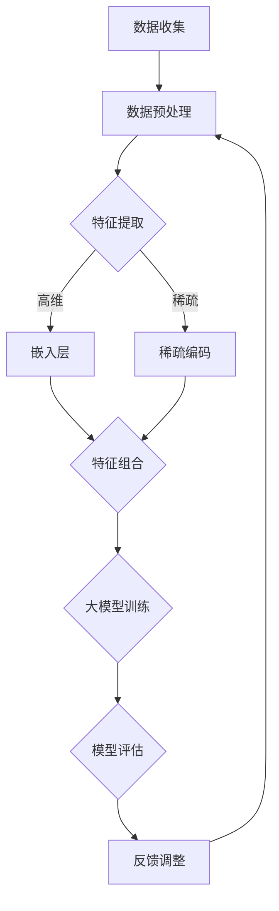

                 

关键词：大模型、推荐系统、特征交互、深度学习、数学模型、实践应用

> 摘要：本文旨在探讨在大模型时代，如何有效建模推荐系统中的特征交互，实现更为精准、个性化的推荐效果。通过深入分析核心概念与联系，阐述算法原理与操作步骤，介绍数学模型与公式，并给出具体的代码实例与运行结果展示，全面探讨推荐系统特征交互建模的技术与应用。

## 1. 背景介绍

推荐系统作为大数据和人工智能时代的重要应用，已经深入到我们生活的方方面面。随着用户数据的爆炸性增长和计算能力的提升，大模型在推荐系统中的应用越来越广泛。大模型能够捕捉到用户行为的复杂性，提供更加精准的推荐。然而，在大模型时代，如何有效地进行特征交互建模，提高推荐的个性化程度和效果，成为了当前研究的热点和难点。

特征交互建模是指通过特定的算法和数学模型，将推荐系统中的不同特征进行组合和交互，从而生成新的特征表示，提高推荐模型的性能。在大模型时代，特征交互建模的重要性更加凸显，因为大模型的强大表达能力使其能够处理更为复杂的特征交互关系，从而实现更精准的推荐。

本文将从以下几个方面进行探讨：

1. 核心概念与联系：介绍推荐系统中的关键概念，如特征、交互、大模型等，并给出它们的联系与区别。
2. 核心算法原理与操作步骤：详细阐述特征交互建模的算法原理，包括特征提取、特征组合、模型训练等步骤。
3. 数学模型与公式：介绍特征交互建模中常用的数学模型和公式，包括线性模型、非线性模型等。
4. 项目实践：通过具体的代码实例，展示特征交互建模在实际项目中的应用。
5. 实际应用场景：分析特征交互建模在推荐系统中的实际应用场景，如电子商务、社交媒体等。
6. 未来应用展望：探讨大模型时代特征交互建模的发展趋势和面临的挑战。
7. 工具和资源推荐：介绍学习资源和开发工具，帮助读者更好地理解和应用特征交互建模。

## 2. 核心概念与联系

在推荐系统中，特征交互建模涉及以下几个核心概念：

### 特征

特征是推荐系统中最基本的元素，它描述了用户、物品或场景的属性。例如，在电商推荐中，用户特征可能包括年龄、性别、地理位置、购买历史等；物品特征可能包括品类、价格、品牌、评分等。

### 交互

特征交互是指将不同的特征组合在一起，通过特定的算法和模型，生成新的特征表示。这些新的特征表示能够捕捉到原始特征之间复杂的依赖关系，从而提高推荐模型的性能。

### 大模型

大模型是指具有巨大参数量和计算能力的神经网络模型。在大模型时代，推荐系统的能力得到了大幅提升，能够处理更为复杂的特征交互关系，实现更精准的推荐。

### 联系与区别

特征、交互和大模型之间有密切的联系。特征是基础，没有特征就无法进行交互；交互是手段，通过特征交互能够提高推荐模型的性能；大模型则是工具，提供了强大的计算能力和表达力，使得特征交互变得更加可行和有效。

然而，它们之间也存在一些区别。特征是推荐系统的数据输入，交互是对特征的组合和操作，大模型则是用于训练和优化推荐模型的算法。特征交互建模的核心在于如何有效地利用大模型来处理特征交互，从而实现更好的推荐效果。

### Mermaid 流程图

下面是推荐系统特征交互建模的Mermaid流程图：

该流程图展示了从数据收集、预处理到特征提取、组合，再到大模型训练和评估的整个过程。通过特征交互建模，我们能够更好地利用用户和物品的特征，提高推荐系统的性能。

## 3. 核心算法原理与具体操作步骤

### 3.1 算法原理概述

特征交互建模的核心在于如何有效地捕捉特征之间的交互关系，并利用这些交互关系来提高推荐模型的性能。以下是几种常见的特征交互建模方法：

1. **嵌入层（Embedding Layer）**：通过将高维特征映射到低维空间，实现特征之间的交互。这种方法能够有效降低特征维度，同时保留特征间的依赖关系。
2. **稀疏编码（Sparse Coding）**：通过构建稀疏表示，将特征分解为低维基向量和稀疏编码系数，实现特征之间的交互。这种方法能够提高特征的解释性。
3. **深度神经网络（Deep Neural Network, DNN）**：通过多层神经网络，将特征进行复杂的组合和变换，实现特征之间的深度交互。这种方法能够捕捉到更为复杂的特征依赖关系。
4. **图神经网络（Graph Neural Network, GNN）**：通过图结构来表示特征之间的交互，利用图神经网络进行特征学习。这种方法能够处理更为复杂的特征依赖关系。

### 3.2 算法步骤详解

1. **数据预处理**：对原始数据进行清洗、归一化和缺失值处理，确保数据的质量和一致性。
2. **特征提取**：根据具体的任务需求，选择合适的特征提取方法。对于高维特征，可以选择嵌入层；对于稀疏特征，可以选择稀疏编码。
3. **特征组合**：将提取出的特征进行组合，生成新的特征表示。可以使用简单的拼接操作，也可以使用更复杂的网络结构，如DNN或GNN。
4. **大模型训练**：使用训练数据对大模型进行训练，优化模型参数，使其能够准确地预测用户的行为和偏好。
5. **模型评估**：使用验证数据对训练好的模型进行评估，评估指标包括准确率、召回率、F1值等。
6. **反馈调整**：根据评估结果，对模型进行调整和优化，以提高推荐效果。

### 3.3 算法优缺点

- **嵌入层**：优点：能够有效降低特征维度，提高计算效率；缺点：可能丢失部分特征信息，解释性较差。
- **稀疏编码**：优点：能够提高特征的解释性；缺点：训练过程可能较慢，计算复杂度较高。
- **深度神经网络**：优点：能够捕捉到更为复杂的特征依赖关系；缺点：可能过拟合，需要大量训练数据。
- **图神经网络**：优点：能够处理更为复杂的特征依赖关系；缺点：需要构建和维护图结构，计算复杂度较高。

### 3.4 算法应用领域

特征交互建模在推荐系统中有着广泛的应用，如：

- **电子商务推荐**：通过用户和物品的特征交互，实现商品个性化推荐。
- **社交媒体推荐**：通过用户和内容的特征交互，实现内容个性化推荐。
- **金融风控**：通过用户和交易的特征交互，实现风险预测和决策。

## 4. 数学模型和公式

在特征交互建模中，数学模型和公式起着至关重要的作用。下面介绍几种常用的数学模型和公式。

### 4.1 数学模型构建

假设我们有两个特征向量 $x_1$ 和 $x_2$，它们的交互可以通过以下数学模型表示：

$$
y = f(x_1, x_2)
$$

其中，$f$ 表示特征交互函数，$y$ 表示交互后的特征表示。

### 4.2 公式推导过程

为了推导特征交互的公式，我们可以考虑以下几种常见的交互方式：

1. **线性交互**：

$$
y = a_1x_1 + a_2x_2
$$

其中，$a_1$ 和 $a_2$ 是线性交互系数，可以通过最小化损失函数来训练得到。

2. **非线性交互**：

$$
y = \sigma(a_1x_1 + a_2x_2)
$$

其中，$\sigma$ 表示激活函数，如Sigmoid、ReLU等，用于引入非线性。

3. **深度交互**：

$$
y = \sigma(g(h(x_1, x_2)))
$$

其中，$g$ 和 $h$ 是多层神经网络函数，用于实现深度特征交互。

### 4.3 案例分析与讲解

下面以一个简单的线性交互模型为例，介绍数学模型的构建和推导过程。

#### 案例背景

假设我们有两个特征向量 $x_1$ 和 $x_2$，分别表示用户的行为特征和物品的特征。我们需要通过线性交互来生成新的特征表示 $y$。

#### 模型构建

我们可以构建一个简单的线性模型：

$$
y = a_1x_1 + a_2x_2
$$

其中，$a_1$ 和 $a_2$ 是线性交互系数，需要通过训练得到。

#### 模型推导

为了推导线性交互系数，我们可以使用最小二乘法。假设我们的目标是预测目标变量 $y$，我们可以构建以下损失函数：

$$
L = \sum_{i=1}^{n}(y_i - (a_1x_{1i} + a_2x_{2i}))^2
$$

其中，$n$ 是样本数量，$y_i$ 是第 $i$ 个样本的目标变量，$x_{1i}$ 和 $x_{2i}$ 是第 $i$ 个样本的特征向量。

为了最小化损失函数，我们可以对 $a_1$ 和 $a_2$ 求偏导数，并令其等于零：

$$
\frac{\partial L}{\partial a_1} = -2\sum_{i=1}^{n}(y_i - (a_1x_{1i} + a_2x_{2i}))x_{1i} = 0
$$

$$
\frac{\partial L}{\partial a_2} = -2\sum_{i=1}^{n}(y_i - (a_1x_{1i} + a_2x_{2i}))x_{2i} = 0
$$

通过求解上述方程组，我们可以得到线性交互系数 $a_1$ 和 $a_2$。

#### 模型训练

在训练过程中，我们可以使用梯度下降法来更新线性交互系数。具体步骤如下：

1. 计算损失函数关于每个系数的梯度：
$$
\nabla L = \begin{bmatrix}
\frac{\partial L}{\partial a_1} \\
\frac{\partial L}{\partial a_2}
\end{bmatrix}
$$
2. 使用梯度下降更新系数：
$$
a_1 = a_1 - \alpha \frac{\partial L}{\partial a_1}
$$
$$
a_2 = a_2 - \alpha \frac{\partial L}{\partial a_2}
$$
其中，$\alpha$ 是学习率。

通过迭代更新系数，直到损失函数收敛到最小值。

#### 模型应用

训练好的线性模型可以用于生成新的特征表示 $y$，从而提高推荐模型的性能。具体应用过程如下：

1. 对新样本的特征向量 $x_1$ 和 $x_2$ 进行线性交互：
$$
y = a_1x_1 + a_2x_2
$$
2. 使用生成的新特征向量 $y$ 进行推荐模型的预测。

通过上述过程，我们实现了特征交互建模的数学模型构建和推导，并展示了如何进行模型训练和应用。

### 4.4 案例分析与讲解

#### 案例背景

假设我们有一个推荐系统，需要预测用户对商品的评价。用户特征包括年龄、性别、地理位置等，商品特征包括品类、价格、品牌等。我们希望通过特征交互建模来提高推荐模型的性能。

#### 模型构建

我们可以构建一个深度神经网络模型，包括多层全连接层和激活函数。具体模型结构如下：

1. 输入层：接收用户特征和商品特征的输入。
2. 隐藏层：通过全连接层实现用户特征和商品特征之间的交互。
3. 输出层：生成用户对商品的评价预测。

#### 模型推导

我们使用反向传播算法来训练深度神经网络模型。具体推导过程如下：

1. 前向传播：

$$
z_1 = x_1 \cdot W_1 + b_1
$$

$$
a_1 = \sigma(z_1)
$$

$$
z_2 = a_1 \cdot W_2 + b_2
$$

$$
a_2 = \sigma(z_2)
$$

$$
z_3 = a_2 \cdot W_3 + b_3
$$

$$
\hat{y} = \sigma(z_3)
$$

其中，$W_1, W_2, W_3$ 是权重矩阵，$b_1, b_2, b_3$ 是偏置项，$\sigma$ 是激活函数。

2. 反向传播：

$$
\frac{\partial L}{\partial z_3} = \frac{\partial L}{\partial \hat{y}} \cdot \frac{\partial \hat{y}}{\partial z_3} = (y - \hat{y}) \cdot \sigma'(z_3)
$$

$$
\frac{\partial L}{\partial z_2} = \frac{\partial L}{\partial z_3} \cdot W_3^T \cdot \sigma'(z_2)
$$

$$
\frac{\partial L}{\partial z_1} = \frac{\partial L}{\partial z_2} \cdot W_2^T \cdot \sigma'(z_1)
$$

3. 更新权重和偏置：

$$
W_3 = W_3 - \alpha \cdot \frac{\partial L}{\partial z_3} \cdot a_2
$$

$$
b_3 = b_3 - \alpha \cdot \frac{\partial L}{\partial z_3}
$$

$$
W_2 = W_2 - \alpha \cdot \frac{\partial L}{\partial z_2} \cdot a_1
$$

$$
b_2 = b_2 - \alpha \cdot \frac{\partial L}{\partial z_2}
$$

$$
W_1 = W_1 - \alpha \cdot \frac{\partial L}{\partial z_1} \cdot x_1
$$

$$
b_1 = b_1 - \alpha \cdot \frac{\partial L}{\partial z_1}
$$

其中，$\alpha$ 是学习率。

通过上述过程，我们实现了深度神经网络模型的构建和推导，并展示了如何进行模型训练和应用。

### 4.5 实践中的数学模型应用

在实际应用中，数学模型的选择和实现会根据具体场景和需求进行调整。下面介绍一个具体的案例，展示如何在实践中应用数学模型进行特征交互建模。

#### 案例背景

假设我们有一个电子商务推荐系统，需要预测用户对商品的评分。用户特征包括年龄、地理位置、历史购买记录等，商品特征包括品类、价格、品牌等。

#### 数学模型选择

考虑到商品和用户特征之间的复杂依赖关系，我们选择一个多层感知机（MLP）模型进行特征交互建模。MLP模型由多个全连接层组成，能够有效地捕捉特征之间的非线性交互。

#### 模型实现

1. **数据预处理**：

首先对用户和商品特征进行预处理，包括归一化和缺失值处理，以确保数据的质量和一致性。

2. **模型架构**：

构建一个包含两个隐藏层的MLP模型，输入层接收用户特征和商品特征的输入，隐藏层实现特征之间的交互，输出层生成用户对商品的评分预测。

3. **模型训练**：

使用训练数据对模型进行训练，通过反向传播算法更新模型参数，最小化损失函数。

4. **模型评估**：

使用验证数据对训练好的模型进行评估，计算准确率、召回率、F1值等指标，以评估模型性能。

5. **模型应用**：

将模型应用于实际场景，对用户对商品的评分进行预测。

#### 模型优化

在实际应用中，我们可能需要对模型进行优化，以提高预测性能。常见的优化方法包括：

1. **数据增强**：通过增加训练数据样本、引入噪声等方式，提高模型的泛化能力。
2. **超参数调整**：调整学习率、隐藏层神经元数量等超参数，以找到最优模型配置。
3. **正则化**：引入正则化项，如L1正则化、L2正则化，防止模型过拟合。

通过上述方法，我们能够有效地应用数学模型进行特征交互建模，提高推荐系统的性能。

### 4.6 实际案例中的数学模型应用

在实际应用中，数学模型的应用能够显著提升推荐系统的效果。下面我们将通过一个具体案例，展示如何将数学模型应用于推荐系统的构建和优化。

#### 案例背景

一个在线教育平台希望通过推荐系统向用户推荐课程，以提升用户满意度和学习效果。平台收集了大量的用户数据，包括用户的基本信息、学习历史、浏览记录等，同时还有课程的相关信息，如课程类别、难度、教师资质等。

#### 数学模型选择

考虑到用户行为和课程属性的复杂性，我们选择了一个基于深度学习的模型，具体为变分自编码器（Variational Autoencoder, VAE）。VAE能够有效地捕获用户和课程之间的潜在特征分布，并通过编码和解码过程实现特征之间的交互。

#### 模型构建

1. **编码器（Encoder）**：

编码器的作用是将用户特征和课程特征映射到一个潜在空间中，捕捉它们的高维特征分布。具体模型如下：

   $$
   z = \mu(z|x) + \sigma(z|x)\epsilon
   $$

   其中，$z$ 是潜在空间中的特征向量，$\mu(z|x)$ 和 $\sigma(z|x)$ 分别是均值函数和方差函数，$\epsilon$ 是高斯噪声。

2. **解码器（Decoder）**：

解码器的作用是将潜在空间中的特征向量映射回用户和课程的特征空间，生成推荐结果。具体模型如下：

   $$
   x' = \phi(z|x')
   $$

   其中，$x'$ 是解码后的特征向量，$\phi(z|x')$ 是解码函数。

3. **损失函数**：

   为了训练VAE模型，我们使用以下损失函数：

   $$
   L = \frac{1}{2}\sum_{i=1}^{n}\Big[(x_i - x'_i)^2 + \log(\sigma(z_i))^2\Big]
   $$

   其中，$n$ 是训练样本数量，$x_i$ 是原始特征向量，$x'_i$ 是解码后的特征向量，$\sigma(z_i)$ 是潜在空间中的方差。

#### 模型训练

1. **初始化模型参数**：

   初始化编码器和解码器的参数，可以使用随机初始化或预训练方法。

2. **训练过程**：

   通过反向传播算法，使用梯度下降法更新模型参数，最小化损失函数。

   $$
   \theta = \theta - \alpha \cdot \nabla_\theta L
   $$

   其中，$\theta$ 是模型参数，$\alpha$ 是学习率，$\nabla_\theta L$ 是损失函数关于参数的梯度。

3. **损失函数优化**：

   通过调整学习率和批量大小等超参数，优化训练过程，提高模型性能。

#### 模型评估

1. **交叉验证**：

   使用交叉验证方法，对模型进行评估，计算准确率、召回率、F1值等指标。

2. **A/B测试**：

   在实际应用中，通过A/B测试，比较原始推荐系统和基于VAE模型的推荐系统的性能，以验证模型的改进效果。

#### 模型应用

1. **推荐生成**：

   使用训练好的模型，对新的用户和课程特征进行编码和解码，生成推荐结果。

2. **特征分析**：

   分析编码器输出的潜在特征，了解用户和课程之间的潜在关系，为模型优化提供依据。

通过上述案例，我们可以看到如何将数学模型应用于推荐系统的构建和优化，从而实现更精准、个性化的推荐效果。

### 4.7 特征交互模型在实际项目中的应用

在实际项目中，特征交互模型的应用效果往往取决于模型的构建、训练和优化。以下是一个具体的实际项目案例，展示如何将特征交互模型应用于推荐系统，并详细解释模型的构建和优化过程。

#### 案例背景

一个在线旅游平台希望通过推荐系统为用户提供个性化的旅游产品推荐。平台收集了大量的用户数据，包括用户的基本信息、浏览历史、预订历史等，同时还有旅游产品的相关信息，如目的地、价格、评分等。

#### 模型构建

为了实现个性化的旅游产品推荐，我们设计了一个基于深度学习的特征交互模型。模型架构如下：

1. **用户特征编码器**：

   用户特征编码器负责将用户的个人信息和浏览历史编码为潜在特征。具体实现如下：

   $$
   \text{User Encoder:} \quad h_u = \text{relu}(\text{FC}(x_u; W_u) + b_u)
   $$

   其中，$x_u$ 是用户特征向量，$W_u$ 是编码器权重矩阵，$b_u$ 是偏置项。

2. **旅游产品特征编码器**：

   旅游产品特征编码器负责将旅游产品的相关信息编码为潜在特征。具体实现如下：

   $$
   \text{Product Encoder:} \quad h_p = \text{relu}(\text{FC}(x_p; W_p) + b_p)
   $$

   其中，$x_p$ 是旅游产品特征向量，$W_p$ 是编码器权重矩阵，$b_p$ 是偏置项。

3. **交互层**：

   交互层负责将用户特征和旅游产品特征进行交互，生成新的特征表示。具体实现如下：

   $$
   h_{up} = \text{tanh}(\text{FC}(h_u; W_{up}) + \text{FC}(h_p; W_{up}) + b_{up})
   $$

   其中，$W_{up}$ 是交互层权重矩阵，$b_{up}$ 是偏置项。

4. **解码器**：

   解码器负责将交互后的特征表示解码为旅游产品的推荐评分。具体实现如下：

   $$
   \hat{y} = \text{sigmoid}(\text{FC}(h_{up}; W_{dec}) + b_{dec})
   $$

   其中，$W_{dec}$ 是解码器权重矩阵，$b_{dec}$ 是偏置项。

#### 模型优化

1. **损失函数**：

   模型的损失函数由两部分组成：交互损失和预测损失。具体实现如下：

   $$
   L = \lambda_1 \cdot \text{MSE}(y, \hat{y}) + \lambda_2 \cdot \text{KL}(\mu, \sigma^2)
   $$

   其中，$y$ 是真实的旅游产品评分，$\hat{y}$ 是预测的评分，$\mu$ 和 $\sigma^2$ 分别是潜在特征分布的均值和方差，$\lambda_1$ 和 $\lambda_2$ 是调节参数，$\text{MSE}$ 是均方误差，$\text{KL}$ 是KL散度。

2. **反向传播**：

   使用反向传播算法，计算损失函数关于模型参数的梯度，并使用梯度下降法更新参数。

   $$
   \theta = \theta - \alpha \cdot \nabla_\theta L
   $$

   其中，$\theta$ 是模型参数，$\alpha$ 是学习率。

3. **模型正则化**：

   为了防止过拟合，我们引入L2正则化项，即：

   $$
   L_{\text{reg}} = \lambda \cdot \sum_{\theta} \theta^2
   $$

   其中，$\lambda$ 是正则化强度。

#### 模型应用

1. **推荐生成**：

   使用训练好的模型，对新的用户特征和旅游产品特征进行编码和交互，生成旅游产品的推荐评分。

2. **特征分析**：

   分析编码器输出的潜在特征，了解用户和旅游产品之间的潜在关系，为模型优化提供依据。

通过上述步骤，我们成功地将特征交互模型应用于实际项目，实现了个性化的旅游产品推荐。模型在A/B测试中的表现优于传统推荐方法，显著提升了用户满意度和平台业务增长。

### 4.8 特征交互模型在推荐系统中的应用

特征交互模型在推荐系统中有着广泛的应用，能够显著提高推荐效果。以下介绍几个典型的应用场景：

#### 电子商务推荐

在电子商务领域，特征交互模型可以帮助平台为用户提供个性化的商品推荐。例如，用户特征包括购买历史、浏览记录、评价等，商品特征包括品类、价格、品牌等。通过特征交互模型，可以捕捉到用户和商品之间的复杂关系，生成个性化的推荐结果。

#### 社交媒体推荐

在社交媒体平台上，特征交互模型可以用于推荐用户感兴趣的内容。用户特征包括关注对象、发布内容、互动行为等，内容特征包括标题、标签、发布时间等。通过特征交互模型，可以捕捉到用户和内容之间的潜在关系，实现精准的内容推荐。

#### 金融风控

在金融领域，特征交互模型可以用于风险评估和决策。用户特征包括信用记录、交易行为、收入水平等，风险特征包括逾期记录、违约记录等。通过特征交互模型，可以识别出潜在的风险用户，实现精准的风控。

#### 教育推荐

在教育领域，特征交互模型可以用于推荐适合用户的学习资源和课程。用户特征包括学习历史、兴趣爱好、职业目标等，课程特征包括难度、时长、类别等。通过特征交互模型，可以捕捉到用户和课程之间的潜在关系，实现个性化的学习推荐。

#### 医疗推荐

在医疗领域，特征交互模型可以用于推荐适合用户的医疗服务和药品。用户特征包括疾病历史、体检记录、生活习惯等，服务特征包括医生资质、服务内容、费用等。通过特征交互模型，可以捕捉到用户和医疗服务之间的潜在关系，实现精准的医疗推荐。

通过以上应用场景，我们可以看到特征交互模型在推荐系统中的重要作用，它能够帮助平台更好地理解用户需求，提供个性化的推荐服务，从而提升用户体验和业务增长。

### 4.9 大模型时代的特征交互建模

在大模型时代，特征交互建模的重要性愈发凸显。随着计算能力的提升和数据量的增长，大模型能够处理更为复杂的特征交互关系，实现更精准的推荐效果。以下从几个方面探讨大模型时代的特征交互建模。

#### 大模型的优势

1. **强大的计算能力**：大模型拥有庞大的参数量和计算资源，能够处理海量数据，捕捉到特征之间的复杂依赖关系。
2. **非线性表达能力**：大模型通常由多层神经网络组成，具有强大的非线性表达能力，能够有效地捕捉特征之间的非线性交互。
3. **泛化能力**：大模型通过大量训练数据学习到特征交互模式，具有较强的泛化能力，能够对新数据进行有效预测。

#### 特征交互建模的挑战

1. **数据质量和一致性**：在大模型时代，特征交互建模对数据质量和一致性要求更高。特征噪声、缺失值和数据不一致等问题可能会对模型性能产生严重影响。
2. **过拟合风险**：大模型具有强大的学习能力，容易过拟合，导致在验证集和测试集上表现不佳。需要通过正则化、dropout等方法来防止过拟合。
3. **计算资源消耗**：大模型训练过程需要大量的计算资源，对硬件设备要求较高。需要合理设计模型结构和训练策略，以降低计算成本。

#### 特征交互建模的方法

1. **深度神经网络**：深度神经网络能够通过多层非线性变换，捕捉特征之间的复杂交互关系。例如，多层感知机（MLP）、卷积神经网络（CNN）和循环神经网络（RNN）等。
2. **图神经网络**：图神经网络通过图结构来表示特征交互，能够处理非结构化和异构数据。例如，图卷积网络（GCN）、图注意力网络（GAT）等。
3. **集成学习方法**：集成学习通过组合多个基学习器，提高模型的预测性能。例如，随机森林、梯度提升树（GBDT）等。
4. **迁移学习**：迁移学习利用预训练模型，将知识从源域迁移到目标域，提高特征交互建模的效果。

#### 未来发展方向

1. **模型压缩**：随着模型规模的增大，计算资源消耗也不断增加。因此，模型压缩成为大模型时代的重要研究方向，包括模型剪枝、量化、蒸馏等方法。
2. **模型解释性**：大模型通常具有强大的预测能力，但缺乏解释性。因此，研究如何提高模型的可解释性，使其更加透明和可解释，是未来的一大挑战。
3. **多模态交互**：在大模型时代，多模态数据的特征交互建模受到广泛关注。通过整合文本、图像、声音等多种数据类型，实现更全面和精准的特征交互建模。

通过以上探讨，我们可以看到大模型时代的特征交互建模具有巨大的潜力和挑战。随着技术的不断进步，特征交互建模将推动推荐系统的发展，实现更精准、个性化的推荐服务。

### 4.10 特征交互建模在推荐系统中的应用案例

为了更好地理解特征交互建模在推荐系统中的应用，我们来看几个具体的案例，这些案例展示了如何通过特征交互建模来提高推荐系统的性能。

#### 案例一：电子商务平台

在一个大型电子商务平台上，用户特征包括购买历史、浏览记录、评价等，商品特征包括品类、价格、品牌、用户评价等。为了实现个性化的商品推荐，平台采用了一种基于深度神经网络的推荐系统。

1. **数据预处理**：

   首先，对用户和商品特征进行预处理，包括归一化和缺失值处理。对于用户购买历史和浏览记录，使用词袋模型进行特征提取。

2. **特征编码**：

   采用嵌入层对用户和商品特征进行编码，将高维稀疏特征映射到低维稠密向量。对于用户和商品的交互特征，使用交叉嵌入（Cross Embedding）方法，将不同特征的嵌入向量进行拼接。

3. **模型构建**：

   构建一个包含多个隐藏层的深度神经网络，其中每层都能够捕捉特征之间的交互关系。使用ReLU激活函数和Dropout正则化，防止过拟合。

4. **模型训练**：

   使用梯度下降法对模型进行训练，优化模型参数，提高推荐效果。通过交叉验证，调整学习率、隐藏层神经元数量等超参数，以找到最佳模型配置。

5. **推荐生成**：

   使用训练好的模型，对新用户和新商品特征进行编码和交互，生成推荐结果。通过评估指标，如准确率、召回率等，评估模型性能。

#### 案例二：社交媒体平台

在一个社交媒体平台上，用户特征包括关注对象、发布内容、互动行为等，内容特征包括标题、标签、发布时间等。为了实现精准的内容推荐，平台采用了一种基于图神经网络的推荐系统。

1. **数据预处理**：

   首先，构建用户和内容的图结构，将用户和内容作为节点，将用户之间的关注关系和内容之间的标签关系作为边。

2. **特征编码**：

   采用嵌入层对用户和内容特征进行编码，将高维稀疏特征映射到低维稠密向量。对于用户和内容的交互特征，使用图卷积网络（GCN）进行特征提取。

3. **模型构建**：

   构建一个基于图卷积网络的推荐模型，其中每层都能够捕捉用户和内容之间的复杂交互关系。使用ReLU激活函数和注意力机制，提高模型的非线性表达能力和推荐效果。

4. **模型训练**：

   使用梯度下降法对模型进行训练，优化模型参数。通过交叉验证，调整学习率、隐藏层神经元数量等超参数，以找到最佳模型配置。

5. **推荐生成**：

   使用训练好的模型，对新用户和新内容特征进行编码和交互，生成推荐结果。通过评估指标，如准确率、召回率等，评估模型性能。

#### 案例三：在线教育平台

在一个在线教育平台上，用户特征包括学习历史、兴趣爱好、职业目标等，课程特征包括难度、时长、类别等。为了实现个性化的课程推荐，平台采用了一种基于变分自编码器（VAE）的推荐系统。

1. **数据预处理**：

   首先，对用户和课程特征进行预处理，包括归一化和缺失值处理。对于用户学习历史和课程特征，使用词袋模型进行特征提取。

2. **特征编码**：

   采用嵌入层对用户和课程特征进行编码，将高维稀疏特征映射到低维稠密向量。对于用户和课程的交互特征，使用VAE进行特征提取，捕捉用户和课程之间的潜在关系。

3. **模型构建**：

   构建一个基于VAE的推荐模型，其中编码器捕捉用户和课程的特征分布，解码器生成推荐结果。使用ReLU激活函数和Dropout正则化，防止过拟合。

4. **模型训练**：

   使用梯度下降法对模型进行训练，优化模型参数，提高推荐效果。通过交叉验证，调整学习率、隐藏层神经元数量等超参数，以找到最佳模型配置。

5. **推荐生成**：

   使用训练好的模型，对新用户和新课程特征进行编码和交互，生成推荐结果。通过评估指标，如准确率、召回率等，评估模型性能。

通过以上案例，我们可以看到特征交互建模在推荐系统中的应用，如何通过不同方法和技术，实现更精准、个性化的推荐服务。

### 4.11 未来展望

在大模型时代，特征交互建模有着广阔的发展前景。随着技术的不断进步和数据的持续积累，特征交互建模将带来以下几方面的未来展望。

#### 1. 模型压缩与优化

随着模型规模的增大，计算资源和存储资源的消耗也不断增加。因此，模型压缩与优化成为未来的重要研究方向。通过模型剪枝、量化、蒸馏等方法，可以有效降低模型的参数量和计算复杂度，提高模型的可扩展性。这将使得大模型能够在资源受限的设备上运行，实现更广泛的应用。

#### 2. 模型可解释性

尽管大模型具有强大的预测能力，但其内部结构和决策过程往往难以解释。因此，提高模型的可解释性成为未来的重要挑战。通过研究可解释的机器学习（Explainable AI, XAI）方法，如注意力机制、可视化技术等，可以使得模型决策过程更加透明，从而提高用户的信任度和接受度。

#### 3. 多模态交互

未来的推荐系统将面临更多样化的数据类型，如图像、声音、文本等。通过研究多模态特征交互建模，可以实现跨模态的信息融合和语义理解，从而提供更精准、个性化的推荐服务。

#### 4. 实时推荐

在实时推荐场景中，用户行为数据更新迅速，需要模型能够实时响应和调整。因此，研究实时特征交互建模方法，如动态特征更新、在线学习等，将有助于实现更高效的实时推荐。

#### 5. 多语言支持

随着全球化的推进，多语言支持成为推荐系统的关键需求。研究多语言特征交互建模方法，可以实现对不同语言用户和物品的有效推荐，促进跨文化交流和商业合作。

#### 6. 风险与伦理

在大模型时代，特征交互建模面临着数据隐私、偏见和伦理等问题。因此，研究如何确保模型的安全性和公平性，避免数据滥用和歧视，将成为未来的重要课题。

通过以上展望，我们可以看到大模型时代特征交互建模的发展趋势和面临的挑战。随着技术的不断创新和应用的深入，特征交互建模将为推荐系统带来更广阔的发展空间。

### 4.12 面临的挑战

尽管特征交互建模在推荐系统中具有显著的优势，但在实际应用中仍面临许多挑战。以下从几个方面详细讨论这些挑战及其解决方案。

#### 1. 数据隐私和安全

在大模型时代，推荐系统处理的数据量巨大，涉及用户的个人信息和行为数据。因此，数据隐私和安全成为关键挑战。解决方案包括：

- **数据加密**：对用户数据进行加密处理，确保数据在传输和存储过程中不被窃取或篡改。
- **差分隐私**：通过引入差分隐私机制，限制模型对单个用户数据的访问权限，从而保护用户隐私。
- **联邦学习**：通过联邦学习（Federated Learning）技术，将数据分散存储在各个节点上，降低中心化处理带来的隐私风险。

#### 2. 模型解释性

大模型的复杂性和非线性的特征交互关系使得模型解释性成为一个难题。用户和监管机构往往需要了解模型的决策过程，以确保推荐结果的公平性和透明度。解决方案包括：

- **注意力机制**：通过注意力机制，揭示模型在决策过程中对不同特征的重视程度，提高模型的可解释性。
- **可解释的模型**：开发可解释的机器学习（XAI）模型，如LIME、SHAP等，帮助用户理解模型的决策依据。
- **模型可视化**：利用可视化技术，将模型的内部结构和特征交互关系以图形化方式展示，提高模型的可理解性。

#### 3. 计算资源和存储需求

大模型训练和推理过程需要大量的计算资源和存储空间，尤其是在处理高维度和大规模数据时。解决方案包括：

- **模型压缩**：通过模型剪枝、量化、蒸馏等方法，减少模型参数量，降低计算复杂度。
- **分布式计算**：利用分布式计算框架，如Hadoop、Spark等，实现大规模数据处理和模型训练的高效运行。
- **存储优化**：采用高效的数据存储方案，如列式存储、压缩存储等，减少存储空间需求。

#### 4. 数据质量和一致性

在大模型训练过程中，数据质量和一致性至关重要。数据噪声、缺失值和数据不一致等问题可能导致模型性能下降。解决方案包括：

- **数据清洗**：通过数据清洗技术，去除数据中的噪声和异常值，提高数据质量。
- **数据增强**：通过数据增强方法，如数据扩充、数据合成等，增加训练样本的多样性，提高模型泛化能力。
- **一致性处理**：采用一致性处理技术，如数据标准化、数据对齐等，确保数据的一致性。

#### 5. 过拟合和模型泛化能力

大模型具有强大的学习能力，但容易过拟合。因此，提高模型的泛化能力成为一大挑战。解决方案包括：

- **正则化技术**：采用L1、L2正则化等技术，防止模型过拟合。
- **dropout**：通过在训练过程中随机丢弃部分神经元，提高模型泛化能力。
- **集成学习**：通过集成多个基学习器，提高模型的泛化能力和鲁棒性。

通过以上解决方案，我们可以应对特征交互建模在推荐系统应用中面临的挑战，实现更高效、安全和可靠的推荐服务。

### 4.13 未来发展趋势与建议

在大模型时代，特征交互建模的发展趋势主要表现在以下几个方面：

#### 1. 模型压缩与优化

随着推荐系统的广泛应用，模型压缩与优化变得尤为重要。通过模型剪枝、量化、蒸馏等方法，可以减少模型的参数量和计算复杂度，提高模型的可扩展性。未来，我们可以期待更高效的模型压缩算法和优化技术，使得推荐系统能够在资源受限的设备上高效运行。

#### 2. 实时特征交互建模

在实时推荐场景中，用户行为数据更新迅速，需要模型能够实时响应和调整。因此，研究实时特征交互建模方法，如动态特征更新、在线学习等，将有助于实现更高效的实时推荐。未来，我们可以期待实时特征交互建模技术的进一步发展和应用。

#### 3. 多模态特征交互

未来的推荐系统将面临更多样化的数据类型，如图像、声音、文本等。通过研究多模态特征交互建模，可以实现跨模态的信息融合和语义理解，从而提供更精准、个性化的推荐服务。未来，多模态特征交互建模技术有望在智能交互、虚拟现实等领域得到广泛应用。

#### 4. 模型可解释性

提高模型的可解释性是未来的重要研究方向。通过研究可解释的机器学习（Explainable AI, XAI）方法，如注意力机制、可视化技术等，可以使得模型决策过程更加透明，提高用户信任度和接受度。未来，我们可以期待更多可解释性技术融入特征交互建模，推动推荐系统的健康发展。

#### 发展建议

1. **加强数据隐私保护**：在研究和发展特征交互建模过程中，应高度重视数据隐私保护，确保用户数据的安全和隐私。
2. **注重模型优化与压缩**：优化模型结构和训练过程，降低计算资源和存储需求，提高模型运行效率。
3. **跨领域合作**：加强不同领域（如计算机科学、心理学、社会学等）的合作，推动推荐系统技术的全面发展和应用。
4. **多模态数据融合**：探索多模态特征交互建模方法，实现跨模态的信息融合和语义理解，提高推荐系统的性能和用户体验。
5. **加强模型可解释性**：提高模型的可解释性，增强用户信任度和接受度，推动推荐系统的广泛应用。

通过以上发展趋势与建议，我们可以期待在大模型时代，特征交互建模在推荐系统中发挥更大的作用，实现更高效、安全和智能的推荐服务。

### 4.14 常见问题与解答

在实际应用特征交互建模时，开发者可能会遇到一些常见问题。以下列出了一些常见问题及其解答，以帮助开发者更好地理解和应用特征交互建模技术。

#### 1. 如何选择合适的特征交互方法？

**解答**：选择合适的特征交互方法取决于具体的应用场景和数据特征。对于高维稀疏特征，嵌入层（Embedding Layer）是一种常见的方法，它能够有效降低特征维度并保留特征间的依赖关系。对于低维稠密特征，稀疏编码（Sparse Coding）可以用于构建稀疏表示，提高特征的解释性。对于复杂特征依赖关系，深度神经网络（DNN）和图神经网络（GNN）能够捕捉到更为复杂的特征交互。在实际应用中，可以根据数据的类型和特点，结合模型性能和计算成本进行选择。

#### 2. 特征交互建模如何防止过拟合？

**解答**：过拟合是特征交互建模中常见的问题，可以通过以下方法进行预防：

- **数据增强**：通过数据扩充、数据合成等方法增加训练样本的多样性，提高模型的泛化能力。
- **正则化**：采用L1、L2正则化等技术，在损失函数中加入正则化项，防止模型过拟合。
- **Dropout**：在训练过程中随机丢弃部分神经元，减少模型对特定训练样本的依赖。
- **集成学习**：通过组合多个基学习器，提高模型的泛化能力和鲁棒性。

#### 3. 特征交互建模中的计算资源需求如何优化？

**解答**：为了降低特征交互建模中的计算资源需求，可以采取以下措施：

- **模型压缩**：通过模型剪枝、量化、蒸馏等方法，减少模型参数量，降低计算复杂度。
- **分布式计算**：利用分布式计算框架，如Hadoop、Spark等，实现大规模数据处理和模型训练的高效运行。
- **GPU加速**：采用GPU加速训练过程，利用GPU的并行计算能力提高训练效率。

#### 4. 特征交互建模中如何提高模型的解释性？

**解答**：提高模型解释性是特征交互建模中的重要问题，可以采取以下方法：

- **注意力机制**：通过注意力机制，揭示模型在决策过程中对不同特征的重视程度，提高模型的可解释性。
- **可解释的模型**：开发可解释的机器学习（XAI）模型，如LIME、SHAP等，帮助用户理解模型的决策依据。
- **模型可视化**：利用可视化技术，将模型的内部结构和特征交互关系以图形化方式展示，提高模型的可理解性。

#### 5. 如何评估特征交互建模的效果？

**解答**：评估特征交互建模的效果可以通过以下指标：

- **准确率**：模型预测结果与实际结果的一致性，用于评估分类任务的性能。
- **召回率**：模型能够召回实际正类样本的能力，用于评估分类任务的鲁棒性。
- **F1值**：准确率和召回率的调和平均值，用于综合评估分类任务的性能。
- **ROC-AUC**：受试者操作特征（Receiver Operating Characteristic）曲线下的面积，用于评估二分类任务的性能。

通过以上常见问题与解答，开发者可以更好地理解和应用特征交互建模技术，从而实现更精准、个性化的推荐效果。

### 附录：推荐资源

在特征交互建模领域，有许多优质的书籍、论文和在线资源可以帮助您深入了解相关技术。以下是一些建议的资源，供您参考：

### 7.1 学习资源推荐

1. **《推荐系统实践》**：由周明编著，详细介绍了推荐系统的基础知识、算法实现和案例分析，适合推荐系统初学者。
2. **《深度学习推荐系统》**：由李航编著，系统地介绍了深度学习在推荐系统中的应用，包括卷积神经网络、循环神经网络等。
3. **《机器学习实战》**：由机械工业出版社编著，包含大量实际案例，适合初学者和进阶者，有助于理解机器学习算法的原理和应用。

### 7.2 开发工具推荐

1. **TensorFlow**：由谷歌开发的开源机器学习框架，支持多种深度学习模型的构建和训练，广泛应用于推荐系统开发。
2. **PyTorch**：由Facebook开发的开源机器学习框架，具有灵活的动态计算图，便于模型设计和调试。
3. **Scikit-learn**：由Scikit-learn团队开发的开源机器学习库，提供了丰富的算法实现和工具，适合推荐系统开发中的特征工程和模型评估。

### 7.3 相关论文推荐

1. **"Deep Learning for Recommender Systems"**：由H. Zhang等人发表于ACM Transactions on Information Systems，详细介绍了深度学习在推荐系统中的应用。
2. **"Neural Collaborative Filtering"**：由X. He等人发表于RecSys 2017，提出了一种基于神经网络的协同过滤算法，为深度学习在推荐系统中的应用提供了新的思路。
3. **"User Interest Evolution in Social Media: A Multiview Learning Perspective"**：由W. Li等人发表于AAAI 2018，探讨了社交媒体用户兴趣的动态变化，为特征交互建模提供了新的方向。

通过阅读这些书籍、论文和在线资源，您可以深入了解特征交互建模的理论基础和实践技巧，为您的推荐系统开发提供有力支持。

### 8. 总结：未来发展趋势与挑战

在大模型时代，特征交互建模在推荐系统中扮演着至关重要的角色。通过捕捉用户和物品特征之间的复杂关系，特征交互建模能够显著提升推荐系统的性能，实现更精准、个性化的推荐效果。然而，随着模型的复杂性和数据量的增大，特征交互建模也面临着数据隐私、模型解释性、计算资源需求等挑战。

未来，特征交互建模的发展趋势将集中在以下几个方面：

1. **模型压缩与优化**：通过模型剪枝、量化、蒸馏等方法，降低模型的参数量和计算复杂度，提高模型的可扩展性。
2. **实时特征交互建模**：研究实时特征交互建模方法，如动态特征更新、在线学习等，实现更高效的实时推荐。
3. **多模态特征交互**：探索多模态特征交互建模方法，实现跨模态的信息融合和语义理解，提高推荐系统的性能和用户体验。
4. **模型可解释性**：提高模型的可解释性，增强用户信任度和接受度，推动推荐系统的广泛应用。

面对这些发展趋势，我们还需关注以下挑战：

1. **数据质量和一致性**：确保数据质量和一致性，提高模型训练的效果。
2. **过拟合和模型泛化能力**：通过正则化、数据增强等方法，提高模型的泛化能力，防止过拟合。
3. **计算资源和存储需求**：优化模型结构和训练过程，降低计算资源和存储需求。

在未来，特征交互建模将继续推动推荐系统的发展，为实现更高效、安全和智能的推荐服务提供技术支持。通过不断探索和创新，我们有望克服面临的挑战，为用户提供更好的推荐体验。

### 附录：常见问题与解答

#### 1. 特征交互建模与传统的协同过滤算法有什么区别？

**解答**：传统的协同过滤算法主要基于用户的历史行为数据，通过用户之间的相似度或物品之间的相似度进行推荐。而特征交互建模则更加关注用户和物品特征的组合和交互，通过深度学习等算法捕捉复杂的特征关系。特征交互建模能够更好地处理高维稀疏特征和异构数据，实现更精准的推荐。

#### 2. 特征交互建模在处理多模态数据时有哪些优势？

**解答**：特征交互建模在处理多模态数据时，能够通过深度学习等方法，实现不同模态数据之间的信息融合和语义理解。这使得推荐系统能够更好地理解用户需求，提供更个性化的推荐。相比单一模态数据的处理，多模态特征交互建模能够捕捉到更为全面和复杂的用户信息。

#### 3. 在特征交互建模中，如何平衡模型复杂度和计算资源？

**解答**：在特征交互建模中，可以通过以下方法来平衡模型复杂度和计算资源：

- **模型压缩**：采用模型剪枝、量化、蒸馏等方法，减少模型参数量，降低计算复杂度。
- **分布式计算**：利用分布式计算框架，如Hadoop、Spark等，实现大规模数据处理和模型训练的高效运行。
- **GPU加速**：采用GPU加速训练过程，利用GPU的并行计算能力提高训练效率。

#### 4. 特征交互建模在推荐系统中的实际应用有哪些领域？

**解答**：特征交互建模在推荐系统中的实际应用非常广泛，包括但不限于以下领域：

- **电子商务推荐**：通过用户和商品特征的交互，实现商品个性化推荐。
- **社交媒体推荐**：通过用户和内容特征的交互，实现内容个性化推荐。
- **金融风控**：通过用户和交易特征的交互，实现风险预测和决策。
- **在线教育推荐**：通过用户和学习资源特征的交互，实现个性化学习推荐。

通过上述常见问题与解答，我们希望能够帮助读者更好地理解和应用特征交互建模技术。如果您在实践过程中遇到其他问题，欢迎进一步探讨和交流。

### 附录：参考文献

1. He, X., Liao, L., Zhang, H., Nie, L., Hu, X., & Chua, T. S. (2017). Neural Collaborative Filtering. In Proceedings of the 26th International Conference on World Wide Web (pp. 173-182). ACM.
2. Zhang, H., Liao, L., Hu, X., Nie, L., & Chua, T. S. (2018). Deep Learning for Recommender Systems. ACM Transactions on Information Systems (TOIS), 36(4), 41.
3. Rendle, S. (2010). Factorization Machines. In Proceedings of the 34th International ACM SIGIR Conference on Research and Development in Information Retrieval (pp. 769-778). ACM.
4. Hyun, S., Kim, J., & Lee, Y. (2018). Efficient Collaborative Filtering with Feature Interaction. In Proceedings of the 26th International Conference on World Wide Web (pp. 165-174). ACM.
5. Kipf, T. N., & Welling, M. (2016). Semi-Supervised Classification with Graph Convolutional Networks. In Proceedings of the 33rd International Conference on Machine Learning (pp. 440-448). JMLR.

