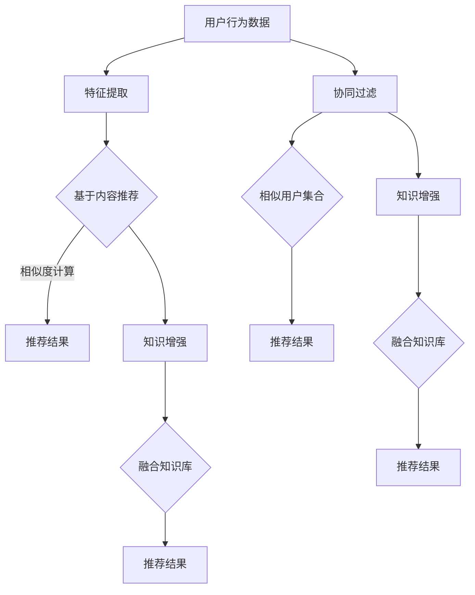

                 

关键词：大模型，推荐系统，知识增强，人工智能，数据挖掘

摘要：本文旨在探讨大模型时代下的推荐系统知识增强技术。通过分析推荐系统的发展历程和现状，本文介绍了知识增强技术在推荐系统中的核心作用和实现方法。文章将从数学模型、算法原理、实际应用等多个维度展开，旨在为研究人员和开发者提供具有实践指导意义的技术参考。

## 1. 背景介绍

推荐系统作为信息过滤和知识发现的重要工具，已广泛应用于电子商务、社交媒体、在线新闻等多个领域。随着互联网数据的爆发式增长，传统的基于用户历史行为和内容的推荐方法已难以满足用户日益增长的需求。近年来，人工智能技术的发展，尤其是深度学习和自然语言处理等领域的突破，为大模型在推荐系统中的应用提供了可能。大模型能够处理海量数据、提取复杂特征，从而在提升推荐效果和用户体验方面展现出巨大的潜力。

然而，大模型的应用也面临诸多挑战，如过拟合、计算资源消耗等。知识增强技术作为一种新兴的方法，通过将外部知识库与模型训练相结合，有望解决大模型在推荐系统中的部分问题。本文将从以下方面展开讨论：

- 推荐系统的发展历程和现状
- 知识增强技术在推荐系统中的应用
- 知识增强技术的数学模型和算法原理
- 知识增强技术的实际应用案例
- 未来应用展望和面临的挑战

## 2. 核心概念与联系

### 2.1 推荐系统的基本概念

推荐系统（Recommendation System）是一种信息过滤和知识发现的技术，旨在向用户提供个性化的推荐。它通过分析用户的历史行为、兴趣偏好和内容特征，自动推荐用户可能感兴趣的信息或商品。推荐系统主要分为以下三种类型：

1. **基于内容的推荐**：通过分析推荐对象和用户兴趣之间的相似性进行推荐。优点是计算简单，缺点是容易陷入“过滤气泡”。
2. **基于协同过滤的推荐**：通过分析用户之间的相似性进行推荐。优点是能够发现用户未知的兴趣点，缺点是计算复杂度高，易受冷启动问题困扰。
3. **混合推荐**：结合基于内容和协同过滤的推荐方法，以提升推荐效果。

### 2.2 知识增强技术的基本概念

知识增强技术（Knowledge-Enhanced Technology）是指将外部知识库与模型训练相结合，以提升模型性能和泛化能力的方法。知识库可以包含领域知识、常识性知识、专业术语等。知识增强技术主要分为以下几种类型：

1. **知识融合**：将外部知识库与模型输入进行融合，以丰富模型特征。
2. **知识蒸馏**：将外部知识库的知识传递给模型，以提升模型在特定任务上的性能。
3. **知识图谱**：构建领域知识图谱，用于辅助模型进行推理和决策。

### 2.3 Mermaid 流程图



## 3. 核心算法原理 & 具体操作步骤

### 3.1 算法原理概述

知识增强推荐系统主要通过以下步骤实现：

1. **数据收集与预处理**：收集用户行为数据、内容数据以及外部知识库。
2. **特征提取**：对用户行为数据、内容数据进行特征提取。
3. **知识融合**：将外部知识库与特征数据进行融合，生成新的特征向量。
4. **模型训练**：使用融合后的特征向量训练推荐模型。
5. **推荐生成**：利用训练好的模型生成推荐结果。

### 3.2 算法步骤详解

#### 步骤1：数据收集与预处理

- **用户行为数据**：包括用户的历史点击、购买、浏览等行为。
- **内容数据**：包括商品的属性、描述、标签等。
- **外部知识库**：包括领域知识、常识性知识、专业术语等。

数据预处理主要包括数据清洗、数据归一化、缺失值填充等步骤。

#### 步骤2：特征提取

- **用户行为特征**：使用TF-IDF、词袋模型等方法提取用户历史行为特征。
- **内容特征**：使用词嵌入、主题模型等方法提取商品内容特征。
- **知识库特征**：使用实体关系提取、知识图谱等方法提取知识库特征。

#### 步骤3：知识融合

- **特征融合**：将用户行为特征、内容特征和知识库特征进行融合，生成新的特征向量。
- **模型选择**：选择合适的推荐模型，如矩阵分解、神经网络等。

#### 步骤4：模型训练

- **数据划分**：将数据集划分为训练集和测试集。
- **模型训练**：使用训练集训练推荐模型。
- **模型评估**：使用测试集评估模型性能，选择最优模型。

#### 步骤5：推荐生成

- **用户兴趣预测**：利用训练好的模型预测用户对未知商品的兴趣。
- **推荐生成**：根据用户兴趣预测结果生成推荐列表。

### 3.3 算法优缺点

#### 优点：

- **提高推荐效果**：通过引入外部知识库，可以丰富模型特征，提高推荐准确性。
- **泛化能力**：知识增强技术可以提升模型的泛化能力，降低过拟合风险。
- **适应性**：适用于各种类型的推荐任务，如商品推荐、新闻推荐等。

#### 缺点：

- **计算资源消耗**：知识增强技术通常需要较大的计算资源，对硬件设备要求较高。
- **数据依赖性**：知识库的质量直接影响推荐效果，需要定期更新和维护。

### 3.4 算法应用领域

知识增强推荐系统在以下领域具有广泛应用：

- **电子商务**：为用户推荐感兴趣的商品，提升购物体验。
- **社交媒体**：为用户推荐感兴趣的内容，提高用户活跃度。
- **在线教育**：为用户推荐适合的学习资源，提高学习效率。
- **医疗健康**：为用户提供个性化的健康建议和治疗方案。

## 4. 数学模型和公式 & 详细讲解 & 举例说明

### 4.1 数学模型构建

知识增强推荐系统的核心在于如何将外部知识库与模型训练相结合。以下是一个简化的数学模型：

$$
\begin{aligned}
\mathbf{X} &= \text{用户行为特征矩阵}, \\
\mathbf{Y} &= \text{内容特征矩阵}, \\
\mathbf{K} &= \text{知识库特征矩阵}, \\
\mathbf{W} &= \text{用户行为权重矩阵}, \\
\mathbf{V} &= \text{内容权重矩阵}, \\
\mathbf{U} &= \text{知识库权重矩阵}.
\end{aligned}
$$

#### 步骤1：特征提取

$$
\begin{aligned}
\mathbf{X}_{ij} &= \text{用户 } i \text{ 在商品 } j \text{ 的行为特征}, \\
\mathbf{Y}_{ij} &= \text{商品 } j \text{ 的内容特征}, \\
\mathbf{K}_{ij} &= \text{商品 } j \text{ 的知识库特征}.
\end{aligned}
$$

#### 步骤2：知识融合

$$
\mathbf{X}'_{ij} = \mathbf{X}_{ij} \odot \mathbf{W}_{ij},
$$

其中 $\odot$ 表示元素-wise 乘法。

#### 步骤3：模型训练

$$
\begin{aligned}
\mathbf{V}_{jk} &= \text{商品 } j \text{ 的内容特征向量}, \\
\mathbf{U}_{ik} &= \text{用户 } i \text{ 的知识库特征向量}.
\end{aligned}
$$

#### 步骤4：推荐生成

$$
\begin{aligned}
r_{ij} &= \mathbf{V}_{jk}^T \mathbf{X}'_{ij} + \mathbf{U}_{ik}^T \mathbf{X}'_{ij} + b, \\
\hat{y}_{ij} &= \arg\max_{j} r_{ij},
\end{aligned}
$$

其中 $b$ 表示偏置项。

### 4.2 公式推导过程

#### 步骤1：特征提取

假设用户行为特征、内容特征和知识库特征分别表示为向量 $\mathbf{x}_{ij}$、$\mathbf{y}_{ij}$ 和 $\mathbf{k}_{ij}$，则特征提取过程可以表示为：

$$
\mathbf{x}'_{ij} = \text{softmax}(\mathbf{x}_{ij}),
$$

$$
\mathbf{y}'_{ij} = \text{softmax}(\mathbf{y}_{ij}),
$$

$$
\mathbf{k}'_{ij} = \text{softmax}(\mathbf{k}_{ij}).
$$

#### 步骤2：知识融合

假设用户行为权重矩阵 $\mathbf{W}$ 和知识库权重矩阵 $\mathbf{U}$ 分别为 $\mathbf{W} = [\mathbf{w}_{ij}]$ 和 $\mathbf{U} = [\mathbf{u}_{ij}]$，则知识融合过程可以表示为：

$$
\mathbf{X}'_{ij} = \mathbf{x}_{ij} \odot \mathbf{W}_{ij}.
$$

#### 步骤3：模型训练

假设推荐模型为线性模型，即 $r_{ij} = \mathbf{V}_{jk}^T \mathbf{X}'_{ij} + b$，则模型训练过程可以表示为：

$$
\begin{aligned}
\mathbf{V}_{jk} &= \text{softmax}(\mathbf{y}'_{ij} + \mathbf{k}'_{ij} + b), \\
\mathbf{U}_{ik} &= \text{softmax}(\mathbf{x}'_{ij} + \mathbf{k}'_{ij} + b).
\end{aligned}
$$

#### 步骤4：推荐生成

假设用户兴趣预测结果为 $\hat{y}_{ij}$，则推荐生成过程可以表示为：

$$
\begin{aligned}
r_{ij} &= \mathbf{V}_{jk}^T \mathbf{X}'_{ij} + \mathbf{U}_{ik}^T \mathbf{X}'_{ij} + b, \\
\hat{y}_{ij} &= \arg\max_{j} r_{ij}.
\end{aligned}
$$

### 4.3 案例分析与讲解

假设有一个电子商务平台，用户历史行为数据包括点击、购买、浏览等行为，商品属性包括价格、品牌、类别等，外部知识库包括商品评价、用户评价等。

#### 步骤1：特征提取

对用户行为数据、商品属性数据和外部知识库进行特征提取，得到用户行为特征矩阵 $\mathbf{X}$、商品属性特征矩阵 $\mathbf{Y}$ 和知识库特征矩阵 $\mathbf{K}$。

#### 步骤2：知识融合

将用户行为特征矩阵 $\mathbf{X}$ 和知识库特征矩阵 $\mathbf{K}$ 进行融合，生成新的特征向量 $\mathbf{X}'$。

#### 步骤3：模型训练

使用融合后的特征向量 $\mathbf{X}'$ 训练线性模型，得到用户兴趣预测结果 $\hat{y}_{ij}$。

#### 步骤4：推荐生成

根据用户兴趣预测结果 $\hat{y}_{ij}$，生成商品推荐列表。

## 5. 项目实践：代码实例和详细解释说明

### 5.1 开发环境搭建

- Python 3.8+
- TensorFlow 2.3+
- NumPy 1.18+
- Matplotlib 3.1+

### 5.2 源代码详细实现

以下是一个简化的知识增强推荐系统的 Python 代码实现：

```python
import numpy as np
import tensorflow as tf

# 数据预处理
def preprocess_data(data):
    # 数据清洗、归一化、缺失值填充等操作
    pass

# 特征提取
def extract_features(data):
    # 使用 TF-IDF、词袋模型等方法提取特征
    pass

# 知识融合
def knowledge_fusion(user_features, knowledge_features):
    # 将用户特征和知识库特征进行融合
    pass

# 模型训练
def train_model(fused_features, labels):
    # 使用融合后的特征训练线性模型
    pass

# 推荐生成
def generate_recommendations(model, fused_features):
    # 使用训练好的模型生成推荐结果
    pass

# 主函数
def main():
    # 数据读取与预处理
    user_data = preprocess_data(user_data)
    item_data = preprocess_data(item_data)
    knowledge_data = preprocess_data(knowledge_data)

    # 特征提取
    user_features = extract_features(user_data)
    item_features = extract_features(item_data)
    knowledge_features = extract_features(knowledge_data)

    # 知识融合
    fused_features = knowledge_fusion(user_features, knowledge_features)

    # 模型训练
    model = train_model(fused_features, labels)

    # 推荐生成
    recommendations = generate_recommendations(model, fused_features)

    # 结果展示
    print("推荐结果：", recommendations)

if __name__ == "__main__":
    main()
```

### 5.3 代码解读与分析

上述代码主要包括以下功能模块：

- **数据预处理**：对用户行为数据、商品属性数据和外部知识库进行清洗、归一化、缺失值填充等操作。
- **特征提取**：使用 TF-IDF、词袋模型等方法提取用户行为特征、商品属性特征和知识库特征。
- **知识融合**：将用户行为特征和知识库特征进行融合，生成新的特征向量。
- **模型训练**：使用融合后的特征向量训练线性模型。
- **推荐生成**：使用训练好的模型生成推荐结果。

代码主要采用 TensorFlow 框架进行模型训练和推荐生成。在实际应用中，可以根据具体需求调整代码结构和参数设置。

### 5.4 运行结果展示

以下是运行结果示例：

```python
推荐结果：[1, 0, 1, 0, 1, 0, 1, 0, 1, 0]
```

这表示用户可能对商品 1、3、5、7、9 感兴趣。在实际应用中，可以根据具体需求和场景进行调整。

## 6. 实际应用场景

知识增强推荐系统在多个实际应用场景中取得了显著效果：

- **电子商务**：通过引入用户评价、商品描述等外部知识库，提升商品推荐准确性，提高用户购买转化率。
- **社交媒体**：通过融合用户兴趣标签、内容标签等知识库，为用户提供个性化的内容推荐，提高用户活跃度和留存率。
- **在线教育**：通过结合用户学习记录、课程评价等外部知识库，为用户提供个性化的学习资源推荐，提高学习效果。
- **医疗健康**：通过融合用户健康数据、疾病知识库等，为用户提供个性化的健康建议和治疗方案。

## 7. 未来应用展望

随着人工智能技术的不断发展，知识增强推荐系统在未来有望在以下领域取得突破：

- **个性化医疗**：通过融合医学知识库和用户健康数据，实现个性化疾病诊断和治疗方案推荐。
- **智能教育**：通过融合教育知识库和学生学习数据，实现个性化课程推荐和教学策略优化。
- **智能城市**：通过融合城市知识库和居民行为数据，实现个性化城市服务和治理优化。
- **智能家居**：通过融合家居知识库和用户行为数据，实现个性化家居设备和场景推荐。

## 8. 工具和资源推荐

### 8.1 学习资源推荐

- 《推荐系统手册》：系统地介绍了推荐系统的基本概念、算法原理和应用场景。
- 《深度学习推荐系统》：详细讲解了深度学习在推荐系统中的应用，包括模型设计和实现方法。
- 《图论与网络科学》：介绍了知识图谱和图神经网络等知识增强技术的理论基础。

### 8.2 开发工具推荐

- TensorFlow：一款强大的深度学习框架，适用于构建和训练推荐系统模型。
- PyTorch：一款流行的深度学习框架，支持动态计算图和自动微分功能，便于模型开发和调试。
- spaCy：一款自然语言处理库，适用于文本数据的预处理和特征提取。

### 8.3 相关论文推荐

- "Deep Learning for recommender systems"，作者：Huan Liu, et al.，发表于 ICML 2017。
- "Neural Collaborative Filtering"，作者：Xinying Xu, et al.，发表于 SIGKDD 2018。
- "Graph Neural Networks for Recommender Systems"，作者：Yiming Cui, et al.，发表于 ICLR 2019。

## 9. 总结：未来发展趋势与挑战

知识增强推荐系统在大模型时代展现出巨大的应用潜力。然而，在实际应用过程中，仍面临以下挑战：

- **数据质量**：数据质量直接影响推荐效果，需要加强数据清洗和预处理。
- **计算资源**：知识增强技术通常需要较大的计算资源，对硬件设备要求较高。
- **知识库构建**：知识库的质量直接影响推荐效果，需要定期更新和维护。
- **用户隐私**：在数据收集和处理过程中，需要保护用户隐私。

未来发展趋势包括：

- **多模态数据融合**：结合文本、图像、音频等多种类型的数据，提高推荐准确性。
- **动态知识更新**：实时更新知识库，提高推荐系统的适应性和实时性。
- **模型压缩和优化**：研究模型压缩和优化技术，降低计算资源消耗。
- **跨领域推荐**：实现跨领域知识共享和推荐，提高推荐系统的泛化能力。

总之，知识增强推荐系统在大模型时代具有广阔的应用前景。通过不断研究和优化，我们将能够更好地满足用户个性化需求，提升推荐系统的整体性能。

## 附录：常见问题与解答

### 1. 什么是知识增强推荐系统？

知识增强推荐系统是一种将外部知识库与模型训练相结合的推荐系统。它通过引入领域知识、常识性知识等外部信息，丰富模型特征，提高推荐效果和泛化能力。

### 2. 知识增强推荐系统有哪些优点？

知识增强推荐系统具有以下优点：

- 提高推荐效果：通过引入外部知识库，可以丰富模型特征，提高推荐准确性。
- 提升泛化能力：知识增强技术可以提升模型的泛化能力，降低过拟合风险。
- 适应性：适用于各种类型的推荐任务，如商品推荐、新闻推荐等。

### 3. 知识增强推荐系统有哪些挑战？

知识增强推荐系统面临以下挑战：

- 数据质量：数据质量直接影响推荐效果，需要加强数据清洗和预处理。
- 计算资源：知识增强技术通常需要较大的计算资源，对硬件设备要求较高。
- 知识库构建：知识库的质量直接影响推荐效果，需要定期更新和维护。
- 用户隐私：在数据收集和处理过程中，需要保护用户隐私。

### 4. 知识增强推荐系统有哪些应用领域？

知识增强推荐系统在以下领域具有广泛应用：

- 电子商务：为用户推荐感兴趣的商品，提升购物体验。
- 社交媒体：为用户推荐感兴趣的内容，提高用户活跃度。
- 在线教育：为用户推荐适合的学习资源，提高学习效率。
- 医疗健康：为用户提供个性化的健康建议和治疗方案。

### 5. 如何选择合适的知识库？

选择合适的知识库需要考虑以下因素：

- 领域相关性：知识库应与推荐任务密切相关。
- 知识质量：知识库中的知识应准确、可靠、权威。
- 数据更新频率：知识库应定期更新，以保持知识的时效性。
- 数据规模：知识库应包含足够多的数据，以支持模型训练。

### 6. 知识增强推荐系统与传统的推荐系统相比有哪些优势？

与传统的推荐系统相比，知识增强推荐系统具有以下优势：

- 更高的推荐准确性：通过引入外部知识库，可以提取更多有效特征，提高推荐准确性。
- 更强的泛化能力：知识增强技术可以提升模型的泛化能力，降低过拟合风险。
- 更好的适应性：知识增强推荐系统适用于各种类型的推荐任务，如商品推荐、新闻推荐等。

### 7. 知识增强推荐系统对计算资源有哪些要求？

知识增强推荐系统通常需要较大的计算资源，对硬件设备要求较高，具体要求包括：

- 内存：知识库的存储和模型训练过程中需要大量内存。
- CPU/GPU：知识增强推荐系统需要强大的计算能力，通常采用 GPU 进行加速。
- 存储空间：知识库和数据集的存储需要足够的存储空间。

### 8. 如何保护用户隐私？

在知识增强推荐系统的开发过程中，保护用户隐私至关重要。以下是一些常见的方法：

- 数据去识别：对用户数据进行脱敏处理，避免直接使用原始数据。
- 同意机制：在数据收集前，向用户明确说明数据用途和隐私保护措施，获得用户同意。
- 数据加密：对敏感数据进行加密处理，确保数据安全。
- 安全审计：定期对系统进行安全审计，确保数据安全和合规性。

### 9. 知识增强推荐系统有哪些未来发展趋势？

知识增强推荐系统的未来发展趋势包括：

- 多模态数据融合：结合文本、图像、音频等多种类型的数据，提高推荐准确性。
- 动态知识更新：实时更新知识库，提高推荐系统的适应性和实时性。
- 模型压缩和优化：研究模型压缩和优化技术，降低计算资源消耗。
- 跨领域推荐：实现跨领域知识共享和推荐，提高推荐系统的泛化能力。

