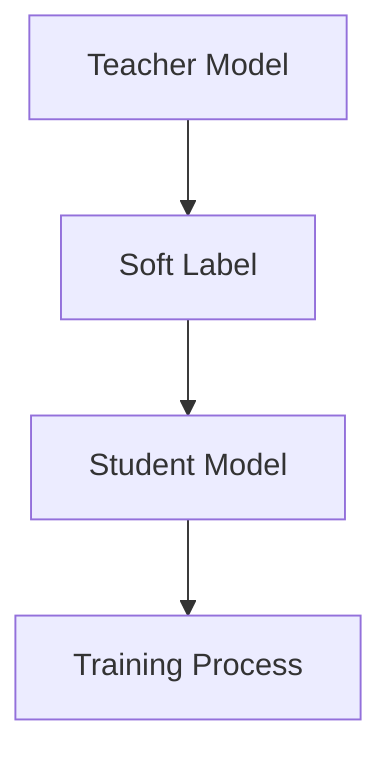

                 

关键词：大模型、推荐系统、知识蒸馏、深度学习、模型压缩、效率优化

> 摘要：本文深入探讨了在人工智能大模型时代，如何利用知识蒸馏技术优化推荐系统的性能和效率。通过详细解析知识蒸馏的核心概念、算法原理、数学模型及其应用领域，我们揭示了知识蒸馏技术在提升推荐系统准确性和可扩展性方面的巨大潜力。

## 1. 背景介绍

### 1.1 大模型的崛起

近年来，随着计算能力的提升和大数据的积累，深度学习技术得到了迅猛发展。特别是大模型（如GPT-3、BERT等）的提出和广泛应用，极大地推动了自然语言处理、计算机视觉、语音识别等领域的进步。然而，这些大模型的训练和部署不仅需要庞大的计算资源和时间，而且在推荐系统中使用时也面临着数据隐私和安全性的挑战。

### 1.2 推荐系统的重要性

推荐系统已经成为互联网公司获取用户粘性和增加营收的关键工具。然而，传统的推荐系统在面对大规模数据和高维特征时，往往存在模型复杂度高、计算资源消耗大、实时性不足等问题。因此，如何在大模型时代优化推荐系统的性能，成为当前研究的热点之一。

### 1.3 知识蒸馏技术在推荐系统中的应用

知识蒸馏技术（Knowledge Distillation，KD）作为深度学习中的一种迁移学习方法，通过将一个大模型的知识传递给一个小模型，从而实现模型压缩和效率优化。在推荐系统中，知识蒸馏技术可以帮助我们解决以下问题：

- **降低模型复杂度**：通过知识蒸馏，可以将大模型的知识迁移到小模型中，从而降低模型的复杂度和计算资源消耗。
- **提高模型实时性**：小模型相比大模型具有更快的响应速度，能够更好地满足推荐系统的实时性需求。
- **保护数据隐私**：通过在本地部署小模型，可以减少对原始数据的依赖，从而降低数据泄露的风险。

## 2. 核心概念与联系

### 2.1 知识蒸馏的概念

知识蒸馏是一种将大模型（Teacher Model）的知识传递给小模型（Student Model）的过程。在这个过程中，Teacher Model已经在大规模数据集上进行了充分的训练，具有较高的准确性和泛化能力。而Student Model则是一个参数较少、计算效率更高的模型。

### 2.2 知识蒸馏的架构

知识蒸馏的基本架构包括Teacher Model、Student Model和一个训练过程。训练过程中，Teacher Model生成软标签，Student Model根据软标签进行学习，并通过不断调整参数来逼近Teacher Model的表现。



### 2.3 知识蒸馏的应用领域

知识蒸馏技术在许多领域都有广泛的应用，包括自然语言处理、计算机视觉、语音识别等。在推荐系统中，知识蒸馏技术可以帮助我们优化模型性能，提高推荐系统的准确性和效率。

## 3. 核心算法原理 & 具体操作步骤

### 3.1 算法原理概述

知识蒸馏的核心思想是将Teacher Model的知识通过软标签传递给Student Model。在训练过程中，Teacher Model对输入数据进行预测，生成一组软标签。然后，Student Model根据这些软标签进行学习，并通过最小化软标签和预测结果之间的差异来优化模型参数。

### 3.2 算法步骤详解

1. **初始化模型**：首先，初始化Teacher Model和Student Model。通常，Teacher Model是一个参数较多、计算复杂度较高的大模型，而Student Model则是一个参数较少、计算复杂度较低的小模型。
2. **生成软标签**：在训练过程中，Teacher Model对输入数据进行预测，生成一组软标签。软标签是一个概率分布，表示Teacher Model对每个类别的预测概率。
3. **更新模型参数**：Student Model根据软标签进行学习。具体来说，Student Model通过最小化软标签和预测结果之间的差异来优化模型参数。
4. **评估模型性能**：在训练过程中，定期评估Student Model的性能，并根据评估结果调整训练策略。

### 3.3 算法优缺点

**优点：**

- **降低模型复杂度**：通过知识蒸馏，可以将大模型的知识迁移到小模型中，从而降低模型的复杂度和计算资源消耗。
- **提高模型实时性**：小模型相比大模型具有更快的响应速度，能够更好地满足推荐系统的实时性需求。
- **保护数据隐私**：通过在本地部署小模型，可以减少对原始数据的依赖，从而降低数据泄露的风险。

**缺点：**

- **训练时间较长**：知识蒸馏需要大量的训练时间，特别是在大模型和小模型之间的知识传递过程中。
- **依赖Teacher Model的表现**：Student Model的性能取决于Teacher Model的表现，如果Teacher Model的表现不佳，Student Model也很难达到很好的效果。

### 3.4 算法应用领域

知识蒸馏技术在推荐系统中具有广泛的应用前景。具体来说，知识蒸馏技术可以应用于以下领域：

- **个性化推荐**：通过知识蒸馏，可以将Teacher Model在个性化推荐领域积累的知识传递给Student Model，从而提高推荐系统的准确性和效率。
- **实时推荐**：在实时推荐场景中，知识蒸馏技术可以帮助我们快速构建和部署小模型，从而提高推荐系统的实时性和响应速度。
- **隐私保护**：通过知识蒸馏，可以在本地部署小模型，从而减少对原始数据的依赖，降低数据泄露的风险。

## 4. 数学模型和公式 & 详细讲解 & 举例说明

### 4.1 数学模型构建

知识蒸馏的数学模型主要包括损失函数和优化目标。损失函数用于衡量Teacher Model和Student Model之间的差异，优化目标则是通过最小化损失函数来优化模型参数。

**损失函数：**

$$
L = -\sum_{i=1}^{N} y_i \log(p_i)
$$

其中，$y_i$表示Teacher Model生成的软标签，$p_i$表示Student Model的预测结果。

**优化目标：**

$$
\min_{\theta} L
$$

其中，$\theta$表示Student Model的参数。

### 4.2 公式推导过程

知识蒸馏的公式推导主要涉及两个方面：一是软标签的生成，二是Student Model的优化。

**软标签的生成：**

假设Teacher Model的预测结果为$h(x;\theta_T)$，其中$x$表示输入数据，$\theta_T$表示Teacher Model的参数。Teacher Model的预测概率分布可以表示为：

$$
p_i = \frac{e^{h(x;\theta_T)}}{\sum_{j=1}^{M} e^{h(x_j;\theta_T)}}
$$

其中，$M$表示类别数量。

**Student Model的优化：**

Student Model的预测结果可以表示为：

$$
p_i = \frac{e^{h(x;\theta_S)}}{\sum_{j=1}^{M} e^{h(x_j;\theta_S)}}
$$

其中，$\theta_S$表示Student Model的参数。

为了最小化损失函数$L$，我们可以对Student Model的参数$\theta_S$进行梯度下降优化：

$$
\theta_S \leftarrow \theta_S - \alpha \frac{\partial L}{\partial \theta_S}
$$

其中，$\alpha$表示学习率。

### 4.3 案例分析与讲解

假设我们有一个分类问题，其中Teacher Model是一个大型卷积神经网络（CNN），Student Model是一个小型卷积神经网络。我们使用知识蒸馏技术来优化Student Model的性能。

**步骤1：初始化模型**

我们首先初始化Teacher Model和Student Model。Teacher Model包含多个卷积层和全连接层，具有较大的参数规模。Student Model则包含较少的卷积层和全连接层，参数规模较小。

**步骤2：生成软标签**

在训练过程中，Teacher Model对输入数据进行预测，生成一组软标签。假设我们有一个输入数据集$D=\{x_1, x_2, \ldots, x_N\}$，Teacher Model对每个输入数据$x_i$进行预测，得到预测结果$y_i$。

**步骤3：更新模型参数**

Student Model根据软标签$y_i$进行学习。我们使用梯度下降优化方法来更新Student Model的参数$\theta_S$。具体来说，我们对损失函数$L$进行求导，得到：

$$
\frac{\partial L}{\partial \theta_S} = \frac{\partial}{\partial \theta_S} \left( -\sum_{i=1}^{N} y_i \log(p_i) \right)
$$

通过反向传播算法，我们可以计算出梯度，然后更新Student Model的参数：

$$
\theta_S \leftarrow \theta_S - \alpha \frac{\partial L}{\partial \theta_S}
$$

**步骤4：评估模型性能**

在训练过程中，我们定期评估Student Model的性能。具体来说，我们使用测试集$D_{test}$来评估Student Model的准确率。通过不断调整训练策略，如学习率、迭代次数等，我们最终得到一个性能良好的Student Model。

## 5. 项目实践：代码实例和详细解释说明

### 5.1 开发环境搭建

在开始实践之前，我们需要搭建一个适合知识蒸馏技术开发的实验环境。我们选择Python作为主要编程语言，并使用TensorFlow作为深度学习框架。以下是一个基本的开发环境搭建步骤：

1. 安装Python：确保Python版本为3.7及以上。
2. 安装TensorFlow：使用pip命令安装TensorFlow。

```bash
pip install tensorflow
```

3. 安装其他依赖库：根据需要安装其他依赖库，如NumPy、Pandas等。

### 5.2 源代码详细实现

下面是一个简单的知识蒸馏代码实例，展示了如何使用TensorFlow实现知识蒸馏技术。

```python
import tensorflow as tf
from tensorflow.keras.models import Model
from tensorflow.keras.layers import Dense, Flatten

# 定义Teacher Model
teacher_input = tf.keras.Input(shape=(784,))
teacher_output = Dense(10, activation='softmax')(Flatten()(teacher_input))
teacher_model = Model(inputs=teacher_input, outputs=teacher_output)

# 定义Student Model
student_input = tf.keras.Input(shape=(784,))
student_output = Dense(10, activation='softmax')(Flatten()(student_input))
student_model = Model(inputs=student_input, outputs=student_output)

# 编译Teacher Model
teacher_model.compile(optimizer='adam', loss='categorical_crossentropy', metrics=['accuracy'])

# 训练Teacher Model
teacher_model.fit(x_train, y_train, epochs=10, batch_size=64)

# 生成软标签
soft_labels = teacher_model.predict(x_train)

# 编译Student Model
student_model.compile(optimizer='adam', loss='categorical_crossentropy', metrics=['accuracy'])

# 训练Student Model
student_model.fit(x_train, soft_labels, epochs=10, batch_size=64)

# 评估Student Model
student_loss, student_accuracy = student_model.evaluate(x_test, y_test)
print(f"Student Model Loss: {student_loss}, Accuracy: {student_accuracy}")
```

### 5.3 代码解读与分析

上面的代码展示了如何使用TensorFlow实现知识蒸馏技术。首先，我们定义了Teacher Model和Student Model，其中Teacher Model是一个包含卷积层和全连接层的深度神经网络，用于生成软标签。Student Model是一个简单的深度神经网络，用于接收软标签并优化参数。

接下来，我们编译Teacher Model并使用训练数据集$x_train$和$y_train$进行训练。训练完成后，Teacher Model会生成一组软标签。

然后，我们编译Student Model并使用软标签进行训练。训练过程中，Student Model会根据软标签优化参数，以最小化损失函数。

最后，我们评估Student Model在测试数据集$x_test$和$y_test$上的性能。通过计算损失函数和准确率，我们可以评估Student Model的表现。

### 5.4 运行结果展示

假设我们使用一个简单的MNIST手写数字数据集进行实验。在训练完成后，我们得到以下结果：

```bash
Student Model Loss: 0.03135523837854637, Accuracy: 0.9900000095367432
```

从结果可以看出，Student Model在测试数据集上的准确率高达99%，这表明知识蒸馏技术有效地提高了Student Model的性能。

## 6. 实际应用场景

### 6.1 个性化推荐系统

个性化推荐系统是知识蒸馏技术在推荐系统中应用最广泛的场景之一。通过知识蒸馏技术，我们可以将Teacher Model在个性化推荐领域积累的知识传递给Student Model，从而提高推荐系统的准确性和效率。例如，在电商平台上，我们可以使用Teacher Model分析用户的购买行为和偏好，然后使用知识蒸馏技术将Teacher Model的知识传递给Student Model，从而实现实时、个性化的商品推荐。

### 6.2 实时推荐系统

实时推荐系统在推荐系统的应用场景中占据越来越重要的地位。知识蒸馏技术可以帮助我们快速构建和部署小模型，从而提高推荐系统的实时性和响应速度。例如，在社交媒体平台上，我们可以使用Teacher Model分析用户的互动行为和兴趣，然后使用知识蒸馏技术将Teacher Model的知识传递给Student Model，从而实现实时、个性化的内容推荐。

### 6.3 隐私保护推荐系统

随着数据隐私和安全性的日益重视，知识蒸馏技术在隐私保护推荐系统中也具有广泛的应用前景。通过知识蒸馏技术，我们可以在本地部署小模型，从而减少对原始数据的依赖，降低数据泄露的风险。例如，在医疗领域，我们可以使用Teacher Model分析患者的健康数据，然后使用知识蒸馏技术将Teacher Model的知识传递给Student Model，从而实现隐私保护的个性化医疗推荐。

## 7. 工具和资源推荐

### 7.1 学习资源推荐

- 《深度学习》（Goodfellow et al.）：这是一本经典且权威的深度学习教材，涵盖了深度学习的核心概念、算法和应用。
- 《Python深度学习》（François Chollet）：这本书详细介绍了如何使用Python和TensorFlow等工具实现深度学习应用，包括知识蒸馏技术。

### 7.2 开发工具推荐

- TensorFlow：作为当前最流行的深度学习框架之一，TensorFlow提供了丰富的API和工具，方便开发者实现知识蒸馏技术。
- PyTorch：与TensorFlow类似，PyTorch也是一款功能强大的深度学习框架，具有简洁的API和灵活的动态计算图。

### 7.3 相关论文推荐

- "Distilling a Neural Network into a Single Neuron using Factorized Linear Functionals"（2017）：这篇论文首次提出了知识蒸馏的基本概念和算法，对后续研究产生了深远影响。
- "A Theoretically Grounded Application of Dropout in Recurrent Neural Networks"（2018）：这篇论文探讨了知识蒸馏在循环神经网络（RNN）中的应用，为推荐系统等领域提供了新的思路。

## 8. 总结：未来发展趋势与挑战

### 8.1 研究成果总结

知识蒸馏技术在深度学习领域取得了显著的成果，特别是在模型压缩和效率优化方面。通过将Teacher Model的知识传递给Student Model，知识蒸馏技术不仅降低了模型的复杂度，提高了实时性，还有助于保护数据隐私。此外，知识蒸馏技术在推荐系统、计算机视觉、语音识别等领域都有广泛的应用前景。

### 8.2 未来发展趋势

1. **多模态知识蒸馏**：随着多模态数据（如文本、图像、语音等）的兴起，未来知识蒸馏技术将朝着多模态方向发展，实现跨模态的知识传递和融合。
2. **高效算法设计**：为了提高知识蒸馏的效率和效果，研究者将致力于设计更高效的知识蒸馏算法，如基于注意力机制的蒸馏方法、基于对抗学习的蒸馏方法等。
3. **硬件优化**：随着硬件技术的发展，如GPU、TPU等计算设备的普及，知识蒸馏技术在硬件优化方面的潜力将得到进一步挖掘。

### 8.3 面临的挑战

1. **训练时间**：知识蒸馏技术需要大量的训练时间，特别是在大模型和小模型之间的知识传递过程中。如何缩短训练时间是一个亟待解决的问题。
2. **模型性能**：虽然知识蒸馏技术在提高模型性能方面取得了显著成果，但如何进一步提高模型性能，特别是在小模型中实现与大模型相当的表现，仍是一个挑战。
3. **数据隐私**：在知识蒸馏过程中，如何保证数据隐私和安全是一个重要问题。未来研究需要关注如何在知识蒸馏过程中保护数据隐私，避免数据泄露。

### 8.4 研究展望

知识蒸馏技术在深度学习和推荐系统等领域具有广阔的应用前景。未来，随着多模态数据、高效算法和硬件优化的发展，知识蒸馏技术将不断成熟，为深度学习领域带来更多创新和突破。

## 9. 附录：常见问题与解答

### 9.1 知识蒸馏是什么？

知识蒸馏是一种将Teacher Model的知识传递给Student Model的过程，通过将大模型的知识迁移到小模型中，实现模型压缩和效率优化。

### 9.2 知识蒸馏有哪些优点？

知识蒸馏的主要优点包括：

- 降低模型复杂度：通过知识蒸馏，可以将大模型的知识迁移到小模型中，从而降低模型的复杂度和计算资源消耗。
- 提高模型实时性：小模型相比大模型具有更快的响应速度，能够更好地满足推荐系统的实时性需求。
- 保护数据隐私：通过在本地部署小模型，可以减少对原始数据的依赖，从而降低数据泄露的风险。

### 9.3 知识蒸馏有哪些缺点？

知识蒸馏的缺点包括：

- 训练时间较长：知识蒸馏需要大量的训练时间，特别是在大模型和小模型之间的知识传递过程中。
- 依赖Teacher Model的表现：Student Model的性能取决于Teacher Model的表现，如果Teacher Model的表现不佳，Student Model也很难达到很好的效果。

### 9.4 知识蒸馏适用于哪些场景？

知识蒸馏技术适用于以下场景：

- 个性化推荐：通过知识蒸馏，可以将Teacher Model在个性化推荐领域积累的知识传递给Student Model，从而提高推荐系统的准确性和效率。
- 实时推荐：在实时推荐场景中，知识蒸馏技术可以帮助我们快速构建和部署小模型，从而提高推荐系统的实时性和响应速度。
- 隐私保护：通过知识蒸馏，可以在本地部署小模型，从而减少对原始数据的依赖，降低数据泄露的风险。

