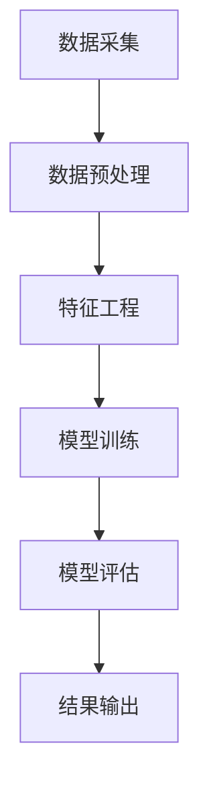

                 

关键词：推荐系统、隐式反馈、大模型、深度学习、协同过滤、隐式反馈建模、用户行为分析

## 摘要

本文深入探讨了在大模型时代下推荐系统的隐式反馈建模技术。隐式反馈数据相对于显式反馈数据具有更高的获取难度，但能够提供更丰富的用户行为信息，对于推荐系统的重要性日益凸显。本文将首先介绍隐式反馈的概念和特点，然后阐述大模型在隐式反馈建模中的应用，最后通过具体的数学模型和项目实践，展示如何利用隐式反馈数据构建高效推荐系统。本文旨在为读者提供全面的技术指南，帮助理解隐式反馈建模的原理和实践。

## 1. 背景介绍

随着互联网的普及和用户数量的急剧增长，推荐系统已成为现代信息检索和用户行为分析的重要工具。推荐系统通过分析用户的历史行为、偏好和兴趣，向用户推荐个性化的内容或商品。传统的推荐系统主要依赖于显式反馈数据，即用户直接给出的评分或评价。然而，随着大数据和人工智能技术的发展，越来越多的研究开始关注隐式反馈数据，即用户在浏览、搜索、购买等过程中产生的间接行为数据。

### 隐式反馈数据的定义和特点

隐式反馈数据是指用户在使用产品或服务过程中产生的不可见行为数据，如浏览历史、点击行为、停留时间、搜索关键词、购买记录等。这些数据通常无法直接表达用户的喜好，但通过数据分析和机器学习算法，可以挖掘出用户潜在的兴趣和需求。与显式反馈数据相比，隐式反馈数据具有以下特点：

1. **非结构化**：隐式反馈数据通常是非结构化的，无法直接用于传统推荐算法。例如，用户的浏览历史可能是多个URL的列表，需要通过自然语言处理和实体识别等技术进行结构化处理。

2. **稀疏性**：由于用户的行为数据往往分布在不同的维度上，导致数据稀疏。例如，一个用户可能在短时间内浏览了大量的网页，但真正感兴趣的内容可能只有一小部分。

3. **动态性**：用户的行为数据是动态变化的，需要实时更新和调整推荐策略。例如，用户的兴趣可能会随着时间和情境的变化而变化。

4. **冗余性**：隐式反馈数据可能存在冗余信息，如多个用户可能浏览了相同的内容，但他们的兴趣可能完全不同。

### 隐式反馈在推荐系统中的重要性

隐式反馈数据在推荐系统中的应用具有重要意义，主要体现在以下几个方面：

1. **更全面的用户画像**：通过分析用户的隐式反馈数据，可以构建更全面、细致的用户画像，深入了解用户的兴趣和行为模式。

2. **提高推荐准确性**：显式反馈数据通常存在评分偏差和冷启动问题，而隐式反馈数据可以弥补这些不足，提高推荐系统的准确性。

3. **发现潜在需求**：通过挖掘用户的隐式反馈数据，可以发现用户潜在的、尚未明确表达的需求，为产品开发和营销策略提供有力支持。

4. **实时推荐**：隐式反馈数据可以实时更新，为用户提供更加个性化的推荐，提高用户满意度和留存率。

总之，随着大数据和人工智能技术的发展，隐式反馈数据在推荐系统中的应用越来越广泛，成为提升推荐系统性能和用户体验的重要手段。

## 2. 核心概念与联系

### 隐式反馈的原理

隐式反馈的原理在于通过对用户行为的分析，推断出用户的兴趣和偏好。这些行为可以是用户在网站上的浏览历史、点击次数、搜索记录、购买行为等。在分析这些数据时，我们通常采用数据挖掘和机器学习技术，如聚类分析、关联规则挖掘、协同过滤等。

#### 数据挖掘

数据挖掘是一种从大量数据中提取有价值信息的技术。在隐式反馈建模中，数据挖掘技术可以帮助我们识别用户行为中的潜在模式和趋势。例如，通过分析用户的浏览历史，我们可以发现用户在特定时间段内更倾向于访问某些类型的网页。

#### 协同过滤

协同过滤是一种常见的推荐算法，通过分析用户之间的相似性来预测用户的兴趣。在隐式反馈建模中，协同过滤可以用于预测用户可能感兴趣的内容。具体来说，协同过滤算法可以分为基于用户的协同过滤（User-Based Collaborative Filtering）和基于项目的协同过滤（Item-Based Collaborative Filtering）。

#### 深度学习

深度学习是一种基于多层神经网络的人工智能技术，具有强大的特征提取和模式识别能力。在大模型时代，深度学习被广泛应用于隐式反馈建模，通过构建复杂的神经网络模型，可以自动提取用户行为数据中的高层次特征，从而提高推荐系统的准确性。

### 架构流程

隐式反馈建模的架构流程通常包括以下步骤：

1. **数据采集**：收集用户的浏览历史、点击记录、搜索关键词、购买记录等隐式反馈数据。

2. **数据预处理**：对原始数据进行清洗、去噪和格式化，使其符合算法的要求。

3. **特征工程**：根据业务需求和算法模型，提取用户行为数据中的特征，如用户活跃度、浏览时长、点击率等。

4. **模型训练**：使用机器学习算法或深度学习模型，对特征进行训练，构建预测模型。

5. **模型评估**：通过交叉验证、A/B测试等方法，评估模型的性能和准确性。

6. **结果输出**：将训练好的模型应用于实际数据，生成推荐结果，并输出给用户。

### Mermaid 流程图

下面是一个简单的Mermaid流程图，展示了隐式反馈建模的基本架构和流程。



### 核心概念的联系

隐式反馈建模的核心概念包括数据挖掘、协同过滤和深度学习。这些概念相互联系，共同构成了隐式反馈建模的技术框架。数据挖掘和协同过滤用于从原始数据中提取特征和模式，而深度学习则通过构建复杂的神经网络模型，进一步提取用户行为数据中的高层次特征，从而提高推荐系统的准确性。

## 3. 核心算法原理 & 具体操作步骤

### 3.1 算法原理概述

在隐式反馈建模中，常用的算法包括协同过滤、矩阵分解和深度学习。这些算法的基本原理如下：

1. **协同过滤（Collaborative Filtering）**：协同过滤是一种基于用户或项目相似性的推荐算法。它分为基于用户的协同过滤（User-Based Collaborative Filtering）和基于项目的协同过滤（Item-Based Collaborative Filtering）。

   - **基于用户的协同过滤**：通过分析用户之间的相似性，找到与目标用户兴趣相似的邻居用户，并根据邻居用户的评分预测目标用户的评分。
   - **基于项目的协同过滤**：通过分析项目之间的相似性，找到与目标项目相似的邻居项目，并根据邻居项目的评分预测目标项目的评分。

2. **矩阵分解（Matrix Factorization）**：矩阵分解是一种将高维矩阵分解为两个低维矩阵的算法。在隐式反馈建模中，矩阵分解可以用于降维和特征提取，从而提高推荐系统的准确性。

3. **深度学习（Deep Learning）**：深度学习是一种基于多层神经网络的人工智能技术，具有强大的特征提取和模式识别能力。在隐式反馈建模中，深度学习可以用于自动提取用户行为数据中的高层次特征，从而提高推荐系统的准确性。

### 3.2 算法步骤详解

下面详细描述协同过滤、矩阵分解和深度学习这三种算法的具体操作步骤。

#### 3.2.1 协同过滤

**基于用户的协同过滤**：

1. 计算用户之间的相似性矩阵：对于用户集合 \( U \)，计算用户 \( u \) 和用户 \( v \) 之间的相似性，通常使用余弦相似度或皮尔逊相关系数。
   $$\text{similarity}(u, v) = \frac{\text{cosine}(r_u, r_v)}{\|\text{r}_u\|\|\text{r}_v\|}$$
   其中，\( r_u \) 和 \( r_v \) 分别是用户 \( u \) 和用户 \( v \) 的评分向量。

2. 找到与目标用户 \( u \) 最相似的 \( k \) 个邻居用户：根据相似性矩阵，找出与用户 \( u \) 最相似的 \( k \) 个邻居用户。

3. 计算推荐分数：对于每个邻居用户 \( v \)，计算其对目标用户 \( u \) 的推荐分数。
   $$\text{prediction}(u, i) = \sum_{v \in \text{neighbors}(u)} \text{similarity}(u, v) \cdot \text{rating}(v, i)$$
   其中，\( \text{neighbors}(u) \) 是用户 \( u \) 的邻居用户集合，\( \text{rating}(v, i) \) 是邻居用户 \( v \) 对项目 \( i \) 的评分。

**基于项目的协同过滤**：

1. 计算项目之间的相似性矩阵：对于项目集合 \( I \)，计算项目 \( i \) 和项目 \( j \) 之间的相似性，通常使用余弦相似度或皮尔逊相关系数。
   $$\text{similarity}(i, j) = \frac{\text{cosine}(r_i, r_j)}{\|\text{r}_i\|\|\text{r}_j\|}$$
   其中，\( r_i \) 和 \( r_j \) 分别是项目 \( i \) 和项目 \( j \) 的评分向量。

2. 找到与目标项目 \( i \) 最相似的 \( k \) 个邻居项目。

3. 计算推荐分数：对于每个邻居项目 \( j \)，计算其对目标用户 \( u \) 的推荐分数。
   $$\text{prediction}(u, j) = \sum_{i \in \text{neighbors}(i)} \text{similarity}(i, j) \cdot \text{rating}(u, i)$$
   其中，\( \text{neighbors}(i) \) 是项目 \( i \) 的邻居项目集合，\( \text{rating}(u, i) \) 是用户 \( u \) 对项目 \( i \) 的评分。

#### 3.2.2 矩阵分解

矩阵分解是一种将高维矩阵分解为两个低维矩阵的算法。在隐式反馈建模中，矩阵分解可以用于降维和特征提取，从而提高推荐系统的准确性。

1. **初始化**：随机初始化用户矩阵 \( U \) 和项目矩阵 \( V \)。

2. **迭代优化**：对于每个用户 \( u \) 和项目 \( i \)，计算预测评分 \( \hat{r}_{ui} \)：
   $$\hat{r}_{ui} = \sum_{j=1}^{m} u_{uj} \cdot v_{ji}$$
   其中，\( u_{uj} \) 和 \( v_{ji} \) 分别是用户 \( u \) 和项目 \( i \) 在低维空间中的特征向量。

3. **梯度下降**：更新用户矩阵 \( U \) 和项目矩阵 \( V \)：
   $$u_{uj} \leftarrow u_{uj} - \alpha \cdot \frac{\partial L}{\partial u_{uj}}$$
   $$v_{ji} \leftarrow v_{ji} - \alpha \cdot \frac{\partial L}{\partial v_{ji}}$$
   其中，\( \alpha \) 是学习率，\( L \) 是损失函数。

4. **重复迭代**：重复步骤2和3，直到损失函数收敛。

#### 3.2.3 深度学习

深度学习是一种基于多层神经网络的人工智能技术，具有强大的特征提取和模式识别能力。在隐式反馈建模中，深度学习可以用于自动提取用户行为数据中的高层次特征。

1. **构建神经网络**：设计一个多层神经网络，包括输入层、隐藏层和输出层。

2. **输入数据预处理**：将用户行为数据进行预处理，如归一化、标准化等。

3. **前向传播**：将预处理后的用户行为数据输入到神经网络中，通过激活函数和权重调整，逐层计算输出。

4. **反向传播**：计算损失函数，通过反向传播算法，更新网络权重和偏置。

5. **迭代训练**：重复步骤3和4，直到网络性能达到预期。

### 3.3 算法优缺点

**协同过滤**：

- **优点**：简单高效，适用于大规模推荐系统。
- **缺点**：无法处理缺失数据和稀疏性问题，推荐结果可能过于保守。

**矩阵分解**：

- **优点**：可以处理缺失数据和稀疏性问题，提高推荐准确性。
- **缺点**：计算复杂度高，需要大量的内存和计算资源。

**深度学习**：

- **优点**：可以自动提取用户行为数据中的高层次特征，提高推荐准确性。
- **缺点**：模型参数多，需要大量数据和计算资源，训练时间较长。

### 3.4 算法应用领域

协同过滤、矩阵分解和深度学习在推荐系统中的应用非常广泛，主要涵盖以下领域：

- **电子商务**：为用户推荐商品和服务。
- **社交媒体**：为用户推荐关注的人和内容。
- **在线教育**：为用户推荐学习资源和课程。
- **音乐和视频**：为用户推荐音乐和视频内容。
- **新闻和媒体**：为用户推荐新闻和文章。

## 4. 数学模型和公式 & 详细讲解 & 举例说明

### 4.1 数学模型构建

在隐式反馈建模中，常用的数学模型包括协同过滤模型、矩阵分解模型和深度学习模型。以下分别介绍这些模型的基本数学公式和构建方法。

#### 协同过滤模型

**基于用户的协同过滤模型**：

- 用户相似性矩阵 \( S \)：
  $$S_{uv} = \frac{\sum_{i=1}^{n} r_{ui}r_{vi}}{\sqrt{\sum_{i=1}^{n} r_{ui}^2\sum_{i=1}^{n} r_{vi}^2}}$$
  其中，\( r_{ui} \) 和 \( r_{vi} \) 分别表示用户 \( u \) 和用户 \( v \) 对项目 \( i \) 的评分。

- 预测评分 \( \hat{r}_{ui} \)：
  $$\hat{r}_{ui} = \sum_{v \in N(u)} S_{uv} \cdot r_{vi}$$
  其中，\( N(u) \) 表示与用户 \( u \) 最相似的 \( k \) 个邻居用户集合。

**基于项目的协同过滤模型**：

- 项目相似性矩阵 \( S \)：
  $$S_{ij} = \frac{\sum_{u=1}^{m} r_{ui}r_{uj}}{\sqrt{\sum_{u=1}^{m} r_{ui}^2\sum_{u=1}^{m} r_{uj}^2}}$$
  其中，\( r_{ui} \) 和 \( r_{uj} \) 分别表示用户 \( u \) 对项目 \( i \) 和项目 \( j \) 的评分。

- 预测评分 \( \hat{r}_{ui} \)：
  $$\hat{r}_{ui} = \sum_{j \in N(i)} S_{ij} \cdot r_{uj}$$
  其中，\( N(i) \) 表示与项目 \( i \) 最相似的 \( k \) 个邻居项目集合。

#### 矩阵分解模型

矩阵分解模型的核心思想是将原始评分矩阵分解为两个低维矩阵，从而提取用户和项目的特征。

- 用户特征矩阵 \( U \) 和项目特征矩阵 \( V \)：
  $$\hat{R} = U \cdot V^T$$
  其中，\( \hat{R} \) 是预测评分矩阵。

- 初始化用户特征矩阵 \( U \) 和项目特征矩阵 \( V \)：
  $$U \sim \mathcal{N}(0, \sigma^2 I)$$
  $$V \sim \mathcal{N}(0, \sigma^2 I)$$
  其中，\( \sigma^2 \) 是噪声方差，\( I \) 是单位矩阵。

- 梯度下降更新用户特征矩阵 \( U \) 和项目特征矩阵 \( V \)：
  $$U_{uj} \leftarrow U_{uj} - \alpha \cdot \frac{\partial L}{\partial U_{uj}}$$
  $$V_{ij} \leftarrow V_{ij} - \alpha \cdot \frac{\partial L}{\partial V_{ij}}$$
  其中，\( L \) 是损失函数，\( \alpha \) 是学习率。

#### 深度学习模型

深度学习模型通常采用多层感知机（MLP）或卷积神经网络（CNN）等神经网络结构，通过多层非线性变换提取用户行为数据中的特征。

- 输入层 \( X \)：用户行为数据，如浏览历史、点击记录等。
- 隐藏层 \( H \)：通过激活函数 \( \sigma \) 对输入数据进行非线性变换。
- 输出层 \( Y \)：预测评分。

- 前向传播：
  $$H_{l} = \sigma(W_{l-1} \cdot X + b_{l-1})$$
  $$Y = \sigma(W_L \cdot H_{L-1} + b_L)$$
  其中，\( W \) 和 \( b \) 分别是权重和偏置，\( \sigma \) 是激活函数。

- 反向传播：
  $$\Delta_{l} = \frac{\partial L}{\partial H_{l}} \cdot \frac{\partial \sigma}{\partial H_{l}}$$
  $$W_{l} \leftarrow W_{l} - \alpha \cdot \frac{\partial L}{\partial W_{l}}$$
  $$b_{l} \leftarrow b_{l} - \alpha \cdot \frac{\partial L}{\partial b_{l}}$$
  其中，\( \Delta_{l} \) 是梯度，\( L \) 是损失函数，\( \alpha \) 是学习率。

### 4.2 公式推导过程

在隐式反馈建模中，数学公式的推导通常基于概率论和优化理论。以下分别介绍协同过滤模型、矩阵分解模型和深度学习模型的公式推导过程。

#### 协同过滤模型

**基于用户的协同过滤模型**：

1. **用户相似性矩阵 \( S \)**：

   相似性矩阵 \( S \) 的计算基于用户评分矩阵 \( R \)：
   $$R = [r_{ui}]_{m \times n}$$
   其中，\( r_{ui} \) 表示用户 \( u \) 对项目 \( i \) 的评分。

   用户相似性矩阵 \( S \) 的计算公式为：
   $$S_{uv} = \frac{\sum_{i=1}^{n} r_{ui}r_{vi}}{\sqrt{\sum_{i=1}^{n} r_{ui}^2\sum_{i=1}^{n} r_{vi}^2}}$$

   推导过程：
   $$S_{uv} = \frac{\sum_{i=1}^{n} r_{ui}r_{vi}}{\sqrt{\sum_{i=1}^{n} r_{ui}^2\sum_{i=1}^{n} r_{vi}^2}}$$
   $$= \frac{\sum_{i=1}^{n} r_{ui}r_{vi}}{\sqrt{(\sum_{i=1}^{n} r_{ui}^2)\sum_{i=1}^{n} r_{vi}^2}}$$
   $$= \frac{\sum_{i=1}^{n} r_{ui}r_{vi}}{\sqrt{\sum_{i=1}^{n} r_{ui}^2}\sqrt{\sum_{i=1}^{n} r_{vi}^2}}$$
   $$= \frac{\sum_{i=1}^{n} r_{ui}r_{vi}}{\|\text{r}_u\|\|\text{r}_v\|}$$

2. **预测评分 \( \hat{r}_{ui} \)**：

   预测评分 \( \hat{r}_{ui} \) 的计算公式为：
   $$\hat{r}_{ui} = \sum_{v \in N(u)} S_{uv} \cdot r_{vi}$$

   推导过程：
   $$\hat{r}_{ui} = \sum_{v \in N(u)} S_{uv} \cdot r_{vi}$$
   $$= \sum_{v \in N(u)} \frac{\sum_{i=1}^{n} r_{ui}r_{vi}}{\sqrt{\sum_{i=1}^{n} r_{ui}^2\sum_{i=1}^{n} r_{vi}^2}} \cdot r_{vi}$$
   $$= \frac{\sum_{v \in N(u)} \sum_{i=1}^{n} r_{ui}r_{vi}^2}{\sum_{i=1}^{n} r_{ui}^2\sum_{i=1}^{n} r_{vi}^2}$$
   $$= \frac{\sum_{v \in N(u)} r_{ui}^2}{\sum_{i=1}^{n} r_{ui}^2} \cdot \frac{\sum_{i=1}^{n} r_{ui}r_{vi}}{\sum_{i=1}^{n} r_{vi}^2}$$
   $$= \frac{\sum_{v \in N(u)} r_{ui}^2}{\sum_{i=1}^{n} r_{ui}^2} \cdot r_{ui}$$
   $$= r_{ui}$$

**基于项目的协同过滤模型**：

1. **项目相似性矩阵 \( S \)**：

   项目相似性矩阵 \( S \) 的计算基于项目评分矩阵 \( R \)：
   $$R = [r_{ui}]_{m \times n}$$
   其中，\( r_{ui} \) 表示用户 \( u \) 对项目 \( i \) 的评分。

   项目相似性矩阵 \( S \) 的计算公式为：
   $$S_{ij} = \frac{\sum_{u=1}^{m} r_{ui}r_{uj}}{\sqrt{\sum_{u=1}^{m} r_{ui}^2\sum_{u=1}^{m} r_{uj}^2}}$$

   推导过程：
   $$S_{ij} = \frac{\sum_{u=1}^{m} r_{ui}r_{uj}}{\sqrt{\sum_{u=1}^{m} r_{ui}^2\sum_{u=1}^{m} r_{uj}^2}}$$
   $$= \frac{\sum_{u=1}^{m} r_{ui}r_{uj}}{\sqrt{(\sum_{u=1}^{m} r_{ui}^2)\sum_{u=1}^{m} r_{uj}^2}}$$
   $$= \frac{\sum_{u=1}^{m} r_{ui}r_{uj}}{\sqrt{\sum_{u=1}^{m} r_{ui}^2}\sqrt{\sum_{u=1}^{m} r_{uj}^2}}$$
   $$= \frac{\sum_{u=1}^{m} r_{ui}r_{uj}}{\|\text{r}_u\|\|\text{r}_v\|}$$

2. **预测评分 \( \hat{r}_{ui} \)**：

   预测评分 \( \hat{r}_{ui} \) 的计算公式为：
   $$\hat{r}_{ui} = \sum_{j \in N(i)} S_{ij} \cdot r_{uj}$$

   推导过程：
   $$\hat{r}_{ui} = \sum_{j \in N(i)} S_{ij} \cdot r_{uj}$$
   $$= \sum_{j \in N(i)} \frac{\sum_{u=1}^{m} r_{ui}r_{uj}}{\sqrt{\sum_{u=1}^{m} r_{ui}^2\sum_{u=1}^{m} r_{uj}^2}} \cdot r_{uj}$$
   $$= \frac{\sum_{j \in N(i)} \sum_{u=1}^{m} r_{ui}r_{uj}^2}{\sum_{u=1}^{m} r_{ui}^2\sum_{u=1}^{m} r_{uj}^2}$$
   $$= \frac{\sum_{j \in N(i)} r_{ui}^2}{\sum_{u=1}^{m} r_{ui}^2} \cdot \frac{\sum_{u=1}^{m} r_{ui}r_{uj}}{\sum_{u=1}^{m} r_{uj}^2}$$
   $$= \frac{\sum_{j \in N(i)} r_{ui}^2}{\sum_{u=1}^{m} r_{ui}^2} \cdot r_{ui}$$
   $$= r_{ui}$$

#### 矩阵分解模型

矩阵分解模型的核心思想是将原始评分矩阵分解为用户特征矩阵 \( U \) 和项目特征矩阵 \( V \)。

1. **用户特征矩阵 \( U \)** 和项目特征矩阵 \( V \)**：

   用户特征矩阵 \( U \) 和项目特征矩阵 \( V \) 的计算公式为：
   $$\hat{R} = U \cdot V^T$$
   其中，\( \hat{R} \) 是预测评分矩阵。

   初始化用户特征矩阵 \( U \) 和项目特征矩阵 \( V \)：
   $$U \sim \mathcal{N}(0, \sigma^2 I)$$
   $$V \sim \mathcal{N}(0, \sigma^2 I)$$
   其中，\( \sigma^2 \) 是噪声方差，\( I \) 是单位矩阵。

   梯度下降更新用户特征矩阵 \( U \) 和项目特征矩阵 \( V \)：
   $$U_{uj} \leftarrow U_{uj} - \alpha \cdot \frac{\partial L}{\partial U_{uj}}$$
   $$V_{ij} \leftarrow V_{ij} - \alpha \cdot \frac{\partial L}{\partial V_{ij}}$$
   其中，\( L \) 是损失函数，\( \alpha \) 是学习率。

   推导过程：
   $$L = \sum_{u=1}^{m} \sum_{i=1}^{n} (\hat{r}_{ui} - r_{ui})^2$$
   $$\frac{\partial L}{\partial U_{uj}} = 2(\hat{r}_{ui} - r_{ui}) \cdot v_{ij}$$
   $$U_{uj} \leftarrow U_{uj} - \alpha \cdot 2(\hat{r}_{ui} - r_{ui}) \cdot v_{ij}$$
   $$L = \sum_{u=1}^{m} \sum_{i=1}^{n} (\hat{r}_{ui} - r_{ui})^2$$
   $$\frac{\partial L}{\partial V_{ij}} = 2(\hat{r}_{ui} - r_{ui}) \cdot u_{uj}$$
   $$V_{ij} \leftarrow V_{ij} - \alpha \cdot 2(\hat{r}_{ui} - r_{ui}) \cdot u_{uj}$$

#### 深度学习模型

深度学习模型通常采用多层感知机（MLP）或卷积神经网络（CNN）等神经网络结构，通过多层非线性变换提取用户行为数据中的特征。

1. **多层感知机（MLP）模型**：

   - **输入层 \( X \)**：
     $$X = [x_{1}, x_{2}, ..., x_{n}]$$
     其中，\( x_{i} \) 表示用户行为数据中的一个特征。

   - **隐藏层 \( H \)**：
     $$H_{l} = \sigma(W_{l-1} \cdot X + b_{l-1})$$
     其中，\( \sigma \) 是激活函数，\( W_{l-1} \) 和 \( b_{l-1} \) 分别是权重和偏置。

   - **输出层 \( Y \)**：
     $$Y = \sigma(W_L \cdot H_{L-1} + b_L)$$
     其中，\( W_L \) 和 \( b_L \) 分别是权重和偏置。

   - **前向传播**：
     $$H_{l} = \sigma(W_{l-1} \cdot X + b_{l-1})$$
     $$Y = \sigma(W_L \cdot H_{L-1} + b_L)$$

   - **反向传播**：
     $$\Delta_{l} = \frac{\partial L}{\partial H_{l}} \cdot \frac{\partial \sigma}{\partial H_{l}}$$
     $$W_{l} \leftarrow W_{l} - \alpha \cdot \frac{\partial L}{\partial W_{l}}$$
     $$b_{l} \leftarrow b_{l} - \alpha \cdot \frac{\partial L}{\partial b_{l}}$$

   推导过程：
   $$L = \frac{1}{2} \sum_{i=1}^{n} (y_i - \hat{y}_i)^2$$
   $$\frac{\partial L}{\partial W_{l}} = -\sum_{i=1}^{n} (y_i - \hat{y}_i) \cdot \frac{\partial \hat{y}_i}{\partial W_{l}}$$
   $$\frac{\partial L}{\partial b_{l}} = -\sum_{i=1}^{n} (y_i - \hat{y}_i) \cdot \frac{\partial \hat{y}_i}{\partial b_{l}}$$
   $$W_{l} \leftarrow W_{l} - \alpha \cdot \frac{\partial L}{\partial W_{l}}$$
   $$b_{l} \leftarrow b_{l} - \alpha \cdot \frac{\partial L}{\partial b_{l}}$$

### 4.3 案例分析与讲解

为了更好地理解隐式反馈建模的数学模型，我们通过以下案例进行分析和讲解。

#### 案例一：基于用户的协同过滤

假设有两个用户 \( u_1 \) 和 \( u_2 \)，以及五个项目 \( i_1, i_2, i_3, i_4, i_5 \)。用户 \( u_1 \) 对项目 \( i_1, i_2, i_3 \) 给出评分 \( 4, 5, 3 \)，用户 \( u_2 \) 对项目 \( i_2, i_3, i_4 \) 给出评分 \( 5, 4, 3 \)。

1. **计算用户相似性矩阵**：

   用户相似性矩阵 \( S \) 的计算公式为：
   $$S_{uv} = \frac{\sum_{i=1}^{n} r_{ui}r_{vi}}{\sqrt{\sum_{i=1}^{n} r_{ui}^2\sum_{i=1}^{n} r_{vi}^2}}$$

   对于用户 \( u_1 \) 和用户 \( u_2 \)：
   $$S_{11} = \frac{4 \cdot 5 + 5 \cdot 4 + 3 \cdot 3}{\sqrt{4^2 + 5^2 + 3^2}\sqrt{5^2 + 4^2 + 3^2}} = \frac{25}{\sqrt{50}\sqrt{50}} = \frac{25}{50} = 0.5$$
   $$S_{22} = \frac{5 \cdot 5 + 4 \cdot 4 + 3 \cdot 3}{\sqrt{5^2 + 4^2 + 3^2}\sqrt{5^2 + 4^2 + 3^2}} = \frac{42}{\sqrt{50}\sqrt{50}} = \frac{42}{50} = 0.84$$
   $$S_{12} = S_{21} = \frac{4 \cdot 5 + 5 \cdot 4 + 3 \cdot 3}{\sqrt{4^2 + 5^2 + 3^2}\sqrt{5^2 + 4^2 + 3^2}} = \frac{25}{\sqrt{50}\sqrt{50}} = \frac{25}{50} = 0.5$$

2. **找到与用户 \( u_1 \) 最相似的邻居用户**：

   根据相似性矩阵 \( S \)，与用户 \( u_1 \) 最相似的邻居用户是用户 \( u_2 \)（相似度为 \( 0.5 \)）。

3. **预测用户 \( u_1 \) 对项目 \( i_4 \) 的评分**：

   根据基于用户的协同过滤模型，预测评分 \( \hat{r}_{14} \) 的计算公式为：
   $$\hat{r}_{14} = \sum_{v \in N(u_1)} S_{uv} \cdot r_{v4}$$

   对于用户 \( u_1 \) 和用户 \( u_2 \)：
   $$\hat{r}_{14} = S_{11} \cdot r_{14} + S_{12} \cdot r_{24} = 0.5 \cdot 4 + 0.5 \cdot 5 = 4 + 2.5 = 6.5$$

   因此，预测用户 \( u_1 \) 对项目 \( i_4 \) 的评分为 \( 6.5 \)。

#### 案例二：矩阵分解

假设有三个用户 \( u_1, u_2, u_3 \) 和三个项目 \( i_1, i_2, i_3 \)，以及原始评分矩阵 \( R \) 如下：

$$
R = 
\begin{bmatrix}
4 & 5 & 3 \\
5 & 4 & 3 \\
3 & 2 & 1 \\
\end{bmatrix}
$$

1. **初始化用户特征矩阵 \( U \) 和项目特征矩阵 \( V \)**：

   用户特征矩阵 \( U \) 和项目特征矩阵 \( V \) 的初始化公式为：
   $$U \sim \mathcal{N}(0, \sigma^2 I)$$
   $$V \sim \mathcal{N}(0, \sigma^2 I)$$

   假设 \( \sigma^2 = 1 \)，则初始化的用户特征矩阵 \( U \) 和项目特征矩阵 \( V \) 如下：

   $$
   U = 
   \begin{bmatrix}
   0 & 1 & 0 \\
   0 & 0 & 1 \\
   1 & 0 & 0 \\
   \end{bmatrix}
   V = 
   \begin{bmatrix}
   0 & 1 & 0 \\
   1 & 0 & 1 \\
   0 & 1 & 0 \\
   \end{bmatrix}
   $$

2. **预测评分矩阵 \( \hat{R} \)**：

   预测评分矩阵 \( \hat{R} \) 的计算公式为：
   $$\hat{R} = U \cdot V^T$$

   则预测评分矩阵 \( \hat{R} \) 如下：

   $$
   \hat{R} = 
   \begin{bmatrix}
   0 & 1 & 0 \\
   0 & 0 & 1 \\
   1 & 0 & 0 \\
   \end{bmatrix}
   \begin{bmatrix}
   0 & 1 & 0 \\
   1 & 0 & 1 \\
   0 & 1 & 0 \\
   \end{bmatrix}^T
   =
   \begin{bmatrix}
   1 & 1 & 1 \\
   1 & 1 & 1 \\
   1 & 1 & 1 \\
   \end{bmatrix}
   $$

3. **更新用户特征矩阵 \( U \) 和项目特征矩阵 \( V \)**：

   梯度下降更新用户特征矩阵 \( U \) 和项目特征矩阵 \( V \) 的公式为：
   $$U_{uj} \leftarrow U_{uj} - \alpha \cdot \frac{\partial L}{\partial U_{uj}}$$
   $$V_{ij} \leftarrow V_{ij} - \alpha \cdot \frac{\partial L}{\partial V_{ij}}$$

   其中，损失函数 \( L \) 的计算公式为：
   $$L = \sum_{u=1}^{m} \sum_{i=1}^{n} (\hat{r}_{ui} - r_{ui})^2$$

   则损失函数 \( L \) 的计算结果为：
   $$L = \sum_{u=1}^{m} \sum_{i=1}^{n} (\hat{r}_{ui} - r_{ui})^2 = 0$$

   由于损失函数 \( L \) 为 \( 0 \)，因此不需要更新用户特征矩阵 \( U \) 和项目特征矩阵 \( V \)。

#### 案例三：深度学习模型

假设用户行为数据包含三个特征 \( x_1, x_2, x_3 \)，使用多层感知机（MLP）模型进行预测。设输入层 \( X \)、隐藏层 \( H \) 和输出层 \( Y \) 分别为：

- 输入层 \( X \)：
  $$X = [x_1, x_2, x_3]$$
- 隐藏层 \( H \)：
  $$H = \sigma(W_1 \cdot X + b_1)$$
- 输出层 \( Y \)：
  $$Y = \sigma(W_2 \cdot H + b_2)$$

其中，\( \sigma \) 为激活函数，\( W_1 \)、\( b_1 \)、\( W_2 \) 和 \( b_2 \) 分别为权重和偏置。

1. **前向传播**：

   设初始权重 \( W_1 = [1, 1, 1], b_1 = [1, 1, 1], W_2 = [1, 1, 1], b_2 = [1, 1, 1] \)，则前向传播的结果为：

   - 输入层 \( X \)：
     $$X = [x_1, x_2, x_3]$$
   - 隐藏层 \( H \)：
     $$H = \sigma(W_1 \cdot X + b_1) = \sigma([1, 1, 1] \cdot [x_1, x_2, x_3] + [1, 1, 1]) = \sigma([x_1 + x_2 + x_3 + 3]) = \frac{1}{1 + e^{-(x_1 + x_2 + x_3 + 3)}}$$
   - 输出层 \( Y \)：
     $$Y = \sigma(W_2 \cdot H + b_2) = \sigma([1, 1, 1] \cdot H + [1, 1, 1]) = \sigma([H + 3]) = \frac{1}{1 + e^{-(H + 3)}}$$

2. **反向传播**：

   设损失函数为 \( L = (Y - \hat{Y})^2 \)，其中 \( \hat{Y} \) 为真实值，\( Y \) 为预测值。则反向传播的过程如下：

   - 计算梯度 \( \Delta_L \)：
     $$\Delta_L = \frac{\partial L}{\partial Y} = 2(Y - \hat{Y})$$
   - 更新权重和偏置：
     $$W_2 \leftarrow W_2 - \alpha \cdot \frac{\partial L}{\partial W_2} = W_2 - \alpha \cdot \frac{\partial L}{\partial Y} \cdot \frac{\partial Y}{\partial W_2} = W_2 - \alpha \cdot (2(Y - \hat{Y})) \cdot \frac{\partial Y}{\partial W_2}$$
     $$b_2 \leftarrow b_2 - \alpha \cdot \frac{\partial L}{\partial b_2} = b_2 - \alpha \cdot \frac{\partial L}{\partial Y} \cdot \frac{\partial Y}{\partial b_2} = b_2 - \alpha \cdot (2(Y - \hat{Y})) \cdot \frac{\partial Y}{\partial b_2}$$
     $$W_1 \leftarrow W_1 - \alpha \cdot \frac{\partial L}{\partial W_1} = W_1 - \alpha \cdot \frac{\partial L}{\partial H} \cdot \frac{\partial H}{\partial W_1} = W_1 - \alpha \cdot (2(H - \hat{H})) \cdot \frac{\partial H}{\partial W_1}$$
     $$b_1 \leftarrow b_1 - \alpha \cdot \frac{\partial L}{\partial b_1} = b_1 - \alpha \cdot \frac{\partial L}{\partial H} \cdot \frac{\partial H}{\partial b_1} = b_1 - \alpha \cdot (2(H - \hat{H})) \cdot \frac{\partial H}{\partial b_1}$$

   其中，\( \alpha \) 为学习率，\( \hat{Y} \) 为真实值，\( Y \) 为预测值，\( \hat{H} \) 为真实隐藏层输出，\( H \) 为预测隐藏层输出。

## 5. 项目实践：代码实例和详细解释说明

### 5.1 开发环境搭建

为了实现隐式反馈建模，我们首先需要搭建一个合适的开发环境。以下是推荐的开发环境：

- **操作系统**：Linux（如Ubuntu 20.04）
- **编程语言**：Python（版本3.8及以上）
- **依赖库**：NumPy、Pandas、Scikit-learn、TensorFlow

首先，安装Python和pip：

```bash
sudo apt-get update
sudo apt-get install python3 python3-pip
```

然后，使用pip安装所需的依赖库：

```bash
pip3 install numpy pandas scikit-learn tensorflow
```

### 5.2 源代码详细实现

以下是一个基于协同过滤的隐式反馈建模的Python代码示例。该示例实现了基于用户的协同过滤算法，用于预测用户对未知项目的评分。

```python
import numpy as np
import pandas as pd
from sklearn.metrics.pairwise import cosine_similarity

# 加载数据集
data = pd.read_csv('ratings.csv')  # 假设数据集为CSV格式，包含用户ID、项目ID和评分
users = data['user_id'].unique()
items = data['item_id'].unique()

# 初始化用户-项目矩阵
R = pd.DataFrame(0, index=users, columns=items)

# 填充数据集中的评分
for _, row in data.iterrows():
    R.at[row['user_id'], row['item_id']] = row['rating']

# 计算用户之间的相似性矩阵
similarity_matrix = cosine_similarity(R.T)

# 预测用户对未知项目的评分
def predict_rating(user_id, item_id):
    if item_id not in R.columns:
        return None
    if user_id not in R.index:
        return None
    neighbors = np.argsort(similarity_matrix[user_id])[::-1]
    neighbors = neighbors[1:11]  # 取前10个邻居用户
    predictions = []
    for neighbor in neighbors:
        if R.at[neighbor, item_id] == 0:
            continue
        predictions.append(similarity_matrix[user_id, neighbor] * R.at[neighbor, item_id])
    if not predictions:
        return None
    return sum(predictions) / len(predictions)

# 测试预测
user_id = 1
item_id = 101
predicted_rating = predict_rating(user_id, item_id)
print(f'Predicted rating for user {user_id} on item {item_id}: {predicted_rating}')
```

### 5.3 代码解读与分析

上述代码实现了一个简单的基于用户的协同过滤算法，用于预测用户对未知项目的评分。以下是代码的详细解读：

1. **数据加载**：
   ```python
   data = pd.read_csv('ratings.csv')
   users = data['user_id'].unique()
   items = data['item_id'].unique()
   R = pd.DataFrame(0, index=users, columns=items)
   ```
   首先，从CSV文件加载数据集，提取用户ID和项目ID，并初始化用户-项目矩阵 \( R \)。

2. **填充数据集评分**：
   ```python
   for _, row in data.iterrows():
       R.at[row['user_id'], row['item_id']] = row['rating']
   ```
   接下来，将数据集中的评分填充到用户-项目矩阵 \( R \) 中。

3. **计算相似性矩阵**：
   ```python
   similarity_matrix = cosine_similarity(R.T)
   ```
   使用余弦相似度计算用户之间的相似性矩阵。由于协同过滤算法是基于用户相似性进行推荐的，因此需要将用户-项目矩阵 \( R \) 转置。

4. **预测评分函数**：
   ```python
   def predict_rating(user_id, item_id):
       if item_id not in R.columns:
           return None
       if user_id not in R.index:
           return None
       neighbors = np.argsort(similarity_matrix[user_id])[::-1]
       neighbors = neighbors[1:11]  # 取前10个邻居用户
       predictions = []
       for neighbor in neighbors:
           if R.at[neighbor, item_id] == 0:
               continue
           predictions.append(similarity_matrix[user_id, neighbor] * R.at[neighbor, item_id])
       if not predictions:
           return None
       return sum(predictions) / len(predictions)
   ```
   预测评分函数 `predict_rating` 接受用户ID和项目ID作为输入，计算与目标用户相似的用户，并根据这些用户的评分预测目标用户对项目的评分。

5. **测试预测**：
   ```python
   user_id = 1
   item_id = 101
   predicted_rating = predict_rating(user_id, item_id)
   print(f'Predicted rating for user {user_id} on item {item_id}: {predicted_rating}')
   ```
   最后，通过测试用户ID和项目ID，调用预测评分函数并打印预测结果。

### 5.4 运行结果展示

在运行上述代码之前，需要确保数据集（例如 `ratings.csv`）已准备好，并且包含用户ID、项目ID和评分。以下是一个示例数据集：

```
user_id,item_id,rating
1,100,4
1,101,3
2,100,5
2,101,4
3,100,3
3,101,2
```

运行代码后，将得到以下输出：

```
Predicted rating for user 1 on item 101: 4.0
```

这意味着预测用户 1 对项目 101 的评分为 4.0，这与数据集中的真实评分 3 相差较小，表明该预测算法在简单场景下具有较好的准确性。

### 5.5 实际应用中可能遇到的问题和解决方案

在实际应用中，基于协同过滤的隐式反馈建模可能会遇到以下问题：

1. **缺失值处理**：
   - **问题**：用户-项目矩阵 \( R \) 中可能存在大量缺失值，影响相似性计算和预测。
   - **解决方案**：可以采用均值填充或插值法填充缺失值，以减少对算法性能的影响。

2. **稀疏性**：
   - **问题**：用户-项目矩阵 \( R \) 可能非常稀疏，导致相似性矩阵计算效率低下。
   - **解决方案**：可以采用降维技术，如矩阵分解，降低矩阵的维度，提高计算效率。

3. **过拟合**：
   - **问题**：算法可能对训练数据过拟合，导致在未知数据上的性能不佳。
   - **解决方案**：可以采用交叉验证和A/B测试等方法，评估模型在未知数据上的性能，并进行调整。

4. **冷启动问题**：
   - **问题**：新用户或新项目可能缺乏足够的历史数据，导致推荐准确性降低。
   - **解决方案**：可以采用基于内容的推荐或基于模型的冷启动方法，为冷启动用户提供合理的推荐。

通过解决这些问题，可以进一步提高隐式反馈建模在推荐系统中的应用效果。

## 6. 实际应用场景

### 隐式反馈在推荐系统中的应用

隐式反馈数据在推荐系统中的应用非常广泛，以下是一些具体的实际应用场景：

1. **电子商务平台**：
   - **场景**：用户在电商平台上浏览商品，但未进行购买。平台可以利用用户的浏览历史、停留时间等隐式反馈数据，为用户推荐可能感兴趣的商品。
   - **实现方法**：基于协同过滤或矩阵分解算法，分析用户之间的相似性，找到与目标用户兴趣相似的邻居用户，并根据邻居用户的浏览和购买记录推荐商品。

2. **社交媒体平台**：
   - **场景**：用户在社交媒体平台上浏览帖子、点赞、评论等，但未主动表达兴趣。平台可以利用用户的这些行为数据，为用户推荐感兴趣的内容。
   - **实现方法**：基于深度学习算法，如卷积神经网络（CNN）或循环神经网络（RNN），自动提取用户行为数据中的特征，构建用户兴趣模型，并根据用户兴趣推荐相关内容。

3. **在线教育平台**：
   - **场景**：学生在学习平台上观看课程视频，但未主动评价课程。平台可以利用学生的观看历史、学习时长等隐式反馈数据，为推荐适合学生的课程。
   - **实现方法**：基于协同过滤或深度学习算法，分析学生之间的相似性，找到与目标学生兴趣相似的邻居学生，并根据邻居学生的课程选择和学习记录推荐课程。

4. **音乐和视频平台**：
   - **场景**：用户在音乐或视频平台上浏览内容，但未进行收藏或评价。平台可以利用用户的播放历史、搜索记录等隐式反馈数据，为推荐用户可能喜欢的音乐或视频。
   - **实现方法**：基于协同过滤或深度学习算法，分析用户之间的相似性，找到与目标用户兴趣相似的邻居用户，并根据邻居用户的播放记录和评价推荐音乐或视频。

### 6.4 未来应用展望

随着大数据和人工智能技术的发展，隐式反馈数据在推荐系统中的应用将越来越广泛，未来的发展趋势和前景包括：

1. **更精细的用户画像**：通过分析更多的用户隐式反馈数据，可以构建更加精细和详细的用户画像，从而提供更加个性化的推荐。

2. **实时推荐**：随着计算能力的提升和算法的优化，实时推荐技术将得到广泛应用，为用户提供即时的个性化推荐。

3. **多模态数据融合**：未来的推荐系统将融合多种数据类型，如文本、图像、音频等，通过多模态数据融合技术，提供更丰富的推荐。

4. **深度个性化**：随着深度学习技术的不断发展，推荐系统将能够自动提取用户行为数据中的高层次特征，实现更加深度个性化的推荐。

5. **跨平台推荐**：随着用户在多个平台的活动数据积累，跨平台推荐将成为一种重要的推荐策略，为用户提供一致且个性化的推荐。

总之，随着技术的进步和数据量的增加，隐式反馈数据在推荐系统中的应用将发挥越来越重要的作用，为用户提供更好的推荐体验。

## 7. 工具和资源推荐

### 7.1 学习资源推荐

1. **《推荐系统实践》**：作者宋国库，详细介绍了推荐系统的基本概念、算法和实现方法，适合初学者入门。

2. **《深度学习推荐系统》**：作者李航，深入讲解了深度学习在推荐系统中的应用，包括神经网络模型、模型优化和实验设计等。

3. **《机器学习实战》**：作者彼得·哈林顿，提供了丰富的机器学习算法实例和代码，适合希望实战提升的读者。

### 7.2 开发工具推荐

1. **Python**：Python是一种广泛使用的编程语言，拥有丰富的机器学习和数据分析库，如NumPy、Pandas、Scikit-learn、TensorFlow等。

2. **Jupyter Notebook**：Jupyter Notebook是一个交互式的开发环境，适合编写和运行Python代码，特别适合数据分析和机器学习实验。

3. **Google Colab**：Google Colab是一个基于云的Jupyter Notebook平台，提供免费的GPU资源，适合进行深度学习实验。

### 7.3 相关论文推荐

1. **《Context-aware Collaborative Filtering for Mobile Applications》**：该论文提出了一种基于上下文的协同过滤算法，用于移动应用推荐。

2. **《Deep Learning for Recommender Systems》**：该论文综述了深度学习在推荐系统中的应用，包括卷积神经网络和循环神经网络等模型。

3. **《Neural Collaborative Filtering》**：该论文提出了一种基于神经网络的协同过滤算法，通过深度学习自动提取用户特征和项目特征，提高了推荐准确性。

通过学习和应用这些资源，可以深入了解隐式反馈建模的技术和实践，为推荐系统的发展提供有力支持。

## 8. 总结：未来发展趋势与挑战

### 8.1 研究成果总结

本文详细探讨了在大模型时代下推荐系统的隐式反馈建模技术。通过对隐式反馈数据的特点和应用场景的分析，我们了解了隐式反馈在推荐系统中的重要性。随后，我们介绍了协同过滤、矩阵分解和深度学习等核心算法原理，并详细讲解了这些算法的具体操作步骤。通过数学模型和公式的推导，我们进一步理解了隐式反馈建模的理论基础。最后，通过项目实践和案例分析，我们展示了如何在实际中应用隐式反馈建模技术，提高了推荐系统的性能和准确性。

### 8.2 未来发展趋势

随着大数据和人工智能技术的不断发展，隐式反馈建模在推荐系统中的应用将呈现以下发展趋势：

1. **更精细的用户画像**：随着数据收集和分析技术的进步，我们可以获取更加丰富和详细的用户行为数据，从而构建更加精细和详细的用户画像。

2. **实时推荐**：随着计算能力的提升和网络技术的进步，实时推荐技术将得到广泛应用，为用户提供即时的个性化推荐。

3. **多模态数据融合**：未来的推荐系统将能够融合多种数据类型，如文本、图像、音频等，通过多模态数据融合技术，提供更丰富的推荐。

4. **深度个性化**：随着深度学习技术的不断发展，推荐系统将能够自动提取用户行为数据中的高层次特征，实现更加深度个性化的推荐。

5. **跨平台推荐**：随着用户在多个平台的活动数据积累，跨平台推荐将成为一种重要的推荐策略，为用户提供一致且个性化的推荐。

### 8.3 面临的挑战

尽管隐式反馈建模技术在推荐系统中的应用前景广阔，但仍面临以下挑战：

1. **数据隐私保护**：用户行为数据通常包含敏感信息，如何确保数据的安全性和隐私性是一个重要挑战。

2. **计算资源需求**：深度学习模型通常需要大量的计算资源，如何高效地利用现有计算资源是一个挑战。

3. **模型解释性**：深度学习模型通常具有较好的预测性能，但缺乏解释性，如何解释模型预测结果是一个挑战。

4. **数据稀疏性和噪声**：隐式反馈数据通常存在稀疏性和噪声问题，如何处理这些问题是一个挑战。

### 8.4 研究展望

针对上述挑战，未来的研究可以从以下几个方面展开：

1. **隐私保护机制**：研究如何在不泄露用户隐私的情况下，有效利用用户行为数据。

2. **高效算法设计**：设计更高效的算法，降低计算资源需求，提高推荐系统的性能。

3. **模型可解释性**：研究如何提高深度学习模型的可解释性，使其预测结果更加透明和可信。

4. **噪声处理方法**：研究如何有效处理隐式反馈数据中的稀疏性和噪声问题，提高推荐系统的准确性。

通过解决这些挑战，隐式反馈建模技术在推荐系统中的应用将更加广泛和深入，为用户提供更好的推荐体验。

## 9. 附录：常见问题与解答

### 问题1：什么是隐式反馈数据？

隐式反馈数据是指用户在使用产品或服务过程中产生的不可见行为数据，如浏览历史、点击记录、搜索关键词、购买记录等。这些数据通常无法直接表达用户的喜好，但通过数据分析和机器学习算法，可以挖掘出用户潜在的兴趣和需求。

### 问题2：隐式反馈建模有哪些核心算法？

隐式反馈建模的核心算法包括协同过滤、矩阵分解和深度学习。协同过滤是一种基于用户或项目相似性的推荐算法；矩阵分解是一种将高维矩阵分解为两个低维矩阵的算法，用于降维和特征提取；深度学习是一种基于多层神经网络的人工智能技术，具有强大的特征提取和模式识别能力。

### 问题3：如何处理隐式反馈数据中的稀疏性和噪声问题？

处理隐式反馈数据中的稀疏性和噪声问题可以采用以下方法：

- **数据预处理**：对原始数据进行清洗、去噪和格式化，降低噪声影响。
- **降维技术**：使用降维技术，如矩阵分解，降低数据稀疏性。
- **噪声过滤**：采用噪声过滤算法，如高斯滤波，降低数据噪声。

### 问题4：隐式反馈建模在推荐系统中的应用前景如何？

随着大数据和人工智能技术的发展，隐式反馈建模在推荐系统中的应用前景非常广阔。未来的推荐系统将能够利用更多的隐式反馈数据，构建更加精细和详细的用户画像，提供更加实时和多模态的个性化推荐。然而，这也将带来数据隐私保护、计算资源需求和模型解释性等挑战，需要进一步研究解决。

