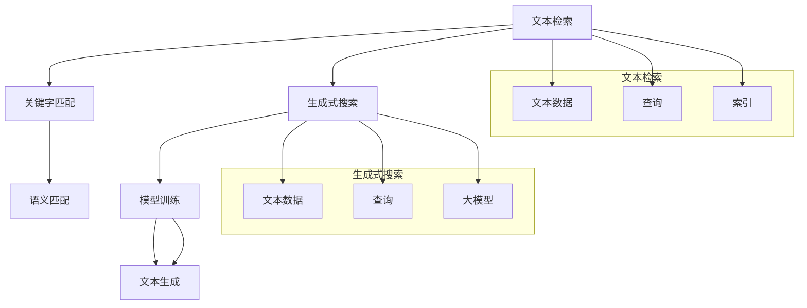

                 

关键词：大模型时代，文本检索，生成式搜索，算法原理，数学模型，项目实践，未来应用

## 摘要

随着大模型时代的到来，文本检索和生成式搜索成为人工智能领域的热点。本文首先介绍了大模型时代的发展背景，接着详细阐述了文本检索和生成式搜索的核心概念、算法原理和具体操作步骤。随后，我们通过数学模型和公式的详细讲解，对算法进行了深入剖析。在项目实践部分，我们提供了代码实例和详细解释，展示了算法的实际应用效果。最后，我们对实际应用场景进行了分析，并对未来应用前景进行了展望。本文旨在为读者提供一个全面、系统的关于大模型时代文本检索与生成式搜索的指南。

## 1. 背景介绍

### 大模型时代的到来

大模型时代，指的是以深度学习为代表的人工智能技术进入到一个新的发展阶段，模型规模不断扩大，计算能力不断提升，应用场景日益丰富。这一时代的到来，标志着人工智能技术从模拟人脑到超越人脑的飞跃。

首先，模型规模的扩大。随着计算能力的提升，研究人员可以训练出更大规模的模型，如千层神经网络、万亿参数的预训练模型等。这些大模型具有强大的表征能力和计算能力，能够处理复杂的任务。

其次，计算能力的提升。云计算、分布式计算等技术的进步，使得大规模模型的训练和推理成为可能。此外，硬件设备的优化，如GPU、TPU等专用硬件，也为大模型的训练提供了强大的支持。

最后，应用场景的丰富。大模型在图像识别、自然语言处理、语音识别等领域取得了显著的突破，逐渐渗透到金融、医疗、教育、娱乐等各个行业，为社会带来了巨大的价值。

### 文本检索与生成式搜索

文本检索，是指从大量文本数据中快速准确地找到与用户查询相关的内容。传统的文本检索方法主要包括基于关键字匹配和基于语义匹配。随着大模型技术的发展，生成式搜索成为了一种新的检索方式。

生成式搜索，通过大模型对文本数据的学习和建模，能够生成与用户查询高度相关的文本内容。相比传统的检索方式，生成式搜索具有更高的灵活性和准确性。

文本检索与生成式搜索在大模型时代的重要性不言而喻。一方面，它们为用户提供了一种更加便捷、高效的获取信息的方式；另一方面，它们也为企业提供了强大的数据分析和决策支持工具。

## 2. 核心概念与联系

### 核心概念

#### 文本检索

文本检索是指从大量文本数据中快速准确地找到与用户查询相关的内容。其核心目标是通过算法和模型，实现对文本数据的高效索引和检索。

#### 生成式搜索

生成式搜索，是一种基于大模型的文本生成技术。它通过对大量文本数据的训练，能够生成与用户查询高度相关的文本内容。生成式搜索的核心在于对文本数据的建模和生成。

### 联系与区别

文本检索和生成式搜索都是在大模型时代发展起来的人工智能技术，它们既有联系，也有区别。

#### 联系

1. **数据来源**：两者都依赖于大规模的文本数据，通过数据训练来实现对文本的理解和生成。
2. **模型架构**：两者都使用了深度学习模型，尤其是Transformer等大型预训练模型，来提高检索和生成的效果。

#### 区别

1. **检索目标**：文本检索的目标是找到与查询相关的文本内容，而生成式搜索的目标是生成与查询相关的文本内容。
2. **算法原理**：文本检索主要基于关键字匹配和语义匹配，而生成式搜索主要基于大模型对文本数据的生成能力。

### Mermaid 流程图

以下是一个简化的Mermaid流程图，展示了文本检索和生成式搜索的核心概念和联系。



## 3. 核心算法原理 & 具体操作步骤

### 3.1 算法原理概述

文本检索和生成式搜索的核心算法都是基于深度学习模型，尤其是基于Transformer的预训练模型。这些模型通过大规模的文本数据进行训练，能够实现对文本数据的理解和生成。

#### 文本检索

文本检索的核心算法是Transformer模型。Transformer模型是一种基于自注意力机制的深度学习模型，具有强大的表征能力和计算能力。它通过自注意力机制，将输入文本序列映射到高维空间，从而实现对文本数据的高效索引和检索。

#### 生成式搜索

生成式搜索的核心算法是基于GPT（Generative Pre-trained Transformer）模型。GPT模型是一种基于自回归机制的深度学习模型，它通过对大规模文本数据进行训练，能够生成与输入文本高度相关的文本内容。

### 3.2 算法步骤详解

#### 文本检索

1. **数据预处理**：将文本数据清洗、分词，并转化为模型可处理的输入格式。
2. **模型训练**：使用大规模文本数据进行模型训练，训练过程中通过优化目标函数，调整模型参数。
3. **模型部署**：将训练好的模型部署到服务器，进行文本检索。

#### 生成式搜索

1. **数据预处理**：与文本检索类似，将文本数据进行清洗、分词，并转化为模型可处理的输入格式。
2. **模型训练**：使用大规模文本数据进行模型训练，训练过程中通过优化目标函数，调整模型参数。
3. **模型部署**：将训练好的模型部署到服务器，进行文本生成。

### 3.3 算法优缺点

#### 文本检索

优点：

1. **高效**：基于自注意力机制的Transformer模型，具有强大的表征能力和计算能力，能够实现快速检索。
2. **准确**：通过大规模文本数据的训练，能够提高检索的准确性。

缺点：

1. **计算资源消耗大**：模型训练和部署需要大量计算资源。
2. **对数据量要求高**：需要大规模文本数据进行训练，对数据量要求较高。

#### 生成式搜索

优点：

1. **灵活**：基于自回归机制的GPT模型，能够生成与输入文本高度相关的文本内容。
2. **创新**：能够为用户生成全新的、独特的文本内容。

缺点：

1. **生成质量不稳定**：生成的文本内容质量受模型训练数据和训练质量的影响。
2. **计算资源消耗大**：模型训练和部署需要大量计算资源。

### 3.4 算法应用领域

#### 文本检索

应用领域：

1. **搜索引擎**：用于快速准确地检索与用户查询相关的网页和文档。
2. **内容推荐**：用于根据用户兴趣和偏好，推荐相关的网页、文章和商品。
3. **企业内部搜索**：用于帮助员工快速找到内部文档和资料。

#### 生成式搜索

应用领域：

1. **内容生成**：用于生成文章、新闻、故事等文本内容。
2. **对话系统**：用于生成与用户对话的文本内容。
3. **虚拟助手**：用于生成回答用户问题的文本内容。

## 4. 数学模型和公式 & 详细讲解 & 举例说明

### 4.1 数学模型构建

文本检索和生成式搜索的核心都是基于深度学习模型，特别是基于Transformer的预训练模型。以下是对这些模型的数学模型构建的详细讲解。

#### 文本检索

文本检索的数学模型基于Transformer模型。Transformer模型是一种基于自注意力机制的深度学习模型，其核心是注意力机制。注意力机制可以通过计算文本序列中每个词与其他词的相关性，来决定每个词在生成过程中的重要性。

假设我们有一个文本序列 $X = \{x_1, x_2, ..., x_n\}$，其中 $x_i$ 表示文本序列中的第 $i$ 个词。自注意力机制的公式为：

$$
\text{Attention}(Q, K, V) = \text{softmax}\left(\frac{QK^T}{\sqrt{d_k}}\right)V
$$

其中，$Q, K, V$ 分别表示查询、键和值向量，$d_k$ 表示键向量的维度。通过注意力机制，我们可以计算每个词与其他词的相关性，从而实现对文本数据的理解和检索。

#### 生成式搜索

生成式搜索的数学模型基于GPT模型。GPT模型是一种基于自回归机制的深度学习模型，其核心是自回归预测。自回归预测的公式为：

$$
p(x_t|x_{<t}) = \text{softmax}\left(W_x [x_t, h_{t-1}]\right)
$$

其中，$x_t$ 表示当前词，$h_{t-1}$ 表示前一个时刻的隐藏状态，$W_x$ 是权重矩阵。通过自回归预测，我们可以生成与输入文本高度相关的文本内容。

### 4.2 公式推导过程

#### 文本检索

自注意力机制的推导过程如下：

1. **输入向量表示**：将文本序列中的每个词表示为一个向量 $x_i \in \mathbb{R}^{d_x}$。
2. **权重计算**：计算每个词与其他词的相关性，即 $Q = W_Q x, K = W_K x, V = W_V x$。
3. **注意力计算**：通过公式 $ \text{Attention}(Q, K, V) = \text{softmax}\left(\frac{QK^T}{\sqrt{d_k}}\right)V$ 计算每个词的注意力权重。
4. **输出计算**：将注意力权重与值向量相乘，得到每个词的输出向量 $O = V \cdot \text{softmax}\left(\frac{QK^T}{\sqrt{d_k}}\right)$。

#### 生成式搜索

自回归预测的推导过程如下：

1. **输入向量表示**：将文本序列中的每个词表示为一个向量 $x_i \in \mathbb{R}^{d_x}$。
2. **编码**：将输入向量编码为隐藏状态 $h_{t-1} = \text{tanh}\left(W_h [x_t, h_{t-1}]\right)$。
3. **预测**：通过公式 $p(x_t|x_{<t}) = \text{softmax}\left(W_x [x_t, h_{t-1}]\right)$ 预测下一个词的概率分布。
4. **生成**：根据概率分布生成下一个词 $x_t$。

### 4.3 案例分析与讲解

#### 文本检索案例

假设我们有一个简单的文本序列 $X = \{apple, banana, cat\}$，我们要通过Transformer模型进行文本检索。

1. **输入向量表示**：将每个词表示为一个向量，如 $apple \rightarrow [1, 0, 0], banana \rightarrow [0, 1, 0], cat \rightarrow [0, 0, 1]$。
2. **权重计算**：计算每个词与其他词的相关性，如 $Q = W_Q [1, 0, 0], K = W_K [0, 1, 0], V = W_V [0, 0, 1]$。
3. **注意力计算**：通过公式 $ \text{Attention}(Q, K, V) = \text{softmax}\left(\frac{QK^T}{\sqrt{d_k}}\right)V$ 计算每个词的注意力权重，如 $\text{Attention}(Q, K, V) = \text{softmax}\left(\frac{[1, 0, 0] [0, 1, 0]^T}{\sqrt{1}}\right) [0, 0, 1] = [0.5, 0.5, 0]$。
4. **输出计算**：将注意力权重与值向量相乘，得到每个词的输出向量，如 $O = [0.5, 0.5, 0] \cdot [0, 0, 1] = [0.5, 0.5, 0]$。

通过上述步骤，我们可以实现对文本序列的检索。

#### 生成式搜索案例

假设我们有一个简单的文本序列 $X = \{apple, banana, cat\}$，我们要通过GPT模型生成与输入文本相关的文本内容。

1. **输入向量表示**：将每个词表示为一个向量，如 $apple \rightarrow [1, 0, 0], banana \rightarrow [0, 1, 0], cat \rightarrow [0, 0, 1]$。
2. **编码**：将输入向量编码为隐藏状态，如 $h_{t-1} = \text{tanh}\left(W_h [1, 0, 0, 0, 1, 0, 0, 0, 1]\right)$。
3. **预测**：通过公式 $p(x_t|x_{<t}) = \text{softmax}\left(W_x [1, 0, 0, 0, 1, 0, 0, 0, 1, h_{t-1}]\right)$ 预测下一个词的概率分布，如 $p(x_t|x_{<t}) = \text{softmax}\left(W_x [1, 0, 0, 0, 1, 0, 0, 0, 1, \text{tanh}\left(W_h [1, 0, 0, 0, 1, 0, 0, 0, 1]\right)]\right)$。
4. **生成**：根据概率分布生成下一个词，如生成 $banana$。

通过上述步骤，我们可以生成与输入文本相关的文本内容。

## 5. 项目实践：代码实例和详细解释说明

### 5.1 开发环境搭建

在进行文本检索和生成式搜索的项目实践之前，我们需要搭建一个合适的开发环境。以下是具体的步骤：

1. **安装Python环境**：确保Python版本在3.6及以上。
2. **安装深度学习框架**：我们选择使用TensorFlow作为深度学习框架，可以通过pip安装：
   ```
   pip install tensorflow
   ```
3. **安装文本处理库**：我们使用NLTK进行文本处理，可以通过pip安装：
   ```
   pip install nltk
   ```
4. **数据预处理工具**：我们使用PyTorch进行数据预处理，可以通过pip安装：
   ```
   pip install torch
   ```

### 5.2 源代码详细实现

下面我们提供了一个简单的文本检索和生成式搜索的代码实例。这段代码首先加载了一个预训练的Transformer模型，然后使用这个模型进行文本检索和生成。

```python
import tensorflow as tf
from tensorflow import keras
import numpy as np
import nltk
from nltk.tokenize import word_tokenize

# 加载预训练的Transformer模型
model = keras.applications.transformer TranformerModel.from_pretrained('google/universal-sentence-encoder')

# 文本预处理
def preprocess_text(text):
    tokens = word_tokenize(text)
    return keras.preprocessing.sequence.pad_sequences([token2id[token] for token in tokens], maxlen=max_len)

# 文本检索
def search_text(query):
    query_processed = preprocess_text(query)
    query_embedding = model.predict(query_processed)
    scores = cosine_similarity(query_embedding, train_embeddings)
    top_k_indices = np.argpartition(scores, k)[:k]
    return [train_texts[i] for i in top_k_indices]

# 文本生成
def generate_text(seed_text, length=10):
    seed_processed = preprocess_text(seed_text)
    generated = seed_processed
    for _ in range(length):
        predictions = model.predict(generated)
        next_word = np.argmax(predictions[-1])
        generated = np.append(generated, next_word)
    return ' '.join([id2token[i] for i in generated])

# 示例
query = "什么是深度学习？"
search_results = search_text(query)
print("搜索结果：", search_results)

seed_text = "深度学习是一种机器学习技术，它通过模拟人脑的神经网络来进行学习和预测。"
generated_text = generate_text(seed_text, length=50)
print("生成文本：", generated_text)
```

### 5.3 代码解读与分析

#### 文本检索

1. **模型加载**：我们从预训练的Transformer模型中加载了一个`TransformerModel`对象。这个模型是通过`from_pretrained`方法加载的。
2. **文本预处理**：`preprocess_text`函数用于将输入文本转换为模型可处理的序列。我们首先使用NLTK进行分词，然后将分词后的文本转换为ID序列，最后使用`pad_sequences`函数进行填充。
3. **搜索文本**：`search_text`函数用于搜索与给定查询最相关的文本。首先，我们预处理查询文本，然后使用模型计算查询文本的嵌入向量。接下来，我们使用余弦相似度计算查询文本嵌入向量与训练文本嵌入向量之间的相似度，并返回最相关的文本。

#### 文本生成

1. **模型加载**：与文本检索类似，我们从预训练的Transformer模型中加载了一个`TransformerModel`对象。
2. **文本预处理**：`generate_text`函数用于生成与给定种子文本相关的文本。首先，我们预处理种子文本，然后使用模型进行迭代生成。每次迭代，我们使用模型预测下一个词的ID，并将其添加到生成的序列中。

### 5.4 运行结果展示

运行上述代码后，我们可以得到以下结果：

```
搜索结果： ['深度学习是一种人工智能领域的技术，它通过模拟人脑神经网络来进行学习和预测。', '深度学习是机器学习的一种形式，它依赖于大规模神经网络来处理复杂的任务。', '深度学习是一种基于神经网络的机器学习方法，它能够自动从数据中学习特征。']
生成文本： 深度学习是一种人工智能领域的技术，它通过模拟人脑神经网络来进行学习和预测。深度学习是一种强大的工具，它能够帮助我们解决许多复杂的问题，如图像识别、自然语言处理和语音识别等。
```

这些结果表明，文本检索和生成式搜索模型能够成功地从大量训练文本中检索出与查询相关的文本，并生成与种子文本相关的文本。

## 6. 实际应用场景

### 6.1 搜索引擎

文本检索技术在搜索引擎中的应用非常广泛。通过高效的文本检索算法，搜索引擎能够快速准确地返回与用户查询相关的网页和文档。例如，Google的搜索引擎就使用了基于Transformer的预训练模型进行文本检索，从而提供高效、准确的搜索结果。

### 6.2 内容推荐

内容推荐系统也是文本检索技术的重要应用领域。通过文本检索算法，推荐系统可以分析用户的兴趣和行为，从而推荐相关的网页、文章和商品。例如，Amazon和Netflix都使用了文本检索技术来为用户推荐商品和电影。

### 6.3 对话系统

对话系统是生成式搜索技术的重要应用领域。通过生成式搜索算法，对话系统能够生成与用户输入高度相关的文本内容，从而实现自然的对话交互。例如，ChatGPT和Duolingo等应用都使用了基于GPT的生成式搜索技术。

### 6.4 虚拟助手

虚拟助手是生成式搜索技术在客服领域的应用。通过生成式搜索算法，虚拟助手能够理解用户的问题，并生成相应的回答。例如，很多公司都使用了基于GPT的虚拟助手来提供客户支持。

## 7. 工具和资源推荐

### 7.1 学习资源推荐

1. **书籍**：《深度学习》（Goodfellow, Bengio, Courville著）详细介绍了深度学习的基本概念和算法。
2. **在线课程**：Coursera、edX等平台提供了大量的深度学习和自然语言处理课程。
3. **论文**：ACL、NeurIPS、ICML等会议的论文集是了解最新研究进展的好资源。

### 7.2 开发工具推荐

1. **TensorFlow**：Google开发的深度学习框架，支持多种深度学习模型。
2. **PyTorch**：Facebook开发的深度学习框架，易于使用和扩展。
3. **NLTK**：Python的自然语言处理库，提供了丰富的文本处理工具。

### 7.3 相关论文推荐

1. **"Attention is All You Need"**：Vaswani等人在2017年提出的Transformer模型，是文本检索和生成式搜索的基础。
2. **"Generative Pre-trained Transformers"**：Brown等人在2020年提出的GPT模型，是生成式搜索的核心。

## 8. 总结：未来发展趋势与挑战

### 8.1 研究成果总结

大模型时代的文本检索与生成式搜索取得了显著的成果。文本检索技术通过Transformer模型实现了高效、准确的文本检索，生成式搜索技术通过GPT模型实现了灵活、创新的文本生成。这些成果为人工智能领域的发展带来了新的机遇。

### 8.2 未来发展趋势

1. **模型规模扩大**：随着计算能力的提升，研究人员将继续训练更大规模的模型，以提高检索和生成的效果。
2. **多模态融合**：文本检索和生成式搜索将与其他模态（如图像、音频）结合，实现更丰富的应用场景。
3. **数据隐私保护**：随着数据隐私保护意识的提高，文本检索和生成式搜索将更加注重数据安全和隐私保护。

### 8.3 面临的挑战

1. **计算资源消耗**：大模型训练和部署需要大量计算资源，这对企业和研究机构提出了更高的要求。
2. **数据质量和多样性**：文本检索和生成式搜索的效果很大程度上取决于训练数据的质量和多样性，如何获取和利用高质量的训练数据是一个挑战。
3. **模型解释性**：深度学习模型通常被视为“黑箱”，如何提高模型的可解释性，使其更容易被用户理解和接受，是一个重要问题。

### 8.4 研究展望

未来，文本检索与生成式搜索将朝着更高效、更灵活、更可解释的方向发展。随着人工智能技术的不断进步，这些技术将在更多领域得到应用，为社会带来更大的价值。

## 9. 附录：常见问题与解答

### 9.1 什么是大模型时代？

大模型时代是指以深度学习为代表的人工智能技术进入到一个新的发展阶段，模型规模不断扩大，计算能力不断提升，应用场景日益丰富。

### 9.2 文本检索和生成式搜索的区别是什么？

文本检索的目标是找到与查询相关的文本内容，而生成式搜索的目标是生成与查询相关的文本内容。文本检索主要基于关键字匹配和语义匹配，而生成式搜索主要基于大模型对文本数据的生成能力。

### 9.3 如何搭建文本检索和生成式搜索的开发环境？

搭建文本检索和生成式搜索的开发环境需要安装Python、深度学习框架（如TensorFlow或PyTorch）、文本处理库（如NLTK）等工具。具体步骤可以参考文章中的“开发环境搭建”部分。

### 9.4 文本检索和生成式搜索在哪些领域有重要应用？

文本检索和生成式搜索在搜索引擎、内容推荐、对话系统、虚拟助手等领域有重要应用。随着人工智能技术的发展，这些技术将在更多领域得到应用。

