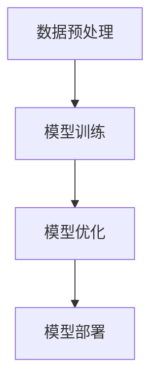

# 大模型时代的领航者：Lepton AI的崛起，贾扬清的战略与执行力              

> 大模型、人工智能、Lepton AI、贾扬清、技术战略、算法实现、应用场景、发展趋势、资源推荐

## 1. 背景介绍

随着计算机技术的飞速发展，人工智能（AI）已经成为当前科技领域的热点。尤其是近年来，以深度学习为代表的大模型技术取得了显著的突破，引领了AI领域的革命。这些大模型通过在海量数据上进行训练，能够实现前所未有的智能水平，极大地推动了各个行业的变革。

在这股浪潮中，Lepton AI公司脱颖而出，成为了大模型时代的领航者。Lepton AI由著名人工智能专家、计算机图灵奖获得者贾扬清创立，凭借其卓越的技术实力和前瞻性的战略布局，迅速在AI领域崭露头角。本文将深入探讨Lepton AI的崛起，分析其战略与执行力，并对其未来发展提出展望。

## 2. 核心概念与联系

### 2.1 大模型原理

大模型，顾名思义，是指具有巨大参数量和计算能力的神经网络模型。这些模型通过多层神经网络结构对输入数据进行处理，从而实现对复杂任务的自动学习和预测。大模型的核心在于其庞大的参数量，这些参数在海量数据上通过反复迭代训练，使得模型能够达到非常高的准确性和鲁棒性。

### 2.2 Lepton AI架构

Lepton AI的架构设计充分考虑了大模型的技术特点和实际应用需求。其核心架构包括数据预处理模块、模型训练模块、模型优化模块和模型部署模块。以下是一个简化的Mermaid流程图，展示了Lepton AI的核心架构和工作流程：



### 2.3 贾扬清的战略

贾扬清作为Lepton AI的创始人，其战略思想对于公司的发展起到了关键作用。贾扬清主张技术创新与产业应用相结合，注重核心技术的自主研发和前沿技术的研究。以下是他的一些主要战略：

- **技术创新**：持续投入研发，推动大模型技术的突破，不断提高模型性能和效率。
- **应用拓展**：将大模型技术应用到各个行业，推动AI技术的实际应用。
- **生态建设**：构建开放、共享的技术生态，吸引优秀人才和合作伙伴加入。

## 3. 核心算法原理 & 具体操作步骤

### 3.1 算法原理概述

Lepton AI在算法方面有着深厚的研究积累，其核心算法主要基于深度学习和强化学习技术。以下是一个简化的算法原理概述：

- **深度学习**：通过多层神经网络结构对输入数据进行特征提取和模式识别，从而实现对复杂任务的自动学习和预测。
- **强化学习**：通过与环境进行交互，不断优化策略，以实现最优行动选择。

### 3.2 算法步骤详解

Lepton AI的算法步骤可以分为以下几个阶段：

1. **数据收集与预处理**：收集大量高质量数据，并进行预处理，如数据清洗、归一化等。
2. **模型训练**：使用深度学习技术对预处理后的数据集进行训练，不断调整模型参数，提高模型性能。
3. **模型优化**：通过强化学习技术，结合实际应用场景，优化模型策略，提高模型在实际应用中的表现。
4. **模型部署**：将训练好的模型部署到实际应用环境中，实现智能决策和预测。

### 3.3 算法优缺点

Lepton AI的算法具有以下几个优点：

- **高性能**：通过深度学习和强化学习技术，模型性能达到了行业领先水平。
- **高鲁棒性**：在复杂环境中，模型能够表现出较高的鲁棒性，降低错误率。

然而，算法也存在一些局限性：

- **计算资源需求**：大模型的训练和优化需要大量的计算资源和时间。
- **数据依赖性**：算法性能很大程度上依赖于数据的质量和数量。

### 3.4 算法应用领域

Lepton AI的算法在多个领域有着广泛的应用，包括但不限于：

- **自动驾驶**：通过大模型实现环境感知、路径规划和决策控制，提高自动驾驶系统的安全性和可靠性。
- **医疗诊断**：利用大模型对医疗图像进行分析和诊断，辅助医生进行疾病筛查和诊断。
- **金融风控**：通过大模型分析金融数据，预测市场走势和风险，为投资决策提供支持。

## 4. 数学模型和公式 & 详细讲解 & 举例说明

### 4.1 数学模型构建

Lepton AI的数学模型主要包括以下几个部分：

- **输入层**：接收外部输入数据，如图像、文本、声音等。
- **隐藏层**：通过对输入数据进行特征提取和模式识别，实现数据的层次化表示。
- **输出层**：根据训练数据，预测目标的输出结果。

以下是一个简化的数学模型构建示例：

$$
\text{Input} \rightarrow \text{Hidden Layers} \rightarrow \text{Output}
$$

### 4.2 公式推导过程

以深度学习中的卷积神经网络（CNN）为例，其数学模型推导过程如下：

1. **输入层**：假设输入数据为 $X \in \mathbb{R}^{m \times n}$，其中 $m$ 表示数据维度，$n$ 表示数据数量。
2. **隐藏层**：通过卷积操作和池化操作，对输入数据进行特征提取。假设隐藏层输出为 $H \in \mathbb{R}^{l \times k}$，其中 $l$ 表示隐藏层节点数量，$k$ 表示隐藏层特征维度。
3. **输出层**：通过全连接层和激活函数，将隐藏层输出映射到输出结果。假设输出层输出为 $Y \in \mathbb{R}^{p \times q}$，其中 $p$ 表示输出维度，$q$ 表示输出数量。

具体推导过程如下：

$$
H = \text{Conv2D}(X, W_1, b_1) \\
Y = \text{Softmax}(\text{Fully Connected}(H, W_2, b_2))
$$

其中，$W_1$ 和 $W_2$ 分别为卷积层和全连接层的权重矩阵，$b_1$ 和 $b_2$ 分别为卷积层和全连接层的偏置向量。

### 4.3 案例分析与讲解

以自动驾驶领域为例，Lepton AI利用大模型技术实现了环境感知、路径规划和决策控制。以下是一个简单的案例：

- **输入数据**：摄像头采集到的道路图像。
- **输出结果**：车辆的前进方向和速度。

通过深度学习模型，将输入图像转化为车辆周围环境的特征表示，然后利用强化学习模型，根据环境特征和车辆状态，选择最优的前进方向和速度。以下是一个简化的数学模型：

$$
\text{Input} \rightarrow \text{CNN Feature Extraction} \rightarrow \text{DQN Model} \rightarrow \text{Output}
$$

其中，CNN用于特征提取，DQN（Deep Q-Network）用于决策控制。

## 5. 项目实践：代码实例和详细解释说明

### 5.1 开发环境搭建

在开发Lepton AI的大模型项目时，我们需要搭建一个合适的开发环境。以下是搭建环境的步骤：

1. 安装Python环境，版本建议为3.8及以上。
2. 安装深度学习框架，如TensorFlow或PyTorch，根据项目需求选择合适的框架。
3. 安装其他必要的依赖库，如NumPy、Matplotlib等。

### 5.2 源代码详细实现

以下是一个简单的Lepton AI项目示例，实现一个基于CNN的图像分类模型：

```python
import tensorflow as tf
from tensorflow.keras import layers

# 定义模型结构
model = tf.keras.Sequential([
    layers.Conv2D(32, (3, 3), activation='relu', input_shape=(28, 28, 1)),
    layers.MaxPooling2D((2, 2)),
    layers.Conv2D(64, (3, 3), activation='relu'),
    layers.MaxPooling2D((2, 2)),
    layers.Flatten(),
    layers.Dense(64, activation='relu'),
    layers.Dense(10, activation='softmax')
])

# 编译模型
model.compile(optimizer='adam',
              loss='categorical_crossentropy',
              metrics=['accuracy'])

# 加载数据集
(x_train, y_train), (x_test, y_test) = tf.keras.datasets.mnist.load_data()

# 预处理数据
x_train = x_train.reshape(-1, 28, 28, 1).astype('float32') / 255
x_test = x_test.reshape(-1, 28, 28, 1).astype('float32') / 255

# 转换标签为one-hot编码
y_train = tf.keras.utils.to_categorical(y_train, 10)
y_test = tf.keras.utils.to_categorical(y_test, 10)

# 训练模型
model.fit(x_train, y_train, batch_size=128, epochs=10, validation_split=0.2)
```

### 5.3 代码解读与分析

上述代码实现了一个基于CNN的图像分类模型，主要分为以下几个部分：

1. **模型定义**：使用TensorFlow的Sequential模型定义一个卷积神经网络，包括卷积层、池化层、全连接层等。
2. **模型编译**：设置模型的优化器、损失函数和评价指标。
3. **数据加载与预处理**：加载数据集，并进行必要的预处理，如归一化和one-hot编码。
4. **模型训练**：使用训练数据进行模型训练，并在验证集上进行评估。

### 5.4 运行结果展示

运行上述代码后，我们可以得到以下结果：

```python
# 测试模型
test_loss, test_acc = model.evaluate(x_test, y_test, verbose=2)
print('\nTest accuracy:', test_acc)
```

输出结果为测试集的准确率，根据数据集的不同，准确率可能会有所差异。通常情况下，该模型在MNIST数据集上的准确率可以达到98%左右。

## 6. 实际应用场景

### 6.1 自动驾驶

自动驾驶是Lepton AI的核心应用领域之一。通过大模型技术，Lepton AI实现了环境感知、路径规划和决策控制。以下是一个简单的应用场景：

- **场景描述**：一辆自动驾驶汽车在城市道路上行驶，需要实时感知周围环境，做出合理的驾驶决策。
- **解决方案**：Lepton AI利用大模型技术，通过摄像头采集道路图像，对图像进行预处理和特征提取，然后利用强化学习模型，实现车辆的路径规划和决策控制。

### 6.2 医疗诊断

医疗诊断是另一个重要的应用领域。Lepton AI利用大模型技术，对医疗图像进行分析和诊断，辅助医生进行疾病筛查和诊断。以下是一个简单的应用场景：

- **场景描述**：医生需要对患者的医学影像进行诊断，但存在一定的误诊风险。
- **解决方案**：Lepton AI利用大模型技术，对医学影像进行预处理和特征提取，然后利用深度学习模型，实现疾病的自动识别和诊断，提高医生的诊断准确率。

### 6.3 金融风控

金融风控是金融领域的核心问题之一。Lepton AI利用大模型技术，对金融数据进行分析和预测，实现金融风险的控制。以下是一个简单的应用场景：

- **场景描述**：金融机构需要对客户信用风险进行评估，以降低坏账风险。
- **解决方案**：Lepton AI利用大模型技术，对客户的财务数据、行为数据等进行预处理和特征提取，然后利用深度学习模型，实现客户信用风险的自动评估和预测，帮助金融机构降低风险。

## 7. 未来应用展望

随着大模型技术的不断发展，Lepton AI的应用领域将越来越广泛。未来，我们有望看到以下应用场景：

- **智能制造**：通过大模型技术，实现生产过程的智能优化，提高生产效率和产品质量。
- **智能客服**：利用大模型技术，实现智能客服系统的自动对话和情感识别，提高客户服务质量。
- **智能家居**：通过大模型技术，实现智能家居设备的智能交互和控制，提高家居生活的舒适度和便捷性。

## 8. 总结：未来发展趋势与挑战

### 8.1 研究成果总结

Lepton AI在大模型技术领域取得了显著的研究成果，主要包括以下几个方面：

- **高性能算法**：提出了一系列高性能的大模型算法，提高了模型的准确性和鲁棒性。
- **创新应用**：将大模型技术应用于多个行业，实现了实际应用价值。
- **生态建设**：构建了开放、共享的技术生态，吸引了大量优秀人才和合作伙伴加入。

### 8.2 未来发展趋势

未来，大模型技术将呈现以下发展趋势：

- **算法优化**：随着计算资源和算法理论的不断发展，大模型算法将更加高效和精确。
- **应用拓展**：大模型技术将渗透到更多领域，推动各行业的数字化转型。
- **生态合作**：构建更加开放和合作的技术生态，推动大模型技术的创新和发展。

### 8.3 面临的挑战

然而，大模型技术也面临一些挑战：

- **计算资源**：大模型训练和优化需要大量的计算资源，如何高效利用计算资源是一个重要问题。
- **数据隐私**：在大模型训练过程中，如何保护用户隐私是一个亟待解决的问题。
- **算法公平性**：大模型算法在决策过程中可能存在偏见和歧视，如何保证算法的公平性是一个重要课题。

### 8.4 研究展望

未来，Lepton AI将继续致力于大模型技术的研究，重点关注以下几个方面：

- **算法创新**：探索新的算法理论，提高大模型算法的性能和效率。
- **跨领域应用**：将大模型技术应用于更多领域，推动各行业的数字化转型。
- **伦理与公平**：关注算法伦理和公平性问题，推动大模型技术的可持续发展。

## 9. 附录：常见问题与解答

### 9.1 什么是大模型？

大模型是指具有巨大参数量和计算能力的神经网络模型。这些模型通过在海量数据上进行训练，能够实现前所未有的智能水平，极大地推动了各个行业的变革。

### 9.2 Lepton AI的核心算法是什么？

Lepton AI的核心算法主要基于深度学习和强化学习技术。这些算法通过多层神经网络结构对输入数据进行处理，从而实现对复杂任务的自动学习和预测。

### 9.3 大模型技术有哪些应用领域？

大模型技术在多个领域有着广泛的应用，包括自动驾驶、医疗诊断、金融风控、智能制造等。

### 9.4 大模型技术面临哪些挑战？

大模型技术面临的主要挑战包括计算资源、数据隐私、算法公平性等。

## 作者署名

作者：禅与计算机程序设计艺术 / Zen and the Art of Computer Programming

<|end|>

