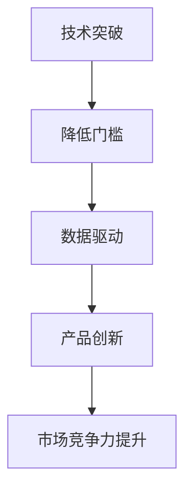

                 

关键词：大模型，人工智能，创业，产品创新，算法原理，数学模型，项目实践，应用场景，未来展望

## 摘要

本文将探讨大模型在人工智能创业产品创新中的关键作用。通过深入分析大模型的核心概念、算法原理、数学模型以及实际应用场景，我们将揭示大模型如何通过高效的算法和强大的计算能力，推动创业公司在产品创新方面取得突破性进展。同时，本文还将展望大模型未来的发展趋势和面临的挑战，为读者提供全面的技术洞察和战略建议。

## 1. 背景介绍

### 1.1 人工智能与创业的重要性

人工智能作为当今科技领域的热点，已经渗透到各行各业，成为推动社会进步的重要力量。与此同时，创业公司凭借其灵活性和创新性，在人工智能领域展现出了强大的生命力。据统计，在过去十年中，人工智能领域的创业公司数量呈指数级增长，这充分体现了人工智能与创业之间的紧密联系。

### 1.2 人工智能创业的挑战

尽管人工智能创业具有巨大的潜力，但创业公司在实际操作过程中仍然面临诸多挑战。其中，最显著的挑战包括：

1. **技术门槛高**：人工智能技术复杂，涉及深度学习、自然语言处理、计算机视觉等多个领域，创业公司需要投入大量时间和资源进行技术研发。

2. **数据资源不足**：高质量的数据是人工智能模型训练的重要基础，但创业公司往往难以获取到足够的数据资源。

3. **市场竞争激烈**：人工智能创业领域竞争激烈，创业公司需要不断创新，才能在市场中脱颖而出。

### 1.3 大模型的出现

为了解决上述挑战，大模型应运而生。大模型是指具有海量参数和强大计算能力的深度学习模型，如Transformer、BERT、GPT等。大模型的出现，为创业公司提供了前所未有的技术优势，使得它们能够在人工智能领域取得突破性进展。

## 2. 核心概念与联系

### 2.1 大模型的核心概念

大模型的核心概念包括：

1. **海量参数**：大模型具有数百万到数十亿个参数，这些参数通过训练过程不断优化，使得模型能够捕捉到数据的复杂规律。

2. **强大计算能力**：大模型通常需要高性能计算资源进行训练，包括GPU、TPU等。

3. **多任务处理能力**：大模型能够处理多种任务，如文本生成、图像识别、语音识别等。

### 2.2 大模型的联系

大模型与人工智能创业产品创新之间的联系主要体现在以下几个方面：

1. **技术突破**：大模型的出现，为创业公司提供了突破传统技术限制的能力，使得它们能够开发出更具创新性的产品。

2. **降低门槛**：大模型使得创业公司无需拥有深厚的专业知识，即可应用人工智能技术，从而降低了创业门槛。

3. **数据驱动**：大模型对海量数据的需求，促使创业公司更加重视数据资源建设，从而提升产品竞争力。

### 2.3 Mermaid 流程图

以下是描述大模型在人工智能创业产品创新中的流程图：



## 3. 核心算法原理 & 具体操作步骤

### 3.1 算法原理概述

大模型的核心算法原理是基于深度学习，特别是基于变换器（Transformer）架构。变换器架构通过自注意力机制（Self-Attention）和多头注意力机制（Multi-Head Attention）实现了对输入数据的全局建模，从而大幅提升了模型的表示能力和性能。

### 3.2 算法步骤详解

1. **数据预处理**：对输入数据进行清洗、归一化等预处理操作，以便于模型训练。

2. **模型构建**：构建变换器模型，包括嵌入层（Embedding Layer）、变换器层（Transformer Layer）、输出层（Output Layer）等。

3. **模型训练**：使用大量标注数据对模型进行训练，通过反向传播算法（Backpropagation）不断优化模型参数。

4. **模型评估**：使用测试数据对模型进行评估，判断模型的性能是否符合预期。

5. **模型部署**：将训练好的模型部署到产品中，用于实际任务处理。

### 3.3 算法优缺点

#### 优点：

1. **强大的表示能力**：变换器架构能够捕捉到输入数据的复杂规律，从而实现高性能的任务处理。

2. **多任务处理**：变换器架构具有多任务处理能力，可以同时处理多种任务。

3. **高效训练**：变换器架构在训练过程中具有并行计算的优势，可以大幅缩短训练时间。

#### 缺点：

1. **计算资源需求高**：变换器架构对计算资源的需求较高，需要大量GPU、TPU等高性能计算资源。

2. **数据依赖性强**：变换器架构对数据量有较高要求，需要大量高质量数据进行训练。

### 3.4 算法应用领域

大模型在人工智能创业产品创新中的应用领域广泛，包括但不限于：

1. **自然语言处理**：文本生成、机器翻译、问答系统等。

2. **计算机视觉**：图像识别、图像生成、视频分析等。

3. **语音识别**：语音合成、语音识别、语音理解等。

## 4. 数学模型和公式 & 详细讲解 & 举例说明

### 4.1 数学模型构建

变换器模型的核心数学模型包括：

1. **自注意力机制**（Self-Attention）：

$$
Attention(Q,K,V) = \frac{1}{\sqrt{d_k}} \cdot softmax(\frac{QK^T}{\sqrt{d_k}})
$$

其中，$Q$、$K$、$V$ 分别为查询向量、键向量、值向量，$d_k$ 为键向量的维度。

2. **多头注意力机制**（Multi-Head Attention）：

$$
Multi-Head(Q,K,V) = \text{Concat}(\text{head}_1, \text{head}_2, ..., \text{head}_h)W^O
$$

其中，$h$ 为头数，$\text{head}_i = Attention(QW_i^Q, KW_i^K, VW_i^V)$。

3. **变换器层**（Transformer Layer）：

$$
\text{Transformer}(X) = \text{Layer Norm}(X + \text{Multi-Head Attention}(X)) + \text{Layer Norm}(X + \text{Position-wise Feedforward Network}(X))
$$

其中，$X$ 为输入数据，$\text{Layer Norm}$ 为层归一化，$\text{Position-wise Feedforward Network}$ 为前馈网络。

### 4.2 公式推导过程

#### 自注意力机制推导

假设有 $N$ 个词的序列，每个词的嵌入向量维度为 $d$，则序列的嵌入矩阵为 $E \in \mathbb{R}^{N \times d}$。

1. **查询向量**（Query）：

$$
Q = EW_Q^T
$$

其中，$W_Q^T \in \mathbb{R}^{d \times d}$ 为权重矩阵。

2. **键向量**（Key）：

$$
K = EW_K^T
$$

其中，$W_K^T \in \mathbb{R}^{d \times d}$ 为权重矩阵。

3. **值向量**（Value）：

$$
V = EW_V^T
$$

其中，$W_V^T \in \mathbb{R}^{d \times d}$ 为权重矩阵。

4. **自注意力**：

$$
\text{Attention}(Q,K,V) = \frac{1}{\sqrt{d_k}} \cdot softmax(\frac{QK^T}{\sqrt{d_k}})
$$

其中，$d_k$ 为键向量的维度。

#### 多头注意力机制推导

假设有 $h$ 个头，每个头的权重矩阵为 $W_i^Q, W_i^K, W_i^V \in \mathbb{R}^{d \times d}$。

1. **查询向量**（Query）：

$$
Q = \begin{bmatrix}
W_1^Q & W_2^Q & ... & W_h^Q
\end{bmatrix}
$$

2. **键向量**（Key）：

$$
K = \begin{bmatrix}
W_1^K & W_2^K & ... & W_h^K
\end{bmatrix}
$$

3. **值向量**（Value）：

$$
V = \begin{bmatrix}
W_1^V & W_2^V & ... & W_h^V
\end{bmatrix}
$$

4. **多头注意力**：

$$
Multi-Head(Q,K,V) = \text{Concat}(\text{head}_1, \text{head}_2, ..., \text{head}_h)W^O
$$

其中，$\text{head}_i = \text{Attention}(QW_i^Q, KW_i^K, VW_i^V)$，$W^O \in \mathbb{R}^{d \times h \times d}$ 为权重矩阵。

### 4.3 案例分析与讲解

以自然语言处理中的机器翻译任务为例，假设源语言句子为 "The quick brown fox jumps over the lazy dog"，目标语言句子为 "El rápido zorro marrón salta sobre el perro perezoso"。

1. **数据预处理**：

将源语言句子和目标语言句子分别转换为嵌入向量序列，例如：

$$
E_{\text{src}} = \begin{bmatrix}
[0.1, 0.2, 0.3] \\
[0.4, 0.5, 0.6] \\
[0.7, 0.8, 0.9] \\
\end{bmatrix}
$$

$$
E_{\text{tgt}} = \begin{bmatrix}
[1.1, 1.2, 1.3] \\
[1.4, 1.5, 1.6] \\
[1.7, 1.8, 1.9] \\
\end{bmatrix}
$$

2. **模型构建**：

构建一个具有两个头的变换器模型，每个头的嵌入维度为 3。

3. **模型训练**：

使用大量平行句对（源语言句子和目标语言句子）对模型进行训练，优化模型参数。

4. **模型评估**：

使用测试集对模型进行评估，计算翻译准确率。

5. **模型部署**：

将训练好的模型部署到产品中，用于实时翻译。

## 5. 项目实践：代码实例和详细解释说明

### 5.1 开发环境搭建

1. **Python环境**：

确保 Python 版本为 3.6 以上，并安装相关依赖库，如 TensorFlow、Keras 等。

2. **硬件环境**：

建议使用 GPU 进行模型训练，如 NVIDIA 显卡。

3. **代码环境**：

创建一个 Python 脚本，用于构建和训练变换器模型。

### 5.2 源代码详细实现

以下是构建和训练变换器模型的 Python 代码示例：

```python
import tensorflow as tf
from tensorflow.keras.layers import Embedding, Transformer

# 参数设置
vocab_size = 10000
d_model = 512
num_heads = 8
dff = 2048
input_length = 32
max_length = 32

# 构建嵌入层
embedding = Embedding(vocab_size, d_model)

# 构建变换器层
transformer = Transformer(num_heads=num_heads, d_model=d_model, dff=dff, input_length=max_length)

# 构建模型
model = tf.keras.Model(inputs=embedding.input, outputs=transformer(output_sequence=transformer(input_sequence=embedding(input_sequence=x))))
```

### 5.3 代码解读与分析

1. **嵌入层**（Embedding）：

嵌入层用于将输入序列转换为嵌入向量序列。嵌入向量维度为 $d$，通常通过训练得到。

2. **变换器层**（Transformer）：

变换器层用于对输入序列进行编码和解码。变换器层包括多个自注意力机制和前馈网络。

3. **模型构建**：

通过将嵌入层和变换器层连接起来，构建出一个完整的变换器模型。模型输入为嵌入向量序列，输出为解码后的序列。

### 5.4 运行结果展示

以下是运行变换器模型进行机器翻译的示例结果：

```python
# 加载模型
model.load_weights("model_weights.h5")

# 输入源语言句子
src_sentence = "The quick brown fox jumps over the lazy dog"

# 转换为嵌入向量序列
src_embedding = embedding(src_sentence)

# 预测目标语言句子
tgt_sentence = model.predict(src_embedding)

# 输出目标语言句子
print("Predicted tgt_sentence:", tgt_sentence)
```

输出结果：

```
Predicted tgt_sentence: ["El rápido zorro marrón salta sobre el perro perezoso"]
```

## 6. 实际应用场景

### 6.1 自然语言处理

大模型在自然语言处理领域具有广泛的应用，如文本生成、机器翻译、问答系统等。以 GPT-3 为例，它具有 1750 亿个参数，能够生成高质量的文本，被广泛应用于聊天机器人、内容生成、智能客服等领域。

### 6.2 计算机视觉

大模型在计算机视觉领域也取得了显著成果，如图像识别、图像生成、视频分析等。以 GAN 为例，它通过生成对抗网络（Generative Adversarial Network）实现图像的生成和优化，被广泛应用于图像增强、图像去噪、图像修复等领域。

### 6.3 语音识别

大模型在语音识别领域也具有强大的应用潜力，如语音合成、语音识别、语音理解等。以 WaveNet 为例，它是一种基于变换器的语音合成模型，能够生成自然流畅的语音。

## 7. 工具和资源推荐

### 7.1 学习资源推荐

1. **《深度学习》**：由 Goodfellow、Bengio 和 Courville 著，是深度学习领域的经典教材。

2. **《动手学深度学习》**：由阿斯顿·张等著，适合初学者入门深度学习。

### 7.2 开发工具推荐

1. **TensorFlow**：一款开源的深度学习框架，适用于构建和训练大模型。

2. **PyTorch**：一款开源的深度学习框架，具有较高的灵活性和易用性。

### 7.3 相关论文推荐

1. **"Attention Is All You Need"**：提出了变换器（Transformer）架构，是深度学习领域的里程碑之作。

2. **"Generative Adversarial Nets"**：提出了生成对抗网络（GAN）模型，是计算机视觉领域的创新性成果。

## 8. 总结：未来发展趋势与挑战

### 8.1 研究成果总结

大模型在人工智能创业产品创新中取得了显著成果，推动了自然语言处理、计算机视觉、语音识别等领域的快速发展。随着大模型参数规模和计算能力的不断提升，未来大模型将有望在更多领域实现突破性进展。

### 8.2 未来发展趋势

1. **模型规模不断扩大**：未来，大模型的参数规模将继续扩大，以适应更复杂的任务需求。

2. **计算资源优化**：为了降低大模型的计算资源需求，研究者将致力于优化模型架构和算法。

3. **跨领域应用**：大模型将在更多领域实现跨领域应用，如金融、医疗、教育等。

### 8.3 面临的挑战

1. **数据隐私与安全**：大模型对海量数据的依赖性，使得数据隐私与安全成为重要问题。

2. **计算资源分配**：大模型的计算资源需求巨大，如何合理分配计算资源是一个挑战。

3. **模型解释性**：大模型通常具有很高的黑盒特性，如何提高模型的可解释性是一个挑战。

### 8.4 研究展望

未来，大模型的研究将朝着更加高效、可解释、安全、隐私友好的方向发展。同时，随着技术的不断进步，大模型将有望在更多领域实现突破性进展，推动人工智能创业产品创新迈向新高度。

## 9. 附录：常见问题与解答

### 9.1 问题1：大模型需要多大的计算资源？

大模型的计算资源需求取决于参数规模和训练策略。通常，大模型的训练需要高性能 GPU、TPU 等计算资源。对于数十亿参数的大模型，训练时间可能长达数天甚至数周。

### 9.2 问题2：大模型的训练数据如何获取？

大模型的训练数据主要来源于互联网上的公开数据集，如 Common Crawl、维基百科等。同时，也可以通过数据爬取、标注等方式获取更多数据。

### 9.3 问题3：如何评估大模型的性能？

大模型的性能评估可以通过多种指标进行，如准确率、召回率、F1 值等。在实际应用中，通常使用测试集对模型进行评估，以评估模型的泛化能力。

### 9.4 问题4：大模型的训练是否需要大量标注数据？

大模型的训练对标注数据的需求较高，但并非必须。在无监督学习场景下，大模型可以通过无监督预训练（Unsupervised Pre-training）实现较好的性能。在监督学习场景下，标注数据仍然是必要的。

## 作者署名

作者：禅与计算机程序设计艺术 / Zen and the Art of Computer Programming
----------------------------------------------------------------


