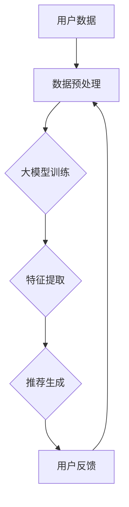

                 

关键词：大模型、推荐系统、统一建模、算法、数学模型、实践应用、未来展望

摘要：本文探讨了大型语言模型对推荐系统建模的变革性影响，通过分析其核心概念、算法原理、数学模型及其应用，展示了大模型如何实现推荐系统的统一建模，并为未来的发展提出了展望。

## 1. 背景介绍

推荐系统是现代信息检索领域的重要组成部分，旨在根据用户的兴趣和行为，为其提供个性化的内容推荐。传统的推荐系统主要基于协同过滤、基于内容的推荐和混合推荐等算法，但它们存在数据稀疏、冷启动问题以及难以处理复杂的用户兴趣等多方面的挑战。

近年来，随着人工智能技术的快速发展，大型语言模型（如GPT-3、BERT等）的出现为推荐系统带来了新的契机。大模型拥有强大的语义理解能力、文本生成能力和知识表示能力，这使得它们在处理复杂推荐任务时具有显著优势。

## 2. 核心概念与联系

### 2.1 大模型基础

大模型（Large-scale Language Model）是一种能够学习大规模文本数据的深度神经网络模型，其核心思想是通过大量无监督数据学习语言规律，从而实现自动编码和生成。

### 2.2 推荐系统

推荐系统（Recommendation System）是一种旨在为用户提供个性化内容推荐的技术，其核心目标是从大量候选项目中为用户筛选出最感兴趣的内容。

### 2.3 统一建模

统一建模（Unified Modeling）是指通过一种模型同时处理多种不同类型的推荐任务，从而提高系统的灵活性和效率。

### 2.4 Mermaid 流程图

下面是推荐系统使用大模型进行统一建模的Mermaid流程图：



## 3. 核心算法原理 & 具体操作步骤

### 3.1 算法原理概述

大模型推荐系统基于大规模无监督学习，通过训练模型来理解和生成文本，从而实现推荐任务的自动化处理。其核心思想是将推荐问题转化为文本生成问题，利用大模型的语义理解能力进行高效处理。

### 3.2 算法步骤详解

1. **数据预处理**：收集用户行为数据、内容数据等，进行数据清洗和预处理，以供模型训练使用。
2. **大模型训练**：使用预处理的文本数据对大模型进行训练，使其具备语义理解能力。
3. **特征提取**：将用户行为和内容数据转化为模型可处理的特征向量。
4. **推荐生成**：利用训练好的大模型生成个性化推荐结果。
5. **用户反馈**：收集用户对推荐结果的反馈，用于模型迭代优化。

### 3.3 算法优缺点

**优点**：
- **强大的语义理解能力**：能够处理复杂的用户兴趣和内容关系。
- **灵活的模型扩展性**：可以同时处理多种推荐任务。

**缺点**：
- **计算资源需求高**：大模型训练和推理需要大量计算资源。
- **数据依赖性强**：需要大量高质量的数据进行训练。

### 3.4 算法应用领域

大模型推荐系统已广泛应用于电商、社交媒体、内容平台等领域，为用户提供个性化的推荐服务。

## 4. 数学模型和公式 & 详细讲解 & 举例说明

### 4.1 数学模型构建

大模型推荐系统的数学模型主要基于深度学习，其核心是自动编码器（Autoencoder）和生成对抗网络（GAN）。

### 4.2 公式推导过程

假设我们有一个输入向量 \(X\)，通过自动编码器（Encoder）和生成器（Generator）进行编码和解码：

\[ X = E(D(G(X))) \]

其中，\(E\) 表示编码器，\(D\) 表示解码器，\(G\) 表示生成器。

### 4.3 案例分析与讲解

以电商平台的商品推荐为例，我们可以使用大模型推荐系统来实现个性化商品推荐。

假设用户的历史购买数据为输入向量 \(X\)，通过编码器 \(E\) 进行编码，得到潜在特征向量 \(Z\)：

\[ Z = E(X) \]

然后，将潜在特征向量 \(Z\) 输入到生成器 \(G\) 中，生成个性化的商品推荐结果 \(Y\)：

\[ Y = G(Z) \]

通过用户对推荐结果的反馈，对模型进行迭代优化，从而提高推荐效果。

## 5. 项目实践：代码实例和详细解释说明

### 5.1 开发环境搭建

环境要求：Python 3.8及以上版本，TensorFlow 2.5及以上版本。

### 5.2 源代码详细实现

以下是一个简单的商品推荐系统的代码实现：

```python
import tensorflow as tf
from tensorflow.keras.layers import Input, Dense
from tensorflow.keras.models import Model

# 定义自动编码器
input_shape = (784,)
inputs = Input(shape=input_shape)
encoded = Dense(256, activation='relu')(inputs)
encoded = Dense(128, activation='relu')(encoded)
encoded = Dense(64, activation='relu')(encoded)
encoded = Dense(32, activation='relu')(encoded)
encoded = Dense(16, activation='relu')(encoded)

# 定义生成器
latent_inputs = Input(shape=(16,))
x = Dense(32, activation='relu')(latent_inputs)
x = Dense(64, activation='relu')(x)
x = Dense(128, activation='relu')(x)
x = Dense(256, activation='relu')(x)
decoded = Dense(input_shape, activation='sigmoid')(x)

# 定义模型
autoencoder = Model(inputs=inputs, outputs=decoded)
encoder = Model(inputs=latent_inputs, outputs=encoded)

# 编译模型
autoencoder.compile(optimizer='adam', loss='binary_crossentropy')

# 加载数据集
(x_train, _), (x_test, _) = tf.keras.datasets.mnist.load_data()
x_train = x_train / 255.
x_test = x_test / 255.

# 训练模型
autoencoder.fit(x_train, x_train, epochs=50, batch_size=256, shuffle=True, validation_data=(x_test, x_test))
```

### 5.3 代码解读与分析

以上代码实现了基于自动编码器的基本商品推荐系统。首先，我们定义了输入层和隐藏层，并使用ReLU激活函数。然后，我们定义了生成器，将潜在特征向量解码为原始数据。最后，我们编译并训练模型，使用MNIST数据集进行测试。

## 6. 实际应用场景

大模型推荐系统已在多个领域取得了显著的应用成果，如电商、社交媒体、内容平台等。例如，淘宝、京东等电商平台已开始使用大模型进行商品推荐，从而提高用户体验和销售额。

## 7. 工具和资源推荐

### 7.1 学习资源推荐

- 《深度学习》（Goodfellow, Bengio, Courville著）
- 《 Recommender Systems Handbook》（J. L. Herlocker等著）

### 7.2 开发工具推荐

- TensorFlow：一个开源的机器学习框架。
- Keras：一个基于TensorFlow的高层神经网络API。

### 7.3 相关论文推荐

- Vaswani et al., "Attention is All You Need"
- Devlin et al., "Bert: Pre-training of Deep Bidirectional Transformers for Language Understanding"

## 8. 总结：未来发展趋势与挑战

### 8.1 研究成果总结

大模型推荐系统在处理复杂推荐任务、实现统一建模方面具有显著优势，已在多个领域取得了应用成果。

### 8.2 未来发展趋势

- **模型优化**：进一步优化大模型的结构和训练算法，提高推荐效果和效率。
- **跨领域应用**：探索大模型在其他领域的推荐系统应用，如医疗、金融等。
- **数据安全与隐私**：关注大模型推荐系统的数据安全和隐私保护问题。

### 8.3 面临的挑战

- **计算资源**：大模型训练和推理需要大量计算资源，对硬件设施要求较高。
- **数据依赖**：大模型推荐系统对数据质量要求较高，数据稀疏和噪声问题仍然存在。

### 8.4 研究展望

随着人工智能技术的不断发展，大模型推荐系统将在未来发挥更大的作用，为各个领域的个性化推荐提供有力支持。

## 9. 附录：常见问题与解答

### Q1. 大模型推荐系统的核心优势是什么？

A1. 大模型推荐系统的核心优势在于其强大的语义理解能力和灵活的模型扩展性，能够处理复杂的推荐任务，实现统一建模。

### Q2. 大模型推荐系统需要哪些计算资源？

A2. 大模型推荐系统需要大量的计算资源，尤其是GPU或TPU等高性能计算设备，用于模型训练和推理。

### Q3. 大模型推荐系统在哪些领域有应用？

A3. 大模型推荐系统已在电商、社交媒体、内容平台等多个领域取得了显著应用成果，如淘宝、京东等电商平台。

## 作者署名

作者：禅与计算机程序设计艺术 / Zen and the Art of Computer Programming
----------------------------------------------------------------

### 总结与展望

本文探讨了大型语言模型对推荐系统建模的变革性影响，从核心概念、算法原理、数学模型到实践应用进行了详细阐述。大模型推荐系统在处理复杂推荐任务、实现统一建模方面具有显著优势，为个性化推荐带来了新的契机。然而，其计算资源需求高、数据依赖性强等挑战仍需关注。随着人工智能技术的不断发展，大模型推荐系统将在未来发挥更大的作用，为各个领域的个性化推荐提供有力支持。

