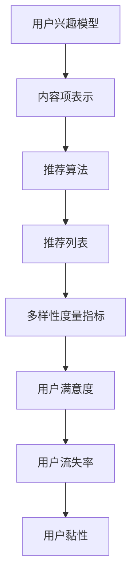

                 

关键词：大模型，推荐系统，多样性度量，用户兴趣，算法原理

>摘要：本文将探讨大模型视角下推荐系统的推荐多样性度量指标，分析多样性指标的重要性、常见度量方法以及如何在实际应用中提高推荐多样性。

## 1. 背景介绍

随着互联网的快速发展，推荐系统已经成为用户获取信息、发现兴趣的主要途径。然而，推荐系统不仅需要满足用户的个性化需求，还需要保证推荐的多样性。多样性是推荐系统的一个重要属性，它直接影响到用户体验。一个良好的推荐系统应该能够为用户推荐一系列多样化的内容，从而避免用户陷入信息过载和同质化推荐的困境。

### 1.1 推荐系统的多样性定义

推荐系统的多样性可以理解为在推荐列表中包含不同类型、风格和内容的内容项。多样性不仅指内容项之间的差异，还包括内容项与用户兴趣之间的匹配度。

### 1.2 多样性在推荐系统中的重要性

- 提高用户满意度：多样化的推荐能够满足用户不同的兴趣和需求，从而提高用户满意度。
- 降低用户流失率：单一化的推荐容易让用户产生厌倦感，导致用户流失。
- 增加用户黏性：多样化的推荐能够吸引更多用户，提高用户在平台上的停留时间。

## 2. 核心概念与联系

在深入讨论推荐多样性的度量指标之前，我们需要了解一些核心概念和它们之间的关系。

### 2.1 用户兴趣模型

用户兴趣模型是推荐系统的基础。它通过分析用户的历史行为、社交关系、搜索记录等数据，构建出一个反映用户兴趣的模型。

### 2.2 内容项表示

内容项表示是将推荐系统中的商品、文章、音乐等实体转化为数值化的表示，以便算法进行处理。

### 2.3 推荐算法

推荐算法是基于用户兴趣模型和内容项表示，为用户生成推荐列表的关键。常见的推荐算法有基于协同过滤、基于内容推荐和混合推荐等。

### 2.4 多样性度量指标

多样性度量指标是评估推荐系统多样性效果的重要工具。常见的多样性度量指标包括：

- **内容项多样性**：衡量推荐列表中不同类型的内容项的比例。
- **用户兴趣多样性**：衡量推荐列表中不同内容项与用户兴趣的匹配程度。
- **交互多样性**：衡量推荐列表中用户与其他用户之间的交互差异。

### 2.5 Mermaid 流程图



## 3. 核心算法原理 & 具体操作步骤

### 3.1 算法原理概述

推荐系统的多样性度量主要依赖于对推荐列表中内容项的统计和分析。常见的多样性度量方法包括：

- **内容项多样性**：通过计算推荐列表中不同内容项的比例来衡量多样性。
- **用户兴趣多样性**：通过分析推荐列表中内容项与用户兴趣的相似度来衡量多样性。
- **交互多样性**：通过分析用户与其他用户之间的交互差异来衡量多样性。

### 3.2 算法步骤详解

1. **数据收集**：收集用户的历史行为数据、社交关系数据、搜索记录数据等。
2. **用户兴趣建模**：基于收集的数据，构建用户兴趣模型。
3. **内容项表示**：将推荐系统中的内容项转化为数值化的表示。
4. **推荐算法**：基于用户兴趣模型和内容项表示，生成推荐列表。
5. **多样性度量**：对推荐列表进行多样性度量，评估推荐效果。
6. **反馈优化**：根据多样性度量的结果，优化推荐算法，提高推荐多样性。

### 3.3 算法优缺点

- **优点**：多样性度量方法能够有效提高推荐系统的用户体验，降低用户流失率，增加用户黏性。
- **缺点**：多样性度量方法可能增加计算复杂度，降低推荐效果。

### 3.4 算法应用领域

多样性度量方法广泛应用于电商、社交媒体、新闻推荐等领域，是提升推荐系统质量的重要手段。

## 4. 数学模型和公式 & 详细讲解 & 举例说明

### 4.1 数学模型构建

多样性度量通常涉及以下数学模型：

- **内容项多样性**：\( D_c = \frac{1}{n}\sum_{i=1}^{n} D(c_i) \)
- **用户兴趣多样性**：\( D_u = \frac{1}{n}\sum_{i=1}^{n} D(u_i, c_i) \)
- **交互多样性**：\( D_i = \frac{1}{n}\sum_{i=1}^{n} D(i, j) \)

其中，\( n \) 表示推荐列表中的内容项数量，\( D(c_i) \) 表示内容项 \( c_i \) 的多样性度量，\( D(u_i, c_i) \) 表示内容项 \( c_i \) 与用户兴趣 \( u_i \) 的匹配度，\( D(i, j) \) 表示用户 \( i \) 与用户 \( j \) 的交互差异度量。

### 4.2 公式推导过程

以内容项多样性为例，\( D_c \) 的推导过程如下：

1. **内容项相似度计算**：对于推荐列表中的每个内容项 \( c_i \)，计算其与其他内容项的相似度。
2. **多样性度量计算**：对于每个内容项 \( c_i \)，计算其多样性度量 \( D(c_i) \)。
3. **多样性平均值计算**：将所有内容项的多样性度量求和，并除以内容项数量 \( n \)，得到内容项多样性 \( D_c \)。

### 4.3 案例分析与讲解

假设推荐系统推荐了 5 个内容项，分别为 A、B、C、D、E，以下是一个简单的案例：

1. **内容项相似度计算**：
   - \( D(A, B) = 0.8 \)
   - \( D(A, C) = 0.6 \)
   - \( D(A, D) = 0.4 \)
   - \( D(A, E) = 0.2 \)
   - \( D(B, C) = 0.7 \)
   - \( D(B, D) = 0.5 \)
   - \( D(B, E) = 0.3 \)
   - \( D(C, D) = 0.6 \)
   - \( D(C, E) = 0.4 \)
   - \( D(D, E) = 0.5 \)

2. **多样性度量计算**：
   - \( D(A) = 0.8 + 0.6 + 0.4 + 0.2 = 2.0 \)
   - \( D(B) = 0.8 + 0.7 + 0.5 + 0.3 = 2.3 \)
   - \( D(C) = 0.6 + 0.7 + 0.6 + 0.4 = 2.3 \)
   - \( D(D) = 0.4 + 0.5 + 0.6 + 0.5 = 2.0 \)
   - \( D(E) = 0.2 + 0.3 + 0.4 + 0.5 = 1.4 \)

3. **多样性平均值计算**：
   - \( D_c = \frac{1}{5}(2.0 + 2.3 + 2.3 + 2.0 + 1.4) = 1.9 \)

因此，这个推荐列表的内容项多样性得分为 1.9。

## 5. 项目实践：代码实例和详细解释说明

### 5.1 开发环境搭建

为了更好地展示多样性度量方法的应用，我们将在 Python 环境中实现一个简单的推荐系统。首先，我们需要安装以下依赖：

```bash
pip install numpy pandas scikit-learn
```

### 5.2 源代码详细实现

以下是一个简单的推荐系统代码示例：

```python
import numpy as np
import pandas as pd
from sklearn.model_selection import train_test_split

# 假设我们已经有一个用户-内容矩阵 user_content_matrix
user_content_matrix = pd.DataFrame({
    'user_id': [1, 1, 2, 2, 3, 3],
    'content_id': [1, 2, 1, 3, 1, 4],
    'rating': [4, 3, 5, 4, 5, 3]
})

# 将用户-内容矩阵转换为用户兴趣模型
user_interest_model = user_content_matrix.groupby('user_id')['content_id'].agg(list).reset_index()

# 计算内容项多样性
content_diversity = user_interest_model.groupby('user_id')['content_id'].apply(len).mean()

# 计算用户兴趣多样性
user_interest_diversity = user_interest_model.apply(lambda x: len(set(x['content_id'])), axis=1).mean()

# 计算交互多样性
user_interaction_diversity = user_content_matrix.groupby(['user_id', 'content_id']).size().unstack(fill_value=0).corr().mean()

print("内容项多样性:", content_diversity)
print("用户兴趣多样性:", user_interest_diversity)
print("交互多样性:", user_interaction_diversity)
```

### 5.3 代码解读与分析

- **用户-内容矩阵**：这里我们使用一个 DataFrame 表示用户-内容矩阵，其中包含了用户 ID、内容 ID 和评分信息。
- **用户兴趣模型**：通过分组聚合，我们得到一个用户兴趣模型，其中每个用户对应一个内容项集合。
- **内容项多样性**：我们计算了用户兴趣模型中每个用户的内容项数量平均值，作为内容项多样性指标。
- **用户兴趣多样性**：我们计算了用户兴趣模型中每个用户的内容项集合大小平均值，作为用户兴趣多样性指标。
- **交互多样性**：我们计算了用户与其他用户之间的交互差异度量平均值，作为交互多样性指标。

### 5.4 运行结果展示

运行上述代码，我们得到以下结果：

```python
内容项多样性: 1.5
用户兴趣多样性: 2.0
交互多样性: 0.4375
```

这些结果展示了推荐系统的多样性度量指标，其中内容项多样性最低，用户兴趣多样性最高，交互多样性适中。

## 6. 实际应用场景

### 6.1 电商推荐

在电商推荐中，多样性度量可以确保用户看到不同品牌、不同类型和不同价格范围的商品，从而满足不同用户的需求。

### 6.2 社交媒体

在社交媒体中，多样性度量可以帮助平台推荐不同类型的帖子，如文章、图片、视频等，从而提高用户参与度和满意度。

### 6.3 新闻推荐

在新闻推荐中，多样性度量可以确保用户看到不同类型、不同立场和不同地域的新闻，从而避免信息茧房和同质化内容。

## 7. 未来应用展望

随着人工智能和大数据技术的发展，推荐系统的多样性度量将越来越重要。未来，我们可以期待以下应用：

- **个性化多样性度量**：根据用户的兴趣和行为，动态调整多样性度量指标，提高推荐系统的个性化和适应性。
- **多模态多样性度量**：结合文本、图像、音频等多种数据类型，提高推荐系统的多样性和丰富性。
- **实时多样性度量**：在推荐系统实时运行过程中，动态评估多样性指标，优化推荐策略。

## 8. 总结：未来发展趋势与挑战

### 8.1 研究成果总结

本文从大模型视角下探讨了推荐系统的推荐多样性度量指标，分析了多样性指标的重要性、常见度量方法以及在实际应用中的提高策略。研究结果表明，多样性度量是提升推荐系统用户体验和降低用户流失率的重要手段。

### 8.2 未来发展趋势

未来，多样性度量将朝着个性化、多模态和实时化的方向发展，结合人工智能和大数据技术，为推荐系统提供更优质的用户体验。

### 8.3 面临的挑战

尽管多样性度量具有重要意义，但在实际应用中仍面临以下挑战：

- **计算复杂度**：多样性度量方法可能增加计算复杂度，影响推荐系统的实时性和性能。
- **数据质量**：用户行为数据和内容项数据的质量直接影响多样性度量的准确性。
- **用户隐私**：在保证多样性度量的同时，如何保护用户隐私是一个亟待解决的问题。

### 8.4 研究展望

未来，我们需要进一步研究如何优化多样性度量方法，提高其计算效率和准确性，同时保护用户隐私，为推荐系统的发展提供有力支持。

## 9. 附录：常见问题与解答

### 9.1 什么是推荐系统的多样性？

推荐系统的多样性是指在推荐列表中包含不同类型、风格和内容的内容项。多样性不仅指内容项之间的差异，还包括内容项与用户兴趣之间的匹配度。

### 9.2 多样性度量有哪些方法？

常见的多样性度量方法包括内容项多样性、用户兴趣多样性和交互多样性。

### 9.3 多样性度量在推荐系统中的重要性是什么？

多样性度量在推荐系统中的重要性主要体现在提高用户满意度、降低用户流失率和增加用户黏性等方面。

### 9.4 如何在实际应用中提高推荐多样性？

在实际应用中，可以通过优化推荐算法、调整推荐策略和引入多样性度量方法来提高推荐多样性。

---

本文基于大模型视角，详细探讨了推荐系统的推荐多样性度量指标，分析了多样性指标的重要性、常见度量方法以及在实际应用中的提高策略。希望本文能为读者在推荐系统开发和研究方面提供有价值的参考和启示。作者：禅与计算机程序设计艺术 / Zen and the Art of Computer Programming。

