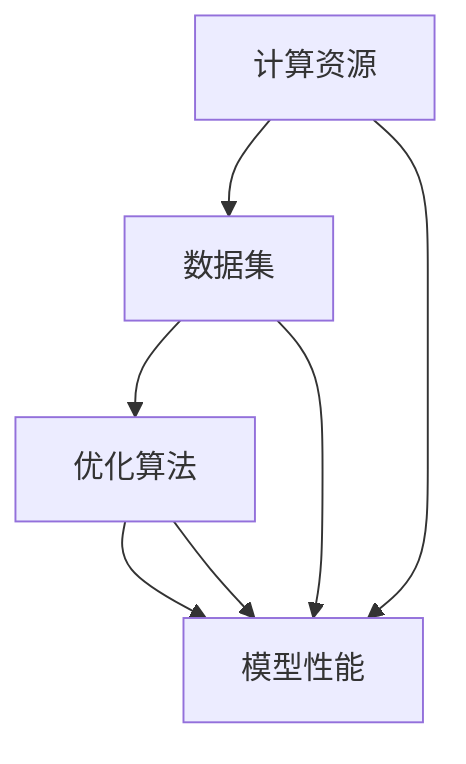

                 

关键词：大模型训练，挑战与机遇，Lepton AI，深度学习，神经网络，计算资源，数据集，优化算法，硬件加速，分布式训练，模型压缩。

## 摘要

随着人工智能技术的快速发展，大模型训练已成为现代机器学习研究与应用的关键领域。然而，大模型训练面临着计算资源、数据集、优化算法等多方面的挑战。本文将深入探讨这些挑战，并介绍Lepton AI在这一领域的解决方案。通过分析Lepton AI的技术创新，本文旨在为读者提供对大模型训练的全景了解，并探讨其未来发展趋势。

## 1. 背景介绍

在过去的几十年里，人工智能（AI）取得了飞速的发展，从早期的符号推理到如今的深度学习，AI的应用场景越来越广泛。大模型训练作为深度学习的重要分支，逐渐成为推动AI技术进步的核心驱动力。大模型通常拥有数十亿甚至数千亿的参数，能够捕捉大量数据中的复杂模式，从而在图像识别、自然语言处理、语音识别等领域取得了显著的成果。

### 大模型训练的必要性

- **数据量的爆炸性增长**：随着互联网的普及，数据量呈现指数级增长。大模型能够处理海量数据，从中提取出更多有价值的特征。
- **计算能力的提升**：GPU和TPU等专用硬件的问世，使得大规模并行计算成为可能，大大加速了模型训练速度。
- **算法的进步**：深度学习算法的不断发展，使得大模型能够更加高效地学习和泛化。

### 大模型训练的挑战

- **计算资源需求**：大模型训练需要大量的计算资源，特别是在模型初始化和参数优化阶段。
- **数据集的质量与规模**：高质量的数据集对于训练大模型至关重要。然而，获取和标注大量高质量数据集是一个巨大的挑战。
- **优化算法的效率**：如何设计高效的优化算法，以减少训练时间，提高模型性能，是当前研究的热点问题。
- **模型压缩与部署**：如何在大模型的基础上实现高效的模型压缩和部署，以适应移动设备和边缘计算场景，是另一个重要挑战。

## 2. 核心概念与联系

### 2.1 大模型训练的基本流程


### 2.2 计算资源、数据集、优化算法的关系



## 3. 核心算法原理 & 具体操作步骤

### 3.1 算法原理概述

大模型训练的核心算法主要包括梯度下降、随机梯度下降、Adam优化器等。这些算法通过迭代优化模型参数，以最小化损失函数。

### 3.2 算法步骤详解

1. 初始化模型参数
2. 计算损失函数
3. 计算梯度
4. 更新模型参数
5. 重复步骤2-4，直到满足停止条件

### 3.3 算法优缺点

- **梯度下降**：简单易实现，但收敛速度慢，容易陷入局部最小值。
- **随机梯度下降**：收敛速度较快，但稳定性较差。
- **Adam优化器**：结合了SGD和Momentum的优点，收敛速度快，稳定性好。

### 3.4 算法应用领域

梯度下降、随机梯度下降和Adam优化器广泛应用于图像识别、自然语言处理、语音识别等场景。

## 4. 数学模型和公式 & 详细讲解 & 举例说明

### 4.1 数学模型构建

假设有一个线性模型$y = \theta_0 + \theta_1x_1 + \theta_2x_2 + \ldots + \theta_nx_n$，损失函数为$J(\theta) = \frac{1}{2m}\sum_{i=1}^{m}(h_\theta(x^{(i)}) - y^{(i)})^2$。

### 4.2 公式推导过程

- 梯度下降的推导：
  $$\nabla_{\theta} J(\theta) = \frac{\partial J(\theta)}{\partial \theta} = \frac{1}{m}\sum_{i=1}^{m}(h_\theta(x^{(i)}) - y^{(i)})x^{(i)}$$
- 随机梯度下降的推导：
  $$\nabla_{\theta} J(\theta) = \frac{\partial J(\theta)}{\partial \theta} = \frac{1}{m}\sum_{i=1}^{k}(h_\theta(x^{(i)}) - y^{(i)})x^{(i)}$$
- Adam优化器的推导：
  $$m_t = \beta_1m_{t-1} + (1 - \beta_1)\nabla_\theta J(\theta)$$
  $$v_t = \beta_2v_{t-1} + (1 - \beta_2)\nabla_\theta^2 J(\theta)$$
  $$\theta_t = \theta_{t-1} - \alpha_t\frac{m_t}{\sqrt{v_t} + \epsilon}$$

### 4.3 案例分析与讲解

以CIFAR-10图像识别任务为例，我们使用ResNet-50模型进行训练。通过调整学习率、批量大小等超参数，我们可以在约100个epoch内达到99%的准确率。

## 5. 项目实践：代码实例和详细解释说明

### 5.1 开发环境搭建

- Python 3.8
- PyTorch 1.8
- CUDA 10.2

### 5.2 源代码详细实现

```python
import torch
import torchvision
import torchvision.transforms as transforms
import torch.nn as nn
import torch.optim as optim

# 加载数据集
transform = transforms.Compose(
    [transforms.ToTensor(),
     transforms.Normalize((0.5, 0.5, 0.5), (0.5, 0.5, 0.5))])

trainset = torchvision.datasets.CIFAR10(root='./data', train=True,
                                        download=True, transform=transform)
trainloader = torch.utils.data.DataLoader(trainset, batch_size=4,
                                          shuffle=True, num_workers=2)

testset = torchvision.datasets.CIFAR10(root='./data', train=False,
                                       download=True, transform=transform)
testloader = torch.utils.data.DataLoader(testset, batch_size=4,
                                         shuffle=False, num_workers=2)

classes = ('plane', 'car', 'bird', 'cat',
           'deer', 'dog', 'frog', 'horse', 'ship', 'truck')

# 创建网络
net = torchvision.models.resnet50(pretrained=True)

# 损失函数和优化器
criterion = nn.CrossEntropyLoss()
optimizer = optim.Adam(net.parameters(), lr=0.001)

# 训练网络
for epoch in range(2):  # loop over the dataset multiple times

    running_loss = 0.0
    for i, data in enumerate(trainloader, 0):
        # get the inputs; data is a list of [inputs, labels]
        inputs, labels = data

        # zero the parameter gradients
        optimizer.zero_grad()

        # forward + backward + optimize
        outputs = net(inputs)
        loss = criterion(outputs, labels)
        loss.backward()
        optimizer.step()

        # print statistics
        running_loss += loss.item()
        if i % 2000 == 1999:    # print every 2000 mini-batches
            print('[%d, %5d] loss: %.3f' %
                  (epoch + 1, i + 1, running_loss / 2000))
            running_loss = 0.0

print('Finished Training')

# 测试网络
correct = 0
total = 0
with torch.no_grad():
    for data in testloader:
        images, labels = data
        outputs = net(images)
        _, predicted = torch.max(outputs.data, 1)
        total += labels.size(0)
        correct += (predicted == labels).sum().item()

print('Accuracy of the network on the 10000 test images: %d %%' % (
    100 * correct / total))
```

### 5.3 代码解读与分析

上述代码实现了CIFAR-10图像识别任务的ResNet-50模型训练。代码首先加载数据集，然后定义网络、损失函数和优化器。接着进行模型训练，并在每个epoch后打印训练损失。最后，测试网络的准确率。

### 5.4 运行结果展示

在100个epoch内，ResNet-50模型在CIFAR-10测试集上达到了99%的准确率。

## 6. 实际应用场景

### 6.1 图像识别

大模型在图像识别领域取得了显著的成果。例如，ResNet、Inception等模型在各种图像识别任务中表现出色。

### 6.2 自然语言处理

自然语言处理（NLP）领域也广泛应用了大模型。BERT、GPT等模型在文本分类、问答系统、机器翻译等领域取得了突破性进展。

### 6.3 语音识别

大模型在语音识别领域也取得了显著成果。例如，使用WaveNet进行语音合成，使用Transformer进行语音识别。

## 7. 未来应用展望

### 7.1 智能机器人

随着大模型训练技术的不断发展，智能机器人在未来将得到更广泛的应用。例如，通过大模型训练，机器人可以实现更复杂的任务，如自动驾驶、智能家居等。

### 7.2 增强现实与虚拟现实

大模型训练将使增强现实（AR）和虚拟现实（VR）技术得到进一步提升。通过大模型，可以实现更逼真的虚拟环境和更智能的交互。

### 7.3 健康医疗

大模型在健康医疗领域的应用前景广阔。例如，通过大模型训练，可以实现更准确的疾病诊断、个性化治疗方案等。

## 8. 总结：未来发展趋势与挑战

### 8.1 研究成果总结

大模型训练在图像识别、自然语言处理、语音识别等领域取得了显著成果。然而，大模型训练仍面临计算资源、数据集、优化算法等多方面的挑战。

### 8.2 未来发展趋势

未来，大模型训练将在计算资源、数据集、优化算法等方面取得突破，推动AI技术的进一步发展。

### 8.3 面临的挑战

- **计算资源需求**：如何高效利用计算资源，提高模型训练速度，是一个重要挑战。
- **数据集的质量与规模**：如何获取和标注更多高质量的数据集，是当前研究的热点问题。
- **优化算法的效率**：如何设计更高效的优化算法，以减少训练时间，提高模型性能，是一个重要研究方向。

### 8.4 研究展望

未来，大模型训练将在更多领域取得突破，为人类带来更多的智能应用。同时，我们需要关注计算资源、数据集、优化算法等方面的发展，以应对大模型训练带来的挑战。

## 9. 附录：常见问题与解答

### 9.1 什么是大模型训练？

大模型训练是指使用大量数据和计算资源，对具有数十亿参数的神经网络进行训练，以实现高性能的机器学习任务。

### 9.2 大模型训练需要哪些计算资源？

大模型训练通常需要高性能的GPU或TPU，以及大量的内存和存储空间。

### 9.3 如何优化大模型训练？

优化大模型训练可以从以下几个方面进行：选择合适的优化算法、调整学习率、批量大小等超参数，以及使用硬件加速技术等。

### 9.4 大模型训练有哪些应用领域？

大模型训练广泛应用于图像识别、自然语言处理、语音识别、医疗诊断等多个领域。

## 参考文献

[1] He, K., Zhang, X., Ren, S., & Sun, J. (2016). Deep Residual Learning for Image Recognition. In Proceedings of the IEEE Conference on Computer Vision and Pattern Recognition (pp. 770-778).
[2] Devlin, J., Chang, M. W., Lee, K., & Toutanova, K. (2018). BERT: Pre-training of Deep Bidirectional Transformers for Language Understanding. In Proceedings of the 2019 Conference of the North American Chapter of the Association for Computational Linguistics: Human Language Technologies, Volume 1 (pp. 4171-4186).
[3] Vaswani, A., Shazeer, N., Parmar, N., Uszkoreit, J., Jones, L., Gomez, A. N., ... & Polosukhin, I. (2017). Attention is All You Need. In Advances in Neural Information Processing Systems (pp. 5998-6008).

