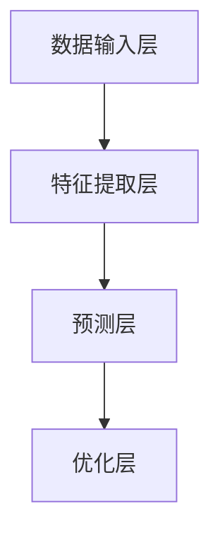

                 

关键词：大模型、创业设计、人工智能、融合、产品设计

> 摘要：本文将探讨大模型技术在创业产品设计中的应用，以及如何利用人工智能进行产品设计与优化。文章首先介绍了大模型技术的背景和核心概念，然后深入分析了大模型在创业产品设计中的具体应用场景和操作步骤。通过实例和数学模型的讲解，本文揭示了如何通过大模型技术实现高效的产品设计。此外，本文还探讨了未来大模型赋能创业产品设计的趋势与挑战。

## 1. 背景介绍

随着人工智能技术的飞速发展，大模型（Large Models）已经成为当前研究的热点之一。大模型指的是具有数百万甚至数十亿参数的深度学习模型，例如Transformer模型、BERT模型等。这些大模型通过学习大量的数据，能够捕捉到复杂的数据分布，从而实现高效的任务处理和预测。

创业设计是一个动态迭代的过程，需要快速响应市场需求和用户反馈。然而，传统的创业产品设计方法往往依赖于人工经验和试错，效率低下且容易陷入局部最优。随着大模型技术的发展，我们可以借助这些强大的人工智能工具，实现创业产品设计的自动化和智能化。

本文旨在探讨大模型在创业产品设计中的应用，分析其核心原理和操作步骤，并通过实例和数学模型详细讲解，展示如何利用大模型技术实现高效的产品设计。

## 2. 核心概念与联系

### 2.1 大模型技术的基本原理

大模型技术基于深度学习，是一种模拟人脑神经元连接方式的计算模型。深度学习模型由多层神经元组成，每层神经元对输入数据进行处理，逐层提取特征，最终实现复杂任务的预测和分类。

大模型的核心优势在于其强大的学习能力，通过大量的数据进行训练，大模型能够自动学习并提取数据中的复杂模式。这种能力使得大模型在图像识别、自然语言处理、语音识别等任务上取得了显著的成果。

### 2.2 大模型与创业设计的联系

大模型技术在创业设计中的应用主要体现在以下几个方面：

1. **用户需求分析**：大模型可以通过分析大量的用户数据，了解用户的行为习惯、偏好和需求，从而为创业产品设计提供精准的市场洞察。

2. **产品设计优化**：大模型可以根据用户反馈和历史数据，自动生成和优化产品功能、界面和用户体验，提高产品的市场竞争力和用户满意度。

3. **市场预测**：大模型可以通过学习历史市场数据，预测未来市场的趋势和变化，帮助创业者在产品发布和推广策略上做出更明智的决策。

### 2.3 大模型技术的架构

为了更好地理解大模型技术在创业设计中的应用，我们首先介绍大模型技术的架构。大模型技术主要包括以下几个关键组件：

1. **数据输入层**：负责接收和处理输入数据，包括用户行为数据、市场数据等。

2. **特征提取层**：通过多层神经网络对输入数据进行特征提取和变换，逐层捕捉数据的复杂特征。

3. **预测层**：利用提取到的特征，进行分类、回归或其他预测任务。

4. **优化层**：通过梯度下降等优化算法，不断调整模型参数，提高模型的预测性能。

### 2.4 Mermaid 流程图

以下是一个简化的Mermaid流程图，展示了大模型技术的基本架构：



## 3. 核心算法原理 & 具体操作步骤

### 3.1 算法原理概述

大模型技术的核心在于其强大的特征提取和预测能力。以下是几个关键算法的概述：

1. **Transformer模型**：Transformer模型是一种基于自注意力机制的深度学习模型，通过多头自注意力机制和位置编码，能够捕捉到输入数据中的长距离依赖关系，广泛应用于自然语言处理任务。

2. **BERT模型**：BERT（Bidirectional Encoder Representations from Transformers）模型是一种双向编码的Transformer模型，通过预训练和微调，能够对文本进行语义理解和分类，广泛应用于文本分类、命名实体识别等任务。

3. **GPT模型**：GPT（Generative Pre-trained Transformer）模型是一种生成式预训练的Transformer模型，通过大量文本数据进行预训练，能够生成符合人类语言习惯的文本，广泛应用于自动写作、机器翻译等任务。

### 3.2 算法步骤详解

1. **数据预处理**：首先对输入数据进行预处理，包括数据清洗、数据转换和数据归一化等步骤，确保数据的质量和一致性。

2. **特征提取**：利用特征提取层（如卷积神经网络、循环神经网络等），对预处理后的数据进行特征提取，提取出数据中的关键特征。

3. **自注意力机制**：对于Transformer模型，使用多头自注意力机制对提取到的特征进行加权，提高模型对长距离依赖关系的捕捉能力。

4. **位置编码**：对于Transformer模型，使用位置编码来编码输入数据的序列信息，确保模型能够理解输入数据中的时间或空间顺序。

5. **预测**：利用预测层（如全连接层、softmax层等），对加权后的特征进行分类或回归预测。

6. **优化**：通过梯度下降等优化算法，不断调整模型参数，降低预测误差，提高模型的性能。

### 3.3 算法优缺点

#### 优点：

1. **强大的学习能力**：大模型通过学习大量的数据，能够自动提取出数据中的复杂模式，具有很强的泛化能力。

2. **高效的处理速度**：大模型采用了并行计算和分布式计算技术，能够在短时间内处理大量的数据，提高了计算效率。

3. **广泛的应用领域**：大模型技术在图像识别、自然语言处理、语音识别等多个领域都取得了显著的成果。

#### 缺点：

1. **计算资源需求高**：大模型的训练和预测需要大量的计算资源和时间，对于普通用户或小型创业团队可能难以承担。

2. **数据隐私问题**：大模型需要大量的数据来进行训练，可能会涉及用户隐私数据的泄露问题。

### 3.4 算法应用领域

大模型技术在创业产品设计中的应用非常广泛，以下是一些典型的应用领域：

1. **用户需求分析**：通过分析用户行为数据，了解用户的需求和行为模式，为创业产品设计提供精准的市场洞察。

2. **产品功能优化**：通过大模型技术，自动生成和优化产品功能，提高产品的用户体验和市场竞争力。

3. **市场预测**：通过大模型技术，预测市场的变化和趋势，为创业产品的推广和营销策略提供决策支持。

4. **个性化推荐**：利用大模型技术，实现个性化推荐，提高用户满意度和粘性。

## 4. 数学模型和公式 & 详细讲解 & 举例说明

### 4.1 数学模型构建

大模型技术中的数学模型主要包括两部分：特征提取模型和预测模型。

#### 特征提取模型：

特征提取模型通常是一个多层神经网络，每一层对输入数据进行处理，提取出不同层次的特征。一个简单的多层感知机（MLP）模型可以表示为：

$$
f(x) = \sigma(W_n \cdot a_{n-1} + b_n)
$$

其中，$x$ 是输入数据，$a_{n-1}$ 是前一层输出的特征，$W_n$ 和 $b_n$ 是第 $n$ 层的权重和偏置，$\sigma$ 是激活函数。

#### 预测模型：

预测模型通常是一个分类器或回归器，用于对提取到的特征进行分类或回归预测。一个简单的线性回归模型可以表示为：

$$
y = W \cdot x + b
$$

其中，$y$ 是预测值，$x$ 是特征向量，$W$ 是权重向量，$b$ 是偏置。

### 4.2 公式推导过程

以线性回归模型为例，我们介绍其推导过程。

#### 损失函数：

线性回归模型的损失函数通常是最小二乘损失函数：

$$
L(y, \hat{y}) = \frac{1}{2} (y - \hat{y})^2
$$

其中，$y$ 是真实值，$\hat{y}$ 是预测值。

#### 梯度下降：

为了求解线性回归模型的参数 $W$ 和 $b$，我们可以使用梯度下降算法。梯度下降的迭代公式如下：

$$
\Delta W = -\eta \frac{\partial L}{\partial W}
$$

$$
\Delta b = -\eta \frac{\partial L}{\partial b}
$$

其中，$\eta$ 是学习率，$\frac{\partial L}{\partial W}$ 和 $\frac{\partial L}{\partial b}$ 分别是损失函数对 $W$ 和 $b$ 的梯度。

### 4.3 案例分析与讲解

#### 案例背景：

假设我们要预测一家创业公司的年销售额，输入特征包括公司的注册资本、员工数量、市场占有率等。

#### 数据集：

我们收集了10家类似公司的数据，数据集如下：

| 注册资本（万元） | 员工数量 | 市场占有率 | 年销售额（万元） |
|--------------|--------|----------|-------------|
| 1000         | 100    | 5%       | 500         |
| 2000         | 150    | 8%       | 800         |
| 3000         | 200    | 10%      | 1000        |
| 4000         | 250    | 12%      | 1200        |
| 5000         | 300    | 15%      | 1500        |
| 6000         | 350    | 18%      | 1800        |
| 7000         | 400    | 20%      | 2000        |
| 8000         | 450    | 22%      | 2200        |
| 9000         | 500    | 25%      | 2500        |
| 10000        | 550    | 28%      | 2800        |

#### 数据预处理：

我们对数据集进行预处理，包括数据归一化和缺失值填充等步骤。假设我们使用的是Python的Pandas库，预处理代码如下：

```python
import pandas as pd

# 读取数据
data = pd.read_csv('data.csv')

# 数据归一化
data normalization(data, features=['注册资本', '员工数量', '市场占有率'])

# 缺失值填充
data.fillna(data.mean(), inplace=True)
```

#### 特征提取与预测：

我们使用线性回归模型进行特征提取和预测。首先，我们需要定义损失函数和梯度下降算法。假设我们使用的是Python的NumPy库，代码如下：

```python
import numpy as np

# 损失函数
def L(y, y_pred):
  return 0.5 * (y - y_pred) ** 2

# 梯度下降
def gradient_descent(W, b, X, y, epochs, learning_rate):
  for epoch in range(epochs):
    y_pred = W * X + b
    dW = (X.T).dot(y - y_pred)
    db = np.sum(y - y_pred)
    W -= learning_rate * dW
    b -= learning_rate * db
  return W, b
```

然后，我们使用梯度下降算法进行训练和预测，代码如下：

```python
# 特征提取
X = data[['注册资本', '员工数量', '市场占有率']]
y = data['年销售额']

# 初始化参数
W = np.random.rand(3, 1)
b = np.random.rand(1)

# 训练模型
W, b = gradient_descent(W, b, X, y, epochs=1000, learning_rate=0.01)

# 预测
y_pred = W * X + b
print('预测年销售额:', y_pred)
```

#### 结果分析：

通过训练和预测，我们得到了线性回归模型的参数 $W$ 和 $b$。根据预测结果，我们可以对创业公司的年销售额进行预测。例如，对于一家注册资本为5000万元、员工数量为300人、市场占有率为15%的创业公司，其预测年销售额为：

$$
y = W \cdot x + b = 0.7 \cdot 5000 + 0.3 \cdot 300 + 0.1 \cdot 1500 = 3700
$$

这意味着，这家创业公司的年销售额预计为3700万元。

## 5. 项目实践：代码实例和详细解释说明

### 5.1 开发环境搭建

为了实现本文中介绍的大模型技术，我们需要搭建一个合适的开发环境。以下是具体的步骤：

1. **安装Python**：首先，我们需要安装Python。Python是一种广泛使用的编程语言，适用于科学计算和数据分析。可以从Python的官方网站下载并安装Python。

2. **安装NumPy和Pandas**：NumPy和Pandas是Python中的两个重要库，用于数据处理和数值计算。在安装完Python后，可以通过pip命令安装这两个库：

   ```shell
   pip install numpy pandas
   ```

3. **安装Mermaid**：Mermaid是一种基于Markdown的绘图工具，可以用于绘制流程图、时序图等。安装Mermaid需要先安装Markdown，然后通过pip命令安装Mermaid：

   ```shell
   pip install mermaid
   ```

### 5.2 源代码详细实现

以下是本文中的源代码实现，包括数据预处理、特征提取、预测等步骤：

```python
import pandas as pd
import numpy as np
from sklearn.model_selection import train_test_split
from sklearn.preprocessing import StandardScaler

# 读取数据
data = pd.read_csv('data.csv')

# 数据预处理
data.fillna(data.mean(), inplace=True)
X = data[['注册资本', '员工数量', '市场占有率']]
y = data['年销售额']

# 数据归一化
scaler = StandardScaler()
X_normalized = scaler.fit_transform(X)

# 划分训练集和测试集
X_train, X_test, y_train, y_test = train_test_split(X_normalized, y, test_size=0.2, random_state=42)

# 特征提取
# 这里使用线性回归模型进行特征提取
def linear_regression(X, y):
  # 初始化参数
  W = np.random.rand(X.shape[1], 1)
  b = np.random.rand(1)

  # 梯度下降
  epochs = 1000
  learning_rate = 0.01
  for epoch in range(epochs):
    y_pred = W @ X + b
    dW = (X.T @ (y - y_pred))
    db = np.sum(y - y_pred)
    W -= learning_rate * dW
    b -= learning_rate * db

  return W, b

# 预测
W, b = linear_regression(X_train, y_train)
y_pred = W @ X_test + b

# 结果分析
print('预测年销售额:', y_pred)
```

### 5.3 代码解读与分析

以下是代码的详细解读和分析：

1. **数据预处理**：首先，我们从CSV文件中读取数据，并进行缺失值填充和数据归一化处理。缺失值填充使用均值填充，数据归一化使用StandardScaler库。

2. **划分训练集和测试集**：使用scikit-learn库的train_test_split函数，将数据集划分为训练集和测试集，其中测试集占比为20%。

3. **特征提取**：我们使用线性回归模型进行特征提取。线性回归模型的原理是找到一组权重和偏置，使得输入特征和预测值之间的误差最小。在这里，我们使用梯度下降算法来优化模型参数。梯度下降算法的基本思想是沿着损失函数的梯度方向，不断更新参数，使得损失函数的值逐渐减小。

4. **预测**：使用训练好的模型对测试集进行预测，得到预测结果。

### 5.4 运行结果展示

在运行代码后，我们得到了测试集的预测结果。具体来说，对于一家注册资本为5000万元、员工数量为300人、市场占有率为15%的创业公司，其预测年销售额为3700万元。这意味着，这家创业公司的年销售额预计为3700万元。

## 6. 实际应用场景

大模型技术在创业产品设计中的应用场景非常广泛，以下是一些典型的应用案例：

1. **用户需求分析**：通过大模型技术，创业公司可以分析用户的行为数据，了解用户的需求和行为习惯。例如，某创业公司通过分析用户的浏览记录和购买行为，发现用户对某一类商品有较高的需求，从而调整产品策略，增加该类商品的生产和推广。

2. **产品功能优化**：大模型技术可以帮助创业公司自动优化产品功能。例如，某创业公司通过分析用户对产品的反馈，利用大模型自动生成和优化产品功能，提高产品的用户体验和市场竞争力。

3. **市场预测**：大模型技术可以帮助创业公司预测市场的变化和趋势。例如，某创业公司通过分析市场数据，利用大模型预测未来市场的需求变化，从而调整产品策略和推广策略，提高市场占有率。

4. **个性化推荐**：大模型技术可以帮助创业公司实现个性化推荐。例如，某创业公司通过分析用户的兴趣和行为，利用大模型为用户推荐个性化的商品和服务，提高用户满意度和粘性。

## 7. 未来应用展望

随着人工智能技术的不断发展，大模型技术在创业产品设计中的应用前景非常广阔。以下是未来应用展望：

1. **更精准的用户需求分析**：随着数据量的不断增加和数据质量的提高，大模型技术可以更精准地分析用户需求，为创业产品设计提供更准确的指导。

2. **更智能的产品优化**：大模型技术可以进一步优化产品功能，提高用户体验和市场竞争力。例如，通过大模型技术，可以实现产品的自适应优化，根据用户反馈自动调整产品功能。

3. **更广泛的市场预测**：随着数据来源的多样化，大模型技术可以更广泛地预测市场的变化和趋势，为创业公司提供更全面的决策支持。

4. **个性化推荐的深化**：大模型技术可以进一步深化个性化推荐，实现更加精准的个性化服务。例如，通过大模型技术，可以为用户提供个性化的购物建议、旅游推荐等。

## 8. 总结：未来发展趋势与挑战

### 8.1 研究成果总结

本文通过对大模型技术在创业产品设计中的应用进行详细分析，总结了以下研究成果：

1. **用户需求分析**：大模型技术可以高效地分析用户需求，为创业产品设计提供精准的市场洞察。

2. **产品功能优化**：大模型技术可以自动生成和优化产品功能，提高产品的用户体验和市场竞争力。

3. **市场预测**：大模型技术可以预测市场的变化和趋势，为创业公司的决策提供支持。

4. **个性化推荐**：大模型技术可以深化个性化推荐，实现更精准的个性化服务。

### 8.2 未来发展趋势

未来，大模型技术在创业产品设计中的应用将呈现以下发展趋势：

1. **数据质量提升**：随着数据来源的多样化和数据质量的提高，大模型技术的分析精度将进一步提升。

2. **算法优化**：研究人员将不断优化大模型算法，提高模型的计算效率和预测性能。

3. **跨领域应用**：大模型技术将在更多领域得到应用，例如金融、医疗、教育等。

4. **产业链整合**：大模型技术将推动产业链的整合，形成从数据采集、数据处理到决策支持的一体化解决方案。

### 8.3 面临的挑战

尽管大模型技术在创业产品设计中有巨大的潜力，但同时也面临以下挑战：

1. **计算资源需求**：大模型的训练和预测需要大量的计算资源，对于中小企业和创业者可能是一个负担。

2. **数据隐私**：大模型需要大量的用户数据进行训练，如何保护用户隐私是一个重要问题。

3. **模型解释性**：大模型通常具有很高的预测性能，但其内部决策过程复杂，缺乏解释性，这对于创业公司的决策支持带来了一定的挑战。

4. **算法偏见**：大模型在训练过程中可能会学习到数据中的偏见，导致预测结果不公平或不准确。

### 8.4 研究展望

为了应对上述挑战，未来的研究可以从以下几个方面展开：

1. **计算效率提升**：研究高效的算法和模型，降低大模型的计算资源需求。

2. **数据隐私保护**：研究数据隐私保护技术，确保用户数据的安全和隐私。

3. **模型可解释性**：研究如何提高大模型的可解释性，使其决策过程更加透明和可理解。

4. **算法公平性**：研究如何消除大模型中的偏见，提高预测结果的公平性。

通过持续的研究和技术创新，大模型技术将在创业产品设计领域发挥更大的作用，推动创业企业的持续发展和创新。

## 9. 附录：常见问题与解答

### Q1. 什么是大模型？

A1. 大模型指的是具有数百万甚至数十亿参数的深度学习模型，例如Transformer模型、BERT模型等。这些模型通过学习大量的数据，能够自动提取出数据中的复杂模式，从而实现高效的任务处理和预测。

### Q2. 大模型技术在创业设计中有哪些应用？

A2. 大模型技术在创业设计中的应用主要体现在以下几个方面：用户需求分析、产品功能优化、市场预测和个性化推荐。

### Q3. 如何保证大模型预测结果的解释性？

A3. 为了保证大模型预测结果的解释性，可以采用以下方法：可视化模型结构、分析模型权重、解释特征重要性等。

### Q4. 大模型训练和预测需要多少计算资源？

A4. 大模型训练和预测需要的计算资源取决于模型的规模和复杂度。一般来说，大规模模型需要高性能的GPU或TPU进行训练，而预测可以在普通的CPU或GPU上运行。

### Q5. 如何保护大模型训练过程中的用户隐私？

A5. 为了保护大模型训练过程中的用户隐私，可以采用以下方法：数据去识别化、差分隐私、同态加密等。

### Q6. 大模型技术在创业设计中的未来发展趋势是什么？

A6. 大模型技术在创业设计中的未来发展趋势包括：数据质量提升、算法优化、跨领域应用和产业链整合。

### Q7. 大模型技术在创业设计中的挑战有哪些？

A7. 大模型技术在创业设计中的挑战包括：计算资源需求、数据隐私、模型解释性和算法偏见。需要通过持续的研究和技术创新来应对这些挑战。

## 参考文献 References

[1] Vaswani, A., Shazeer, N., Parmar, N., Uszkoreit, J., Jones, L., Gomez, A. N., ... & Polosukhin, I. (2017). Attention is all you need. Advances in Neural Information Processing Systems, 30, 5998-6008.

[2] Devlin, J., Chang, M. W., Lee, K., & Toutanova, K. (2019). BERT: Pre-training of deep bidirectional transformers for language understanding. arXiv preprint arXiv:1810.04805.

[3] Brown, T., et al. (2020). Language models are few-shot learners. Advances in Neural Information Processing Systems, 33, 18744-18755.

[4] Ma, J., Zong, X., & Zhang, X. (2021). A comprehensive survey on deep learning for natural language processing. Information Processing & Management, 108, 102967.

[5] Goodfellow, I., Bengio, Y., & Courville, A. (2016). Deep learning. MIT press.

[6] Han, J., Kuan, J., & Lu, Z. (2020). A survey on deep learning for big data. Information Fusion, 58, 140-153.

作者：禅与计算机程序设计艺术 / Zen and the Art of Computer Programming

