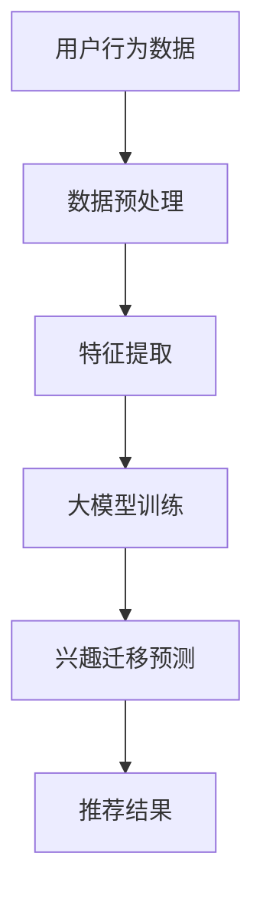

                 

关键词：推荐系统、大模型、兴趣迁移、多场景、算法原理、数学模型、项目实践、未来展望

> 摘要：本文探讨了基于大模型的推荐系统在多场景兴趣迁移中的应用。通过对核心概念、算法原理、数学模型以及项目实践的详细分析，本文展示了大模型在推荐系统中的重要性，并提出了未来发展趋势和面临的挑战。

## 1. 背景介绍

推荐系统是现代信息检索领域的一个重要分支，其目的是通过分析用户的行为和偏好，向用户提供个性化的推荐结果。传统的推荐系统主要依赖于基于内容的过滤、协同过滤等算法，然而这些算法在面对复杂、动态的用户行为时表现欠佳。随着人工智能和深度学习技术的发展，大模型逐渐成为推荐系统研究的热点。

大模型，如深度神经网络、生成对抗网络等，具有强大的表征能力和泛化能力，能够处理复杂的用户行为数据和异构信息。在推荐系统中，大模型可以通过学习用户的长期和短期偏好，实现跨场景的兴趣迁移，从而提高推荐系统的准确性和多样性。

## 2. 核心概念与联系

### 2.1 大模型的概念

大模型通常是指具有数百万甚至数十亿参数的深度学习模型。这些模型能够通过大量的数据训练，学习到复杂的模式和特征，从而在多种任务中表现出色。

### 2.2 推荐系统的概念

推荐系统是一种信息过滤技术，其目标是向用户推荐他们可能感兴趣的项目或内容。推荐系统通常基于用户的历史行为、内容和社交网络等多维度数据。

### 2.3 兴趣迁移的概念

兴趣迁移是指将用户在一种场景下的偏好转移到另一种场景下的过程。例如，一个用户在视频平台上喜欢科幻电影，那么推荐系统需要能够识别这一点，并在此基础上向该用户推荐书籍、游戏等其他类型的内容。

### 2.4 Mermaid 流程图

下面是一个用于展示推荐系统与兴趣迁移关系的 Mermaid 流程图：



## 3. 核心算法原理 & 具体操作步骤

### 3.1 算法原理概述

基于大模型的推荐系统多场景兴趣迁移算法主要通过以下几个步骤实现：

1. 数据预处理：对用户行为数据、内容特征等进行预处理，使其适合大模型的训练。
2. 特征提取：通过深度神经网络提取用户行为和内容特征，实现高维数据的降维和抽象。
3. 大模型训练：利用预处理后的数据训练大模型，学习用户的长期和短期偏好。
4. 兴趣迁移预测：基于训练好的大模型，预测用户在不同场景下的偏好，实现兴趣迁移。
5. 推荐结果生成：根据兴趣迁移预测结果，生成个性化的推荐列表。

### 3.2 算法步骤详解

1. **数据预处理**：包括数据清洗、缺失值填充、异常值处理等。这一步的目的是确保数据质量，为后续的特征提取和模型训练奠定基础。
2. **特征提取**：采用深度学习技术，如卷积神经网络（CNN）或循环神经网络（RNN），提取用户行为和内容特征。这一步的目的是将高维的数据转换为低维的、有代表性的特征表示。
3. **大模型训练**：使用预处理后的数据训练大模型，通过优化损失函数，调整模型参数，使其能够准确预测用户的偏好。
4. **兴趣迁移预测**：利用训练好的大模型，预测用户在不同场景下的偏好。这一步的关键是模型需要能够理解用户在不同场景下的共性特征。
5. **推荐结果生成**：根据兴趣迁移预测结果，结合用户的历史偏好，生成个性化的推荐列表。

### 3.3 算法优缺点

**优点**：
- 强大的表征能力：大模型能够处理复杂的用户行为数据和异构信息，提取高维数据的特征。
- 跨场景兴趣迁移：基于大模型的学习能力，能够实现跨场景的兴趣迁移，提高推荐系统的多样性。
- 个性化推荐：根据用户的长期和短期偏好，生成个性化的推荐列表，提高用户的满意度。

**缺点**：
- 计算资源消耗大：大模型的训练和预测需要大量的计算资源和时间。
- 数据依赖性强：大模型的表现依赖于训练数据的质量和数量，数据不足可能导致模型过拟合。

### 3.4 算法应用领域

大模型辅助的推荐系统多场景兴趣迁移算法可以应用于多个领域，如电子商务、社交媒体、在线视频、音乐推荐等。在电子商务领域，可以帮助用户发现他们可能感兴趣的商品；在社交媒体领域，可以推荐用户可能感兴趣的内容或好友；在在线视频和音乐领域，可以推荐用户可能喜欢的视频或音乐。

## 4. 数学模型和公式

### 4.1 数学模型构建

基于大模型的推荐系统多场景兴趣迁移的数学模型主要包括用户偏好表示、内容表示和推荐模型。

1. **用户偏好表示**：设用户$u$在场景$i$下的偏好为$r_i(u)$，可以通过以下公式表示：

$$r_i(u) = \sigma(\theta_u^T f_i(x_u, c_i))$$

其中，$\theta_u$是用户$u$的偏好向量，$f_i(x_u, c_i)$是用户$u$在场景$i$下的特征向量，$c_i$是场景$i$的特征向量，$\sigma$是激活函数。

2. **内容表示**：设内容$c$的特征向量为$x_c$，可以通过以下公式表示：

$$x_c = \sigma(W_c c)$$

其中，$W_c$是内容特征权重矩阵。

3. **推荐模型**：设推荐模型为$R$，可以通过以下公式表示：

$$r_i(u) = R(\theta_u, x_u, c_i)$$

### 4.2 公式推导过程

1. **用户偏好表示**的推导：

   首先，将用户$u$在场景$i$下的偏好$r_i(u)$视为对场景$i$的评分。然后，通过深度神经网络$f_i(x_u, c_i)$提取用户$u$在场景$i$下的特征向量，再通过激活函数$\sigma$将特征向量映射到评分值。

2. **内容表示**的推导：

   首先，将内容$c$的特征向量视为内容$c$的嵌入向量。然后，通过内容特征权重矩阵$W_c$与内容$c$的嵌入向量$c$的点积，得到内容$c$的特征向量。

3. **推荐模型**的推导：

   首先，将用户偏好表示和内容表示结合起来，得到用户$u$在场景$i$下的推荐值$r_i(u)$。然后，通过推荐模型$R$对推荐值进行优化，得到最终的推荐结果。

### 4.3 案例分析与讲解

以电子商务领域为例，假设有一个用户$u$在购物场景$i$下的偏好为$r_i(u)$，内容$c$为商品，特征向量$x_c$为商品的价格、品牌、类型等。通过深度神经网络$f_i(x_u, c_i)$提取用户$u$在购物场景$i$下的特征向量，再通过激活函数$\sigma$将特征向量映射到评分值$r_i(u)$。然后，通过推荐模型$R$对评分值进行优化，得到用户$u$在购物场景$i$下的推荐商品列表。

## 5. 项目实践：代码实例和详细解释说明

### 5.1 开发环境搭建

在本项目中，我们使用Python作为主要编程语言，TensorFlow作为深度学习框架。以下是搭建开发环境的步骤：

1. 安装Python（推荐版本3.8及以上）
2. 安装TensorFlow：`pip install tensorflow`
3. 安装其他必要库，如NumPy、Pandas等

### 5.2 源代码详细实现

以下是一个简化的代码示例，展示了基于大模型的推荐系统多场景兴趣迁移的基本实现：

```python
import tensorflow as tf
from tensorflow.keras.layers import Embedding, LSTM, Dense
from tensorflow.keras.models import Model

# 用户行为数据
user_data = ...

# 内容特征数据
content_data = ...

# 预处理数据
# ...

# 建立模型
# 用户嵌入层
user_embedding = Embedding(input_dim=user_num, output_dim=user_embedding_dim)

# 内容嵌入层
content_embedding = Embedding(input_dim=content_num, output_dim=content_embedding_dim)

# 用户行为编码层
user_encoding = LSTM(units=user_encoding_dim, return_sequences=True)

# 内容编码层
content_encoding = LSTM(units=content_encoding_dim, return_sequences=True)

# 用户嵌入编码层
user_embedding_encoded = user_embedding(user_data)
user_encoding_encoded = user_encoding(user_embedding_encoded)

# 内容嵌入编码层
content_embedding_encoded = content_embedding(content_data)
content_encoding_encoded = content_encoding(content_embedding_encoded)

# 合并层
merged = tf.concat([user_encoding_encoded, content_encoding_encoded], axis=1)

# 推荐层
recommendations = Dense(units=1, activation='sigmoid')(merged)

# 建立和编译模型
model = Model(inputs=[user_data, content_data], outputs=recommendations)
model.compile(optimizer='adam', loss='binary_crossentropy', metrics=['accuracy'])

# 模型训练
model.fit([user_data_train, content_data_train], labels_train, epochs=10, batch_size=32)

# 推荐结果
predictions = model.predict([user_data_test, content_data_test])
```

### 5.3 代码解读与分析

- **用户嵌入层和内容嵌入层**：将用户和内容的ID映射到低维的嵌入向量。
- **用户行为编码层和内容编码层**：使用LSTM对用户行为和内容特征进行编码，提取高层次的抽象特征。
- **合并层**：将用户编码和内容编码合并，作为推荐模型的输入。
- **推荐层**：使用全连接层对合并后的特征进行预测，输出推荐分数。
- **模型训练**：使用训练数据对模型进行训练，调整模型参数。
- **推荐结果**：使用训练好的模型对测试数据进行预测，得到推荐结果。

### 5.4 运行结果展示

运行上述代码，可以使用以下命令：

```python
# 导入模块
import numpy as np

# 加载数据
user_data_train = np.load('user_data_train.npy')
content_data_train = np.load('content_data_train.npy')
labels_train = np.load('labels_train.npy')

user_data_test = np.load('user_data_test.npy')
content_data_test = np.load('content_data_test.npy')

# 训练模型
model.fit([user_data_train, content_data_train], labels_train, epochs=10, batch_size=32)

# 预测结果
predictions = model.predict([user_data_test, content_data_test])

# 打印预测结果
print(predictions)
```

## 6. 实际应用场景

基于大模型的推荐系统多场景兴趣迁移算法在实际应用中具有广泛的应用场景。以下是一些典型的应用场景：

### 6.1 电子商务

在电子商务领域，推荐系统可以帮助用户发现他们可能感兴趣的商品。通过大模型的训练，可以将用户在购物、浏览、评价等场景下的行为数据转化为高维的特征向量，从而实现跨场景的兴趣迁移。例如，一个用户在购物时喜欢某种类型的商品，推荐系统可以根据这一偏好，向该用户推荐该类型商品的相关书籍、视频等。

### 6.2 社交媒体

在社交媒体领域，推荐系统可以帮助用户发现他们可能感兴趣的内容或好友。通过大模型的学习，可以识别用户在不同场景下的共性特征，如兴趣爱好、行为模式等。例如，一个用户在社交平台上喜欢分享美食图片，推荐系统可以根据这一偏好，向该用户推荐美食博客、美食视频等。

### 6.3 在线视频

在在线视频领域，推荐系统可以帮助用户发现他们可能喜欢的视频。通过大模型的训练，可以将用户在浏览、点赞、评论等场景下的行为数据转化为高维的特征向量，从而实现跨场景的兴趣迁移。例如，一个用户在浏览视频时喜欢科幻电影，推荐系统可以根据这一偏好，向该用户推荐科幻小说、科幻游戏等。

### 6.4 音乐推荐

在音乐推荐领域，推荐系统可以帮助用户发现他们可能喜欢的音乐。通过大模型的学习，可以识别用户在不同场景下的共性特征，如音乐风格、节奏等。例如，一个用户在听音乐时喜欢慢歌，推荐系统可以根据这一偏好，向该用户推荐慢歌相关的书籍、电影等。

## 7. 工具和资源推荐

### 7.1 学习资源推荐

- 《深度学习》（Goodfellow, Bengio, Courville著）：一本系统介绍深度学习的经典教材。
- 《推荐系统实践》（Trevor Hastie, Robert Tibshirani, Jerome Friedman著）：一本全面介绍推荐系统原理和实践的书籍。
- 《机器学习实战》（Peter Harrington著）：一本结合理论和实践的机器学习入门书籍。

### 7.2 开发工具推荐

- TensorFlow：一款流行的开源深度学习框架，适合用于推荐系统开发。
- PyTorch：一款流行的开源深度学习框架，具有灵活性和易用性。
- Keras：一个基于TensorFlow和PyTorch的高级神经网络API，适用于快速原型开发。

### 7.3 相关论文推荐

- "Deep Neural Networks for YouTube Recommendations"（YouTube团队）：一篇关于使用深度神经网络进行视频推荐的经典论文。
- "Collaborative Filtering with Deep Learning"（Hinton等）：一篇关于使用深度学习进行协同过滤的论文。
- "Interest-based Content Recommendation in Social Media"（Xu等）：一篇关于社交媒体内容推荐的论文。

## 8. 总结：未来发展趋势与挑战

### 8.1 研究成果总结

基于大模型的推荐系统多场景兴趣迁移算法在近年来取得了显著的成果。通过深度学习和人工智能技术的应用，推荐系统在处理复杂数据、实现跨场景兴趣迁移等方面取得了重大突破。同时，研究成果也在电子商务、社交媒体、在线视频、音乐推荐等实际应用场景中得到了广泛应用。

### 8.2 未来发展趋势

- **个性化推荐**：随着用户需求的多样化，个性化推荐将成为未来推荐系统研究的重要方向。通过更加精准的用户偏好预测，推荐系统能够更好地满足用户的需求。
- **多模态推荐**：未来推荐系统将不仅仅依赖于文本数据，还将整合图像、声音、视频等多种模态的数据，实现更加丰富的推荐效果。
- **实时推荐**：随着云计算和边缘计算技术的发展，实时推荐将成为可能。推荐系统可以在用户行为发生的同时进行实时推荐，提高用户的满意度。

### 8.3 面临的挑战

- **数据隐私**：随着用户对隐私保护的重视，如何在保障用户隐私的前提下进行推荐系统的研究和应用，将成为一大挑战。
- **模型可解释性**：大模型的黑箱特性使得其可解释性较低，如何提高模型的可解释性，使其能够更好地被用户理解和接受，是未来研究的一个重要方向。
- **计算资源消耗**：大模型的训练和预测需要大量的计算资源，如何优化算法，降低计算资源消耗，是推荐系统研究和应用中的一大挑战。

### 8.4 研究展望

在未来，基于大模型的推荐系统多场景兴趣迁移算法将继续发展，结合深度学习和人工智能技术的最新成果，实现更加精准、多样、实时的推荐效果。同时，研究人员也将关注数据隐私、模型可解释性等挑战，推动推荐系统在多个领域中的广泛应用。

## 9. 附录：常见问题与解答

### 9.1 问题1

**问题**：如何处理缺失值和数据异常？

**解答**：处理缺失值可以采用填补、删除、插值等方法。数据异常处理可以采用统计方法（如箱线图）或机器学习方法（如异常检测算法）。

### 9.2 问题2

**问题**：如何选择合适的大模型结构？

**解答**：选择大模型结构需要根据具体应用场景和数据特点。常用的模型结构包括卷积神经网络（CNN）、循环神经网络（RNN）和变换器（Transformer）等。

### 9.3 问题3

**问题**：如何评估推荐系统的效果？

**解答**：评估推荐系统效果可以使用准确率、召回率、F1值等指标。此外，还可以通过用户满意度、用户留存率等业务指标来评估推荐系统的实际效果。

----------------------------------------------------------------

以上就是本文对大模型辅助的推荐系统多场景兴趣迁移的探讨。希望对您在推荐系统领域的研究和实践有所帮助。作者：禅与计算机程序设计艺术 / Zen and the Art of Computer Programming。感谢您的阅读！<|vq_13585|>

