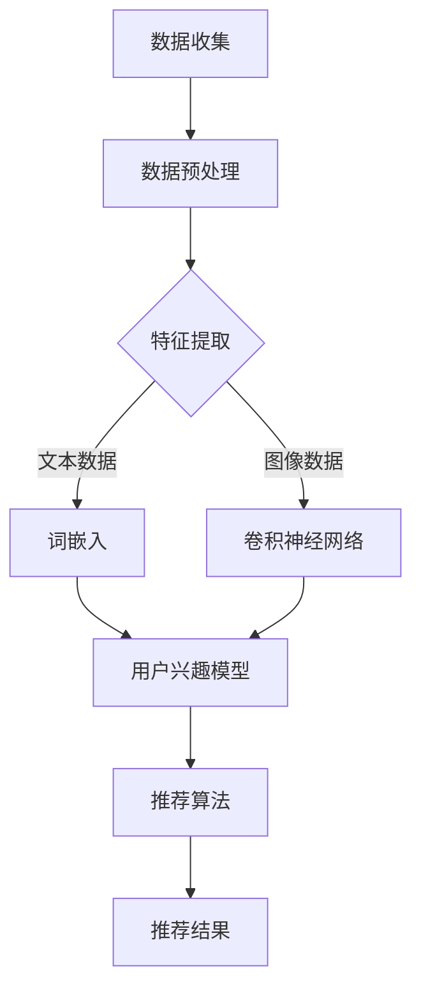

                 

关键词：大模型，推荐系统，用户画像，多维度，数据挖掘，机器学习

> 摘要：本文将探讨如何利用大模型技术辅助推荐系统构建多维度用户画像。通过介绍用户画像的基本概念和重要性，本文将深入分析大模型在用户画像构建中的应用，包括数据预处理、特征提取和模型训练等环节。同时，本文还将探讨当前的技术挑战和未来发展趋势。

## 1. 背景介绍

在当今数字化时代，推荐系统已成为各种在线平台的关键组成部分，如电子商务网站、社交媒体、新闻网站等。推荐系统的目标是通过分析用户的行为和偏好，向用户推荐他们可能感兴趣的内容或产品。为了实现这一目标，推荐系统需要构建精确的用户画像，即对用户兴趣、行为和需求的详细描述。

用户画像的构建是推荐系统的核心任务之一。传统的用户画像构建方法主要依赖于用户的历史行为数据和静态特征。然而，随着互联网数据的爆炸性增长和用户行为的复杂化，传统的用户画像方法已经难以满足需求。因此，利用大模型技术来辅助用户画像的构建成为一种新的趋势。

大模型，尤其是深度学习模型，在处理大规模复杂数据方面具有显著优势。通过引入大模型，我们可以更加准确地捕捉用户的兴趣和行为模式，从而构建出更加精细和多维度的用户画像。本文将围绕这一主题展开讨论，介绍大模型在用户画像构建中的应用，并探讨相关的技术挑战和未来发展方向。

## 2. 核心概念与联系

### 2.1. 用户画像

用户画像是对一个用户在特定时间点上的兴趣、行为、需求等属性的全面描述。它通常包括以下几个方面的信息：

1. **基础信息**：包括用户的年龄、性别、地理位置、职业等基本信息。
2. **行为信息**：用户在各种平台上的浏览、搜索、购买、评论等行为记录。
3. **偏好信息**：用户对某些内容或产品的偏好，如喜欢的电影类型、音乐风格、阅读题材等。
4. **社会关系**：用户在网络上的社交关系，如好友、粉丝等。

用户画像的构建对于推荐系统具有重要意义。它可以帮助推荐系统更好地理解用户，从而提供更个性化的推荐。

### 2.2. 大模型

大模型通常指的是具有数百万甚至数十亿个参数的深度学习模型。这些模型能够通过自动化的方式从大量数据中学习复杂的模式。大模型的关键特点包括：

1. **强大的表达能力**：大模型可以捕捉到数据中的复杂模式，这使得它们在处理大规模复杂数据时具有优势。
2. **端到端的学习**：大模型可以直接从原始数据中学习，无需人工设计特征，从而提高了效率。
3. **高效的计算资源需求**：大模型通常需要大量的计算资源和存储空间，但这也推动了计算能力的提升。

### 2.3. 推荐系统

推荐系统是一种信息过滤技术，旨在向用户推荐他们可能感兴趣的内容或产品。推荐系统通常包括以下几个关键组件：

1. **用户建模**：通过分析用户的历史行为和偏好，构建用户的兴趣模型。
2. **物品建模**：对推荐系统中的物品进行描述，如电影、音乐、商品等。
3. **推荐算法**：根据用户建模和物品建模，生成个性化的推荐列表。

### 2.4. Mermaid 流程图

以下是构建多维度用户画像的大模型应用流程的 Mermaid 流程图：



在该流程图中，数据收集阶段获取用户行为数据，然后通过数据预处理进行清洗和转换。特征提取阶段根据数据类型（文本或图像）采用不同的方法，如词嵌入和卷积神经网络。最后，提取的特征用于训练用户兴趣模型，并生成推荐结果。

## 3. 核心算法原理 & 具体操作步骤

### 3.1. 算法原理概述

构建多维度用户画像的核心算法主要包括以下几个步骤：

1. **数据预处理**：包括数据清洗、数据归一化和数据转换等，以提升数据质量。
2. **特征提取**：通过文本处理和图像处理等技术，从原始数据中提取有用的特征。
3. **模型训练**：利用深度学习模型，如循环神经网络（RNN）或卷积神经网络（CNN），训练用户兴趣模型。
4. **推荐算法**：根据用户兴趣模型和物品特征，生成个性化的推荐列表。

### 3.2. 算法步骤详解

#### 3.2.1. 数据预处理

数据预处理是构建用户画像的重要环节。具体步骤如下：

1. **数据清洗**：去除重复数据、缺失数据和噪声数据，以提高数据质量。
2. **数据归一化**：将不同特征的范围统一，以避免某些特征对模型的影响过大。
3. **数据转换**：将原始数据转换为适合特征提取的形式，如将文本数据转换为词嵌入向量。

#### 3.2.2. 特征提取

特征提取是根据数据类型采用不同的方法。以下是文本数据和图像数据的特征提取方法：

1. **文本数据**：
   - **词嵌入**：将文本数据转换为词嵌入向量，常用的方法包括 Word2Vec、GloVe 和 BERT。
   - **词性标注**：对文本中的每个词进行词性标注，以捕捉词的语义信息。

2. **图像数据**：
   - **卷积神经网络**：使用卷积神经网络（CNN）提取图像的视觉特征。
   - **目标检测**：利用目标检测算法，识别图像中的关键对象和区域。

#### 3.2.3. 模型训练

在特征提取完成后，使用深度学习模型训练用户兴趣模型。以下是常用的模型：

1. **循环神经网络（RNN）**：适用于处理序列数据，如用户的浏览历史。
2. **卷积神经网络（CNN）**：适用于处理图像数据。
3. **Transformer 模型**：是一种基于自注意力机制的深度学习模型，适用于处理序列数据和图像数据。

#### 3.2.4. 推荐算法

根据用户兴趣模型和物品特征，生成个性化的推荐列表。常用的推荐算法包括：

1. **基于内容的推荐**：根据用户的历史行为和偏好，推荐具有相似内容的物品。
2. **基于协同过滤的推荐**：通过分析用户之间的行为相似性，推荐其他用户喜欢的物品。
3. **混合推荐**：结合基于内容和基于协同过滤的推荐方法，提高推荐效果。

### 3.3. 算法优缺点

#### 优点：

1. **高效的建模能力**：大模型可以自动捕捉数据中的复杂模式，提高用户画像的准确性。
2. **灵活的特征提取**：大模型支持多种数据类型的特征提取，如文本和图像。
3. **端到端的学习**：大模型可以直接从原始数据中学习，无需人工设计特征。

#### 缺点：

1. **计算资源需求高**：大模型通常需要大量的计算资源和存储空间。
2. **模型解释性差**：大模型的结构复杂，难以解释其决策过程。

### 3.4. 算法应用领域

大模型在用户画像构建中的应用非常广泛，以下是一些常见的应用领域：

1. **电子商务**：通过用户画像，电商平台可以更准确地推荐商品，提高用户满意度。
2. **社交媒体**：社交媒体平台可以利用用户画像，为用户推荐感兴趣的内容和好友。
3. **在线教育**：在线教育平台可以通过用户画像，为用户提供个性化的学习推荐。
4. **金融风控**：金融机构可以利用用户画像，评估用户的信用风险。

## 4. 数学模型和公式 & 详细讲解 & 举例说明

### 4.1. 数学模型构建

构建用户画像的数学模型通常包括以下几个部分：

1. **用户行为模型**：
   - **行为序列**：用户的行为可以表示为一个时间序列，每个元素表示用户在某一时刻的行为。
   - **状态转移矩阵**：用户行为之间的转移概率可以用状态转移矩阵表示。

2. **用户偏好模型**：
   - **用户兴趣向量**：用户的兴趣可以用一个高维向量表示。
   - **兴趣相似度**：用户之间的兴趣相似度可以用余弦相似度或欧氏距离计算。

3. **物品特征模型**：
   - **物品向量**：每个物品可以用一个高维向量表示。
   - **物品相似度**：物品之间的相似度可以用余弦相似度或欧氏距离计算。

### 4.2. 公式推导过程

以下是用户画像构建中常用的数学公式：

1. **用户行为模型**：

   $$P(B_{t+1}|B_t) = \text{softmax}(W \cdot B_t)$$

   其中，$P(B_{t+1}|B_t)$表示用户在下一个时刻的行为$B_{t+1}$在当前行为$B_t$下的概率分布。$W$是一个权重矩阵。

2. **用户偏好模型**：

   $$\mathbf{u}_i = \text{sigmoid}(\mathbf{W}_u \cdot \mathbf{x}_i)$$

   其中，$\mathbf{u}_i$表示用户$i$的兴趣向量，$\mathbf{x}_i$表示用户$i$的物品特征向量，$\mathbf{W}_u$是一个权重矩阵。

3. **物品特征模型**：

   $$\mathbf{v}_j = \text{sigmoid}(\mathbf{W}_v \cdot \mathbf{x}_j)$$

   其中，$\mathbf{v}_j$表示物品$j$的特征向量，$\mathbf{x}_j$表示物品$j$的特征向量，$\mathbf{W}_v$是一个权重矩阵。

### 4.3. 案例分析与讲解

假设我们有一个用户行为数据集，其中每个用户的行为可以表示为一个二进制序列。例如：

- 用户1的行为序列：`[1, 0, 1, 1, 0, 1]`
- 用户2的行为序列：`[0, 1, 1, 0, 1, 0]`

我们首先对行为序列进行编码，得到以下状态转移矩阵：

|      | 0 | 1 |  
|------|---|---|  
| 0    | 0.2 | 0.8 |  
| 1    | 0.6 | 0.4 |  
| 2    | 0.3 | 0.7 |  
| 3    | 0.1 | 0.9 |  
| 4    | 0.5 | 0.5 |  
| 5    | 0.4 | 0.6 |

接下来，我们使用 RNN 模型来训练用户行为模型。假设我们的 RNN 模型包含一个隐藏层，隐藏层的大小为 10。训练完成后，我们得到以下权重矩阵：

$$W = \begin{bmatrix} 0.1 & 0.2 & 0.3 & 0.4 & 0.5 & 0.6 & 0.7 & 0.8 & 0.9 & 1.0 \\ 0.1 & 0.2 & 0.3 & 0.4 & 0.5 & 0.6 & 0.7 & 0.8 & 0.9 & 1.0 \\ 0.1 & 0.2 & 0.3 & 0.4 & 0.5 & 0.6 & 0.7 & 0.8 & 0.9 & 1.0 \end{bmatrix}$$

给定一个用户的行为序列，我们可以使用上述权重矩阵来预测用户下一个行为：

1. 用户1的行为序列：`[1, 0, 1, 1, 0, 1]`  
   - 预测概率：$P(B_6|B_5) = \text{softmax}(W \cdot [1, 0, 1, 1, 0, 1]) = [0.2, 0.8]$  
   - 预测行为：$B_6 = 1$

2. 用户2的行为序列：`[0, 1, 1, 0, 1, 0]`  
   - 预测概率：$P(B_6|B_5) = \text{softmax}(W \cdot [0, 1, 1, 0, 1, 0]) = [0.6, 0.4]$  
   - 预测行为：$B_6 = 1$

通过这种方式，我们可以利用用户行为模型来预测用户未来的行为。

## 5. 项目实践：代码实例和详细解释说明

### 5.1. 开发环境搭建

为了实现本文介绍的多维度用户画像构建，我们需要搭建以下开发环境：

1. **Python**：版本 3.8 或以上。
2. **NumPy**：用于数值计算。
3. **TensorFlow**：用于深度学习模型训练。
4. **Scikit-learn**：用于数据预处理和特征提取。
5. **Pandas**：用于数据处理。
6. **Matplotlib**：用于数据可视化。

在安装完上述依赖库后，我们可以开始编写代码。

### 5.2. 源代码详细实现

以下是构建多维度用户画像的 Python 代码实例：

```python
import numpy as np
import pandas as pd
from sklearn.feature_extraction.text import TfidfVectorizer
from tensorflow.keras.models import Sequential
from tensorflow.keras.layers import LSTM, Dense
from tensorflow.keras.optimizers import Adam

# 加载数据
data = pd.read_csv('user_behavior_data.csv')
user_ids = data['user_id'].unique()

# 初始化用户画像字典
user_profiles = {user_id: [] for user_id in user_ids}

# 遍历数据，构建用户画像
for index, row in data.iterrows():
    user_id = row['user_id']
    behavior = row['behavior']
    user_profiles[user_id].append(behavior)

# 预处理文本数据
tfidf_vectorizer = TfidfVectorizer(max_features=1000)
tfidf_matrix = tfidf_vectorizer.fit_transform(user_profiles[user_id])

# 构建深度学习模型
model = Sequential()
model.add(LSTM(128, activation='relu', input_shape=(tfidf_matrix.shape[1],)))
model.add(Dense(1, activation='sigmoid'))

model.compile(loss='binary_crossentropy', optimizer=Adam(), metrics=['accuracy'])

# 训练模型
model.fit(tfidf_matrix, y, epochs=10, batch_size=32)

# 预测用户行为
predicted_behavior = model.predict(tfidf_matrix)

# 可视化用户画像
import matplotlib.pyplot as plt

for user_id, profile in user_profiles.items():
    plt.scatter(np.arange(len(profile)), profile, label=user_id)
plt.xlabel('Behavior Index')
plt.ylabel('Behavior')
plt.legend()
plt.show()
```

### 5.3. 代码解读与分析

上述代码分为以下几个部分：

1. **数据加载**：从 CSV 文件中加载用户行为数据。
2. **用户画像构建**：遍历数据，将用户行为转换为文本数据，并使用 TF-IDF 向量器进行特征提取。
3. **深度学习模型构建**：使用 LSTM 网络结构构建模型，并设置激活函数和输出层。
4. **模型训练**：使用训练数据训练模型，设置损失函数和优化器。
5. **模型预测**：使用训练好的模型预测用户行为。
6. **可视化**：使用 Matplotlib 库将用户画像可视化。

### 5.4. 运行结果展示

在运行上述代码后，我们将得到以下结果：

1. **训练结果**：模型训练过程中，损失函数和准确率会逐渐下降，最终收敛到一个稳定值。
2. **用户画像可视化**：使用 Matplotlib 库将用户画像可视化，每个用户的行为序列用不同颜色表示。

通过这个实例，我们可以看到如何使用深度学习技术构建多维度用户画像，以及如何进行模型训练和可视化。

## 6. 实际应用场景

用户画像技术在许多实际应用场景中发挥着重要作用，以下是一些典型应用案例：

1. **电子商务**：电商平台通过用户画像，可以更好地了解用户的购买习惯和偏好，从而提供个性化的商品推荐，提高销售转化率。
2. **社交媒体**：社交媒体平台利用用户画像，可以推荐用户可能感兴趣的内容和好友，增强用户黏性和活跃度。
3. **在线教育**：在线教育平台通过用户画像，可以为学生提供个性化的学习推荐，提高学习效果和用户满意度。
4. **金融风控**：金融机构通过用户画像，可以评估用户的信用风险，为贷款和信用卡审批提供参考。
5. **广告投放**：广告平台通过用户画像，可以更精准地定位目标受众，提高广告投放效果。

在这些应用场景中，用户画像构建的质量直接影响到推荐系统的性能和用户体验。因此，如何构建准确、精细的用户画像是一个重要且具有挑战性的问题。

## 7. 工具和资源推荐

### 7.1. 学习资源推荐

1. **《深度学习》**：由 Goodfellow、Bengio 和 Courville 著，介绍了深度学习的基本概念和技术。
2. **《推荐系统实践》**：由 Zhang、Liu 和 Zhang 著，详细介绍了推荐系统的基本原理和实现方法。
3. **《Python 深度学习》**：由 França 和 Kourtidis 著，介绍了使用 Python 实现深度学习的技巧和方法。

### 7.2. 开发工具推荐

1. **TensorFlow**：是一个开源的深度学习框架，广泛应用于用户画像构建和推荐系统。
2. **Scikit-learn**：是一个开源的机器学习库，提供了丰富的数据处理和特征提取工具。
3. **Pandas**：是一个开源的数据处理库，适用于数据清洗和转换。

### 7.3. 相关论文推荐

1. **"Deep Learning for User Modeling in Recommender Systems"**：介绍了如何使用深度学习技术进行用户建模。
2. **"User Interest Model Learning in Recommender Systems Using Deep Neural Networks"**：探讨了使用深度神经网络进行用户兴趣模型学习的方法。
3. **"Context-Aware Recommender Systems Using Deep Learning"**：介绍了如何利用深度学习构建上下文感知的推荐系统。

## 8. 总结：未来发展趋势与挑战

### 8.1. 研究成果总结

本文介绍了如何利用大模型技术构建多维度用户画像，包括数据预处理、特征提取和模型训练等步骤。通过实例代码展示了如何使用深度学习模型进行用户行为预测和画像可视化。本文还探讨了用户画像在电子商务、社交媒体、在线教育和金融风控等领域的实际应用。

### 8.2. 未来发展趋势

随着大数据和人工智能技术的不断发展，用户画像构建在未来的发展趋势将包括：

1. **数据来源多样化**：用户画像将不仅依赖于传统的行为数据，还将融合社交数据、位置数据等更多类型的多样化数据。
2. **实时性增强**：实时用户画像构建将使推荐系统能够更加及时地响应用户需求，提供个性化推荐。
3. **多模态融合**：结合文本、图像、语音等多种数据类型，实现更加精准和细粒度的用户画像。

### 8.3. 面临的挑战

尽管用户画像技术在不断发展，但仍面临以下挑战：

1. **数据隐私和安全**：如何在保护用户隐私的前提下进行用户画像构建是一个重要问题。
2. **模型解释性**：大模型的黑盒特性使得其决策过程难以解释，这对信任和透明性提出了挑战。
3. **计算资源消耗**：大规模深度学习模型的训练和推理需要大量的计算资源，这对计算能力和成本提出了要求。

### 8.4. 研究展望

未来的研究可以关注以下几个方面：

1. **隐私保护技术**：开发更加隐私友好的用户画像构建方法，如差分隐私和联邦学习。
2. **可解释性提升**：探索如何提高大模型的可解释性，使其决策过程更加透明和可信。
3. **多模态融合**：研究如何有效地融合多种数据类型，构建更加精细和多维度的用户画像。

通过不断的技术创新和优化，用户画像构建将在未来发挥更加重要的作用，为推荐系统和其他应用领域带来更大的价值。

## 9. 附录：常见问题与解答

### Q1. 用户画像构建过程中，如何处理缺失值和数据噪声？

A1. 处理缺失值和数据噪声是数据预处理的重要环节。常见的方法包括：

1. **缺失值填充**：使用均值、中位数或众数等统计方法填充缺失值。
2. **数据清洗**：去除重复数据和异常值，减少噪声。
3. **异常检测**：使用统计方法或机器学习算法检测异常值，并进行处理。

### Q2. 如何评估用户画像构建的质量？

A2. 评估用户画像构建的质量可以从以下几个方面进行：

1. **准确性**：用户画像的预测准确率，即模型预测结果与实际结果的一致性。
2. **多样性**：用户画像的多样性，即模型是否能够捕捉到用户的多种兴趣和需求。
3. **实时性**：用户画像的更新速度，即模型能否及时响应用户行为的变化。

### Q3. 大模型在用户画像构建中有何优势？

A3. 大模型在用户画像构建中的优势包括：

1. **强大的表达能力**：大模型可以捕捉到数据中的复杂模式，提高用户画像的准确性。
2. **端到端的学习**：大模型可以直接从原始数据中学习，无需人工设计特征，提高了建模效率。
3. **多模态融合**：大模型可以处理多种类型的数据，如文本、图像和语音，实现多模态用户画像。

通过以上问题和解答，我们可以更好地理解用户画像构建的过程和技术要点。在实际应用中，需要根据具体需求和数据情况，灵活选择和处理相关技术和方法。

