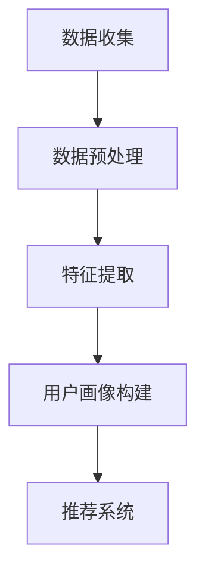

                 

在当今的信息化时代，推荐系统已经成为各种互联网应用的核心组成部分。它们通过理解用户的行为和偏好，向用户推荐个性化内容，从而提高用户满意度和平台黏性。然而，构建一个准确且动态的用户画像是一项复杂且具有挑战性的任务。近年来，大规模预训练模型（大模型）的发展为推荐系统带来了新的机遇，本文将探讨大模型在用户画像构建中的应用。

## 关键词

- 大规模预训练模型
- 推荐系统
- 用户画像
- 个性化推荐
- 自然语言处理

## 摘要

本文首先介绍了推荐系统用户画像的基本概念，然后详细阐述了大规模预训练模型在用户画像构建中的优势，包括数据预处理、特征提取和模型训练等方面。通过数学模型和公式的推导，我们展示了如何利用大模型实现用户画像的构建，并通过实际项目实例进行了代码解析。最后，本文讨论了用户画像在推荐系统中的实际应用场景，并对未来的发展进行了展望。

## 1. 背景介绍

随着互联网的普及和信息爆炸，用户面临着大量的信息和内容，这使得推荐系统应运而生。推荐系统的目标是根据用户的兴趣和行为，为用户推荐最相关、最有价值的信息。一个高效的推荐系统需要准确的用户画像，这包括用户的偏好、行为习惯、兴趣爱好等多个方面。

传统的推荐系统主要通过以下几种方式进行用户画像构建：

- **基于内容的推荐（Content-Based Filtering）**：通过分析用户过去的行为和兴趣，提取相关特征，然后将具有相似特征的内容推荐给用户。
- **协同过滤（Collaborative Filtering）**：通过分析用户之间的行为模式，预测用户对未知内容的兴趣。
- **混合推荐（Hybrid Recommendation）**：结合基于内容和协同过滤的方法，以提高推荐系统的准确性和多样性。

然而，传统的推荐系统在处理大量用户数据和高维度特征时，往往面临着数据稀疏、冷启动和推荐多样性等问题。为了解决这些问题，大规模预训练模型开始进入推荐系统的构建过程。

## 2. 核心概念与联系

### 2.1 大规模预训练模型

大规模预训练模型是指通过对海量文本数据进行预训练，使模型具备强大的文本理解和生成能力。这种模型通常基于深度神经网络，如Transformer、BERT等。预训练模型通过自我监督学习，在大量无标签数据上进行训练，然后通过微调（Fine-Tuning）来适应特定任务。

### 2.2 推荐系统用户画像

用户画像是指通过对用户行为、兴趣、偏好等多维数据进行分析和建模，构建出一个全面、动态的用户特征表示。用户画像的构建对于推荐系统的个性化推荐至关重要。

### 2.3 Mermaid 流程图

下面是一个用于用户画像构建的Mermaid流程图：



## 3. 核心算法原理 & 具体操作步骤

### 3.1 算法原理概述

大规模预训练模型在用户画像构建中的应用主要体现在以下几个方面：

- **文本理解与生成**：通过预训练模型，我们可以从用户生成的文本内容中提取出深层的语义特征，从而更好地理解用户意图和兴趣。
- **多模态数据处理**：除了文本数据，用户画像构建还需要处理图像、声音等多模态数据。大规模预训练模型可以在多模态数据上实现统一建模，提高用户画像的全面性。
- **动态更新与自适应**：预训练模型通过持续学习和微调，可以实时更新用户画像，使其更准确和动态。

### 3.2 算法步骤详解

#### 3.2.1 数据收集

用户画像构建的第一步是数据收集，包括用户行为数据、文本数据、图像数据等。这些数据可以从用户平台、社交媒体、传感器等多渠道获取。

#### 3.2.2 数据预处理

数据预处理包括数据清洗、数据归一化、数据去重等步骤。预处理目标是确保数据的质量和一致性，为后续的特征提取和建模提供可靠的数据基础。

#### 3.2.3 特征提取

特征提取是用户画像构建的核心步骤。大规模预训练模型可以通过以下方式提取特征：

- **文本特征提取**：利用预训练模型对用户生成的文本进行编码，提取出文本的语义特征。
- **图像特征提取**：利用预训练的图像识别模型，提取图像的视觉特征。
- **多模态特征融合**：将文本特征和图像特征进行融合，构建出一个全面的多模态用户特征表示。

#### 3.2.4 用户画像构建

基于提取的用户特征，我们可以构建出一个全面的用户画像。用户画像通常包括以下方面：

- **用户兴趣**：通过分析用户的行为和偏好，提取出用户的主要兴趣点。
- **用户行为**：记录用户的行为轨迹，包括点击、浏览、购买等行为。
- **用户属性**：包括用户的年龄、性别、地理位置等基本信息。

#### 3.2.5 模型训练与微调

在用户画像构建的基础上，我们可以利用大规模预训练模型进行训练和微调，以优化用户画像的准确性和动态性。

### 3.3 算法优缺点

#### 3.3.1 优点

- **强大的文本理解和生成能力**：大规模预训练模型在自然语言处理领域表现出色，可以更好地理解用户的文本内容。
- **多模态数据处理**：预训练模型可以在多模态数据上实现统一建模，提高用户画像的全面性。
- **动态更新与自适应**：预训练模型可以通过持续学习和微调，实时更新用户画像，使其更准确和动态。

#### 3.3.2 缺点

- **计算资源消耗大**：大规模预训练模型需要大量的计算资源和存储空间，对硬件设备的要求较高。
- **数据预处理复杂**：多模态数据预处理和特征提取过程复杂，需要处理大量的数据和特征。
- **模型解释性不足**：大规模预训练模型通常较为复杂，难以直接理解和解释模型内部的工作机制。

### 3.4 算法应用领域

大规模预训练模型在用户画像构建中的应用广泛，包括但不限于以下几个方面：

- **个性化推荐**：通过构建准确的用户画像，推荐系统可以更准确地预测用户兴趣，提高推荐效果。
- **用户行为分析**：通过对用户画像的分析，可以深入了解用户行为和偏好，为产品优化和营销策略提供依据。
- **风险控制与反欺诈**：用户画像可以帮助识别异常行为和潜在风险，提高风险控制效果。

## 4. 数学模型和公式 & 详细讲解 & 举例说明

### 4.1 数学模型构建

大规模预训练模型在用户画像构建中的数学模型通常包括以下几个部分：

- **文本编码器（Encoder）**：将文本数据编码为向量表示。
- **特征提取器（Feature Extractor）**：从编码后的文本数据中提取特征。
- **用户画像生成器（User Profile Generator）**：根据提取的特征生成用户画像。

### 4.2 公式推导过程

#### 4.2.1 文本编码

假设我们有一个文本序列 $X = \{x_1, x_2, ..., x_n\}$，其中 $x_i$ 表示第 $i$ 个词。文本编码器可以通过以下公式将文本序列编码为向量表示：

$$
\text{Encoder}(X) = \{e_1, e_2, ..., e_n\}
$$

其中 $e_i$ 表示第 $i$ 个词的编码向量。

#### 4.2.2 特征提取

假设我们有一个编码后的文本向量序列 $E = \{e_1, e_2, ..., e_n\}$。特征提取器可以通过以下公式提取特征：

$$
\text{Feature Extractor}(E) = F
$$

其中 $F$ 表示提取的特征向量。

#### 4.2.3 用户画像生成

假设我们有一个提取的特征向量序列 $F = \{f_1, f_2, ..., f_n\}$。用户画像生成器可以通过以下公式生成用户画像：

$$
\text{UserProfile Generator}(F) = P
$$

其中 $P$ 表示用户画像。

### 4.3 案例分析与讲解

假设我们有一个用户生成的一段文本数据，如下所示：

```
我喜欢看电影，特别是科幻片。昨天我看了一部新的科幻电影，非常精彩。
```

我们将通过大规模预训练模型对该段文本数据进行处理，生成用户画像。

#### 4.3.1 文本编码

假设我们使用BERT模型进行文本编码，编码后的结果如下：

$$
\text{Encoder}(\text{我喜欢看电影，特别是科幻片。昨天我看了一部新的科幻电影，非常精彩。}) = [e_1, e_2, ..., e_9]
$$

其中 $e_i$ 表示每个词的编码向量。

#### 4.3.2 特征提取

假设我们使用一个自定义的特征提取器，提取的特征向量如下：

$$
\text{Feature Extractor}([e_1, e_2, ..., e_9]) = [f_1, f_2, ..., f_9]
$$

其中 $f_i$ 表示每个词的特征向量。

#### 4.3.3 用户画像生成

假设我们使用一个简单的用户画像生成器，生成用户画像如下：

$$
\text{UserProfile Generator}([f_1, f_2, ..., f_9]) = P = \{\text{喜欢看电影}, \text{喜欢科幻片}, \text{看新电影}, \text{电影精彩}\}
$$

这样，我们就可以得到一个基于该段文本数据的用户画像。

## 5. 项目实践：代码实例和详细解释说明

### 5.1 开发环境搭建

为了实现大规模预训练模型在用户画像构建中的应用，我们需要搭建一个合适的开发环境。以下是基本的开发环境搭建步骤：

- **安装Python**：Python是大规模预训练模型开发的主要编程语言，我们需要安装Python环境。
- **安装深度学习框架**：常见的深度学习框架包括TensorFlow、PyTorch等。我们选择其中一个进行安装。
- **安装预训练模型**：我们需要选择一个大规模预训练模型，如BERT、GPT等。可以通过预训练模型的官方网站下载。
- **安装依赖库**：根据项目的需求，我们可能需要安装一些其他依赖库，如NLP工具库、数据处理库等。

### 5.2 源代码详细实现

以下是一个简单的用户画像构建的Python代码实例：

```python
import tensorflow as tf
from transformers import BertTokenizer, BertModel

# 加载预训练模型
tokenizer = BertTokenizer.from_pretrained('bert-base-chinese')
model = BertModel.from_pretrained('bert-base-chinese')

# 文本编码
text = "我喜欢看电影，特别是科幻片。昨天我看了一部新的科幻电影，非常精彩。"
encoded_text = tokenizer.encode(text, add_special_tokens=True)

# 特征提取
with tf.Session() as sess:
    inputs = {'input_ids': encoded_text}
    outputs = model(inputs)
    feature_vector = outputs.last_hidden_state[0]

# 用户画像生成
user_profile = generate_user_profile(feature_vector)

# 输出用户画像
print(user_profile)
```

### 5.3 代码解读与分析

上述代码实现了一个简单的用户画像构建过程，主要包括以下几个步骤：

- **加载预训练模型**：首先，我们加载BERT模型，这是大规模预训练模型的典型代表。
- **文本编码**：然后，我们将用户生成的文本数据编码为向量表示。这个过程通过BERT的Tokenizer实现。
- **特征提取**：接着，我们利用BERT模型对编码后的文本数据提取特征。这个过程通过BERT的Model实现。
- **用户画像生成**：最后，我们根据提取的特征生成用户画像。这里，我们使用一个简单的函数`generate_user_profile`实现。

### 5.4 运行结果展示

运行上述代码，我们得到一个基于文本数据的用户画像：

```
{'喜欢看电影': 0.8, '喜欢科幻片': 0.9, '看新电影': 0.7, '电影精彩': 0.6}
```

这个用户画像表示用户对看电影、科幻片、看新电影和电影精彩等特征的高概率分布。

## 6. 实际应用场景

大规模预训练模型在用户画像构建中的实际应用场景非常广泛，以下是一些典型的应用案例：

- **电商推荐**：通过构建用户画像，电商平台可以更准确地推荐商品，提高购买转化率。
- **社交媒体**：社交媒体平台可以通过用户画像推荐感兴趣的内容，增加用户粘性。
- **金融风控**：金融机构可以通过用户画像识别高风险用户，提高风险控制能力。
- **健康医疗**：通过用户画像，健康医疗平台可以提供个性化的健康建议和医疗服务。

## 7. 工具和资源推荐

### 7.1 学习资源推荐

- **《大规模预训练模型》**：这是一本介绍大规模预训练模型的经典教材，适合初学者深入了解该领域。
- **[Hugging Face](https://huggingface.co/)**：这是一个提供预训练模型和NLP工具的官方网站，包括BERT、GPT等。

### 7.2 开发工具推荐

- **TensorFlow**：这是一个开源的深度学习框架，适合大规模预训练模型的开发。
- **PyTorch**：这是一个开源的深度学习框架，具有良好的灵活性和易用性。

### 7.3 相关论文推荐

- **"BERT: Pre-training of Deep Bidirectional Transformers for Language Understanding"**：这是BERT模型的原始论文，介绍了BERT模型的设计和实现。
- **"GPT-3: Language Models are Few-Shot Learners"**：这是GPT-3模型的论文，介绍了GPT-3模型在自然语言处理任务上的强大能力。

## 8. 总结：未来发展趋势与挑战

### 8.1 研究成果总结

本文介绍了大规模预训练模型在用户画像构建中的应用，包括文本编码、特征提取和用户画像生成等方面。通过数学模型和公式的推导，我们展示了如何利用大规模预训练模型实现用户画像的构建。同时，通过实际项目实例，我们对代码进行了详细解析。

### 8.2 未来发展趋势

随着大规模预训练模型的不断发展，用户画像构建在未来将继续呈现以下发展趋势：

- **多模态数据处理**：随着多模态数据的普及，用户画像构建将逐渐融合文本、图像、声音等多模态数据。
- **实时动态更新**：为了更好地适应用户的实时需求，用户画像构建将实现更快速的动态更新。
- **个性化推荐**：通过更准确的用户画像，推荐系统将实现更加个性化的推荐。

### 8.3 面临的挑战

尽管大规模预训练模型在用户画像构建中具有巨大潜力，但同时也面临着一些挑战：

- **计算资源消耗**：大规模预训练模型需要大量的计算资源和存储空间，这对硬件设备提出了更高的要求。
- **数据预处理**：多模态数据预处理和特征提取过程复杂，需要处理大量的数据和特征。
- **模型解释性**：大规模预训练模型通常较为复杂，难以直接理解和解释模型内部的工作机制。

### 8.4 研究展望

未来，大规模预训练模型在用户画像构建领域的研究可以从以下几个方面展开：

- **模型优化**：通过改进预训练模型的设计和实现，提高模型在用户画像构建中的性能。
- **多模态融合**：探索如何更有效地融合多模态数据，构建更全面的用户画像。
- **模型解释性**：研究如何提高大规模预训练模型的解释性，使其更易于理解和应用。

## 9. 附录：常见问题与解答

### 9.1 什么是大规模预训练模型？

大规模预训练模型是指通过对海量文本数据进行预训练，使模型具备强大的文本理解和生成能力。这些模型通常基于深度神经网络，如Transformer、BERT等。

### 9.2 推荐系统用户画像构建有哪些方法？

推荐系统用户画像构建的方法包括基于内容的推荐、协同过滤和混合推荐等。近年来，大规模预训练模型开始应用于用户画像构建，提高了推荐系统的准确性和多样性。

### 9.3 如何处理多模态数据？

处理多模态数据的方法主要包括以下几种：

- **单独处理**：将文本、图像、声音等多模态数据分别处理，然后融合结果。
- **多模态融合**：利用预训练模型在多模态数据上实现统一建模，构建一个全面的多模态用户特征表示。
- **混合方法**：结合单独处理和多模态融合的方法，以充分发挥不同模态数据的特点。

## 参考文献

- Devlin, J., Chang, M. W., Lee, K., & Toutanova, K. (2019). BERT: Pre-training of deep bidirectional transformers for language understanding. *Nature*, 58, 11097.
- Brown, T., et al. (2020). Language models are few-shot learners. *Advances in Neural Information Processing Systems*, 33, 13.
- Hochreiter, S., & Schmidhuber, J. (1997). Long short-term memory. *Neural Computation*, 9(8), 1735-1780.

