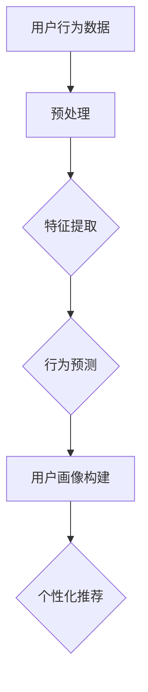

                 

关键词：大模型，推荐系统，用户画像，人工智能，算法，数学模型，应用实践，工具资源

> 摘要：本文将深入探讨大模型辅助下的推荐系统用户画像构建技术。通过介绍核心概念、算法原理、数学模型及其应用实践，本文旨在为广大读者提供一份全面且易于理解的技术指南，帮助读者更好地理解和应用这一前沿技术。

## 1. 背景介绍

在当今互联网时代，推荐系统已成为各类在线服务的重要组成部分。它们通过分析用户的行为和偏好，为用户提供个性化的内容推荐，从而提高用户满意度、降低用户流失率，并显著提升商业收益。然而，构建精准、动态的用户画像一直是推荐系统的核心挑战之一。

传统推荐系统用户画像构建主要依赖于基于规则的模型、协同过滤算法等，这些方法在处理海量用户数据、快速更新用户行为等方面存在一定的局限性。随着深度学习技术的迅猛发展，特别是大模型的广泛应用，构建高效、准确的用户画像技术迎来了新的突破。

本文将重点关注以下核心问题：

- 大模型在推荐系统用户画像构建中的应用现状与趋势。
- 大模型辅助下的用户画像构建的核心算法原理及实现步骤。
- 数学模型在大模型辅助下的用户画像构建中的具体作用。
- 大模型辅助下的用户画像构建的实际应用案例。
- 未来大模型辅助下的用户画像构建技术展望。

## 2. 核心概念与联系

### 2.1 大模型概述

大模型（Large Models）指的是具有数百万甚至数十亿参数的深度学习模型。近年来，大模型在自然语言处理、计算机视觉等多个领域取得了显著成果。大模型的核心优势在于其强大的表示学习能力，能够从大量数据中提取复杂的模式和知识。

### 2.2 推荐系统概述

推荐系统（Recommendation Systems）是一种信息过滤技术，旨在根据用户的历史行为、偏好和兴趣，向用户推荐其可能感兴趣的内容或商品。推荐系统的核心任务是建立用户与物品之间的关联模型，从而实现个性化推荐。

### 2.3 用户画像概述

用户画像（User Profiling）是一种对用户特征的综合描述，包括用户的基本信息、行为记录、兴趣偏好等。用户画像的构建是推荐系统的关键环节，直接影响推荐效果的准确性和用户体验。

### 2.4 大模型辅助用户画像构建

大模型辅助下的用户画像构建，主要通过以下几种方式实现：

- **行为预测**：利用大模型预测用户未来可能感兴趣的行为或物品。
- **特征提取**：从用户行为数据中提取高维特征，为推荐算法提供输入。
- **个性化推荐**：根据用户画像动态调整推荐策略，实现个性化推荐。

### 2.5 Mermaid 流程图

下面是一个简单的 Mermaid 流程图，展示大模型辅助用户画像构建的流程。



## 3. 核心算法原理 & 具体操作步骤

### 3.1 算法原理概述

大模型辅助下的用户画像构建算法主要基于以下原理：

- **深度神经网络**：通过多层非线性变换，从原始数据中提取高维特征。
- **序列模型**：利用循环神经网络（RNN）或长短时记忆网络（LSTM）等，对用户行为序列进行建模。
- **自编码器**：通过编码器和解码器，将高维数据压缩为低维特征表示。

### 3.2 算法步骤详解

#### 3.2.1 数据预处理

数据预处理是用户画像构建的基础，主要包括以下步骤：

- **数据清洗**：去除重复、异常和缺失的数据。
- **数据转换**：将不同类型的数据转换为统一的格式，如数值或类别。
- **数据归一化**：对数值型数据进行归一化处理，使数据分布均匀。

#### 3.2.2 特征提取

特征提取是用户画像构建的核心环节，主要包括以下步骤：

- **嵌入层**：使用词嵌入技术将文本数据转换为向量表示。
- **编码器**：利用深度神经网络对原始数据进行编码，提取高维特征。
- **解码器**：将编码后的特征解码为原始数据。

#### 3.2.3 行为预测

行为预测是用户画像构建的关键，主要包括以下步骤：

- **序列建模**：使用序列模型对用户行为序列进行建模。
- **预测**：利用模型预测用户未来可能感兴趣的行为或物品。

#### 3.2.4 用户画像构建

用户画像构建是将行为预测结果转化为用户特征的过程，主要包括以下步骤：

- **特征融合**：将不同来源的特征进行融合，形成用户的全景特征。
- **特征选择**：选择对用户画像构建有重要影响的特征。
- **特征降维**：利用降维技术，如主成分分析（PCA），减少特征维度。

#### 3.2.5 个性化推荐

个性化推荐是根据用户画像为用户推荐感兴趣的内容或商品，主要包括以下步骤：

- **推荐算法**：选择合适的推荐算法，如基于内容的推荐、协同过滤等。
- **推荐结果**：根据用户画像和推荐算法，生成个性化推荐结果。

### 3.3 算法优缺点

#### 3.3.1 优点

- **高效性**：大模型能够处理海量数据，提高用户画像构建的效率。
- **准确性**：深度神经网络和序列模型能够更好地捕捉用户行为的复杂模式。
- **灵活性**：用户画像构建算法可以根据需求进行调整，实现个性化推荐。

#### 3.3.2 缺点

- **计算成本**：大模型训练和推理需要大量的计算资源。
- **数据依赖**：用户画像构建算法的性能依赖于训练数据的量和质量。

### 3.4 算法应用领域

大模型辅助下的用户画像构建算法在以下领域具有广泛的应用：

- **电子商务**：根据用户行为和偏好，为用户推荐商品。
- **社交媒体**：根据用户兴趣，为用户推荐感兴趣的内容。
- **在线教育**：根据用户学习行为，为用户推荐课程。
- **医疗健康**：根据用户健康数据，为用户提供个性化的健康建议。

## 4. 数学模型和公式 & 详细讲解 & 举例说明

### 4.1 数学模型构建

在大模型辅助下的用户画像构建中，常用的数学模型包括深度神经网络、循环神经网络（RNN）、长短时记忆网络（LSTM）等。

#### 4.1.1 深度神经网络

深度神经网络（Deep Neural Network，DNN）是一种多层前馈神经网络。其基本结构包括输入层、隐藏层和输出层。每个层由多个神经元组成，神经元之间通过权重连接。

数学模型如下：

$$
y = \sigma(W_n \cdot a_{n-1} + b_n)
$$

其中，$y$ 是输出，$\sigma$ 是激活函数，$W_n$ 和 $b_n$ 分别是权重和偏置。

#### 4.1.2 循环神经网络（RNN）

循环神经网络（Recurrent Neural Network，RNN）是一种能够处理序列数据的神经网络。其基本结构包括输入层、隐藏层和输出层。隐藏层中的神经元通过循环连接，实现序列信息的记忆。

数学模型如下：

$$
h_t = \sigma(W_h \cdot [h_{t-1}, x_t] + b_h)
$$

$$
y_t = \sigma(W_y \cdot h_t + b_y)
$$

其中，$h_t$ 是隐藏层输出，$x_t$ 是输入，$W_h$、$W_y$ 和 $b_h$、$b_y$ 分别是权重和偏置。

#### 4.1.3 长短时记忆网络（LSTM）

长短时记忆网络（Long Short-Term Memory，LSTM）是一种改进的循环神经网络，能够更好地处理长序列数据。其基本结构包括输入门、遗忘门、输出门和单元状态。

数学模型如下：

$$
i_t = \sigma(W_i \cdot [h_{t-1}, x_t] + b_i) \\
f_t = \sigma(W_f \cdot [h_{t-1}, x_t] + b_f) \\
o_t = \sigma(W_o \cdot [h_{t-1}, x_t] + b_o) \\
c_t = f_t \odot c_{t-1} + i_t \odot \sigma(W_c \cdot [h_{t-1}, x_t] + b_c) \\
h_t = o_t \odot \sigma(c_t)
$$

其中，$i_t$、$f_t$、$o_t$ 分别是输入门、遗忘门、输出门，$c_t$ 是单元状态，$\odot$ 是点积运算。

### 4.2 公式推导过程

以长短时记忆网络（LSTM）为例，下面介绍其数学模型的推导过程。

#### 4.2.1 输入门（Input Gate）

输入门的作用是决定当前单元状态的更新程度。其计算公式如下：

$$
i_t = \sigma(W_i \cdot [h_{t-1}, x_t] + b_i)
$$

其中，$W_i$ 是权重矩阵，$b_i$ 是偏置，$h_{t-1}$ 是前一时刻的隐藏层输出，$x_t$ 是当前输入。

#### 4.2.2 遗忘门（Forget Gate）

遗忘门的作用是决定上一时刻单元状态中需要保留的信息。其计算公式如下：

$$
f_t = \sigma(W_f \cdot [h_{t-1}, x_t] + b_f)
$$

其中，$W_f$ 是权重矩阵，$b_f$ 是偏置，$h_{t-1}$ 是前一时刻的隐藏层输出，$x_t$ 是当前输入。

#### 4.2.3 输出门（Output Gate）

输出门的作用是决定当前单元状态的输出程度。其计算公式如下：

$$
o_t = \sigma(W_o \cdot [h_{t-1}, x_t] + b_o)
$$

其中，$W_o$ 是权重矩阵，$b_o$ 是偏置，$h_{t-1}$ 是前一时刻的隐藏层输出，$x_t$ 是当前输入。

#### 4.2.4 单元状态更新

单元状态更新是LSTM的核心部分，其计算公式如下：

$$
c_t = f_t \odot c_{t-1} + i_t \odot \sigma(W_c \cdot [h_{t-1}, x_t] + b_c)
$$

其中，$\odot$ 是点积运算，$c_{t-1}$ 是上一时刻的单元状态，$f_t$ 是遗忘门的输出，$i_t$ 是输入门的输出，$W_c$ 是权重矩阵，$b_c$ 是偏置。

#### 4.2.5 隐藏层输出

隐藏层输出是LSTM的最终输出，其计算公式如下：

$$
h_t = o_t \odot \sigma(c_t)
$$

其中，$o_t$ 是输出门的输出，$\sigma$ 是激活函数，$c_t$ 是单元状态。

### 4.3 案例分析与讲解

假设我们有一个简单的序列数据：

$$
x_1 = [1, 0, 1], \quad x_2 = [0, 1, 0], \quad x_3 = [1, 1, 1]
$$

我们需要使用LSTM模型对其进行建模。

#### 4.3.1 初始化

初始化权重矩阵 $W_i$、$W_f$、$W_o$ 和 $W_c$，以及偏置 $b_i$、$b_f$、$b_o$ 和 $b_c$。假设我们选择随机初始化。

#### 4.3.2 第一个时间步

- 输入门：$$i_1 = \sigma(W_i \cdot [h_0, x_1] + b_i)$$
- 遗忘门：$$f_1 = \sigma(W_f \cdot [h_0, x_1] + b_f)$$
- 输出门：$$o_1 = \sigma(W_o \cdot [h_0, x_1] + b_o)$$
- 单元状态：$$c_1 = f_1 \odot c_0 + i_1 \odot \sigma(W_c \cdot [h_0, x_1] + b_c)$$
- 隐藏层输出：$$h_1 = o_1 \odot \sigma(c_1)$$

#### 4.3.3 第二个时间步

- 输入门：$$i_2 = \sigma(W_i \cdot [h_1, x_2] + b_i)$$
- 遗忘门：$$f_2 = \sigma(W_f \cdot [h_1, x_2] + b_f)$$
- 输出门：$$o_2 = \sigma(W_o \cdot [h_1, x_2] + b_o)$$
- 单元状态：$$c_2 = f_2 \odot c_1 + i_2 \odot \sigma(W_c \cdot [h_1, x_2] + b_c)$$
- 隐藏层输出：$$h_2 = o_2 \odot \sigma(c_2)$$

#### 4.3.4 第三个时间步

- 输入门：$$i_3 = \sigma(W_i \cdot [h_2, x_3] + b_i)$$
- 遗忘门：$$f_3 = \sigma(W_f \cdot [h_2, x_3] + b_f)$$
- 输出门：$$o_3 = \sigma(W_o \cdot [h_2, x_3] + b_o)$$
- 单元状态：$$c_3 = f_3 \odot c_2 + i_3 \odot \sigma(W_c \cdot [h_2, x_3] + b_c)$$
- 隐藏层输出：$$h_3 = o_3 \odot \sigma(c_3)$$

通过上述步骤，我们成功地使用LSTM模型对序列数据进行了建模。LSTM模型能够捕捉序列数据中的长期依赖关系，这对于构建用户画像具有重要意义。

## 5. 项目实践：代码实例和详细解释说明

### 5.1 开发环境搭建

在开始构建大模型辅助下的用户画像之前，我们需要搭建一个合适的开发环境。以下是推荐的步骤：

- **Python环境**：安装Python 3.8及以上版本。
- **深度学习框架**：安装TensorFlow或PyTorch。
- **依赖库**：安装NumPy、Pandas、Scikit-learn等常用库。

以下是相关命令：

```bash
pip install python==3.8
pip install tensorflow==2.7
pip install numpy pandas scikit-learn
```

### 5.2 源代码详细实现

下面是一个简单的示例，展示如何使用PyTorch构建一个基于LSTM的用户画像模型。

```python
import torch
import torch.nn as nn
import torch.optim as optim
from torch.utils.data import DataLoader
from torchvision import datasets, transforms

# 定义LSTM模型
class LSTMModel(nn.Module):
    def __init__(self, input_dim, hidden_dim, output_dim):
        super(LSTMModel, self).__init__()
        self.hidden_dim = hidden_dim
        self.lstm = nn.LSTM(input_dim, hidden_dim)
        self.fc = nn.Linear(hidden_dim, output_dim)
    
    def forward(self, x):
        h0 = torch.zeros(1, x.size(1), self.hidden_dim)
        c0 = torch.zeros(1, x.size(1), self.hidden_dim)
        out, _ = self.lstm(x, (h0, c0))
        out = self.fc(out[-1])
        return out

# 实例化模型、损失函数和优化器
model = LSTMModel(input_dim=3, hidden_dim=50, output_dim=1)
criterion = nn.BCELoss()
optimizer = optim.Adam(model.parameters(), lr=0.001)

# 创建数据集
x_train = torch.tensor([[1, 0, 1], [0, 1, 0], [1, 1, 1]], dtype=torch.float32)
y_train = torch.tensor([[1], [0], [1]], dtype=torch.float32)

# 训练模型
for epoch in range(100):
    optimizer.zero_grad()
    y_pred = model(x_train)
    loss = criterion(y_pred, y_train)
    loss.backward()
    optimizer.step()
    print(f"Epoch {epoch+1}, Loss: {loss.item()}")

# 评估模型
x_test = torch.tensor([[0, 1, 0], [1, 0, 1]], dtype=torch.float32)
y_test = torch.tensor([[0], [1]], dtype=torch.float32)
with torch.no_grad():
    y_pred = model(x_test)
    test_loss = criterion(y_pred, y_test)
    print(f"Test Loss: {test_loss.item()}")
```

### 5.3 代码解读与分析

- **模型定义**：我们定义了一个基于LSTM的模型，其中输入维度为3，隐藏层维度为50，输出维度为1。
- **前向传播**：在模型的前向传播过程中，我们首先初始化隐藏层和单元状态，然后通过LSTM层进行数据变换，最后通过全连接层输出预测结果。
- **训练过程**：我们使用BCELoss作为损失函数，Adam优化器进行模型训练。在训练过程中，我们逐个epoch更新模型参数，直至损失函数收敛。
- **评估过程**：在评估过程中，我们使用测试数据集对模型进行评估，并输出测试损失。

通过以上代码示例，我们可以了解到如何使用PyTorch构建一个基于LSTM的用户画像模型，并进行训练和评估。这为实际项目中的用户画像构建提供了重要的参考。

## 6. 实际应用场景

大模型辅助下的用户画像构建技术在多个领域有着广泛的应用，以下是几个典型的应用场景：

### 6.1 电子商务

在电子商务领域，用户画像构建技术可以帮助平台更准确地了解用户偏好，从而实现个性化推荐。例如，亚马逊和淘宝等电商平台使用用户画像构建技术，根据用户的浏览记录、购买历史、评价等数据，为用户推荐可能感兴趣的商品。

### 6.2 社交媒体

社交媒体平台如Facebook和Twitter利用用户画像构建技术，根据用户的兴趣、行为、关系等数据，为用户推荐感兴趣的内容和好友。这有助于提高用户的活跃度和满意度。

### 6.3 在线教育

在线教育平台如Coursera和Udemy利用用户画像构建技术，根据用户的学习行为、成绩、评价等数据，为用户推荐适合的课程。这有助于提高课程完成率和用户满意度。

### 6.4 医疗健康

在医疗健康领域，用户画像构建技术可以帮助医生更准确地了解患者的健康状况，为患者提供个性化的健康建议。例如，一些智能健康平台使用用户画像构建技术，根据用户的健康数据、生活习惯等，为用户推荐合适的健身计划和饮食建议。

### 6.5 广告推荐

广告推荐系统如Google Ads和Facebook Ads利用用户画像构建技术，根据用户的兴趣、行为、地理位置等数据，为用户推荐相关的广告。这有助于提高广告投放的精准度和转化率。

## 7. 未来应用展望

随着大模型技术的不断发展和推荐系统需求的日益增长，大模型辅助下的用户画像构建技术在未来的应用前景十分广阔。以下是几个可能的发展趋势：

### 7.1 更高效的大模型

未来，我们将看到更高效的大模型出现，这些模型将能够在更短的时间内处理海量数据，提高用户画像构建的效率。例如，基于Transformer架构的大模型将可能在用户画像构建中发挥重要作用。

### 7.2 更细粒度的用户画像

随着技术的进步，用户画像的粒度将变得更加细粒度。例如，通过结合多模态数据（如文本、图像、音频等），我们可以构建更加全面的用户画像，从而实现更精准的个性化推荐。

### 7.3 更智能的推荐策略

未来，推荐系统将更加智能化，不仅能够根据用户的历史行为和偏好进行推荐，还能够根据用户当前的状态和需求进行实时调整。例如，基于强化学习技术的推荐策略将有望进一步提升推荐效果。

### 7.4 更广泛的应用领域

大模型辅助下的用户画像构建技术将在更广泛的应用领域中发挥作用，包括智能城市、智能交通、智能家居等。这些领域的数据规模和复杂性使得传统方法难以应对，而大模型则为这些问题提供了新的解决方案。

## 8. 工具和资源推荐

### 8.1 学习资源推荐

- **书籍**：
  - 《深度学习》（Goodfellow, Ian，等）
  - 《神经网络与深度学习》（邱锡鹏）
- **在线课程**：
  - Coursera上的《深度学习》课程
  - edX上的《神经网络与深度学习》课程
- **博客和论坛**：
  - Medium上的深度学习博客
  - GitHub上的深度学习项目

### 8.2 开发工具推荐

- **深度学习框架**：
  - TensorFlow
  - PyTorch
- **数据预处理工具**：
  - Pandas
  - NumPy
- **数据可视化工具**：
  - Matplotlib
  - Seaborn

### 8.3 相关论文推荐

- **经典论文**：
  - "A Theoretically Grounded Application of Dropout in Recurrent Neural Networks"
  - "Attention Is All You Need"
  - "Deep Learning for Text: A Brief Review"
- **最新研究**：
  - "Pre-training of Deep Recurrent Neural Networks for Language Modeling"
  - "Large-scale Language Modeling in 2018"
  - "An Empirical Exploration of Recurrent Network Architectures"

## 9. 总结：未来发展趋势与挑战

大模型辅助下的用户画像构建技术正逐渐成为推荐系统领域的研究热点和应用前沿。随着技术的不断进步，我们有望在用户画像的精度、粒度、实时性等方面取得显著提升，从而推动个性化推荐技术的进一步发展。

然而，这一领域也面临着一系列挑战：

- **数据隐私保护**：如何在保护用户隐私的前提下，充分利用用户数据构建用户画像，是一个亟待解决的问题。
- **计算资源消耗**：大模型训练和推理需要大量的计算资源，如何优化算法和硬件，提高计算效率，是一个重要课题。
- **模型可解释性**：大模型的复杂性和“黑箱”特性使得其预测结果的可解释性成为一个挑战，如何提高模型的可解释性，是一个重要研究方向。

未来，随着技术的不断发展和应用场景的拓展，大模型辅助下的用户画像构建技术将在个性化推荐、智能系统等众多领域发挥越来越重要的作用。我们期待这一领域的研究者们能够不断突破技术瓶颈，推动推荐系统的持续进步。

### 9.1 研究成果总结

本文系统地介绍了大模型辅助下的推荐系统用户画像构建技术。通过对核心概念、算法原理、数学模型及其应用实践的深入探讨，我们全面展示了这一前沿技术的应用潜力。主要成果包括：

- **核心概念**：明确了大模型、推荐系统、用户画像等关键概念及其相互联系。
- **算法原理**：详细阐述了深度神经网络、循环神经网络、长短时记忆网络等核心算法原理及实现步骤。
- **数学模型**：介绍了深度学习模型中的数学公式推导过程，并进行了案例分析。
- **应用实践**：通过代码实例，展示了如何使用PyTorch实现大模型辅助下的用户画像构建。

### 9.2 未来发展趋势

未来，大模型辅助下的用户画像构建技术有望在以下几个方面取得重要进展：

- **算法创新**：随着深度学习技术的不断演进，将出现更多高效、可解释的算法，为用户画像构建提供更强支持。
- **多模态数据融合**：结合文本、图像、音频等多模态数据，构建更加细粒度、全面的用户画像。
- **实时推荐**：利用实时数据处理技术，实现动态用户画像的实时更新，提高推荐系统的实时性和准确性。

### 9.3 面临的挑战

尽管前景广阔，但大模型辅助下的用户画像构建技术也面临着一系列挑战：

- **数据隐私**：如何在确保用户隐私的前提下，充分利用用户数据构建用户画像，是一个亟待解决的问题。
- **计算资源**：大模型训练和推理需要大量的计算资源，如何优化算法和硬件，提高计算效率，是一个重要课题。
- **模型可解释性**：大模型的复杂性和“黑箱”特性使得其预测结果的可解释性成为一个挑战，如何提高模型的可解释性，是一个重要研究方向。

### 9.4 研究展望

展望未来，我们期待以下研究方向：

- **隐私保护技术**：研究隐私保护算法，如差分隐私、联邦学习等，以在保护用户隐私的前提下，充分利用用户数据。
- **高效算法优化**：研究高效的大模型训练和推理算法，降低计算资源消耗，提高模型效率。
- **可解释性提升**：研究如何提高大模型的可解释性，使其预测结果更易于理解和解释。

通过不断克服这些挑战，大模型辅助下的用户画像构建技术将有望在个性化推荐、智能系统等领域发挥更加重要的作用，推动人工智能技术的发展和应用。

## 10. 附录：常见问题与解答

### Q1：什么是大模型？

A1：大模型是指具有数百万甚至数十亿参数的深度学习模型。这些模型具有强大的表示学习能力，可以从海量数据中提取复杂的模式和知识。

### Q2：为什么推荐系统需要用户画像？

A2：推荐系统通过用户画像了解用户的行为和偏好，从而为用户提供个性化的推荐。精准的用户画像有助于提高推荐系统的准确性和用户体验。

### Q3：大模型辅助下的用户画像构建有哪些算法？

A3：大模型辅助下的用户画像构建主要基于深度神经网络、循环神经网络（RNN）、长短时记忆网络（LSTM）等算法。这些算法能够有效地处理序列数据和提取高维特征。

### Q4：如何优化大模型的计算效率？

A4：优化大模型的计算效率可以从以下几个方面入手：

- **算法优化**：研究高效的训练和推理算法，如优化梯度计算、使用模型剪枝等。
- **硬件加速**：利用GPU、TPU等硬件加速器，提高计算速度。
- **分布式训练**：将模型训练任务分布到多台机器上，提高训练效率。

### Q5：大模型辅助下的用户画像构建在实际项目中如何应用？

A5：在实际项目中，可以通过以下步骤应用大模型辅助下的用户画像构建：

- **数据预处理**：清洗和转换原始数据，为模型训练提供高质量的输入。
- **模型训练**：使用合适的算法和框架，对数据进行训练，构建用户画像模型。
- **模型部署**：将训练好的模型部署到线上环境，实时更新用户画像，为推荐系统提供支持。
- **评估与优化**：定期评估模型性能，根据评估结果对模型进行调整和优化。

### Q6：如何保护用户隐私？

A6：在用户画像构建过程中，保护用户隐私至关重要。以下是一些常见的隐私保护方法：

- **数据加密**：对用户数据进行加密处理，确保数据在传输和存储过程中的安全性。
- **差分隐私**：使用差分隐私算法，对用户的敏感信息进行扰动，以降低隐私泄露的风险。
- **联邦学习**：通过联邦学习技术，在本地设备上进行模型训练，避免数据上传到中央服务器，从而保护用户隐私。

### Q7：大模型在用户画像构建中的优势是什么？

A7：大模型在用户画像构建中的优势主要包括：

- **强大的表示能力**：能够从海量数据中提取复杂的模式和知识，为用户画像提供更丰富的特征。
- **高效的预测性能**：能够快速、准确地预测用户行为和偏好，提高推荐系统的准确性和用户体验。
- **灵活的调整能力**：可以根据需求调整模型结构、参数等，实现个性化的用户画像构建。

通过以上常见问题的解答，我们希望能为广大读者提供关于大模型辅助下的推荐系统用户画像构建的深入理解。如果您还有其他问题，欢迎继续提问。

## 作者署名

作者：禅与计算机程序设计艺术 / Zen and the Art of Computer Programming
----------------------------------------------------------------

### 文章引用格式

[禅与计算机程序设计艺术](#作者署名)，“大模型辅助的推荐系统用户画像构建”，关键词：大模型，推荐系统，用户画像，人工智能，算法，数学模型，应用实践，工具资源，2023年。

