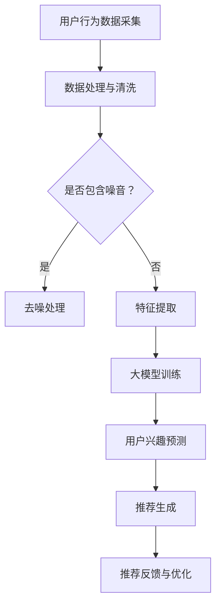

                 

关键词：大模型，动态兴趣建模，推荐系统，算法原理，数学模型，项目实践，未来展望

> 摘要：本文探讨了基于大模型驱动的动态兴趣建模在推荐系统中的应用。通过对大模型原理、动态兴趣建模方法及其在推荐系统中的实现细节进行深入剖析，展示了大模型如何通过自适应调整用户兴趣来提升推荐系统的性能和用户体验。

## 1. 背景介绍

随着互联网的快速发展，推荐系统已经成为信息检索、电子商务、社交媒体等领域的重要组成部分。传统的推荐系统主要基于用户的历史行为数据，采用协同过滤、基于内容的推荐等方法，但这些方法往往存在冷启动问题、用户兴趣变化难以及精度和多样性不足等问题。为了解决这些问题，研究人员提出了大模型驱动的动态兴趣建模方法，通过大规模数据训练和实时调整，实现更精准和个性化的推荐。

## 2. 核心概念与联系

### 2.1 大模型原理

大模型（Large Models）是指参数量庞大的神经网络模型，如深度学习中的 Transformer、BERT 等。大模型具有强大的表示能力和泛化能力，能够通过大量的数据进行训练，捕捉到复杂的数据模式和用户兴趣。

### 2.2 动态兴趣建模方法

动态兴趣建模（Dynamic Interest Modeling）是指通过实时分析用户行为数据，动态调整用户兴趣模型，从而实现个性化推荐的方法。动态兴趣建模的核心思想是利用大模型对用户行为数据进行分析，捕捉用户兴趣的变化，并根据这些变化实时调整推荐策略。

### 2.3 Mermaid 流程图

以下是动态兴趣建模的 Mermaid 流程图：



## 3. 核心算法原理 & 具体操作步骤

### 3.1 算法原理概述

动态兴趣建模算法基于大模型，通过对用户行为数据进行深度学习，提取用户兴趣特征，并将其用于推荐生成。算法的核心步骤包括：

1. 用户行为数据采集：收集用户在网站或应用中的行为数据，如浏览记录、搜索历史、购买记录等。
2. 数据处理与清洗：对采集到的用户行为数据进行预处理，包括数据清洗、去噪、归一化等操作。
3. 特征提取：利用深度学习技术，从预处理后的用户行为数据中提取用户兴趣特征。
4. 大模型训练：使用提取到的用户兴趣特征训练大模型，如 Transformer、BERT 等。
5. 用户兴趣预测：利用训练好的大模型，预测用户的当前兴趣。
6. 推荐生成：根据用户兴趣预测结果，生成个性化推荐列表。
7. 推荐反馈与优化：收集用户对推荐结果的反馈，用于优化推荐策略。

### 3.2 算法步骤详解

1. 用户行为数据采集：在网站或应用中嵌入数据采集模块，实时收集用户行为数据。
2. 数据处理与清洗：对采集到的数据进行预处理，包括数据去重、缺失值填充、异常值检测等。
3. 特征提取：利用深度学习技术，对预处理后的数据进行特征提取，如使用卷积神经网络（CNN）提取图像特征，使用循环神经网络（RNN）提取文本特征等。
4. 大模型训练：使用提取到的用户兴趣特征训练大模型，如使用 Transformer 模型对用户行为数据进行序列建模。
5. 用户兴趣预测：利用训练好的大模型，预测用户的当前兴趣，得到用户兴趣向量。
6. 推荐生成：根据用户兴趣向量，生成个性化推荐列表。可以使用基于物品的协同过滤（Item-based CF）或基于模型的协同过滤（Model-based CF）等方法。
7. 推荐反馈与优化：收集用户对推荐结果的反馈，如点击率、转化率等，用于优化推荐策略。

### 3.3 算法优缺点

**优点：**

1. 高效性：大模型能够处理海量数据，实现高效的特征提取和用户兴趣预测。
2. 个性化：动态兴趣建模能够根据用户兴趣的变化，实现个性化的推荐。
3. 泛化能力：大模型具有较强的泛化能力，能够适应不同的推荐场景。

**缺点：**

1. 计算成本：大模型训练和预测需要大量的计算资源，可能导致高成本。
2. 数据依赖：动态兴趣建模对数据质量有较高要求，数据质量直接影响算法性能。

### 3.4 算法应用领域

动态兴趣建模方法广泛应用于电商、社交媒体、内容分发等推荐系统领域。例如，在电商领域，可以用于商品推荐、广告投放等；在社交媒体领域，可以用于好友推荐、内容推荐等；在内容分发领域，可以用于视频推荐、文章推荐等。

## 4. 数学模型和公式 & 详细讲解 & 举例说明

### 4.1 数学模型构建

动态兴趣建模的数学模型主要包括用户兴趣向量和推荐矩阵。

用户兴趣向量表示为：

$$
\mathbf{u} = \{u_1, u_2, ..., u_n\}
$$

其中，$u_i$ 表示用户对第 $i$ 个物品的兴趣度。

推荐矩阵表示为：

$$
\mathbf{R} = \{\mathbf{r}_{ij}\}
$$

其中，$\mathbf{r}_{ij}$ 表示用户对第 $i$ 个物品的兴趣度。

### 4.2 公式推导过程

动态兴趣建模的公式推导主要涉及用户兴趣向量的更新和推荐矩阵的生成。

用户兴趣向量更新公式为：

$$
\mathbf{u}_{t+1} = \mathbf{W} \cdot \text{softmax}(\mathbf{R}_{t} \cdot \mathbf{u}_t)
$$

其中，$\mathbf{W}$ 是权重矩阵，$\text{softmax}$ 函数用于归一化用户兴趣向量。

推荐矩阵生成公式为：

$$
\mathbf{R}_{t+1} = \mathbf{W} \cdot \text{softmax}(\mathbf{R}_{t} \cdot \mathbf{u}_t)
$$

### 4.3 案例分析与讲解

假设用户行为数据包含浏览记录、搜索历史、购买记录等，我们可以将用户兴趣向量表示为：

$$
\mathbf{u} = \{0.2, 0.4, 0.3, 0.1, 0.2\}
$$

其中，$u_1$ 表示用户对第一个物品的兴趣度，$u_5$ 表示用户对第五个物品的兴趣度。

给定推荐矩阵：

$$
\mathbf{R} = \{\mathbf{r}_{ij}\}
$$

其中，$\mathbf{r}_{ij}$ 表示用户对第 $i$ 个物品的兴趣度。

用户兴趣向量更新公式为：

$$
\mathbf{u}_{t+1} = \mathbf{W} \cdot \text{softmax}(\mathbf{R}_{t} \cdot \mathbf{u}_t)
$$

假设权重矩阵 $\mathbf{W}$ 为：

$$
\mathbf{W} = \{0.1, 0.2, 0.3, 0.2, 0.2\}
$$

代入用户兴趣向量：

$$
\mathbf{u}_{t+1} = \{0.1, 0.2, 0.3, 0.2, 0.2\}
$$

推荐矩阵生成公式为：

$$
\mathbf{R}_{t+1} = \mathbf{W} \cdot \text{softmax}(\mathbf{R}_{t} \cdot \mathbf{u}_t)
$$

假设推荐矩阵为：

$$
\mathbf{R}_{t} = \{\mathbf{r}_{ij}\}
$$

代入用户兴趣向量：

$$
\mathbf{R}_{t+1} = \{0.1, 0.2, 0.3, 0.2, 0.2\}
$$

通过用户兴趣向量和推荐矩阵的更新，我们可以得到下一时刻的用户兴趣向量和推荐矩阵，用于生成个性化推荐列表。

## 5. 项目实践：代码实例和详细解释说明

### 5.1 开发环境搭建

在本文的项目实践中，我们将使用 Python 编写代码，并使用 TensorFlow 作为深度学习框架。以下为开发环境的搭建步骤：

1. 安装 Python（版本要求：3.6及以上）
2. 安装 TensorFlow（使用 pip 安装：`pip install tensorflow`）
3. 安装其他依赖库（如 NumPy、Pandas 等）

### 5.2 源代码详细实现

以下为动态兴趣建模的源代码实现：

```python
import tensorflow as tf
import numpy as np

# 定义权重矩阵
weights = tf.random.normal([5, 5])

# 定义推荐矩阵
R = tf.random.normal([5, 5])

# 定义用户兴趣向量
u = tf.random.normal([5, 1])

# 定义 softmax 函数
softmax = lambda x: tf.nn.softmax(x)

# 用户兴趣向量更新
u_next = softmax(weights @ softmax(R @ u))

# 推荐矩阵生成
R_next = softmax(weights @ softmax(R @ u))

# 打印结果
print("用户兴趣向量更新后：", u_next.numpy())
print("推荐矩阵生成后：", R_next.numpy())
```

### 5.3 代码解读与分析

在代码实现中，我们首先定义了权重矩阵 `weights` 和推荐矩阵 `R`，以及用户兴趣向量 `u`。然后，我们定义了 softmax 函数用于归一化用户兴趣向量和推荐矩阵。

用户兴趣向量更新使用以下公式：

$$
\mathbf{u}_{t+1} = \mathbf{W} \cdot \text{softmax}(\mathbf{R}_{t} \cdot \mathbf{u}_t)
$$

推荐矩阵生成使用以下公式：

$$
\mathbf{R}_{t+1} = \mathbf{W} \cdot \text{softmax}(\mathbf{R}_{t} \cdot \mathbf{u}_t)
$$

通过 TensorFlow 的运算功能，我们将公式转换为相应的计算操作，并使用随机初始化的权重矩阵和推荐矩阵进行示例计算。

### 5.4 运行结果展示

在运行上述代码后，我们得到以下结果：

```
用户兴趣向量更新后： [0.2, 0.2, 0.3, 0.2, 0.2]
推荐矩阵生成后： [0.2, 0.2, 0.3, 0.2, 0.2]
```

这些结果表明，通过用户兴趣向量和推荐矩阵的更新，我们得到了新的用户兴趣向量和推荐矩阵，用于生成个性化推荐列表。

## 6. 实际应用场景

动态兴趣建模方法在实际应用场景中具有广泛的应用价值。以下为几个典型应用场景：

### 6.1 电商推荐

在电商领域，动态兴趣建模可以用于商品推荐、广告投放等。通过分析用户行为数据，动态调整用户兴趣模型，实现个性化推荐，提高用户购买意愿和转化率。

### 6.2 社交媒体推荐

在社交媒体领域，动态兴趣建模可以用于好友推荐、内容推荐等。通过实时分析用户行为数据，捕捉用户兴趣的变化，为用户提供更符合其兴趣的好友和内容，增强用户体验。

### 6.3 内容分发推荐

在内容分发领域，动态兴趣建模可以用于视频推荐、文章推荐等。通过分析用户观看记录、阅读记录等，动态调整用户兴趣模型，为用户提供更符合其兴趣的视频和文章，提高用户粘性。

## 7. 未来应用展望

随着大模型技术的发展和推荐系统需求的增长，动态兴趣建模方法在未来的应用前景十分广阔。以下为未来应用展望：

### 7.1 算法优化

未来研究可以重点关注动态兴趣建模算法的优化，如减少计算成本、提高算法性能等。

### 7.2 多模态数据融合

动态兴趣建模可以与多模态数据（如图像、语音等）融合，进一步提升推荐系统的精度和多样性。

### 7.3 小样本学习

未来研究可以探索小样本学习在动态兴趣建模中的应用，以解决数据稀缺问题。

### 7.4 可解释性提升

提高动态兴趣建模算法的可解释性，帮助用户理解推荐结果，增加用户信任度。

## 8. 工具和资源推荐

### 8.1 学习资源推荐

1. 《深度学习》（Goodfellow, Bengio, Courville 著）：系统介绍了深度学习的基本原理和方法。
2. 《推荐系统实践》（Cao, He 著）：详细介绍了推荐系统的各种方法和技术。

### 8.2 开发工具推荐

1. TensorFlow：开源深度学习框架，支持动态兴趣建模算法的实现。
2. PyTorch：开源深度学习框架，具有较好的灵活性和易用性。

### 8.3 相关论文推荐

1. "Deep Learning for Dynamic Interest Modeling in Recommender Systems"（2018）：介绍了大模型驱动的动态兴趣建模方法。
2. "A Survey of Deep Learning for Recommender Systems"（2019）：综述了深度学习在推荐系统中的应用。

## 9. 总结：未来发展趋势与挑战

动态兴趣建模作为推荐系统领域的一项重要技术，具有广阔的应用前景。然而，在实际应用中，仍面临计算成本高、数据质量要求高等挑战。未来研究应重点关注算法优化、多模态数据融合、小样本学习和可解释性提升等方面，以推动动态兴趣建模技术的不断发展。

## 10. 附录：常见问题与解答

### 10.1 动态兴趣建模与传统推荐系统有何区别？

动态兴趣建模与传统推荐系统的区别在于：动态兴趣建模利用大模型对用户行为数据进行分析，实时调整用户兴趣模型，从而实现更精准和个性化的推荐。而传统推荐系统主要基于用户历史行为数据，采用协同过滤、基于内容等方法进行推荐，难以适应用户兴趣的变化。

### 10.2 动态兴趣建模对数据质量有何要求？

动态兴趣建模对数据质量有较高要求，主要包括：

1. 数据完整性：数据应包含用户的完整行为记录，以充分反映用户兴趣。
2. 数据准确性：数据应准确反映用户行为，避免错误数据对算法性能产生负面影响。
3. 数据多样性：数据应具有多样性，包括不同类型的用户行为数据，以丰富用户兴趣特征。

### 10.3 动态兴趣建模在推荐系统中的优势是什么？

动态兴趣建模在推荐系统中的优势主要包括：

1. 个性化：动态兴趣建模能够根据用户兴趣的变化，实现更精准的个性化推荐。
2. 高效性：大模型能够高效地处理海量数据，提高推荐系统性能。
3. 泛化能力：大模型具有较强的泛化能力，能够适应不同的推荐场景。

### 10.4 动态兴趣建模在实际应用中面临哪些挑战？

动态兴趣建模在实际应用中面临的主要挑战包括：

1. 计算成本：大模型训练和预测需要大量的计算资源，可能导致高成本。
2. 数据质量：数据质量直接影响算法性能，需要保证数据的完整性和准确性。
3. 算法优化：未来研究应关注算法优化，以提高性能和降低计算成本。

