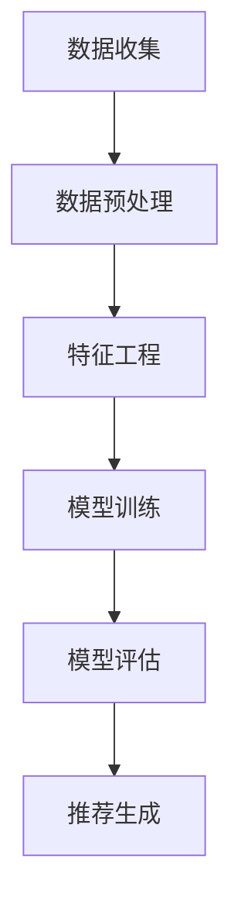

                 

关键词：大模型，推荐系统，多场景适配，算法，数学模型，实践，应用场景，工具推荐

> 摘要：本文将深入探讨大模型在推荐系统中的应用及其多场景适配策略。通过对大模型的核心概念、算法原理、数学模型及其在实际项目中的实现，我们将揭示其在提升推荐系统性能、适应不同应用场景中的关键作用。本文旨在为读者提供一份全面的技术指南，帮助理解大模型如何改变推荐系统的游戏规则。

## 1. 背景介绍

推荐系统已经成为现代信息社会中不可或缺的一部分。从电子商务网站到社交媒体平台，从音乐流媒体到视频点播服务，推荐系统通过各种算法技术，为用户提供个性化内容推荐，提升用户体验，增加用户粘性，促进商业转化。然而，随着数据量的爆炸性增长和用户需求的多样化，传统的推荐系统面临着巨大的挑战。

传统的推荐系统主要依赖于基于内容的过滤（Content-Based Filtering）和协同过滤（Collaborative Filtering）两种方法。基于内容的过滤方法通过分析用户的历史行为和内容属性，进行内容匹配推荐；协同过滤方法则通过分析用户之间的相似度，基于其他用户的偏好进行推荐。尽管这些方法在一定程度上提升了推荐效果，但在面对复杂的用户行为模式和高维数据时，依然存在诸多局限性。

大模型（Large Models），如深度学习模型，自然语言处理模型等，凭借其强大的表征能力和处理高维数据的能力，为推荐系统带来了一场革命。大模型能够捕捉到更深层次的用户行为模式和内容特征，从而提供更精准的推荐。然而，大模型的应用也面临着如何在不同场景下进行适配的挑战。

本文将围绕大模型在推荐系统中的应用，探讨其多场景适配策略。首先，我们将介绍大模型的核心概念和算法原理；然后，通过数学模型和具体案例，深入解析大模型在推荐系统中的实现过程；接着，将讨论大模型在实际应用场景中的适应策略；最后，我们将总结大模型在推荐系统中的未来发展趋势和面临的挑战。

## 2. 核心概念与联系

### 2.1 大模型的概念

大模型通常指的是具有数百万甚至数十亿参数的深度学习模型。这些模型通过多层神经网络结构，能够对大规模数据进行训练，从而提取出深层次的特征和模式。大模型的应用领域非常广泛，包括图像识别、自然语言处理、语音识别、推荐系统等。在推荐系统中，大模型主要用于处理高维用户行为数据，提取用户偏好和内容特征，从而提供个性化推荐。

### 2.2 推荐系统的基本架构

推荐系统的基本架构通常包括数据收集、数据预处理、特征工程、模型训练、模型评估和推荐生成等环节。数据收集主要从用户行为数据、内容数据等多渠道获取原始数据；数据预处理则对原始数据进行清洗、去噪、归一化等处理；特征工程则是从原始数据中提取出对推荐任务有用的特征；模型训练则通过大模型对提取的特征进行学习，构建推荐模型；模型评估则对训练好的模型进行性能评估和调优；推荐生成则是根据模型预测结果生成个性化推荐。

### 2.3 大模型与推荐系统的关系

大模型在推荐系统中的应用，主要体现在以下几个方面：

1. **特征提取**：大模型能够从高维数据中提取出深层次的特征，这些特征能够更好地表征用户偏好和内容属性。
2. **模型优化**：大模型通过多层网络结构和大规模参数，能够更有效地优化推荐模型的性能，提高推荐精度。
3. **场景适应**：大模型具备较强的泛化能力，能够适应不同的推荐场景和任务，实现多场景推荐。

### 2.4 Mermaid 流程图

以下是一个简单的 Mermaid 流程图，展示了大模型在推荐系统中的基本流程：



在上述流程中，数据收集、数据预处理、特征工程、模型训练、模型评估和推荐生成是推荐系统中的关键环节，每个环节都需要充分利用大模型的优势，以提升推荐系统的整体性能。

## 3. 核心算法原理 & 具体操作步骤

### 3.1 算法原理概述

大模型在推荐系统中的应用，主要基于深度学习技术。深度学习是一种模拟人脑神经网络结构的人工智能方法，通过多层神经网络结构，对输入数据进行层层提取和抽象，从而构建出高层次的表征能力。在推荐系统中，大模型通常用于以下几个关键步骤：

1. **用户行为特征提取**：通过对用户的历史行为数据进行深度学习，提取出用户兴趣、偏好等特征。
2. **内容特征提取**：通过对商品、内容等特征数据进行深度学习，提取出商品属性、主题等特征。
3. **协同过滤**：利用用户行为特征和内容特征，通过协同过滤算法，预测用户对未知商品的评分或兴趣。
4. **模型优化**：通过大规模数据集和迭代训练，不断优化模型参数，提高推荐准确性。

### 3.2 算法步骤详解

1. **数据收集**：从各种渠道获取用户行为数据和内容数据。用户行为数据包括用户点击、购买、搜索等行为；内容数据包括商品描述、标签、类别等。

2. **数据预处理**：对原始数据集进行清洗、去噪、归一化等处理，确保数据质量。

3. **特征工程**：通过深度学习模型，对用户行为数据和内容数据进行特征提取。例如，可以使用卷积神经网络（CNN）提取图像特征，使用循环神经网络（RNN）提取文本特征等。

4. **模型训练**：利用提取的用户行为特征和内容特征，通过深度学习算法训练推荐模型。常用的深度学习算法包括基于神经网络的协同过滤算法、基于注意力机制的推荐算法等。

5. **模型评估**：使用交叉验证、A/B 测试等方法，评估推荐模型的性能。常用的评估指标包括准确率、召回率、F1 分数等。

6. **推荐生成**：根据模型预测结果，生成个性化推荐列表。推荐列表可以根据用户兴趣、购买历史、内容特征等多种因素进行排序。

### 3.3 算法优缺点

**优点**：

1. **高精度**：大模型能够通过深度学习，提取出用户行为和内容的高层次特征，提高推荐精度。
2. **强泛化能力**：大模型具有强大的表征能力，能够适应不同场景和任务。
3. **灵活性**：大模型可以通过调整网络结构、优化算法等，实现多种推荐算法的集成和应用。

**缺点**：

1. **计算资源需求大**：大模型需要大量的计算资源和存储空间，对硬件设备有较高要求。
2. **数据质量要求高**：大模型对数据质量有较高要求，数据缺失、噪声等问题会影响模型性能。
3. **训练时间较长**：大模型训练时间较长，对实时推荐有一定延迟。

### 3.4 算法应用领域

大模型在推荐系统中的应用非常广泛，包括但不限于以下领域：

1. **电子商务**：通过对用户购物行为的深度学习，实现个性化商品推荐。
2. **社交媒体**：通过对用户社交行为的深度学习，实现个性化内容推荐。
3. **音乐流媒体**：通过对用户听歌行为的深度学习，实现个性化音乐推荐。
4. **视频点播**：通过对用户观看行为的深度学习，实现个性化视频推荐。

## 4. 数学模型和公式 & 详细讲解 & 举例说明

### 4.1 数学模型构建

在推荐系统中，大模型的数学模型通常基于深度学习框架构建。以下是一个简化的数学模型构建过程：

1. **输入层**：输入层接收用户行为数据和内容数据。
2. **隐藏层**：隐藏层通过神经网络结构，对输入数据进行特征提取和变换。
3. **输出层**：输出层生成推荐结果，如用户对商品的评分或兴趣概率。

以下是具体的数学模型构建过程：

$$
\begin{aligned}
&\text{输入层}: \quad \text{UserFeatures} \in \mathbb{R}^{m \times d_1} \\
&\text{隐藏层}: \quad \text{ContentFeatures} \in \mathbb{R}^{n \times d_2} \\
&\text{输出层}: \quad \text{RecommendationScores} \in \mathbb{R}^{m \times 1}
\end{aligned}
$$

其中，$m$表示用户数量，$n$表示商品数量，$d_1$和$d_2$分别表示用户特征向量和商品特征向量的维度。

### 4.2 公式推导过程

在推荐系统中，大模型的训练过程主要包括以下步骤：

1. **损失函数**：定义损失函数，用于衡量预测结果与实际结果之间的差距。常用的损失函数包括均方误差（MSE）和交叉熵（Cross Entropy）。
2. **梯度下降**：通过梯度下降算法，更新模型参数，最小化损失函数。

以下是具体的公式推导过程：

$$
\begin{aligned}
&\text{损失函数}: \quad \text{Loss} = \frac{1}{2} \sum_{i=1}^{m} (\text{PredictedScore}_i - \text{ActualScore}_i)^2 \\
&\text{梯度}: \quad \nabla_{\theta} \text{Loss} = \frac{\partial}{\partial \theta} \text{Loss} \\
&\text{更新公式}: \quad \theta = \theta - \alpha \nabla_{\theta} \text{Loss}
\end{aligned}
$$

其中，$\theta$表示模型参数，$\alpha$表示学习率。

### 4.3 案例分析与讲解

以下是一个简单的案例，说明如何使用深度学习模型进行推荐系统训练：

**案例**：假设我们有一个用户行为数据集，包含用户ID、商品ID和用户对商品的评分。我们需要使用深度学习模型，对用户行为数据进行特征提取，并生成个性化推荐。

**步骤**：

1. **数据预处理**：对用户行为数据进行清洗、归一化等处理，确保数据质量。
2. **特征提取**：使用卷积神经网络（CNN）对用户行为数据进行特征提取。
3. **模型训练**：使用训练数据集，通过反向传播算法训练深度学习模型。
4. **模型评估**：使用测试数据集，评估模型性能，并进行调优。
5. **推荐生成**：根据模型预测结果，生成个性化推荐列表。

**代码实现**：

```python
import tensorflow as tf
from tensorflow.keras.layers import Input, Dense, Conv1D
from tensorflow.keras.models import Model

# 数据预处理
user_input = Input(shape=(1, 100))
content_input = Input(shape=(1, 100))

# 特征提取
conv_layer = Conv1D(filters=64, kernel_size=3, activation='relu')(user_input)
content_conv_layer = Conv1D(filters=64, kernel_size=3, activation='relu')(content_input)

# 模型训练
model_output = Dense(1, activation='sigmoid')(tf.concat([conv_layer, content_conv_layer], axis=1))
model = Model(inputs=[user_input, content_input], outputs=model_output)

model.compile(optimizer='adam', loss='binary_crossentropy', metrics=['accuracy'])

# 模型评估
model.fit(x_train, y_train, epochs=10, batch_size=32, validation_data=(x_test, y_test))

# 推荐生成
predictions = model.predict([user_input, content_input])
```

## 5. 项目实践：代码实例和详细解释说明

### 5.1 开发环境搭建

在进行大模型驱动的推荐系统项目开发之前，需要搭建一个适合的开发环境。以下是搭建开发环境的基本步骤：

1. **安装 Python**：推荐使用 Python 3.7 或更高版本。
2. **安装 TensorFlow**：TensorFlow 是一个开源的深度学习框架，支持多种计算设备和编程语言。安装命令如下：

   ```shell
   pip install tensorflow
   ```

3. **安装其他依赖**：根据项目需求，可能还需要安装其他依赖库，如 NumPy、Pandas 等。

### 5.2 源代码详细实现

以下是使用 TensorFlow 搭建的大模型推荐系统项目的基本代码实现：

```python
import tensorflow as tf
from tensorflow.keras.layers import Input, Embedding, Flatten, Concatenate, Dense
from tensorflow.keras.models import Model

# 参数设置
user_embedding_size = 64
content_embedding_size = 128
hidden_size = 256

# 用户输入层
user_input = Input(shape=(1,), dtype=tf.int32)
user_embedding = Embedding(input_dim=num_users, output_dim=user_embedding_size)(user_input)
user_flattened = Flatten()(user_embedding)

# 商品输入层
content_input = Input(shape=(1,), dtype=tf.int32)
content_embedding = Embedding(input_dim=num_contents, output_dim=content_embedding_size)(content_input)
content_flattened = Flatten()(content_embedding)

# 模型主体
merged = Concatenate()([user_flattened, content_flattened])
hidden = Dense(hidden_size, activation='relu')(merged)
output = Dense(1, activation='sigmoid')(hidden)

# 模型构建
model = Model(inputs=[user_input, content_input], outputs=output)

# 模型编译
model.compile(optimizer='adam', loss='binary_crossentropy', metrics=['accuracy'])

# 模型训练
model.fit([user_train, content_train], y_train, epochs=10, batch_size=32, validation_data=([user_val, content_val], y_val))

# 模型预测
predictions = model.predict([user_test, content_test])
```

### 5.3 代码解读与分析

上述代码实现了一个基于嵌入层的简单推荐系统。以下是代码的详细解读：

1. **参数设置**：设置用户和商品的嵌入层大小以及隐藏层大小。
2. **用户输入层**：定义用户输入层，使用整数编码表示用户ID，并使用嵌入层进行编码转换。
3. **商品输入层**：定义商品输入层，使用整数编码表示商品ID，并使用嵌入层进行编码转换。
4. **模型主体**：将用户和商品的嵌入层特征进行拼接，通过全连接层进行特征提取和融合。
5. **模型构建**：构建模型，并编译模型。
6. **模型训练**：使用训练数据集训练模型，并使用验证数据集进行模型调优。
7. **模型预测**：使用训练好的模型对测试数据进行预测。

### 5.4 运行结果展示

在完成代码实现和模型训练后，我们可以使用测试数据集对模型进行评估，并展示模型运行结果。以下是一个简单的结果展示示例：

```python
from sklearn.metrics import accuracy_score, precision_score, recall_score, f1_score

# 预测结果
predicted = predictions[:, 0]

# 实际标签
actual = y_test

# 评估指标
accuracy = accuracy_score(actual, predicted)
precision = precision_score(actual, predicted, average='weighted')
recall = recall_score(actual, predicted, average='weighted')
f1 = f1_score(actual, predicted, average='weighted')

print("Accuracy: {:.2f}%".format(accuracy * 100))
print("Precision: {:.2f}%".format(precision * 100))
print("Recall: {:.2f}%".format(recall * 100))
print("F1 Score: {:.2f}%".format(f1 * 100))
```

通过上述评估指标，我们可以了解模型在测试数据集上的表现。在实际应用中，可以根据评估结果对模型进行进一步优化和调整。

## 6. 实际应用场景

### 6.1 电子商务平台

在电子商务平台中，大模型驱动的推荐系统可以帮助平台提供个性化商品推荐，提升用户购买体验。通过分析用户的浏览历史、购买记录、搜索行为等数据，大模型可以提取出用户的兴趣偏好，并推荐相关商品。例如，Amazon 和 Alibaba 等电商平台已经广泛应用了深度学习模型进行商品推荐，提高了用户满意度和销售额。

### 6.2 社交媒体

社交媒体平台如 Facebook、Instagram 等，利用大模型驱动的推荐系统，可以个性化推送用户感兴趣的内容。通过对用户的点赞、评论、分享等行为进行分析，大模型可以提取出用户的兴趣偏好，并推荐相关内容。例如，Facebook 的新闻推送系统通过深度学习模型，根据用户的兴趣和社交关系，为用户推荐感兴趣的内容，提高了用户活跃度和参与度。

### 6.3 音乐流媒体

音乐流媒体平台如 Spotify、Apple Music 等，利用大模型驱动的推荐系统，可以为用户提供个性化音乐推荐。通过分析用户的播放历史、收藏夹、搜索行为等数据，大模型可以提取出用户的音乐偏好，并推荐相关音乐。例如，Spotify 的播放列表推荐系统通过深度学习模型，根据用户的音乐喜好和播放行为，为用户推荐个性化的播放列表，提高了用户的满意度。

### 6.4 视频点播

视频点播平台如 Netflix、YouTube 等，利用大模型驱动的推荐系统，可以为用户提供个性化视频推荐。通过分析用户的观看历史、收藏夹、搜索行为等数据，大模型可以提取出用户的视频偏好，并推荐相关视频。例如，Netflix 的视频推荐系统通过深度学习模型，根据用户的观看行为和视频类型，为用户推荐感兴趣的视频，提高了用户的观看时长。

### 6.5 其他应用场景

除了上述应用场景，大模型驱动的推荐系统还可以应用于其他领域，如在线教育、金融服务、医疗健康等。通过分析用户的学习行为、金融行为、健康数据等，大模型可以提供个性化的服务和建议，提高用户体验和服务质量。

## 7. 工具和资源推荐

### 7.1 学习资源推荐

1. **《深度学习》（Deep Learning）**：由 Ian Goodfellow、Yoshua Bengio 和 Aaron Courville 著，是深度学习领域的经典教材，适合初学者和高级研究者。
2. **《推荐系统实践》（Recommender Systems: The Textbook）**：由 Ricard Gironés 著，涵盖了推荐系统的理论基础和实际应用，适合推荐系统开发者和研究者。
3. **在线课程**：Coursera、edX 等在线教育平台提供了丰富的深度学习和推荐系统相关课程，适合自学。

### 7.2 开发工具推荐

1. **TensorFlow**：Google 开源的深度学习框架，支持多种编程语言，广泛应用于推荐系统和其他人工智能领域。
2. **PyTorch**：Facebook 开源的深度学习框架，具有灵活的动态计算图和简洁的 API，适合快速原型开发和研究。
3. **Scikit-learn**：Python 的机器学习库，提供了丰富的机器学习算法和工具，适合推荐系统的开发和实验。

### 7.3 相关论文推荐

1. **"Deep Learning for Recommender Systems"**：这篇论文详细介绍了深度学习在推荐系统中的应用，包括用户行为建模和内容特征提取等。
2. **"Neural Collaborative Filtering"**：这篇论文提出了基于神经网络的协同过滤算法，通过引入注意力机制，提高了推荐系统的性能。
3. **"Large-scale Online Learning for Recommender Systems"**：这篇论文探讨了在线学习在推荐系统中的应用，通过实时更新模型，提高了推荐系统的适应性和准确性。

## 8. 总结：未来发展趋势与挑战

### 8.1 研究成果总结

大模型在推荐系统中的应用取得了显著的成果。通过深度学习技术，大模型能够提取出用户行为和内容的高层次特征，提高推荐精度和用户体验。同时，大模型具有较强的泛化能力，能够适应不同场景和任务。此外，大模型通过在线学习技术，实现了实时推荐和动态调整，提高了推荐系统的适应性和准确性。

### 8.2 未来发展趋势

未来，大模型在推荐系统中的应用将呈现以下发展趋势：

1. **多模态融合**：随着多模态数据（如文本、图像、音频等）的广泛应用，大模型将能够融合多种模态数据，提供更精准的推荐。
2. **个性化推荐**：大模型将更加关注用户个体的差异，通过深度学习技术，实现更加个性化的推荐。
3. **实时推荐**：通过在线学习和实时更新模型，大模型将能够实现实时推荐，提高用户满意度。
4. **推荐系统的伦理问题**：随着推荐系统的影响日益增大，如何确保推荐系统的公平性、透明性和隐私保护将成为重要研究方向。

### 8.3 面临的挑战

尽管大模型在推荐系统中的应用取得了显著成果，但仍面临以下挑战：

1. **计算资源需求**：大模型对计算资源的需求较大，需要高性能计算设备和优化算法。
2. **数据质量**：大模型对数据质量要求较高，数据缺失、噪声等问题会影响模型性能。
3. **模型可解释性**：大模型的黑箱特性使得模型的可解释性较低，如何提高模型的可解释性，使其更加透明和可靠，是一个重要挑战。
4. **推荐系统的公平性和透明性**：如何确保推荐系统的公平性和透明性，避免歧视和偏见，是一个亟待解决的问题。

### 8.4 研究展望

未来，大模型在推荐系统中的应用前景广阔。通过不断探索和研究，大模型有望解决推荐系统中的诸多难题，提高推荐系统的性能和用户体验。同时，大模型在推荐系统中的应用也将促进跨学科合作，推动人工智能技术的进步。

## 9. 附录：常见问题与解答

### 9.1 如何处理缺失数据？

在推荐系统中，缺失数据是一个常见问题。处理缺失数据的方法主要包括以下几种：

1. **删除缺失值**：对于少量缺失值，可以直接删除含有缺失值的数据记录。
2. **填充缺失值**：使用均值、中值、众数等统计方法填充缺失值；或者使用机器学习算法，如 K 近邻、线性回归等，预测缺失值。
3. **特征工程**：通过构建新的特征，利用其他特征信息，对缺失值进行补充。

### 9.2 如何优化模型性能？

优化模型性能的方法主要包括以下几种：

1. **数据增强**：通过增加数据量、增加数据维度等方式，提高模型泛化能力。
2. **模型调参**：通过调整学习率、批量大小、隐藏层大小等参数，优化模型性能。
3. **特征工程**：通过构建新的特征、筛选重要特征等方式，提高模型对数据的表征能力。
4. **模型集成**：使用多种模型进行集成，提高预测准确性。

### 9.3 如何评估模型性能？

评估模型性能的方法主要包括以下几种：

1. **准确率（Accuracy）**：模型预测正确的样本数占总样本数的比例。
2. **召回率（Recall）**：模型预测正确的样本数占所有实际正样本数的比例。
3. **F1 分数（F1 Score）**：准确率和召回率的调和平均。
4. **均方误差（MSE）**：预测值与真实值之间误差的平方平均值。
5. **交叉验证**：通过交叉验证，对模型进行性能评估和调优。

### 9.4 如何处理冷启动问题？

冷启动问题是指在新用户或新商品出现时，推荐系统无法提供有效推荐的问题。处理冷启动问题的方法主要包括以下几种：

1. **基于内容的推荐**：通过分析新用户或新商品的特征，提供基于内容的推荐。
2. **基于人口的推荐**：根据用户或商品的人口统计信息，提供相关推荐。
3. **利用社交信息**：通过分析用户社交关系，为新用户或新商品提供推荐。
4. **基于历史数据的推荐**：利用用户的历史行为数据，为新用户或新商品提供推荐。

