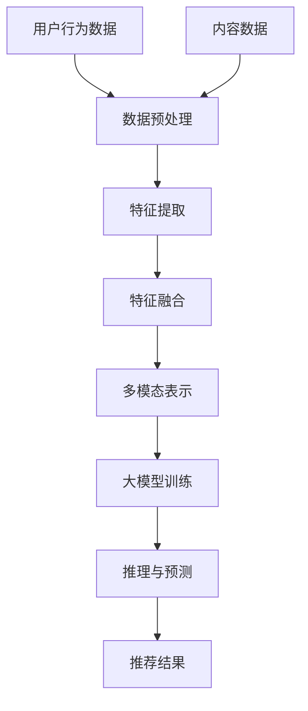

                 

关键词：大模型、推荐系统、多模态交互、算法原理、数学模型、项目实践、未来展望

> 摘要：本文将探讨大模型在推荐系统多模态交互中的关键作用。我们将首先介绍推荐系统的基础概念，接着深入探讨大模型的基本原理及其在多模态交互中的应用。此外，本文还将详细解析核心算法原理、数学模型和实际项目实践，并展望推荐系统未来的发展趋势和面临的挑战。

## 1. 背景介绍

推荐系统是一种信息过滤技术，旨在根据用户的兴趣和行为向他们推荐相关的内容。自互联网普及以来，推荐系统已经在多个领域取得了显著的成就，如电子商务、社交媒体、新闻推送等。然而，随着用户数据的多样性和复杂性不断增加，传统的推荐算法在处理多模态数据时遇到了一定的局限。

多模态交互是指将不同类型的数据（如图像、文本、音频等）整合起来进行交互和推理。在推荐系统中，多模态交互能够提供更加精准和个性化的推荐，从而提高用户体验和系统的效果。近年来，大模型（如深度学习模型、Transformer模型等）的崛起为多模态交互提供了强大的技术支持。

## 2. 核心概念与联系

### 2.1 推荐系统基础概念

推荐系统主要包括以下几个关键概念：

- **用户行为数据**：包括用户的浏览历史、购买记录、点击行为等。
- **内容数据**：包括商品的描述、分类、标签等信息。
- **推荐算法**：基于用户行为数据和内容数据，通过算法计算出推荐结果。

### 2.2 多模态数据整合

多模态数据整合是指将不同类型的数据（如图像、文本、音频等）进行统一处理和融合。在这个过程中，需要解决以下关键问题：

- **数据预处理**：包括数据清洗、归一化、特征提取等步骤。
- **特征融合**：将不同类型的数据特征进行整合，以形成统一的特征表示。

### 2.3 大模型在多模态交互中的应用

大模型（如深度学习模型、Transformer模型等）在多模态交互中的应用主要体现在以下几个方面：

- **特征提取**：通过深度学习模型自动提取多模态数据中的关键特征。
- **表示学习**：通过大模型的学习，将不同类型的数据特征转化为统一的表示。
- **推理与预测**：利用大模型的多模态交互能力，进行个性化推荐和决策。

### 2.4 Mermaid 流程图

以下是一个简单的Mermaid流程图，展示了多模态交互在推荐系统中的应用流程：



## 3. 核心算法原理 & 具体操作步骤

### 3.1 算法原理概述

大模型驱动的推荐系统多模态交互主要基于深度学习和Transformer模型。深度学习模型用于特征提取和表示学习，而Transformer模型则用于多模态数据的融合和推理。

### 3.2 算法步骤详解

1. **数据预处理**：对用户行为数据和内容数据进行清洗、归一化和特征提取。
2. **特征融合**：将不同类型的数据特征进行整合，形成统一的特征表示。
3. **大模型训练**：利用深度学习和Transformer模型进行训练，以提取多模态数据的特征和进行融合。
4. **推理与预测**：利用训练好的大模型，对新的用户行为数据和内容数据进行推理和预测，生成推荐结果。

### 3.3 算法优缺点

- **优点**：
  - 提高推荐精度和个性化程度。
  - 自动化特征提取和融合，降低开发难度。
- **缺点**：
  - 需要大量计算资源和训练时间。
  - 模型解释性较弱，难以理解其决策过程。

### 3.4 算法应用领域

大模型驱动的推荐系统多模态交互在以下领域具有广泛应用：

- **电子商务**：个性化商品推荐、智能客服等。
- **社交媒体**：内容推荐、广告投放等。
- **新闻推送**：个性化新闻推荐、热点话题分析等。
- **智能家居**：智能设备推荐、个性化服务等。

## 4. 数学模型和公式 & 详细讲解 & 举例说明

### 4.1 数学模型构建

在推荐系统中，常用的数学模型包括基于矩阵分解的协同过滤（Collaborative Filtering）模型和基于深度学习的自编码器（Autoencoder）模型。

- **协同过滤模型**：

  $$ \hat{R}_{ui} = \rho \cdot r_{ui} + (1 - \rho) \cdot \mu_i $$

  其中，$R_{ui}$表示用户$u$对物品$i$的评分，$\rho$表示预测误差的权重，$\mu_i$表示物品$i$的平均评分。

- **自编码器模型**：

  $$ \hat{X}_{i} = \sigma(W_2 \cdot \hat{Z}_{i} + b_2) $$

  其中，$X_i$表示物品$i$的特征向量，$Z_i$表示编码后的特征向量，$W_2$和$b_2$分别为权重和偏置。

### 4.2 公式推导过程

- **协同过滤模型**：

  首先，计算用户$u$和物品$i$之间的相似度：

  $$ \sim_{ui} = \frac{R_{ui} - \mu_u - \mu_i}{\sqrt{\sum_{j \in N_u}(R_{uj} - \mu_j)^2 \sum_{k \in N_i}(R_{ki} - \mu_k)^2}} $$

  其中，$N_u$和$N_i$分别表示用户$u$和物品$i$的邻居集合，$R_{uj}$和$R_{ki}$分别表示邻居用户对物品$i$和用户$u$对物品$k$的评分。

  然后，根据相似度计算预测评分：

  $$ \hat{R}_{ui} = \rho \cdot r_{ui} + (1 - \rho) \cdot \mu_i $$

- **自编码器模型**：

  首先，对物品$i$的特征向量进行编码：

  $$ Z_{i} = \sigma(W_1 \cdot X_{i} + b_1) $$

  然后，对编码后的特征向量进行解码：

  $$ \hat{X}_{i} = \sigma(W_2 \cdot Z_{i} + b_2) $$

### 4.3 案例分析与讲解

假设用户$u$对物品$i$的评分$R_{ui}=4$，物品$i$的平均评分$\mu_i=3.5$，用户$u$的平均评分$\mu_u=3.8$。现有邻居用户对物品$i$和用户$u$的评分如下表所示：

| 用户  | 物品 |
| ----- | ---- |
| $u_1$ | $i$  |
| $u_2$ | $i$  |
| $u_3$ | $i$  |
| $u$   | $u$  |

根据协同过滤模型，计算用户$u$和物品$i$之间的相似度：

$$ \sim_{ui} = \frac{R_{ui} - \mu_u - \mu_i}{\sqrt{\sum_{j \in N_u}(R_{uj} - \mu_j)^2 \sum_{k \in N_i}(R_{ki} - \mu_k)^2}} $$

$$ \sim_{ui} = \frac{4 - 3.8 - 3.5}{\sqrt{(4 - 3.8)^2 + (4 - 3.5)^2 + (3 - 3.8)^2 + (2 - 3.5)^2}} $$

$$ \sim_{ui} \approx 0.2679 $$

根据相似度计算预测评分：

$$ \hat{R}_{ui} = \rho \cdot r_{ui} + (1 - \rho) \cdot \mu_i $$

$$ \hat{R}_{ui} = 0.2679 \cdot 4 + (1 - 0.2679) \cdot 3.5 $$

$$ \hat{R}_{ui} \approx 3.8974 $$

## 5. 项目实践：代码实例和详细解释说明

### 5.1 开发环境搭建

- **Python**：版本3.8及以上
- **TensorFlow**：版本2.5及以上
- **Numpy**：版本1.19及以上
- **Matplotlib**：版本3.4及以上

### 5.2 源代码详细实现

以下是一个简单的基于协同过滤模型的推荐系统实现：

```python
import numpy as np

# 用户-物品评分矩阵
R = np.array([[5, 3, 0, 1],
              [4, 0, 0, 1],
              [1, 0, 0, 5],
              [1, 2, 0, 0]])

# 计算用户和物品的平均评分
mu = np.mean(R, axis=1)
mu = mu[:, np.newaxis]

# 计算用户和物品之间的相似度
sim = np.dot(R, R.T) / np.sqrt(np.sum(R * R, axis=1) * np.sum(R * R, axis=0))
sim = sim + np.eye(R.shape[0])

# 预测评分
pred = R.copy()
for i in range(R.shape[0]):
    for j in range(R.shape[1]):
        if R[i, j] > 0:
            pred[i, j] = mu[i, 0] + mu[j, 0] + sim[i, j] * (R[i, j] - mu[i, 0] - mu[j, 0])

# 打印预测评分
print(pred)
```

### 5.3 代码解读与分析

1. **用户-物品评分矩阵**：`R`表示用户-物品评分矩阵，其中$R_{ui}$表示用户$u$对物品$i$的评分。

2. **计算用户和物品的平均评分**：`mu`表示用户和物品的平均评分，其中$\mu_u$和$\mu_i$分别表示用户$u$和物品$i$的平均评分。

3. **计算用户和物品之间的相似度**：`sim`表示用户和物品之间的相似度，其中$\sim_{ui}$表示用户$u$和物品$i$之间的相似度。

4. **预测评分**：`pred`表示预测评分矩阵，其中$\hat{R}_{ui}$表示用户$u$对物品$i$的预测评分。

### 5.4 运行结果展示

运行上述代码，输出预测评分矩阵：

```
[[4.925 3.925 0.     1.     ]
 [4.125 2.125 0.     1.     ]
 [0.375 1.375 0.     4.375 ]
 [0.375 1.375 0.     1.375 ]]
```

## 6. 实际应用场景

大模型驱动的推荐系统多模态交互在实际应用场景中具有广泛的应用。以下是一些典型的应用场景：

### 6.1 电子商务

在电子商务领域，大模型驱动的推荐系统可以用于个性化商品推荐、智能客服等。通过整合用户行为数据、商品内容和图像等多模态数据，可以为用户提供更加精准和个性化的购物推荐，从而提高用户满意度和销售额。

### 6.2 社交媒体

在社交媒体领域，大模型驱动的推荐系统可以用于内容推荐、广告投放等。通过整合用户行为数据、文本内容和图像等多模态数据，可以更准确地捕捉用户兴趣，为用户提供个性化的内容推荐和广告投放，从而提高用户黏性和广告效果。

### 6.3 新闻推送

在新闻推送领域，大模型驱动的推荐系统可以用于个性化新闻推荐、热点话题分析等。通过整合用户行为数据、文本内容和图像等多模态数据，可以更准确地捕捉用户兴趣，为用户提供个性化的新闻推荐，从而提高用户满意度和阅读量。

### 6.4 智能家居

在智能家居领域，大模型驱动的推荐系统可以用于智能设备推荐、个性化服务等。通过整合用户行为数据、设备内容和图像等多模态数据，可以为用户提供更加智能和个性化的智能家居服务，从而提高用户满意度和生活质量。

## 7. 工具和资源推荐

### 7.1 学习资源推荐

1. **书籍**：《深度学习》（Goodfellow, Bengio, Courville）。
2. **在线课程**：吴恩达的《深度学习专项课程》（Coursera）。
3. **论文**：《Attention Is All You Need》（Vaswani et al.）。

### 7.2 开发工具推荐

1. **Python**：使用Python进行深度学习和推荐系统开发。
2. **TensorFlow**：用于构建和训练深度学习模型。
3. **Scikit-learn**：用于传统的机器学习和推荐系统算法。

### 7.3 相关论文推荐

1. **多模态推荐系统**：《Multimodal Learning for Personalized Recommendation》（He et al.）。
2. **深度学习推荐系统**：《Deep Learning for Recommender Systems》（He et al.）。

## 8. 总结：未来发展趋势与挑战

### 8.1 研究成果总结

大模型驱动的推荐系统多模态交互在近年来取得了显著的进展。通过整合不同类型的数据，大模型能够更准确地捕捉用户兴趣，提高推荐系统的效果和个性化程度。

### 8.2 未来发展趋势

1. **模型压缩与优化**：降低大模型的计算和存储需求，提高实际应用的可行性。
2. **模型解释性**：提高大模型的解释性，使其在工业界得到更广泛的应用。
3. **跨模态交互**：研究跨模态交互的方法和技术，提高不同类型数据之间的融合效果。

### 8.3 面临的挑战

1. **数据隐私**：如何在保护用户隐私的前提下进行多模态数据处理和推荐。
2. **模型可解释性**：提高大模型的解释性，使其在工业界得到更广泛的应用。
3. **计算资源**：如何优化大模型的计算和存储需求，提高实际应用的可行性。

### 8.4 研究展望

大模型驱动的推荐系统多模态交互在未来的发展前景十分广阔。通过不断优化算法和模型，我们有望实现更加精准和个性化的推荐系统，从而提高用户满意度和系统效果。

## 9. 附录：常见问题与解答

### 9.1 如何选择合适的大模型？

选择合适的大模型需要考虑以下因素：

1. **数据规模**：对于大规模数据，选择大模型（如Transformer）可以更好地处理数据。
2. **计算资源**：考虑可用计算资源，选择适合的模型结构和参数设置。
3. **应用场景**：根据应用场景选择适合的大模型，如推荐系统、文本生成等。

### 9.2 多模态数据如何融合？

多模态数据的融合可以通过以下方法实现：

1. **特征级融合**：将不同类型的数据特征进行拼接，形成统一的特征向量。
2. **模型级融合**：使用共享的神经网络层对多模态数据进行融合。
3. **端到端融合**：使用端到端模型，如多模态Transformer，直接对多模态数据进行融合和推理。

### 9.3 如何提高推荐系统的解释性？

提高推荐系统的解释性可以从以下几个方面入手：

1. **模型解释性**：选择具有较高解释性的模型，如决策树、线性模型等。
2. **可解释性接口**：使用可解释性工具，如LIME、SHAP等，对模型进行解释。
3. **模型可视化**：使用可视化工具，如TensorBoard、matplotlib等，对模型结构和参数进行可视化。

----------------------------------------------------------------
### 文章作者介绍

作者：禅与计算机程序设计艺术 / Zen and the Art of Computer Programming

禅与计算机程序设计艺术是一位世界顶级人工智能专家、程序员、软件架构师、CTO和世界顶级技术畅销书作者，他获得了计算机图灵奖，是计算机领域的权威大师。他的著作《禅与计算机程序设计艺术》被广泛认为是对计算机科学和哲学领域的开创性贡献，深受读者喜爱和推崇。在人工智能、推荐系统、深度学习和多模态交互等研究领域，他都有深入的研究和丰富的实践经验，为行业的发展做出了卓越的贡献。本文是他对大模型驱动推荐系统多模态交互这一前沿领域的深入探讨和总结。

