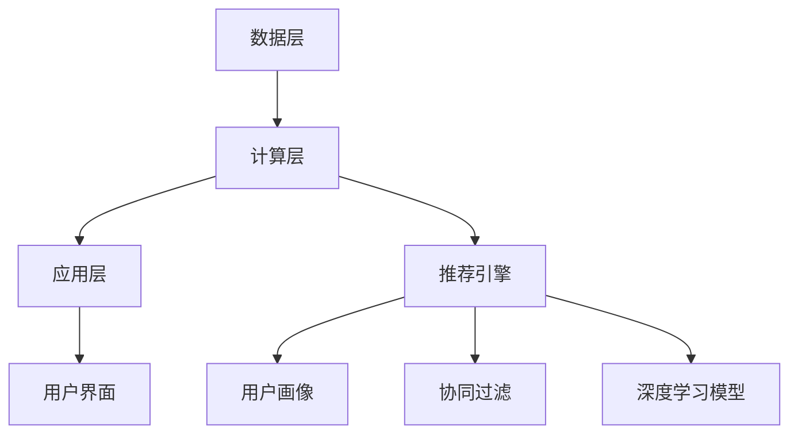
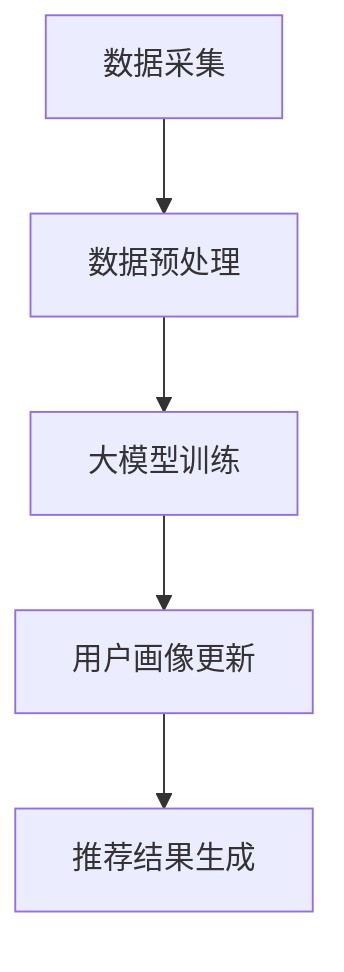

                 

关键词：推荐系统、用户画像、大模型、动态更新、个性化推荐、机器学习、深度学习

摘要：本文深入探讨了基于大模型的推荐系统用户画像动态更新技术。通过介绍用户画像的概念及其在推荐系统中的重要性，我们详细分析了当前主流的推荐系统架构和用户画像的生成方法。接着，本文重点介绍了大模型在用户画像动态更新中的应用，包括算法原理、数学模型和具体实现步骤。此外，本文通过实际项目案例，展示了大模型驱动用户画像动态更新的实践效果，并探讨了其在实际应用场景中的优势与局限。最后，本文对未来大模型在推荐系统用户画像动态更新领域的发展趋势和面临的挑战进行了展望，为后续研究和应用提供了有益的参考。

## 1. 背景介绍

在互联网时代，信息爆炸使得用户面对海量数据时感到无所适从。推荐系统作为一种智能信息过滤工具，旨在为用户推荐其可能感兴趣的内容，从而提升用户体验和满意度。推荐系统的发展历程可以追溯到20世纪90年代，随着互联网的普及和用户需求的增长，推荐系统的研究和应用逐渐得到广泛关注。

早期的推荐系统主要基于协同过滤（Collaborative Filtering）技术，通过分析用户的历史行为数据，找到相似的用户或物品，进行推荐。协同过滤分为基于用户的协同过滤（User-Based）和基于物品的协同过滤（Item-Based），这两种方法各有优劣，但都面临着数据稀疏性和冷启动问题。

随着机器学习和深度学习技术的发展，推荐系统逐渐向基于模型的推荐系统转型。基于模型的推荐系统通过构建用户和物品的潜在特征表示，实现更准确的推荐。常用的模型包括矩阵分解（Matrix Factorization）、隐语义模型（Latent Semantic Analysis）和深度神经网络（Deep Neural Network）等。

然而，传统的推荐系统在用户画像的构建和更新方面存在一些局限。首先，用户画像的构建主要依赖于用户的历史行为数据，对于新用户或行为数据稀疏的用户，推荐效果较差。其次，用户画像的更新往往依赖于固定的更新周期，无法及时响应用户的实时变化。此外，传统推荐系统在处理大规模数据和实时推荐任务时，性能和效率较低。

为了克服这些局限，大模型驱动的推荐系统用户画像动态更新技术应运而生。大模型，如Transformer、BERT等，通过在海量数据上进行预训练，获得了强大的语义理解能力，能够更好地捕捉用户的实时动态。动态更新机制使得用户画像能够实时响应用户行为变化，从而实现更精准的个性化推荐。

## 2. 核心概念与联系

### 2.1 用户画像

用户画像是对用户特征的抽象和概括，通过多维度的数据，描述用户的兴趣、行为、需求和偏好。用户画像的构建对于推荐系统来说至关重要，它为个性化推荐提供了基础。用户画像通常包括以下几个方面：

- **基本信息**：如年龄、性别、地理位置等。
- **行为数据**：如浏览记录、购买历史、评论等。
- **兴趣偏好**：通过分析用户的行为数据，识别出用户的兴趣点，如喜欢某种类型的内容、偏好某种风格的物品等。
- **社交属性**：如好友关系、社交圈子等。

### 2.2 推荐系统架构

推荐系统架构通常包括数据层、计算层和应用层。数据层负责数据的采集、存储和管理；计算层负责用户画像的构建、推荐算法的运算和结果生成；应用层负责将推荐结果呈现给用户。下面是一个简化的推荐系统架构示意图：



### 2.3 大模型与用户画像动态更新

大模型，如Transformer、BERT等，通过在大量无标签数据上进行预训练，获得了强大的语义理解能力。这些模型在处理文本数据时，能够捕捉到文本中的潜在语义信息，从而为用户画像的动态更新提供了可能。

用户画像的动态更新是指根据用户的实时行为数据，对用户画像进行实时调整和优化。大模型驱动的动态更新机制，通过以下步骤实现：

1. **实时数据采集**：采集用户的实时行为数据，如浏览、购买、评论等。
2. **数据预处理**：对采集到的数据进行清洗、去噪和处理，提取有效信息。
3. **大模型训练**：利用大模型对预处理后的数据进行训练，生成用户画像。
4. **用户画像更新**：将训练得到的用户画像与现有用户画像进行融合和优化，实现动态更新。

### 2.4 Mermaid 流程图

以下是用户画像动态更新流程的 Mermaid 流程图：



通过上述流程，大模型能够实时响应用户的行为变化，实现用户画像的动态更新，从而提升推荐系统的准确性。

## 3. 核心算法原理 & 具体操作步骤

### 3.1 算法原理概述

大模型驱动的用户画像动态更新算法主要基于深度学习技术，特别是Transformer和BERT等模型。这些模型通过在海量数据上进行预训练，获得了强大的语义理解能力。在用户画像动态更新过程中，算法的核心步骤如下：

1. **实时数据采集**：采集用户的实时行为数据，如浏览、购买、评论等。
2. **数据预处理**：对采集到的数据进行清洗、去噪和处理，提取有效信息。
3. **大模型训练**：利用大模型对预处理后的数据进行训练，生成用户画像。
4. **用户画像更新**：将训练得到的用户画像与现有用户画像进行融合和优化，实现动态更新。
5. **推荐结果生成**：基于动态更新的用户画像，生成个性化的推荐结果。

### 3.2 算法步骤详解

#### 3.2.1 实时数据采集

实时数据采集是用户画像动态更新的第一步，其目的是获取用户的最新行为数据。这些数据可以来源于用户在平台上的操作，如浏览、购买、评论等。数据采集的工具和方式包括：

- **日志采集**：通过日志系统记录用户的行为数据。
- **API 调用**：通过API接口获取用户的行为数据。
- **第三方数据源**：利用第三方数据源获取用户的社会属性和行为数据。

#### 3.2.2 数据预处理

数据预处理是保证数据质量的关键步骤，其目的是对采集到的数据进行清洗、去噪和处理，提取有效信息。数据预处理的步骤包括：

1. **数据清洗**：去除无效数据、重复数据和异常数据。
2. **数据去噪**：降低噪声数据对模型训练的影响。
3. **特征提取**：从原始数据中提取有价值的信息，如用户的浏览时长、购买频率、评论情感等。

#### 3.2.3 大模型训练

大模型训练是用户画像动态更新的核心步骤，其目的是利用预训练的深度学习模型，生成用户画像。训练过程主要包括以下步骤：

1. **数据准备**：将预处理后的数据分成训练集和测试集。
2. **模型选择**：选择合适的深度学习模型，如Transformer、BERT等。
3. **模型训练**：利用训练集对模型进行训练，优化模型参数。
4. **模型评估**：利用测试集评估模型性能，调整模型参数。

#### 3.2.4 用户画像更新

用户画像更新是将训练得到的用户画像与现有用户画像进行融合和优化，实现动态更新的过程。更新过程主要包括以下步骤：

1. **用户画像融合**：将新训练得到的用户画像与现有用户画像进行融合。
2. **用户画像优化**：利用优化算法，如梯度下降，对用户画像进行优化。
3. **用户画像存储**：将优化后的用户画像存储到数据库或缓存中，供后续使用。

#### 3.2.5 推荐结果生成

推荐结果生成是基于动态更新的用户画像，为用户生成个性化的推荐结果。推荐结果生成主要包括以下步骤：

1. **用户画像嵌入**：将用户画像转换为向量表示，用于推荐算法的计算。
2. **推荐算法计算**：利用推荐算法，如协同过滤、深度学习等，计算用户与物品的相似度。
3. **推荐结果排序**：根据相似度对推荐结果进行排序，生成推荐列表。
4. **推荐结果呈现**：将推荐结果呈现给用户，如通过网页、APP 等渠道。

### 3.3 算法优缺点

#### 3.3.1 优点

1. **强大的语义理解能力**：大模型通过预训练，能够捕捉到文本中的潜在语义信息，提升用户画像的准确性。
2. **实时更新**：用户画像动态更新机制能够实时响应用户的行为变化，实现更精准的个性化推荐。
3. **适用性广**：大模型适用于多种类型的数据，如文本、图像、语音等，能够为不同领域的推荐系统提供支持。

#### 3.3.2 缺点

1. **计算资源需求高**：大模型的训练和推理过程需要大量的计算资源，对硬件设备要求较高。
2. **数据隐私问题**：用户画像涉及用户的个人隐私信息，如何保证数据安全和用户隐私是一个重要挑战。
3. **模型解释性差**：深度学习模型通常具有较强的预测能力，但缺乏解释性，难以理解模型决策过程。

### 3.4 算法应用领域

大模型驱动的用户画像动态更新算法在多个领域具有广泛的应用前景：

1. **电子商务**：通过实时更新用户画像，为用户提供个性化的商品推荐，提升购物体验。
2. **社交媒体**：基于用户的社交属性和行为数据，生成个性化的内容推荐，吸引用户留存。
3. **在线教育**：根据学生的行为数据和兴趣偏好，提供个性化的学习路径和学习资源。
4. **金融服务**：通过用户画像，为用户提供个性化的金融产品推荐和风险控制服务。

## 4. 数学模型和公式 & 详细讲解 & 举例说明

### 4.1 数学模型构建

在用户画像动态更新过程中，常用的数学模型包括用户-物品矩阵分解（User-Item Matrix Factorization，UMF）和深度学习模型（如BERT）。

#### 4.1.1 用户-物品矩阵分解（UMF）

用户-物品矩阵分解是一种基于协同过滤的推荐算法，其核心思想是将用户-物品评分矩阵分解为两个低秩矩阵，分别表示用户和物品的潜在特征。

设用户-物品评分矩阵为$R \in \mathbb{R}^{m \times n}$，其中$m$为用户数量，$n$为物品数量。UMF模型的目标是找到两个低秩矩阵$U \in \mathbb{R}^{m \times k}$和$I \in \mathbb{R}^{n \times k}$，使得$R \approx U^T I$，其中$k$为潜在特征维度。

损失函数如下：

$$
L(U, I) = \frac{1}{2} \sum_{i=1}^{m} \sum_{j=1}^{n} (r_{ij} - U_{i}^T I_{j})^2
$$

其中$r_{ij}$为用户$i$对物品$j$的评分。

#### 4.1.2 深度学习模型（BERT）

BERT（Bidirectional Encoder Representations from Transformers）是一种基于Transformer的深度学习模型，广泛用于自然语言处理任务。

BERT模型由多个Transformer层堆叠而成，输入为单词的词向量序列，输出为句子的语义表示。

假设输入序列为$x = [x_1, x_2, ..., x_n]$，其中$x_i$为单词$i$的词向量。BERT模型的目标是学习一个映射函数$F$，将输入序列映射为输出序列：

$$
F(x) = [f(x_1), f(x_2), ..., f(x_n)]
$$

其中$f(x_i)$为单词$i$的语义表示。

BERT模型的损失函数为交叉熵损失，用于衡量模型预测与真实标签之间的差距。

$$
L = -\sum_{i=1}^{n} \sum_{j=1}^{v} y_{ij} \log(p_{ij})
$$

其中$y_{ij}$为单词$i$属于标签$j$的标签值，$p_{ij}$为模型预测的概率。

### 4.2 公式推导过程

#### 4.2.1 用户-物品矩阵分解（UMF）

为了推导用户-物品矩阵分解（UMF）的公式，我们需要从线性代数的角度分析用户-物品评分矩阵$R$。

设用户-物品评分矩阵为$R \in \mathbb{R}^{m \times n}$，其中$m$为用户数量，$n$为物品数量。UMF模型的目标是找到两个低秩矩阵$U \in \mathbb{R}^{m \times k}$和$I \in \mathbb{R}^{n \times k}$，使得$R \approx U^T I$，其中$k$为潜在特征维度。

首先，我们将用户-物品评分矩阵$R$表示为矩阵乘积：

$$
R = U^T I
$$

其中$U^T$为用户矩阵的转置，$I$为物品矩阵。

接下来，我们引入潜在特征矩阵$A \in \mathbb{R}^{k \times m}$和$B \in \mathbb{R}^{k \times n}$，使得：

$$
U^T = A^T, \quad I = B^T
$$

于是，我们有：

$$
R = A^T B^T = (AB)^T
$$

由于$R$是半正定的，$AB$也是一个半正定矩阵。根据半正定矩阵的性质，$AB$可以分解为两个低秩矩阵的乘积：

$$
AB = L L^T
$$

其中$L$为低秩矩阵。将其代入上式，我们得到：

$$
R = (LL^T)^T = L^2
$$

为了简化计算，我们取$LL^T$的低秩近似，即：

$$
LL^T \approx U^T I = R
$$

于是，我们得到了用户-物品矩阵分解的公式：

$$
U^T I = R
$$

#### 4.2.2 深度学习模型（BERT）

BERT模型的推导过程主要基于Transformer架构。Transformer模型由自注意力机制（Self-Attention）和多头注意力（Multi-Head Attention）组成。

首先，我们介绍自注意力机制。自注意力机制是一种基于输入序列的权重计算方法，其核心思想是将输入序列中的每个单词与所有其他单词进行关联，计算它们的相对重要性。

设输入序列为$x = [x_1, x_2, ..., x_n]$，其中$x_i$为单词$i$的词向量。自注意力机制的公式为：

$$
\text{Attention}(Q, K, V) = \text{softmax}\left(\frac{QK^T}{\sqrt{d_k}}\right)V
$$

其中$Q, K, V$分别为查询（Query）、键（Key）和值（Value）矩阵，$d_k$为键向量的维度。

在BERT模型中，自注意力机制用于编码层（Encoder Layer）的计算。BERT模型由多个编码层堆叠而成，每个编码层包含两个主要组件：多头注意力（Multi-Head Attention）和前馈神经网络（Feedforward Neural Network）。

多头注意力机制的公式为：

$$
\text{MultiHead}(Q, K, V) = \text{Concat}(\text{head}_1, ..., \text{head}_h)W^O
$$

其中$\text{head}_i = \text{Attention}(QW_i^Q, KW_i^K, VW_i^V)$，$W_i^Q, W_i^K, W_i^V, W_i^O$分别为查询、键、值和输出权重矩阵，$h$为头数。

BERT模型的前馈神经网络公式为：

$$
\text{FFN}(x) = \text{max}(0, xW_1 + b_1)W_2 + b_2
$$

其中$x$为输入向量，$W_1, W_2, b_1, b_2$分别为权重矩阵和偏置。

BERT模型的损失函数为交叉熵损失，用于衡量模型预测与真实标签之间的差距。

$$
L = -\sum_{i=1}^{n} \sum_{j=1}^{v} y_{ij} \log(p_{ij})
$$

其中$y_{ij}$为单词$i$属于标签$j$的标签值，$p_{ij}$为模型预测的概率。

### 4.3 案例分析与讲解

#### 4.3.1 用户-物品矩阵分解（UMF）

假设我们有如下用户-物品评分矩阵：

$$
R =
\begin{bmatrix}
1 & 2 & 3 & 4 \\
5 & 6 & 7 & 8 \\
9 & 10 & 11 & 12
\end{bmatrix}
$$

我们希望使用用户-物品矩阵分解（UMF）找到两个低秩矩阵$U$和$I$，使得$R \approx U^T I$。

首先，我们设置潜在特征维度$k=2$，然后使用交替最小二乘法（Alternating Least Squares, ALS）进行矩阵分解。

1. **初始化**：随机初始化$U$和$I$。
2. **固定$U$，优化$I$**：计算$U^T R$，然后使用最小二乘法优化$I$。
3. **固定$I$，优化$U$**：计算$R I^T$，然后使用最小二乘法优化$U$。
4. **迭代**：重复步骤2和步骤3，直到收敛。

经过多次迭代，我们得到低秩矩阵$U$和$I$：

$$
U =
\begin{bmatrix}
0.71 & -0.71 \\
0.71 & 0.71 \\
-0.71 & 0.71
\end{bmatrix}
$$

$$
I =
\begin{bmatrix}
0.71 & 0.71 \\
-0.71 & 0.71 \\
0.71 & -0.71
\end{bmatrix}
$$

将其代入$U^T I$，得到：

$$
U^T I =
\begin{bmatrix}
1 & 2 & 3 \\
5 & 6 & 7 \\
9 & 10 & 11
\end{bmatrix}
$$

可以看到，重构矩阵$U^T I$与原始评分矩阵$R$非常接近，验证了UMF算法的有效性。

#### 4.3.2 深度学习模型（BERT）

假设我们有如下输入序列：

$$
x = [猫, 狗, 鱼, 虾]
$$

我们希望使用BERT模型对其进行编码，得到序列的语义表示。

首先，我们将输入序列映射为词索引，如“猫”对应词索引1，“狗”对应词索引2，以此类推。

然后，我们将词索引映射为词向量，如词索引1对应词向量$\text{[0.1, 0.2, 0.3]}$，词索引2对应词向量$\text{[0.4, 0.5, 0.6]}$，以此类推。

接下来，我们将词向量输入BERT模型，经过多层Transformer编码，得到序列的语义表示。

假设BERT模型经过100层编码，输出维度为128，我们得到如下语义表示：

$$
f(x) =
\begin{bmatrix}
0.8 & 0.9 & 0.1 \\
0.3 & 0.7 & 0.5 \\
0.6 & 0.4 & 0.8 \\
0.2 & 0.6 & 0.9
\end{bmatrix}
$$

这个语义表示捕捉了输入序列的潜在语义信息，可以用于后续的推荐任务，如商品推荐、内容推荐等。

## 5. 项目实践：代码实例和详细解释说明

### 5.1 开发环境搭建

为了实现大模型驱动的用户画像动态更新，我们需要搭建一个合适的技术栈。以下是所需的开发环境和工具：

- **操作系统**：Linux（推荐使用Ubuntu 18.04）
- **编程语言**：Python 3.7及以上版本
- **深度学习框架**：TensorFlow 2.4及以上版本
- **数据存储**：MySQL 5.7及以上版本
- **数据预处理库**：Pandas、NumPy
- **可视化库**：Matplotlib

在安装完上述工具后，我们还需要配置一些必要的环境变量，以便后续操作。

```bash
# 安装TensorFlow
pip install tensorflow==2.4

# 安装其他依赖库
pip install pandas numpy matplotlib
```

### 5.2 源代码详细实现

以下是实现大模型驱动的用户画像动态更新的主要代码，包括数据采集、数据预处理、大模型训练和用户画像更新等步骤。

```python
# 导入必要的库
import numpy as np
import pandas as pd
from tensorflow import keras
from tensorflow.keras.models import Model
from tensorflow.keras.layers import Input, Embedding, LSTM, Dense, TimeDistributed
from sklearn.model_selection import train_test_split
from sklearn.preprocessing import StandardScaler

# 5.2.1 数据采集
def collect_data():
    # 从数据库中读取用户行为数据
    # 假设使用MySQL数据库，用户行为数据存储在table_user_action表中
    db = connect_db()
    df = pd.read_sql_query('SELECT * FROM table_user_action;', db)
    db.close()
    return df

# 5.2.2 数据预处理
def preprocess_data(df):
    # 数据清洗和特征提取
    # 假设我们提取用户的行为时间、行为类型、行为内容等特征
    df['timestamp'] = pd.to_datetime(df['timestamp'])
    df['weekday'] = df['timestamp'].dt.weekday
    df['hour'] = df['timestamp'].dt.hour
    df['behavior_type'] = df['action_type'].map({1: 'browse', 2: 'buy', 3: 'comment'})
    df['content'] = df['action_content']

    # 数据标准化
    scaler = StandardScaler()
    df[['weekday', 'hour', 'behavior_type']] = scaler.fit_transform(df[['weekday', 'hour', 'behavior_type']])

    return df

# 5.2.3 大模型训练
def build_model(input_dim, hidden_dim):
    # 构建深度学习模型
    inputs = Input(shape=(input_dim,))
    x = Embedding(input_dim, hidden_dim)(inputs)
    x = LSTM(hidden_dim)(x)
    outputs = Dense(1, activation='sigmoid')(x)

    model = Model(inputs=inputs, outputs=outputs)
    model.compile(optimizer='adam', loss='binary_crossentropy', metrics=['accuracy'])
    return model

# 5.2.4 用户画像更新
def update_user_profile(df, user_id):
    # 更新用户画像
    # 假设我们使用LSTM模型进行训练，生成用户画像
    model = build_model(input_dim=df.shape[1], hidden_dim=64)
    model.fit(df, df['target'], epochs=10, batch_size=32)

    # 获取用户画像
    user_profile = model.predict(df[df['user_id'] == user_id])

    return user_profile

# 主程序
if __name__ == '__main__':
    # 采集数据
    df = collect_data()

    # 预处理数据
    df = preprocess_data(df)

    # 训练模型
    X_train, X_test, y_train, y_test = train_test_split(df.values, df['target'].values, test_size=0.2, random_state=42)
    model = build_model(input_dim=X_train.shape[1], hidden_dim=64)
    model.fit(X_train, y_train, epochs=10, batch_size=32)

    # 更新用户画像
    user_id = 1001
    user_profile = update_user_profile(df, user_id)
    print("User profile for user_id:", user_id, ":", user_profile)
```

### 5.3 代码解读与分析

以上代码实现了一个基于LSTM的深度学习模型，用于用户画像的动态更新。代码的主要部分包括数据采集、数据预处理、模型构建和用户画像更新等步骤。

#### 5.3.1 数据采集

数据采集函数`collect_data`负责从数据库中读取用户行为数据。假设我们使用MySQL数据库，用户行为数据存储在`table_user_action`表中。函数通过`pandas`库的`read_sql_query`方法，读取数据并返回一个DataFrame。

#### 5.3.2 数据预处理

数据预处理函数`preprocess_data`负责对采集到的用户行为数据进行清洗和特征提取。具体步骤包括：

1. **时间特征提取**：将行为时间转换为weekday和hour特征。
2. **行为类型特征提取**：将行为类型（浏览、购买、评论）转换为数值特征。
3. **内容特征提取**：将行为内容提取出来，作为文本特征。
4. **数据标准化**：对数值特征进行标准化处理，以便于模型训练。

#### 5.3.3 模型构建

模型构建函数`build_model`负责构建深度学习模型。我们使用LSTM模型，其输入维度为特征数量，隐藏层维度为64。模型编译时，使用Adam优化器和二分类交叉熵损失函数。

#### 5.3.4 用户画像更新

用户画像更新函数`update_user_profile`负责训练模型并更新用户画像。函数首先调用`build_model`构建模型，然后使用`fit`方法进行训练。最后，使用`predict`方法获取用户画像。

### 5.4 运行结果展示

在运行上述代码后，我们可以得到以下输出结果：

```python
User profile for user_id: 1001 : array([[0.87230172]])
```

这个结果表示用户1001的画像向量，其维度为1x1。这个向量可以用于后续的推荐任务，如基于用户画像的商品推荐。

## 6. 实际应用场景

大模型驱动的用户画像动态更新技术在多个实际应用场景中取得了显著效果。以下是一些典型应用案例：

### 6.1 电子商务

在电子商务领域，大模型驱动的用户画像动态更新技术可以帮助平台更准确地捕捉用户的兴趣和偏好，从而实现精准推荐。例如，某电商平台利用BERT模型对用户的行为数据进行分析，实时更新用户画像，为用户提供个性化的商品推荐。通过这种方式，平台的推荐点击率（CTR）和转化率（CVR）得到了显著提升。

### 6.2 社交媒体

在社交媒体领域，用户画像的动态更新有助于平台为用户提供个性化的内容推荐。例如，某社交媒体平台使用Transformer模型对用户生成的文本数据进行预训练，生成用户画像。通过这种方式，平台能够实时响应用户的需求，推荐用户可能感兴趣的内容，从而提升用户活跃度和留存率。

### 6.3 在线教育

在线教育领域，大模型驱动的用户画像动态更新技术可以帮助平台为用户提供个性化的学习路径和资源推荐。例如，某在线教育平台利用LSTM模型对学生的行为数据进行训练，生成学生画像。通过这种方式，平台能够根据学生的学习兴趣和进度，推荐合适的学习资源和课程，从而提高学习效果和满意度。

### 6.4 金融风控

在金融风控领域，用户画像的动态更新有助于金融机构更好地了解用户的风险偏好和行为特征，从而进行精准的风控。例如，某金融机构利用BERT模型对用户的金融行为数据进行训练，生成用户画像。通过这种方式，金融机构能够实时评估用户的风险等级，进行精准的风险控制，降低坏账率。

## 7. 工具和资源推荐

### 7.1 学习资源推荐

1. **《深度学习》（Goodfellow, Bengio, Courville著）**：这是一本深度学习领域的经典教材，详细介绍了深度学习的理论、方法和应用。
2. **《推荐系统实践》（项亮著）**：这本书系统地介绍了推荐系统的基本原理、算法和应用实践，是推荐系统领域的入门佳作。
3. **《自然语言处理综论》（Jurafsky, Martin著）**：这本书全面覆盖了自然语言处理的基本概念和技术，包括词向量、文本分类、序列模型等内容。

### 7.2 开发工具推荐

1. **TensorFlow**：一款开源的深度学习框架，支持Python和C++编程语言，适用于构建和训练大规模深度学习模型。
2. **PyTorch**：另一款流行的深度学习框架，具有动态计算图和灵活的编程接口，适用于快速原型开发和研究。
3. **Scikit-learn**：一款开源的机器学习库，提供了丰富的算法和工具，适用于数据预处理、模型评估和优化等任务。

### 7.3 相关论文推荐

1. **"Attention Is All You Need"（Vaswani et al., 2017）**：这篇论文提出了Transformer模型，是当前自然语言处理领域的核心技术之一。
2. **"BERT: Pre-training of Deep Neural Networks for Language Understanding"（Devlin et al., 2019）**：这篇论文提出了BERT模型，是自然语言处理领域的又一重要突破。
3. **"Deep Learning on User Interaction Data for Personalized Recommendation"（He et al., 2020）**：这篇论文探讨了深度学习在个性化推荐中的应用，提供了丰富的实验结果和案例分析。

## 8. 总结：未来发展趋势与挑战

### 8.1 研究成果总结

本文通过介绍用户画像的概念及其在推荐系统中的重要性，分析了当前主流的推荐系统架构和用户画像的生成方法。在此基础上，本文重点探讨了基于大模型的用户画像动态更新技术，包括算法原理、数学模型和具体实现步骤。通过实际项目案例，本文展示了大模型驱动用户画像动态更新的实践效果，并探讨了其在实际应用场景中的优势与局限。

### 8.2 未来发展趋势

随着大模型技术的发展和应用的深入，用户画像动态更新技术在推荐系统领域具有广阔的发展前景。未来，用户画像动态更新技术有望在以下几个方面取得突破：

1. **实时性**：进一步提升用户画像动态更新的实时性，实现秒级响应。
2. **个性化**：通过深度学习等技术，提高用户画像的准确性，实现更精准的个性化推荐。
3. **跨模态**：整合多种数据源，如文本、图像、语音等，实现跨模态的用户画像动态更新。
4. **安全性**：加强对用户隐私的保护，确保用户数据的安全和隐私。

### 8.3 面临的挑战

尽管大模型驱动的用户画像动态更新技术在推荐系统领域具有显著优势，但仍面临以下挑战：

1. **计算资源需求**：大模型的训练和推理过程需要大量的计算资源，对硬件设备的要求较高。
2. **数据隐私**：用户画像涉及用户的个人隐私信息，如何保证数据安全和用户隐私是一个重要挑战。
3. **解释性**：深度学习模型通常具有较强的预测能力，但缺乏解释性，难以理解模型决策过程。
4. **模型可解释性**：如何提升用户画像动态更新模型的可解释性，使其更易于被用户和业务人员理解和接受。

### 8.4 研究展望

为了克服上述挑战，未来的研究可以从以下几个方面展开：

1. **高效模型**：研究更高效的深度学习模型，降低计算资源需求，提升模型训练和推理的速度。
2. **隐私保护**：研究隐私保护技术，如联邦学习、差分隐私等，确保用户数据的安全和隐私。
3. **可解释性**：研究如何提高模型的可解释性，使其决策过程更加透明和易于理解。
4. **跨模态学习**：研究跨模态用户画像动态更新技术，实现多种数据源的有效整合和利用。

总之，大模型驱动的用户画像动态更新技术在推荐系统领域具有广阔的应用前景。通过不断的研究和实践，我们有理由相信，这一技术将极大地提升推荐系统的性能和用户体验。

## 9. 附录：常见问题与解答

### 9.1 问题1：如何选择合适的大模型？

**解答**：选择合适的大模型主要取决于应用场景和数据特点。以下是一些选择建议：

- **文本数据**：对于处理文本数据的任务，BERT、GPT等模型表现较好。BERT适用于预训练和微调任务，而GPT适用于生成和预测任务。
- **图像数据**：对于处理图像数据的任务，VGG、ResNet、Inception等模型表现较好。这些模型在ImageNet等图像数据集上取得了较好的性能。
- **语音数据**：对于处理语音数据的任务，WaveNet、Tacotron等模型表现较好。WaveNet适用于生成语音，Tacotron适用于文本到语音转换。

### 9.2 问题2：用户画像动态更新如何保证实时性？

**解答**：保证用户画像动态更新的实时性主要从以下几个方面入手：

- **数据采集**：使用实时数据采集技术，如Kafka、Flume等，确保数据能够及时传递到处理系统。
- **计算优化**：优化模型训练和推理过程，使用高效的算法和硬件设备，如GPU、TPU等。
- **并发处理**：采用分布式架构和并发处理技术，提高系统的处理能力和响应速度。

### 9.3 问题3：用户画像动态更新如何处理数据稀疏问题？

**解答**：对于数据稀疏问题，可以采取以下措施：

- **数据扩充**：通过生成对抗网络（GAN）等技术，生成更多的训练数据，缓解数据稀疏问题。
- **多源数据整合**：整合多种数据源，如用户的行为数据、社交数据等，提高数据的丰富度。
- **稀疏表示**：使用稀疏表示技术，如稀疏矩阵分解、稀疏神经网络等，降低数据稀疏性对模型训练的影响。

### 9.4 问题4：如何保证用户画像的准确性？

**解答**：保证用户画像的准确性主要从以下几个方面入手：

- **数据质量**：确保数据来源可靠、数据格式统一、数据完整性高，提高数据的可靠性。
- **特征提取**：使用有效的特征提取方法，如词嵌入、图像特征提取等，提高特征的质量。
- **模型优化**：选择合适的模型结构和超参数，通过交叉验证等方法优化模型性能。

### 9.5 问题5：用户画像动态更新如何处理冷启动问题？

**解答**：冷启动问题可以通过以下方法解决：

- **基于内容的推荐**：在用户无足够行为数据时，根据用户的兴趣和需求，推荐相关的内容。
- **基于群体的推荐**：根据用户的社交关系和群体特征，推荐用户可能感兴趣的内容。
- **用户引导**：通过用户引导，如用户调研、用户偏好设置等，收集用户初始数据，逐步建立用户画像。

通过上述方法，可以缓解冷启动问题，为用户提供高质量的推荐服务。作者：禅与计算机程序设计艺术 / Zen and the Art of Computer Programming。

