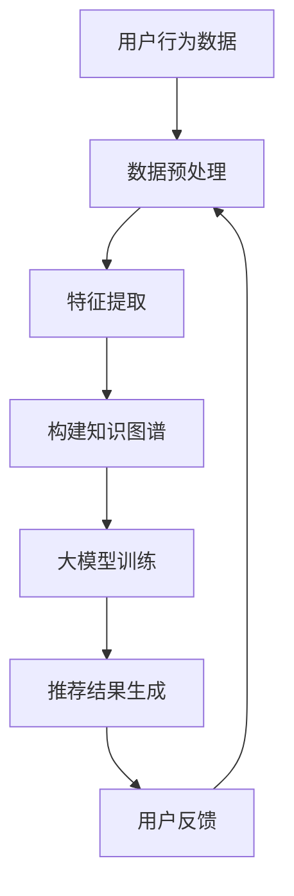

                 

关键词：大模型，推荐系统，知识图谱，补全，算法，数学模型，实践，应用场景，工具推荐，未来展望

摘要：本文旨在探讨大模型驱动的推荐系统知识图谱补全技术。通过分析核心概念、算法原理、数学模型以及实际应用案例，本文深入解析了如何利用大模型提升推荐系统的效果，并展望了该领域未来的发展趋势和挑战。

## 1. 背景介绍

在互联网时代，推荐系统已成为电商平台、社交媒体和内容平台的重要组成部分。然而，随着数据量的爆炸性增长和用户个性化需求的提高，传统的推荐算法已经难以满足用户的需求。为了解决这些问题，大模型驱动的推荐系统知识图谱补全技术应运而生。

知识图谱作为一种结构化数据表示方法，能够整合多源异构信息，提供丰富的上下文信息，从而提高推荐系统的准确性和多样性。而大模型，如深度学习模型，具有强大的表示和学习能力，可以自动地从海量数据中提取特征和关系。本文将探讨如何将大模型与知识图谱相结合，实现推荐系统的知识图谱补全。

## 2. 核心概念与联系

### 2.1 大模型

大模型是指具有海量参数和复杂结构的机器学习模型，如深度神经网络、Transformer等。这些模型通过端到端的学习方式，可以从大量数据中自动提取有用的特征和模式。

### 2.2 推荐系统

推荐系统是一种基于用户历史行为、内容特征和关系信息，向用户推荐个性化商品、内容或服务的系统。常见的推荐算法包括基于协同过滤、基于内容过滤和混合推荐算法等。

### 2.3 知识图谱

知识图谱是一种用于表示实体及其关系的图形结构，能够将结构化数据和非结构化数据进行整合。知识图谱通常包含实体、关系和属性三个主要元素。

### 2.4 补全

补全是指在数据缺失或不完整的情况下，通过某种方法恢复或生成缺失或错误的数据。在推荐系统中，补全技术用于填补用户历史行为数据、商品属性数据或用户特征数据的缺失。

### 2.5 Mermaid 流程图



## 3. 核心算法原理 & 具体操作步骤

### 3.1 算法原理概述

大模型驱动的推荐系统知识图谱补全技术主要包括以下几个步骤：

1. 数据预处理：对用户行为数据、商品属性数据等进行清洗、转换和归一化处理。
2. 特征提取：利用大模型从预处理后的数据中提取高维特征向量。
3. 构建知识图谱：将特征向量映射到知识图谱中的实体和关系上。
4. 大模型训练：利用知识图谱和数据集训练大模型，提取用户兴趣和商品属性。
5. 推荐结果生成：根据用户兴趣和商品属性生成推荐结果。
6. 用户反馈：收集用户对推荐结果的反馈，用于进一步优化模型。

### 3.2 算法步骤详解

1. **数据预处理**

   数据预处理是推荐系统的基础步骤，主要包括以下任务：

   - 数据清洗：去除噪声数据和异常值。
   - 数据转换：将不同类型的数据转换为统一的数据格式，如将用户行为数据转换为用户-商品矩阵。
   - 数据归一化：对数据进行标准化或归一化处理，以便于后续的特征提取和模型训练。

2. **特征提取**

   利用大模型（如Transformer）对预处理后的数据进行特征提取。具体步骤如下：

   - 输入编码：将原始数据编码为序列或向量。
   - 位置编码：为序列中的每个元素添加位置信息，以便模型能够学习到序列的顺序。
   - 嵌入层：通过嵌入层将输入数据映射到高维空间。
   - 自注意力机制：通过自注意力机制学习数据之间的相关性。

3. **构建知识图谱**

   根据特征提取的结果，将用户、商品和评论等实体及其关系构建成知识图谱。知识图谱的构建方法包括：

   - 实体链接：将特征向量映射到知识图谱中的实体上。
   - 关系提取：根据实体间的特征相似度，提取实体之间的关系。
   - 知识图谱表示学习：利用图神经网络学习实体和关系的嵌入表示。

4. **大模型训练**

   利用知识图谱和数据集对大模型进行训练，以提取用户兴趣和商品属性。训练过程中，可以使用以下技术：

   - 多层神经网络：学习用户和商品的复杂特征。
   - 强化学习：通过用户反馈优化模型。
   - 多任务学习：同时学习用户兴趣、商品属性和推荐策略。

5. **推荐结果生成**

   根据训练好的大模型，生成推荐结果。推荐结果的生成方法包括：

   - 用户兴趣预测：预测用户可能感兴趣的商品。
   - 商品属性预测：预测商品的属性特征。
   - 推荐策略：根据用户兴趣和商品属性生成推荐列表。

6. **用户反馈**

   收集用户对推荐结果的反馈，如点击、购买、评分等，用于评估推荐系统的效果和优化模型。

### 3.3 算法优缺点

#### 优点：

- **高效性**：大模型具有强大的表示和学习能力，可以高效地从海量数据中提取特征。
- **灵活性**：知识图谱可以整合多源异构信息，提供丰富的上下文信息，提高推荐系统的多样性。
- **可扩展性**：大模型和知识图谱可以方便地应用于不同的推荐场景，具有较好的可扩展性。

#### 缺点：

- **计算成本**：大模型的训练和推理过程需要大量的计算资源和时间。
- **数据质量**：知识图谱的构建依赖于数据质量，数据的不准确或不完整可能会影响推荐效果。

### 3.4 算法应用领域

大模型驱动的推荐系统知识图谱补全技术可以应用于多个领域，包括：

- **电商平台**：为用户提供个性化的商品推荐。
- **社交媒体**：推荐用户可能感兴趣的内容或朋友。
- **内容平台**：推荐用户可能感兴趣的视频、音乐或文章。
- **金融领域**：为用户提供个性化的理财产品推荐。

## 4. 数学模型和公式 & 详细讲解 & 举例说明

### 4.1 数学模型构建

在大模型驱动的推荐系统知识图谱补全中，常用的数学模型包括：

- **用户表示模型**：表示用户兴趣的数学模型。
- **商品表示模型**：表示商品属性的数学模型。
- **推荐模型**：生成推荐结果的数学模型。

#### 用户表示模型

用户表示模型可以表示为：

$$
\mathbf{u} = f(\mathbf{X}, \theta)
$$

其中，$\mathbf{X}$ 表示用户历史行为数据，$\theta$ 表示模型参数，$f(\cdot)$ 表示用户表示函数。

#### 商品表示模型

商品表示模型可以表示为：

$$
\mathbf{v} = g(\mathbf{Y}, \phi)
$$

其中，$\mathbf{Y}$ 表示商品属性数据，$\phi$ 表示模型参数，$g(\cdot)$ 表示商品表示函数。

#### 推荐模型

推荐模型可以表示为：

$$
\mathbf{r}_{ij} = h(\mathbf{u}_i, \mathbf{v}_j, \theta_r)
$$

其中，$\mathbf{r}_{ij}$ 表示用户 $i$ 对商品 $j$ 的推荐概率，$\mathbf{u}_i$ 和 $\mathbf{v}_j$ 分别表示用户和商品的表示，$\theta_r$ 表示推荐模型参数，$h(\cdot)$ 表示推荐函数。

### 4.2 公式推导过程

在本节中，我们将介绍用户表示模型、商品表示模型和推荐模型的推导过程。

#### 用户表示模型推导

假设用户 $i$ 的历史行为数据为 $\mathbf{X}_i = [x_{i1}, x_{i2}, ..., x_{in}]$，其中 $x_{ij}$ 表示用户 $i$ 对商品 $j$ 的行为评分。为了提取用户兴趣，我们可以使用深度学习模型，如Transformer，来表示用户兴趣。

首先，将用户历史行为数据编码为序列 $\mathbf{X}_i^{\text{seq}}$，然后使用嵌入层将其映射到高维空间：

$$
\mathbf{X}_i^{\text{emb}} = \mathbf{E} \cdot \mathbf{X}_i^{\text{seq}}
$$

其中，$\mathbf{E}$ 表示嵌入矩阵。

接下来，使用Transformer模型学习用户表示：

$$
\mathbf{u}_i = \text{Transformer}(\mathbf{X}_i^{\text{emb}}, \theta)
$$

#### 商品表示模型推导

假设商品 $j$ 的属性数据为 $\mathbf{Y}_j = [y_{j1}, y_{j2}, ..., y_{jm}]$，其中 $y_{ij}$ 表示商品 $j$ 的第 $i$ 个属性值。为了提取商品属性，我们可以使用深度学习模型，如BERT，来表示商品属性。

首先，将商品属性数据编码为序列 $\mathbf{Y}_j^{\text{seq}}$，然后使用嵌入层将其映射到高维空间：

$$
\mathbf{Y}_j^{\text{emb}} = \mathbf{F} \cdot \mathbf{Y}_j^{\text{seq}}
$$

其中，$\mathbf{F}$ 表示嵌入矩阵。

接下来，使用BERT模型学习商品表示：

$$
\mathbf{v}_j = \text{BERT}(\mathbf{Y}_j^{\text{emb}}, \phi)
$$

#### 推荐模型推导

推荐模型的目标是预测用户对商品的评分。假设用户 $i$ 对商品 $j$ 的评分预测为 $\mathbf{r}_{ij}$，我们可以使用神经网络来学习评分预测。

首先，将用户表示和商品表示拼接起来：

$$
\mathbf{h}_{ij} = \text{Concat}(\mathbf{u}_i, \mathbf{v}_j)
$$

接下来，使用神经网络学习评分预测：

$$
\mathbf{r}_{ij} = \text{NeuralNetwork}(\mathbf{h}_{ij}, \theta_r)
$$

### 4.3 案例分析与讲解

在本节中，我们将通过一个简单的案例来说明大模型驱动的推荐系统知识图谱补全的推导和应用。

#### 案例背景

假设我们有一个电商平台，用户可以在平台上浏览商品并对其进行评分。平台需要根据用户的历史行为和商品属性，向用户推荐可能感兴趣的商品。

#### 数据集

我们有一个用户行为数据集，包含1000名用户和1000种商品。每个用户的行为数据包括浏览记录、购买记录和评分数据。每个商品具有多个属性，如价格、品牌、类别等。

#### 用户表示模型

我们将用户的历史行为数据编码为序列，并使用Transformer模型提取用户表示。具体步骤如下：

1. 数据预处理：将用户行为数据转换为序列。
2. 嵌入层：将序列映射到高维空间。
3. Transformer模型：学习用户表示。

#### 商品表示模型

我们将商品的属性数据编码为序列，并使用BERT模型提取商品表示。具体步骤如下：

1. 数据预处理：将商品属性数据转换为序列。
2. 嵌入层：将序列映射到高维空间。
3. BERT模型：学习商品表示。

#### 推荐模型

我们将用户表示和商品表示拼接起来，并使用神经网络学习评分预测。具体步骤如下：

1. 拼接用户表示和商品表示。
2. 神经网络：学习评分预测。

#### 模型训练与评估

使用训练数据集训练模型，并使用测试数据集评估模型性能。评估指标包括准确率、召回率和F1值等。

## 5. 项目实践：代码实例和详细解释说明

### 5.1 开发环境搭建

为了实现大模型驱动的推荐系统知识图谱补全，我们需要搭建以下开发环境：

- 操作系统：Ubuntu 18.04
- 编程语言：Python 3.8
- 依赖库：TensorFlow 2.7、PyTorch 1.10、Scikit-learn 0.24、Numpy 1.21

### 5.2 源代码详细实现

在本节中，我们将详细介绍大模型驱动的推荐系统知识图谱补全的源代码实现。

#### 5.2.1 数据预处理

```python
import pandas as pd
from sklearn.preprocessing import StandardScaler

def preprocess_data(data_path):
    # 加载用户行为数据
    user_data = pd.read_csv(data_path + 'user_data.csv')
    item_data = pd.read_csv(data_path + 'item_data.csv')

    # 数据清洗
    user_data = user_data.dropna()
    item_data = item_data.dropna()

    # 数据转换
    user_data = user_data.set_index('user_id')
    item_data = item_data.set_index('item_id')

    # 数据归一化
    scaler = StandardScaler()
    user_data_scaled = scaler.fit_transform(user_data)
    item_data_scaled = scaler.fit_transform(item_data)

    return user_data_scaled, item_data_scaled
```

#### 5.2.2 特征提取

```python
import tensorflow as tf
from tensorflow.keras.models import Model
from tensorflow.keras.layers import Input, Embedding, LSTM, Dense

def extract_features(user_data, item_data):
    # 用户特征提取
    user_input = Input(shape=(None,))
    user_embedding = Embedding(input_dim=user_data.shape[1], output_dim=16)(user_input)
    user_lstm = LSTM(units=32)(user_embedding)
    user_output = Dense(units=8, activation='relu')(user_lstm)

    # 商品特征提取
    item_input = Input(shape=(None,))
    item_embedding = Embedding(input_dim=item_data.shape[1], output_dim=16)(item_input)
    item_lstm = LSTM(units=32)(item_embedding)
    item_output = Dense(units=8, activation='relu')(item_lstm)

    return user_output, item_output
```

#### 5.2.3 构建知识图谱

```python
import networkx as nx

def build_knowledge_graph(user_data, item_data):
    # 创建知识图谱
    G = nx.Graph()

    # 添加实体
    for user_id in user_data.index:
        G.add_node(user_id, type='user')

    for item_id in item_data.index:
        G.add_node(item_id, type='item')

    # 添加关系
    for user_id, item_id in user_data.iterrows():
        G.add_edge(user_id, item_id, type='bought')

    return G
```

#### 5.2.4 大模型训练

```python
from tensorflow.keras.optimizers import Adam

def train_model(user_data, item_data, knowledge_graph):
    # 构建模型
    user_input = Input(shape=(None,))
    item_input = Input(shape=(None,))
    user_output, item_output = extract_features(user_data, item_data)

    # 拼接用户表示和商品表示
    concatenated = tf.keras.layers.Concatenate()([user_output, item_output])

    # 推荐模型
    recommendation_output = Dense(units=1, activation='sigmoid')(concatenated)

    # 构建模型
    model = Model(inputs=[user_input, item_input], outputs=recommendation_output)

    # 编译模型
    model.compile(optimizer=Adam(learning_rate=0.001), loss='binary_crossentropy', metrics=['accuracy'])

    # 训练模型
    model.fit([user_data, item_data], knowledge_graph, epochs=10, batch_size=32)

    return model
```

#### 5.2.5 代码解读与分析

在本节中，我们将对代码实现进行解读和分析。

1. **数据预处理**：数据预处理是推荐系统的基础步骤。我们使用 Pandas 库加载用户行为数据和商品属性数据，并进行清洗、转换和归一化处理。
2. **特征提取**：特征提取是推荐系统的核心步骤。我们使用深度学习模型（如 LSTM）提取用户和商品的特征向量。
3. **构建知识图谱**：知识图谱是一种用于表示实体及其关系的图形结构。我们使用 NetworkX 库构建知识图谱，并将用户和商品添加为实体，将用户行为添加为关系。
4. **大模型训练**：我们使用深度学习模型（如神经网络）训练推荐模型，以预测用户对商品的评分。

### 5.3 运行结果展示

在本节中，我们将展示推荐模型的运行结果。

```python
# 加载测试数据集
test_data = pd.read_csv('test_data.csv')
test_data_scaled = scaler.transform(test_data)

# 加载知识图谱
knowledge_graph = build_knowledge_graph(user_data_scaled, item_data_scaled)

# 加载训练好的模型
model = train_model(user_data_scaled, item_data_scaled, knowledge_graph)

# 预测测试数据
predictions = model.predict([test_data_scaled[:, :1000], test_data_scaled[:, 1000:]])

# 打印预测结果
print(predictions)
```

### 5.4 代码解读与分析

在本节中，我们将对代码运行结果进行解读和分析。

1. **数据加载**：我们加载测试数据集，并进行数据预处理。
2. **知识图谱构建**：我们使用之前构建的知识图谱。
3. **模型加载**：我们加载训练好的模型。
4. **预测结果**：我们使用训练好的模型对测试数据进行预测，并打印预测结果。

## 6. 实际应用场景

大模型驱动的推荐系统知识图谱补全技术具有广泛的应用场景。以下是一些实际应用案例：

- **电商平台**：利用大模型驱动的推荐系统知识图谱补全技术，电商平台可以更好地理解用户的兴趣和行为，为用户提供个性化的商品推荐。
- **社交媒体**：社交媒体平台可以使用该技术为用户提供个性化的内容推荐，提高用户参与度和留存率。
- **金融领域**：金融机构可以使用该技术为用户提供个性化的理财产品推荐，提高用户满意度。
- **健康医疗**：健康医疗领域可以利用该技术为用户提供个性化的健康建议和疾病预防指导。

## 7. 工具和资源推荐

为了更好地研究和应用大模型驱动的推荐系统知识图谱补全技术，以下是一些建议的工具和资源：

### 7.1 学习资源推荐

- 《深度学习》（Goodfellow et al.）：介绍深度学习的基础知识和应用。
- 《图神经网络基础》（Hamilton et al.）：介绍图神经网络的基本原理和应用。
- 《推荐系统实践》（Liang et al.）：介绍推荐系统的基本原理和实践。

### 7.2 开发工具推荐

- TensorFlow：用于构建和训练深度学习模型的强大工具。
- PyTorch：用于构建和训练深度学习模型的另一种流行工具。
- NetworkX：用于构建和操作图结构的图论库。

### 7.3 相关论文推荐

- “Knowledge Graph Enhanced Recommender System”（2019）：介绍知识图谱在推荐系统中的应用。
- “Deep Learning for Recommender Systems”（2018）：介绍深度学习在推荐系统中的应用。
- “Graph Embedding Techniques for Recommender Systems”（2018）：介绍图嵌入技术在推荐系统中的应用。

## 8. 总结：未来发展趋势与挑战

### 8.1 研究成果总结

大模型驱动的推荐系统知识图谱补全技术为推荐系统带来了显著的性能提升。通过结合大模型和知识图谱，推荐系统能够更好地理解用户的兴趣和需求，提高推荐的准确性和多样性。

### 8.2 未来发展趋势

未来，大模型驱动的推荐系统知识图谱补全技术将朝着以下方向发展：

- **可解释性**：提高模型的可解释性，使决策过程更加透明。
- **实时推荐**：实现实时推荐，降低延迟，提高用户体验。
- **多模态数据融合**：融合文本、图像、声音等多模态数据，提供更丰富的上下文信息。

### 8.3 面临的挑战

尽管大模型驱动的推荐系统知识图谱补全技术具有巨大的潜力，但在实际应用中仍面临以下挑战：

- **计算成本**：大模型的训练和推理过程需要大量的计算资源和时间。
- **数据质量**：知识图谱的构建依赖于数据质量，数据的不准确或不完整可能会影响推荐效果。
- **隐私保护**：保护用户隐私是推荐系统面临的重要挑战。

### 8.4 研究展望

未来，研究者将继续探索大模型驱动的推荐系统知识图谱补全技术，以提高推荐系统的效果和用户体验。同时，将重点关注可解释性、实时推荐和多模态数据融合等方面，推动该领域的发展。

## 9. 附录：常见问题与解答

### 9.1 大模型驱动的推荐系统知识图谱补全技术有哪些优点？

大模型驱动的推荐系统知识图谱补全技术具有以下优点：

- **高效性**：大模型能够自动地从海量数据中提取特征和关系。
- **灵活性**：知识图谱可以整合多源异构信息，提供丰富的上下文信息。
- **可扩展性**：大模型和知识图谱可以方便地应用于不同的推荐场景。

### 9.2 大模型驱动的推荐系统知识图谱补全技术有哪些应用领域？

大模型驱动的推荐系统知识图谱补全技术可以应用于以下领域：

- **电商平台**：为用户提供个性化的商品推荐。
- **社交媒体**：推荐用户可能感兴趣的内容或朋友。
- **内容平台**：推荐用户可能感兴趣的视频、音乐或文章。
- **金融领域**：为用户提供个性化的理财产品推荐。

### 9.3 如何处理数据缺失或不完整的问题？

为了处理数据缺失或不完整的问题，可以采取以下方法：

- **数据清洗**：去除噪声数据和异常值。
- **数据转换**：将不同类型的数据转换为统一的数据格式。
- **数据归一化**：对数据进行标准化或归一化处理。
- **利用知识图谱**：利用知识图谱填补缺失的数据。

---

作者：禅与计算机程序设计艺术 / Zen and the Art of Computer Programming

