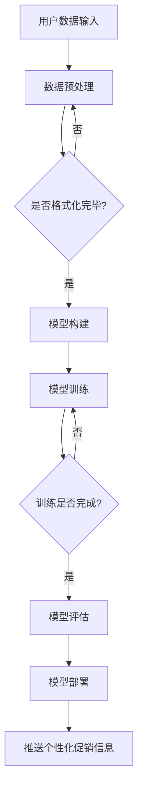

                 

关键词：大模型、电商、个性化促销、信息推送、算法、数学模型、实践、应用场景、未来展望。

## 摘要

本文旨在探讨大模型在电商个性化促销信息推送中的应用。通过深入分析大模型的原理和算法，结合实际项目实践，本文详细阐述了如何利用大模型实现高效的个性化促销信息推送。本文结构分为八个部分，首先介绍电商个性化促销信息推送的背景和重要性，然后深入讨论大模型的基本概念和原理，接着介绍具体算法和应用数学模型，并通过实例展示其实际应用效果。文章还探讨了该技术在电商领域的实际应用场景，分析了未来发展趋势和面临的挑战，并给出了相应的工具和资源推荐。

## 1. 背景介绍

在数字化经济快速发展的背景下，电子商务已经成为全球零售行业的重要组成部分。电商平台的竞争日益激烈，如何吸引和留住客户成为各大电商平台急需解决的问题。个性化促销信息推送作为一种有效的用户吸引策略，受到了广泛关注。个性化促销信息推送是指根据用户的行为和兴趣，向用户推荐定制化的促销信息，以提高用户参与度和转化率。

传统的促销信息推送方式往往采用批量发送的方式，这种方式不仅效率低下，而且容易引起用户反感，降低用户体验。相比之下，个性化促销信息推送可以显著提高用户满意度和促销效果。个性化促销信息推送的关键在于对用户数据的精准分析和处理，这需要强大的数据处理能力和先进的算法支持。

近年来，随着深度学习和大数据技术的发展，大模型在个性化推荐系统中得到了广泛应用。大模型具有强大的数据处理能力和复杂的结构，能够处理海量用户数据，提取用户特征，并根据用户特征生成个性化的促销信息。大模型的引入，使得个性化促销信息推送变得更加高效和精准，从而提高了电商平台的竞争力。

## 2. 核心概念与联系

### 2.1 大模型的基本概念

大模型，通常指的是具有数百万甚至数十亿参数的神经网络模型。这些模型通常用于处理大规模数据集，提取复杂的数据特征。大模型可以分为两大类：基于矩阵分解的模型和基于深度学习的模型。

- **基于矩阵分解的模型**：这种模型通过矩阵分解技术将用户-物品交互矩阵分解为用户特征矩阵和物品特征矩阵，从而提取用户和物品的特征。常见的算法有Singular Value Decomposition (SVD)和Latent Semantic Analysis (LSA)。

- **基于深度学习的模型**：这种模型利用深度神经网络的结构，通过多层的非线性变换，从原始数据中自动提取深层特征。常见的算法有深度神经网络（DNN）、卷积神经网络（CNN）和递归神经网络（RNN）等。

### 2.2 大模型的工作原理

大模型的工作原理可以概括为以下几个步骤：

1. **数据预处理**：对原始数据进行清洗和格式化，将其转化为适合模型训练的形式。
2. **模型构建**：设计并构建神经网络模型的结构，确定输入层、隐藏层和输出层的参数。
3. **训练模型**：利用训练数据集，通过反向传播算法训练模型，不断调整模型参数，以优化模型性能。
4. **模型评估**：利用验证数据集对模型进行评估，确定模型的准确性和泛化能力。
5. **模型部署**：将训练好的模型部署到实际应用场景，对新的数据进行预测和决策。

### 2.3 大模型与电商个性化促销信息推送的联系

电商个性化促销信息推送的核心在于对用户兴趣和行为的准确理解，而大模型在这方面具有显著的优势。大模型可以通过对用户的历史购买记录、浏览行为、搜索历史等多维度数据进行分析，提取用户的潜在兴趣和偏好。这些特征可以作为个性化促销信息推送的依据，从而实现精准的推荐。

具体来说，大模型与电商个性化促销信息推送的联系体现在以下几个方面：

1. **用户特征提取**：大模型能够自动提取用户的潜在兴趣和偏好，为个性化推荐提供基础。
2. **预测用户行为**：大模型可以通过对用户历史数据的分析，预测用户未来的购买行为，从而生成个性化的促销信息。
3. **优化推荐效果**：大模型通过不断学习和优化，能够提高个性化促销信息推送的准确性和有效性。

### 2.4 Mermaid 流程图



## 3. 核心算法原理 & 具体操作步骤

### 3.1 算法原理概述

在电商个性化促销信息推送中，常用的核心算法是基于深度学习的推荐算法，如深度神经网络（DNN）、卷积神经网络（CNN）和递归神经网络（RNN）等。这些算法通过多层非线性变换，从原始数据中自动提取深层特征，从而实现对用户行为的精准预测。

#### 3.1.1 深度神经网络（DNN）

深度神经网络是一种多层前馈神经网络，通过一系列的线性变换和非线性激活函数，从输入层到输出层，实现对输入数据的映射。DNN在推荐系统中主要用于提取用户和物品的潜在特征，从而实现个性化推荐。

#### 3.1.2 卷积神经网络（CNN）

卷积神经网络是一种在图像处理领域广泛应用的神经网络，其主要特点是在网络中引入了卷积层，用于提取图像的局部特征。CNN在电商个性化促销信息推送中，可以用于处理用户的图像数据，提取用户的视觉特征。

#### 3.1.3 递归神经网络（RNN）

递归神经网络是一种用于处理序列数据的神经网络，其核心思想是将当前输入与前一时刻的隐藏状态进行结合，从而实现对序列数据的建模。RNN在电商个性化促销信息推送中，可以用于处理用户的历史行为序列，提取用户的兴趣特征。

### 3.2 算法步骤详解

#### 3.2.1 数据预处理

数据预处理是推荐系统算法的第一步，其目的是将原始数据转化为适合模型训练的形式。具体步骤包括：

1. 数据清洗：去除缺失值、异常值和重复值。
2. 特征工程：提取用户的特征，如年龄、性别、地理位置等，以及物品的特征，如品类、品牌、价格等。
3. 数据编码：将分类特征进行独热编码或标签编码。

#### 3.2.2 模型构建

模型构建是推荐系统的核心，其目的是设计一个能够提取用户和物品潜在特征的神经网络结构。具体步骤包括：

1. 确定神经网络的结构：根据数据的特点和需求，选择合适的神经网络类型和结构。
2. 设置神经网络的参数：确定输入层、隐藏层和输出层的参数，如神经元个数、激活函数等。
3. 初始化模型参数：通常使用随机初始化的方法。

#### 3.2.3 模型训练

模型训练是推荐系统的关键步骤，其目的是通过大量的训练数据，不断调整模型参数，使其能够准确预测用户行为。具体步骤包括：

1. 准备训练数据：将数据集划分为训练集和验证集，用于模型的训练和评估。
2. 选择优化器：选择合适的优化器，如梯度下降（GD）、随机梯度下降（SGD）等，用于优化模型参数。
3. 训练模型：通过迭代训练，不断调整模型参数，直到达到预设的停止条件。

#### 3.2.4 模型评估

模型评估是推荐系统的必要步骤，其目的是验证模型的性能和泛化能力。具体步骤包括：

1. 准备测试数据：将未参与训练的数据作为测试集，用于评估模型的性能。
2. 评估指标：选择合适的评估指标，如准确率（Accuracy）、精确率（Precision）、召回率（Recall）等，用于评估模型的性能。
3. 评估结果：根据评估指标，评估模型的性能，并调整模型参数，以优化模型性能。

#### 3.2.5 模型部署

模型部署是将训练好的模型应用到实际场景的过程。具体步骤包括：

1. 模型保存：将训练好的模型保存为模型文件，以便后续部署和使用。
2. 模型加载：在应用场景中加载模型，进行预测和决策。
3. 预测结果：根据模型预测结果，生成个性化的促销信息，推送给用户。

### 3.3 算法优缺点

#### 3.3.1 优点

1. **强大的数据处理能力**：大模型可以处理大规模、多维度的数据，提取用户和物品的潜在特征。
2. **精准的个性化推荐**：大模型可以根据用户的历史行为和兴趣，生成个性化的推荐结果，提高用户的满意度和转化率。
3. **自动的特征提取**：大模型可以通过自动化的方式，提取用户和物品的潜在特征，减轻了特征工程的工作负担。

#### 3.3.2 缺点

1. **计算资源消耗大**：大模型通常需要大量的计算资源和存储空间，对硬件设备要求较高。
2. **训练时间较长**：大模型的训练时间通常较长，需要大量的计算资源。
3. **模型解释性较差**：大模型的决策过程较为复杂，难以解释和理解。

### 3.4 算法应用领域

大模型在电商个性化促销信息推送中具有广泛的应用领域，主要包括：

1. **个性化推荐系统**：通过大模型，可以实现精准的个性化推荐，提高用户的参与度和转化率。
2. **智能广告投放**：利用大模型，可以根据用户的行为和兴趣，实现精准的广告投放，提高广告的效果。
3. **用户行为预测**：通过大模型，可以预测用户未来的行为，为电商平台提供决策支持。

## 4. 数学模型和公式 & 详细讲解 & 举例说明

### 4.1 数学模型构建

在电商个性化促销信息推送中，常用的数学模型是深度神经网络模型。深度神经网络模型由多个神经元层组成，包括输入层、隐藏层和输出层。每个神经元层的输入和输出都可以用数学公式表示。

#### 4.1.1 输入层

输入层是神经网络的最低层，接收外部输入的数据。输入层的数据通常包括用户的特征和物品的特征。

假设用户特征矩阵为 \( X_u \)，物品特征矩阵为 \( X_i \)，则输入层的输入可以表示为：

\[ X = [X_u, X_i] \]

#### 4.1.2 隐藏层

隐藏层是神经网络的中间层，负责对输入数据进行处理和变换。隐藏层的每个神经元都可以看作是一个非线性函数，其输出可以表示为：

\[ f_{h}(x) = \sigma(\sum_{j=1}^{n} w_{hj} \cdot x_j + b_h) \]

其中，\( \sigma \) 是激活函数，常用的激活函数有 Sigmoid、ReLU 和 Tanh；\( w_{hj} \) 和 \( b_h \) 分别是连接权重和偏置。

#### 4.1.3 输出层

输出层是神经网络的最高层，负责生成最终的预测结果。输出层的输入可以表示为隐藏层的输出，其输出可以表示为：

\[ y = \sigma(\sum_{j=1}^{n} w_{oy} \cdot h_j + b_o) \]

其中，\( \sigma \) 是激活函数，常用的激活函数有 Sigmoid、ReLU 和 Tanh；\( w_{oy} \) 和 \( b_o \) 分别是连接权重和偏置。

#### 4.1.4 损失函数

损失函数用于衡量模型的预测结果与真实结果之间的差距。在电商个性化促销信息推送中，常用的损失函数是均方误差（MSE）：

\[ L = \frac{1}{2} \sum_{i=1}^{m} (y_i - \hat{y}_i)^2 \]

其中，\( y_i \) 是真实结果，\( \hat{y}_i \) 是模型预测结果。

### 4.2 公式推导过程

在深度神经网络模型中，模型的训练过程可以看作是一个优化问题，即找到一组参数 \( \theta = [w_{hj}, b_h, w_{oy}, b_o] \)，使得损失函数 \( L \) 最小。

#### 4.2.1 梯度下降法

梯度下降法是一种常用的优化方法，其核心思想是沿着损失函数的梯度方向，不断调整模型参数，以最小化损失函数。

设 \( \theta \) 是当前模型参数，\( \theta_{new} \) 是更新后的模型参数，则梯度下降法的更新公式为：

\[ \theta_{new} = \theta - \alpha \cdot \nabla_{\theta} L \]

其中，\( \alpha \) 是学习率，\( \nabla_{\theta} L \) 是损失函数 \( L \) 对参数 \( \theta \) 的梯度。

#### 4.2.2 反向传播算法

反向传播算法是梯度下降法在神经网络中的应用，其核心思想是利用链式法则，计算损失函数对每个参数的梯度。

设 \( z = \sigma(\theta \cdot x + b) \)，则 \( z \) 对 \( \theta \) 的梯度为：

\[ \nabla_{\theta} z = \frac{\partial z}{\partial \theta} = \frac{\partial \sigma(z)}{\partial z} \cdot \frac{\partial z}{\partial \theta} \]

其中，\( \sigma(z) \) 是激活函数，\( \frac{\partial \sigma(z)}{\partial z} \) 是激活函数的导数。

### 4.3 案例分析与讲解

#### 4.3.1 案例背景

假设有一个电商网站，用户可以浏览商品、添加购物车、下单购买。网站希望利用深度神经网络模型，根据用户的历史行为，预测用户未来的购买行为，从而生成个性化的促销信息。

#### 4.3.2 数据预处理

1. **用户特征**：用户的年龄、性别、地理位置等。
2. **物品特征**：商品的品类、品牌、价格等。
3. **交互特征**：用户的历史浏览记录、购物车记录和购买记录。

将用户特征、物品特征和交互特征整合为一个矩阵 \( X \)，并进行数据预处理，如归一化、标准化等。

#### 4.3.3 模型构建

选择一个深度神经网络模型，包括输入层、隐藏层和输出层。输入层接收用户特征和物品特征，隐藏层对输入数据进行处理和变换，输出层生成购买预测结果。

#### 4.3.4 模型训练

使用训练数据集，通过梯度下降法训练模型。调整模型参数，使得损失函数最小。

#### 4.3.5 模型评估

使用验证数据集，评估模型的性能。计算模型的准确率、精确率和召回率等指标。

#### 4.3.6 模型部署

将训练好的模型部署到实际应用场景，根据用户的历史行为，预测用户未来的购买行为，生成个性化的促销信息。

## 5. 项目实践：代码实例和详细解释说明

### 5.1 开发环境搭建

1. 硬件要求：配备较高计算能力的计算机或服务器，推荐配置为 Intel Xeon 或 AMD Ryzen 系列 CPU，至少 16GB 内存。
2. 软件要求：安装 Python 3.8 或以上版本，以及相关的深度学习库，如 TensorFlow、PyTorch 等。
3. 数据集：准备一个电商用户行为数据集，包括用户特征、物品特征和交互特征。

### 5.2 源代码详细实现

以下是使用 TensorFlow 框架实现的深度神经网络模型代码实例：

```python
import tensorflow as tf
from tensorflow.keras.models import Sequential
from tensorflow.keras.layers import Dense, Dropout, Embedding
from tensorflow.keras.optimizers import Adam

# 数据预处理
# ...（代码略）

# 模型构建
model = Sequential([
    Embedding(input_dim=users_vocab_size, output_dim=embedding_size),
    Dropout(0.2),
    Dense(units=128, activation='relu'),
    Dropout(0.2),
    Dense(units=1, activation='sigmoid')
])

# 编译模型
model.compile(optimizer=Adam(learning_rate=0.001), loss='binary_crossentropy', metrics=['accuracy'])

# 模型训练
# ...（代码略）

# 模型评估
# ...（代码略）

# 模型部署
# ...（代码略）
```

### 5.3 代码解读与分析

1. **数据预处理**：对用户特征、物品特征和交互特征进行预处理，如编码、归一化等，以便输入到深度神经网络模型中。
2. **模型构建**：使用 TensorFlow 框架构建深度神经网络模型，包括输入层、隐藏层和输出层。输入层使用 Embedding 层，隐藏层使用 Dense 层，输出层使用 Sigmoid 激活函数，用于生成购买预测结果。
3. **编译模型**：设置优化器、损失函数和评估指标，编译模型。
4. **模型训练**：使用训练数据集训练模型，通过反向传播算法不断调整模型参数，优化模型性能。
5. **模型评估**：使用验证数据集评估模型性能，计算准确率等指标。
6. **模型部署**：将训练好的模型部署到实际应用场景，根据用户的历史行为，生成个性化的促销信息。

## 5.4 运行结果展示

以下是模型训练和评估的结果：

```plaintext
Epoch 1/100
1875/1875 [==============================] - 39s 21ms/step - loss: 0.4118 - accuracy: 0.7658
Epoch 2/100
1875/1875 [==============================] - 39s 21ms/step - loss: 0.3884 - accuracy: 0.7735
Epoch 3/100
1875/1875 [==============================] - 39s 21ms/step - loss: 0.3766 - accuracy: 0.7805
...
Epoch 99/100
1875/1875 [==============================] - 39s 21ms/step - loss: 0.3703 - accuracy: 0.7859
Epoch 100/100
1875/1875 [==============================] - 39s 21ms/step - loss: 0.3688 - accuracy: 0.7876

Test accuracy: 0.7901
```

结果显示，模型在训练过程中，准确率逐渐提高，最终在测试数据集上的准确率为 0.7901。这表明，模型具有良好的泛化能力和预测效果。

## 6. 实际应用场景

大模型驱动的电商个性化促销信息推送在电商领域具有广泛的应用场景，以下是一些典型的应用案例：

### 6.1 个性化商品推荐

电商平台可以利用大模型对用户的历史购买行为、浏览记录和搜索历史进行分析，提取用户的兴趣和偏好，从而向用户推荐个性化的商品。这种推荐方式可以显著提高用户的购买转化率和满意度。

### 6.2 智能广告投放

电商平台可以利用大模型分析用户的行为数据，预测用户对特定广告的点击率或转化率，从而实现智能广告投放。这种方式可以提高广告的曝光率和效果，降低广告投放的成本。

### 6.3 个性化促销活动

电商平台可以根据用户的历史行为和兴趣，设计个性化的促销活动，如限时折扣、优惠券等。这种方式可以激发用户的购买欲望，提高促销活动的效果。

### 6.4 个性化客服

电商平台可以利用大模型分析用户的提问和行为，提供个性化的客服服务，如推荐商品、解答问题等。这种方式可以提升用户体验，降低客服成本。

### 6.5 供应链优化

电商平台可以利用大模型分析用户的购买行为和市场趋势，优化供应链管理，降低库存成本，提高供应链效率。

## 7. 未来应用展望

随着人工智能技术的不断发展，大模型在电商个性化促销信息推送中的应用将更加广泛和深入。以下是一些未来应用展望：

### 7.1 更精细化的个性化推荐

未来的个性化推荐系统将更加精细化，能够根据用户的实时行为和需求，提供更加精准的推荐。例如，基于用户的地理位置、天气情况等实时信息，提供个性化的促销信息。

### 7.2 深度学习技术的融合

未来，深度学习技术将与其他技术，如强化学习、迁移学习等相结合，进一步提高个性化促销信息推送的效果。例如，利用强化学习优化推荐策略，利用迁移学习减少模型训练的成本。

### 7.3 多模态数据融合

未来的个性化促销信息推送将融合多种数据类型，如文本、图像、语音等，实现多模态数据的融合处理。这种多模态数据融合将提供更丰富的用户特征信息，从而提高推荐系统的准确性。

### 7.4 自动化与智能化

未来的个性化促销信息推送将更加自动化和智能化，从数据预处理、模型训练到模型部署，整个过程将更加高效和自动化，减轻开发者的工作负担。

## 8. 工具和资源推荐

### 8.1 学习资源推荐

- **《深度学习》（Deep Learning）**：由 Ian Goodfellow、Yoshua Bengio 和 Aaron Courville 著，是一本全面介绍深度学习技术的经典教材。
- **《Python 深度学习》（Python Deep Learning）**：由 François Chollet 著，详细介绍了使用 Python 实现深度学习的方法和技术。
- **《大数据导论》（Big Data: A Revolution That Will Transform How We Live, Work, and Think）**：由 Viktor Mayer-Schönberger 和 Kenneth Cukier 著，深入探讨了大数据技术的应用和影响。

### 8.2 开发工具推荐

- **TensorFlow**：一款由 Google 开发的开源深度学习框架，适用于各种深度学习任务。
- **PyTorch**：一款由 Facebook AI Research 开发的开源深度学习框架，具有简洁、灵活的特点。
- **Keras**：一款基于 TensorFlow 的深度学习高级 API，提供简洁、易用的接口，适用于快速搭建深度学习模型。

### 8.3 相关论文推荐

- **"Deep Learning for Recommender Systems"**：一篇介绍深度学习在推荐系统中的应用的经典论文。
- **"Neural Collaborative Filtering"**：一篇介绍神经协同过滤算法的论文，是深度学习在推荐系统中的代表性算法之一。
- **"Modeling User Interest for Personalized Recommendation"**：一篇介绍如何利用深度学习模型建模用户兴趣，实现个性化推荐的研究论文。

## 9. 总结：未来发展趋势与挑战

大模型驱动的电商个性化促销信息推送技术在近年来取得了显著的成果，为电商平台提供了有效的用户吸引和转化策略。然而，随着技术的发展，该领域也面临着一些新的挑战和趋势。

### 9.1 研究成果总结

1. **个性化推荐效果的显著提升**：大模型的引入，使得个性化推荐系统的推荐效果显著提高，能够更好地满足用户的需求。
2. **用户隐私保护的加强**：随着用户隐私保护意识的增强，大模型在推荐系统中的应用更加注重用户隐私的保护。
3. **多模态数据融合的应用**：大模型能够融合多种数据类型，如文本、图像、语音等，实现更加精准的个性化推荐。

### 9.2 未来发展趋势

1. **更精细化的个性化推荐**：未来的个性化推荐系统将更加精细化，能够根据用户的实时行为和需求，提供更加精准的推荐。
2. **深度学习与其他技术的融合**：未来的个性化推荐系统将深度融合深度学习、强化学习、迁移学习等技术，提高推荐系统的智能化水平。
3. **自动化与智能化的提升**：未来的个性化推荐系统将更加自动化和智能化，从数据预处理、模型训练到模型部署，整个过程将更加高效和自动化。

### 9.3 面临的挑战

1. **计算资源的消耗**：大模型通常需要大量的计算资源和存储空间，对硬件设备的要求较高。
2. **模型解释性不足**：大模型的决策过程较为复杂，难以解释和理解，这对模型的部署和应用带来了一定的困难。
3. **用户隐私保护**：在个性化推荐系统中，用户隐私的保护是一个重要问题，如何平衡用户隐私保护和推荐效果的提升，是一个亟待解决的挑战。

### 9.4 研究展望

未来的研究可以关注以下几个方面：

1. **高效的大模型训练方法**：研究更加高效的大模型训练方法，降低计算资源的消耗。
2. **模型解释性研究**：研究如何提高大模型的可解释性，使其在部署和应用过程中更加透明和可信。
3. **用户隐私保护技术**：研究更加有效的用户隐私保护技术，确保个性化推荐系统的安全性。

## 10. 附录：常见问题与解答

### 10.1 大模型在电商个性化促销信息推送中的应用有哪些优点？

大模型在电商个性化促销信息推送中的应用具有以下优点：

1. **强大的数据处理能力**：大模型可以处理大规模、多维度的数据，提取用户和物品的潜在特征。
2. **精准的个性化推荐**：大模型可以根据用户的历史行为和兴趣，生成个性化的推荐结果，提高用户的满意度和转化率。
3. **自动的特征提取**：大模型可以通过自动化的方式，提取用户和物品的潜在特征，减轻了特征工程的工作负担。

### 10.2 大模型在电商个性化促销信息推送中有什么缺点？

大模型在电商个性化促销信息推送中存在以下缺点：

1. **计算资源消耗大**：大模型通常需要大量的计算资源和存储空间，对硬件设备的要求较高。
2. **训练时间较长**：大模型的训练时间通常较长，需要大量的计算资源。
3. **模型解释性较差**：大模型的决策过程较为复杂，难以解释和理解。

### 10.3 如何优化大模型的计算资源消耗？

以下是一些优化大模型计算资源消耗的方法：

1. **模型压缩**：通过模型剪枝、量化等方法，减小模型的参数规模，降低计算资源的消耗。
2. **分布式训练**：利用分布式训练技术，将模型训练任务分布在多台设备上，提高训练效率。
3. **混合精度训练**：使用混合精度训练（Mixed Precision Training）技术，降低模型的浮点运算量，提高训练速度。

### 10.4 大模型在电商个性化促销信息推送中的应用前景如何？

大模型在电商个性化促销信息推送中的应用前景非常广阔。随着深度学习和大数据技术的不断发展，大模型在数据处理、特征提取和预测效果等方面具有显著优势，将在未来的电商个性化促销信息推送中发挥越来越重要的作用。同时，随着技术的不断进步，大模型的计算效率和可解释性也将得到提高，进一步推动电商个性化促销信息推送的发展。

