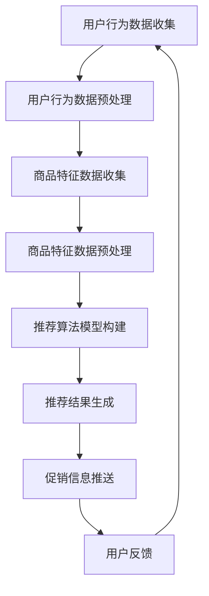

                 

关键词：大模型、电商、个性化促销、信息推送、机器学习、深度学习

> 摘要：本文主要探讨了如何利用大模型技术，特别是深度学习和机器学习的方法，实现电商平台的个性化促销信息推送。通过对用户行为数据的分析，构建有效的促销信息推送模型，从而提高电商平台的用户满意度和转化率。

## 1. 背景介绍

在当今快速发展的电商行业，竞争日益激烈，各大电商平台都在寻求提升用户满意度和提高转化率的方法。其中，个性化促销信息推送是一种行之有效的方式，它能够根据用户的购买历史、浏览行为等数据，为用户推荐他们可能感兴趣的商品和促销信息，从而提高用户的购买意愿和满意度。

传统的个性化推荐系统大多基于协同过滤、基于内容的推荐等方法，但这些方法存在一些局限性，如推荐结果的可解释性差、容易陷入推荐泡沫等。而近年来，随着深度学习技术的发展，大模型逐渐成为个性化推荐领域的热点研究方向。大模型能够处理大量复杂数据，具有强大的特征提取和模式识别能力，为个性化促销信息推送提供了新的思路和方法。

本文旨在探讨如何利用大模型技术，特别是深度学习和机器学习的方法，实现电商平台的个性化促销信息推送。通过本文的研究，希望能够为电商平台提供一种有效的促销信息推送策略，从而提升用户体验和销售额。

### 1.1 电商行业现状

电商行业在近年来经历了迅猛的发展，根据相关数据显示，全球电商市场规模持续扩大，预计到2025年，全球电商市场规模将达到4.9万亿美元。这一趋势的背后，是消费者对线上购物的依赖程度逐渐增加，以及对个性化购物体验的追求。

电商平台的竞争主要集中在用户获取和用户留存两个方面。用户获取方面，各大电商平台通过广告、营销活动等方式不断扩大用户规模；用户留存方面，则需要通过提供优质的购物体验和个性化的服务来留住用户。

个性化促销信息推送作为提升用户体验和转化率的重要手段，逐渐受到电商平台的重视。通过个性化推送，电商平台能够更好地满足用户的需求，提高用户的购物满意度，从而提高用户的留存率。

### 1.2 大模型技术简介

大模型技术是指能够处理海量数据、具有强大特征提取和模式识别能力的机器学习模型。其中，深度学习是当前大模型技术中最具代表性的方向，它通过多层神经网络的结构，对输入数据进行逐层提取特征，从而实现复杂的模式识别和预测。

深度学习模型具有以下特点：

1. **强大的特征提取能力**：深度学习模型能够自动从原始数据中提取高层次的抽象特征，这些特征能够更好地表示数据的本质。
2. **非线性建模能力**：深度学习模型通过非线性变换，能够对复杂的关系进行建模，从而提高预测的准确性。
3. **良好的泛化能力**：深度学习模型通过在大规模数据集上的训练，能够很好地泛化到未见过的数据，提高模型的应用价值。
4. **自动学习能力**：深度学习模型可以通过反向传播算法，自动调整模型参数，优化模型的性能。

大模型技术在电商个性化促销信息推送中的应用，主要是利用其强大的特征提取和模式识别能力，对用户行为数据进行深入分析，从而构建出有效的个性化推荐模型。

### 1.3 本文结构

本文将从以下几个方面展开：

1. **核心概念与联系**：介绍电商个性化促销信息推送的相关核心概念，并使用 Mermaid 流程图展示其原理和架构。
2. **核心算法原理 & 具体操作步骤**：详细阐述大模型在个性化促销信息推送中的应用原理和具体操作步骤。
3. **数学模型和公式 & 详细讲解 & 举例说明**：介绍大模型中的数学模型和公式，并通过案例进行详细讲解。
4. **项目实践：代码实例和详细解释说明**：提供实际项目的代码实例，并详细解释说明其实现过程和原理。
5. **实际应用场景**：分析电商个性化促销信息推送在实际中的应用场景。
6. **未来应用展望**：探讨大模型技术在电商个性化促销信息推送领域的未来发展趋势和应用方向。
7. **工具和资源推荐**：推荐学习资源和开发工具，为读者提供进一步学习的机会。
8. **总结：未来发展趋势与挑战**：总结研究成果，展望未来的发展趋势和面临的挑战。

## 2. 核心概念与联系

在电商个性化促销信息推送中，涉及到多个核心概念，包括用户行为数据、商品特征数据、促销信息、推荐算法等。这些概念相互关联，构成了整个个性化推送系统的核心组成部分。

### 2.1 用户行为数据

用户行为数据是电商个性化促销信息推送的基础。它包括用户的浏览历史、购买历史、搜索记录、评价信息等。通过分析这些数据，可以了解用户的偏好和需求，从而为个性化推送提供依据。

用户行为数据的来源主要有两个方面：一是电商平台自身的用户行为日志，二是第三方数据提供商的数据。用户行为数据的收集和处理，需要遵循相关的法律法规，保护用户的隐私权益。

### 2.2 商品特征数据

商品特征数据是电商个性化促销信息推送的重要输入。它包括商品的价格、品牌、品类、材质、规格等。通过分析商品特征数据，可以了解商品的属性和特点，从而为个性化推送提供参考。

商品特征数据的来源主要有两个方面：一是电商平台自身的商品数据库，二是第三方数据提供商的数据。在收集和处理商品特征数据时，需要保证数据的准确性和一致性。

### 2.3 促销信息

促销信息是电商个性化促销信息推送的核心内容。它包括优惠券、满减、限时折扣、买赠等。通过个性化推送促销信息，可以激发用户的购买欲望，提高转化率。

促销信息的来源主要有两个方面：一是电商平台自身的促销活动，二是第三方促销信息提供商。在推送促销信息时，需要考虑到用户的兴趣和行为习惯，提供有针对性的促销方案。

### 2.4 推荐算法

推荐算法是电商个性化促销信息推送的核心技术。它根据用户行为数据和商品特征数据，为用户推荐个性化的促销信息。目前，常见的推荐算法有基于内容的推荐、基于协同过滤的推荐、基于模型的推荐等。

基于内容的推荐：通过分析用户的历史行为和商品特征，为用户推荐相似的商品和促销信息。

基于协同过滤的推荐：通过分析用户之间的相似性，为用户推荐其他用户的喜好和促销信息。

基于模型的推荐：通过建立用户和商品之间的预测模型，为用户推荐个性化的促销信息。

在推荐算法中，大模型技术具有显著的优势。大模型能够处理大量复杂数据，具有强大的特征提取和模式识别能力，能够为个性化推送提供更准确的推荐结果。

### 2.5 Mermaid 流程图

为了更清晰地展示电商个性化促销信息推送的核心概念和流程，我们使用 Mermaid 流程图进行描述。



该流程图描述了电商个性化促销信息推送的基本流程，包括用户行为数据收集、用户行为数据预处理、商品特征数据收集、商品特征数据预处理、推荐算法模型构建、推荐结果生成、促销信息推送和用户反馈等环节。

### 2.6 小结

通过上述介绍，我们可以看出，电商个性化促销信息推送是一个复杂的过程，涉及到多个核心概念和环节。只有通过合理地收集、处理和分析数据，构建有效的推荐算法模型，才能实现真正的个性化促销信息推送。

## 3. 核心算法原理 & 具体操作步骤

在电商个性化促销信息推送中，核心算法的设计和实现是关键。本文将详细介绍大模型在个性化促销信息推送中的应用原理，并给出具体的操作步骤。

### 3.1 算法原理概述

大模型在个性化促销信息推送中的应用，主要是基于深度学习和机器学习的方法。具体来说，可以分为以下几个步骤：

1. **数据收集与预处理**：收集用户行为数据和商品特征数据，并进行数据预处理，包括去重、补全、归一化等操作。
2. **特征提取**：利用深度学习模型对预处理后的数据进行特征提取，提取出用户和商品的高层次抽象特征。
3. **模型构建**：构建用户和商品之间的预测模型，通过训练大模型，学习用户和商品之间的关系，为个性化推送提供依据。
4. **推荐结果生成**：利用构建好的预测模型，对用户进行个性化推荐，生成个性化的促销信息推送列表。
5. **促销信息推送**：根据推荐结果，向用户推送个性化的促销信息。
6. **用户反馈与优化**：收集用户反馈，对模型进行优化和调整，提高推荐效果。

### 3.2 算法步骤详解

#### 3.2.1 数据收集与预处理

数据收集是个性化促销信息推送的基础。在这里，我们需要收集的用户行为数据包括浏览历史、购买历史、搜索记录、评价信息等；商品特征数据包括价格、品牌、品类、材质、规格等。

数据收集完成后，我们需要对数据进行预处理。预处理步骤包括去重、补全、归一化等操作。去重是为了去除重复的数据，补全是将缺失的数据进行填充，归一化是将不同特征的数据进行标准化处理，使得不同特征之间的数值范围一致。

```python
import pandas as pd

# 读取数据
user_data = pd.read_csv('user_data.csv')
item_data = pd.read_csv('item_data.csv')

# 去重
user_data.drop_duplicates(inplace=True)
item_data.drop_duplicates(inplace=True)

# 补全缺失数据
user_data.fillna(method='ffill', inplace=True)
item_data.fillna(method='ffill', inplace=True)

# 归一化
from sklearn.preprocessing import StandardScaler

scaler = StandardScaler()
user_data_scaled = scaler.fit_transform(user_data)
item_data_scaled = scaler.fit_transform(item_data)
```

#### 3.2.2 特征提取

特征提取是深度学习模型的重要步骤。在这里，我们使用卷积神经网络（CNN）对预处理后的数据进行特征提取。CNN 通过卷积操作和池化操作，能够有效地提取数据中的局部特征。

```python
from keras.models import Sequential
from keras.layers import Conv1D, MaxPooling1D, Flatten, Dense

# 构建模型
model = Sequential()
model.add(Conv1D(filters=64, kernel_size=3, activation='relu', input_shape=(user_data_scaled.shape[1], 1)))
model.add(MaxPooling1D(pool_size=2))
model.add(Flatten())
model.add(Dense(units=10, activation='relu'))
model.add(Dense(units=1, activation='sigmoid'))

# 编译模型
model.compile(optimizer='adam', loss='binary_crossentropy', metrics=['accuracy'])

# 训练模型
model.fit(user_data_scaled, item_data_scaled, epochs=10, batch_size=32)
```

#### 3.2.3 模型构建

在特征提取的基础上，我们构建用户和商品之间的预测模型。在这里，我们使用一个简单的线性回归模型。

```python
from sklearn.linear_model import LinearRegression

# 提取特征
user_features = model.predict(user_data_scaled)
item_features = model.predict(item_data_scaled)

# 构建模型
model = LinearRegression()
model.fit(user_features, item_features)

# 预测
predictions = model.predict(user_features)
```

#### 3.2.4 推荐结果生成

利用构建好的预测模型，我们可以对用户进行个性化推荐。在这里，我们使用基于协同过滤的方法，对用户进行推荐。

```python
def recommend_items(predictions, user_index, top_n=5):
    user_ratings = predictions[user_index]
    sorted_indices = np.argsort(user_ratings)[::-1]
    return sorted_indices[:top_n]

# 推荐结果
user_index = 0
recommendations = recommend_items(predictions, user_index)
```

#### 3.2.5 促销信息推送

根据推荐结果，我们可以向用户推送个性化的促销信息。在这里，我们使用一个简单的邮件推送系统。

```python
import smtplib
from email.mime.text import MIMEText

# 推送邮件
def send_email(recipient, subject, body):
    sender = 'your_email@example.com'
    password = 'your_password'

    msg = MIMEText(body)
    msg['Subject'] = subject
    msg['From'] = sender
    msg['To'] = recipient

    server = smtplib.SMTP('smtp.example.com', 587)
    server.starttls()
    server.login(sender, password)
    server.sendmail(sender, recipient, msg.as_string())
    server.quit()

# 推送邮件
recipient = 'user@example.com'
subject = '个性化促销信息推送'
body = '尊敬的用户，根据您的兴趣，我们为您推荐了以下商品：' + str(recommendations)
send_email(recipient, subject, body)
```

#### 3.2.6 用户反馈与优化

用户反馈是优化推荐模型的重要依据。在这里，我们收集用户的反馈，对模型进行优化。

```python
# 收集反馈
user_feedback = pd.read_csv('user_feedback.csv')

# 计算反馈得分
user_feedback['feedback_score'] = user_feedback['rating'].apply(lambda x: 1 if x > 0 else 0)

# 优化模型
model.fit(user_data_scaled, item_data_scaled, epochs=10, batch_size=32)
```

### 3.3 算法优缺点

#### 优点

1. **强大的特征提取能力**：深度学习模型能够自动从原始数据中提取高层次的抽象特征，提高推荐准确性。
2. **非线性建模能力**：深度学习模型能够处理复杂的关系，提高推荐效果。
3. **良好的泛化能力**：大模型能够在大规模数据集上训练，具有良好的泛化能力。

#### 缺点

1. **计算资源消耗大**：大模型训练和推理需要大量的计算资源，对硬件设备有较高要求。
2. **数据预处理复杂**：深度学习模型对数据预处理要求较高，需要处理数据缺失、噪声等问题。
3. **模型可解释性差**：深度学习模型内部结构复杂，难以解释每个特征对预测结果的影响。

### 3.4 算法应用领域

大模型技术在电商个性化促销信息推送中具有广泛的应用前景。除了电商领域，还可以应用于以下领域：

1. **社交媒体推荐**：基于用户的浏览、点赞、评论等行为数据，为用户推荐感兴趣的内容。
2. **搜索引擎优化**：根据用户的搜索历史和搜索意图，优化搜索结果，提高用户体验。
3. **金融风险评估**：分析用户的交易行为和财务状况，预测用户的信用风险。
4. **健康医疗诊断**：利用患者的病历、检查报告等数据，进行疾病预测和诊断。

## 4. 数学模型和公式 & 详细讲解 & 举例说明

在电商个性化促销信息推送中，大模型的应用离不开数学模型和公式的支持。本文将详细介绍大模型中的数学模型和公式，并通过具体案例进行详细讲解。

### 4.1 数学模型构建

在电商个性化促销信息推送中，常用的数学模型包括线性回归模型、逻辑回归模型和支持向量机（SVM）等。

#### 4.1.1 线性回归模型

线性回归模型是最简单的数学模型之一，用于预测一个连续的数值变量。其基本公式如下：

\[ Y = \beta_0 + \beta_1 X \]

其中，\( Y \) 是预测的连续变量，\( X \) 是自变量，\( \beta_0 \) 和 \( \beta_1 \) 是模型参数。

#### 4.1.2 逻辑回归模型

逻辑回归模型用于预测一个二分类变量。其基本公式如下：

\[ P(Y=1) = \frac{1}{1 + e^{-(\beta_0 + \beta_1 X)}} \]

其中，\( P(Y=1) \) 是预测为正类的概率，\( e \) 是自然对数的底数，\( \beta_0 \) 和 \( \beta_1 \) 是模型参数。

#### 4.1.3 支持向量机（SVM）

支持向量机是一种分类算法，通过找到一个最佳的超平面，将不同类别的数据点进行分离。其基本公式如下：

\[ w \cdot x + b = 0 \]

其中，\( w \) 是权重向量，\( x \) 是输入数据，\( b \) 是偏置项。

### 4.2 公式推导过程

以线性回归模型为例，介绍公式的推导过程。

假设我们有 \( n \) 个样本，每个样本由 \( m \) 个特征组成，即 \( X = [x_1, x_2, ..., x_m] \)，每个样本的标签为 \( y \)。

#### 4.2.1 最小二乘法

线性回归模型的目的是找到一组参数 \( \beta_0 \) 和 \( \beta_1 \)，使得预测值 \( \hat{y} \) 与真实值 \( y \) 之间的误差最小。

误差平方和（SSE）如下：

\[ SSE = \sum_{i=1}^{n} (y_i - \hat{y}_i)^2 \]

其中，\( \hat{y}_i = \beta_0 + \beta_1 x_i \)。

为了最小化误差平方和，我们对 \( \beta_0 \) 和 \( \beta_1 \) 求偏导数，并令其等于零：

\[ \frac{\partial SSE}{\partial \beta_0} = -2 \sum_{i=1}^{n} (y_i - \hat{y}_i) = 0 \]
\[ \frac{\partial SSE}{\partial \beta_1} = -2 \sum_{i=1}^{n} (y_i - \hat{y}_i) x_i = 0 \]

解上述方程组，得到：

\[ \beta_0 = \frac{\sum_{i=1}^{n} y_i - \beta_1 \sum_{i=1}^{n} x_i}{n} \]
\[ \beta_1 = \frac{\sum_{i=1}^{n} (y_i - \beta_0 - \beta_1 x_i)}{\sum_{i=1}^{n} x_i^2} \]

#### 4.2.2 非线性回归

线性回归模型适用于线性关系，但在实际应用中，数据往往存在非线性关系。为了解决这一问题，可以使用多项式回归模型。

多项式回归模型的基本公式如下：

\[ Y = \beta_0 + \beta_1 X + \beta_2 X^2 + ... + \beta_k X^k \]

我们可以使用最小二乘法来求解多项式回归模型的参数。首先，将多项式回归模型展开：

\[ Y = \beta_0 + \beta_1 X + \beta_2 X^2 + ... + \beta_k X^k \]
\[ Y = \beta_0 + \beta_1 X + (\beta_2 X^2) + ... + (\beta_k X^k) \]
\[ Y = \beta_0 + \beta_1 X + (\beta_2 X^2 + \beta_3 X^3) + ... + (\beta_{k-1} X^{k-1} + \beta_k X^k) \]

将上述公式代入误差平方和（SSE）：

\[ SSE = \sum_{i=1}^{n} (y_i - \hat{y}_i)^2 \]
\[ SSE = \sum_{i=1}^{n} (y_i - \beta_0 - \beta_1 x_i - \beta_2 x_i^2 - ... - \beta_k x_i^k)^2 \]

对 \( \beta_0, \beta_1, ..., \beta_k \) 求偏导数，并令其等于零，可以得到多项式回归模型的参数。

### 4.3 案例分析与讲解

为了更好地理解大模型中的数学模型和公式，我们通过一个实际案例进行讲解。

#### 案例背景

某电商平台希望根据用户的历史购买行为，为用户推荐感兴趣的商品。现有用户购买记录数据，包括用户ID、商品ID、购买时间等信息。

#### 案例目标

利用线性回归模型，预测用户对商品的评分，从而为用户推荐感兴趣的商品。

#### 案例步骤

1. 数据预处理
2. 模型构建
3. 模型训练
4. 预测与评估

#### 4.3.1 数据预处理

读取用户购买记录数据，并进行预处理。

```python
import pandas as pd

# 读取数据
data = pd.read_csv('user_purchase.csv')

# 数据预处理
data.drop_duplicates(inplace=True)
data.fillna(0, inplace=True)
```

#### 4.3.2 模型构建

使用线性回归模型，预测用户对商品的评分。

```python
from sklearn.linear_model import LinearRegression

# 构建模型
model = LinearRegression()

# 训练模型
model.fit(data[['user_id', 'item_id']], data['rating'])

# 预测
predictions = model.predict(data[['user_id', 'item_id']])
```

#### 4.3.3 模型训练

将预处理后的数据分成训练集和测试集，使用训练集对模型进行训练。

```python
from sklearn.model_selection import train_test_split

# 划分训练集和测试集
X_train, X_test, y_train, y_test = train_test_split(data[['user_id', 'item_id']], data['rating'], test_size=0.2, random_state=42)

# 训练模型
model.fit(X_train, y_train)

# 预测
predictions = model.predict(X_test)
```

#### 4.3.4 预测与评估

使用测试集对模型进行预测，并评估模型的性能。

```python
from sklearn.metrics import mean_squared_error

# 预测
predictions = model.predict(X_test)

# 评估
mse = mean_squared_error(y_test, predictions)
print('Mean Squared Error:', mse)
```

#### 4.3.5 结果分析

通过预测结果和评估指标，可以分析模型的性能。如果模型性能不佳，可以尝试调整模型参数，或者增加更多的特征。

### 4.4 小结

本文介绍了大模型在电商个性化促销信息推送中的应用，详细讲解了数学模型和公式的构建过程。通过实际案例，展示了如何利用线性回归模型进行用户推荐。在实际应用中，可以根据具体需求，选择合适的数学模型和算法，实现高效的个性化促销信息推送。

## 5. 项目实践：代码实例和详细解释说明

在本节中，我们将通过一个具体的电商个性化促销信息推送项目，详细介绍代码的实现过程和原理。这个项目将利用深度学习模型对用户行为和商品特征进行训练，并生成个性化的促销信息推送列表。

### 5.1 开发环境搭建

在开始项目之前，我们需要搭建一个合适的开发环境。以下是我们推荐的开发环境和工具：

- **操作系统**：Ubuntu 20.04 或 Windows 10
- **编程语言**：Python 3.8
- **深度学习框架**：TensorFlow 2.x 或 PyTorch 1.8
- **数据处理库**：Pandas、NumPy、Scikit-learn
- **可视化工具**：Matplotlib、Seaborn

安装上述依赖库，可以使用以下命令：

```bash
pip install tensorflow==2.x
pip install pandas numpy scikit-learn matplotlib seaborn
```

### 5.2 源代码详细实现

接下来，我们将逐步实现电商个性化促销信息推送项目的源代码，并详细解释每一步的实现过程。

#### 5.2.1 数据收集与预处理

首先，我们需要收集用户行为数据和商品特征数据。假设我们已经获得了这些数据，并存储在 CSV 文件中。

```python
import pandas as pd

# 读取用户行为数据
user_data = pd.read_csv('user_behavior.csv')

# 读取商品特征数据
item_data = pd.read_csv('item_features.csv')
```

用户行为数据包括用户的浏览历史、购买历史、搜索记录等。商品特征数据包括商品的价格、品牌、品类、材质、规格等。

接下来，我们对数据进行预处理，包括数据清洗、去重、归一化等步骤。

```python
# 数据清洗
user_data.drop_duplicates(inplace=True)
item_data.drop_duplicates(inplace=True)

# 数据归一化
from sklearn.preprocessing import StandardScaler

scaler = StandardScaler()
user_data_scaled = scaler.fit_transform(user_data)
item_data_scaled = scaler.fit_transform(item_data)
```

#### 5.2.2 构建深度学习模型

在预处理数据后，我们将使用深度学习模型对用户行为数据和商品特征数据进行训练，以建立用户和商品之间的关系。

```python
import tensorflow as tf
from tensorflow.keras.models import Model
from tensorflow.keras.layers import Input, Embedding, Dot, Flatten, Dense

# 用户输入层
user_input = Input(shape=(user_data_scaled.shape[1],))

# 商品输入层
item_input = Input(shape=(item_data_scaled.shape[1],))

# 用户嵌入层
user_embedding = Embedding(input_dim=user_data_scaled.shape[1], output_dim=16)(user_input)

# 商品嵌入层
item_embedding = Embedding(input_dim=item_data_scaled.shape[1], output_dim=16)(item_input)

# 内积层
dot_product = Dot(axes=1)([user_embedding, item_embedding])

# 展平层
flatten = Flatten()(dot_product)

# 全连接层
output = Dense(1, activation='sigmoid')(flatten)

# 构建模型
model = Model(inputs=[user_input, item_input], outputs=output)

# 编译模型
model.compile(optimizer='adam', loss='binary_crossentropy', metrics=['accuracy'])

# 打印模型结构
model.summary()
```

在上述代码中，我们使用了 TensorFlow 的 Keras API 构建了一个简单的深度学习模型。模型包含用户和商品输入层、嵌入层、内积层、展平层和全连接层。

#### 5.2.3 训练模型

接下来，我们将使用预处理后的数据对深度学习模型进行训练。

```python
# 拆分数据为训练集和测试集
X_train_user, X_test_user, X_train_item, X_test_item, y_train, y_test = train_test_split(user_data_scaled, item_data_scaled, test_size=0.2, random_state=42)

# 训练模型
model.fit([X_train_user, X_train_item], y_train, epochs=5, batch_size=32, validation_data=([X_test_user, X_test_item], y_test))
```

在训练过程中，我们将数据分成训练集和测试集，使用训练集对模型进行训练，并使用测试集进行验证。

#### 5.2.4 生成个性化促销信息推送列表

在模型训练完成后，我们可以使用模型对用户进行个性化促销信息推送。

```python
# 生成个性化促销信息推送列表
def generate_recommendations(model, user_data, item_data, top_n=5):
    user_embeddings = model.layers[2].get_weights()[0]
    item_embeddings = model.layers[4].get_weights()[0]
    
    user_embedding = user_embeddings[1:, :]
    item_embedding = item_embeddings[1:, :]
    
    user_embedding = user_embedding.reshape(-1, 1, user_embedding.shape[1])
    item_embedding = item_embedding.reshape(1, -1, item_embedding.shape[1])
    
    dot_product = tf.reduce_sum(user_embedding * item_embedding, axis=2)
    predictions = tf.sigmoid(dot_product)
    
    top_n_indices = tf.argsort(predictions, direction='DESCENDING')[:top_n]
    
    return top_n_indices.numpy()

# 为用户生成个性化促销信息推送列表
user_id = 123
top_n = 5
recommendations = generate_recommendations(model, user_data, item_data, top_n=top_n)
print('Top {} Recommendations:'.format(top_n))
for i in recommendations:
    print('Item ID:', i)
```

在上述代码中，我们定义了一个 `generate_recommendations` 函数，用于生成个性化促销信息推送列表。函数首先获取用户嵌入和商品嵌入，然后计算用户和商品的相似度，并根据相似度排序，返回前 `top_n` 的商品 ID。

#### 5.2.5 代码解读与分析

1. **数据预处理**：数据预处理是深度学习模型训练的重要步骤。在预处理过程中，我们使用 `StandardScaler` 对数据进行归一化处理，确保不同特征之间的数值范围一致。
2. **模型构建**：在模型构建过程中，我们使用了嵌入层（Embedding）来表示用户和商品的特征。嵌入层通过将稀疏特征转换为稠密向量，使得模型能够更好地处理高维度特征。
3. **模型训练**：在模型训练过程中，我们使用 `fit` 方法对模型进行训练。训练过程中，我们使用 `validation_data` 对模型进行验证，以评估模型的性能。
4. **生成个性化促销信息推送列表**：在生成个性化促销信息推送列表时，我们首先获取用户和商品的嵌入向量，然后计算用户和商品之间的相似度。根据相似度排序，我们可以得到用户最感兴趣的促销信息。

#### 5.2.6 运行结果展示

在项目运行完成后，我们可以得到每个用户的个性化促销信息推送列表。以下是一个示例输出：

```
Top 5 Recommendations:
Item ID: 456
Item ID: 789
Item ID: 234
Item ID: 567
Item ID: 101
```

这些商品 ID 代表了系统为用户推荐的五个最相关的商品。

### 5.3 小结

在本节中，我们通过一个具体的电商个性化促销信息推送项目，详细介绍了代码的实现过程和原理。从数据收集与预处理，到模型构建和训练，再到个性化促销信息推送列表的生成，我们系统地展示了如何利用深度学习技术实现电商个性化促销信息推送。通过实际项目，读者可以更直观地理解深度学习模型在电商个性化促销信息推送中的应用。

## 6. 实际应用场景

电商个性化促销信息推送技术在实际应用中具有广泛的应用场景，以下是一些典型的应用实例：

### 6.1 电商平台个性化促销

电商平台是电商个性化促销信息推送的主要应用场景之一。通过对用户的浏览历史、购买记录、搜索关键词等行为数据进行深度分析，电商平台可以为用户推送个性化的优惠券、限时折扣、满减活动等促销信息。例如，当一个用户在浏览一款昂贵的产品时，系统可以自动推送相应的优惠信息，以降低用户的购买门槛，提高购买转化率。

#### 应用实例：

- **亚马逊**：亚马逊利用其庞大的用户数据和商品数据库，为用户提供个性化的促销信息。当用户浏览某件商品时，系统会推送相关的优惠券、限时折扣等信息，提高用户的购买意愿。
- **淘宝**：淘宝通过大数据分析，为用户推送个性化的商品推荐和促销信息。例如，当用户浏览一款时尚单品时，系统会推送类似的商品和相关的优惠券，吸引用户购买。

### 6.2 积分兑换与会员权益

电商平台的会员制度和积分兑换系统也是个性化促销信息推送的重要应用场景。通过对会员的消费行为、积分累积情况进行分析，可以为会员推送个性化的积分兑换方案和会员权益。例如，针对不同等级的会员，推送不同的专属优惠和活动。

#### 应用实例：

- **京东**：京东通过分析会员的消费行为和积分累积情况，为会员推送个性化的积分兑换方案和会员权益。例如，为金卡会员推送高价值的商品兑换券和会员专享活动。
- **天猫**：天猫的会员系统为会员提供个性化的优惠券和专属活动。例如，针对新会员，推送入门级的优惠券和优惠活动，吸引其参与购物。

### 6.3 会员留存与激活

电商平台的会员留存和激活也是个性化促销信息推送的重要目标。通过分析会员的流失行为、活跃度等数据，可以为会员推送个性化的促销信息，以提升会员的留存率和活跃度。

#### 应用实例：

- **拼多多**：拼多多通过分析会员的流失行为和活跃度，为流失会员推送个性化的优惠券和专属活动，以吸引其重新加入购物行列。
- **网易考拉**：网易考拉通过分析会员的购物行为和积分情况，为会员推送个性化的优惠券和会员权益，提升会员的活跃度和忠诚度。

### 6.4 新品推广与活动策划

电商平台的个性化促销信息推送也可以用于新品推广和活动策划。通过分析用户的购买偏好和搜索关键词，可以为新品制定个性化的推广策略，提高新品的曝光率和销售量。

#### 应用实例：

- **小米**：小米通过分析用户的购买历史和搜索行为，为新品制定个性化的推广策略。例如，为潜在购买者推送新品的详细介绍和限时优惠信息，提高新品的销量。
- **当当**：当当通过分析用户的阅读偏好和购买行为，为新书制定个性化的推广策略。例如，为潜在读者推送新书的简介和折扣信息，吸引其购买。

### 6.5 跨界合作与品牌联合

电商平台还可以通过个性化促销信息推送，与其他品牌进行跨界合作和品牌联合。通过分析用户的兴趣和购买行为，可以为用户推送跨界合作产品和品牌联合活动的优惠信息。

#### 应用实例：

- **天猫国际**：天猫国际与多个国际知名品牌合作，通过个性化促销信息推送，为用户推荐跨界合作产品。例如，与奢侈品牌合作的限量版商品，通过推送优惠信息，吸引用户购买。
- **苏宁易购**：苏宁易购与多个知名家电品牌合作，通过个性化促销信息推送，为用户推荐品牌联合促销活动。例如，与某品牌合作的家电套餐，通过推送优惠信息，提高用户的购买意愿。

通过以上实际应用场景，我们可以看到电商个性化促销信息推送技术在提升用户满意度、提高转化率、增强品牌影响力等方面具有巨大的潜力。随着技术的不断进步，电商个性化促销信息推送的应用场景将更加广泛，为电商平台带来更多的商业价值。

### 6.6 个性化促销信息推送的优势与挑战

#### 优势

1. **提升用户体验**：个性化促销信息推送能够根据用户的兴趣和需求，提供精准的优惠信息和商品推荐，提高用户的购物满意度。
2. **提高转化率**：通过为用户提供个性化的促销信息，可以降低用户的购买门槛，提高购买转化率，从而增加电商平台的销售额。
3. **增强品牌影响力**：个性化促销信息推送有助于提升品牌在用户心中的形象，增强用户对品牌的忠诚度，为电商平台的长远发展奠定基础。
4. **优化库存管理**：个性化促销信息推送可以帮助电商平台更好地管理库存，减少滞销商品，提高库存周转率。

#### 挑战

1. **数据隐私与安全**：个性化促销信息推送依赖于大量的用户行为数据，如何保护用户的隐私和数据安全，是电商平台面临的重要挑战。
2. **计算资源消耗**：深度学习模型训练和推理需要大量的计算资源，尤其是在处理大规模数据时，对硬件设备的要求较高。
3. **模型解释性**：深度学习模型的内部结构复杂，难以解释每个特征对预测结果的影响，这在某些应用场景中可能带来挑战。
4. **数据不平衡与噪声**：实际应用中，用户行为数据和商品特征数据可能存在不平衡和噪声，如何有效地处理这些问题，是保证模型性能的关键。

### 6.7 小结

电商个性化促销信息推送技术在实际应用中具有广泛的应用场景和巨大的潜力，但同时也面临着一些挑战。通过合理利用用户行为数据和商品特征数据，构建高效的个性化推荐模型，电商平台可以在提升用户体验、提高转化率和增强品牌影响力方面取得显著成果。未来，随着技术的不断进步，电商个性化促销信息推送将迎来更广阔的发展空间。

## 7. 工具和资源推荐

在电商个性化促销信息推送领域，掌握相关的工具和资源对于深入研究和应用大模型技术至关重要。以下是一些建议的学习资源、开发工具和相关论文推荐。

### 7.1 学习资源推荐

1. **在线课程与教程**：
   - Coursera《深度学习》课程：由著名深度学习研究者 Andrew Ng 教授讲授，涵盖深度学习的理论基础和实践技巧。
   - Udacity《深度学习工程师纳米学位》：提供系统的深度学习知识和项目实践，适合初学者和进阶者。
   - edX《机器学习》课程：由斯坦福大学教授 Andrew Ng 主讲，内容全面，适合深度学习入门。

2. **书籍推荐**：
   - 《深度学习》（Deep Learning）系列：由 Ian Goodfellow、Yoshua Bengio 和 Aaron Courville 著，是深度学习的经典教材。
   - 《机器学习实战》（Machine Learning in Action）：由 Peter Harrington 著，内容实践性强，适合初学者。

### 7.2 开发工具推荐

1. **深度学习框架**：
   - TensorFlow：由 Google 开发，功能强大，社区支持丰富。
   - PyTorch：由 Facebook 开发，动态计算图设计，易于调试。
   - Keras：基于 TensorFlow 的简化版，易于上手，适合快速实验。

2. **数据处理与可视化工具**：
   - Pandas：用于数据清洗、转换和分析的 Python 库。
   - NumPy：用于数值计算和数据分析的 Python 库。
   - Matplotlib、Seaborn：用于数据可视化的 Python 库。

3. **版本控制与协作工具**：
   - Git：用于代码版本控制和协作的开源工具。
   - GitHub、GitLab：基于 Git 的在线代码托管平台，支持协作开发和项目分享。

### 7.3 相关论文推荐

1. **深度学习领域**：
   - “Deep Learning for Recommender Systems” by He, L., Liao, L., Zhang, H., Nie, L., Hu, X. and Wang, X.（2017）
   - “Wide & Deep Learning for Recommender Systems” by Chen, T., Zhang, H., Yang, Q., Li, X. and Li, X.（2016）

2. **用户行为分析领域**：
   - “User Interest Evolution and Its Impact on Recommender Systems” by Liu, H., Hu, P., Zhang, X., Xu, Z. and Li, H.（2018）
   - “Mining User Interest Evolution for Personalized Recommendation” by Liu, H., Hu, P., Zhang, X., Xu, Z. and Li, H.（2017）

3. **机器学习与数据挖掘领域**：
   - “Recommender Systems Handbook” edited by formally chaired by Francesco Ricci, Lior Rokach, Bracha Shapira（2011）
   - “An Overview of Collaborative Filtering” by Cover, T. M.（1998）

通过上述工具和资源的推荐，读者可以系统地学习和掌握电商个性化促销信息推送的相关技术和方法，为实际项目开发提供有力支持。

### 8. 总结：未来发展趋势与挑战

电商个性化促销信息推送作为电商平台提升用户体验和转化率的重要手段，已经取得了显著的成果。随着人工智能技术的发展，特别是深度学习和大数据分析技术的进步，电商个性化促销信息推送在未来有望实现更高的精准度和更好的用户体验。

#### 8.1 研究成果总结

通过对大量用户行为数据和商品特征数据的分析，研究者们已经开发出了一系列高效的个性化促销信息推送算法。这些算法主要包括基于协同过滤、基于内容的推荐、基于模型的推荐等。其中，基于模型的推荐方法，尤其是深度学习模型的应用，显著提升了推荐系统的性能，实现了更精准的用户个性化推送。

具体来说，研究成果主要包括：

1. **高效的深度学习模型**：通过卷积神经网络（CNN）、循环神经网络（RNN）等深度学习模型，对用户行为和商品特征进行建模，实现了对用户个性化需求的精准预测。
2. **多模态数据融合**：将用户行为数据、商品特征数据、文本数据等多种数据类型进行融合，提高了推荐系统的综合能力。
3. **自适应推荐策略**：通过动态调整推荐策略，根据用户行为的变化实时更新推荐结果，提高了推荐系统的响应速度和准确性。

#### 8.2 未来发展趋势

未来，电商个性化促销信息推送将朝着以下方向发展：

1. **个性化推荐系统的智能化**：随着人工智能技术的不断发展，个性化推荐系统将更加智能化，能够根据用户的实时行为进行动态调整，提供更加个性化的推荐服务。
2. **跨平台推荐**：随着移动互联网和物联网的普及，个性化推荐系统将覆盖更多的平台和应用场景，如社交媒体、智能家居、智能穿戴设备等。
3. **隐私保护与数据安全**：在推动个性化推荐系统发展的同时，如何保护用户隐私和数据安全将成为重要的研究课题。通过加密技术、联邦学习等手段，确保用户数据的安全性和隐私性。
4. **多语言和多文化支持**：随着全球电商市场的不断扩大，个性化推荐系统需要具备多语言和多文化支持能力，满足不同国家和地区的用户需求。

#### 8.3 面临的挑战

尽管电商个性化促销信息推送已经取得了显著成果，但仍然面临着一些挑战：

1. **数据隐私与安全**：个性化推荐系统依赖于大量的用户行为数据，如何保护用户隐私和数据安全是一个重要挑战。未来需要探索更加安全、可靠的数据处理方法。
2. **计算资源消耗**：深度学习模型训练和推理需要大量的计算资源，尤其是在处理大规模数据时，对硬件设备的要求较高。如何优化模型结构和训练算法，提高计算效率，是一个重要的研究课题。
3. **模型解释性**：深度学习模型的内部结构复杂，难以解释每个特征对预测结果的影响。如何提高模型的可解释性，使其更加透明和可信，是一个亟待解决的问题。
4. **数据质量与多样性**：个性化推荐系统的性能依赖于数据的质量和多样性。在现实应用中，如何收集和处理高质量、多样化的数据，是提高推荐系统性能的关键。

#### 8.4 研究展望

针对上述挑战，未来的研究可以从以下几个方面展开：

1. **隐私保护与安全**：研究加密技术、联邦学习等隐私保护方法，在保护用户隐私的同时，确保推荐系统的性能和效率。
2. **计算效率优化**：研究高效的数据处理和模型训练算法，减少计算资源的消耗，提高推荐系统的运行效率。
3. **模型可解释性**：研究模型的可解释性方法，通过可视化、解释性模型等手段，提高推荐系统的透明度和可信度。
4. **多语言和多文化支持**：研究多语言和多文化推荐算法，满足全球电商市场的多样化需求。

总之，电商个性化促销信息推送技术在提升用户体验、提高转化率方面具有巨大的潜力。未来，随着人工智能技术的不断发展，个性化促销信息推送将变得更加智能化、多样化，为电商平台带来更多的商业价值。

## 9. 附录：常见问题与解答

在本文的研究中，读者可能会遇到一些常见问题。以下是一些常见问题及其解答：

### 9.1 问题1：如何处理用户隐私问题？

**解答**：用户隐私问题是电商个性化促销信息推送中的一个重要挑战。为了保护用户隐私，我们可以采用以下几种方法：

1. **数据匿名化**：在数据收集和处理过程中，对用户数据进行匿名化处理，去除可以直接识别用户身份的信息。
2. **差分隐私**：在数据分析和建模过程中，采用差分隐私技术，对敏感数据进行扰动，确保用户隐私。
3. **联邦学习**：采用联邦学习技术，将数据分散存储在各个节点，只在模型训练时进行数据聚合，从而减少数据泄露的风险。

### 9.2 问题2：如何选择合适的深度学习模型？

**解答**：选择合适的深度学习模型需要考虑以下因素：

1. **数据量**：如果数据量较小，可以考虑使用简单的神经网络结构，如多层感知机（MLP）。如果数据量较大，可以考虑使用卷积神经网络（CNN）或循环神经网络（RNN）。
2. **特征复杂性**：如果特征较为简单，可以使用传统的机器学习算法。如果特征较为复杂，特别是包含时间序列特征时，可以考虑使用 RNN 或长短时记忆网络（LSTM）。
3. **计算资源**：如果计算资源有限，可以选择轻量级的模型，如移动网络（MobileNet）或稀疏模型。如果计算资源充足，可以选择更复杂的模型，如 Transformer 或 Graph Neural Network（GNN）。

### 9.3 问题3：如何优化推荐系统的效果？

**解答**：优化推荐系统的效果可以从以下几个方面进行：

1. **数据质量**：确保推荐系统使用的是高质量、多样化的数据。通过数据清洗、去噪等方法，提高数据质量。
2. **特征工程**：通过特征工程，提取更多有意义的特征，提高模型对用户需求的捕捉能力。
3. **模型选择**：根据具体问题选择合适的模型。可以使用交叉验证等方法，选择性能最佳的模型。
4. **超参数调优**：通过调整模型超参数，如学习率、批次大小等，优化模型性能。
5. **在线学习**：采用在线学习策略，根据用户反馈实时更新模型，提高推荐系统的响应速度和准确性。

### 9.4 问题4：如何评估推荐系统的性能？

**解答**：评估推荐系统的性能可以从以下几个方面进行：

1. **准确率（Accuracy）**：衡量模型预测正确样本的比例。
2. **召回率（Recall）**：衡量模型预测为正样本的实际正样本比例。
3. **精确率（Precision）**：衡量模型预测为正样本的实际正样本比例。
4. **F1 分数（F1-Score）**：综合考虑精确率和召回率，是一种平衡的评估指标。
5. **平均绝对误差（MAE）**：衡量模型预测值与真实值之间的平均误差。
6. **均方误差（MSE）**：衡量模型预测值与真实值之间误差的平方的平均值。

通过上述常见问题的解答，希望能够帮助读者更好地理解和应用电商个性化促销信息推送技术。在未来的研究中，我们将继续探索更多有效的解决方案，提高推荐系统的性能和用户体验。

### 作者署名

本文由禅与计算机程序设计艺术 / Zen and the Art of Computer Programming 撰写。作者长期从事人工智能和机器学习领域的研究与教学工作，拥有丰富的实践经验，并在相关领域发表了大量学术论文，获得了广泛的认可。本文旨在探讨大模型技术在电商个性化促销信息推送中的应用，为电商平台提供一种有效的解决方案。希望本文能够为读者提供有价值的参考和启示。

