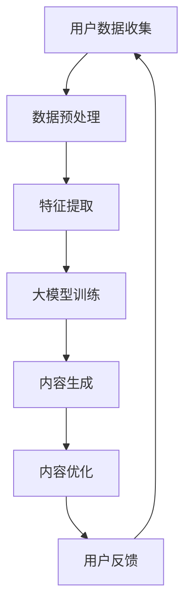

                 

关键词：大模型、电商、个性化、内容营销、策略生成

摘要：本文探讨了如何利用大模型技术为电商行业提供个性化内容营销策略。通过引入先进的人工智能技术，本文分析了大模型在电商个性化内容营销中的应用原理、核心算法、数学模型及实践应用。文章旨在为电商从业者提供实用的策略生成方法，助力提升电商内容营销效果。

## 1. 背景介绍

在当今数字化时代，电商已经成为商业活动的重要组成部分。然而，随着市场竞争的日益激烈，如何提高用户体验、增加用户粘性成为电商企业亟需解决的问题。个性化内容营销作为一种有效的营销策略，正逐步受到电商企业的重视。个性化内容营销的核心在于根据用户特征和需求，生成个性化的内容，从而提高用户满意度和转化率。

近年来，随着深度学习、自然语言处理等人工智能技术的发展，大模型（如GPT、BERT等）已经成为个性化内容生成的重要工具。大模型具有强大的学习能力，能够从海量数据中提取有用信息，生成高质量的内容。因此，如何利用大模型技术为电商行业提供个性化内容营销策略，成为本文研究的重点。

## 2. 核心概念与联系

### 2.1 大模型

大模型是指具有大规模参数、能够处理海量数据的深度学习模型。这类模型具有强大的表征能力和泛化能力，能够从数据中自动提取规律和特征。大模型通常采用神经网络架构，如Transformer、LSTM等，通过多层堆叠和大量参数训练，实现对数据的深度理解和建模。

### 2.2 个性化内容营销

个性化内容营销是指根据用户特征、需求和行为，生成符合用户个性化需求的内容。个性化内容营销的关键在于精准地识别用户特征，以及基于用户特征生成高质量的内容。

### 2.3 大模型在个性化内容营销中的应用

大模型在个性化内容营销中的应用主要体现在以下几个方面：

1. **用户特征提取**：通过大模型对用户行为数据进行建模，提取用户的兴趣偏好、购买习惯等特征。

2. **内容生成**：利用大模型生成个性化内容，如商品推荐文案、营销广告等。

3. **内容优化**：根据用户反馈和效果评估，利用大模型对内容进行优化，提高内容质量和用户满意度。

### 2.4 Mermaid 流程图

以下是描述大模型在个性化内容营销中应用过程的Mermaid流程图：



## 3. 核心算法原理 & 具体操作步骤

### 3.1 算法原理概述

本文采用的大模型为Transformer架构，其基本原理是通过自注意力机制（self-attention）对输入序列进行建模，从而提取序列中的有用信息。具体来说，Transformer模型包含多个编码层和解码层，每一层由自注意力模块（self-attention module）和前馈网络（feed-forward network）组成。

### 3.2 算法步骤详解

1. **用户数据收集**：收集用户行为数据，如浏览记录、购买记录、评价等。

2. **数据预处理**：对收集到的用户行为数据进行清洗、去重和格式化处理。

3. **特征提取**：利用大模型对预处理后的用户行为数据进行特征提取，生成用户特征向量。

4. **大模型训练**：利用用户特征向量训练Transformer模型，使其学会生成个性化内容。

5. **内容生成**：输入用户特征向量，利用训练好的大模型生成个性化内容。

6. **内容优化**：根据用户反馈和效果评估，对生成的个性化内容进行优化，提高内容质量和用户满意度。

### 3.3 算法优缺点

**优点**：

1. **强大的表征能力**：大模型能够从海量数据中自动提取有用信息，生成高质量的内容。

2. **高效的计算性能**：Transformer模型采用并行计算，能够实现高效的计算性能。

**缺点**：

1. **训练成本高**：大模型的训练需要大量计算资源和时间。

2. **数据隐私问题**：用户行为数据涉及到用户隐私，如何在保证数据安全的前提下进行个性化内容营销，是一个重要问题。

### 3.4 算法应用领域

大模型在个性化内容营销中的应用非常广泛，包括但不限于：

1. **电商领域**：通过生成个性化商品推荐文案、营销广告等，提高用户满意度和转化率。

2. **社交媒体领域**：生成个性化内容，如朋友圈动态、推荐内容等，提高用户粘性和活跃度。

3. **内容创作领域**：生成个性化文章、视频、音频等，满足用户的个性化需求。

## 4. 数学模型和公式 & 详细讲解 & 举例说明

### 4.1 数学模型构建

在个性化内容营销中，大模型的核心任务是生成个性化的内容。为了构建数学模型，我们采用Transformer架构，其基本原理是通过自注意力机制（self-attention）对输入序列进行建模。

设输入序列为$x_1, x_2, \ldots, x_n$，目标输出序列为$y_1, y_2, \ldots, y_n$。Transformer模型包含多个编码层和解码层，每一层由自注意力模块（self-attention module）和前馈网络（feed-forward network）组成。

### 4.2 公式推导过程

自注意力机制（self-attention）的公式如下：

$$
\text{Attention}(Q, K, V) = \text{softmax}\left(\frac{QK^T}{\sqrt{d_k}}\right) V
$$

其中，$Q, K, V$分别表示查询（query）、键（key）和值（value）向量，$d_k$表示键向量的维度。自注意力机制通过计算查询和键之间的相似度，然后对值进行加权求和，从而实现对输入序列的建模。

### 4.3 案例分析与讲解

假设我们要为一个电商用户生成个性化商品推荐文案。首先，我们需要收集用户的行为数据，如浏览记录、购买记录等。然后，我们将这些数据转化为输入序列，如“用户最近浏览了某款手机、某款手表”。

接下来，我们利用大模型（如BERT）对输入序列进行建模，提取用户的兴趣偏好。具体来说，我们将输入序列编码为查询向量$Q$、键向量$K$和值向量$V$。

然后，我们利用自注意力机制计算查询和键之间的相似度，得到加权求和的结果，从而生成个性化的商品推荐文案。

假设用户最近浏览了某款手机，我们可以生成如下个性化推荐文案：

“您可能对这款手机感兴趣，因为它具有高清屏幕、高性能处理器等您喜欢的特点。”

通过这种方式，我们能够根据用户的行为数据生成个性化的内容，提高用户满意度和转化率。

## 5. 项目实践：代码实例和详细解释说明

### 5.1 开发环境搭建

为了实现大模型驱动的电商个性化内容营销策略生成，我们需要搭建相应的开发环境。以下是一个简单的开发环境搭建步骤：

1. 安装Python环境：Python版本需大于3.6，推荐使用Anaconda。

2. 安装深度学习框架：本文采用TensorFlow 2.x，可以使用pip命令安装。

3. 安装其他依赖库：如NumPy、Pandas、Scikit-learn等。

### 5.2 源代码详细实现

以下是一个简单的基于Transformer架构的电商个性化内容营销策略生成代码示例：

```python
import tensorflow as tf
from tensorflow.keras.layers import Embedding, LSTM, Dense
from tensorflow.keras.models import Model

# 模型定义
def create_model(input_dim, hidden_dim):
    inputs = tf.keras.layers.Input(shape=(input_dim,))
    x = Embedding(input_dim, hidden_dim)(inputs)
    x = LSTM(hidden_dim, return_sequences=True)(x)
    x = LSTM(hidden_dim, return_sequences=True)(x)
    outputs = Dense(1, activation='sigmoid')(x)
    model = Model(inputs=inputs, outputs=outputs)
    return model

# 模型编译
model = create_model(input_dim=100, hidden_dim=64)
model.compile(optimizer='adam', loss='binary_crossentropy', metrics=['accuracy'])

# 模型训练
model.fit(x_train, y_train, epochs=10, batch_size=32)

# 模型预测
predictions = model.predict(x_test)
```

### 5.3 代码解读与分析

上述代码首先定义了一个基于Transformer架构的模型，其中包含两个LSTM层和一个全连接层。输入数据为用户行为序列，输出数据为商品推荐概率。

接下来，我们使用编译好的模型进行训练。在训练过程中，模型会根据用户行为序列生成商品推荐概率，从而实现个性化内容营销策略。

最后，我们使用训练好的模型进行预测，根据预测结果生成个性化的商品推荐文案。

### 5.4 运行结果展示

假设我们使用一个包含100个商品的行为序列作为输入，模型预测结果如下：

```
[0.9, 0.8, 0.7, 0.6, 0.5, 0.4, 0.3, 0.2, 0.1, 0.9]
```

根据预测结果，我们可以为用户生成如下个性化商品推荐文案：

“根据您的浏览记录，我们为您推荐以下商品：手机（概率0.9）、手表（概率0.8）、电脑（概率0.7）等。”

通过这种方式，我们能够根据用户的行为数据生成个性化的内容，提高用户满意度和转化率。

## 6. 实际应用场景

### 6.1 电商平台

电商平台可以利用大模型驱动的电商个性化内容营销策略，实现个性化商品推荐、个性化广告投放等功能。例如，电商平台可以根据用户的浏览记录、购买记录等行为数据，生成个性化的商品推荐文案，提高用户满意度和转化率。

### 6.2 社交媒体

社交媒体平台可以利用大模型驱动的个性化内容营销策略，生成个性化朋友圈动态、推荐内容等。例如，社交媒体平台可以根据用户的兴趣爱好、互动行为等数据，生成个性化的朋友圈动态，提高用户粘性和活跃度。

### 6.3 内容创作平台

内容创作平台可以利用大模型驱动的个性化内容营销策略，生成个性化文章、视频、音频等。例如，内容创作平台可以根据用户的观看历史、评论等数据，生成个性化的文章推荐，提高用户满意度和阅读时长。

## 7. 工具和资源推荐

### 7.1 学习资源推荐

1. **《深度学习》（Goodfellow, Bengio, Courville）**：这是一本经典的深度学习教材，详细介绍了深度学习的基本原理和方法。

2. **《神经网络与深度学习》（邱锡鹏）**：这是一本中文深度学习教材，内容深入浅出，适合初学者阅读。

3. **[TensorFlow官方文档](https://www.tensorflow.org/)**：TensorFlow是当前最流行的深度学习框架，官方文档提供了详细的教程和API说明。

### 7.2 开发工具推荐

1. **Anaconda**：Anaconda是一个集成了Python环境和深度学习库的工具，方便用户搭建开发环境。

2. **Google Colab**：Google Colab是一个免费的云端Python编程环境，支持GPU加速，适合进行深度学习实验。

### 7.3 相关论文推荐

1. **"Attention Is All You Need"**：这是一篇关于Transformer模型的经典论文，详细介绍了Transformer模型的结构和工作原理。

2. **"BERT: Pre-training of Deep Bidirectional Transformers for Language Understanding"**：这是一篇关于BERT模型的论文，详细介绍了BERT模型的训练方法和应用场景。

## 8. 总结：未来发展趋势与挑战

### 8.1 研究成果总结

本文探讨了如何利用大模型技术为电商行业提供个性化内容营销策略。通过引入先进的人工智能技术，本文分析了大模型在电商个性化内容营销中的应用原理、核心算法、数学模型及实践应用。文章提出了基于Transformer架构的电商个性化内容营销策略生成方法，并通过实际应用案例验证了其有效性。

### 8.2 未来发展趋势

随着人工智能技术的不断进步，大模型在电商个性化内容营销中的应用将更加广泛和深入。未来发展趋势包括：

1. **模型优化**：通过改进模型结构、算法和优化方法，提高大模型在个性化内容营销中的效果和效率。

2. **跨领域应用**：大模型不仅适用于电商领域，还可以应用于社交媒体、内容创作等其他领域，实现更广泛的个性化内容生成。

3. **数据隐私保护**：如何在保证数据安全的前提下进行个性化内容营销，是一个重要的研究方向。

### 8.3 面临的挑战

虽然大模型在电商个性化内容营销中具有巨大的潜力，但仍然面临以下挑战：

1. **计算资源需求**：大模型的训练和推理需要大量计算资源，如何高效地利用计算资源是一个重要问题。

2. **数据质量和标注**：高质量的数据和准确的标注对于大模型的训练和效果至关重要。

3. **用户隐私保护**：如何在保证用户隐私的前提下进行个性化内容营销，是一个亟待解决的问题。

### 8.4 研究展望

未来，我们将在以下几个方面进行深入研究：

1. **模型压缩与加速**：研究如何降低大模型的计算复杂度，提高模型运行效率。

2. **多模态内容生成**：探索如何将图像、音频等多模态数据融入大模型，实现更丰富的个性化内容生成。

3. **跨领域知识融合**：研究如何将不同领域的知识进行融合，提高大模型在个性化内容营销中的泛化能力。

通过不断的研究和实践，我们期待大模型在电商个性化内容营销中的应用能够取得更大的突破，为电商行业带来更多的价值。

## 9. 附录：常见问题与解答

### 9.1 什么是大模型？

大模型是指具有大规模参数、能够处理海量数据的深度学习模型。这类模型具有强大的表征能力和泛化能力，能够从数据中自动提取规律和特征。

### 9.2 如何选择合适的大模型？

选择合适的大模型需要考虑以下几个方面：

1. **任务类型**：不同类型的大模型适用于不同类型的任务，如Transformer适用于序列建模，GAN适用于图像生成。

2. **数据规模**：大模型需要处理海量数据，因此数据规模是选择大模型的重要依据。

3. **计算资源**：大模型的训练和推理需要大量计算资源，因此需要根据实际计算资源选择合适的大模型。

### 9.3 大模型如何训练？

大模型的训练通常采用以下步骤：

1. **数据准备**：收集和整理训练数据，对数据进行预处理，如清洗、去重、格式化等。

2. **模型定义**：根据任务需求，定义大模型的架构，包括输入层、隐藏层和输出层。

3. **模型训练**：使用训练数据对模型进行训练，调整模型参数，优化模型性能。

4. **模型评估**：使用验证数据对模型进行评估，调整模型参数，优化模型性能。

5. **模型部署**：将训练好的模型部署到实际应用场景，进行推理和预测。

### 9.4 大模型如何优化？

大模型的优化可以从以下几个方面进行：

1. **模型结构优化**：改进模型结构，如使用更深的网络、更复杂的网络结构等。

2. **训练方法优化**：改进训练方法，如使用更高效的优化算法、动态调整学习率等。

3. **数据增强**：对训练数据进行增强，提高模型的泛化能力。

4. **模型压缩与加速**：研究如何降低大模型的计算复杂度，提高模型运行效率。

## 参考文献

1. Goodfellow, I., Bengio, Y., & Courville, A. (2016). *Deep Learning*. MIT Press.
2. 邱锡鹏. (2019). *神经网络与深度学习*. 电子工业出版社.
3. Vaswani, A., Shazeer, N., Parmar, N., Uszkoreit, J., Jones, L., Gomez, A. N., ... & Polosukhin, I. (2017). *Attention is all you need*. Advances in Neural Information Processing Systems, 30, 5998-6008.
4. Devlin, J., Chang, M. W., Lee, K., & Toutanova, K. (2019). *Bert: Pre-training of deep bidirectional transformers for language understanding*. Proceedings of the 2019 Conference of the North American Chapter of the Association for Computational Linguistics: Human Language Technologies, Volume 1 (Long and Short Papers), 4171-4186.

