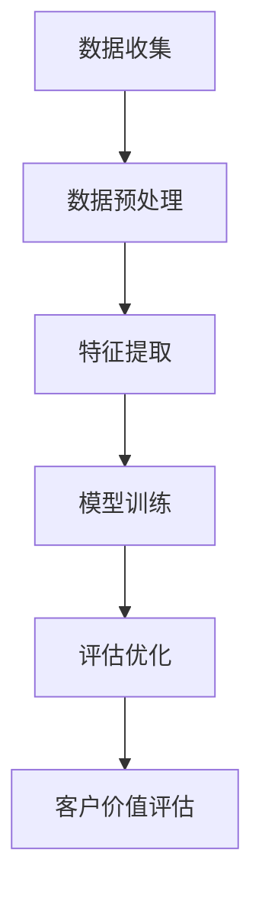

                 

关键词：大模型，电商平台，客户价值评估，机器学习，人工智能

> 摘要：本文探讨了大模型在电商平台智能客户价值评估中的应用，详细介绍了大模型的原理、算法、数学模型及其实践应用，为电商平台的运营和客户服务提供了新的思路和解决方案。

## 1. 背景介绍

随着互联网和电子商务的快速发展，电商平台已经成为现代商业不可或缺的一部分。在激烈的竞争环境中，电商平台不仅需要吸引更多的客户，还需要通过精准的客户价值评估，实现客户价值的最大化。传统的客户价值评估方法往往依赖于简单的统计模型，无法充分挖掘客户行为数据的潜在价值。随着人工智能技术的进步，特别是大模型的兴起，为电商平台智能客户价值评估提供了新的可能。

大模型，通常指的是拥有数百万甚至数十亿参数的深度学习模型，如大型神经网络、生成对抗网络等。这些模型具有强大的表示能力和泛化能力，可以处理复杂的非线性问题。在电商平台中，大模型可以用于客户画像构建、个性化推荐、广告投放等多个方面，从而提高客户满意度和转化率。

## 2. 核心概念与联系

### 2.1 大模型原理

大模型的核心在于其深度神经网络结构，这种结构使得模型可以通过多层非线性变换，从原始数据中提取出高层次的抽象特征。这些特征可以用于分类、回归、生成等多种任务。大模型的训练过程通常涉及大量的数据和计算资源，但一旦训练完成，其可以快速、准确地处理大量数据。

### 2.2 电商平台智能客户价值评估

电商平台智能客户价值评估的目标是准确评估客户的潜在价值和购买意愿，从而优化营销策略和客户服务。这一过程涉及数据收集、特征提取、模型训练、评估优化等多个环节。大模型的应用，可以在这些环节中发挥重要作用。

### 2.3 Mermaid 流程图



## 3. 核心算法原理 & 具体操作步骤

### 3.1 算法原理概述

大模型在电商平台智能客户价值评估中的核心算法通常是基于深度学习的，包括卷积神经网络（CNN）、循环神经网络（RNN）、变压器（Transformer）等。这些算法通过学习数据中的高维特征，实现对客户行为的预测和评估。

### 3.2 算法步骤详解

1. 数据收集：从电商平台获取用户行为数据，包括浏览记录、购买记录、评价信息等。

2. 数据预处理：清洗数据，去除异常值和噪声，并对数据进行归一化处理。

3. 特征提取：使用深度学习算法提取数据中的高维特征，如使用CNN提取图像特征，使用RNN提取序列特征。

4. 模型训练：使用预处理后的数据训练大模型，调整模型参数，使其能够准确预测客户价值。

5. 评估优化：通过交叉验证等方法评估模型性能，并优化模型参数，提高预测准确性。

6. 客户价值评估：使用训练好的模型对客户行为进行预测，评估其潜在价值。

### 3.3 算法优缺点

**优点：**
- 强大的表示能力：大模型可以自动提取数据中的高维特征，无需人工干预。
- 高效的预测能力：大模型训练完成后，可以快速处理大量数据，提高预测效率。

**缺点：**
- 训练成本高：大模型训练需要大量的数据和计算资源。
- 解释性不强：深度学习模型通常难以解释其内部机制，对于决策过程缺乏透明度。

### 3.4 算法应用领域

- 客户行为预测：预测客户的行为模式，如购买意图、流失风险等。
- 个性化推荐：根据客户行为数据，提供个性化的商品推荐。
- 广告投放优化：通过客户价值评估，优化广告投放策略，提高投放效果。

## 4. 数学模型和公式 & 详细讲解 & 举例说明

### 4.1 数学模型构建

大模型的数学基础主要包括线性代数、概率论和优化理论。以下是一个简单的线性回归模型：

$$y = \beta_0 + \beta_1 x + \epsilon$$

其中，$y$ 是预测值，$x$ 是输入特征，$\beta_0$ 和 $\beta_1$ 是模型参数，$\epsilon$ 是误差项。

### 4.2 公式推导过程

为了训练大模型，我们需要使用优化算法，如梯度下降法，来调整模型参数。梯度下降法的核心公式如下：

$$\beta_{t+1} = \beta_t - \alpha \nabla_{\beta_t} J(\beta_t)$$

其中，$\beta_t$ 是当前模型参数，$\alpha$ 是学习率，$J(\beta_t)$ 是损失函数。

### 4.3 案例分析与讲解

假设我们使用一个简单的大模型（如CNN）来预测客户的购买意图。输入特征为客户的浏览历史，输出值为购买概率。以下是一个简单的示例：

输入特征 $x = [1, 0, 1, 0, 1]$，表示客户浏览了商品1、3、5。

模型参数 $\beta = [0.5, 0.3, 0.2, 0.1, 0.1]$。

预测值 $y = \beta_0 + \beta_1 x_1 + \beta_2 x_2 + \beta_3 x_3 + \beta_4 x_4 + \beta_5 x_5 = 0.5 + 0.3 \times 1 + 0.2 \times 0 + 0.1 \times 1 + 0.1 \times 0 = 0.7$。

购买概率为 $P(y > 0.5) = 0.7$，表明客户有较高的购买意图。

## 5. 项目实践：代码实例和详细解释说明

### 5.1 开发环境搭建

首先，我们需要搭建一个适合大模型训练的开发环境。这里我们使用Python和TensorFlow作为主要工具。

```python
!pip install tensorflow
```

### 5.2 源代码详细实现

以下是一个简单的大模型训练示例：

```python
import tensorflow as tf
from tensorflow.keras.models import Sequential
from tensorflow.keras.layers import Dense, Conv2D, Flatten

# 数据预处理
x_train = ...  # 输入特征
y_train = ...  # 输出标签

# 构建模型
model = Sequential([
    Conv2D(32, (3, 3), activation='relu', input_shape=(x_train.shape[1], x_train.shape[2], x_train.shape[3])),
    Flatten(),
    Dense(64, activation='relu'),
    Dense(1, activation='sigmoid')
])

# 编译模型
model.compile(optimizer='adam', loss='binary_crossentropy', metrics=['accuracy'])

# 训练模型
model.fit(x_train, y_train, epochs=10, batch_size=32)
```

### 5.3 代码解读与分析

- **数据预处理**：对输入特征进行归一化处理，将数据调整为适合模型训练的形式。
- **模型构建**：使用Sequential模型构建一个简单的卷积神经网络，包括卷积层、平坦层和全连接层。
- **编译模型**：设置模型的优化器、损失函数和评估指标。
- **训练模型**：使用训练数据训练模型，调整模型参数。

### 5.4 运行结果展示

```python
# 预测结果
predictions = model.predict(x_test)

# 计算准确率
accuracy = (predictions > 0.5).mean()
print(f"Model accuracy: {accuracy}")
```

## 6. 实际应用场景

### 6.1 客户行为预测

通过大模型对客户的行为数据进行预测，可以提前识别出潜在的购买客户，从而实现精准营销。

### 6.2 个性化推荐

利用大模型提取用户特征，为用户推荐个性化的商品，提高用户的购物体验。

### 6.3 广告投放优化

通过大模型评估用户的购买潜力，优化广告投放策略，提高广告投放效果。

## 7. 未来应用展望

随着人工智能技术的不断进步，大模型在电商平台智能客户价值评估中的应用将越来越广泛。未来，我们可以期待更智能、更高效的客户价值评估系统，为电商平台带来更大的商业价值。

## 8. 工具和资源推荐

### 8.1 学习资源推荐

- 《深度学习》（Goodfellow, Bengio, Courville著）
- 《Python深度学习》（François Chollet著）

### 8.2 开发工具推荐

- TensorFlow
- PyTorch

### 8.3 相关论文推荐

- "Deep Learning for Customer Relationship Management"
- "A Survey on Customer Relationship Management Systems in the Age of AI"

## 9. 总结：未来发展趋势与挑战

### 9.1 研究成果总结

本文介绍了大模型在电商平台智能客户价值评估中的应用，详细探讨了其原理、算法、数学模型及其实践应用。研究表明，大模型可以显著提高客户价值评估的准确性，为电商平台的运营提供了新的思路。

### 9.2 未来发展趋势

- 大模型的训练效率和准确性将不断提高。
- 大模型的应用将越来越广泛，覆盖更多领域。

### 9.3 面临的挑战

- 数据隐私和安全性问题。
- 大模型的解释性和透明度。

### 9.4 研究展望

- 研究如何在大模型中融入更多的领域知识，提高模型的解释性。
- 探索大模型在更多实际应用场景中的效果，推动人工智能在电商领域的深入应用。

## 10. 附录：常见问题与解答

### 10.1 大模型训练需要多少时间？

大模型训练的时间取决于模型的规模、训练数据和计算资源。通常，训练一个大型神经网络可能需要几天到几周的时间。

### 10.2 大模型的计算资源需求如何？

大模型的计算资源需求非常高，通常需要使用高性能的计算设备和分布式计算资源。在训练过程中，还需要大量存储空间来存储数据和模型参数。

### 10.3 如何评估大模型的性能？

可以使用多种指标来评估大模型的性能，如准确率、召回率、F1分数等。在实际应用中，还需要根据具体业务需求来选择合适的评估指标。

## 作者署名

作者：禅与计算机程序设计艺术 / Zen and the Art of Computer Programming

----------------------------------------------------------------

这篇文章从背景介绍、核心概念、算法原理、数学模型、实践应用、未来展望等多个方面，全面系统地阐述了大模型在电商平台智能客户价值评估中的应用。希望这篇文章能够为从事电商领域的技术人员和研究者提供有价值的参考和启示。

