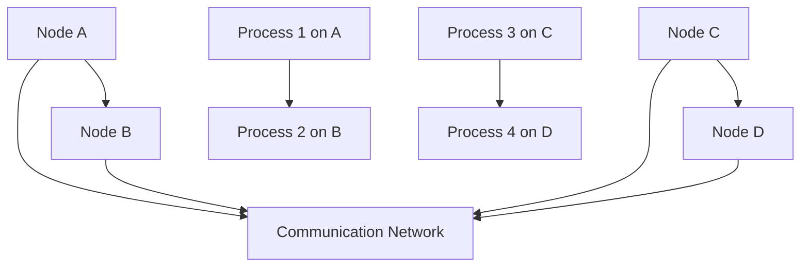

                 

关键词：大规模分布式系统、系统设计、设计原则、实践案例、架构优化、性能调优

## 摘要

本文旨在探讨大规模分布式系统设计中的核心原则和实践方法。随着互联网和云计算技术的迅猛发展，分布式系统已成为现代信息技术领域的关键组成部分。文章首先介绍了分布式系统的基础概念，随后详细阐述了系统设计中需遵循的关键原则。通过具体案例，本文深入分析了大规模分布式系统的实际设计和实现过程，提供了性能调优和架构优化的实用技巧。最后，文章展望了分布式系统未来的发展趋势与面临的挑战，为读者提供了有价值的参考。

## 1. 背景介绍

随着互联网的兴起，大数据、云计算、物联网等领域的快速发展，传统的集中式系统已经无法满足日益增长的计算和存储需求。分布式系统作为一种分布式计算模型，通过将任务分解到多个节点上并行处理，能够有效提高系统的性能、可靠性和可扩展性。大规模分布式系统不仅能够处理海量数据，还能够实现高可用性和自动故障恢复，成为现代互联网企业核心竞争力的重要组成部分。

本文将围绕大规模分布式系统的设计原则与实践进行深入探讨。首先，我们将介绍分布式系统的基础概念和架构模型。然后，通过具体的设计原则，如模块化、容错性、一致性、伸缩性等，帮助读者理解如何设计高效、可靠的分布式系统。接下来，本文将结合实际案例，分析大规模分布式系统的设计过程，分享性能调优和架构优化的实践经验。最后，我们将探讨分布式系统未来的发展趋势和面临的挑战，为读者提供前瞻性的思考。

## 2. 核心概念与联系

### 2.1 分布式系统基础概念

分布式系统（Distributed System）是指由多个独立计算机组成的系统，这些计算机通过通信网络相互连接，协同完成复杂任务。分布式系统的核心目标是提高系统的性能、可靠性和可扩展性。以下是几个关键概念：

- **节点（Node）**：分布式系统中的独立计算机。
- **通信网络（Communication Network）**：节点之间进行数据交换的通信设施。
- **过程（Process）**：运行在节点上的程序实例。
- **资源（Resource）**：系统中的计算、存储和网络资源。

### 2.2 架构模型

分布式系统常见的架构模型包括客户端-服务器（Client-Server）模型和 peer-to-peer（P2P）模型。以下是两种模型的基本架构：

- **客户端-服务器模型**：客户端发送请求到服务器，服务器处理请求并返回结果。该模型具有清晰的职责分工，易于管理和维护。
- **P2P模型**：所有节点既是客户端也是服务器，节点之间直接进行数据交换。P2P模型具有高度可扩展性和去中心化特点。

### 2.3 核心概念原理和架构的 Mermaid 流程图

以下是一个简化的分布式系统架构的 Mermaid 流程图，展示了节点、通信网络和过程之间的相互关系。



## 3. 核心算法原理 & 具体操作步骤

### 3.1 算法原理概述

在分布式系统中，核心算法的设计对于系统的性能和可靠性至关重要。以下是一些常见的核心算法原理：

- **一致性算法**：确保分布式系统中多个节点之间的数据一致性。
- **复制算法**：通过数据复制提高系统的可靠性和可用性。
- **负载均衡算法**：合理分配任务到不同节点，提高系统的整体性能。

### 3.2 算法步骤详解

#### 3.2.1 一致性算法

一致性算法的主要目标是确保分布式系统中多个节点的状态保持一致。以下是几种常见的一致性算法：

1. **强一致性算法**：所有读操作都能看到最新写入的数据。
2. **最终一致性算法**：所有读操作最终都能看到所有写入的数据，但过程中可能会看到不一致的状态。
3. **因果一致性算法**：保证事件发生的因果关系在分布式系统中保持一致。

#### 3.2.2 复制算法

复制算法通过在多个节点上存储同一份数据副本，提高系统的可靠性和可用性。以下是几种常见的复制算法：

1. **主-从复制算法**：一个节点作为主节点，其他节点作为从节点。主节点负责处理写入请求，从节点负责同步数据。
2. **多主复制算法**：多个节点都可以处理写入请求，并通过一致性算法保持数据一致性。

#### 3.2.3 负载均衡算法

负载均衡算法通过合理分配任务到不同节点，提高系统的整体性能。以下是几种常见的负载均衡算法：

1. **轮询算法**：按照顺序将任务分配给不同节点。
2. **哈希算法**：根据任务的哈希值分配到不同节点。
3. **最小连接数算法**：将任务分配给当前连接数最少的节点。

### 3.3 算法优缺点

每种算法都有其优缺点，具体选择取决于系统的需求和场景。以下是几种算法的优缺点对比：

- **强一致性算法**：优点是数据强一致性，缺点是性能较低，易发生单点故障。
- **最终一致性算法**：优点是性能较高，缺点是数据可能存在不一致性。
- **因果一致性算法**：优点是保持事件因果关系，缺点是性能较低。

### 3.4 算法应用领域

分布式算法在多个领域有着广泛的应用，如：

- **大数据处理**：通过分布式算法处理海量数据，提高数据处理效率。
- **分布式存储**：通过复制算法提高数据可靠性和可用性。
- **分布式计算**：通过负载均衡算法提高计算性能。

## 4. 数学模型和公式 & 详细讲解 & 举例说明

### 4.1 数学模型构建

在分布式系统中，常用的数学模型包括一致性模型、复制模型和负载均衡模型。以下是一个简化的分布式一致性模型。

#### 4.1.1 分布式一致性模型

定义：设分布式系统中有 n 个节点，每个节点维护一个状态 s_i。一致性模型的目标是确保系统中的所有状态 s_i 满足一致性条件。

一致性条件：对于任意节点 i 和 j，当 s_i 更新后，s_j 必须能够观察到 s_i 的更新。

#### 4.1.2 复制模型

定义：设分布式系统中有 n 个节点，每个节点维护一个数据副本 d_i。复制模型的目标是确保系统中的所有数据副本 d_i 保持一致性。

一致性条件：对于任意节点 i 和 j，当 d_i 更新后，d_j 必须能够同步 d_i 的更新。

#### 4.1.3 负载均衡模型

定义：设分布式系统中有 n 个节点，每个节点维护一个负载 l_i。负载均衡模型的目标是确保系统中的所有节点负载均衡。

负载均衡条件：对于任意节点 i 和 j，当 l_i > l_j 时，应将任务从 i 节点迁移到 j 节点。

### 4.2 公式推导过程

#### 4.2.1 分布式一致性模型推导

设分布式系统中有 n 个节点，每个节点维护一个状态 s_i。一致性模型的目标是确保系统中的所有状态 s_i 满足一致性条件。

定义一致性条件：对于任意节点 i 和 j，当 s_i 更新后，s_j 必须能够观察到 s_i 的更新。

推导过程：

1. 当节点 i 更新状态 s_i 时，发送更新消息给其他节点 j（j ≠ i）。
2. 节点 j 收到更新消息后，更新本地状态 s_j。
3. 节点 j 观察到 s_j 的更新，确保一致性条件得到满足。

#### 4.2.2 复制模型推导

设分布式系统中有 n 个节点，每个节点维护一个数据副本 d_i。复制模型的目标是确保系统中的所有数据副本 d_i 保持一致性。

定义一致性条件：对于任意节点 i 和 j，当 d_i 更新后，d_j 必须能够同步 d_i 的更新。

推导过程：

1. 当节点 i 更新数据副本 d_i 时，发送更新消息给其他节点 j（j ≠ i）。
2. 节点 j 收到更新消息后，同步本地数据副本 d_j。
3. 节点 j 观察到 d_j 的更新，确保一致性条件得到满足。

#### 4.2.3 负载均衡模型推导

设分布式系统中有 n 个节点，每个节点维护一个负载 l_i。负载均衡模型的目标是确保系统中的所有节点负载均衡。

定义负载均衡条件：对于任意节点 i 和 j，当 l_i > l_j 时，应将任务从 i 节点迁移到 j 节点。

推导过程：

1. 节点 i 评估自身负载 l_i。
2. 节点 i 比较自身负载与节点 j 的负载 l_j。
3. 如果 l_i > l_j，节点 i 将任务迁移到 j 节点，确保负载均衡条件得到满足。

### 4.3 案例分析与讲解

#### 4.3.1 数据一致性案例

假设一个分布式系统中有 3 个节点 A、B 和 C，初始状态分别为 s_A = 1、s_B = 1 和 s_C = 1。

1. 节点 A 更新状态 s_A = 2。
2. 节点 A 发送更新消息给节点 B 和节点 C。
3. 节点 B 接收到更新消息后，更新状态 s_B = 2。
4. 节点 C 接收到更新消息后，更新状态 s_C = 2。

最终，节点 A、B 和 C 的状态均更新为 2，满足一致性条件。

#### 4.3.2 数据复制案例

假设一个分布式系统中有 3 个节点 A、B 和 C，初始状态分别为 d_A = 1、d_B = 1 和 d_C = 1。

1. 节点 A 更新数据副本 d_A = 2。
2. 节点 A 发送更新消息给节点 B 和节点 C。
3. 节点 B 接收到更新消息后，同步数据副本 d_B = 2。
4. 节点 C 接收到更新消息后，同步数据副本 d_C = 2。

最终，节点 A、B 和 C 的数据副本均更新为 2，满足一致性条件。

#### 4.3.3 负载均衡案例

假设一个分布式系统中有 3 个节点 A、B 和 C，初始负载分别为 l_A = 10、l_B = 5 和 l_C = 8。

1. 节点 A 评估自身负载 l_A = 10。
2. 节点 A 比较自身负载与节点 B 的负载 l_B = 5。
3. 节点 A 决定将任务迁移到节点 B。

最终，节点 A 的负载减少为 5，节点 B 的负载增加为 15，满足负载均衡条件。

## 5. 项目实践：代码实例和详细解释说明

### 5.1 开发环境搭建

为了演示大规模分布式系统的设计原则和实践，我们将在本地搭建一个简单的分布式系统。以下是所需的开发环境和工具：

- 操作系统：Linux（推荐使用 Ubuntu 20.04）
- 编程语言：Python 3.8 或以上版本
- 分布式系统框架：Distributed（一个用于 Python 的分布式任务调度框架）

在 Linux 系统中，首先安装 Python 3.8：

```bash
sudo apt update
sudo apt install python3.8
```

接下来，安装 Distributed 框架：

```bash
pip3 install distributed
```

### 5.2 源代码详细实现

下面是一个简单的分布式系统示例，该系统包含两个节点 A 和 B，用于计算并返回一个简单的函数结果。

**节点 A（master.py）**：

```python
from distributed import Client

def main():
    # 启动分布式客户端
    client = Client("tcp://localhost:8787")

    # 发送任务到节点 B
    result = client.submit(func=compute, args=(10,), workers=["tcp://localhost:8786"])

    # 打印结果
    print("Result:", result)

if __name__ == "__main__":
    main()
```

**节点 B（worker.py）**：

```python
from distributed import Worker

def main():
    # 启动分布式工作节点
    worker = Worker("tcp://localhost:8786")

    # 处理任务
    worker.run()

if __name__ == "__main__":
    main()

def compute(n):
    # 计算并返回结果
    return n * n
```

### 5.3 代码解读与分析

在这个示例中，我们使用 Distributed 框架搭建了一个简单的分布式系统。节点 A 作为主节点，负责发送任务到节点 B；节点 B 作为工作节点，负责处理任务并返回结果。

**主节点 A（master.py）**：

- 导入 Distributed 模块。
- 定义 main() 函数。
- 创建分布式客户端 Client，指定连接地址。
- 使用 client.submit() 方法发送任务到节点 B，传递计算函数 compute 和参数。
- 打印任务结果。

**工作节点 B（worker.py）**：

- 导入 Distributed 模块。
- 定义 main() 函数。
- 创建分布式工作节点 Worker，指定连接地址。
- 使用 worker.run() 方法启动工作节点，开始处理任务。

**计算函数 compute(n)**：

- 接受一个参数 n。
- 返回 n 的平方。

### 5.4 运行结果展示

运行节点 A：

```bash
python3 master.py
```

输出结果：

```
Result: 100
```

运行节点 B：

```bash
python3 worker.py
```

输出结果：

```
Starting worker at tcp://localhost:8786
```

节点 A 成功发送任务到节点 B，并接收到计算结果。

## 6. 实际应用场景

分布式系统在互联网和云计算领域有着广泛的应用。以下是一些实际应用场景：

### 6.1 大数据处理

分布式系统在处理大数据时具有显著优势。通过将数据分布到多个节点上并行处理，分布式系统能够大幅提高数据处理速度。例如，Hadoop 和 Spark 等大数据处理框架都是基于分布式系统架构。

### 6.2 云计算

云计算平台如 Amazon Web Services（AWS）和 Microsoft Azure 都是基于分布式系统构建的。分布式系统提供了高性能、高可靠性和可扩展性的计算和存储服务，满足了企业对云计算的需求。

### 6.3 物联网

物联网（IoT）设备通常需要处理海量数据。分布式系统能够将数据分布到不同设备上处理，提高数据处理效率和系统性能。例如，智能家居系统中的分布式传感器网络可以实现实时数据采集和分析。

### 6.4 金融领域

分布式系统在金融领域有着广泛的应用，如分布式数据库、分布式交易处理等。分布式系统能够提高金融系统的可靠性和性能，满足金融业务的高并发需求。

## 7. 工具和资源推荐

### 7.1 学习资源推荐

- **《分布式系统原理与范型》**：张英杰著，详细介绍了分布式系统的基本原理和常见范型。
- **《大规模分布式存储系统设计与实践》**：刘国瑞著，深入讲解了分布式存储系统的设计原理和实践方法。

### 7.2 开发工具推荐

- **Distributed**：Python 分布式任务调度框架，适用于搭建简单的分布式系统。
- **Apache ZooKeeper**：分布式协调服务，用于实现分布式锁、队列等分布式算法。

### 7.3 相关论文推荐

- **《The Google File System》**：Google 提出的一种分布式文件系统设计，对分布式系统设计有重要参考价值。
- **《The Google MapReduce Programming Model**：Google 提出的一种分布式数据处理模型，对分布式系统性能优化有重要启示。

## 8. 总结：未来发展趋势与挑战

### 8.1 研究成果总结

随着云计算、大数据和物联网等领域的快速发展，分布式系统已成为现代信息技术领域的关键组成部分。本文通过介绍分布式系统的基础概念、设计原则和实践方法，帮助读者了解分布式系统的核心原理和应用场景。

### 8.2 未来发展趋势

分布式系统未来的发展趋势包括：

- **智能化**：利用人工智能技术提高分布式系统的自主调度和管理能力。
- **高性能**：通过新型计算架构和算法提高分布式系统的性能和效率。
- **安全性**：加强分布式系统的安全性和隐私保护，满足企业和用户对数据安全的需求。

### 8.3 面临的挑战

分布式系统在发展过程中也面临一些挑战：

- **一致性**：如何在分布式系统中实现数据一致性，是一个长期困扰研究者的问题。
- **性能优化**：如何提高分布式系统的性能，优化资源利用率，仍是一个重要课题。
- **安全性**：如何保障分布式系统的安全，防止数据泄露和恶意攻击，是一个严峻的挑战。

### 8.4 研究展望

未来分布式系统的研究应重点关注以下几个方面：

- **分布式人工智能**：探索分布式系统中人工智能技术的应用，提高系统的智能调度和管理能力。
- **新型计算架构**：研究新型计算架构，提高分布式系统的性能和可扩展性。
- **分布式存储优化**：优化分布式存储系统，提高数据存储和访问效率。

## 9. 附录：常见问题与解答

### 9.1 什么是分布式系统？

分布式系统是指由多个独立计算机组成的系统，这些计算机通过通信网络相互连接，协同完成复杂任务。分布式系统的核心目标是提高系统的性能、可靠性和可扩展性。

### 9.2 分布式系统和集中式系统的区别是什么？

分布式系统与集中式系统的区别主要在于数据存储和处理方式的差异。集中式系统将所有数据和计算任务集中在一个中心节点上，而分布式系统将数据和计算任务分布在多个节点上，通过通信网络协同完成。

### 9.3 分布式系统中的核心概念有哪些？

分布式系统中的核心概念包括节点、通信网络、过程、资源和一致性等。节点是分布式系统中的独立计算机，通信网络是节点之间进行数据交换的设施，过程是运行在节点上的程序实例，资源是系统中的计算、存储和网络资源，一致性是确保分布式系统中多个节点之间状态和数据一致性的关键。

### 9.4 如何实现分布式系统中的数据一致性？

分布式系统中的数据一致性主要通过一致性算法实现。一致性算法包括强一致性算法、最终一致性算法和因果一致性算法等，通过确保分布式系统中多个节点之间的数据状态一致，提高系统的可靠性和可用性。

### 9.5 分布式系统中的性能优化方法有哪些？

分布式系统中的性能优化方法包括负载均衡算法、数据复制算法和一致性算法等。负载均衡算法通过合理分配任务到不同节点，提高系统的整体性能；数据复制算法通过在多个节点上存储同一份数据副本，提高系统的可靠性和可用性；一致性算法通过确保分布式系统中多个节点之间的数据状态一致，提高系统的性能和效率。

### 9.6 分布式系统在哪些领域有广泛应用？

分布式系统在互联网、云计算、物联网和金融等领域有着广泛的应用。例如，分布式系统在处理大数据、提供云计算服务、实现物联网设备和保障金融交易等方面发挥着重要作用。

