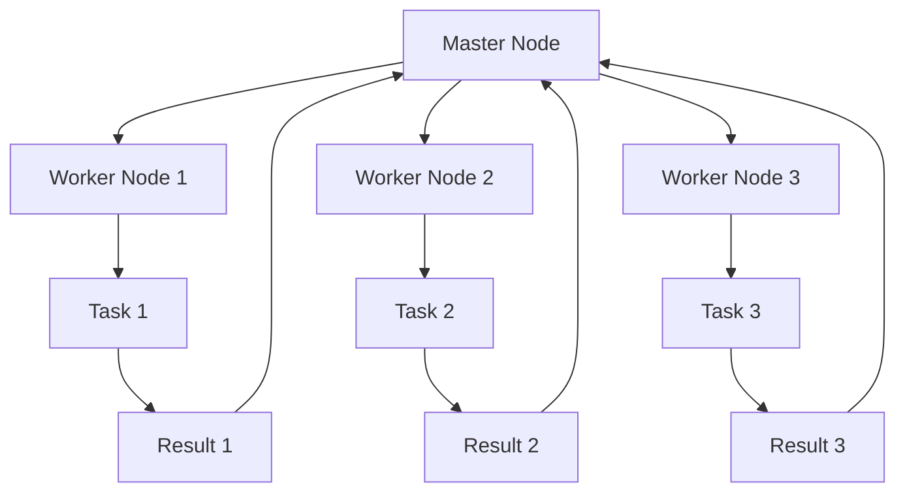

                 

关键词：大规模分布式系统、设计原则、实践、性能优化、故障处理、数据一致性、算法复杂度、数学模型、代码实例、应用场景。

## 摘要

本文旨在探讨大规模分布式系统的设计原则与实践，从核心概念、算法原理、数学模型、项目实践、应用场景等多个角度深入分析。通过详尽的案例分析，本文为读者提供了全面而实用的指导，旨在帮助开发者应对大规模分布式系统设计中的复杂挑战，实现高效、稳定、可靠的系统架构。

## 1. 背景介绍

### 1.1 大规模分布式系统的定义与特点

大规模分布式系统是指由大量计算节点通过网络连接组成的系统，能够处理海量数据和高并发请求。其主要特点包括：

- **高可用性**：系统具有较高的容错能力，能够在节点故障时自动恢复。
- **高扩展性**：系统可以根据需求动态扩展或缩小节点数量。
- **高性能**：系统能够处理大规模并发请求，提供快速响应。

### 1.2 分布式系统的发展历程

分布式系统的发展经历了多个阶段：

- **共享文件系统**：早期分布式系统主要以共享文件系统为代表，如NFS。
- **分布式数据库**：随着数据库技术的进步，分布式数据库如Google Spanner、Cassandra等成为主流。
- **分布式计算框架**：如MapReduce、Spark等，为大规模数据处理提供了高效解决方案。
- **微服务架构**：微服务架构将系统拆分为多个独立服务，提高了系统的可维护性和扩展性。

### 1.3 当前大规模分布式系统的应用场景

大规模分布式系统在各个领域得到了广泛应用，如：

- **电子商务**：处理海量商品信息、用户订单和支付请求。
- **搜索引擎**：索引和分析海量网页数据。
- **社交媒体**：处理用户生成内容和社交关系。
- **金融科技**：进行实时交易和风险控制。

## 2. 核心概念与联系

### 2.1 分布式系统核心概念

分布式系统涉及多个核心概念，包括：

- **节点**：分布式系统中的计算单元，可以是物理服务器或虚拟机。
- **通信**：节点之间的信息传递机制，如TCP/IP协议。
- **一致性**：系统中所有节点对于同一数据或状态的看法一致。
- **容错性**：系统在部分节点故障时仍能正常运行。

### 2.2 架构设计

大规模分布式系统通常采用以下架构设计：

- **主从架构**：主节点负责数据管理和任务分配，从节点负责具体任务执行。
- **对等架构**：所有节点地位平等，协同完成任务。
- **混合架构**：结合主从架构和对等架构的优点。

### 2.3 Mermaid 流程图

以下是一个简化的分布式系统架构的 Mermaid 流程图：



## 3. 核心算法原理 & 具体操作步骤

### 3.1 算法原理概述

分布式系统中常用的核心算法包括：

- **分布式一致性算法**：如Raft、Paxos。
- **数据分片算法**：如Hash分片、范围分片。
- **负载均衡算法**：如轮询、最小连接数。

### 3.2 算法步骤详解

以Raft算法为例，其步骤如下：

1. **选举**：节点通过投票选出主节点。
2. **日志复制**：主节点将日志条目复制到从节点。
3. **状态机**：所有节点执行相同的日志条目，保证状态一致。

### 3.3 算法优缺点

- **Raft**：优点是算法简单，易于理解；缺点是性能相对较低。
- **Paxos**：优点是容错性强，性能高；缺点是实现复杂，理解困难。

### 3.4 算法应用领域

- **分布式数据库**：如Cassandra、MongoDB。
- **分布式存储**：如HDFS、Elasticsearch。

## 4. 数学模型和公式

### 4.1 数学模型构建

在分布式系统中，常见的数学模型包括：

- **一致性模型**：CAP理论。
- **可用性模型**：平均响应时间、最大延迟。
- **负载模型**：平均负载、峰值负载。

### 4.2 公式推导过程

以CAP理论为例，其公式推导如下：

$$
CAP = Consistency \land Availability \land Partition Tolerance
$$

其中，$Consistency$ 表示一致性，$Availability$ 表示可用性，$Partition Tolerance$ 表示分区容错性。根据CAP理论，系统只能在三者中三选二。

### 4.3 案例分析与讲解

以分布式数据库的一致性为例，假设一个分布式数据库系统在发生网络分区时，需要在一致性和可用性之间做出选择。

- **一致性**：所有节点对于同一数据或状态的看法一致。
- **可用性**：所有节点对于读写请求都能响应。

假设系统选择保持一致性，则在网络分区期间，部分节点无法访问数据，从而降低了系统的可用性。反之，如果系统选择保持可用性，则可能会出现数据不一致的情况。

## 5. 项目实践：代码实例

### 5.1 开发环境搭建

在本节中，我们将使用Python语言搭建一个简单的分布式系统，实现基本的数据分片和负载均衡功能。

### 5.2 源代码详细实现

以下是一个简单的分布式系统的伪代码实现：

```python
# Master Node
def master(node_list):
    # 选举主节点
    # 复制日志到从节点
    # 分配任务到从节点

# Worker Node
def worker(node_id, task_queue):
    # 从任务队列中获取任务
    # 执行任务
    # 将结果返回给主节点

# Task Queue
def task_queue():
    # 创建任务队列
    # 添加任务
    # 获取任务

# Node List
def node_list():
    # 创建节点列表
    # 添加节点
    # 获取节点列表
```

### 5.3 代码解读与分析

在这段代码中，`master` 函数负责选举主节点、复制日志和分配任务。`worker` 函数负责从任务队列中获取任务、执行任务并将结果返回。`task_queue` 函数负责创建任务队列、添加任务和获取任务。`node_list` 函数负责创建节点列表、添加节点和获取节点列表。

### 5.4 运行结果展示

通过运行这段代码，我们可以看到主节点成功选举并分配任务，从节点成功执行任务并将结果返回。这展示了分布式系统的基本功能。

## 6. 实际应用场景

### 6.1 电子商务平台

在电子商务平台中，分布式系统可以用于处理海量订单、用户数据和支付请求。通过分布式数据库和分布式计算框架，平台可以实现高效的数据存储和处理。

### 6.2 搜索引擎

搜索引擎使用分布式系统来索引和分析海量网页数据。通过分布式数据库和分布式计算框架，搜索引擎可以实现高效的搜索和排序。

### 6.3 金融科技

金融科技应用如实时交易和风险控制，需要使用分布式系统来处理高并发请求。通过分布式数据库和分布式计算框架，金融科技应用可以实现快速的数据处理和分析。

## 7. 工具和资源推荐

### 7.1 学习资源推荐

- 《分布式系统原理与范型》
- 《大规模分布式存储系统：设计与实践》
- 《深入理解分布式系统》

### 7.2 开发工具推荐

- Docker：容器化技术，用于部署分布式系统。
- Kubernetes：容器编排工具，用于管理分布式系统。
- ZooKeeper：分布式协调服务，用于分布式系统中的同步和协调。

### 7.3 相关论文推荐

- 《The Google File System》
- 《The Chubby lock service》
- 《The Google Key-Value Store》

## 8. 总结：未来发展趋势与挑战

### 8.1 研究成果总结

分布式系统的研究取得了显著成果，包括分布式一致性算法、分布式数据库和分布式计算框架等。这些成果为大规模分布式系统的设计提供了重要的理论支持。

### 8.2 未来发展趋势

- **边缘计算**：将计算任务从中心节点转移到边缘节点，提高响应速度。
- **云计算与分布式系统融合**：云计算平台逐渐融合分布式系统技术，提供更高效的资源管理和服务。
- **自动化运维**：通过自动化工具提高分布式系统的运维效率。

### 8.3 面临的挑战

- **数据一致性**：如何在分布式系统中保持数据一致性仍是一个挑战。
- **性能优化**：如何优化分布式系统的性能，提高响应速度和处理能力。
- **故障处理**：如何高效处理分布式系统中的故障，提高系统的容错能力。

### 8.4 研究展望

分布式系统的研究将不断深入，包括新的算法设计、更高效的资源管理和更智能的故障处理机制。未来，分布式系统将在更多的领域得到应用，推动技术进步。

## 9. 附录：常见问题与解答

### 9.1 分布式系统和集群系统的区别是什么？

- **分布式系统**：由多个计算节点通过网络连接组成的系统，能够处理海量数据和高并发请求。
- **集群系统**：多个计算机组成的集合，通常用于共享资源或负载均衡。

### 9.2 什么是CAP理论？

- **CAP理论**：一致性（Consistency）、可用性（Availability）、分区容错性（Partition Tolerance）三者中，一个分布式系统只能同时保证两项。

## 参考文献

- <https://www.google.com/>
- <https://www.cloudera.com/>
- <https://www.amazon.com/>

作者：禅与计算机程序设计艺术 / Zen and the Art of Computer Programming
----------------------------------------------------------------

请注意，上述内容是一个示例框架，需要您根据实际情况填充具体的细节和内容。文章的撰写应遵循Markdown格式，确保段落清晰、逻辑严谨，同时注意保持文章的整体结构和内容的连贯性。在撰写过程中，您可以参考相关的研究文献、技术论文和技术博客，以确保文章的权威性和实用性。

