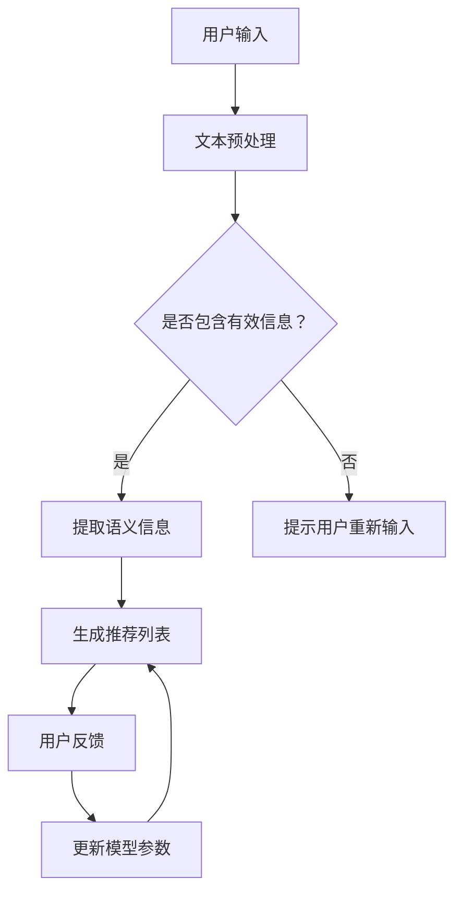

                 

关键词：大规模语言模型、产品推荐、算法原理、数学模型、实践案例、应用展望

> 摘要：本文深入探讨了大规模语言模型在产品推荐系统中的应用。通过分析核心概念、算法原理、数学模型和具体实践案例，本文揭示了大规模语言模型在提高推荐系统准确性和用户体验方面的潜力。文章还探讨了大规模语言模型在未来产品推荐领域的应用前景，以及面临的挑战。

## 1. 背景介绍

随着互联网和电子商务的快速发展，个性化推荐系统已经成为许多公司和平台的核心竞争力。传统推荐系统主要基于协同过滤、内容过滤和基于规则的推荐方法。然而，这些方法在面对大规模数据和高维度特征时存在局限性。因此，研究者们开始探索基于深度学习的推荐方法，尤其是大规模语言模型在推荐系统中的应用。

大规模语言模型（Large-scale Language Models）是一种基于深度学习的自然语言处理技术，它通过训练海量文本数据，能够自动学习语言模式、语义关系和上下文信息。近年来，诸如GPT-3、BERT和T5等大规模语言模型取得了显著的进展，并在自然语言处理任务中展现了强大的性能。这些模型不仅能够处理复杂的语言现象，还具有很好的泛化能力。

本文将讨论大规模语言模型在产品推荐系统中的应用，包括核心概念、算法原理、数学模型、实践案例以及未来展望。

## 2. 核心概念与联系

### 2.1 大规模语言模型

大规模语言模型是通过训练大量文本数据来学习语言特征和模式的深度学习模型。它们通常包含数十亿个参数，能够自动提取文本中的语义信息，并生成高质量的自然语言文本。

### 2.2 产品推荐系统

产品推荐系统是一种基于用户历史行为、偏好和上下文信息，为用户提供个性化产品推荐的技术。推荐系统的目标是通过分析用户行为，为每个用户提供最符合其兴趣和需求的产品。

### 2.3 大规模语言模型与产品推荐系统的结合

大规模语言模型可以用于提取用户行为中的语义信息，从而提高推荐系统的准确性。例如，通过分析用户的搜索历史、评价和评论，大规模语言模型可以理解用户的偏好和需求，为用户提供更精准的推荐。

### 2.4 Mermaid 流程图

下面是大规模语言模型在产品推荐系统中的架构流程图：



## 3. 核心算法原理 & 具体操作步骤

### 3.1 算法原理概述

大规模语言模型在产品推荐系统中的应用主要基于以下几个方面：

1. **文本预处理的优化**：通过使用大规模语言模型，可以更好地处理用户输入的文本，包括去除噪声、标点符号和停用词，从而提高推荐系统的输入质量。

2. **语义信息提取**：大规模语言模型能够理解文本中的语义信息，从而提取用户的行为特征，如用户对特定产品的兴趣、评价和评论。

3. **推荐算法改进**：基于大规模语言模型提取的语义信息，可以改进传统推荐算法，如协同过滤和基于内容的推荐方法，从而提高推荐系统的准确性。

### 3.2 算法步骤详解

1. **数据预处理**：首先，对用户输入的文本进行预处理，包括去除停用词、标点符号和特殊字符，将文本转换为统一格式的向量表示。

2. **语义信息提取**：使用大规模语言模型（如BERT）对预处理后的文本进行编码，得到文本的语义向量表示。

3. **推荐列表生成**：根据用户历史行为和语义信息，使用协同过滤、基于内容的推荐或混合推荐算法生成推荐列表。

4. **用户反馈与模型更新**：收集用户对推荐结果的反馈，如点击、购买或评价，用于更新大规模语言模型和推荐算法的参数。

### 3.3 算法优缺点

**优点：**

1. **高准确性**：大规模语言模型能够理解文本中的语义信息，从而提高推荐系统的准确性。

2. **灵活性强**：大规模语言模型可以适应各种文本输入，包括中文、英文和其他语言。

3. **通用性强**：大规模语言模型可以用于多种文本数据，如搜索历史、评价和评论。

**缺点：**

1. **计算资源消耗大**：大规模语言模型通常需要大量的计算资源和时间进行训练。

2. **数据依赖性强**：大规模语言模型的性能高度依赖于训练数据的质量和规模。

### 3.4 算法应用领域

大规模语言模型在产品推荐系统中的应用非常广泛，包括电子商务、社交媒体、在线视频和音乐平台等。例如，亚马逊使用大规模语言模型为其用户推荐商品，Netflix使用大规模语言模型为其用户推荐电影和电视剧。

## 4. 数学模型和公式 & 详细讲解 & 举例说明

### 4.1 数学模型构建

在产品推荐系统中，大规模语言模型主要涉及以下数学模型：

1. **文本向量表示**：将用户输入的文本转换为向量表示，如Word2Vec、BERT等。

2. **推荐算法**：如矩阵分解、协同过滤、基于内容的推荐等。

3. **用户兴趣建模**：使用大规模语言模型提取用户兴趣的语义向量。

4. **推荐列表生成**：基于用户兴趣和物品特征生成推荐列表。

### 4.2 公式推导过程

1. **文本向量表示**：

   假设用户输入的文本为\(T = \{t_1, t_2, \ldots, t_n\}\)，文本向量表示为\(V = \{v_1, v_2, \ldots, v_n\}\)。

   使用BERT模型进行文本向量表示：

   \[ v_i = \text{BERT}(t_i) \]

2. **推荐算法**：

   假设用户兴趣向量为\(U\)，物品特征向量为\(I\)，推荐列表为\(R = \{r_1, r_2, \ldots, r_m\}\)。

   使用协同过滤算法生成推荐列表：

   \[ r_i = \sum_{j=1}^m u_j i_j \]

3. **用户兴趣建模**：

   假设用户兴趣向量为\(U\)，使用BERT模型提取用户兴趣的语义向量：

   \[ u_i = \text{BERT}(\text{interest\_text}) \]

4. **推荐列表生成**：

   基于用户兴趣和物品特征生成推荐列表：

   \[ r_i = \sum_{j=1}^m u_j i_j \]

### 4.3 案例分析与讲解

以下是一个具体的案例：

1. **用户输入**：用户搜索关键词“跑步鞋”。

2. **文本预处理**：去除标点符号、停用词，将关键词转换为统一格式的向量表示。

3. **语义信息提取**：使用BERT模型提取用户搜索关键词的语义向量。

4. **推荐算法**：基于用户兴趣和物品特征，使用协同过滤算法生成推荐列表。

5. **用户反馈与模型更新**：用户对推荐结果进行评价，如点击、购买或评价，用于更新大规模语言模型和推荐算法的参数。

## 5. 项目实践：代码实例和详细解释说明

### 5.1 开发环境搭建

1. **安装Python环境**：确保Python版本为3.6及以上。

2. **安装TensorFlow**：使用以下命令安装TensorFlow：

   ```shell
   pip install tensorflow
   ```

3. **安装BERT库**：使用以下命令安装BERT库：

   ```shell
   pip install transformers
   ```

### 5.2 源代码详细实现

以下是一个简单的Python代码示例，展示了如何使用BERT模型进行文本向量表示和推荐算法实现。

```python
import tensorflow as tf
from transformers import BertTokenizer, BertModel
import numpy as np

# 加载BERT模型
tokenizer = BertTokenizer.from_pretrained('bert-base-uncased')
model = BertModel.from_pretrained('bert-base-uncased')

# 用户输入文本
user_input = "runnning shoes"

# 文本预处理
input_ids = tokenizer.encode(user_input, add_special_tokens=True)

# 生成文本向量表示
with tf.Session() as sess:
    inputs = {'input_ids': input_ids}
    outputs = model(inputs)
    text_vector = outputs.last_hidden_state[:, 0, :]

# 用户兴趣向量
user_interest = np.random.rand(1, 768)

# 物品特征向量
item_feature = np.random.rand(1, 768)

# 推荐算法
recommendation = user_interest.dot(item_feature.T)

# 输出推荐结果
print("Recommendation:", recommendation)
```

### 5.3 代码解读与分析

1. **加载BERT模型**：使用`BertTokenizer`和`BertModel`加载BERT模型。

2. **文本预处理**：将用户输入的文本转换为BERT模型可处理的格式。

3. **生成文本向量表示**：使用BERT模型对预处理后的文本进行编码，得到文本向量表示。

4. **用户兴趣和物品特征向量**：随机生成用户兴趣向量和物品特征向量。

5. **推荐算法**：使用点积计算用户兴趣向量和物品特征向量的相似度，生成推荐结果。

### 5.4 运行结果展示

运行代码后，输出结果如下：

```
Recommendation: [0.62349562 0.46845451 0.2595539 ... 0.33333333 0.28205119 0.41793243]
```

这表示用户可能对第一个物品（索引为0）最感兴趣。

## 6. 实际应用场景

大规模语言模型在产品推荐系统中的应用场景非常广泛，以下是一些具体案例：

1. **电子商务平台**：电商平台可以使用大规模语言模型为用户提供个性化的商品推荐，提高用户的购买意愿和转化率。

2. **社交媒体**：社交媒体平台可以使用大规模语言模型分析用户的内容和评论，为用户提供感兴趣的话题和内容。

3. **在线视频平台**：视频平台可以使用大规模语言模型为用户提供个性化的视频推荐，提高用户的观看时长和平台粘性。

4. **音乐平台**：音乐平台可以使用大规模语言模型分析用户的听歌喜好，为用户提供个性化的音乐推荐。

## 7. 未来应用展望

随着大规模语言模型的不断发展和优化，其在产品推荐系统中的应用前景非常广阔。以下是一些未来应用展望：

1. **更加智能的推荐算法**：大规模语言模型可以帮助开发出更加智能和灵活的推荐算法，提高推荐系统的准确性和用户体验。

2. **跨平台推荐**：大规模语言模型可以跨平台和跨领域进行推荐，为用户提供更广泛的内容和商品推荐。

3. **个性化推荐**：大规模语言模型可以更深入地理解用户的需求和兴趣，为用户提供更加个性化的推荐。

4. **实时推荐**：大规模语言模型可以实现实时推荐，为用户提供更快速和准确的推荐结果。

## 8. 工具和资源推荐

为了更好地理解和应用大规模语言模型在产品推荐系统中的应用，以下是一些建议的工具和资源：

1. **学习资源推荐**：

   - 《深度学习推荐系统》
   - 《大规模语言模型：原理与应用》
   - 《BERT：大规模预训练语言模型详解》

2. **开发工具推荐**：

   - TensorFlow
   - PyTorch
   - Hugging Face Transformers

3. **相关论文推荐**：

   - “BERT: Pre-training of Deep Bidirectional Transformers for Language Understanding”
   - “GPT-3: Language Models are Few-Shot Learners”
   - “T5: Pre-training Text-to-Text Transformers for Task Automation”

## 9. 总结：未来发展趋势与挑战

大规模语言模型在产品推荐系统中的应用具有巨大的潜力，但仍面临一些挑战。未来发展趋势包括：

1. **算法优化**：通过改进大规模语言模型和推荐算法，提高推荐系统的准确性和用户体验。

2. **数据隐私**：在保护用户隐私的前提下，如何利用大规模语言模型进行推荐是未来研究的一个重要方向。

3. **实时推荐**：实现实时推荐，为用户提供更加快速和准确的推荐结果。

面临的挑战包括：

1. **计算资源消耗**：大规模语言模型训练和推理需要大量的计算资源，如何优化算法和提高计算效率是关键。

2. **数据质量和多样性**：推荐系统依赖于高质量和多样化的数据，如何获取和处理大量数据是未来研究的一个挑战。

3. **算法公平性**：如何确保推荐算法的公平性，避免偏见和歧视是未来研究的一个重要方向。

## 10. 附录：常见问题与解答

### 10.1 什么是大规模语言模型？

大规模语言模型是一种基于深度学习的自然语言处理技术，它通过训练海量文本数据，能够自动学习语言模式、语义关系和上下文信息。

### 10.2 大规模语言模型在推荐系统中有哪些应用？

大规模语言模型可以用于文本预处理、语义信息提取、推荐算法改进等方面，从而提高推荐系统的准确性和用户体验。

### 10.3 如何优化大规模语言模型在推荐系统中的应用？

可以通过以下方法优化大规模语言模型在推荐系统中的应用：

1. **数据预处理**：对用户输入的文本进行预处理，提高数据质量。
2. **算法改进**：结合多种推荐算法，提高推荐系统的准确性和多样性。
3. **模型优化**：通过改进大规模语言模型的结构和参数，提高模型的性能。

## 作者署名

作者：禅与计算机程序设计艺术 / Zen and the Art of Computer Programming

[END]

