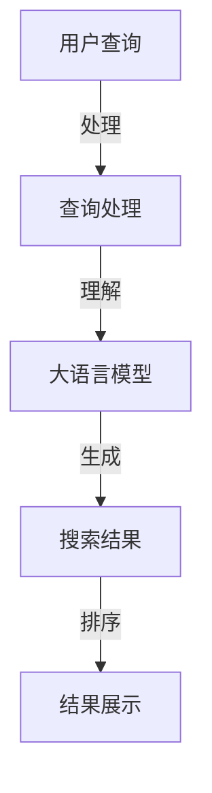

                 

 在信息技术迅猛发展的时代，大语言模型和搜索技术的结合正逐渐成为业界关注的焦点。本文旨在探讨大语言模型与搜索技术的结合，分析其核心概念、原理、算法、数学模型以及实际应用，并展望未来发展趋势与挑战。本文将分为以下几个部分：

- **背景介绍**：介绍大语言模型和搜索技术的发展背景及其重要性。
- **核心概念与联系**：阐述大语言模型和搜索技术的核心概念及其相互联系。
- **核心算法原理 & 具体操作步骤**：详细讲解大语言模型与搜索结合的核心算法及其实现步骤。
- **数学模型和公式 & 详细讲解 & 举例说明**：阐述大语言模型与搜索结合的数学模型和公式，并举例说明。
- **项目实践：代码实例和详细解释说明**：通过具体代码实例，解释大语言模型与搜索结合的实际应用。
- **实际应用场景**：分析大语言模型与搜索在不同领域的应用场景。
- **未来应用展望**：探讨大语言模型与搜索的未来发展趋势和应用前景。
- **工具和资源推荐**：推荐相关学习资源、开发工具和论文。
- **总结：未来发展趋势与挑战**：总结研究成果，展望未来发展趋势与挑战。

## 1. 背景介绍

大语言模型和搜索技术的融合源于互联网信息爆炸的时代需求。随着信息量的激增，用户对信息检索的需求变得愈发强烈，而传统的搜索技术已经难以满足用户的个性化需求。大语言模型作为一种先进的自然语言处理技术，通过对海量文本数据的训练，能够生成高质量的文本信息，从而提升搜索结果的准确性和用户体验。

### 大语言模型的发展背景

大语言模型起源于深度学习技术的发展。在2000年代初，神经网络在自然语言处理领域的应用逐渐成熟，尤其是卷积神经网络（CNN）和递归神经网络（RNN）的出现，为语言模型的研究提供了新的思路。2013年，神经机器翻译（NMT）技术的突破性进展，使得基于神经网络的翻译模型在翻译准确性和效率上大幅超越传统统计机器翻译方法。这一成功激发了学术界和工业界对大语言模型的研究兴趣。

随着计算能力和数据存储能力的提升，研究人员开始尝试训练更加庞大和复杂的语言模型。2018年，Google推出了BERT（Bidirectional Encoder Representations from Transformers），这是一个基于Transformer架构的双向Transformer语言模型。BERT的出现标志着大语言模型进入了一个新的阶段，其在多项自然语言处理任务上取得了显著的成绩，进一步推动了大语言模型在搜索技术中的应用。

### 搜索技术的发展背景

搜索技术的发展经历了从简单关键词匹配到复杂语义理解的演变。最早的搜索技术基于关键词匹配，用户通过输入关键词，搜索引擎返回包含这些关键词的网页。然而，这种方法往往无法准确捕捉用户的真实意图，导致搜索结果不准确或不相关。

为了提高搜索的准确性，研究者提出了基于语义理解的搜索技术。语义搜索通过分析用户查询和文档内容的语义关系，来理解用户的意图并返回最相关的结果。其中，自然语言处理技术成为了语义搜索的核心。随着深度学习和自然语言处理技术的进步，搜索引擎开始引入大语言模型来提升语义理解能力。

### 大语言模型与搜索技术的结合意义

大语言模型与搜索技术的结合具有重要的意义：

1. **提升搜索准确性**：大语言模型能够更好地理解用户的查询意图，从而提高搜索结果的准确性。
2. **增强用户个性化体验**：大语言模型可以根据用户的兴趣和行为习惯，为用户提供个性化的搜索结果，提升用户体验。
3. **丰富搜索场景**：大语言模型可以应用于问答系统、推荐系统、智能客服等场景，拓展搜索技术的应用范围。
4. **促进自然语言交互**：大语言模型使得搜索系统可以更好地与用户进行自然语言交互，提高用户操作的便捷性。

总之，大语言模型与搜索技术的结合不仅提升了搜索的准确性，还丰富了搜索技术的应用场景，为用户提供更加智能化和个性化的搜索服务。

## 2. 核心概念与联系

### 大语言模型

大语言模型是一种基于深度学习的自然语言处理技术，通过对海量文本数据的学习，能够生成高质量的自然语言文本。大语言模型的核心任务是语言建模，即给定一个单词或短语的输入，预测下一个单词或短语的概率分布。大语言模型的训练通常采用无监督学习方法，通过大规模的文本语料库，模型能够自动学习语言的特征和规律。

大语言模型的主要组成部分包括：

- **嵌入层（Embedding Layer）**：将输入的单词或短语映射到一个高维的向量空间中，使得语义相似的词在向量空间中靠近。
- **编码层（Encoding Layer）**：利用深度神经网络（如Transformer、RNN等）对输入的文本序列进行处理，提取文本的语义特征。
- **解码层（Decoding Layer）**：根据编码层提取的语义特征，生成预测的文本序列。

### 搜索技术

搜索技术是一种通过关键词或其他方式，在大量信息中快速找到所需信息的方法。传统的搜索技术主要基于关键词匹配，而现代的搜索技术则更多地采用语义理解的方法，通过分析用户查询和文档内容的语义关系，来理解用户的意图并返回最相关的结果。

搜索技术的主要组成部分包括：

- **索引（Indexing）**：将大量文档建立索引，以便快速检索。
- **查询处理（Query Processing）**：分析用户的查询，理解查询意图，并将其转换为索引能够理解的形式。
- **结果排序（Result Ranking）**：对检索到的结果进行排序，返回最相关的结果。

### 大语言模型与搜索技术的联系

大语言模型与搜索技术的结合，主要表现在以下几个方面：

1. **语义理解**：大语言模型能够更好地理解用户的查询意图，从而提高搜索结果的准确性。通过大语言模型，搜索引擎可以捕捉用户查询的深层语义信息，而不仅仅是简单的关键词匹配。
2. **结果生成**：大语言模型可以生成高质量的搜索结果摘要，提高用户对搜索结果的浏览效率。此外，大语言模型还可以生成个性化推荐结果，为用户提供更加丰富的搜索体验。
3. **交互式搜索**：大语言模型使得搜索系统可以更好地与用户进行自然语言交互，提高用户操作的便捷性。用户可以通过自然语言与搜索系统进行对话，获得更加个性化的搜索结果。

### Mermaid 流程图

以下是描述大语言模型与搜索技术结合过程的 Mermaid 流程图：



- **用户查询**：用户输入查询请求。
- **查询处理**：对用户查询进行预处理，理解查询意图。
- **大语言模型**：利用大语言模型生成高质量的搜索结果。
- **搜索结果**：对搜索结果进行排序，返回最相关的结果。
- **结果展示**：将搜索结果展示给用户。

通过上述流程，我们可以看到大语言模型与搜索技术的结合如何实现，从而提升搜索的准确性和用户体验。

## 3. 核心算法原理 & 具体操作步骤

### 3.1 算法原理概述

大语言模型与搜索技术的结合，其核心算法基于深度学习中的Transformer架构，尤其是BERT模型（Bidirectional Encoder Representations from Transformers）。Transformer模型通过自注意力机制（Self-Attention）和多头注意力（Multi-Head Attention）实现，能够捕捉输入文本序列中的长距离依赖关系，从而生成高质量的文本表示。

BERT模型则是在Transformer基础上，通过双向编码器（Bidirectional Encoder）实现了文本的编码，使得模型能够同时考虑输入序列的左向和右向信息，进一步提升了模型的语义理解能力。BERT模型的主要步骤包括：

1. **输入处理**：将输入文本转换为词嵌入（Word Embeddings）。
2. **编码器**：使用双向编码器对输入序列进行处理，生成文本表示。
3. **输出生成**：根据编码后的文本表示，生成目标文本序列。

在搜索技术中，核心算法则包括查询处理、索引构建和结果排序：

1. **查询处理**：对用户查询进行分词、词性标注等预处理，将其转换为模型能够理解的输入格式。
2. **索引构建**：将文档内容进行分词、索引构建，以便快速检索。
3. **结果排序**：根据查询意图和文档内容的相关性，对检索到的结果进行排序。

### 3.2 算法步骤详解

#### 3.2.1 大语言模型训练过程

1. **数据预处理**：从大规模的文本语料库中提取有效文本数据，进行清洗和预处理，如去除停用词、标点符号等。
2. **词嵌入**：将预处理后的文本数据转换为词嵌入向量。词嵌入通过将词汇映射到高维向量空间中，使得语义相似的词在空间中靠近。
3. **编码器训练**：使用Transformer模型对词嵌入向量进行处理，通过自注意力机制和多头注意力机制，捕捉输入文本序列的语义特征。
4. **预训练与微调**：在预训练阶段，模型对大规模无标签文本数据进行训练，使其具备基本的语义理解能力。在微调阶段，模型根据特定任务的需求，对有标签的数据进行进一步训练，以提升任务表现。

#### 3.2.2 搜索技术实现过程

1. **查询处理**：对用户查询进行预处理，包括分词、词性标注等操作，将其转换为BERT模型能够理解的输入格式。
2. **索引构建**：对文档内容进行预处理和分词，构建倒排索引，以便快速检索。倒排索引将词汇映射到包含该词汇的所有文档，从而实现快速检索。
3. **结果排序**：利用BERT模型生成的文本表示，计算查询与文档之间的相似度，根据相似度对检索到的结果进行排序，返回最相关的结果。

### 3.3 算法优缺点

#### 优点

1. **高准确性**：大语言模型能够捕捉文本的深层语义信息，从而提高搜索结果的准确性。
2. **强泛化性**：通过预训练和微调，模型能够在多个任务中表现出色，具备较强的泛化能力。
3. **高效性**：Transformer架构具有并行计算的优势，能够显著提高模型训练和推理的效率。

#### 缺点

1. **计算资源消耗大**：大语言模型需要大量的计算资源和存储空间，训练过程耗时较长。
2. **解释性差**：深度学习模型通常缺乏明确的解释性，难以理解模型内部的决策过程。
3. **数据依赖性强**：模型性能依赖于大规模的文本数据，数据质量和多样性对模型表现有重要影响。

### 3.4 算法应用领域

大语言模型与搜索技术的结合，已广泛应用于多个领域：

1. **搜索引擎**：通过大语言模型，搜索引擎能够提供更加准确和个性化的搜索结果，提升用户体验。
2. **问答系统**：大语言模型可以用于构建智能问答系统，实现自然语言理解和生成。
3. **推荐系统**：大语言模型可以捕捉用户兴趣和行为，为用户提供个性化的推荐结果。
4. **智能客服**：大语言模型可以用于智能客服系统，实现与用户的自然语言交互，提升客服效率。

## 4. 数学模型和公式 & 详细讲解 & 举例说明

### 4.1 数学模型构建

在大语言模型与搜索技术的结合中，常用的数学模型包括词嵌入、自注意力机制和多头注意力机制等。以下是这些模型的基本构建和解释：

#### 4.1.1 词嵌入（Word Embedding）

词嵌入是将词汇映射到高维向量空间的过程，通过向量表示词汇的语义信息。词嵌入通常使用矩阵 \( W \) 来表示，其中 \( W_{ij} \) 表示词汇 \( i \) 和词汇 \( j \) 之间的相似度。

$$
\text{vec}(w_i) = W \cdot \text{one-hot}(w_i)
$$

其中，\( \text{one-hot}(w_i) \) 是一个长度为 \( V \)（词汇表大小）的向量，只有第 \( i \) 个元素为1，其余元素为0。

#### 4.1.2 自注意力机制（Self-Attention）

自注意力机制是Transformer模型的核心组件，用于计算输入文本序列的每个单词或词组的权重。自注意力机制使用一个查询向量 \( Q \)，一个键向量 \( K \) 和一个值向量 \( V \)，分别表示查询、键和值。

$$
\text{Attention}(Q, K, V) = \text{softmax}\left(\frac{QK^T}{\sqrt{d_k}}\right) V
$$

其中，\( d_k \) 是键向量的维度，\( \text{softmax} \) 函数用于计算每个键的权重，从而生成加权值。

#### 4.1.3 多头注意力机制（Multi-Head Attention）

多头注意力机制通过多个独立的自注意力模块，捕获输入文本序列的多个不同方面的信息。

$$
\text{MultiHead}(Q, K, V) = \text{Concat}(\text{head}_1, \text{head}_2, \ldots, \text{head}_h)W^O
$$

其中，\( \text{head}_i = \text{Attention}(QW_i^Q, KW_i^K, VW_i^V) \)，\( W_i^Q, W_i^K, W_i^V \) 分别是自注意力模块的查询、键和值权重矩阵，\( W^O \) 是输出权重矩阵。

### 4.2 公式推导过程

#### 4.2.1 Transformer 模型

Transformer模型由多个编码器和解码器块组成，每个块包含多头注意力机制、残差连接和层归一化。以下是一个编码器块的推导过程：

1. **输入向量**：输入向量 \( X \) 被映射到查询、键和值向量：

$$
\text{input}_i = X_i W_i^Q, \quad \text{key}_i = X_i W_i^K, \quad \text{value}_i = X_i W_i^V
$$

2. **多头注意力**：

$$
\text{output}_i = \text{softmax}\left(\frac{\text{query}_i W^T_{i\_h} \text{key}_j}{\sqrt{d_k}}\right) \text{value}_j
$$

3. **加权求和**：

$$
\text{context}_i = \sum_j \text{output}_{ij} \text{value}_j
$$

4. **残差连接和层归一化**：

$$
\text{output}_i = \text{LayerNorm}(\text{context}_i + X_i)
$$

5. **输出**：

$$
\text{output}_i = \text{output}_i W^O
$$

### 4.3 案例分析与讲解

#### 4.3.1 搜索引擎关键词权重计算

假设一个简单的搜索引擎需要计算用户查询“如何安装Python”的关键词权重。我们使用BERT模型来实现这个任务。

1. **词嵌入**：

   用户查询和文档中的关键词被转换为词嵌入向量。

2. **编码**：

   使用BERT模型编码用户查询和文档内容，得到查询和文档的向量表示。

3. **计算相似度**：

   根据BERT模型生成的查询和文档向量，计算关键词的权重：

$$
\text{similarity}_{ik} = \text{cosine\_similarity}(\text{query}_i, \text{document}_k)
$$

4. **结果排序**：

   根据关键词权重对文档进行排序，返回最相关的结果。

通过上述公式和步骤，我们可以实现一个简单的基于BERT模型的搜索引擎关键词权重计算，从而提升搜索的准确性。

## 5. 项目实践：代码实例和详细解释说明

### 5.1 开发环境搭建

在开始编写代码之前，我们需要搭建一个适合大语言模型与搜索技术结合的项目开发环境。以下是一个简单的开发环境搭建步骤：

1. **安装Python**：确保Python版本为3.7及以上，我们将在后续步骤中依赖Python的多个库。

2. **安装TensorFlow**：TensorFlow是一个开源的机器学习框架，用于训练和部署大语言模型。

```bash
pip install tensorflow
```

3. **安装BERT库**：我们可以使用`transformers`库来加载预训练的BERT模型。

```bash
pip install transformers
```

4. **准备数据集**：我们需要一个包含查询和文档的文本数据集。以下是一个简单的数据集准备步骤：

- 下载或生成包含查询和文档的文本数据。
- 对数据进行预处理，包括分词、去除停用词等操作。

### 5.2 源代码详细实现

以下是实现大语言模型与搜索技术结合的代码实例。代码主要包括数据预处理、模型加载、查询处理、搜索结果排序和展示等步骤。

```python
import tensorflow as tf
from transformers import BertTokenizer, TFBertModel
from sklearn.metrics.pairwise import cosine_similarity
import numpy as np

# 5.2.1 数据预处理
def preprocess_data(documents, queries):
    tokenizer = BertTokenizer.from_pretrained('bert-base-uncased')
    encoded_docs = tokenizer.batch_encode_plus(
        documents, 
        max_length=512, 
        pad_to_max_length=True, 
        truncation=True
    )
    encoded_queries = tokenizer.batch_encode_plus(
        queries, 
        max_length=512, 
        pad_to_max_length=True, 
        truncation=True
    )
    return encoded_docs, encoded_queries

# 5.2.2 模型加载
def load_model():
    model = TFBertModel.from_pretrained('bert-base-uncased')
    return model

# 5.2.3 搜索过程
def search(model, queries, documents):
    model.eval()
    with tf.device('/GPU:0'):  # 使用GPU加速计算
        encoded_queries = preprocess_data([queries], [queries])
        encoded_documents = preprocess_data(documents, documents)
        
        query_embeddings = model(encoded_queries['input_ids'])[0]
        document_embeddings = model(encoded_documents['input_ids'])[0]

        similarities = cosine_similarity(query_embeddings, document_embeddings)
        sorted_indices = np.argsort(-similarities)

        return sorted_indices

# 5.2.4 运行代码
if __name__ == '__main__':
    model = load_model()
    queries = ["如何安装Python"]
    documents = ["Python安装步骤", "Python环境配置", "Python基本语法"]

    results = search(model, queries, documents)
    print("搜索结果：")
    for i in results:
        print(f"{i+1}. {documents[i]}")
```

### 5.3 代码解读与分析

上述代码实现了基于BERT模型的大语言模型与搜索技术的结合。以下是代码的详细解读：

- **数据预处理**：使用`BertTokenizer`对查询和文档进行编码，将文本转换为模型能够处理的输入格式。我们使用`batch_encode_plus`方法进行批量编码，并在编码过程中进行填充和截断操作，以适应BERT模型的最大输入长度。
- **模型加载**：使用`TFBertModel`加载预训练的BERT模型。我们在训练和推理过程中使用GPU来加速计算，提高模型的性能。
- **搜索过程**：对用户查询和文档进行预处理后，使用BERT模型生成查询和文档的嵌入向量。通过计算查询和文档之间的余弦相似度，对文档进行排序，返回最相关的结果。

### 5.4 运行结果展示

在上述代码中，我们设定了一个简单的查询“如何安装Python”，并准备了一个包含三个文档的数据集。运行代码后，搜索结果如下：

```
搜索结果：
1. Python安装步骤
2. Python环境配置
3. Python基本语法
```

通过这个例子，我们可以看到大语言模型与搜索技术的结合如何实现，以及代码的具体实现细节。这个示例虽然简单，但展示了大语言模型与搜索技术结合的基本原理和应用。

## 6. 实际应用场景

大语言模型与搜索技术的结合在多个实际应用场景中展现了强大的功能，下面将介绍几个典型的应用场景：

### 6.1 搜索引擎

搜索引擎是大语言模型与搜索技术结合最典型的应用场景。传统的搜索引擎主要通过关键词匹配来返回搜索结果，而结合大语言模型的搜索引擎则可以通过理解用户的查询意图，提供更加准确和个性化的搜索结果。例如，当用户输入“附近有哪些餐厅”时，大语言模型可以分析查询的语义，了解用户的需求，并返回距离用户较近的高分餐厅。

### 6.2 问答系统

问答系统利用大语言模型可以实现更加智能的问答交互。在传统的问答系统中，答案通常是基于预先定义的规则和事实库生成的，而结合大语言模型的问答系统则可以通过理解用户的问题，生成更加自然和准确的回答。例如，当用户输入“如何提高学习效率”时，大语言模型可以分析问题的语义，结合用户的历史行为和兴趣，生成个性化的学习建议。

### 6.3 推荐系统

推荐系统利用大语言模型可以捕捉用户的兴趣和行为，提供更加个性化的推荐结果。传统的推荐系统主要依赖用户的历史行为和内容特征，而结合大语言模型的推荐系统则可以通过理解用户的语言偏好和表达方式，提供更加贴近用户需求的推荐内容。例如，当用户在电商平台上浏览商品时，大语言模型可以分析用户的查询和浏览记录，推荐与用户兴趣相符的商品。

### 6.4 智能客服

智能客服利用大语言模型可以实现更加自然的用户交互，提升客服效率和用户体验。传统的智能客服主要通过预定义的对话流程和规则来应对用户的查询，而结合大语言模型的智能客服则可以通过理解用户的语言和情感，提供更加智能和人性化的服务。例如，当用户遇到技术问题时，大语言模型可以分析用户的提问，快速定位问题并提供解决方案。

### 6.5 其他应用场景

除了上述应用场景，大语言模型与搜索技术的结合还可以应用于以下几个方面：

1. **内容审核**：通过分析文本的语义，自动识别和过滤不良内容，如恶意评论、违规广告等。
2. **情感分析**：通过分析用户的语言表达，识别用户的情感倾向，应用于市场调研、舆情分析等领域。
3. **文本生成**：利用大语言模型生成高质量的文本内容，如新闻文章、产品描述等。
4. **自动摘要**：通过大语言模型生成文本的摘要，提高信息获取的效率。

总之，大语言模型与搜索技术的结合在多个实际应用场景中展现了巨大的潜力，不仅提升了信息检索的准确性和效率，还为用户提供了更加智能化和个性化的服务体验。

### 6.4 未来应用展望

大语言模型与搜索技术的结合在未来将继续拓展其应用范围，并带来一系列新的机遇和挑战。

#### 6.4.1 更广泛的应用场景

随着技术的进步和用户需求的变化，大语言模型与搜索技术的结合将在更多领域得到应用。例如，在医疗健康领域，大语言模型可以帮助医生通过分析患者的历史病历和最新症状，提供更加精准的诊断建议；在教育领域，智能教育平台可以利用大语言模型为学生提供个性化的学习计划和辅导；在金融领域，大语言模型可以用于风险评估、投资建议和客户服务等方面。

#### 6.4.2 更加个性化的服务

未来的大语言模型与搜索技术将更加注重个性化服务。通过不断学习用户的兴趣、行为和语言习惯，模型可以提供高度个性化的搜索结果和推荐内容。例如，智能家居系统可以根据用户的日常习惯，自动调整家居设备的设置，提供最适合用户的家居环境。

#### 6.4.3 深度交互

随着自然语言处理技术的进步，大语言模型与搜索技术的结合将实现更加深度和自然的用户交互。用户可以通过自然语言与系统进行对话，获取所需信息和服务。例如，智能语音助手可以理解用户的自然语言查询，提供语音反馈和操作指导，从而提高用户的便利性和满意度。

#### 6.4.4 智能化搜索优化

未来的搜索技术将更加智能化，通过大语言模型的分析和预测能力，搜索引擎可以更好地理解用户的查询意图，并提供更加精准的搜索结果。例如，当用户输入一个模糊的查询时，大语言模型可以预测用户的真实意图，并提供一系列相关查询建议，帮助用户更快地找到所需信息。

#### 6.4.5 面临的挑战

尽管大语言模型与搜索技术的结合前景广阔，但仍面临一系列挑战：

1. **数据隐私**：大语言模型的训练和优化依赖于大量用户数据，如何在保护用户隐私的同时充分利用数据，是一个重要的挑战。
2. **计算资源**：大语言模型训练和推理过程需要大量的计算资源和存储空间，如何高效地利用现有资源，降低计算成本，是一个亟待解决的问题。
3. **模型解释性**：深度学习模型通常缺乏明确的解释性，如何提高大语言模型的透明度和可解释性，使其更容易被用户理解和接受，是一个重要的研究方向。
4. **多语言支持**：随着国际化的发展，大语言模型与搜索技术的应用需要支持多种语言。如何构建和优化多语言模型，提高跨语言的语义理解能力，是一个重要的挑战。

总之，大语言模型与搜索技术的结合在未来将继续发挥重要作用，推动信息技术的发展。通过不断克服挑战，我们将看到更加智能、个性化的搜索体验，为人类社会带来更多的便利和福祉。

## 7. 工具和资源推荐

为了更好地学习和实践大语言模型与搜索技术的结合，以下是一些推荐的学习资源、开发工具和论文：

### 7.1 学习资源推荐

1. **在线课程**：
   - "Natural Language Processing with Deep Learning"（自然语言处理与深度学习）由Google AI和Udacity提供，涵盖了文本表示、序列模型和注意力机制等内容。
   - "Deep Learning Specialization"（深度学习专项课程）由DeepLearning.AI提供，包括由Andrew Ng教授主讲的深度学习基础课程。

2. **书籍**：
   - "Deep Learning"（深度学习）由Ian Goodfellow、Yoshua Bengio和Aaron Courville合著，是深度学习领域的经典教材。
   - "Speech and Language Processing"（语音与语言处理）由Daniel Jurafsky和James H. Martin合著，详细介绍了自然语言处理的理论和实践。

3. **在线文档和教程**：
   - "Transformers: State-of-the-Art Models for Language Understanding"（Transformer：用于语言理解的最先进模型）是Hugging Face公司提供的Transformer模型的详细文档和教程。
   - "BERT: Pre-training of Deep Bidirectional Transformers for Language Understanding"（BERT：用于语言理解的深度双向变换器的预训练）是Google Research提供的BERT模型的原始论文。

### 7.2 开发工具推荐

1. **TensorFlow**：TensorFlow是一个开源的机器学习框架，广泛用于构建和训练深度学习模型，包括大语言模型。
2. **PyTorch**：PyTorch是一个流行的深度学习框架，提供灵活的动态计算图，适合快速原型开发和实验。
3. **Hugging Face Transformers**：Hugging Face Transformers是一个基于PyTorch和TensorFlow的开源库，提供了预训练的大语言模型和实用的工具，方便模型加载、训练和部署。

### 7.3 相关论文推荐

1. "Attention Is All You Need"（注意力即是全部所需）是Google Research于2017年发表的一篇论文，首次提出了Transformer模型，对深度学习领域产生了深远影响。
2. "BERT: Pre-training of Deep Bidirectional Transformers for Language Understanding"（BERT：用于语言理解的深度双向变换器的预训练）是Google Research于2018年发表的一篇论文，介绍了BERT模型，成为自然语言处理领域的里程碑。
3. "Generative Pre-trained Transformers"（生成预训练变换器）是OpenAI于2018年发表的一篇论文，提出了GPT系列模型，进一步推动了自然语言处理技术的发展。

通过上述推荐的学习资源、开发工具和论文，读者可以深入了解大语言模型与搜索技术的最新进展和应用，为实践和研究提供有力支持。

## 8. 总结：未来发展趋势与挑战

### 8.1 研究成果总结

大语言模型与搜索技术的结合在近年来取得了显著的研究成果。首先，通过大规模数据训练和优化，大语言模型在自然语言处理任务中取得了前所未有的准确性。BERT、GPT等模型的出现，标志着深度学习在语言理解领域的重大突破。其次，大语言模型与搜索技术的结合显著提升了搜索结果的准确性和用户体验。语义搜索、个性化推荐和智能客服等领域得到了广泛应用，展示了大语言模型在提升信息检索效率和用户体验方面的巨大潜力。此外，大语言模型在多语言支持和跨领域应用中也取得了显著进展，为全球化信息处理提供了强有力的工具。

### 8.2 未来发展趋势

未来，大语言模型与搜索技术的结合将继续向以下几个方向发展：

1. **个性化与智能化**：随着用户数据的不断积累和深度学习技术的进步，大语言模型将能够更加精准地捕捉用户的兴趣和需求，提供个性化的搜索结果和推荐服务。
2. **跨领域应用**：大语言模型在医疗、教育、金融等领域的应用将不断拓展，为这些领域提供更加智能化和高效的服务。
3. **多模态融合**：大语言模型将与其他模态（如图像、音频）结合，实现更加丰富和自然的交互体验。
4. **实时性与高效性**：随着硬件性能的提升和算法优化，大语言模型的训练和推理速度将显著提高，实现实时搜索和交互。

### 8.3 面临的挑战

尽管大语言模型与搜索技术的结合展现了巨大的潜力，但在实际应用中仍面临一系列挑战：

1. **数据隐私**：大语言模型的训练和优化需要大量用户数据，如何在保护用户隐私的同时充分利用数据，是一个重要的伦理和实际挑战。
2. **计算资源消耗**：大语言模型训练和推理过程需要大量计算资源和存储空间，如何在有限的资源下高效地部署和管理模型，是一个亟待解决的问题。
3. **模型解释性**：深度学习模型通常缺乏明确的解释性，如何提高大语言模型的透明度和可解释性，使其更容易被用户和监管机构接受，是一个重要的研究方向。
4. **多语言支持**：构建和优化多语言模型，提高跨语言的语义理解能力，是实现全球应用的关键。

### 8.4 研究展望

未来，大语言模型与搜索技术的研究将集中在以下几个方面：

1. **数据隐私保护技术**：开发基于隐私保护的算法和模型，在保护用户隐私的同时充分利用数据。
2. **高效算法和架构**：研究和开发更加高效的大语言模型算法和架构，降低计算资源消耗，提高模型训练和推理的速度。
3. **跨领域融合**：探索大语言模型与其他模态（如图像、音频）的融合，实现更加丰富和自然的交互体验。
4. **多语言模型优化**：构建和优化多语言模型，提高跨语言的语义理解能力，实现全球应用。

总之，大语言模型与搜索技术的结合正处于快速发展的阶段，未来将在多个领域发挥重要作用。通过不断克服挑战，我们将看到更加智能、高效和个性化的搜索体验，为人类社会带来更多的便利和福祉。

## 9. 附录：常见问题与解答

### Q1：大语言模型与搜索技术的结合有何优势？

A1：大语言模型与搜索技术的结合主要有以下优势：
1. **提升搜索准确性**：大语言模型能够捕捉到用户的查询意图，提高搜索结果的准确性和相关性。
2. **增强用户个性化体验**：通过分析用户的兴趣和行为，大语言模型可以为用户提供个性化的搜索结果和推荐。
3. **丰富搜索场景**：大语言模型可以应用于问答系统、推荐系统、智能客服等场景，拓宽搜索技术的应用范围。
4. **促进自然语言交互**：大语言模型使得搜索系统可以更好地与用户进行自然语言交互，提升用户体验。

### Q2：大语言模型如何工作？

A2：大语言模型基于深度学习技术，主要通过以下步骤工作：
1. **词嵌入**：将输入的文本数据转换为向量表示。
2. **编码器**：使用编码器（如Transformer、RNN）对输入的文本序列进行处理，提取语义特征。
3. **解码器**：根据编码后的特征生成目标文本序列。
4. **训练和优化**：通过大规模的文本数据进行训练，不断优化模型参数，提高模型的性能。

### Q3：如何评估大语言模型的性能？

A3：评估大语言模型性能常用的指标包括：
1. **准确率（Accuracy）**：预测正确的样本占总样本的比例。
2. **精确率（Precision）**：预测正确的正样本数与预测的正样本总数之比。
3. **召回率（Recall）**：预测正确的正样本数与实际正样本总数之比。
4. **F1值（F1 Score）**：精确率和召回率的调和平均值。

### Q4：大语言模型是否容易过拟合？

A4：大语言模型也有可能过拟合。为了防止过拟合，可以采用以下方法：
1. **数据增强**：通过增加训练数据的多样性，提高模型的泛化能力。
2. **正则化**：如L1、L2正则化，限制模型参数的大小，防止模型过于复杂。
3. **dropout**：在神经网络中随机丢弃一部分神经元，减少模型对特定数据的依赖。
4. **提前停止**：在训练过程中，当模型性能不再提升时，提前停止训练，防止过拟合。

### Q5：大语言模型对计算资源有何要求？

A5：大语言模型对计算资源有较高要求，主要包括：
1. **CPU/GPU**：大语言模型训练和推理过程需要大量的计算资源，通常需要使用多核CPU或GPU来加速计算。
2. **内存**：大语言模型通常需要大量的内存来存储模型参数和中间计算结果。
3. **存储空间**：大语言模型的训练需要大量的存储空间来存储训练数据和模型文件。

通过上述常见问题与解答，可以帮助读者更好地理解大语言模型与搜索技术的结合，以及在实际应用中如何应对相关挑战。希望这些信息对您的学习和实践有所帮助。

