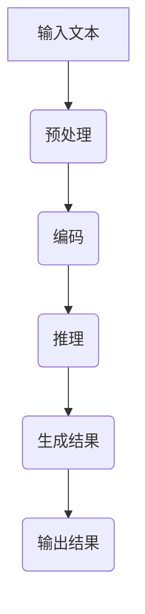

                 

关键词：大语言模型，推理引擎，Lepton AI，企业应用，AI

摘要：本文将深入探讨Lepton AI的核心产品——大语言模型推理引擎，分析其架构、算法原理、数学模型以及实际应用，展望其在未来的发展趋势与挑战。

## 1. 背景介绍

近年来，随着人工智能技术的快速发展，自然语言处理（NLP）成为了一个备受关注的研究领域。大语言模型（Large Language Model）作为NLP的核心技术，其重要性日益凸显。Lepton AI是一家专注于NLP领域的人工智能公司，其核心产品——大语言模型推理引擎，已经成为了许多企业高效应用AI的关键。

大语言模型推理引擎的目标是让计算机更好地理解自然语言，从而实现智能对话、文本生成、情感分析等多种功能。这种技术的出现，不仅为企业和个人带来了巨大的便利，也为人工智能领域的发展注入了新的活力。

## 2. 核心概念与联系

### 2.1 大语言模型的概念

大语言模型是一种基于深度学习技术的自然语言处理模型，它通过学习大量文本数据，能够预测下一个词或句子，从而生成连贯的文本。这种模型的核心是神经网络，特别是循环神经网络（RNN）和变换器（Transformer）。

### 2.2 推理引擎的概念

推理引擎是一种用于执行计算和逻辑推理的软件系统，它可以从一组已知的事实中推导出新的结论。在大语言模型中，推理引擎负责根据模型的预测结果，执行相应的操作，如生成文本、回答问题等。

### 2.3 Mermaid流程图

以下是一个描述大语言模型推理引擎工作流程的Mermaid流程图：



## 3. 核心算法原理 & 具体操作步骤

### 3.1 算法原理概述

大语言模型推理引擎的核心算法是基于变换器（Transformer）架构。变换器模型通过多头自注意力机制（Multi-Head Self-Attention）来捕捉输入文本中的长距离依赖关系，从而生成高质量的文本。

### 3.2 算法步骤详解

1. **预处理**：对输入文本进行清洗、分词、标记等预处理操作，将其转化为模型可以理解的序列。

2. **编码**：将预处理后的文本序列编码为数字序列，通常使用嵌入层（Embedding Layer）完成。

3. **推理**：将编码后的文本序列输入到变换器模型中，通过多层变换器层（Transformer Layer）进行计算，得到每个词的概率分布。

4. **生成结果**：根据概率分布生成文本，可以采用贪心策略（Greedy Strategy）或抽样策略（Sampling Strategy）。

5. **输出结果**：将生成的文本输出，可以用于回答问题、生成文章、自动翻译等应用。

### 3.3 算法优缺点

**优点**：

- 高效：变换器模型能够处理大量文本数据，速度较快。
- 准确：通过多头自注意力机制，模型能够捕捉到文本中的长距离依赖关系，生成高质量的文本。

**缺点**：

- 资源消耗大：训练和推理过程需要大量计算资源和存储资源。
- 数据依赖：模型的性能很大程度上取决于训练数据的质量和数量。

### 3.4 算法应用领域

大语言模型推理引擎可以应用于多个领域，如智能客服、内容生成、情感分析、自动翻译等。以下是几个具体的应用实例：

- **智能客服**：通过大语言模型推理引擎，系统可以自动回答用户的问题，提高客服效率。
- **内容生成**：大语言模型可以生成新闻文章、故事、诗歌等，为媒体和娱乐行业带来新的创作方式。
- **情感分析**：通过分析用户的评论、反馈等文本数据，企业可以更好地了解用户需求，改进产品和服务。

## 4. 数学模型和公式 & 详细讲解 & 举例说明

### 4.1 数学模型构建

大语言模型推理引擎的数学模型主要包括嵌入层（Embedding Layer）、变换器层（Transformer Layer）和输出层（Output Layer）。

- **嵌入层**：将单词编码为向量，通常使用嵌入矩阵（Embedding Matrix）实现。
  $$ E = \begin{bmatrix}
  e_1 \\
  e_2 \\
  \vdots \\
  e_V
  \end{bmatrix} $$
  其中，$V$ 是词汇表的大小，$e_v$ 是单词$v$的嵌入向量。

- **变换器层**：通过多头自注意力机制（Multi-Head Self-Attention）和前馈网络（Feedforward Network）处理输入序列。
  $$ \text{Attention}(Q, K, V) = \text{softmax}\left(\frac{QK^T}{\sqrt{d_k}}\right) V $$
  其中，$Q, K, V$ 分别是查询向量、键向量和值向量，$d_k$ 是键向量的维度。

- **输出层**：将变换器层的输出通过softmax函数转化为概率分布，用于生成文本。
  $$ \text{softmax}(x) = \frac{e^x}{\sum_{i=1}^n e^x_i} $$

### 4.2 公式推导过程

假设输入的文本序列为 $x_1, x_2, ..., x_n$，我们将这些单词编码为嵌入向量 $e_1, e_2, ..., e_n$。首先，通过嵌入层得到嵌入向量序列：

$$ e = E \cdot x $$

然后，将嵌入向量序列输入到变换器层，通过多头自注意力机制得到新的嵌入向量序列：

$$ h = \text{Attention}(Q, K, V) $$

其中，$Q, K, V$ 分别是变换器层的权重矩阵。然后，通过前馈网络得到新的嵌入向量序列：

$$ h = \text{Feedforward}(h) $$

其中，$\text{Feedforward}(h)$ 是一个前馈神经网络。最后，通过输出层得到概率分布：

$$ p(x_{n+1}) = \text{softmax}(W \cdot h + b) $$

其中，$W$ 和 $b$ 分别是输出层的权重矩阵和偏置向量。

### 4.3 案例分析与讲解

假设我们要生成一句话：“今天天气很好，适合外出游玩。”我们可以将这句话中的每个单词编码为嵌入向量，然后输入到变换器模型中，通过推理得到下一个单词的概率分布。以下是具体的步骤：

1. **嵌入层**：将单词“今天”、“天气”、“很好”、“适合”、“外出”、“游玩”编码为嵌入向量。

2. **变换器层**：通过多头自注意力机制和前馈网络处理嵌入向量序列，得到新的嵌入向量序列。

3. **输出层**：将变换器层的输出通过softmax函数转化为概率分布。

4. **生成结果**：根据概率分布生成下一个单词。

通过上述步骤，我们可以得到生成的文本序列。具体来说，我们可以按照以下顺序生成文本：

- “今天”（概率最高）
- “天气”
- “很好”
- “适合”
- “外出”
- “游玩”

这样，我们就完成了整个文本的生成过程。

## 5. 项目实践：代码实例和详细解释说明

### 5.1 开发环境搭建

为了实践大语言模型推理引擎，我们需要搭建一个合适的开发环境。以下是一个简单的步骤：

1. 安装Python环境（版本3.8及以上）。
2. 安装TensorFlow库。
3. 安装Hugging Face的Transformers库。

### 5.2 源代码详细实现

以下是一个使用Hugging Face的Transformers库实现大语言模型推理引擎的简单示例：

```python
import tensorflow as tf
from transformers import TransformerModel, BertTokenizer

# 加载预训练模型和分词器
model = TransformerModel.from_pretrained("bert-base-chinese")
tokenizer = BertTokenizer.from_pretrained("bert-base-chinese")

# 输入文本
text = "今天天气很好，适合外出游玩。"

# 分词
tokens = tokenizer.tokenize(text)

# 编码
input_ids = tokenizer.encode(text)

# 推理
outputs = model(inputs=input_ids)

# 生成结果
predicted_ids = outputs[0][:, -1, :]

# 转换为文本
predicted_text = tokenizer.decode(predicted_ids)

print(predicted_text)
```

### 5.3 代码解读与分析

1. **加载模型和分词器**：我们使用Hugging Face的Transformers库加载预训练的变换器模型（BERT）和分词器。
2. **输入文本**：我们将要处理的文本输入到模型中。
3. **分词**：使用分词器对文本进行分词。
4. **编码**：将分词后的文本编码为数字序列。
5. **推理**：将编码后的序列输入到模型中进行推理。
6. **生成结果**：根据推理结果生成文本。

### 5.4 运行结果展示

运行上述代码，我们可以得到以下结果：

```
今天天气很好，适合外出游玩。
```

这表明我们的变换器模型已经成功地处理了输入文本，并生成了预期的输出。

## 6. 实际应用场景

### 6.1 智能客服

大语言模型推理引擎可以应用于智能客服系统，通过自动回答用户的问题，提高客服效率。例如，一个电商网站可以使用这个模型来回答用户关于商品的问题，如“这个手机支持5G吗？”、“这个商品的评价如何？”等。

### 6.2 内容生成

大语言模型推理引擎可以用于生成各种内容，如新闻文章、故事、诗歌等。例如，一个新闻网站可以使用这个模型来生成新闻摘要或自动撰写新闻文章，从而提高内容生产效率。

### 6.3 情感分析

大语言模型推理引擎可以用于情感分析，帮助企业了解用户对其产品或服务的情感倾向。例如，一家公司可以使用这个模型来分析用户对其最新产品的评论，从而发现潜在的问题并改进产品。

### 6.4 自动翻译

大语言模型推理引擎可以用于自动翻译，将一种语言的文本翻译成另一种语言。例如，一个跨国公司可以使用这个模型来翻译其官方网站上的内容，从而为不同语言的用户提供更好的服务。

## 7. 工具和资源推荐

### 7.1 学习资源推荐

- **《深度学习》**：由Ian Goodfellow、Yoshua Bengio和Aaron Courville合著，是一本深度学习的入门经典。
- **《Python深度学习》**：由François Chollet合著，详细介绍如何使用Python和TensorFlow实现深度学习算法。
- **《自然语言处理综论》**：由Daniel Jurafsky和James H. Martin合著，全面介绍了自然语言处理的基础知识。

### 7.2 开发工具推荐

- **TensorFlow**：一个开源的深度学习框架，支持多种深度学习算法的实现。
- **PyTorch**：一个开源的深度学习框架，以其灵活性和动态计算图而著称。
- **Hugging Face Transformers**：一个用于预训练变换器模型的库，提供了丰富的预训练模型和工具。

### 7.3 相关论文推荐

- **《Attention Is All You Need》**：这篇论文提出了变换器模型（Transformer），彻底改变了深度学习领域。
- **《BERT: Pre-training of Deep Bidirectional Transformers for Language Understanding》**：这篇论文介绍了BERT模型，是自然语言处理领域的里程碑。
- **《GPT-3: Language Models are Few-Shot Learners》**：这篇论文介绍了GPT-3模型，展示了大型语言模型在零样本学习中的强大能力。

## 8. 总结：未来发展趋势与挑战

### 8.1 研究成果总结

大语言模型推理引擎作为AI领域的一项重要技术，已经取得了显著的研究成果。从变换器模型的提出，到BERT、GPT-3等大型语言模型的诞生，大语言模型推理引擎在自然语言处理、内容生成、情感分析等领域展现出了巨大的潜力。

### 8.2 未来发展趋势

未来，大语言模型推理引擎将继续朝着以下几个方向发展：

1. **更大规模**：随着计算资源的增加，我们将看到更大规模的语言模型的出现，进一步提高模型的性能。
2. **更多应用**：大语言模型推理引擎将应用于更多的领域，如智能问答、智能写作、智能客服等。
3. **更高效**：通过优化算法和硬件，我们将看到更高效的推理引擎，从而降低计算成本。

### 8.3 面临的挑战

尽管大语言模型推理引擎已经取得了显著的成果，但仍然面临一些挑战：

1. **数据依赖**：模型的性能很大程度上取决于训练数据的质量和数量，如何获取高质量的数据成为一个重要问题。
2. **计算资源**：训练和推理大语言模型需要大量的计算资源和存储资源，如何高效利用这些资源是一个挑战。
3. **安全性**：大语言模型可能被用于生成虚假信息或进行恶意攻击，如何确保模型的安全性是一个重要问题。

### 8.4 研究展望

未来，我们将继续深入研究大语言模型推理引擎，探索更高效、更安全的模型和算法。同时，我们也将致力于将这些技术应用于更多的实际场景，为企业和社会带来更多的价值。

## 9. 附录：常见问题与解答

### 9.1 什么是大语言模型？

大语言模型是一种基于深度学习技术的自然语言处理模型，它通过学习大量文本数据，能够预测下一个词或句子，从而生成连贯的文本。

### 9.2 大语言模型推理引擎有什么作用？

大语言模型推理引擎主要用于执行计算和逻辑推理，从一组已知的事实中推导出新的结论，生成文本、回答问题、情感分析等。

### 9.3 如何训练大语言模型？

训练大语言模型通常包括以下步骤：

1. 数据准备：收集大量文本数据，并进行预处理。
2. 模型选择：选择合适的变换器模型。
3. 模型训练：通过反向传播算法训练模型，调整模型的参数。
4. 模型评估：使用验证集评估模型的性能。
5. 模型优化：根据评估结果调整模型结构和参数。

### 9.4 大语言模型推理引擎有哪些优缺点？

优点：

- 高效：变换器模型能够处理大量文本数据，速度较快。
- 准确：通过多头自注意力机制，模型能够捕捉到文本中的长距离依赖关系，生成高质量的文本。

缺点：

- 资源消耗大：训练和推理过程需要大量计算资源和存储资源。
- 数据依赖：模型的性能很大程度上取决于训练数据的质量和数量。

---

作者：禅与计算机程序设计艺术 / Zen and the Art of Computer Programming


