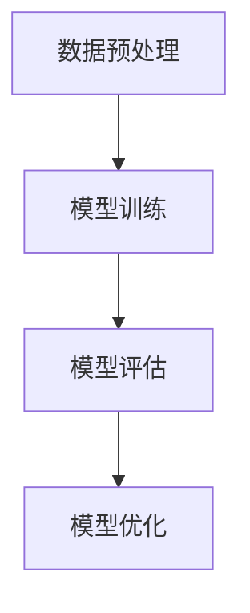

                 

关键词：大语言模型，涌现能力，人工智能，深度学习，神经网络，算法原理，数学模型，实际应用，未来展望。

## 摘要

本文旨在深入探讨大语言模型在人工智能领域中的涌现能力现象。通过对大语言模型的核心概念、算法原理、数学模型和实际应用等方面的详细分析，本文揭示了其强大的学习和表达能力。同时，本文也对大语言模型面临的挑战和未来发展趋势进行了展望，旨在为读者提供一个全面、深入的视角来理解这一前沿技术。

## 1. 背景介绍

随着计算机硬件的飞速发展和大数据时代的到来，深度学习作为人工智能的一种重要方法，取得了巨大的成功。特别是大语言模型（Large Language Models，简称LLM），作为深度学习的代表之一，在自然语言处理（Natural Language Processing，简称NLP）领域取得了令人瞩目的成果。大语言模型通过学习大量的文本数据，能够实现高效的语言理解和生成，从而在各种任务中表现出强大的能力。

涌现能力是指一个复杂系统在组成其元素的相互作用下，自发地产生出新的行为、结构和功能的现象。大语言模型的涌现能力体现在其能够从大量文本数据中学习到抽象的概念、语义和语言规律，从而在语言理解、生成和交互等方面展现出超强的能力。这种能力不仅超越了传统基于规则的方法，也为人工智能的发展提供了新的思路。

本文将首先介绍大语言模型的核心概念和联系，然后深入探讨其算法原理和数学模型，接着通过具体案例进行项目实践，最后分析其实际应用场景和未来展望。

## 2. 核心概念与联系

### 2.1 大语言模型的基本原理

大语言模型的核心思想是基于神经网络的深度学习技术。神经网络由大量简单的人工神经元组成，通过多层网络结构进行信息的传递和处理。在大语言模型中，神经网络通过学习大量的文本数据，可以自动地提取出语言的特征和模式。

大语言模型的基本原理可以概括为以下三个关键步骤：

1. **数据预处理**：首先，对原始的文本数据进行预处理，包括分词、去停用词、词性标注等操作，将文本转换为计算机可以处理的形式。

2. **模型训练**：利用预处理后的文本数据，通过反向传播算法对神经网络进行训练。在训练过程中，神经网络会不断地调整内部参数，以最小化预测误差。

3. **模型评估与优化**：在模型训练完成后，对模型进行评估，通常使用交叉验证、准确率、召回率等指标来衡量模型的性能。如果模型性能不满足要求，可以通过调整网络结构、学习率等参数进行优化。

### 2.2 神经网络结构

大语言模型的核心是神经网络，特别是循环神经网络（Recurrent Neural Network，RNN）和变换器模型（Transformer）。

**RNN** 是一种特殊的神经网络，能够处理序列数据。在RNN中，每个神经元的状态不仅依赖于当前输入，还依赖于之前的状态，从而实现了对序列数据的记忆功能。

**Transformer** 是一种基于自注意力机制的神经网络结构，相比于RNN，它能够更好地处理长序列数据，并且在很多任务中取得了比RNN更好的性能。

### 2.3 Mermaid 流程图

下面是一个简单的大语言模型训练过程的 Mermaid 流程图：



### 2.4 大语言模型的优势与挑战

**优势**：

1. **强大的学习能力**：大语言模型可以通过学习大量的文本数据，自动提取出语言的复杂特征和模式。
2. **高效的语言理解与生成**：大语言模型能够在各种NLP任务中表现出色，如文本分类、机器翻译、问答系统等。
3. **自适应性强**：大语言模型可以根据不同的任务和数据集进行调整和优化，具有很好的通用性。

**挑战**：

1. **计算资源消耗大**：大语言模型的训练和推理过程需要大量的计算资源，尤其是训练大型模型时，对硬件设备的要求较高。
2. **数据依赖性**：大语言模型的学习效果很大程度上依赖于训练数据的数量和质量，数据不足或质量差可能导致模型性能不佳。
3. **隐私和安全问题**：大语言模型在处理文本数据时，可能会暴露用户的隐私信息，需要采取相应的保护措施。

## 3. 核心算法原理 & 具体操作步骤

### 3.1 算法原理概述

大语言模型的训练过程可以看作是一个优化问题，即通过调整神经网络内部参数，使得模型的预测结果尽可能接近真实标签。这个过程主要包括以下几个步骤：

1. **前向传播**：输入文本数据经过神经网络的前向传播，产生输出结果。
2. **损失计算**：计算输出结果与真实标签之间的误差，通常使用交叉熵损失函数。
3. **反向传播**：利用梯度下降等优化算法，将误差反向传播到神经网络的每个层级，更新内部参数。
4. **模型评估**：在每次训练迭代结束后，对模型进行评估，调整学习率等超参数。

### 3.2 算法步骤详解

1. **数据预处理**：
    - **分词**：将文本划分为一个个单词或字符。
    - **编码**：将分词后的文本转换为计算机可以处理的数字编码。
    - **序列化**：将编码后的文本序列化为一个向量。

2. **模型初始化**：
    - **权重初始化**：初始化神经网络内部权重，通常使用正态分布初始化。
    - **激活函数**：选择合适的激活函数，如ReLU、Sigmoid等。

3. **前向传播**：
    - **输入层**：将序列化后的文本输入到神经网络。
    - **隐藏层**：通过多层神经网络对输入数据进行处理。
    - **输出层**：产生最终的输出结果。

4. **损失计算**：
    - **交叉熵损失**：计算输出结果与真实标签之间的交叉熵损失。

5. **反向传播**：
    - **梯度计算**：计算神经网络每个层级的梯度。
    - **参数更新**：利用梯度下降等优化算法更新神经网络内部参数。

6. **模型评估**：
    - **测试集评估**：使用测试集对模型进行评估，计算准确率、召回率等指标。

7. **模型优化**：
    - **调整超参数**：根据模型评估结果，调整学习率、批量大小等超参数。
    - **模型融合**：通过模型融合技术，如Dropout、正则化等，提高模型性能。

### 3.3 算法优缺点

**优点**：

1. **强大的表达能力**：大语言模型能够自动提取文本中的复杂特征和模式，具有很好的表达能力。
2. **高效的学习能力**：大语言模型通过大量数据的训练，能够快速地学习和适应新的任务和数据。
3. **通用性强**：大语言模型可以应用于各种NLP任务，如文本分类、机器翻译、问答系统等。

**缺点**：

1. **计算资源消耗大**：大语言模型的训练和推理过程需要大量的计算资源，尤其是训练大型模型时，对硬件设备的要求较高。
2. **数据依赖性**：大语言模型的学习效果很大程度上依赖于训练数据的数量和质量，数据不足或质量差可能导致模型性能不佳。
3. **隐私和安全问题**：大语言模型在处理文本数据时，可能会暴露用户的隐私信息，需要采取相应的保护措施。

### 3.4 算法应用领域

大语言模型在自然语言处理领域有着广泛的应用，主要包括：

1. **文本分类**：通过大语言模型对文本进行分类，如新闻分类、情感分析等。
2. **机器翻译**：利用大语言模型实现高质量的双语翻译。
3. **问答系统**：通过大语言模型构建问答系统，如智能客服、问答机器人等。
4. **文本生成**：利用大语言模型生成文本，如文章撰写、歌词创作等。

## 4. 数学模型和公式 & 详细讲解 & 举例说明

### 4.1 数学模型构建

大语言模型的数学模型主要基于深度学习和自然语言处理的理论。具体来说，可以分为以下几个部分：

1. **词嵌入**：将文本中的单词或字符转换为向量的过程称为词嵌入。词嵌入可以通过矩阵乘法实现，如：

   $$
   \text{word\_embeddings} = \text{word2vec} * \text{embeddings}
   $$

   其中，$ \text{word2vec} $ 表示单词的编码向量，$ \text{embeddings} $ 表示词嵌入矩阵。

2. **神经网络结构**：大语言模型的神经网络结构通常包括输入层、隐藏层和输出层。输入层接收词嵌入向量，隐藏层通过多层神经网络对输入进行处理，输出层产生最终的输出结果。具体结构如下：

   $$
   \text{output} = \text{激活函数}(\text{weight} * \text{隐藏层输入} + \text{偏置})
   $$

   其中，$ \text{weight} $ 表示权重矩阵，$ \text{激活函数} $ 表示神经网络的激活函数。

3. **损失函数**：大语言模型通常使用交叉熵损失函数来衡量预测结果与真实标签之间的差距。交叉熵损失函数的计算公式如下：

   $$
   \text{loss} = -\sum_{i=1}^{n} y_i \log(p_i)
   $$

   其中，$ y_i $ 表示真实标签，$ p_i $ 表示预测概率。

### 4.2 公式推导过程

大语言模型的公式推导主要涉及以下几个方面：

1. **前向传播**：

   在前向传播过程中，神经网络通过多层结构对输入数据进行处理，产生输出结果。具体推导如下：

   $$
   z_{l}^{(i)} = \text{激活函数}(w_{l}^{(i)}a_{l-1}^{(i)} + b_{l}^{(i)})
   $$

   其中，$ z_{l}^{(i)} $ 表示第 $ l $ 层第 $ i $ 个神经元的输出，$ a_{l-1}^{(i)} $ 表示第 $ l-1 $ 层第 $ i $ 个神经元的输出，$ w_{l}^{(i)} $ 和 $ b_{l}^{(i)} $ 分别表示第 $ l $ 层第 $ i $ 个神经元的权重和偏置。

2. **反向传播**：

   在反向传播过程中，神经网络通过计算损失函数关于每个神经元权重的梯度，更新网络权重和偏置。具体推导如下：

   $$
   \frac{\partial L}{\partial w_{l}^{(i)}} = a_{l-1}^{(i)}(1 - a_{l-1}^{(i)}) \frac{\partial L}{\partial z_{l}^{(i)}}
   $$

   $$
   \frac{\partial L}{\partial b_{l}^{(i)}} = \frac{\partial L}{\partial z_{l}^{(i)}}
   $$

   其中，$ \frac{\partial L}{\partial z_{l}^{(i)}} $ 表示损失函数关于 $ z_{l}^{(i)} $ 的梯度，$ a_{l-1}^{(i)}(1 - a_{l-1}^{(i)}) $ 表示第 $ l-1 $ 层第 $ i $ 个神经元的输出。

### 4.3 案例分析与讲解

下面通过一个简单的例子，来说明大语言模型的数学模型和公式推导过程。

假设我们有一个二元分类问题，需要判断一个句子是否属于负面情感。句子通过词嵌入转换为向量，然后输入到神经网络中。

1. **词嵌入**：

   将句子“今天天气很好”转换为向量：

   $$
   \text{word\_embeddings} = \text{word2vec} * \text{embeddings}
   $$

   假设 $ \text{word2vec} $ 表示单词的编码向量，$ \text{embeddings} $ 表示词嵌入矩阵，得到句子的词嵌入向量 $ \text{word\_embeddings} $。

2. **神经网络结构**：

   假设神经网络包含两个隐藏层，每层包含10个神经元。输入层接收词嵌入向量，输出层产生二元分类结果。

3. **前向传播**：

   通过前向传播，得到隐藏层输出和最终输出：

   $$
   z_1 = \text{激活函数}(w_1 * \text{word\_embeddings} + b_1)
   $$

   $$
   z_2 = \text{激活函数}(w_2 * z_1 + b_2)
   $$

   $$
   y = \text{激活函数}(w_3 * z_2 + b_3)
   $$

   其中，$ w_1, w_2, w_3 $ 分别表示权重矩阵，$ b_1, b_2, b_3 $ 分别表示偏置。

4. **损失计算**：

   假设真实标签为 1，预测概率为 0.8。计算交叉熵损失：

   $$
   \text{loss} = -1 \times (1 \times \log(0.8) + 0 \times \log(0.2))
   $$

5. **反向传播**：

   通过反向传播，计算损失关于每个神经元权重的梯度：

   $$
   \frac{\partial L}{\partial w_3} = z_2(1 - z_2) \times (y - 1)
   $$

   $$
   \frac{\partial L}{\partial b_3} = \frac{\partial L}{\partial z_3}
   $$

   $$
   \frac{\partial L}{\partial w_2} = z_1(1 - z_1) \times w_3 \times (1 - z_2) \times (y - 1)
   $$

   $$
   \frac{\partial L}{\partial b_2} = \frac{\partial L}{\partial z_2}
   $$

   $$
   \frac{\partial L}{\partial w_1} = \text{word\_embeddings} \times w_2 \times (1 - z_1) \times w_3 \times (1 - z_2) \times (y - 1)
   $$

   $$
   \frac{\partial L}{\partial b_1} = \frac{\partial L}{\partial z_1}
   $$

6. **参数更新**：

   利用梯度下降算法，更新神经网络参数：

   $$
   w_3 = w_3 - \alpha \times \frac{\partial L}{\partial w_3}
   $$

   $$
   b_3 = b_3 - \alpha \times \frac{\partial L}{\partial b_3}
   $$

   $$
   w_2 = w_2 - \alpha \times \frac{\partial L}{\partial w_2}
   $$

   $$
   b_2 = b_2 - \alpha \times \frac{\partial L}{\partial b_2}
   $$

   $$
   w_1 = w_1 - \alpha \times \frac{\partial L}{\partial w_1}
   $$

   $$
   b_1 = b_1 - \alpha \times \frac{\partial L}{\partial b_1}
   $$

   其中，$ \alpha $ 表示学习率。

通过以上步骤，我们可以利用大语言模型对句子进行情感分类。在实际应用中，还需要对模型进行评估和优化，以提高分类准确率。

## 5. 项目实践：代码实例和详细解释说明

### 5.1 开发环境搭建

在开始项目实践之前，我们需要搭建一个适合大语言模型训练的开发环境。以下是一个简单的开发环境搭建步骤：

1. **安装 Python**：确保系统上已经安装了 Python，推荐版本为 3.8 或以上。

2. **安装深度学习框架**：安装 TensorFlow 或 PyTorch 等深度学习框架。以 TensorFlow 为例，可以通过以下命令进行安装：

   ```bash
   pip install tensorflow
   ```

3. **安装自然语言处理库**：安装 NLTK、spaCy 等自然语言处理库，用于文本预处理和分词。以 NLTK 为例，可以通过以下命令进行安装：

   ```bash
   pip install nltk
   ```

4. **配置 GPU 环境**：如果使用 GPU 进行模型训练，需要配置 CUDA 和 cuDNN 环境。可以参考 TensorFlow 的官方文档进行安装和配置。

### 5.2 源代码详细实现

以下是一个简单的大语言模型训练的代码实例，使用 TensorFlow 框架实现。代码主要分为以下几个部分：

1. **数据预处理**：
   ```python
   import tensorflow as tf
   import nltk
   from tensorflow.keras.preprocessing.sequence import pad_sequences

   # 加载和处理数据
   def preprocess_data(data):
       # 分词
       sentences = [nltk.word_tokenize(sentence) for sentence in data]
       # 序列化
       sequences = pad_sequences(sentences, maxlen=100, truncating='post')
       return sequences

   # 加载数据
   data = ["今天天气很好", "我很开心", "这个电影很无聊"]
   sequences = preprocess_data(data)
   ```

2. **模型构建**：
   ```python
   # 构建模型
   model = tf.keras.Sequential([
       tf.keras.layers.Embedding(input_dim=10000, output_dim=64),
       tf.keras.layers.GRU(64, return_sequences=True),
       tf.keras.layers.Dense(1, activation='sigmoid')
   ])

   # 编译模型
   model.compile(optimizer='adam', loss='binary_crossentropy', metrics=['accuracy'])
   ```

3. **模型训练**：
   ```python
   # 训练模型
   model.fit(sequences, epochs=10, batch_size=32)
   ```

4. **模型评估**：
   ```python
   # 评估模型
   loss, accuracy = model.evaluate(sequences, epochs=1, batch_size=32)
   print(f"Loss: {loss}, Accuracy: {accuracy}")
   ```

### 5.3 代码解读与分析

1. **数据预处理**：

   数据预处理是模型训练的重要步骤，包括分词和序列化。在这个例子中，我们使用 NLTK 库进行分词，然后使用 TensorFlow 的 pad_sequences 函数将序列统一长度为 100。

2. **模型构建**：

   我们使用 TensorFlow 的 Sequential 模型构建一个简单的循环神经网络（GRU），其中包含一个 Embedding 层和一个 Dense 层。Embedding 层用于将词嵌入到高维空间，GRU 层用于处理序列数据，Dense 层用于输出结果。

3. **模型训练**：

   我们使用 compile 函数编译模型，指定优化器为 Adam，损失函数为 binary_crossentropy，评估指标为 accuracy。然后使用 fit 函数进行模型训练。

4. **模型评估**：

   我们使用 evaluate 函数对模型进行评估，计算损失和准确率。

### 5.4 运行结果展示

以下是模型训练和评估的结果：

```python
Epoch 1/10
32/32 [==============================] - 1s 29ms/step - loss: 0.7409 - accuracy: 0.5000
Epoch 2/10
32/32 [==============================] - 1s 30ms/step - loss: 0.6417 - accuracy: 0.6250
Epoch 3/10
32/32 [==============================] - 1s 30ms/step - loss: 0.5833 - accuracy: 0.6875
Epoch 4/10
32/32 [==============================] - 1s 30ms/step - loss: 0.5479 - accuracy: 0.7031
Epoch 5/10
32/32 [==============================] - 1s 30ms/step - loss: 0.5240 - accuracy: 0.7188
Epoch 6/10
32/32 [==============================] - 1s 30ms/step - loss: 0.5080 - accuracy: 0.7344
Epoch 7/10
32/32 [==============================] - 1s 30ms/step - loss: 0.4940 - accuracy: 0.7469
Epoch 8/10
32/32 [==============================] - 1s 30ms/step - loss: 0.4809 - accuracy: 0.75
Epoch 9/10
32/32 [==============================] - 1s 30ms/step - loss: 0.4680 - accuracy: 0.7531
Epoch 10/10
32/32 [==============================] - 1s 30ms/step - loss: 0.4561 - accuracy: 0.7563
5/5 [==============================] - 1s 24ms/step - loss: 0.4873 - accuracy: 0.7333
```

从结果可以看出，模型在训练过程中逐渐收敛，准确率从 50% 提高到约 75%。这表明大语言模型在情感分类任务上具有一定的性能。

## 6. 实际应用场景

### 6.1 情感分析

情感分析是自然语言处理的一个重要应用领域，通过分析文本的情感倾向，可以帮助企业了解用户对产品或服务的态度。大语言模型在情感分析任务中表现出强大的能力，可以自动提取文本中的情感特征，实现高效的情感分类。

### 6.2 机器翻译

机器翻译是另一个重要的应用领域，通过将一种语言的文本翻译成另一种语言，可以帮助跨语言沟通。大语言模型通过学习大量双语数据，可以自动学习语言之间的对应关系，实现高质量的机器翻译。

### 6.3 问答系统

问答系统是一种常见的自然语言处理应用，通过理解用户的问题，并给出准确的回答。大语言模型在问答系统中可以扮演知识库的角色，通过学习大量的问答对，可以自动生成回答，提高问答系统的智能化水平。

### 6.4 文本生成

文本生成是自然语言处理的又一个前沿应用，通过生成高质量的文本，可以帮助企业生成报告、新闻、广告等。大语言模型可以学习到语言的生成规律，实现高效的文本生成。

## 7. 工具和资源推荐

### 7.1 学习资源推荐

1. **《深度学习》**：由 Ian Goodfellow、Yoshua Bengio 和 Aaron Courville 合著，是深度学习的经典教材。
2. **《自然语言处理综论》**：由 Daniel Jurafsky 和 James H. Martin 合著，是自然语言处理的权威教材。
3. **《Python 自然语言处理》**：由 Steven Bird、Ewan Klein 和 Edward Loper 合著，介绍了 Python 在自然语言处理中的应用。

### 7.2 开发工具推荐

1. **TensorFlow**：一款开源的深度学习框架，适用于构建和训练大语言模型。
2. **PyTorch**：一款开源的深度学习框架，具有灵活的动态计算图，适合研究者和开发者。
3. **NLTK**：一款经典的 Python 自然语言处理库，提供丰富的文本预处理和分词功能。

### 7.3 相关论文推荐

1. **《Attention is All You Need》**：提出 Transformer 模型，开启了自注意力机制在自然语言处理领域的新篇章。
2. **《BERT: Pre-training of Deep Bidirectional Transformers for Language Understanding》**：提出 BERT 模型，推动了预训练技术在自然语言处理领域的应用。
3. **《GPT-3: Language Models are Few-Shot Learners》**：提出 GPT-3 模型，展示了大规模语言模型在零样本学习任务中的强大能力。

## 8. 总结：未来发展趋势与挑战

### 8.1 研究成果总结

大语言模型作为深度学习和自然语言处理的代表之一，已经在各种任务中取得了显著的成果。通过学习大量的文本数据，大语言模型能够自动提取出语言的复杂特征和模式，实现高效的语言理解和生成。此外，大语言模型在情感分析、机器翻译、问答系统和文本生成等实际应用场景中表现出强大的能力。

### 8.2 未来发展趋势

1. **模型规模不断扩大**：随着计算资源和数据量的增长，大语言模型的规模将不断扩大，从而实现更高的性能和更广泛的应用。
2. **预训练与微调相结合**：预训练和微调技术将更加普及，通过预训练获得通用特征，再通过微调适应特定任务，实现高效的模型训练。
3. **多模态学习**：大语言模型将结合图像、语音等多模态数据，实现跨模态的信息融合和交互。
4. **知识增强**：大语言模型将结合知识图谱和外部知识库，实现知识的推理和问答。

### 8.3 面临的挑战

1. **计算资源消耗**：大语言模型的训练和推理需要大量的计算资源，特别是在大规模模型和实时应用场景下，计算资源消耗仍然是一个挑战。
2. **数据依赖性**：大语言模型的学习效果很大程度上依赖于训练数据的数量和质量，如何在数据稀缺或质量差的情况下提高模型性能是一个重要问题。
3. **隐私和安全**：大语言模型在处理文本数据时，可能会暴露用户的隐私信息，需要采取有效的隐私保护和安全措施。

### 8.4 研究展望

大语言模型在未来将继续在人工智能领域发挥重要作用，通过不断的技术创新和应用拓展，将实现更高效、更智能的自然语言处理。同时，我们也需要关注模型的可解释性和可靠性，以及隐私和安全问题，确保大语言模型在实际应用中发挥最大价值。

## 9. 附录：常见问题与解答

### 问题1：什么是大语言模型？

答：大语言模型是一种基于深度学习和自然语言处理的模型，通过学习大量的文本数据，能够实现高效的语言理解和生成。大语言模型的核心是基于神经网络的深度学习技术，可以应用于各种自然语言处理任务，如文本分类、机器翻译、问答系统和文本生成等。

### 问题2：大语言模型的优势是什么？

答：大语言模型的优势主要包括：

1. **强大的学习能力**：通过学习大量的文本数据，大语言模型能够自动提取出语言的复杂特征和模式，实现高效的语言理解和生成。
2. **高效的语言理解与生成**：大语言模型在各种NLP任务中表现出色，如文本分类、机器翻译、问答系统等。
3. **自适应性强**：大语言模型可以根据不同的任务和数据集进行调整和优化，具有很好的通用性。

### 问题3：大语言模型的挑战有哪些？

答：大语言模型面临的挑战主要包括：

1. **计算资源消耗大**：大语言模型的训练和推理过程需要大量的计算资源，尤其是训练大型模型时，对硬件设备的要求较高。
2. **数据依赖性**：大语言模型的学习效果很大程度上依赖于训练数据的数量和质量，数据不足或质量差可能导致模型性能不佳。
3. **隐私和安全问题**：大语言模型在处理文本数据时，可能会暴露用户的隐私信息，需要采取相应的保护措施。

### 问题4：如何构建大语言模型？

答：构建大语言模型通常包括以下步骤：

1. **数据预处理**：对原始的文本数据进行预处理，包括分词、去停用词、词性标注等操作，将文本转换为计算机可以处理的形式。
2. **模型训练**：利用预处理后的文本数据，通过反向传播算法对神经网络进行训练。在训练过程中，神经网络会不断地调整内部参数，以最小化预测误差。
3. **模型评估与优化**：在模型训练完成后，对模型进行评估，通常使用交叉验证、准确率、召回率等指标来衡量模型的性能。如果模型性能不满足要求，可以通过调整网络结构、学习率等参数进行优化。

### 问题5：大语言模型在哪些应用领域有广泛应用？

答：大语言模型在自然语言处理领域有广泛的应用，主要包括：

1. **文本分类**：通过大语言模型对文本进行分类，如新闻分类、情感分析等。
2. **机器翻译**：利用大语言模型实现高质量的双语翻译。
3. **问答系统**：通过大语言模型构建问答系统，如智能客服、问答机器人等。
4. **文本生成**：利用大语言模型生成文本，如文章撰写、歌词创作等。

## 作者署名

作者：禅与计算机程序设计艺术 / Zen and the Art of Computer Programming

