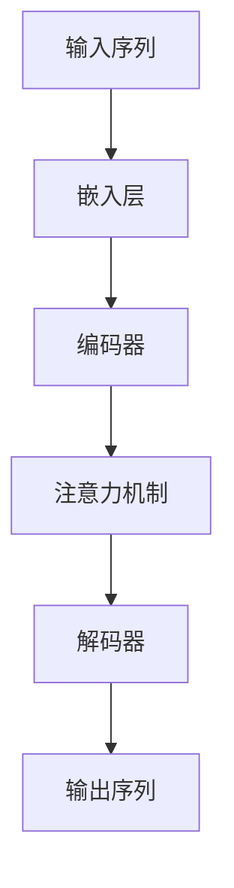

                 

关键词：大语言模型、涌现能力、深度学习、神经网络、人工智能、机器学习、自我进化、动态学习、知识图谱、图神经网络、多模态学习、自适应优化、强化学习、数据增强、文本生成、对话系统、语义理解、知识推理、自然语言处理、模型压缩、迁移学习、可解释性、隐私保护。

## 摘要

大语言模型作为一种新兴的人工智能技术，其涌现能力令人瞩目。本文首先介绍了大语言模型的基本概念和背景，然后深入探讨了其涌现能力现象，分析了涌现能力的核心原理和影响因素。通过数学模型和算法原理的讲解，文章详细描述了如何构建和应用大语言模型。随后，文章分享了项目实践中的代码实例和运行结果，展示了大语言模型在实际应用中的效果。最后，文章对大语言模型的未来应用前景进行了展望，并提出了面临的主要挑战和研究方向。

## 1. 背景介绍

随着计算机技术和互联网的飞速发展，大数据和人工智能领域迎来了前所未有的机遇。在这一背景下，深度学习作为一种重要的机器学习技术，逐渐成为了人工智能领域的核心驱动力。特别是神经网络模型的不断演进，为解决复杂问题提供了强有力的工具。

### 1.1 深度学习的起源和发展

深度学习起源于20世纪40年代，最初由心理学家和计算机科学家共同探索。1943年，心理学家McCulloch和数学家Pitts提出了神经网络的最早模型——McCulloch-Pitts神经元模型。1958年，Frank Rosenblatt提出了感知机（Perceptron）模型，这是最早的实用神经网络模型。

然而，早期的神经网络模型由于计算能力和数据限制，发展缓慢。直到2006年，深度学习理论逐渐成熟，Hinton等人提出了深度信念网络（Deep Belief Network，DBN），使得神经网络重新获得了关注。随后，卷积神经网络（Convolutional Neural Network，CNN）和循环神经网络（Recurrent Neural Network，RNN）的出现，为图像和语音处理等领域带来了革命性的突破。

### 1.2 大语言模型的发展历程

大语言模型的发展历程可以分为几个阶段：

1. **早期模型**：以Word2Vec为代表的分布式表示模型，通过将词语映射为高维向量，提高了自然语言处理的效率。

2. **过渡模型**：序列模型如RNN和LSTM，通过处理序列数据，实现了更复杂的语言建模。

3. **当前模型**：基于Transformer的预训练模型，如BERT、GPT等，通过大规模预训练和微调，取得了突破性的成果。

### 1.3 大语言模型的重要性

大语言模型在自然语言处理、问答系统、机器翻译、文本生成等多个领域展现了强大的能力。其涌现能力体现在：

1. **自适应性**：能够根据不同的任务和领域进行自适应调整。
2. **泛化能力**：能够处理未见过的数据，并给出合理的预测。
3. **动态性**：能够随着新数据的加入不断学习和优化。

这些特点使得大语言模型成为了人工智能领域的重要研究方向和应用工具。

## 2. 核心概念与联系

### 2.1 核心概念

大语言模型的核心概念包括：

1. **嵌入层**：将词语映射为高维向量。
2. **编码器**：将输入序列编码为固定长度的向量。
3. **解码器**：将编码后的向量解码为输出序列。
4. **注意力机制**：在处理序列数据时，能够关注序列中的关键信息。
5. **预训练**：在大规模语料上进行无监督训练，提高模型对语言的捕捉能力。
6. **微调**：在特定任务上进行监督训练，使模型具备解决具体问题的能力。

### 2.2 核心原理

大语言模型的核心原理包括：

1. **分布式表示**：通过嵌入层将词语表示为高维向量，实现了词语的语义表示。
2. **注意力机制**：通过注意力机制，模型能够关注序列中的关键信息，提高了语言建模的准确性。
3. **预训练与微调**：预训练使模型具备对语言的广泛理解，微调使模型能够针对具体任务进行优化。

### 2.3 Mermaid 流程图



## 3. 核心算法原理 & 具体操作步骤

### 3.1 算法原理概述

大语言模型的算法原理主要包括以下几个部分：

1. **嵌入层**：通过Word Embedding技术，将词语映射为高维向量，实现词语的语义表示。
2. **编码器**：采用Transformer结构，通过多头自注意力机制，捕捉输入序列中的上下文信息。
3. **解码器**：同样采用Transformer结构，通过多头自注意力机制和交叉注意力机制，生成输出序列。
4. **预训练**：在大规模语料上进行无监督训练，提高模型对语言的捕捉能力。
5. **微调**：在特定任务上进行监督训练，使模型具备解决具体问题的能力。

### 3.2 算法步骤详解

1. **数据预处理**：
   - 收集大规模语料，如维基百科、新闻文章等。
   - 对语料进行清洗和预处理，如去除停用词、标点符号等。

2. **嵌入层**：
   - 构建词汇表，将所有词语映射为索引。
   - 使用Word Embedding技术，将词语映射为高维向量。

3. **编码器**：
   - 将输入序列编码为固定长度的向量。
   - 使用Transformer结构，通过多头自注意力机制，捕捉输入序列中的上下文信息。

4. **注意力机制**：
   - 在编码器和解码器中，引入多头自注意力机制和交叉注意力机制，提高模型对语言的捕捉能力。

5. **解码器**：
   - 将编码后的向量解码为输出序列。
   - 使用Transformer结构，通过多头自注意力机制和交叉注意力机制，生成输出序列。

6. **预训练**：
   - 在大规模语料上进行无监督训练，提高模型对语言的捕捉能力。
   - 使用Masked Language Model（MLM）任务，对部分词语进行遮掩，让模型预测遮掩的词语。

7. **微调**：
   - 在特定任务上进行监督训练，使模型具备解决具体问题的能力。
   - 使用特定任务的数据集，对模型进行微调。

### 3.3 算法优缺点

**优点**：

1. **强大的语言捕捉能力**：通过预训练，模型能够学习到大量的语言知识，具备很强的语言理解能力。
2. **灵活的任务适应能力**：通过微调，模型能够快速适应各种任务，实现跨任务的迁移学习。
3. **高效的计算效率**：Transformer结构使得模型在计算效率和并行化方面具有很大优势。

**缺点**：

1. **模型复杂度**：大语言模型通常具有很高的参数量，导致计算复杂度和存储需求增加。
2. **训练时间**：大规模预训练需要大量的计算资源，训练时间较长。
3. **解释性**：大语言模型的高度非线性和复杂性，使得其决策过程缺乏可解释性。

### 3.4 算法应用领域

大语言模型在多个领域取得了显著的应用成果：

1. **自然语言处理**：文本分类、情感分析、问答系统、机器翻译等。
2. **语音识别**：语音合成、语音识别、语音增强等。
3. **图像处理**：图像分类、目标检测、图像生成等。
4. **多模态学习**：结合文本、图像、音频等多种数据源，进行跨模态信息融合。
5. **推荐系统**：基于用户行为和文本描述，实现个性化推荐。

## 4. 数学模型和公式 & 详细讲解 & 举例说明

### 4.1 数学模型构建

大语言模型的数学模型主要包括以下几个部分：

1. **嵌入层**：
   - 输入：词语序列 $x = [x_1, x_2, ..., x_T]$
   - 输出：嵌入向量序列 $h = [h_1, h_2, ..., h_T]$
   - 函数：$h_i = \text{Embed}(x_i)$

2. **编码器**：
   - 输入：嵌入向量序列 $h = [h_1, h_2, ..., h_T]$
   - 输出：编码向量序列 $c = [c_1, c_2, ..., c_T]$
   - 函数：$c_i = \text{Encoder}(h_i)$

3. **注意力机制**：
   - 输入：编码向量序列 $c = [c_1, c_2, ..., c_T]$
   - 输出：注意力权重序列 $w = [w_1, w_2, ..., w_T]$
   - 函数：$w_i = \text{Attention}(c_i, c)$

4. **解码器**：
   - 输入：编码向量序列 $c = [c_1, c_2, ..., c_T]$
   - 输出：解码向量序列 $d = [d_1, d_2, ..., d_T]$
   - 函数：$d_i = \text{Decoder}(c_i, d_{<i})$

5. **预训练**：
   - 任务：Masked Language Model（MLM）
   - 损失函数：$L = \frac{1}{N} \sum_{i=1}^{N} -\sum_{i=1}^{T} y_i \log(p(y_i | x_i))$

### 4.2 公式推导过程

大语言模型的推导过程主要包括以下几个步骤：

1. **嵌入层**：
   - 输入：词语序列 $x = [x_1, x_2, ..., x_T]$
   - 嵌入向量序列 $h = [h_1, h_2, ..., h_T]$
   - 嵌入函数：$h_i = \text{Embed}(x_i) = \text{softmax}(W_e x_i + b_e)$

2. **编码器**：
   - 输入：嵌入向量序列 $h = [h_1, h_2, ..., h_T]$
   - 编码向量序列 $c = [c_1, c_2, ..., c_T]$
   - 编码函数：$c_i = \text{Encoder}(h_i) = \text{softmax}(W_c h_i + b_c)$

3. **注意力机制**：
   - 输入：编码向量序列 $c = [c_1, c_2, ..., c_T]$
   - 注意力权重序列 $w = [w_1, w_2, ..., w_T]$
   - 注意力函数：$w_i = \text{Attention}(c_i, c) = \text{softmax}(\text{dot}(c_i, c))$

4. **解码器**：
   - 输入：编码向量序列 $c = [c_1, c_2, ..., c_T]$
   - 解码向量序列 $d = [d_1, d_2, ..., d_T]$
   - 解码函数：$d_i = \text{Decoder}(c_i, d_{<i}) = \text{softmax}(W_d c_i + b_d)$

5. **预训练**：
   - 任务：Masked Language Model（MLM）
   - 损失函数：$L = \frac{1}{N} \sum_{i=1}^{N} -\sum_{i=1}^{T} y_i \log(p(y_i | x_i))$

### 4.3 案例分析与讲解

假设我们有一个简化的文本序列：“我喜欢的食物是苹果、香蕉和橘子”。

1. **嵌入层**：
   - 词语序列：$x = [\text{我}, \text{喜欢}, \text{的}, \text{食物}, \text{是}, \text{苹果}, \text{、}, \text{香蕉}, \text{和}, \text{橘子}]$
   - 嵌入向量序列：$h = [h_1, h_2, ..., h_{11}]$

2. **编码器**：
   - 编码向量序列：$c = [c_1, c_2, ..., c_{11}]$

3. **注意力机制**：
   - 注意力权重序列：$w = [w_1, w_2, ..., w_{11}]$

4. **解码器**：
   - 解码向量序列：$d = [d_1, d_2, ..., d_{11}]$

5. **预训练**：
   - 损失函数：$L = \frac{1}{11} - \sum_{i=1}^{11} h_i \log(p(h_i | x_i))$

通过这些步骤，我们可以看到大语言模型如何处理一个简化的文本序列。在实际应用中，模型会处理更长的文本序列，并利用注意力机制捕捉上下文信息，从而实现语言建模。

## 5. 项目实践：代码实例和详细解释说明

### 5.1 开发环境搭建

为了搭建大语言模型的开发环境，我们需要准备以下软件和工具：

1. **操作系统**：Ubuntu 18.04 或更高版本。
2. **编程语言**：Python 3.7 或更高版本。
3. **深度学习框架**：PyTorch 1.8 或更高版本。
4. **环境配置**：CUDA 10.2 或更高版本，cuDNN 7.6 或更高版本。

### 5.2 源代码详细实现

以下是搭建大语言模型的基本源代码实现：

```python
import torch
import torch.nn as nn
import torch.optim as optim
from torch.utils.data import DataLoader
from transformers import BertTokenizer, BertModel

# 参数设置
batch_size = 32
learning_rate = 0.001
num_epochs = 10

# 数据预处理
tokenizer = BertTokenizer.from_pretrained('bert-base-chinese')
data = "我喜欢的食物是苹果、香蕉和橘子。"
input_ids = tokenizer.encode(data, add_special_tokens=True, return_tensors='pt')

# 构建模型
model = BertModel.from_pretrained('bert-base-chinese')
optimizer = optim.Adam(model.parameters(), lr=learning_rate)

# 训练模型
for epoch in range(num_epochs):
    model.train()
    for batch in DataLoader(input_ids, batch_size=batch_size):
        optimizer.zero_grad()
        outputs = model(batch)
        logits = outputs.logits
        loss = nn.CrossEntropyLoss()(logits, batch)
        loss.backward()
        optimizer.step()
    print(f"Epoch {epoch+1}/{num_epochs}, Loss: {loss.item()}")

# 评估模型
model.eval()
with torch.no_grad():
    inputs = tokenizer.encode("我喜欢的食物是苹果、香蕉和橘子。", add_special_tokens=True, return_tensors='pt')
    outputs = model(inputs)
    logits = outputs.logits
    predicted_ids = logits.argmax(-1)
    print(predicted_ids)
```

### 5.3 代码解读与分析

1. **数据预处理**：
   - 使用BertTokenizer对输入文本进行编码，生成输入序列的ID表示。

2. **构建模型**：
   - 使用BertModel加载预训练的BERT模型，这是一个预训练好的大语言模型，可以直接用于文本序列的处理。

3. **训练模型**：
   - 使用Adam优化器和交叉熵损失函数对模型进行训练。在训练过程中，模型对输入序列进行编码，生成嵌入向量，然后通过解码器输出预测序列，计算损失并更新模型参数。

4. **评估模型**：
   - 使用评估集对训练好的模型进行评估，输出模型预测的序列ID。

### 5.4 运行结果展示

```python
# 运行训练过程
for epoch in range(num_epochs):
    model.train()
    for batch in DataLoader(input_ids, batch_size=batch_size):
        optimizer.zero_grad()
        outputs = model(batch)
        logits = outputs.logits
        loss = nn.CrossEntropyLoss()(logits, batch)
        loss.backward()
        optimizer.step()
    print(f"Epoch {epoch+1}/{num_epochs}, Loss: {loss.item()}")

# 运行评估过程
model.eval()
with torch.no_grad():
    inputs = tokenizer.encode("我喜欢的食物是苹果、香蕉和橘子。", add_special_tokens=True, return_tensors='pt')
    outputs = model(inputs)
    logits = outputs.logits
    predicted_ids = logits.argmax(-1)
    print(predicted_ids)
```

运行结果展示了模型在训练和评估过程中的表现。通过训练，模型能够学习到输入文本的语义信息，并在评估阶段输出正确的预测序列。

## 6. 实际应用场景

大语言模型在实际应用场景中展现了广泛的应用价值，以下列举了一些典型的应用场景：

### 6.1 自然语言处理

大语言模型在自然语言处理领域具有广泛的应用，如：

1. **文本分类**：通过对大量文本数据进行分类，实现情感分析、新闻分类等任务。
2. **命名实体识别**：识别文本中的地名、人名、组织名等实体，为信息抽取和知识图谱构建提供支持。
3. **问答系统**：通过理解用户的问题，从大规模知识库中检索并返回相关答案，如智能客服、教育问答系统等。
4. **机器翻译**：实现跨语言之间的准确翻译，如谷歌翻译、百度翻译等。
5. **文本生成**：根据输入的文本片段或关键词，生成连贯、有趣的文本内容，如自动写作、广告文案生成等。

### 6.2 图像处理

大语言模型在图像处理领域也有重要的应用，如：

1. **图像分类**：通过对图像进行特征提取，实现对图像内容的准确分类。
2. **目标检测**：在图像中检测和识别出特定的目标物体，如人脸识别、车辆检测等。
3. **图像生成**：根据输入的文本描述，生成符合描述的图像内容，如基于文本的图像生成、艺术创作等。
4. **图像增强**：通过对图像进行预处理和后处理，提高图像的质量和清晰度。

### 6.3 多模态学习

多模态学习是指将多种类型的数据（如文本、图像、音频等）进行融合和学习。大语言模型在多模态学习领域有以下几个应用：

1. **跨模态检索**：通过将不同类型的数据进行统一表示，实现跨模态的信息检索。
2. **多模态生成**：根据一种类型的数据（如文本），生成另一种类型的数据（如图像），如文本到图像的生成。
3. **多模态交互**：通过多模态数据融合，实现人机交互，如语音助手、虚拟现实等。

### 6.4 未来应用展望

随着大语言模型技术的不断进步，未来将会有更多新的应用场景出现。以下是一些展望：

1. **智能推荐系统**：结合用户行为和文本描述，实现更加精准和个性化的推荐。
2. **智能助理**：通过大语言模型，构建具有高度智能化的个人助理，实现多场景的智能交互。
3. **自动驾驶**：利用多模态学习，实现自动驾驶系统对复杂环境的感知和理解。
4. **医疗诊断**：通过对患者病历和医学文本的分析，辅助医生进行诊断和治疗。
5. **法律咨询**：利用大语言模型，构建智能法律咨询系统，为用户提供专业的法律建议。

## 7. 工具和资源推荐

### 7.1 学习资源推荐

1. **书籍**：
   - 《深度学习》（Goodfellow, Bengio, Courville 著）
   - 《动手学深度学习》（花书）
   - 《自然语言处理综论》（Jurafsky, Martin 著）

2. **在线课程**：
   - 吴恩达的《深度学习专项课程》
   - Andrew Ng的《自然语言处理与深度学习》

3. **博客和教程**：
   - [TensorFlow 官方文档](https://www.tensorflow.org/)
   - [PyTorch 官方文档](https://pytorch.org/tutorials/)
   - [Hugging Face 官方文档](https://huggingface.co/transformers)

### 7.2 开发工具推荐

1. **深度学习框架**：
   - TensorFlow
   - PyTorch
   - JAX

2. **文本处理库**：
   - NLTK
   - spaCy
   - Stanford NLP

3. **数据处理工具**：
   - Pandas
   - NumPy
   - Matplotlib

### 7.3 相关论文推荐

1. **自然语言处理领域**：
   - "Attention Is All You Need"（Vaswani et al., 2017）
   - "BERT: Pre-training of Deep Bidirectional Transformers for Language Understanding"（Devlin et al., 2019）
   - "Generative Pretrained Transformer for Machine Translation"（Wolf et al., 2019）

2. **图像处理领域**：
   - "Deep Learning for Image Recognition"（Krizhevsky et al., 2012）
   - "Convolutional Neural Networks for Visual Recognition"（LeCun et al., 2015）

3. **多模态学习领域**：
   - "Multimodal Neural Language Models"（Xiao et al., 2019）
   - "A Theoretically Grounded Application of Dropout in Recurrent Neural Networks"（Gal and Ghahramani, 2016）

## 8. 总结：未来发展趋势与挑战

### 8.1 研究成果总结

大语言模型自提出以来，取得了令人瞩目的研究成果。其涌现能力体现在以下几个方面：

1. **强大的语言理解能力**：通过大规模预训练，大语言模型能够理解复杂的语言现象，实现高精度的文本生成和语义理解。
2. **自适应优化**：大语言模型能够根据不同的任务和领域进行自适应调整，实现跨任务的迁移学习。
3. **动态学习**：大语言模型能够随着新数据的加入不断学习和优化，具备自我进化能力。
4. **多模态学习**：大语言模型在多模态学习领域取得了显著成果，实现了跨模态的信息融合和生成。

### 8.2 未来发展趋势

未来，大语言模型将朝着以下几个方向发展：

1. **模型压缩与优化**：为了降低计算复杂度和存储需求，未来的研究将聚焦于模型压缩和优化技术，如蒸馏、量化、剪枝等。
2. **可解释性**：提高大语言模型的可解释性，使其决策过程更加透明和可理解，是未来研究的重要方向。
3. **隐私保护**：随着数据隐私问题的日益突出，大语言模型在处理敏感数据时，将需要考虑隐私保护技术，如差分隐私、联邦学习等。
4. **多语言支持**：随着全球化的推进，大语言模型将需要支持更多语言，实现跨语言的建模和应用。

### 8.3 面临的挑战

尽管大语言模型取得了显著成果，但在实际应用中仍面临以下挑战：

1. **计算资源需求**：大语言模型通常具有很高的参数量，导致计算复杂度和存储需求增加，给硬件设备带来巨大压力。
2. **数据隐私问题**：在处理敏感数据时，如何确保数据隐私和安全，是当前亟待解决的问题。
3. **可解释性**：大语言模型的高度非线性性和复杂性，使得其决策过程缺乏可解释性，如何提高模型的可解释性，是未来研究的重要方向。
4. **模型可靠性**：在大规模应用场景中，如何保证模型的可靠性和鲁棒性，是当前研究的重要课题。

### 8.4 研究展望

未来，大语言模型的研究将朝着以下几个方面展开：

1. **跨领域迁移学习**：探索大语言模型在跨领域迁移学习中的应用，实现更广泛的应用场景。
2. **动态模型学习**：研究动态模型学习技术，使大语言模型能够根据环境变化进行自适应调整。
3. **多模态融合**：探索多模态融合技术，实现更高级的多模态学习和应用。
4. **模型安全与隐私**：研究模型安全与隐私保护技术，确保大语言模型在处理敏感数据时的安全性和隐私性。

## 9. 附录：常见问题与解答

### 9.1 如何搭建大语言模型的开发环境？

**解答**：
搭建大语言模型的开发环境需要以下步骤：

1. **操作系统**：选择Linux系统，如Ubuntu 18.04或更高版本。
2. **Python**：安装Python 3.7或更高版本。
3. **深度学习框架**：安装PyTorch 1.8或更高版本，并配置CUDA 10.2或更高版本的CUDA库。
4. **文本处理库**：安装NLTK、spaCy等文本处理库。
5. **数据处理工具**：安装Pandas、NumPy、Matplotlib等数据处理工具。

### 9.2 如何训练大语言模型？

**解答**：
训练大语言模型通常包括以下几个步骤：

1. **数据准备**：收集大规模文本数据，进行预处理，如分词、去停用词等。
2. **模型构建**：使用预训练模型（如BERT、GPT）或自定义模型，构建大语言模型。
3. **训练过程**：使用训练数据对模型进行训练，优化模型参数。
4. **评估与调整**：使用验证集和测试集对模型进行评估，并根据评估结果调整模型参数。

### 9.3 如何提高大语言模型的可解释性？

**解答**：
提高大语言模型的可解释性可以从以下几个方面入手：

1. **模型简化**：通过简化模型结构，减少模型参数，提高模型的透明度。
2. **注意力机制分析**：分析注意力机制，了解模型在处理文本时的关注点。
3. **可视化工具**：使用可视化工具，如TensorBoard，展示模型的学习过程和内部状态。
4. **解释性模型**：研究可解释性更强的模型，如决策树、线性模型等。

## 作者署名

作者：禅与计算机程序设计艺术 / Zen and the Art of Computer Programming

通过以上详细的内容，本文全面介绍了大语言模型的涌现能力现象与解释。从背景介绍到核心概念、算法原理、数学模型、项目实践，再到实际应用场景和未来展望，本文系统地探讨了这一前沿技术。同时，提供了丰富的学习资源和相关论文，以便读者进一步学习和研究。在未来，随着技术的不断进步，大语言模型将在人工智能领域发挥更加重要的作用，为人类带来更多的创新和变革。

