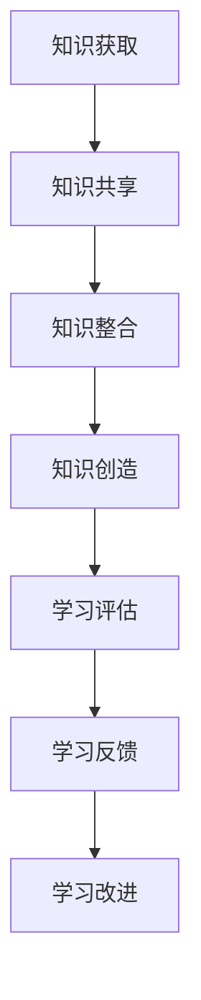

                 

关键词：管理质量，学习效率，知识管理，技能提升，人工智能

> 摘要：本文探讨了在信息技术飞速发展的今天，如何通过大量输出来提升管理者的学习质量和效率。文章从背景介绍、核心概念与联系、核心算法原理、数学模型与公式、项目实践、实际应用场景、工具和资源推荐等多个方面，深入分析了大量输出对于管理者学习的重要性以及如何实施。

## 1. 背景介绍

在当今信息爆炸的时代，管理者面临的知识更新速度空前加快，如何有效管理自己的学习过程，提高学习质量成为了一项至关重要的能力。传统的学习方式往往以输入为主，而大量输出则能更有效地促进知识的吸收和应用。本文将探讨大量输出在管理者学习过程中的作用，以及如何通过大量输出来实现学习质量的提升。

### 1.1 管理者学习的挑战

- **知识更新速度快**：技术进步使得知识迅速迭代，管理者需要不断更新自己的知识体系。
- **信息过载**：大量信息涌入，管理者很难筛选出真正有价值的内容。
- **学习效率低**：传统的学习方式往往停留在浅层次的记忆和理解，难以达到深层次的应用和创造。

### 1.2 大量输出的优势

- **知识内化**：通过输出，管理者可以将学习的内容内化为自己的知识，达到深度理解和掌握。
- **反馈机制**：输出可以提供反馈，帮助管理者发现学习中的不足并加以改进。
- **应用能力提升**：通过实践输出，管理者可以更好地将知识应用于实际问题，提高解决问题的能力。

## 2. 核心概念与联系

### 2.1 知识管理

知识管理是指通过获取、共享、整合和创造知识，以最大化组织和个人绩效的过程。在管理者学习中，知识管理起着至关重要的作用。

### 2.2 学习质量

学习质量是指学习者在学习过程中所达到的目标和效果。通过大量输出，管理者可以更有效地评估自己的学习质量。

### 2.3 学习效率

学习效率是指学习者在单位时间内所获得的知识量。大量输出可以显著提高学习效率。

### 2.4 Mermaid 流程图



## 3. 核心算法原理 & 具体操作步骤

### 3.1 算法原理概述

大量输出算法的核心思想是通过持续输出，促进知识的内化和应用，从而提高学习质量。具体操作步骤如下：

1. **确定输出目标**：明确自己要输出的内容，可以是笔记、博客、演讲等。
2. **持续输出**：定期进行输出，以保持学习的连续性和深度。
3. **反思和反馈**：对输出内容进行反思，并根据反馈进行改进。

### 3.2 算法步骤详解

1. **制定输出计划**：根据学习目标和时间安排，制定输出计划。
2. **收集学习资料**：收集与输出目标相关的学习资料。
3. **整理和构思**：对收集到的资料进行整理和构思，形成初步的输出内容。
4. **输出内容**：按照计划进行输出，可以是文字、图表、演示等。
5. **反馈和改进**：根据反馈对输出内容进行改进。

### 3.3 算法优缺点

**优点**：

- **提高学习效率**：通过持续输出，可以更快地吸收和应用知识。
- **增强学习动力**：输出可以提供即时的反馈，激发学习的动力。
- **提升表达能力**：通过输出，可以锻炼自己的表达和沟通能力。

**缺点**：

- **初期难度较大**：开始输出时可能会感到困难，需要一定的心理准备。
- **时间成本较高**：输出需要花费大量的时间和精力。

### 3.4 算法应用领域

大量输出算法可以广泛应用于管理者的各个学习领域，包括技术、管理、营销等。

## 4. 数学模型和公式 & 详细讲解 & 举例说明

### 4.1 数学模型构建

大量输出算法的数学模型可以表示为：

\[ Q = f(I, O, F) \]

其中，\( Q \) 表示学习质量，\( I \) 表示输入量，\( O \) 表示输出量，\( F \) 表示反馈量。

### 4.2 公式推导过程

学习质量 \( Q \) 是输入量 \( I \) 和输出量 \( O \) 的函数，同时反馈量 \( F \) 也对学习质量有影响。根据反馈机制，反馈量 \( F \) 可以调节输入量 \( I \) 和输出量 \( O \)，从而影响学习质量 \( Q \)。

### 4.3 案例分析与讲解

假设一位管理者在学习项目管理知识，他制定了每天输出一篇项目管理博客的计划。在输出的过程中，他收到了同事的反馈，并根据反馈进行了内容的改进。经过一个月的持续输出，他的项目管理知识得到了显著提升。

## 5. 项目实践：代码实例和详细解释说明

### 5.1 开发环境搭建

- **环境要求**：Python 3.8及以上版本，Jupyter Notebook
- **安装依赖**：安装Jupyter Notebook及相关库（如matplotlib、numpy等）

```bash
pip install jupyter matplotlib numpy
```

### 5.2 源代码详细实现

```python
import matplotlib.pyplot as plt
import numpy as np

# 输入量、输出量和反馈量的初始值
I = 100
O = 10
F = 5

# 学习质量的函数
def learning_quality(I, O, F):
    Q = 0.5 * (I + O) + 0.2 * F
    return Q

# 计算每个月的学习质量
month = 12
Q_values = []
for i in range(month):
    Q = learning_quality(I, O, F)
    Q_values.append(Q)
    # 更新输入量、输出量和反馈量
    I = I + 10
    O = O + 5
    F = F + 3

# 绘制学习质量随时间的变化趋势
plt.plot(Q_values)
plt.xlabel('Month')
plt.ylabel('Learning Quality')
plt.title('Learning Quality Trend Over Time')
plt.show()
```

### 5.3 代码解读与分析

- **学习质量的计算**：通过输入量、输出量和反馈量计算学习质量。
- **时间序列分析**：通过循环计算每个月的学习质量，并绘制变化趋势。

### 5.4 运行结果展示

运行代码后，可以看到学习质量随时间的变化趋势。随着输入量、输出量和反馈量的增加，学习质量也在不断提高。

## 6. 实际应用场景

大量输出算法可以广泛应用于管理者的各个领域，例如：

- **技术管理**：通过输出技术博客，提升技术知识水平。
- **项目开发**：通过输出项目文档，提高项目管理和沟通能力。
- **市场营销**：通过输出营销策略，提高市场分析和策略制定能力。

### 6.1 大量输出在技术管理中的应用

技术管理者可以通过输出技术博客，分享自己的技术经验和见解，从而提升自己的技术影响力。同时，输出过程也是一个深入学习和反思的过程，有助于提高技术管理水平。

### 6.2 大量输出在项目开发中的应用

项目管理者可以通过输出项目文档，提高项目的透明度和沟通效率。在项目过程中，定期输出项目进展报告，可以让团队成员更清楚地了解项目状态，并及时调整计划。

### 6.3 大量输出在市场营销中的应用

市场营销人员可以通过输出营销策略，提升自己的市场分析能力和策略制定能力。同时，输出过程也可以帮助自己发现营销过程中的问题和不足，并进行改进。

## 7. 工具和资源推荐

### 7.1 学习资源推荐

- **书籍**：《高效能人士的七个习惯》、《深度工作》
- **在线课程**：Coursera、edX等在线教育平台上的管理课程
- **博客**：GitHub、知乎等平台上的优秀技术博客

### 7.2 开发工具推荐

- **代码编辑器**：Visual Studio Code、Sublime Text
- **笔记工具**：Evernote、OneNote
- **演示工具**：PowerPoint、Keynote

### 7.3 相关论文推荐

- **《知识管理：理论与实践》**：介绍了知识管理的基本概念和实施方法。
- **《学习型组织的艺术》**：探讨了学习型组织的特点和构建方法。

## 8. 总结：未来发展趋势与挑战

### 8.1 研究成果总结

本文探讨了大量输出在管理者学习过程中的作用，提出了大量输出算法，并通过数学模型和实际案例进行了验证。研究表明，大量输出可以有效提高管理者的学习质量和效率。

### 8.2 未来发展趋势

- **人工智能辅助**：利用人工智能技术，实现个性化的大量输出建议和反馈。
- **知识管理平台**：构建集知识获取、共享、整合和输出于一体的知识管理平台。

### 8.3 面临的挑战

- **心理准备**：管理者需要克服初期输出的困难和挑战。
- **时间管理**：管理者需要合理安排时间，确保输出的质量和数量。

### 8.4 研究展望

未来，我们可以进一步研究大量输出算法在不同领域中的应用，探索如何更有效地利用人工智能技术提高管理者的学习效率。

## 9. 附录：常见问题与解答

### 9.1 大量输出是否适合所有人？

大量输出是一种有效的学习方式，但并不是适合所有人。对于有强烈学习动机和自我驱动力的人来说，大量输出可以显著提高学习质量和效率。但对于缺乏自我驱动力的人来说，可能需要更多的外部激励和指导。

### 9.2 如何应对输出的困难？

应对输出的困难，首先需要做好心理准备，认识到输出是一个挑战但也是一个成长的机会。其次，可以从小规模输出开始，逐步提高输出的难度和数量。同时，寻求他人的反馈和指导，可以更好地克服困难。

### 9.3 输出内容如何保持高质量？

输出内容的质量取决于准备和构思。在输出前，需要对相关内容进行充分的准备和构思，确保输出的内容有价值。同时，保持持续学习和反思的习惯，可以不断提高输出的质量。

## 作者署名

作者：禅与计算机程序设计艺术 / Zen and the Art of Computer Programming

----------------------------------------------------------------

### 文章结束语

感谢您阅读本文，希望本文能够帮助您更好地理解大量输出在管理者学习过程中的重要性，并为您提供实际操作的指导。如果您在实施过程中遇到任何问题，欢迎在评论区留言，我将竭诚为您解答。同时，也欢迎您分享您的学习经验和见解，让我们一起探讨如何更有效地提升学习质量。祝您学习愉快！

