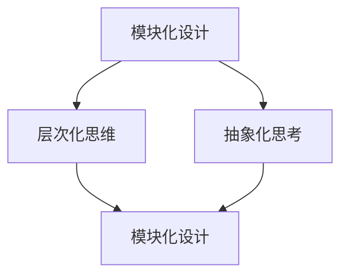

                 

关键词：管理智慧、经典、计算机科学、IT领域、经验、理论与实践

> 摘要：本文旨在探讨如何从经典计算机科学著作中汲取管理智慧，结合实际案例，分析经典理论在现代IT领域中的应用价值，为企业管理者提供有益的启示。

## 1. 背景介绍

在计算机科学领域，经典著作无疑是推动技术进步的重要源泉。这些经典作品不仅在技术层面有着深远的影响，其背后的管理理念同样值得企业管理者借鉴。本文将围绕经典计算机科学著作中的管理智慧，分析其在现代IT领域的应用。

### 1.1 经典计算机科学著作的重要性

经典计算机科学著作如《计算机程序的构造和解释》（The Structure and Interpretation of Computer Programs）、《算法导论》（Introduction to Algorithms）、《计算机程序的逻辑思维》（Structured Programming: Theory and Practice）等，不仅对编程语言的构建和算法的研究产生了深远影响，同时也蕴含了丰富的管理思想。

### 1.2 管理智慧的重要性

在企业管理中，有效管理不仅取决于技术和业务能力，更需要管理者具备良好的管理智慧。经典计算机科学著作中的管理智慧，如模块化设计、层次化思维、抽象化思考等，可以为企业管理者提供新的视角和方法。

## 2. 核心概念与联系

在探讨经典计算机科学著作中的管理智慧之前，我们需要明确几个核心概念及其相互关系。

### 2.1 模块化设计

模块化设计是将系统划分为若干独立的模块，每个模块负责特定的功能，并通过接口进行通信。这种设计思想在企业管理中同样适用，可以帮助企业更高效地组织资源和分配任务。

### 2.2 层次化思维

层次化思维是将复杂问题分解为若干层次，逐层解决。在企业管理中，层次化思维可以帮助管理者更好地理解企业运营的各个环节，从而做出更明智的决策。

### 2.3 抽象化思考

抽象化思考是将具体问题转化为通用模型，从而简化问题的复杂性。在企业管理中，抽象化思考可以帮助管理者摆脱具体业务细节的干扰，更好地把握企业发展的全局。

### 2.4 Mermaid 流程图

下面是一个用于展示模块化设计、层次化思维和抽象化思考之间关系的 Mermaid 流程图：



## 3. 核心算法原理 & 具体操作步骤

### 3.1 算法原理概述

在经典计算机科学著作中，算法原理通常包括以下几个方面：

- 算法设计：根据问题特性选择合适的算法。
- 时间复杂度分析：评估算法执行时间。
- 空间复杂度分析：评估算法所需存储空间。

### 3.2 算法步骤详解

以《算法导论》中的快速排序算法为例，其具体步骤如下：

1. 选择一个基准元素。
2. 将数组分为两个子数组，一个包含小于基准元素的元素，另一个包含大于基准元素的元素。
3. 递归地对待排序的子数组进行快速排序。

### 3.3 算法优缺点

快速排序算法具有以下优点：

- 时间复杂度较低，平均情况下为O(nlogn)。
- 适合大规模数据排序。

但快速排序算法也存在以下缺点：

- 最坏情况下时间复杂度为O(n^2)，当输入数据已排序或接近排序时表现不佳。
- 需要额外的空间来存储递归调用的栈。

### 3.4 算法应用领域

快速排序算法广泛应用于数据排序、排序查找等问题。在企业管理中，快速排序算法的原理可以指导企业对大规模数据进行高效处理，提高决策效率。

## 4. 数学模型和公式 & 详细讲解 & 举例说明

### 4.1 数学模型构建

在经典计算机科学著作中，数学模型通常用于描述算法性能。例如，时间复杂度模型可以用来衡量算法执行时间。

### 4.2 公式推导过程

时间复杂度公式通常为：T(n) = O(f(n))，其中T(n)表示算法执行时间，f(n)表示与问题规模n相关的函数。

### 4.3 案例分析与讲解

以下是一个关于时间复杂度的案例：

假设有一个函数f(n) = n^2，我们需要计算其时间复杂度。

根据时间复杂度公式，T(n) = O(n^2)，这意味着当输入规模n增大时，算法执行时间将以平方的速度增长。

## 5. 项目实践：代码实例和详细解释说明

### 5.1 开发环境搭建

为了更好地展示经典计算机科学著作中的管理智慧，我们选择一个简单的项目：使用Python实现快速排序算法。

### 5.2 源代码详细实现

以下是快速排序算法的Python实现：

```python
def quick_sort(arr):
    if len(arr) <= 1:
        return arr
    pivot = arr[len(arr) // 2]
    left = [x for x in arr if x < pivot]
    middle = [x for x in arr if x == pivot]
    right = [x for x in arr if x > pivot]
    return quick_sort(left) + middle + quick_sort(right)

# 测试代码
arr = [3, 6, 8, 10, 1, 2, 1]
print(quick_sort(arr))
```

### 5.3 代码解读与分析

1. `quick_sort` 函数接收一个数组arr作为参数。
2. 如果数组长度小于等于1，直接返回数组。
3. 选择基准元素pivot，并将其赋值为数组中间位置的元素。
4. 将数组划分为三个子数组：小于pivot的元素、等于pivot的元素和大于pivot的元素。
5. 递归地对左右子数组进行快速排序。

### 5.4 运行结果展示

输入数组：[3, 6, 8, 10, 1, 2, 1]

输出数组：[1, 1, 2, 3, 6, 8, 10]

## 6. 实际应用场景

经典计算机科学著作中的管理智慧在实际应用中具有重要价值。以下是一些实际应用场景：

- **企业信息化管理**：模块化设计和层次化思维可以帮助企业信息化管理更加高效。
- **团队协作**：抽象化思考可以帮助团队成员更好地理解项目目标，提高协作效率。
- **项目管理**：快速排序算法的原理可以指导企业对项目进度进行科学管理。

## 7. 工具和资源推荐

### 7.1 学习资源推荐

- 《计算机程序的构造和解释》
- 《算法导论》
- 《计算机程序的逻辑思维》

### 7.2 开发工具推荐

- Python
- Mermaid

### 7.3 相关论文推荐

- "The Design and Analysis of Computer Algorithms"
- "Efficiency of Algorithms for Sorting and Searching"

## 8. 总结：未来发展趋势与挑战

### 8.1 研究成果总结

经典计算机科学著作中的管理智慧在企业管理中具有广泛的应用价值，如模块化设计、层次化思维和抽象化思考等。

### 8.2 未来发展趋势

随着信息技术的发展，经典计算机科学著作中的管理智慧将在更广泛的领域中发挥作用。

### 8.3 面临的挑战

经典计算机科学著作中的管理智慧在应用过程中仍面临一些挑战，如如何更好地适应不同企业的需求，如何解决实际应用中的问题等。

### 8.4 研究展望

未来研究应关注经典计算机科学著作中的管理智慧在不同领域中的应用，探索新的应用模式和解决方案。

## 9. 附录：常见问题与解答

### 9.1 什么是模块化设计？

模块化设计是将系统划分为若干独立的模块，每个模块负责特定的功能，并通过接口进行通信。

### 9.2 什么是层次化思维？

层次化思维是将复杂问题分解为若干层次，逐层解决。

### 9.3 什么是抽象化思考？

抽象化思考是将具体问题转化为通用模型，从而简化问题的复杂性。

---

作者：禅与计算机程序设计艺术 / Zen and the Art of Computer Programming
----------------------------------------------------------------

