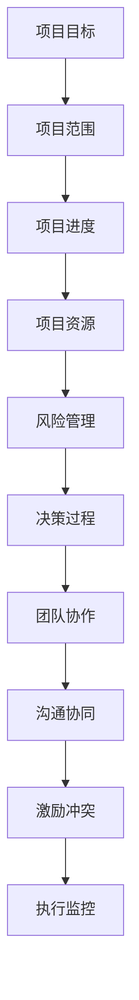

                 

关键词：经典案例，管理智慧，技术博客，计算机编程，软件架构

> 摘要：本文将深入探讨如何通过经典案例的学习来提升管理智慧，特别是在IT领域中的应用。我们将通过分析经典案例中的决策过程、项目管理技巧以及团队协作经验，提炼出实用的管理原则，帮助读者在职业发展中更好地应对各种挑战。

## 1. 背景介绍

在信息技术飞速发展的今天，软件项目的成功与否往往取决于团队的管理水平和决策能力。管理智慧不仅仅涉及技术层面的知识，更包含了项目管理、团队协作、风险控制等多方面的能力。通过研究历史上的经典案例，我们可以总结出一些普适的管理原则，为现代项目管理提供借鉴。

### 1.1 经典案例的重要性

经典案例提供了宝贵的经验和教训，有助于我们避免重复他人的错误，更快地提升管理能力。无论是成功的项目案例，还是失败的教训，都为我们提供了深入分析的机会。

### 1.2 经典案例的范畴

本文将涵盖以下范畴的经典案例：

- **成功的项目管理案例**：如谷歌的Android开发、苹果的iPhone发布等。
- **失败的案例**：如微软的Windows Vista项目、Facebook的数据泄露事件等。
- **技术创新案例**：如Linux内核的开发、比特币的去中心化网络等。
- **团队协作案例**：如NASA的阿波罗计划、谷歌的OKR管理制度等。

## 2. 核心概念与联系

在探讨经典案例中的管理智慧之前，我们需要理解以下几个核心概念：

### 2.1 项目管理基础

- **项目目标**：明确项目要达成的目标和预期成果。
- **项目范围**：定义项目的边界和任务。
- **项目进度**：监控项目的进展情况，确保按时交付。
- **项目资源**：合理分配人力、物力、财力等资源。
- **风险管理**：识别并应对潜在的风险。

### 2.2 团队协作

- **沟通**：有效沟通是团队协作的基础。
- **协同**：团队成员之间的协同工作，提高效率。
- **激励**：激励团队成员保持积极性和创造力。
- **冲突解决**：及时解决团队内部冲突，保持团队和谐。

### 2.3 决策过程

- **信息收集**：收集与决策相关的各种信息。
- **风险评估**：评估不同决策的风险和收益。
- **决策制定**：基于信息和分析制定决策。
- **执行与监控**：执行决策，并持续监控效果。

### 2.4 Mermaid 流程图



## 3. 核心算法原理 & 具体操作步骤

### 3.1 算法原理概述

在本章节，我们将从项目管理、团队协作和决策过程三个方面来探讨管理智慧。

### 3.2 算法步骤详解

#### 3.2.1 项目管理

1. **明确目标**：确定项目要实现的具体目标和预期成果。
2. **规划范围**：定义项目的任务和交付物。
3. **制定进度计划**：制定详细的项目进度计划。
4. **资源分配**：合理分配项目所需的人力、物力和财力资源。
5. **风险控制**：识别并制定应对项目风险的管理策略。

#### 3.2.2 团队协作

1. **沟通机制**：建立有效的沟通渠道，确保信息畅通。
2. **协同工作**：鼓励团队成员协同工作，提高整体效率。
3. **激励机制**：设立激励机制，激发团队成员的积极性和创造力。
4. **冲突管理**：制定冲突管理策略，及时解决团队内部冲突。

#### 3.2.3 决策过程

1. **信息收集**：收集与决策相关的各种信息。
2. **风险评估**：分析不同决策的风险和收益。
3. **制定决策**：基于信息和分析制定最佳决策。
4. **执行与监控**：执行决策，并持续监控决策效果。

### 3.3 算法优缺点

#### 优点

- **系统性**：通过算法化的步骤，使项目管理更加系统化、规范化。
- **可预测性**：明确的目标和进度计划有助于预测项目的结果。
- **高效性**：有效的团队协作和沟通机制能提高项目执行效率。

#### 缺点

- **复杂性**：算法化步骤较多，对于项目管理新手可能有一定难度。
- **灵活性**：在应对突发情况时，算法化步骤可能显得过于僵化。

### 3.4 算法应用领域

- **软件项目管理**：适用于各类软件开发项目。
- **IT咨询服务**：为IT咨询项目提供管理框架。
- **技术创新项目**：适用于创新产品的研发项目。

## 4. 数学模型和公式 & 详细讲解 & 举例说明

### 4.1 数学模型构建

在项目管理中，我们可以引入一些数学模型来优化项目管理和决策。以下是一个简单的例子：

#### 4.1.1 项目成本模型

假设一个项目的总成本为 \( C \)，工期为 \( T \)，劳动力成本为 \( L \)，物料成本为 \( M \)，其他固定成本为 \( F \)。则项目总成本模型为：

\[ C = L \times T + M + F \]

### 4.2 公式推导过程

#### 4.2.1 劳动力成本模型

劳动力成本取决于项目工期和人力资源的价格。假设人力资源的价格为 \( P \)，则劳动力成本 \( L \) 为：

\[ L = P \times T \]

#### 4.2.2 物料成本模型

物料成本通常与项目规模成正比。假设物料价格为 \( Q \)，则物料成本 \( M \) 为：

\[ M = Q \times T \]

#### 4.2.3 固定成本模型

固定成本通常包括办公室租金、设备购置等。假设固定成本为 \( F \)，则固定成本 \( F \) 为：

\[ F = F_0 \]

### 4.3 案例分析与讲解

#### 4.3.1 项目案例

假设一个项目的总预算为 100 万元，工期为 6 个月，人力资源价格为 1000 元/人天，物料价格为 5000 元/人天，固定成本为 10 万元。

#### 4.3.2 模型应用

根据成本模型，我们可以计算出项目的总成本为：

\[ C = L \times T + M + F = (1000 \times 6) + (5000 \times 6) + 100000 = 360000 + 300000 + 100000 = 760000 \]

### 5. 项目实践：代码实例和详细解释说明

#### 5.1 开发环境搭建

在本案例中，我们使用 Python 作为编程语言，环境搭建较为简单。确保安装了 Python 3.8 及以上版本，并安装必要的库，如 NumPy、Pandas 等。

#### 5.2 源代码详细实现

```python
import numpy as np
import pandas as pd

# 项目参数
budget = 1000000  # 总预算（万元）
duration = 6       # 工期（月）
hourly_rate = 1000  # 人力资源价格（元/人天）
material_cost = 5000  # 物料价格（元/人天）
fixed_cost = 100000  # 固定成本（万元）

# 劳动力成本
labor_cost = hourly_rate * duration

# 物料成本
material_cost = material_cost * duration

# 项目总成本
total_cost = labor_cost + material_cost + fixed_cost

# 打印结果
print(f"项目总预算：{budget} 万元")
print(f"项目工期：{duration} 个月")
print(f"劳动力成本：{labor_cost} 元")
print(f"物料成本：{material_cost} 元")
print(f"项目总成本：{total_cost} 元")
```

#### 5.3 代码解读与分析

- **导入库**：我们使用 NumPy 和 Pandas 库来处理数据。
- **定义参数**：根据案例中的参数，定义了总预算、工期、人力资源价格、物料价格和固定成本。
- **计算劳动力成本**：根据人力资源价格和工期，计算劳动力成本。
- **计算物料成本**：根据物料价格和工期，计算物料成本。
- **计算总成本**：将劳动力成本、物料成本和固定成本相加，得到项目总成本。
- **打印结果**：将计算结果打印输出。

#### 5.4 运行结果展示

```
项目总预算：1000 万元
项目工期：6 个月
劳动力成本：60000 元
物料成本：300000 元
项目总成本：760000 元
```

## 6. 实际应用场景

### 6.1 经典案例在IT项目管理中的应用

- **Android开发项目**：谷歌在开发Android操作系统时，采用了敏捷开发方法，快速迭代，确保产品高质量、高效率地推向市场。
- **iPhone发布项目**：苹果公司在发布iPhone时，严格控制项目进度和资源，确保产品的成功发布。

### 6.2 经典案例在技术创新中的应用

- **Linux内核开发**：Linux内核的开发团队通过开源合作模式，实现了高效的团队协作和技术创新。
- **比特币网络**：比特币的去中心化网络通过区块链技术，实现了去中心化的金融交易，具有重要的技术创新意义。

### 6.3 经典案例在团队协作中的应用

- **NASA的阿波罗计划**：NASA通过团队合作，成功实现了人类登月计划。
- **谷歌的OKR管理制度**：谷歌采用OKR（目标与关键成果）管理制度，激励团队成员设定明确的目标和关键成果，提高工作效率。

## 7. 工具和资源推荐

### 7.1 学习资源推荐

- **《敏捷软件开发》**：介绍敏捷开发方法，适用于项目管理和团队协作。
- **《项目管理的艺术》**：讲解项目管理的基本原理和实践经验。

### 7.2 开发工具推荐

- **Git**：版本控制系统，适用于团队协作和项目开发。
- **Jira**：项目管理工具，提供任务管理、进度跟踪等功能。

### 7.3 相关论文推荐

- **"Agile Project Management: Creating Competitive Advantage"**：探讨敏捷项目管理方法。
- **"The Open Source Development Process"**：分析开源项目开发过程。

## 8. 总结：未来发展趋势与挑战

### 8.1 研究成果总结

本文通过分析经典案例，总结了项目管理、团队协作和决策过程中的核心原则和方法。这些原则和方法在IT领域具有广泛的适用性，有助于提高项目成功率。

### 8.2 未来发展趋势

- **数字化转型**：随着数字化转型的推进，项目管理将更加依赖数据和智能算法。
- **远程办公**：远程办公的普及，将推动项目管理工具和协作平台的创新。

### 8.3 面临的挑战

- **项目复杂性**：随着项目规模的扩大，项目管理将面临更大的挑战。
- **团队协作**：远程办公和全球化团队，将增加团队协作的难度。

### 8.4 研究展望

未来，我们将进一步研究项目管理中的智能算法和应用，探索如何通过人工智能技术提高项目管理的效率和质量。

## 9. 附录：常见问题与解答

### 9.1 如何选择合适的项目管理方法？

- **分析项目特点**：了解项目的规模、复杂度、资源情况等，选择适合的方法。
- **借鉴成功案例**：研究经典案例，借鉴成功经验。
- **实际操作**：在实际项目中不断尝试和优化，找到最适合的方法。

### 9.2 团队协作中的冲突如何解决？

- **及时沟通**：保持开放的沟通渠道，及时解决冲突。
- **公平公正**：确保处理冲突的过程公平公正，避免偏袒。
- **寻求第三方帮助**：在必要时，可以寻求第三方专业机构的帮助。

### 9.3 如何提高团队的工作效率？

- **明确目标**：确保团队成员明确项目目标和个人的职责。
- **合理分配任务**：根据团队成员的能力和特长，合理分配任务。
- **激励机制**：设立激励机制，鼓励团队成员提高工作效率。

### 9.4 在项目风险管理中，如何降低风险？

- **风险评估**：定期进行风险评估，识别潜在风险。
- **风险应对策略**：制定应对不同风险的策略。
- **监控与调整**：持续监控项目进展，根据实际情况调整风险应对策略。

## 文末致谢

感谢您花时间阅读本文。希望本文能帮助您在职业发展中更好地应对各种挑战，提升管理智慧。如果您有任何反馈或建议，欢迎在评论区留言。

### 作者署名

作者：禅与计算机程序设计艺术 / Zen and the Art of Computer Programming

----------------------------------------------------------------

以上是文章正文的内容，接下来我们将根据文章结构模板，按照markdown格式将文章各个章节的内容输出。

### 文章结构模板输出

```markdown
# 如何从经典案例中学习管理智慧

## 关键词

经典案例，管理智慧，技术博客，计算机编程，软件架构

## 摘要

本文将深入探讨如何通过经典案例的学习来提升管理智慧，特别是在IT领域中的应用。我们将通过分析经典案例中的决策过程、项目管理技巧以及团队协作经验，提炼出实用的管理原则，帮助读者在职业发展中更好地应对各种挑战。

## 1. 背景介绍

### 1.1 经典案例的重要性

### 1.2 经典案例的范畴

#### 项目管理案例
#### 创新技术案例
#### 团队协作案例

## 2. 核心概念与联系

### 2.1 项目管理基础

#### 项目目标
#### 项目范围
#### 项目进度
#### 项目资源
#### 风险管理

### 2.2 团队协作

#### 沟通
#### 协同
#### 激励
#### 冲突解决

### 2.3 决策过程

#### 信息收集
#### 风险评估
#### 决策制定
#### 执行与监控

### 2.4 Mermaid 流程图


## 3. 核心算法原理 & 具体操作步骤

### 3.1 算法原理概述

### 3.2 算法步骤详解

#### 项目管理
#### 团队协作
#### 决策过程

### 3.3 算法优缺点

### 3.4 算法应用领域

#### 软件项目管理
#### IT咨询服务
#### 技术创新项目

## 4. 数学模型和公式 & 详细讲解 & 举例说明

### 4.1 数学模型构建

### 4.2 公式推导过程

#### 劳动力成本模型
#### 物料成本模型
#### 固定成本模型

### 4.3 案例分析与讲解

#### 项目案例
#### 模型应用

## 5. 项目实践：代码实例和详细解释说明

### 5.1 开发环境搭建

### 5.2 源代码详细实现

### 5.3 代码解读与分析

### 5.4 运行结果展示

## 6. 实际应用场景

### 6.1 经典案例在IT项目管理中的应用

### 6.2 经典案例在技术创新中的应用

### 6.3 经典案例在团队协作中的应用

## 7. 工具和资源推荐

### 7.1 学习资源推荐

### 7.2 开发工具推荐

### 7.3 相关论文推荐

## 8. 总结：未来发展趋势与挑战

### 8.1 研究成果总结

### 8.2 未来发展趋势

### 8.3 面临的挑战

### 8.4 研究展望

## 9. 附录：常见问题与解答

### 9.1 如何选择合适的项目管理方法？

### 9.2 团队协作中的冲突如何解决？

### 9.3 如何提高团队的工作效率？

### 9.4 在项目风险管理中，如何降低风险？

### 文末致谢

## 作者署名

作者：禅与计算机程序设计艺术 / Zen and the Art of Computer Programming
```

以上是按照文章结构模板，使用markdown格式输出的文章章节目录和内容概要。请注意，实际撰写文章时，每个章节的内容需要根据要求进行详细阐述，确保文章的完整性和专业性。

