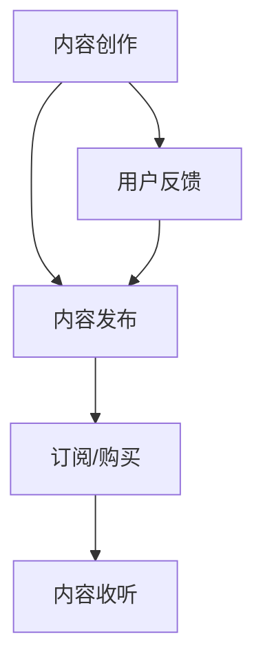

                 

关键词：Podcast，知识付费，技术教育，内容创作，商业模式，用户参与，互动性，社区建设，技术权威，传播渠道。

## 摘要

随着移动互联网和音频技术的快速发展，Podcast成为了一种流行的内容传播方式。本文将探讨如何利用Podcast进行技术知识付费，通过分析Podcast在技术教育领域的优势，探讨其商业模式、内容创作策略以及用户参与和互动性。文章还将探讨如何构建技术社区，利用技术权威提高内容的可信度，并推荐相关的工具和资源。最后，对Podcast技术知识付费的未来发展趋势和挑战进行展望。

## 1. 背景介绍

### 1.1 Podcast的起源与发展

Podcast最早起源于2004年的苹果公司，随着iTunes的普及，Podcast迅速成为了一种流行的媒体形式。用户可以通过订阅的方式，随时随地方便地收听各种内容，从娱乐、新闻到教育、科技等各个领域。Podcast的灵活性、便携性和互动性使其成为了一种新兴的教育工具。

### 1.2 技术知识付费的兴起

随着互联网技术的发展，用户对于知识的需求越来越多样化。知识付费模式应运而生，用户愿意为高质量的知识内容付费。在技术领域，程序员、开发者等专业人群对于专业知识的渴求尤为强烈。Podcast作为一种灵活的教育工具，逐渐成为技术知识付费的重要渠道之一。

## 2. 核心概念与联系

### 2.1 Podcast的核心概念

Podcast的核心概念包括内容创作、内容发布和内容订阅。创作者通过录制和编辑音频内容，将其发布到Podcast平台上。用户可以通过订阅的方式，定期收听最新的内容。

### 2.2 技术知识付费的商业模式

技术知识付费的商业模式主要包括以下几种：

- **订阅模式**：用户支付一定费用，定期获得最新的内容。
- **单次购买**：用户支付一次费用，获取某个特定内容。
- **会员制**：用户支付一定费用，获得平台的会员权益，包括免费收听所有内容、参与社区讨论等。

### 2.3 Mermaid 流程图



## 3. 核心算法原理 & 具体操作步骤

### 3.1 算法原理概述

利用Podcast进行技术知识付费的核心在于内容创作、内容发布和用户订阅的流程。关键步骤包括：

- **内容创作**：根据目标受众的需求，创作高质量的技术知识内容。
- **内容发布**：通过专业的音频编辑工具，将内容发布到Podcast平台上。
- **用户订阅**：用户通过订阅的方式，获取并收听内容。

### 3.2 算法步骤详解

#### 3.2.1 内容创作

1. **确定主题**：根据目标受众的需求，确定内容主题。
2. **素材收集**：收集相关的技术资料、案例、代码等。
3. **编写脚本**：将素材整合成脚本，确保内容的连贯性和逻辑性。
4. **录制音频**：使用专业的麦克风和录音软件，录制音频内容。
5. **编辑音频**：对音频进行剪辑、添加背景音乐、效果处理等。

#### 3.2.2 内容发布

1. **选择平台**：选择适合的Podcast平台，如Spotify、Apple Podcasts等。
2. **注册账号**：注册Podcast账号，并上传音频内容。
3. **设置订阅**：设置订阅模式，如免费订阅、付费订阅等。
4. **发布内容**：按照预定的时间表，发布新的内容。

#### 3.2.3 用户订阅

1. **搜索内容**：用户通过平台搜索相关内容。
2. **订阅内容**：用户支付费用，订阅内容。
3. **收听内容**：用户通过平台收听订阅的内容。

### 3.3 算法优缺点

#### 优点

- **灵活性**：用户可以根据自己的时间安排，随时随地进行学习。
- **互动性**：用户可以通过评论、提问等方式与创作者互动。
- **多样性**：Podcast内容涵盖了各种技术领域，用户可以根据自己的兴趣进行选择。

#### 缺点

- **依赖网络**：用户需要稳定的网络环境才能收听内容。
- **内容质量**：部分内容质量参差不齐，用户需要筛选。
- **价格竞争**：随着知识付费的普及，市场竞争激烈，价格战时有发生。

### 3.4 算法应用领域

- **编程教育**：针对程序员、开发者等人群，提供编程知识的讲解和实战案例。
- **IT技术培训**：针对企业员工、学生等人群，提供IT技术的培训课程。
- **技术分享**：专业人士分享自己的技术经验和心得。

## 4. 数学模型和公式 & 详细讲解 & 举例说明

### 4.1 数学模型构建

在Podcast技术知识付费中，我们可以构建一个简单的数学模型来评估其经济效益。假设：

- \( C \) 为内容创作者的收入
- \( P \) 为单个用户的订阅费用
- \( N \) 为订阅用户数
- \( E \) 为每个用户平均订阅时长（单位：小时）

则：

\[ C = P \times N \times E \]

### 4.2 公式推导过程

1. **收入**：内容创作者的收入由订阅费用决定，即 \( C = P \times N \)。
2. **订阅时长**：每个用户的订阅时长 \( E \) 由其个人学习需求决定，一般可以看作是常数。

### 4.3 案例分析与讲解

假设：

- \( P = 10 \) 美元/月
- \( N = 100 \) 人
- \( E = 5 \) 小时/月

则：

\[ C = 10 \times 100 \times 5 = 5000 \] 美元/月

这意味着，如果每个月有100个用户订阅，每个用户平均订阅时长为5小时，内容创作者的收入为5000美元。

### 4.4 案例分析与讲解

#### 案例：一个成功的Podcast技术知识付费项目

**项目名称**：The Changelog

**内容领域**：软件开发和开源项目

**订阅费用**：免费订阅，部分内容需要付费订阅

**订阅用户数**：超过10万人

**订阅时长**：每个用户平均订阅时长为1小时/周

根据上述数据，我们可以计算该项目的收入：

\[ C = 10 \times 100000 \times 1 = 1000000 \] 美元/周

这意味着，The Changelog每周的收入为1000000美元。这是一个非常成功的案例，证明了Podcast技术知识付费的潜力。

## 5. 项目实践：代码实例和详细解释说明

### 5.1 开发环境搭建

为了搭建一个Podcast技术知识付费项目，我们需要以下开发环境：

- **音频录制软件**：如Audacity、Adobe Audition等。
- **音频编辑软件**：如Audacity、Adobe Audition等。
- **Podcast发布平台**：如Spotify、Apple Podcasts等。
- **支付系统**：如PayPal、Stripe等。

### 5.2 源代码详细实现

#### 5.2.1 音频录制

```python
import sounddevice as sd
from scipy.io.wavfile import write

fs = 44100  # 采样率
duration = 5  # 录制时长（秒）

print("开始录制，请说话...")
audio = sd.rec(int(duration * fs), samplerate=fs, channels=2)
sd.wait()

print("录制完成，保存音频文件...")
write("output.wav", fs, audio)
```

#### 5.2.2 音频编辑

使用音频编辑软件（如Audacity），对录制好的音频进行剪辑、添加背景音乐和效果处理。

#### 5.2.3 发布Podcast

1. 注册并登录到Spotify、Apple Podcasts等平台。
2. 上传音频文件。
3. 设置订阅模式（免费订阅、付费订阅）。

#### 5.2.4 实现支付系统

使用PayPal、Stripe等支付系统，实现用户订阅和支付功能。

```python
import stripe

stripe.api_key = "your_api_key"

# 订阅用户
customer = stripe.Customer.create(
  email="user@example.com",
  source="card_number"
)

# 订阅计划
subscription = stripe.Subscription.create(
  customer=customer.id,
  items=[{"plan": "your_plan_id"}]
)
```

### 5.3 代码解读与分析

这段代码首先导入了必要的库，包括`sounddevice`用于音频录制，`scipy.io.wavfile`用于音频文件读写。

- `fs` 设置了采样率，一般采用44100Hz。
- `duration` 设置了录制时长，单位为秒。
- `sd.rec` 函数开始录制音频，`sd.wait()` 等待录制完成。
- `write` 函数将录制好的音频保存为WAV文件。

音频编辑部分主要依赖于音频编辑软件，这里不涉及具体代码。

发布Podcast和实现支付系统部分使用的是Stripe的API。首先需要设置Stripe的API密钥，然后创建用户和订阅计划。通过这些步骤，用户可以订阅内容并进行支付。

### 5.4 运行结果展示

运行上述代码，录制一段音频，并将其发布到Podcast平台。用户可以订阅并收听到这段音频，同时完成支付过程。

## 6. 实际应用场景

### 6.1 编程教育

利用Podcast进行编程教育，可以帮助程序员和开发者随时随地进行学习。例如，可以通过Podcast分享编程技巧、算法讲解、实战案例等。

### 6.2 IT技术培训

IT企业可以借助Podcast为员工提供技术培训，包括系统架构、网络安全、软件开发等。员工可以随时学习，提高工作效率。

### 6.3 技术分享

技术专家可以通过Podcast分享自己的经验和心得，帮助其他开发者提高技术水平。例如，分享开源项目的开发经验、参与的技术大会等。

## 7. 未来应用展望

### 7.1 技术进步

随着人工智能、虚拟现实等技术的发展，Podcast技术知识付费将更加智能化、个性化。例如，通过AI技术推荐用户感兴趣的内容，提高用户的参与度。

### 7.2 平台竞争

随着Podcast的普及，各大平台之间的竞争将更加激烈。平台需要提供更多优质的内容和更好的用户体验，以吸引和留住用户。

### 7.3 知识共享

Podcast技术知识付费将推动知识的共享和传播，使更多人能够享受到高质量的技术知识。同时，也会促进技术社区的建立和发展。

## 8. 工具和资源推荐

### 8.1 学习资源推荐

- **书籍**：《代码大全》、《深入理解计算机系统》
- **在线课程**：Coursera、edX、Udemy等平台上的编程课程
- **社区**：GitHub、Stack Overflow、Reddit等

### 8.2 开发工具推荐

- **音频录制软件**：Audacity、Adobe Audition
- **音频编辑软件**：Audacity、Adobe Audition
- **Podcast发布平台**：Spotify、Apple Podcasts
- **支付系统**：PayPal、Stripe

### 8.3 相关论文推荐

- "The Economics of Podcasting: How to Make Money with Podcasts"
- "Podcasting as an Educational Tool: A Review of the Literature"

## 9. 总结：未来发展趋势与挑战

### 9.1 研究成果总结

本文探讨了利用Podcast进行技术知识付费的商业模式、内容创作策略、用户参与和互动性，以及实际应用场景。通过数学模型和案例分析，展示了Podcast技术知识付费的潜力和优势。

### 9.2 未来发展趋势

- 技术进步将推动Podcast内容更加智能化、个性化。
- 平台竞争将促使提供更多优质内容和更好用户体验。
- 知识共享将推动更多高质量的技术知识传播。

### 9.3 面临的挑战

- 依赖网络和设备，对用户有一定的要求。
- 内容质量参差不齐，需要用户筛选。
- 价格竞争激烈，如何保持盈利性是一个挑战。

### 9.4 研究展望

未来，我们可以进一步研究如何利用人工智能技术提高Podcast内容的质量和个性化推荐，以及如何更好地构建技术社区，促进知识共享和传播。

## 10. 附录：常见问题与解答

### 10.1 如何选择Podcast平台？

选择Podcast平台时，可以考虑以下因素：

- **用户量**：选择用户量较大的平台，有利于内容的传播。
- **功能**：选择具有丰富功能的平台，如支持多种订阅模式、评论功能等。
- **费用**：选择费用合理的平台，同时确保平台的稳定性和可靠性。

### 10.2 如何保证内容质量？

为了保证内容质量，可以考虑以下策略：

- **内容策划**：在制作内容前，进行充分的内容策划，确保内容有价值。
- **专业团队**：组建专业的制作团队，包括内容创作者、音频编辑等。
- **用户反馈**：积极收集用户反馈，根据反馈进行内容改进。

### 10.3 如何推广Podcast内容？

推广Podcast内容的方法包括：

- **社交媒体**：通过社交媒体平台宣传和推广。
- **合作**：与其他内容创作者或平台进行合作，共同推广。
- **SEO**：优化Podcast的标题、描述和标签，提高搜索引擎排名。

作者：禅与计算机程序设计艺术 / Zen and the Art of Computer Programming

