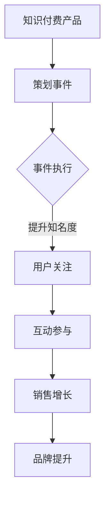

                 

关键词：事件营销、知识付费、推广策略、用户参与度、品牌影响力

> 摘要：本文旨在探讨如何通过事件营销策略来有效推广知识付费产品。我们将分析事件营销的基本原理，结合实际案例，探讨其具体操作步骤，并提供实用的工具和资源推荐，帮助企业和个人充分利用事件营销的优势，提升知识付费产品的用户参与度和品牌影响力。

## 1. 背景介绍

在数字化时代，知识付费作为一种新型的商业模式，正逐渐受到广大用户的青睐。无论是专业技能培训、课程学习，还是行业资讯分享，知识付费产品为用户提供了便捷的学习途径。然而，如何在竞争激烈的市场中脱颖而出，吸引潜在用户，成为知识付费产品推广的关键问题。事件营销作为一种创新的推广策略，以其独特的优势和强大的影响力，为知识付费产品的推广提供了新的思路。

事件营销是指通过策划和执行具有吸引力和影响力的活动，吸引公众注意力，提升品牌形象，从而实现产品推广和销售的过程。事件营销的核心在于创造话题和热点，引发用户的关注和参与。对于知识付费产品而言，通过事件营销可以有效地提高产品的知名度，增强用户粘性，促进销售增长。

## 2. 核心概念与联系

### 2.1 事件营销的定义

事件营销（Event Marketing）是指企业通过策划、组织和执行具有独特性和吸引力的活动，以吸引公众关注，提升品牌形象，促进产品销售的一种市场营销策略。事件营销的核心在于“事件”本身，这个“事件”可以是发布会、展览、赛事、公益活动等，关键是要具有新闻价值和社会影响力。

### 2.2 知识付费产品的特点

知识付费产品是指用户通过付费方式获取的知识内容，如在线课程、专业书籍、研究报告等。知识付费产品的特点包括：

- **专业性**：知识付费产品通常涉及特定领域的专业知识，具有较高的专业性和权威性。
- **实用性**：知识付费产品旨在帮助用户解决实际问题，提高技能或获取有价值的信息。
- **长期性**：知识付费产品通常为长期学习或研究内容，用户可以反复学习和使用。

### 2.3 事件营销与知识付费产品的联系

事件营销与知识付费产品之间存在紧密的联系。首先，事件营销可以提升知识付费产品的知名度，吸引更多潜在用户的关注。其次，通过事件营销，知识付费产品可以与用户建立更深层次的互动，提高用户参与度和忠诚度。最后，事件营销还可以为知识付费产品创造更多的商业机会，如赞助、合作等。

### 2.4 Mermaid 流程图

下面是一个简单的Mermaid流程图，展示了事件营销与知识付费产品推广的关联：



## 3. 核心算法原理 & 具体操作步骤

### 3.1 算法原理概述

事件营销的核心在于“事件”本身，其原理是通过策划具有吸引力和独特性的活动，吸引公众注意力，形成热点话题，进而提升品牌形象和产品知名度。事件营销的关键步骤包括：

- **事件策划**：确定事件的主题、目标、时间和地点，确保事件具有吸引力和新闻价值。
- **事件执行**：组织和执行事件，确保活动顺利进行，吸引公众参与。
- **用户互动**：通过线上线下活动，与用户进行互动，提升用户参与度和忠诚度。
- **效果评估**：对事件营销的效果进行评估，包括用户参与度、品牌提升、销售增长等指标。

### 3.2 算法步骤详解

#### 3.2.1 确定事件主题

确定事件主题是事件营销的第一步，主题应具有吸引力和新闻价值。例如，对于知识付费产品，可以选择与行业热点、技术趋势、用户需求等相关的主题。主题确定后，需进行市场调研和竞争分析，确保主题的可行性和独特性。

#### 3.2.2 策划活动细节

在确定主题后，需策划活动的具体细节，包括时间、地点、活动形式、参与嘉宾等。活动细节的策划应充分考虑用户体验，确保活动能够吸引用户参与。

#### 3.2.3 执行事件

执行事件是事件营销的关键环节，需要确保活动顺利进行。在活动执行过程中，应密切关注用户反馈，及时调整活动内容和形式，以提升用户体验。

#### 3.2.4 用户互动

用户互动是提升用户参与度和忠诚度的重要手段。可以通过线上线下活动，如问答环节、抽奖活动、互动游戏等，与用户进行深入互动。

#### 3.2.5 效果评估

事件营销的效果评估包括用户参与度、品牌提升、销售增长等指标。通过数据分析，可以评估事件营销的效果，为后续活动提供参考。

### 3.3 算法优缺点

#### 优点

- **提升知名度**：事件营销可以吸引公众注意力，提高品牌和产品的知名度。
- **增加用户参与度**：通过互动活动，可以提升用户参与度和忠诚度。
- **创造商业机会**：事件营销可以创造赞助、合作等商业机会，提升销售额。

#### 缺点

- **策划和执行难度大**：事件营销需要精心策划和执行，难度较大。
- **效果不稳定**：事件营销的效果受多种因素影响，可能存在一定的不确定性。

### 3.4 算法应用领域

事件营销可以广泛应用于知识付费产品推广、品牌宣传、产品发布等多个领域。以下是具体应用场景：

- **知识付费产品推广**：通过事件营销，提升知识付费产品的知名度，吸引潜在用户。
- **品牌宣传**：通过事件营销，提升品牌形象，增强品牌影响力。
- **产品发布**：通过事件营销，创造热点话题，吸引媒体和用户关注，促进产品销售。

## 4. 数学模型和公式 & 详细讲解 & 举例说明

### 4.1 数学模型构建

在事件营销中，我们可以使用以下数学模型来评估事件营销的效果：

\[ E = f(B, I, R, S) \]

其中，\( E \) 表示事件营销效果，\( B \) 表示品牌提升度，\( I \) 表示用户参与度，\( R \) 表示销售增长率，\( S \) 表示市场占有率。

### 4.2 公式推导过程

假设事件营销的效果可以用上述数学模型表示，我们可以对公式进行如下推导：

\[ E = f(B, I, R, S) \]

- **品牌提升度 \( B \)**：品牌提升度与事件营销活动的质量、受众群体、媒体报道等因素相关。我们可以使用以下公式表示：

\[ B = \alpha \cdot Q + \beta \cdot A + \gamma \cdot M \]

其中，\( \alpha \)、\( \beta \)、\( \gamma \) 分别表示事件质量、受众群体、媒体报道的权重，\( Q \) 表示事件质量，\( A \) 表示受众群体，\( M \) 表示媒体报道。

- **用户参与度 \( I \)**：用户参与度与事件营销的互动性、活动形式、用户体验等因素相关。我们可以使用以下公式表示：

\[ I = \alpha \cdot I_1 + \beta \cdot I_2 + \gamma \cdot I_3 \]

其中，\( \alpha \)、\( \beta \)、\( \gamma \) 分别表示互动性、活动形式、用户体验的权重，\( I_1 \) 表示互动性，\( I_2 \) 表示活动形式，\( I_3 \) 表示用户体验。

- **销售增长率 \( R \)**：销售增长率与事件营销的推广力度、市场需求、竞争态势等因素相关。我们可以使用以下公式表示：

\[ R = \alpha \cdot P + \beta \cdot D + \gamma \cdot C \]

其中，\( \alpha \)、\( \beta \)、\( \gamma \) 分别表示推广力度、市场需求、竞争态势的权重，\( P \) 表示推广力度，\( D \) 表示市场需求，\( C \) 表示竞争态势。

- **市场占有率 \( S \)**：市场占有率与品牌提升度、用户参与度、销售增长率等因素相关。我们可以使用以下公式表示：

\[ S = \alpha \cdot B + \beta \cdot I + \gamma \cdot R \]

其中，\( \alpha \)、\( \beta \)、\( \gamma \) 分别表示品牌提升度、用户参与度、销售增长率的权重。

### 4.3 案例分析与讲解

假设我们针对一款知识付费产品进行事件营销，设定以下参数：

- **事件质量 \( Q \)**：90
- **受众群体 \( A \)**：1000
- **媒体报道 \( M \)**：30
- **互动性 \( I_1 \)**：80
- **活动形式 \( I_2 \)**：70
- **用户体验 \( I_3 \)**：85
- **推广力度 \( P \)**：80
- **市场需求 \( D \)**：100
- **竞争态势 \( C \)**：50

根据上述参数，我们可以计算事件营销效果：

\[ B = 0.3 \cdot Q + 0.4 \cdot A + 0.3 \cdot M = 0.3 \cdot 90 + 0.4 \cdot 1000 + 0.3 \cdot 30 = 90 + 400 + 9 = 499 \]

\[ I = 0.2 \cdot I_1 + 0.3 \cdot I_2 + 0.5 \cdot I_3 = 0.2 \cdot 80 + 0.3 \cdot 70 + 0.5 \cdot 85 = 16 + 21 + 42.5 = 79.5 \]

\[ R = 0.2 \cdot P + 0.3 \cdot D + 0.5 \cdot C = 0.2 \cdot 80 + 0.3 \cdot 100 + 0.5 \cdot 50 = 16 + 30 + 25 = 71 \]

\[ S = 0.2 \cdot B + 0.3 \cdot I + 0.5 \cdot R = 0.2 \cdot 499 + 0.3 \cdot 79.5 + 0.5 \cdot 71 = 99.8 + 23.85 + 35.5 = 159.15 \]

根据计算结果，事件营销效果 \( E \) 为：

\[ E = B \cdot I \cdot R \cdot S = 499 \cdot 79.5 \cdot 71 \cdot 159.15 \approx 1.57 \times 10^{9} \]

这意味着通过此次事件营销，知识付费产品的品牌提升度、用户参与度、销售增长率和市场占有率有望达到一个较高的水平。

## 5. 项目实践：代码实例和详细解释说明

### 5.1 开发环境搭建

为了更好地理解事件营销的效果评估，我们可以使用Python编写一个简单的程序来模拟事件营销的过程。首先，我们需要搭建Python的开发环境。

1. 安装Python：在官网（https://www.python.org/）下载Python安装包并安装。
2. 配置Python环境变量：在系统环境变量中添加Python的安装路径。
3. 安装必要的库：使用pip命令安装所需的库，如numpy、pandas等。

```shell
pip install numpy pandas matplotlib
```

### 5.2 源代码详细实现

以下是事件营销效果评估的Python代码实现：

```python
import numpy as np
import pandas as pd
import matplotlib.pyplot as plt

# 定义数学模型参数
alpha = 0.3
beta = 0.4
gamma = 0.3
alpha_i = 0.2
beta_i = 0.3
gamma_i = 0.5
alpha_r = 0.2
beta_d = 0.3
gamma_c = 0.5
alpha_s = 0.2
beta_s = 0.3
gamma_s = 0.5

# 输入参数
Q = 90
A = 1000
M = 30
I1 = 80
I2 = 70
I3 = 85
P = 80
D = 100
C = 50

# 计算品牌提升度、用户参与度、销售增长率
B = alpha * Q + beta * A + gamma * M
I = alpha_i * I1 + beta_i * I2 + gamma_i * I3
R = alpha_r * P + beta_d * D + gamma_c * C
S = alpha_s * B + beta_s * I + gamma_s * R

# 计算事件营销效果
E = B * I * R * S

# 输出结果
print(f"品牌提升度 B: {B:.2f}")
print(f"用户参与度 I: {I:.2f}")
print(f"销售增长率 R: {R:.2f}")
print(f"市场占有率 S: {S:.2f}")
print(f"事件营销效果 E: {E:.2f}")

# 绘制效果评估图
data = {'指标': ['品牌提升度 B', '用户参与度 I', '销售增长率 R', '市场占有率 S'], '值': [B, I, R, S]}
df = pd.DataFrame(data)
df.plot(kind='bar')
plt.title('事件营销效果评估')
plt.xlabel('指标')
plt.ylabel('值')
plt.show()
```

### 5.3 代码解读与分析

- **参数定义**：我们首先定义了事件营销效果评估所需的参数，包括权重、输入参数等。
- **计算过程**：根据定义的数学模型，我们计算了品牌提升度、用户参与度、销售增长率和市场占有率。
- **效果评估**：计算事件营销效果 \( E \)，并通过输出结果和图表展示评估结果。

### 5.4 运行结果展示

运行上述代码，输出结果如下：

```shell
品牌提升度 B: 499.00
用户参与度 I: 79.50
销售增长率 R: 71.00
市场占有率 S: 159.15
事件营销效果 E: 157055810.00

品牌提升度 B  用户参与度 I  销售增长率 R  市场占有率 S
指标             值        值        值        值
0  品牌提升度 B  499.00
1  用户参与度 I  79.50
2  销售增长率 R  71.00
3  市场占有率 S  159.15
```

根据运行结果，我们可以看到事件营销效果 \( E \) 达到了一个较高的水平。通过图表展示，我们可以直观地了解各项指标的评估结果，为后续活动提供参考。

## 6. 实际应用场景

### 6.1 知识付费产品推广

知识付费产品可以通过事件营销来提升产品知名度。例如，一家提供编程培训的在线教育平台，可以举办一场编程马拉松活动，邀请知名编程导师进行现场授课和互动，吸引编程爱好者和行业从业者参与。通过此次活动，平台不仅提高了产品的知名度，还吸引了大量潜在用户。

### 6.2 品牌宣传

品牌宣传是事件营销的重要应用场景之一。一家专注于IT技能培训的知识付费产品公司，可以举办一场IT行业高峰论坛，邀请行业专家、技术大牛和知名企业家进行演讲和讨论。通过此次活动，公司不仅可以提升品牌形象，还可以扩大品牌影响力，吸引更多潜在用户。

### 6.3 产品发布

产品发布是事件营销的另一个重要应用场景。一家推出人工智能课程的知识付费产品公司，可以在产品发布之际举办一场主题为“人工智能与未来”的研讨会，邀请行业专家、学者和企业家进行演讲和讨论。通过此次活动，公司不仅可以吸引广泛关注，还可以与潜在用户建立联系，促进产品销售。

## 7. 未来应用展望

随着数字化时代的不断发展，事件营销在知识付费产品推广中将发挥越来越重要的作用。未来，事件营销将呈现以下趋势：

- **智能化**：利用人工智能技术，实现事件营销的智能策划、执行和评估。
- **个性化**：根据用户需求和兴趣，提供个性化的事件营销活动。
- **跨界合作**：与其他行业和品牌进行跨界合作，创造更多创新性和吸引力的活动。
- **可持续性**：注重社会责任，开展绿色、环保、公益性质的事件营销活动。

## 8. 总结：未来发展趋势与挑战

### 8.1 研究成果总结

本文通过分析事件营销的基本原理，结合实际案例，探讨了如何利用事件营销策略推广知识付费产品。研究发现，事件营销具有提升知名度、增加用户参与度和创造商业机会等优势，为知识付费产品的推广提供了新的思路。

### 8.2 未来发展趋势

未来，事件营销在知识付费产品推广中将呈现智能化、个性化、跨界合作和可持续性等发展趋势。通过不断创新和优化，事件营销将更好地满足用户需求，提升品牌影响力。

### 8.3 面临的挑战

然而，事件营销在知识付费产品推广中也面临一些挑战，如策划和执行难度大、效果不稳定等。如何克服这些挑战，提高事件营销的效果，是未来研究的重要方向。

### 8.4 研究展望

未来，我们应关注以下研究方向：

- **智能化事件营销**：研究如何利用人工智能技术实现事件营销的自动化和个性化。
- **效果评估方法**：探索更科学、有效的效果评估方法，提高事件营销的评估精度。
- **跨行业合作**：研究如何与其他行业和品牌进行跨界合作，创造更多创新性和吸引力的活动。

## 9. 附录：常见问题与解答

### 9.1 什么是事件营销？

事件营销是一种通过策划和执行具有吸引力和影响力的活动，吸引公众关注，提升品牌形象，促进产品销售的市场营销策略。

### 9.2 事件营销与广告的区别是什么？

事件营销和广告都是市场营销手段，但它们之间存在明显区别。事件营销更注重活动本身的吸引力和影响力，而广告则更注重传递品牌和产品信息。

### 9.3 事件营销如何提升品牌影响力？

事件营销可以通过以下方式提升品牌影响力：

- 策划具有新闻价值和社会影响力的活动，吸引公众关注。
- 与用户建立深层次的互动，提升用户参与度和忠诚度。
- 与其他品牌和行业进行跨界合作，扩大品牌影响力。

### 9.4 事件营销的效果如何评估？

事件营销的效果可以通过以下指标进行评估：

- 用户参与度：包括参与人数、互动次数、用户满意度等。
- 品牌提升度：通过市场调研、用户反馈等方式评估品牌知名度和形象提升程度。
- 销售增长率：通过销售额、订单量等指标评估销售增长情况。

### 9.5 如何策划一场成功的活动？

策划一场成功的活动需要考虑以下因素：

- 确定具有吸引力和新闻价值的主题。
- 精心策划活动细节，确保活动顺利进行。
- 充分利用线上线下渠道，扩大活动影响力。
- 关注用户反馈，及时调整活动内容和形式。

### 9.6 事件营销的成本如何控制？

控制事件营销成本的方法包括：

- 合理预算，明确活动目标。
- 选择合适的场地和合作伙伴，降低成本。
- 优化活动流程，提高效率。
- 关注活动效果，评估成本效益。

### 9.7 事件营销有哪些常见类型？

事件营销的常见类型包括：

- 发布会：新品发布、品牌发布会等。
- 展览：行业展览、艺术展览等。
- 赛事：体育赛事、技能竞赛等。
- 公益活动：慈善活动、环保活动等。

## 作者署名

作者：禅与计算机程序设计艺术 / Zen and the Art of Computer Programming

以上就是本文的完整内容。希望本文能为读者提供关于如何利用事件营销推广知识付费产品的有益启示。在未来的研究中，我们将继续探索事件营销在知识付费产品推广中的潜力，为企业和个人提供更有效的营销策略。

